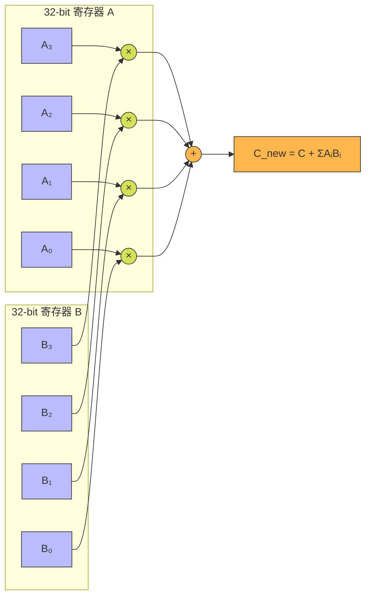
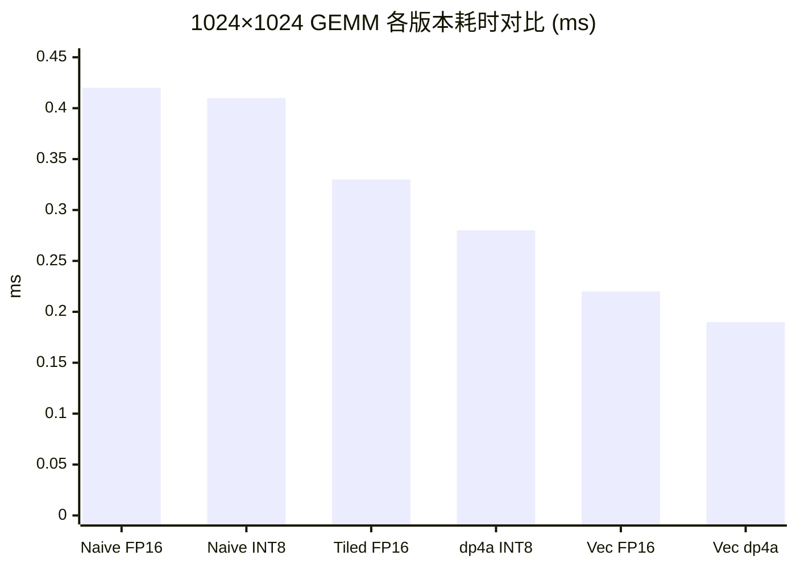

> 📖 **前置阅读**：01_Basics（GEMM 基础）、04_GEMM_Optimization（Register Tiling）  
> 📖 **推荐后续**：09_Tensor_Core（硬件级低精度计算）、11_Inference_Optimization（量化推理部署）

## 为什么要量化

FP32 一个数占 4 字节，FP16 占 2 字节，INT8 占 1 字节。把权重和激活值从 FP32 转成低精度格式，好处很直接：

1. **带宽省了**：对 Memory Bound 算子，数据量少一半就快一倍
2. **计算密度高了**：RTX 4090 的 FP16 吞吐是 FP32 的 2 倍，INT8 通过 dp4a 指令更进一步

代价是精度损失。不过大量实验表明，推理场景下 FP16 几乎无损，INT8 在大多数任务也可接受。

---

## 量化的数学

### 绝对最大值对称量化

FP32 到 INT8 的线性映射：

$$s = \frac{127}{\max(|X|)}, \quad X_{\text{int8}} = \text{round}(s \cdot X_{\text{fp32}}), \quad \hat{X} = \frac{X_{\text{int8}}}{s}$$

Scale $s$ 的粒度是关键：

- **Per-Tensor**：整个张量共享一个 $s$。简单但脆弱——一个异常值就能毁掉整个张量的精度。比如 $[-1, 1]$ 范围的张量混入一个 100，Scale 变成 $127/100 = 1.27$，正常范围内的值只能映射到 $\{-1, 0, 1\}$——信息基本丢光了。
- **Per-Channel**：每行/每列独立计算 Scale。异常值只影响自己的通道，GPU 上需要额外一次行级 Reduce Max。

### INT8 GEMM 的缩放恢复

$C = A \times B$ 量化后：

$$C_{i,j} \approx \frac{1}{s_{A,i} \cdot s_{B,j}} \sum_{k} \hat{A}_{i,k} \cdot \hat{B}_{k,j}$$

核心内积全在 INT8 域完成（用 INT32 累加器防溢出），最后写回时乘以 FP32 Scale——只是一次标量乘法。

---

## FP16 GEMM：half2 双发射

`half` 类型（IEEE 754 半精度）：1 位符号 + 5 位指数 + 10 位尾数，动态范围 $6.1 \times 10^{-5}$ 到 $6.55 \times 10^4$。

CUDA 提供 `__half2` 类型，把两个 FP16 打包到一个 32 位寄存器里，配合 `__hfma2(a, b, c)` 一个时钟完成两次独立的 FMA——吞吐直接翻倍。

### 实测（$1024 \times 1024$，10 次平均）

| 版本 | Kernel 时间 | 吞吐 (GFLOPS) | vs Naive |
|:---|:---|:---|:---|
| Naive | 0.42 ms | 5,074 | 1× |
| Tiled | 0.33 ms | 6,494 | 1.28× |
| Vectorized (half2) | 0.22 ms | **9,697** | 1.91× |

Vectorized 用 `half2` 一次处理两个值，`__hfma2` 原生支持双发射 FMA。9697 GFLOPS ≈ 9.7 TFLOPS。

这里有个看似矛盾的地方：FP16 比 FP32 应该快，但 9.7 TFLOPS 反而低于 FP32 Register Tiling 的 14 TFLOPS。原因是这个 FP16 版只做了向量化 Tiling，没有 Register Tiling。给 FP16 也加上 Register Tiling + Tensor Core，数字会飙到 100+ TFLOPS（09_Tensor_Core 的事）。

---

## INT8 GEMM 和 dp4a 指令

CUDA Core 的 FMA 单元不直接支持 int8 乘法。`dp4a`（Dot Product of 4 Accumulate）指令是 NVIDIA 的方案：

$$\text{dp4a}(a, b, c) = c + \sum_{k=0}^{3} a_k \cdot b_k$$

一条指令完成 4 对 int8 的乘加，结果累加到 int32。$a$ 和 $b$ 各是一个打包的 4×int8（塞在一个 32 位寄存器里）。



传统标量方式算 4 对 int8 乘积要 7 条指令（4 乘 + 3 加），`dp4a` 压成 1 条。

### 代码模式

```cpp
// 朴素版
for (int k = 0; k < K; ++k)
    sum += (int)A[row][k] * (int)B[k][col];

// dp4a 版：4 个 int8 打包处理
for (int k = 0; k < K; k += 4) {
    int a_pack = *reinterpret_cast<const int*>(&A[row][k]);
    int b_pack = *reinterpret_cast<const int*>(&B[k][col]);
    sum = __dp4a(a_pack, b_pack, sum);
}
```

### Vectorized dp4a 的进一步优化

每个线程同时计算 4 列输出，共享同一个 `a_val`，把 A 矩阵的访存复用了 4 倍。一次循环消耗 16 对 INT8 乘加。写回用 `int4`（128-bit）向量化存储。

### 实测（$1024 \times 1024$，10 次平均）

| 版本 | Kernel 时间 | 吞吐 | vs Naive |
|:---|:---|:---|:---|
| Naive INT8 | 0.41 ms | ~5.2 TOPS | 1× |
| dp4a | 0.28 ms | ~7.7 TOPS | 1.48× |
| Vectorized dp4a | 0.19 ms | **11.31 TOPS** | 2.14× |

11.31 TOPS。dp4a 的提升没到理论的 4 倍——瓶颈不完全在计算，还有 B 矩阵的转置打包开销（每次 dp4a 前需要用位操作从 4 行中提取同列 4 个元素重新打包）和 SRAM/Global Memory 的访问延迟。



---

## 量化和反量化的开销

量化不只是 GEMM 内部用低精度——你还需要把 FP32 数据转成 INT8 的前端，和把结果转回的后端。

### 实测（$N = 10{,}485{,}760$，10M 元素，100 次平均）

| 操作 | Kernel 时间 | 有效带宽 | vs CPU |
|:---|:---|:---|:---|
| FP32 → FP16 | 0.02 ms | 2912 GB/s | 4433× |
| FP16 → FP32 | 0.02 ms | 2923 GB/s | 2567× |
| Quantize Per-Tensor | 0.02 ms | 2167 GB/s | 3581× |
| Quantize Per-Channel | 0.03 ms | 1763 GB/s | 2986× |
| Dequantize Per-Tensor | 0.02 ms | 2440 GB/s | 388× |

所有操作的有效带宽都远超 HBM 理论峰值 1008 GB/s——因为 40 MB 数据完全被 72 MB 的 L2 Cache 吃下了（L2 Cache 命中效应）。量化本身不是推理延迟的瓶颈。

Per-Channel 比 Per-Tensor 稍慢（0.03ms vs 0.02ms），因为每个元素需要额外读一个 channel-specific 的 Scale 值。

---

## 从这些实验里能学到什么

**量化的核心收益在带宽，不在计算。** 在 Memory Bound 的推理场景中，INT8 把权重体积压缩 4 倍——同等带宽下每秒能搬运 4 倍参数。dp4a 的计算效率提升是锦上添花，真正的杀手收益在搬运层面。

**dp4a 是标量 INT8 的天花板，但不是终点。** dp4a 复用 INT32 ALU 管线，吞吐受标量管线宽度限制。真正释放 INT8 算力要靠 Tensor Core——从 Turing 架构开始，一个时钟做 $16 \times 16$ 的 INT8 矩阵乘累加。这是 09_Tensor_Core 的内容。

**Per-Channel 是工业级量化的最低门槛。** 从 SmoothQuant 到 AWQ，现代量化方案几乎都用 Per-Channel 甚至 Per-Group 粒度。Per-Tensor 在 LLM 的 Attention 层会遇到 Activation Outlier（某些通道激活值比别的大 100 倍），导致 INT8 精度崩塌。GPU 端多出来的只是每行一次 Reduce Max 的开销。

**L2 Cache 让小数据量的 benchmark 看起来特别快。** 2000+ GB/s 的"有效带宽"不代表 HBM 真有这么快。超过 1008 GB/s 的数字都是 L2 命中率高的效果。评估算子性能时，要用足够大的数据量（远超 L2 容量）才能测到真实的 HBM 带宽。
