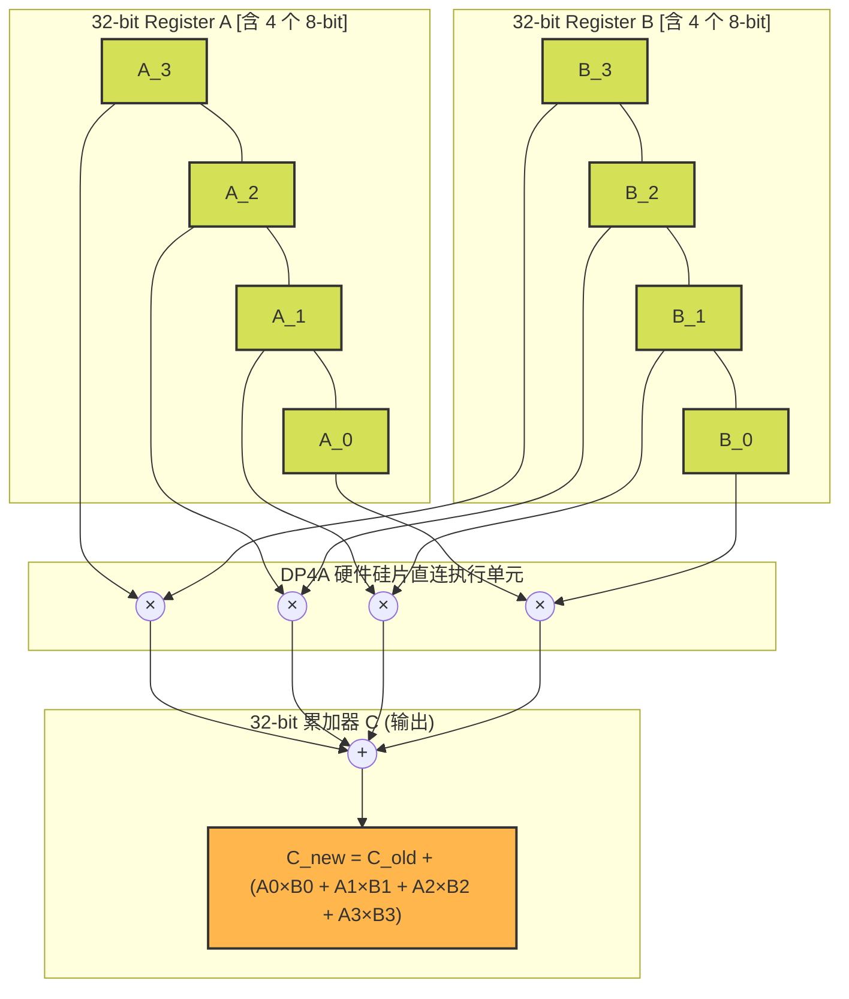
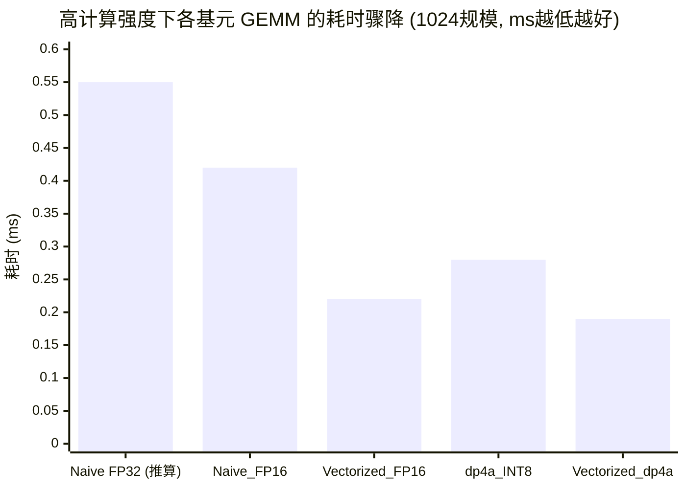

## 楔子：直击痛点 (The Hook & Motivation)

在大语言模型（LLM）推理的残酷舞台上，显存容量和带宽（Memory Wall）永远是不够用的。我们之前在 `04_GEMM_Optimization` 中拼尽全力写出了 28 TFLOPS 的 FP32 内核，但这在动辄千亿参数的模型面前依然杯水车薪。

出路只有一个：**降维打击——量化 (Quantization)**。
既然我们在访存上捉襟见肘，那我们就把搬运的数据硬生生砍掉一半 (FP16/BF16) 甚至四分之三 (INT8)！更可怕的是，NVIDIA 的架构师们在硬件底层埋了“外挂”：对于低精度数据，ALU 的吞吐量是成倍暴涨的！

本篇，我们将抛开高大上的 Tensor Core（这属于后话），纯粹从 CUDA 核心本身的微架构出发，深挖两个能让算力原地起飞的暴力指令：

1. **FP16 领域的 `__hfma2`**：一个指令同时做两次半精度浮点乘加！
2. **INT8 领域的 `__dp4a` (Dot Product Accumulate 4)**：传说中的四位一体点积核爆按钮，单时钟周期吞吐 4 倍算力！

---

## 第一性原理与数学重构 (Mathematical Formulation)

### 量化数学：如何将连续的宇宙塞进 256 个盒子里？

核心思想是**绝对最大值对称量化 (Absmax Quantization)**。
对于任意包含正负浮点数的张量 $X_{fp32}$，要将其优雅地塞进 $[-127, 127]$ (INT8)，我们需要一个缩放因子 (Scale) $s$：
$$s = \frac{127}{\max(|X_{fp32}|)}$$

那么，前向投射方程为：
$$X_{int8} = \text{round}(s \cdot X_{fp32})$$

而在做 GEMM ($C = A \times B$) 时，真正的奇迹在于：**我们根本不需要在 O(N^3) 的计算密集区进行任何 FP32 操作**。
$$C_{i,j} \approx \frac{1}{s_{A,i} \cdot s_{B,j}} \sum_{k=0}^{N-1} \left( A^{int8}_{i,k} \cdot B^{int8}_{k,j} \right)$$
看！那个庞大的 $\Sigma$ 里面的所有操作，全部变成了纯粹的 8-bit 整型乘加！只有在最后写回结果 $C$ 的一瞬间，才需要除以那两个轻量级的常数 Scale 返回 FP32 世界。这就叫“数据面降维，控制面升维”。

---

## 核心优化演进与硬件映射 (Architecture Mapping)

既然数学上跑通了纯整数通道，那么硬件层面如何接得住这泼天的富贵？
欢迎来到基于 Pascal 架构 (SM 6.1) 引入的杀手锏：**DP4A 指令 (Dot Product Accumulate)**。

### DP4A：单周期核爆指令拓扑

在传统 CPU 或早期的 GPU 上，做 4 次 INT8 乘加需要发射（Issue）多少条指令？4 次乘法 + 3 次加法 = 至少需要数个周期的流水线停顿。

而 `__dp4a(int a, int b, int c)` 的硬件连线是这样设计的：



**底层真相解码：**
这三个变量 `a`, `b`, `c` 原本都只是 32-bit 的极度普通的 `int32_t` 寄存器。但指令译码器强行把 `a` 和 `b` 脑补成了结构体 `struct { int8_t x, y, z, w; }`。在一个原子时钟周期内，硬件网格直接爆发出 4 路乘法器并将结果路由至 32-bit 的 `c` 里面累加防溢出。
这就是以一敌四的暴力！指令槽位 (Issue Slot) 利用率直接飙升 400%！

---

## 源码手术刀：关键代码深度赏析 (Surgical Code Analysis)

要在代码里召唤这头怪兽，可比单纯写个 `#pragma` 难多了。数据必须亲手打包包装好才能喂给 `__dp4a`。

打开 `07_Quantization/02_int8_gemm/int8_gemm.cu`，我们鉴赏一下最极端的 **Vectorized INT4 读取并拆封 DP4A 喂食** 操作：

```cpp
// 终极性能形态：一个线程一次性吞吐 16 字节 (1个 int4，包裹着 16个 INT8)
int4 a_vec = *reinterpret_cast<const int4*>(&A[row * N + i]);
// b_rowX_pack 分别从 4 个不同行吞进 4 个 int32 (一共16个INT8)
int32_t b_row0_pack = *reinterpret_cast<const int32_t*>(&B[(i + 0) * K + col]);
// ... [省略 b_row1 到 b_row3]

// 🤯 最恶心也是最重要的“数据洗牌打包 (Data Swizzling)” 🤯
// a_vec 的 x,y,z,w 已经是横向行连续打包的，不用管。
// 但 B 矩阵在 global 内存里是一行一行存的！我们需要抽出每行的第 0 列组成一个新的 column包！
int8_t r0_c0 = b_row0_pack & 0xFF;         // 提第 0 行第 0 列 (最低 8-bit)
int8_t r1_c0 = b_row1_pack & 0xFF;         // 提第 1 行第 0 列
// ... [位运算剥夺重组]
// 手动将来自 4 行的四个游离 INT8 强行按小端序融合成极其纯粹的 1 个竖向载体 (32-bit)
int32_t col0_val = ((r3_c0 & 0xFF) << 24) | ((r2_c0 & 0xFF) << 16) | ((r1_c0 & 0xFF) << 8) | (r0_c0 & 0xFF);

// 🔥 开炮时间：4 次 dp4a 疯狂输出，等效于传统 16 次乘法指令 🔥
sum0 = compat_dp4a(a_vec.x, col0_val, sum0);  
// ... [其余计算省略]
```

**手术刀剖析：**
你看到了什么？是满屏的位运算（Bitwise `&`, `>>`, `|`）。由于我们在写矩阵乘法，而对于普通矩阵布局，B 矩阵的数据在竖直方向上内存是不连续的！`dp4a` 最痛恨的就是数据不紧密。
因此在寄存器端，哪怕用 `<< 24` 这种晦涩的移位去剥夺重组变量，其付出的几条极其廉价的 ALU 指令周期，相比于让 Global Memory 发起 4 次零散读取并破坏全局总线事务而言，简直就是暴赚的无本买卖。

> 同理，在 `01_fp16_gemm/fp16_gemm.cu` 中，我们使用的是 `__hfma2` 原语。它的逻辑完全相同：把 2 个 FP16 打包进一个 32-bit 的 `half2` 结构中劈头盖脸地发射算力。

---

## 理论与实际的对决：极限剖析 (Theory vs Reality Profiling)

让我们抽拉出项目 `Results/07_Quantization.md` 中的真机实测数据 (RTX 4090, SM_89, M=N=K=1024)：



| 算子变体 | 内部发射内核 | Kernel 耗时 (ms) | 加速红利与底层瓶颈分析 |
| :--- | :--- | :--- | :--- |
| **FP32** (推算值) | `fma` | ~0.55 ms | 最传统、占用指令槽和宽度的笨重基准。 |
| **Naive FP16** | `__hfma` | 0.42 ms | 纯粹换数据类型，没发挥向量化，寄存器闲置，浪费了位宽。 |
| **Vec FP16** | `__hfma2` | **0.22 ms** | 极具美感！**一箭双雕，计算吞吐量 9.70 TFLOPS，耗时砍半！** |
| **dp4a INT8** | `__dp4a` | 0.28 ms | 虽然打包了，但内存读取一次 4 字节不够过瘾，触发了少许访存等待。 |
| **Vec dp4a INT8** | **四轮组合拳** | **0.19 ms** | **最终形态：吞吐量暴涨至 11.31 TOPS！彻底将计算压制成一道闪电，是朴素 FP16 的 2 倍多速度。** |

### 极限溯源与“反直觉”自洽性反思

你会发现，虽然 `dp4a` 有不可一世的 4 倍算力吞吐系数，相比 `hfma2` 的 2 倍理论系数更高，但为何 **FP16 (0.22ms)** 和 **Vec dp4a (0.19ms)** 之间的差距没有体现出 2 倍那么夸张？
揭开 Profiling 的迷雾：
当 M=N=K=1024 这个体量时，矩阵规模对于宏大的 4090 而言属于“中小规模”。由于我们前文看到由于 INT8 `dp4a` 要求打包，导致内部多了极其繁琐的 `reinterpret_cast`、以及移位元组的洗牌逻辑。在小矩阵红利铺开的前期，**大量的 ALU 时钟周期实际上是消耗在了这些非计算属性的 “Bit manipulation (位元揉捏)” 之上的。**
只有当矩阵极速扩大（如 4096+），计算密集度彻底击穿天花板时，点积 4 重并发的光芒才会彻底掩盖那些打包耗时。而对于更高级的 Tensor Core (`mma.sync` 甚至 `mma.m16n8k16.int8`)，就是专门设计成“连打包洗牌的苦力活都在硅片硬件层面替你干完”的终极形态。

---

## 架构师视角的总结 (Architect's Takeaway)

1. **类型铸造（Type Casting）的白嫖红利**：在深度学习端，将巨大的计算量从 32 位精度下降到 16 位甚至 8 位，其带来的不仅仅是显存放大了 2~4 倍，更是**片内数据移动功耗 (Energy per bit traveled) 的腰斩**。这是走向端侧部署（Edge AI）的唯一正道。
2. **底层算力暴增的暗黑密码（Data Packing）**：不管是 `__hfma2` 还是 `__dp4a`，NVIDIA 教会了我们一件事：**只要你敢把数据打包成 32 字节甚至 128 字节凑够大巴车发车，硬件就敢拨出特殊的乘法器专线给你走后门。**
3. **汇编层面的取舍法则**：没有免费的午餐。INT8 带来了 4 倍强算的错觉，却逼研发者手动在 CUDA 端去用位运算倒腾内存对不齐的矩阵。这迫使我们极其渴望下一代全自动张量阵列硬件——即将在后文大放异彩的 **Tensor Core (CUTLASS)** 会彻底撕开这个枷锁！
