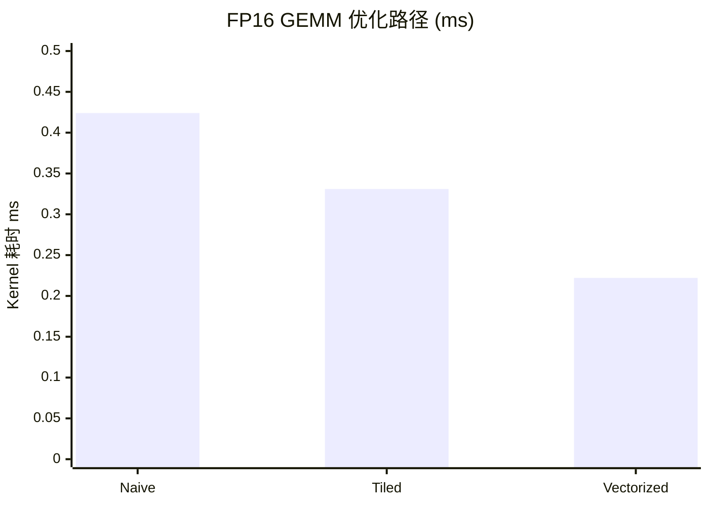
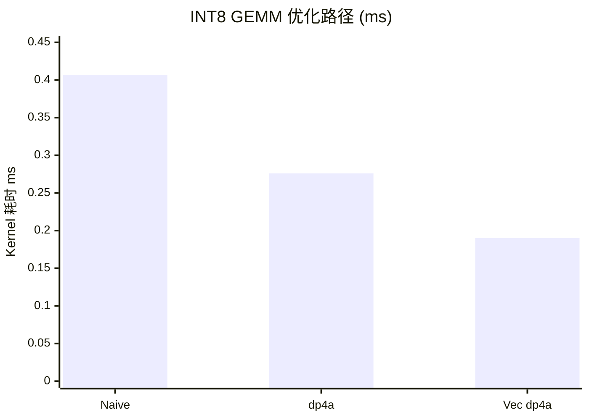

> 📖 **前置阅读**：01_Basics（带宽与算术强度）、04_GEMM_Optimization（FP32 GEMM 天花板）
> 📖 **推荐后续**：09_Tensor_Core（WMMA 硬件加速 FP16）、11_Inference_Optimization（推理级融合）

FP32 一个元素 4 字节。FP16 只要 2 字节。同一条 HBM 通道，FP16 的**有效数据吞吐翻倍**。INT8 再砍一半，1 字节。这就是量化的第一个收益——不需要改任何 Kernel 逻辑，光靠缩小数据宽度就能提速。

但"缩小数据宽度"不是免费的。FP16 的有效精度只有 $\sim 3.3$ 位十进制，INT8 只有 256 个离散值。量化需要找到一条路：**用最低的精度损失换最大的性能提升**。

---

## FP16 GEMM：从 Naive 到 Vectorized

### 数据格式

FP16（IEEE 754 `binary16`）：1 位符号 + 5 位指数 + 10 位尾数。动态范围 $[6 \times 10^{-8},\ 65504]$，精度 $\epsilon = 2^{-10} \approx 0.001$。

BF16（Google Brain Float16）：1+8+7，动态范围和 FP32 一样（8 位指数），精度更低（7 位尾数）。BF16 用于训练更稳定，FP16 用于推理精度更高。

### 三版 FP16 Kernel

```cpp
// V1: Naive —— 标量 half 运算
for (int k = 0; k < K; ++k)
    sum = __hfma(A[row*K+k], B[k*N+col], sum);

// V2: Tiled —— Shared Memory 分块
__shared__ half tileA[T][T], tileB[T][T];
// ... 加载 + sync + 计算

// V3: Vectorized —— half2 向量化
half2 a2 = *reinterpret_cast<const half2*>(&A[...]);
half2 b2 = *reinterpret_cast<const half2*>(&B[...]);
sum2 = __hfma2(a2, b2, sum2);  // 一条指令做 2 个 FMA
```

`half2` 把两个 FP16 打包成 32 位——一条 `HFMA2` 指令同时做两个乘加，指令吞吐翻倍。

### 实测（1024 × 1024，10 次平均）

| 版本 | Kernel (ms) | 加速比 | GFLOPS |
|:---|:---:|:---:|:---:|
| Naive FP16 | 0.424 | 1× | — |
| Tiled FP16 | 0.331 | **1.28×** | — |
| **Vectorized FP16** | **0.222** | **1.91×** | **9697** |



---

## INT8 和 dp4a 指令

### 量化数学

$$x_{\text{int8}} = \text{round}\left(\frac{x_{\text{fp32}}}{\Delta}\right), \quad \Delta = \frac{\max(|x|)}{127}$$

$\Delta$ 是 Scale Factor。反量化 = $x_{\text{fp32}} \approx x_{\text{int8}} \times \Delta$。

Per-Tensor 量化对整个张量用同一个 $\Delta$。Per-Channel 量化每个输出通道算自己的 $\Delta$——精度更好但 Kernel 更复杂。

### dp4a：一条指令做 4 个 INT8 乘加

`__dp4a(a, b, c)` 展开为：

$$c' = c + a_0 \times b_0 + a_1 \times b_1 + a_2 \times b_2 + a_3 \times b_3$$

4 个 INT8 元素打包成一个 32 位 `int`。每条 `dp4a` 完成 8 个整数运算（4 乘 + 4 加），INT32 累加避免溢出。

```cpp
// V1: Naive —— 标量 int8 乘加
for (int k = 0; k < K; ++k)
    sum += (int)A[row*K+k] * (int)B[k*N+col];

// V2: dp4a —— 4 路打包
int a4 = *reinterpret_cast<const int*>(&A[row*K + k]);
int b4 = *reinterpret_cast<const int*>(&B[k*N + col]);
sum = __dp4a(a4, b4, sum);

// V3: Vectorized dp4a —— int4 向量化
int4 a16 = *reinterpret_cast<const int4*>(&A[...]);
int4 b16 = *reinterpret_cast<const int4*>(&B[...]);
// 4 个 dp4a 展开
sum = __dp4a(a16.x, b16.x, sum);
sum = __dp4a(a16.y, b16.y, sum);
sum = __dp4a(a16.z, b16.z, sum);
sum = __dp4a(a16.w, b16.w, sum);
```

### 实测（1024 × 1024，10 次平均）

| 版本 | Kernel (ms) | 加速比 | TOPS |
|:---|:---:|:---:|:---:|
| Naive INT8 | 0.407 | 1× | — |
| dp4a | 0.276 | **1.48×** | — |
| **Vectorized dp4a** | **0.190** | **2.14×** | **11.31** |



---

## 量化/反量化的带宽开销

量化本身也是 Kernel——在低精度 GEMM 之前要跑一遍 Quant，之后可能还要跑 Dequant。开销有多大？

### 实测（$N = 10M$，40 MB，100 次平均）

| 操作 | Kernel (ms) | 有效带宽 |
|:---|:---:|:---:|
| FP32 → INT8 Per-Tensor | 0.02 | 2167 GB/s |
| INT8 → FP32 Per-Tensor | 0.02 | 2440 GB/s |
| FP32 → INT8 Per-Channel | 0.03 | 1763 GB/s |
| FP32 → FP16 Cast | 0.02 | 2912 GB/s |
| FP16 → FP32 Cast | 0.02 | 2923 GB/s |

带宽全部远超 DRAM 峰值（1008 GB/s）——因为 40 MB 数据完全命中 L2 Cache（72 MB）。说明量化/反量化对小张量几乎零开销。

但**生产中量化开销不能忽略**。在 PyTorch 的 `torch.quantize_per_channel` 中，量化不只是除法取整——还要计算每通道的 min/max（一轮 Reduce）、计算 Scale 和 Zero Point、再做量化写入。对大张量这些加起来可以占推理延迟的 5-10%。

---

## 用好量化的前提

$$\text{总加速} = \underbrace{\frac{BW_{\text{quant}}}{BW_{\text{fp32}}}}_{\text{访存收益}} \times \underbrace{\frac{OPS_{\text{quant}}}{OPS_{\text{fp32}}}}_{\text{计算收益}} - \underbrace{\text{Quant/Dequant 开销}}_{\text{额外成本}}$$

对 Memory Bound 算子（Softmax、LN、逐元素操作），量化的收益主要来自访存。对 Compute Bound 算子（GEMM），收益主要来自计算密度（dp4a、Tensor Core）。

量化收益最大的场景是推理端大模型 GEMM：权重量化为 INT8/INT4 后常驻显存，每次请求只需要量化激活值，权重反量化已经被融合进 GEMM Kernel。这就是 GPTQ、AWQ 等 Weight-Only 量化方案的工程逻辑。
