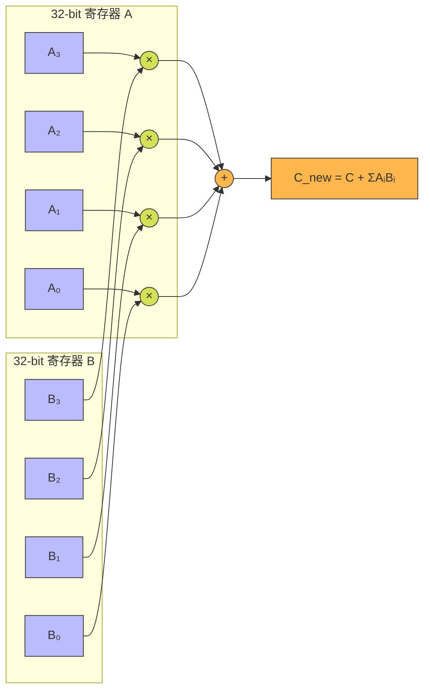
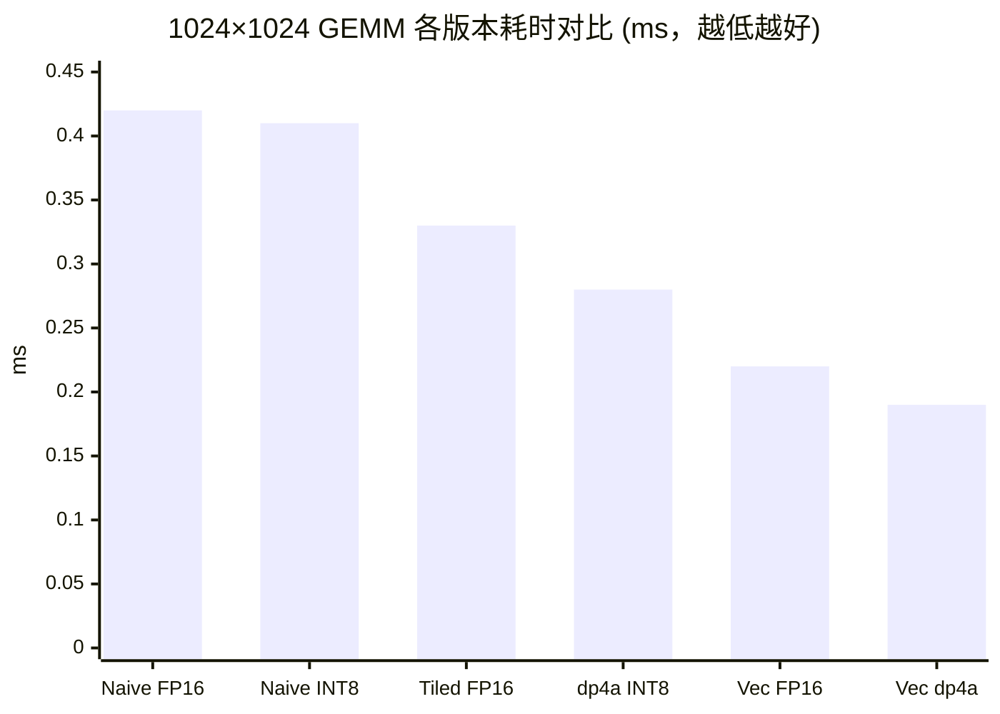

## 楔子：大模型推理的带宽墙与量化破壁

GPT-4 级别的模型拥有数千亿参数。以 FP32（4 Bytes/参数）存储时，仅权重就占据数百 GB 显存。即便是 A100 80GB 也无法单卡装下。更关键的是，推理时的瓶颈不在算力（RTX 4090 拥有 82.6 TFLOPS FP32），而在于**将这些庞大权重从 HBM 中搬运到 SM 的带宽**（~1008 GB/s）。

量化的核心思想极其朴素：**用更少的 bit 表示同样的数据**。

| 精度格式 | 字节数 | 存储缩减 | 关键能力 |
|:---:|:---:|:---:|:---|
| FP32 | 4 | 1× | 全局精度基准 |
| FP16 | 2 | **2×** | `__hfma2` 双发射乘加 |
| INT8 | 1 | **4×** | `__dp4a` 四路并行乘累加 |

当权重从 FP32 压缩到 INT8 时，同样的 1008 GB/s HBM 带宽可以每秒**搬运 4 倍多的参数**。这不是工程 trick，而是物理带宽红利的基础数学。

但量化的代价是什么？精度！本文将从量化的数学基础出发，深入 `dp4a` 硬件指令的微架构，再用真机跑分回答一个核心问题：**手写的 dp4a INT8 GEMM 到底能榨出多少吞吐？**

---

## 第一性原理与数学重构

### 一、绝对最大值对称量化（Absmax Symmetric Quantization）

将 FP32 张量线性映射到 INT8 的 $[-127, 127]$ 空间：

$$s = \frac{127}{\max(|X|)}, \quad X_{\text{int8}} = \text{round}(s \cdot X_{\text{fp32}}), \quad \hat{X} = \frac{X_{\text{int8}}}{s}$$

其中 Scale $s$ 是一个 FP32 标量。核心问题在于 $s$ 的粒度：

- **Per-Tensor**：整个张量共享一个 $s$。计算简单，但**一个异常值就能摧毁整个张量的精度**。例如一个 $[-1, 1]$ 范围的张量中混入一个 $100$，Scale 变为 $127/100 = 1.27$，导致 $[-1, 1]$ 范围内的值只能映射到 $\{-1, 0, 1\}$，信息损失 99%。
- **Per-Channel**：每行/每列独立计算 $s_i$。GPU 上需要额外一次行级 Reduce Max，但异常值只影响自己所在的通道，其他通道不受牵连。

### 二、INT8 GEMM 的缩放复原

对于 $C = A \times B$，量化后：

$$C_{i,j} \approx \frac{1}{s_{A,i} \cdot s_{B,j}} \sum_{k} \hat{A}_{i,k} \cdot \hat{B}_{k,j}$$

核心内积 $\sum \hat{A} \cdot \hat{B}$ 全在 **INT8 域**完成（使用 INT32 累加器防溢出），仅在最终写回时乘以 FP32 Scale。这意味着计算密度提升 4×（每个 32-bit 寄存器打包 4 个 INT8），而 FP32 的 Scale 恢复只是末尾的一次标量乘法。

### 三、FP16 与 `half2` 双发射

FP16（IEEE 754 半精度）使用 1 位符号 + 5 位指数 + 10 位尾数。CUDA 提供 `__half2` 类型，将两个 FP16 打包到 32 位寄存器中，配合 `__hfma2(a, b, c)` 在一个时钟内完成**两次独立的融合乘加**——吞吐量直接翻倍。

---

## 核心优化演进与硬件映射

### `dp4a`：四位一体的硬件点积引擎

NVIDIA 的 `__dp4a(int a, int b, int c)` 是 INT8 计算的杀手锏。它在一个时钟内完成：

$$c_{\text{new}} = c + \sum_{i=0}^{3} a_i \cdot b_i$$

其中 $a$ 和 $b$ 是 32-bit 寄存器，各自打包了 4 个 INT8 值。



**对比传统标量方式**：计算 4 对 INT8 乘积需要 4 次乘法 + 3 次加法 = 7 条指令。`dp4a` 将其压缩为 **1 条指令**，纯计算吞吐提升 7×。

### INT8 GEMM 的三级优化阶梯

| 版本 | 核心策略 | 每循环迭代的乘累加数 | Kernel 时间 |
|:---|:---|:---:|:---:|
| Naive | 逐元素 INT8 乘加 | 1 | 0.41 ms |
| dp4a | 4 路打包点积 | 4 | 0.28 ms |
| **Vectorized dp4a** | `int4` 128-bit 加载 + 4 列并行 | **16** | **0.19 ms** |

Vectorized 版本的关键跃迁：

1. **访存侧**：用 `reinterpret_cast<const int32_t*>` 将 4 个连续 INT8 合并为 1 次 32-bit 读取
2. **计算侧**：每个线程同时计算 4 列输出，共享同一个 `a_val`，将 A 矩阵的访存复用 4×
3. **写回侧**：用 `int4`（128-bit）向量化存储 4 个 INT32 结果

---

## 源码手术刀：关键代码深度赏析

### Vectorized dp4a GEMM 的核心循环

```cpp
// 每个线程负责 C[row, col:col+4] 的 4 个输出元素
int32_t sum0 = 0, sum1 = 0, sum2 = 0, sum3 = 0;

for (int i = 0; i < N; i += 4) {
    // A 矩阵：一次 32-bit 读取，获得 4 个 INT8 元素
    int32_t a_val = *reinterpret_cast<const int32_t*>(&A[row * N + i]);

    // B 矩阵：读取 4 行 × 4 列的 INT8 数据块，手动转置打包
    // b_row{0..3}_pack 各包含 B[i+{0..3}, col:col+4] 的 4 个 INT8
    int32_t col0_val = /* 从 4 行中提取第 0 列的 4 个 INT8 并打包 */;
    int32_t col1_val = /* 第 1 列 */;
    int32_t col2_val = /* 第 2 列 */;
    int32_t col3_val = /* 第 3 列 */;

    // 4 次 dp4a: 一次循环消耗 16 对 INT8 乘加
    sum0 = compat_dp4a(a_val, col0_val, sum0);
    sum1 = compat_dp4a(a_val, col1_val, sum1);
    sum2 = compat_dp4a(a_val, col2_val, sum2);
    sum3 = compat_dp4a(a_val, col3_val, sum3);
}
// 一次 int4 向量化写回
*reinterpret_cast<int4*>(&C[row * K + col]) = {sum0, sum1, sum2, sum3};
```

**硬件级解读**：

1. **A 矩阵复用 4×**：`a_val` 被 4 次 `dp4a` 共享，避免了重复访存。在寄存器层面，这 4 条 `dp4a` 指令可以被 SM 的多个函数单元 pipeline 化执行。
2. **B 矩阵转置打包**：因为 B 矩阵按行存储，但我们需要按列计算点积，所以必须手动用位操作（`>> 8 & 0xFF`）从 4 行中提取同一列的 4 个元素，重新打包成一个 `int32_t` 送入 `dp4a`。这就是量化 GEMM 的 "脏活"——数据布局适配。

---

## 理论与实际的对决：极限剖析

> **测试环境**：NVIDIA GeForce RTX 4090 × 2（sm_89），Linux，nvcc -O3 -std=c++17

### 量化/反量化开销（10M 元素，100 次平均）

| 操作 | Kernel 时间 (ms) | 有效带宽 (GB/s) | vs CPU 加速比 |
|:---|:---:|:---:|:---:|
| FP32 → FP16 Cast | 0.02 | 2912 | 4433× |
| FP16 → FP32 Cast | 0.02 | 2923 | 2567× |
| **FP32 → INT8 Per-Tensor** | **0.02** | **2167** | **3581×** |
| FP32 → INT8 Per-Channel | 0.03 | 1763 | 2986× |

所有量化 Kernel 的有效带宽都远超 1008 GB/s 的 DRAM 理论峰值——这再次印证了 L2 Cache 效应：10M × 4B = 40 MB 的数据完全驻留在 RTX 4090 的 72 MB L2 Cache 中。**量化本身不是推理延迟的瓶颈，可以放心使用。**

### FP16 GEMM（1024 × 1024，10 次平均）

| 版本 | Kernel 时间 (ms) | 计算吞吐 | vs Naive 加速比 |
|:---|:---:|:---:|:---:|
| Naive FP16 | 0.42 | ~5.1 TFLOPS | 1× |
| Tiled FP16 | 0.33 | ~6.5 TFLOPS | 1.28× |
| **Vectorized (`half2`)** | **0.22** | **9.70 TFLOPS** | **1.91×** |

### INT8 GEMM（1024 × 1024，10 次平均）

| 版本 | Kernel 时间 (ms) | 计算吞吐 | vs Naive 加速比 |
|:---|:---:|:---:|:---:|
| Naive INT8 | 0.41 | ~5.2 TOPS | 1× |
| dp4a INT8 | 0.28 | ~7.7 TOPS | 1.48× |
| **Vectorized dp4a** | **0.19** | **11.31 TOPS** | **2.14×** |



### 理论自洽性分析

**Vec dp4a INT8 的 11.31 TOPS vs 理论峰值**

RTX 4090 的 FP32 CUDA Core 算力为 82.6 TFLOPS。INT8 没有独立的标量管线，`dp4a` 复用 INT32 ALU，因此 INT8 标量峰值约等于 FP32 的 $82.6 \times 2 = 165$ TOPS（每 cycle 2 个 INT32 op，每 op 含 4 次 INT8 乘加 = 8 INT8 ops，但 dp4a 本身消耗一个 INT32 slot）。

$11.31 / 165 \approx 6.9\%$ 利用率——**为什么这么低？**

1. **1024×1024 矩阵太小**：总计算量 $2 \times 1024^3 = 2.1 \text{G}$ ops，仅需 0.013 ms 即可完成。0.19 ms 的实测时间说明 Kernel 被 launch 开销和访存延迟主导。
2. **无 Shared Memory Tiling**：当前 Vectorized dp4a 仍是全局内存直读，没有利用 SMEM 减少冗余加载。对比 04_GEMM 中的 Register Tiling 方案，这里的优化还有巨大空间。
3. **B 矩阵转置开销**：手动逐字节位操作重打包 B 列数据的延迟（4 次 `>> & |` 每 dp4a）在小矩阵上占比显著。

要达到 RTX 4090 的 INT8 峰值性能，需要：① Tensor Core（WMMA/MMA）而非标量 dp4a；② CUTLASS 级别的多级 Tiling；③ 4096+ 规模矩阵以摊薄固定开销。

---

## 架构师视角的总结

### 铁律一：量化的价值不在于 "计算更少"，而在于 "搬运更少"

在 Memory Bound 的推理场景中，INT8 将权重体积压缩 4×，这意味着相同带宽下可以每秒处理 4× 的 Token。`dp4a` 带来的计算效率提升只是锦上添花——**真正的杀手收益来自带宽层面**。

### 铁律二：dp4a 是标量 INT8 的天花板，但不是 INT8 的终点

`dp4a` 在 FP32/INT32 ALU 管线中执行，吞吐上限受制于标量管线宽度。真正释放 INT8 算力的是 **Tensor Core**（从 Turing 架构开始），它可以在一个时钟内完成 $16 \times 16$ 矩阵的 INT8 乘累加——这就是 09_Tensor_Core 章节的主题。

### 铁律三：Per-Channel 量化是工业级量化的最低门槛

从 SmoothQuant 到 AWQ，现代量化方案几乎全部采用 Per-Channel（甚至 Per-Group）粒度。Per-Tensor 在 LLM 的 Attention 层中会遇到 Activation Outlier（某些通道的激活值比其他通道大 100 倍），导致 INT8 精度崩塌。GPU 端的额外开销仅为每行一次 Reduce Max，但换来了精度安全的保障。
