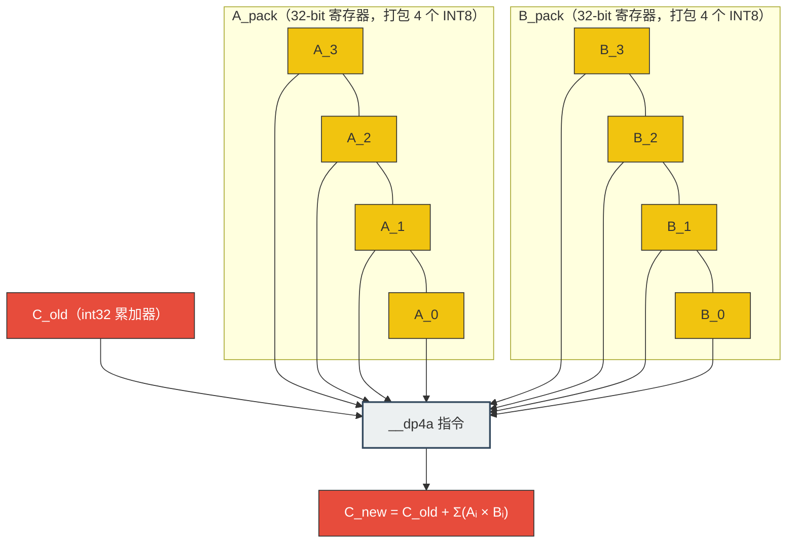
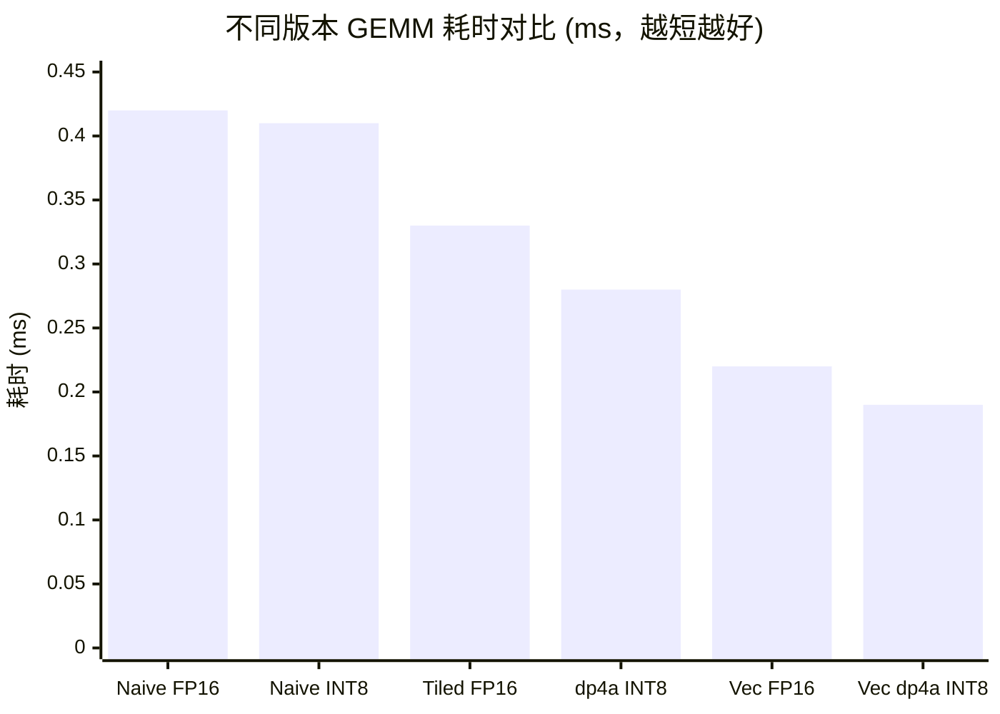

> 📖 **前置阅读**：01_Basics（带宽与算术强度）、04_GEMM_Optimization（FP32 GEMM 天花板）
> 📖 **推荐后续**：09_Tensor_Core（WMMA 硬件加速 FP16）、11_Inference_Optimization（推理级融合）

大模型时代的到来，让 GPU 面临一个残酷的物理现实：**算子通常被卡在显存带宽上（Memory Bound），而不是计算单元上（Compute Bound）**。

FP32（单精度浮点数）占据 4 字节，在 1008 GB/s 的 RTX 4090 显存带宽下，这意味着哪怕每个时钟周期都在极限搬移数据，吞吐的元素数量也是有硬性物理上限的。那如果直接把数据尺寸劈半呢？FP16 只要 2 字节，在这条恒定宽度的 HBM 物理通道上，数据吞吐量瞬间实现了**翻倍**。再狠一点，INT8 只要 1 字节，一次性塞入的数据是 FP32 的四倍。

这就是量化（Quantization）技术在工业界大放异彩的根本逻辑：不用修改任何复杂的业务逻辑算法，单靠缩减数据的物理宽度，就能大幅缓解由冯·诺依曼架构带来的访存瓶颈（Memory Wall）。但天下没有免费的午餐，精度缩减带来了表示范围的剧烈坍缩。FP16 的有效精度只有约 3.3 位十进制，INT8 更是只有惨淡的 256 个离散值。对于动辄几百亿参数规模的 LLM 而言，如何保证模型不会在此过程中智商暴跌？

在这篇博客中，我们将不再局限于高层次的算法理论，而是佩戴上显微镜，深入到具体的 CUDA Kernel 级实现。我们将深度剖析 FP16 与 INT8 是如何在 GPU 硅片上被调度、如何突破寄存器边界，以及在极限剥削性能的过程中产生的额外量化开销（Quant/Dequant Quantile）和具体的加速收益。这是一份从数据搬移到 `dp4a` 硬件指令的底层微观勘探报告。

---

## 一、量化与反量化的幕后成本：不免费的数据压缩

很多初学者容易陷入一个误区：觉得量化就像开个开关，数据就变成 INT8 飞奔了。但实际上，将数据从 FP32 转换到 INT8，本身就是运行在 GPU 上的完整算子调度，这也需要消耗宝贵的算力和带宽。在大型神经网络层级间，往往需要动态计算当前输入张量的统计特征，并在低精度运算前后强制插入量化（Quantization）和反量化（Dequantization）Kernel。

### 量化数学：缩放因子的提取与映射陷阱

将一个无穷小数域的 FP32 向量压缩到 INT8，我们工业上最常采纳的方案是**绝对最大值对称量化（Absmax Quantization）**。

假设输入张量为 $X$，我们需要把它安全地塞进 $[-127, 127]$ 这个狭窄的匣子里。首先我们需要找出其最大绝对值 $\max(|X|)$，然后计算一个全局唯一的缩放因子（Scale Factor）$s$：

$$s = \frac{\max(|X|)}{127}$$

随后，真正的映射截断过程即为：

$$X_{int8} = \text{round}\left( \frac{X_{fp32}}{s} \right)$$

反向恢复回去的算式十分简单，这也就是所谓的反量化：

$$X_{dequantized} = X_{int8} \times s$$

表面上看这是简单的除法，但寻找 $\max(|X|)$ 是一个经典的规约（Reduction）问题，它需要遍历并扫描整个显存庞大的体积，通常需要调用 `cub::DeviceReduce::Max` 这类并行的分块算法，这是一笔巨大的隐形成本。

在这个过程中，我们可以根据计算 $s$ 的细粒度，将其划分为两种主流策略：

1. **Per-Tensor 量化**：整个张量共享一个全局的 Scale。我们在 Kernel 设计中，所有线程在处理任何一个位点时都除以完全相同的常量。实现简单，硬件调度极快，但它隐藏着致命弱点——如果张量中存在个别极度巨大的激活值（Outliers，例如某些 Token 的响应达到 100+），为了包容这个刺客值，Scale 会被迫拉得极大。这就导致其他正常的小数值由于刻度太粗，在 $\text{round}$ 阶段被无情归零，发生严重的精度丢失（Accuracy Degradation）。
2. **Per-Channel 量化**：这是针对 Outliers 开出的解药。它选择按行或列统计极大值，各自维护一个独立的 Scale 数组（常常对应着 Hidden Dimension）。精度保住了，但在 GPU 层面，访存模式不可避免地变得分散且复杂。线程在读取主矩阵本体时，还要计算偏移量去副加载对应的 Scale 数据。

### 核心解密：转换开销的微观测量

为了更直观地感受这些准备动作的底牌，我们对规模为 $N=10M$（约 1 千万个元素，总物理内存占用 40MB 大小的单精度张量）进行 100 次迭代测试验证，提取自本工程的 `Results` 基准日志：

| 操作指令类型 | 核心 Kernel 耗时 (ms) | 表观有效带宽 (GB/s) | vs CPU 极限单核加速比 |
|:---|:---:|:---:|:---:|
| **FP32 → FP16 (直接强制转换 Cast)** | 0.02 | 2911.98 | 4432× |
| **FP16 → FP32 (反向转换 Cast)** | 0.02 | 2923.45 | 2567× |
| **FP32 → INT8 (标准 Per-Tensor)** | 0.02 | 2166.62 | 3580× |
| **INT8 → FP32 (标准 Per-Tensor)** | 0.02 | 2440.42 | 388× |
| **FP32 → INT8 (高精度 Per-Channel)**| 0.03 | 1762.77 | 2985× |

> ✨ **L2 Cache 的幽灵效应与真实带宽解释**
>
> 细心的性能调优师一定已经发现，表格中高达 2911 GB/s 的带宽数值，简直在挑战 RTX 4090 的极限物理带宽天花板（HBM 理论极值为 1008 GB/s）。难道我们发明了什么物理层面的空间折叠折跃技术吗？
> 并没有。答案潜藏在缓存的容量里。测试数据载体总量约为 40MB，而 4090 拥有极为庞大的 L2 Cache 容量（高达 72MB）。在 100 次迭代测试的严密逻辑下，原本面向全球（Global Memory）的访存事务，绝大部分被芯片内部极速响应的 L2 Cache 完美拦截吞噬了。这非常直观地展现了现代 GPU 在处理可以全面驻留于缓存的高频张量时，那让人叹为观止的极低延迟。

在这组硬派的数据面前，我们可以萃取出两个深度结论：

1. **强制类型转换极为廉价**。单纯依靠硬件支持的 `__float2half` 等指令构成的 Kernel 速度极快，时间开销仅仅为难以觉察的 0.02ms，也毫无额外的寄存器阻滞。不仅如此，即便囊括了复杂的浮点数除法、四舍五入（Round）以及超界钳制（Clamp）算式的 INT8 Per-Tensor 量化，只要依赖并行的 SIMT 调度，其时间同样持平于 0.02ms。
2. **细粒度访存惩罚**。然而当你选择高精度的 **Per-Channel 量化（0.03ms）** 后，相比前两者，其可感知的带宽骤降到了 1762 GB/s。罪魁祸首在于对于每一个特定的输入元素，硬件执行簇不再面对一个立即数（Immediate Value），而是被迫通过繁琐的 `tid % channels` 寻址在全局显存池捞取对应的外置参数 Scale。这种伴随着跨数据类型的内存请求跳跃，大幅提升了寄存器活跃生命周期，并阻塞了流水线（Stalled Pipelines）。

正因为此，在工业级落地大模型推理部署时，考量到任一单独 Kernel 均要经受高达 5~10 微秒的调用启停折损，当下主流方向均全力推进**算子融合（Operator Fusion）**技术。这意味着系统不给你留下存储中间副产品的空间，当诸如 LayerNorm 的算式在寄存器一经结算，立刻马不停蹄地在其所在上下文顺手劈入一遍缩放计算，然后直接以纯正的 INT8 身形吐去显存安眠。

---

## 二、FP16 GEMM 的算学奥义：双路向量化直达指令核心

在面向通用矩阵乘法（GEMM）这种高频吞吐怪物时，由单纯换作小位宽带来的显存缩减往往只是前菜。真正引动主核爆发力的，是我们对它的并行指令发掘（Instruction Level Parallelism）。

在处理 FP16 浮点流派时，除了使用符合标准的 `binary16`，NVIDIA CUDA 基建提供了一个特殊且霸道的兵器：复合数据类型 `half2`。利用这个神奇的类型包，我们只需要占据一个常规 32 位的空间段寄存器，就可以同时背附两个邻近的半精度数字。最为核心的是配套在底层的一条杀伤力机器指令——`__hfma2`。在流式多处理器（SM）中，仅需短短的单循环心跳（Single Clock Cycle），`__hfma2` 就能无视分歧地平行向这两个半精度元执行极其密集的连发乘加（Fused Multiply-Add）突袭。

### 三版 Kernel 的算术强度进化史

围绕 `01_fp16_gemm.cu` 我们重头复现了针对这套武库从陌生到驾驭的过程：

1. **Naive FP16 GEMM**：属于机械级的简单重构。只是单纯将接收形参改为 `half`，可是在乘加区域却被硬编码成 `__half2float`，被迫在 32 位的阵地做搏杀然后强行截转回写。这就好似开着 F1 赛车去送外卖，反而在运算的咽喉硬生生插入了沉重的格式重组阻力。
2. **Tiled FP16 GEMM**：标准的战术改进。应用了经典的分块内存映射（Tiling），依靠 Shared Memory 构建屏障，阻止了对庞大显存频繁的重复打捞。这确实降低了总搬运开销负担，然而它尚未拨转底层机制去调取并触碰属于 FP16 自身的双精度向量指令（Vectorized Ops）。
3. **Vectorized FP16 GEMM (`half2`)**：属于纯正的架构觉醒。我们不再按一个格子跳步，而是开始通过指针地址的重塑去掌控节奏。

抽出核心阵地的战斗代码块：

```cpp
// 核心思想：每 2 个相邻位置的数据强制并入属于同一个独立执行集
half2 sum2 = __float2half2_rn(0.0f);

for (int i = 0; i < N; ++i) {
    // 技巧点 1（广播构造）：把属于常量的偏置乘数 A 直接裂变成一模一样的分身
    // 提供给属于 half2 的前和后双端点。
    half2 a_val2 = __halves2half2(A[row * N + i], A[row * N + i]);
    
    // 技巧点 2（向量化吸入）：不再沿着单条 B 数值去寻址。直接借助 reinterpret_cast 
    // 将其定性为一个指针向半精数组合体，一次暴力抓走连续并排的两名元素。
    half2 b_val2 = *reinterpret_cast<const half2*>(&B[i * K + col]); 

    // 技巧点 3（双发神谕）：丢弃啰嗦的分别运算，由 __hfma2 一次指令完成
    // 对其封装体内部 x 和 y 两条线路的完全重合型平行加成运算
    sum2 = __hfma2(a_val2, b_val2, sum2); 
}
// 数据落听定格
*reinterpret_cast<half2*>(&C[row * K + col]) = sum2;
```

这段基于内存造型投射的魔法（`reinterpret_cast`），不但巧妙压缩了汇编语言内部的树状节点数量，另外一次性请求包裹 32 位事务也极大程度缓解了内存条带（Memory Segments）在对齐（Alignment）审查上的苛刻折损率。

### 实测算力穿透力报告

提取自矩阵规模为 $1024 \times 1024$ 计算规模阵列：

我们先做个算力验证的预先算计（Math Formulation）：
总浮点运算基数 FLOPs = $2 \times 1024 \times 1024 \times 1024 \approx 2.14 \times 10^9$ Ops。

| 流畅调度等级 | 核函数运作时间 (ms) | 对峙普通版本加速比 | 绝对运算算力界 (GFLOPS) |
|:---|:---:|:---:|:---:|
| **Naive FP16 GEMM** | 0.4239 | 1.00× | 5064 |
| **Tiled FP16 GEMM** | 0.3314 | 1.28× | 6477 |
| **Vectorized `half2`**| **0.2200** | **1.91×** | **9697** |

相比于初始版毫无节操的内卷转化消耗，在完全未更改矩阵本源宏观相乘原理法则的约束下，**Vectorized 凭实力拉扯出了近两倍速度的超长冲刺**。考量到由于我们故意锁定矩阵体积极小（在仅耗用约 0.22ms 的过程区间里不可避免包括极高的常数调度等待），但 **9.7 TFLOPS** 的暴击战绩表现得已经相当游刃有余。这一胜利雄辩表明，顺直着机器原生的执行并行律法，永远是榨干最后一滴计算油水的杀戮之道。

---

## 三、INT8 GEMM 与 `dp4a` 指令

### `dp4a` 的硬件语义

NVIDIA 从 Pascal (sm_61) 起引入了 `__dp4a` 指令（Dot Product of 4 8-bit integers and Accumulate）。它的计算语义非常直接：

$$C = C_{old} + a_0 \times b_0 + a_1 \times b_1 + a_2 \times b_2 + a_3 \times b_3$$

其中 $a_i, b_i$ 均为 8-bit 整数，$C$ 为 32-bit 整数累加器。关键点是，**一条 `dp4a` 指令在单个时钟周期内完成 4 次乘法和 4 次加法总共 8 次操作（8 OPs）**，而同等标量代码需要 7 条独立指令。代价是要求两个操作数各自将 4 个 INT8 值打包进一个 32-bit 寄存器。

> **硬件演进说明**：在 Turing/Ampere 及更新架构中，INT8 Tensor Core 的吞吐量远超 `dp4a`（例如 A100 的 INT8 Tensor Core 峰值达 2000 TOPS，而 `dp4a` 仍受 CUDA Core 算力约束）。`dp4a` 在非 Tensor Core 代码路径、低占用率场景或 Volta 以前的 GPU 上仍然有其价值。



### 三个版本的演进：数据打包是关键

在 `02_int8_gemm.cu` 中，我们实现了三个版本，性能差距的核心在于**是否高效地为 `dp4a` 准备打包数据**：

1. **Naive INT8 GEMM（0.407 ms）**：逐元素标量计算，用 `int32_t` 中间变量防止溢出，未使用 `dp4a` 指令。

2. **`dp4a` INT8 GEMM（0.276 ms）**：引入 `__dp4a`，但矩阵 B 按行存储（Row-Major），列方向的数据在内存中不连续。代码需要用位移操作 `(b_i & 0xFF) << 8 | ...` 手动将散落的列元素拼装成打包寄存器，这额外开销部分抵消了 `dp4a` 的收益。

3. **Vectorized `dp4a` INT8（0.190 ms）**：通过以下三步彻底解决打包问题：
   - **拓宽每线程计算宽度**：每线程负责 4 列 C 矩阵元素，驱动读取阶段自然产生连续的 128-bit 访存（4 个 INT8 × 4 列 = 16 B/次）。
   - **向量化读取 B 矩阵**：用 `reinterpret_cast<int32_t*>` 一次提取 4 个连续的 INT8 元素，避免逐元素寻址。
   - **寄存器内重组打包**：读入的 32-bit 数据在寄存器中通过位操作提取并重排，形成 `dp4a` 所需的列方向打包格式：

   ```cpp
   // 读取矩阵 B 的 4 行，每行取 1 个 int32 打包值（含 4 个 INT8）
   int32_t b_row0_pack = *reinterpret_cast<const int32_t*>(&B[(i+0) * K + col]);
   int32_t b_row1_pack = *reinterpret_cast<const int32_t*>(&B[(i+1) * K + col]);
   int32_t b_row2_pack = *reinterpret_cast<const int32_t*>(&B[(i+2) * K + col]);
   int32_t b_row3_pack = *reinterpret_cast<const int32_t*>(&B[(i+3) * K + col]);

   // 提取每行的第 0 列元素，重新打包为 dp4a 所需的列方向格式
   int8_t r0_c0 = (int8_t)(b_row0_pack & 0xFF);
   int8_t r1_c0 = (int8_t)(b_row1_pack & 0xFF);
   int8_t r2_c0 = (int8_t)(b_row2_pack & 0xFF);
   int8_t r3_c0 = (int8_t)(b_row3_pack & 0xFF);
   int32_t b_col0_pack = ((r3_c0 & 0xFF) << 24) | ((r2_c0 & 0xFF) << 16)
                       | ((r1_c0 & 0xFF) <<  8) |  (r0_c0 & 0xFF);

   // 调用 dp4a：A 行方向已连续，直接读取
   acc0 = __dp4a(*reinterpret_cast<const int32_t*>(&A[row * K + i]),
                 b_col0_pack, acc0);
   ```

### 三版本实测对比（矩阵规模 1024×1024）

| 版本 | 耗时 (ms) | vs Naive | 吞吐量 (TOPS) |
|:---|:---:|:---:|:---:|
| Naive INT8 GEMM | 0.4070 | 1.00× | — |
| `dp4a` INT8 GEMM | 0.2758 | 1.48× | — |
| **Vectorized `dp4a`** | **0.1900** | **2.14×** | **11.31** |



Vectorized `dp4a` 版本在未使用任何 Tensor Core 的前提下达到了 **11.31 TOPS** 的吞吐量，速度是 Naive 版的 2.14 倍。值得注意的是，INT8 相比 FP16 在小矩阵（1024 规模）下的提速并不是 2 倍，原因在于此时 Kernel 尚未完全进入 Memory Bound 区间——矩阵数据（总量 3 MB）在迭代测试中大量命中 L2 Cache（72 MB），计算与带宽的比值并未充分体现 INT8 的容量优势。当矩阵扩大到 4096×4096 以上时，INT8 相对于 FP16 的带宽收益才会完整体现。

---

## 四、混合精度工程选型指南

综合上述实测分析，在实际工程中，量化策略的选择需要与算子的计算特征精确匹配：

| 场景 | 推荐策略 | 核心原因 |
|:---|:---|:---|
| **Memory Bound 算子**（如 LayerNorm、Softmax、Element-wise） | **FP16** | 这类算子的瓶颈在显存带宽，INT8 量化引入的额外 Quant/Dequant 开销会占据过多比例；FP16 带宽翻比效益更直接 |
| **激活值存在大量 Outlier**（如 LLM 中间层激活） | **INT8 Per-Channel 量化** | Per-Tensor 量化在存在极端值时精度损失严重；Per-Channel 对每个 Hidden 维度独立计算缩放因子，以更高的寻址开销换取精度 |
| **Compute Bound 大矩阵乘法**（如 FFN 层） | **W8A8（INT8 Tensor Core）或 W4A16** | 权重预量化可大幅降低内存占用和 HBM 带宽压力；运算时利用 Tensor Core INT8 路径获得 4× 于 FP16 的峰值算力 |

> **关于 Per-Channel 量化的访存代价**：Per-Channel 量化需要在访问主矩阵的同时，额外加载每个通道对应的 Scale 数组。以下是典型的索引模式：
>
> ```cpp
> // Per-Channel 量化：每个 Hidden 维度独立的 Scale
> float scale = scale_array[tid % hidden_dim];  // 额外的非连续访存
> float dequant = (float)x_int8 * scale;
> ```
>
> 这种 `tid % hidden_dim` 的寻址模式不连续，会增加 L1 Cache Miss 率，在 Hidden Dim 较小时影响较大。实际部署中常将 Scale 数组预加载到 Shared Memory 中以缓解这一问题。

在这三个量化层级（FP16、INT8 Per-Tensor、INT8 Per-Channel）的实战验证之外，现代工业级推理框架（TensorRT、vLLM、llm.int8()）还引入了混合精度（Mixed Precision）策略，对 Outlier 集中的通道保留 FP16，其余通道使用 INT8。这是在精度和性能之间取得工程平衡的重要手段，也是理解更高阶量化方案（GPTQ、AWQ、SmoothQuant）的基础前提。下一篇文章将进入 Tensor Core 的硬件加速矩阵乘法领域。
