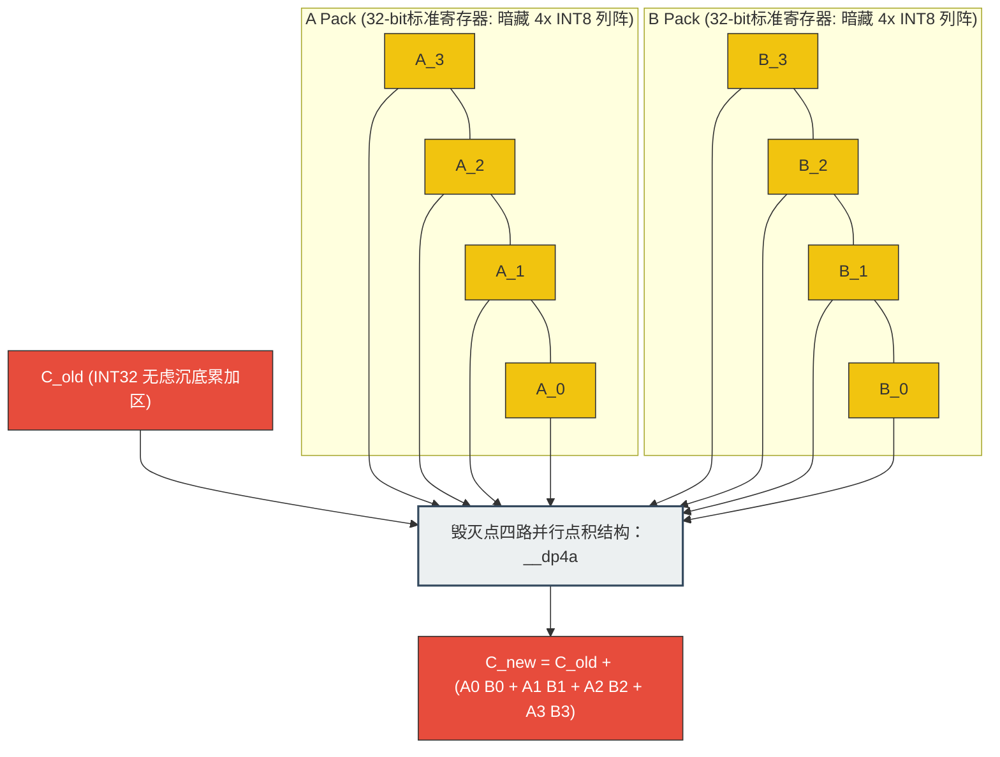
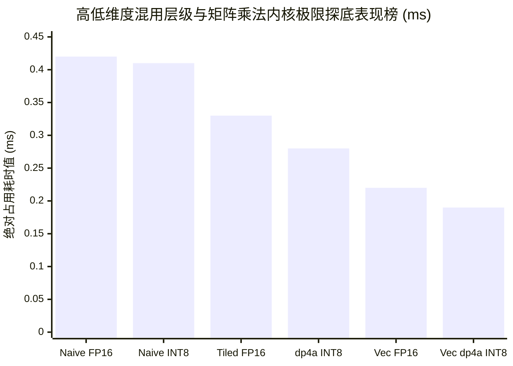

> 📖 **前置阅读**：01_Basics（带宽与算术强度）、04_GEMM_Optimization（FP32 GEMM 天花板）
> 📖 **推荐后续**：09_Tensor_Core（WMMA 硬件加速 FP16）、11_Inference_Optimization（推理级融合）

大模型时代的到来，让 GPU 面临一个残酷的物理现实：**算子通常被卡在显存带宽上（Memory Bound），而不是计算单元上（Compute Bound）**。

FP32（单精度浮点数）占据 4 字节，在 1008 GB/s 的 RTX 4090 显存带宽下，这意味着哪怕每个时钟周期都在极限搬移数据，吞吐的元素数量也是有硬性物理上限的。那如果直接把数据尺寸劈半呢？FP16 只要 2 字节，在这条恒定宽度的 HBM 物理通道上，数据吞吐量瞬间实现了**翻倍**。再狠一点，INT8 只要 1 字节，一次性塞入的数据是 FP32 的四倍。

这就是量化（Quantization）技术在工业界大放异彩的根本逻辑：不用修改任何复杂的业务逻辑算法，单靠缩减数据的物理宽度，就能大幅缓解由冯·诺依曼架构带来的访存瓶颈（Memory Wall）。但天下没有免费的午餐，精度缩减带来了表示范围的剧烈坍缩。FP16 的有效精度只有约 3.3 位十进制，INT8 更是只有惨淡的 256 个离散值。对于动辄几百亿参数规模的 LLM 而言，如何保证模型不会在此过程中智商暴跌？

在这篇博客中，我们将不再局限于高层次的算法理论，而是佩戴上显微镜，深入到具体的 CUDA Kernel 级实现。我们将深度剖析 FP16 与 INT8 是如何在 GPU 硅片上被调度、如何突破寄存器边界，以及在极限剥削性能的过程中产生的额外量化开销（Quant/Dequant Quantile）和具体的加速收益。这是一份从数据搬移到 `dp4a` 硬件指令的底层微观勘探报告。

---

## 一、量化与反量化的幕后成本：不免费的数据压缩

很多初学者容易陷入一个误区：觉得量化就像开个开关，数据就变成 INT8 飞奔了。但实际上，将数据从 FP32 转换到 INT8，本身就是运行在 GPU 上的完整算子调度，这也需要消耗宝贵的算力和带宽。在大型神经网络层级间，往往需要动态计算当前输入张量的统计特征，并在低精度运算前后强制插入量化（Quantization）和反量化（Dequantization）Kernel。

### 量化数学：缩放因子的提取与映射陷阱

将一个无穷小数域的 FP32 向量压缩到 INT8，我们工业上最常采纳的方案是**绝对最大值对称量化（Absmax Quantization）**。

假设输入张量为 $X$，我们需要把它安全地塞进 $[-127, 127]$ 这个狭窄的匣子里。首先我们需要找出其最大绝对值 $\max(|X|)$，然后计算一个全局唯一的缩放因子（Scale Factor）$s$：

$$s = \frac{\max(|X|)}{127}$$

随后，真正的映射截断过程即为：

$$X_{int8} = \text{round}\left( \frac{X_{fp32}}{s} \right)$$

反向恢复回去的算式十分简单，这也就是所谓的反量化：

$$X_{dequantized} = X_{int8} \times s$$

表面上看这是简单的除法，但寻找 $\max(|X|)$ 是一个经典的规约（Reduction）问题，它需要遍历并扫描整个显存庞大的体积，通常需要调用 `cub::DeviceReduce::Max` 这类并行的分块算法，这是一笔巨大的隐形成本。

在这个过程中，我们可以根据计算 $s$ 的细粒度，将其划分为两种主流策略：

1. **Per-Tensor 量化**：整个张量共享一个全局的 Scale。我们在 Kernel 设计中，所有线程在处理任何一个位点时都除以完全相同的常量。实现简单，硬件调度极快，但它隐藏着致命弱点——如果张量中存在个别极度巨大的激活值（Outliers，例如某些 Token 的响应达到 100+），为了包容这个刺客值，Scale 会被迫拉得极大。这就导致其他正常的小数值由于刻度太粗，在 $\text{round}$ 阶段被无情归零，发生严重的精度丢失（Accuracy Degradation）。
2. **Per-Channel 量化**：这是针对 Outliers 开出的解药。它选择按行或列统计极大值，各自维护一个独立的 Scale 数组（常常对应着 Hidden Dimension）。精度保住了，但在 GPU 层面，访存模式不可避免地变得分散且复杂。线程在读取主矩阵本体时，还要计算偏移量去副加载对应的 Scale 数据。

### 核心解密：转换开销的微观测量

为了更直观地感受这些准备动作的底牌，我们对规模为 $N=10M$（约 1 千万个元素，总物理内存占用 40MB 大小的单精度张量）进行 100 次迭代测试验证，提取自本工程的 `Results` 基准日志：

| 操作指令类型 | 核心 Kernel 耗时 (ms) | 表观有效带宽 (GB/s) | vs CPU 极限单核加速比 |
|:---|:---:|:---:|:---:|
| **FP32 → FP16 (直接强制转换 Cast)** | 0.02 | 2911.98 | 4432× |
| **FP16 → FP32 (反向转换 Cast)** | 0.02 | 2923.45 | 2567× |
| **FP32 → INT8 (标准 Per-Tensor)** | 0.02 | 2166.62 | 3580× |
| **INT8 → FP32 (标准 Per-Tensor)** | 0.02 | 2440.42 | 388× |
| **FP32 → INT8 (高精度 Per-Channel)**| 0.03 | 1762.77 | 2985× |

> ✨ **L2 Cache 的幽灵效应与真实带宽解释**
>
> 细心的性能调优师一定已经发现，表格中高达 2911 GB/s 的带宽数值，简直在挑战 RTX 4090 的极限物理带宽天花板（HBM 理论极值为 1008 GB/s）。难道我们发明了什么物理层面的空间折叠折跃技术吗？
> 并没有。答案潜藏在缓存的容量里。测试数据载体总量约为 40MB，而 4090 拥有极为庞大的 L2 Cache 容量（高达 72MB）。在 100 次迭代测试的严密逻辑下，原本面向全球（Global Memory）的访存事务，绝大部分被芯片内部极速响应的 L2 Cache 完美拦截吞噬了。这非常直观地展现了现代 GPU 在处理可以全面驻留于缓存的高频张量时，那让人叹为观止的极低延迟。

在这组硬派的数据面前，我们可以萃取出两个深度结论：

1. **强制类型转换极为廉价**。单纯依靠硬件支持的 `__float2half` 等指令构成的 Kernel 速度极快，时间开销仅仅为难以觉察的 0.02ms，也毫无额外的寄存器阻滞。不仅如此，即便囊括了复杂的浮点数除法、四舍五入（Round）以及超界钳制（Clamp）算式的 INT8 Per-Tensor 量化，只要依赖并行的 SIMT 调度，其时间同样持平于 0.02ms。
2. **细粒度访存惩罚**。然而当你选择高精度的 **Per-Channel 量化（0.03ms）** 后，相比前两者，其可感知的带宽骤降到了 1762 GB/s。罪魁祸首在于对于每一个特定的输入元素，硬件执行簇不再面对一个立即数（Immediate Value），而是被迫通过繁琐的 `tid % channels` 寻址在全局显存池捞取对应的外置参数 Scale。这种伴随着跨数据类型的内存请求跳跃，大幅提升了寄存器活跃生命周期，并阻塞了流水线（Stalled Pipelines）。

正因为此，在工业级落地大模型推理部署时，考量到任一单独 Kernel 均要经受高达 5~10 微秒的调用启停折损，当下主流方向均全力推进**算子融合（Operator Fusion）**技术。这意味着系统不给你留下存储中间副产品的空间，当诸如 LayerNorm 的算式在寄存器一经结算，立刻马不停蹄地在其所在上下文顺手劈入一遍缩放计算，然后直接以纯正的 INT8 身形吐去显存安眠。

---

## 二、FP16 GEMM 的算学奥义：双路向量化直达指令核心

在面向通用矩阵乘法（GEMM）这种高频吞吐怪物时，由单纯换作小位宽带来的显存缩减往往只是前菜。真正引动主核爆发力的，是我们对它的并行指令发掘（Instruction Level Parallelism）。

在处理 FP16 浮点流派时，除了使用符合标准的 `binary16`，NVIDIA CUDA 基建提供了一个特殊且霸道的兵器：复合数据类型 `half2`。利用这个神奇的类型包，我们只需要占据一个常规 32 位的空间段寄存器，就可以同时背附两个邻近的半精度数字。最为核心的是配套在底层的一条杀伤力机器指令——`__hfma2`。在流式多处理器（SM）中，仅需短短的单循环心跳（Single Clock Cycle），`__hfma2` 就能无视分歧地平行向这两个半精度元执行极其密集的连发乘加（Fused Multiply-Add）突袭。

### 三版 Kernel 的算术强度进化史

围绕 `01_fp16_gemm.cu` 我们重头复现了针对这套武库从陌生到驾驭的过程：

1. **Naive FP16 GEMM**：属于机械级的简单重构。只是单纯将接收形参改为 `half`，可是在乘加区域却被硬编码成 `__half2float`，被迫在 32 位的阵地做搏杀然后强行截转回写。这就好似开着 F1 赛车去送外卖，反而在运算的咽喉硬生生插入了沉重的格式重组阻力。
2. **Tiled FP16 GEMM**：标准的战术改进。应用了经典的分块内存映射（Tiling），依靠 Shared Memory 构建屏障，阻止了对庞大显存频繁的重复打捞。这确实降低了总搬运开销负担，然而它尚未拨转底层机制去调取并触碰属于 FP16 自身的双精度向量指令（Vectorized Ops）。
3. **Vectorized FP16 GEMM (`half2`)**：属于纯正的架构觉醒。我们不再按一个格子跳步，而是开始通过指针地址的重塑去掌控节奏。

抽出核心阵地的战斗代码块：

```cpp
// 核心思想：每 2 个相邻位置的数据强制并入属于同一个独立执行集
half2 sum2 = __float2half2_rn(0.0f);

for (int i = 0; i < N; ++i) {
    // 技巧点 1（广播构造）：把属于常量的偏置乘数 A 直接裂变成一模一样的分身
    // 提供给属于 half2 的前和后双端点。
    half2 a_val2 = __halves2half2(A[row * N + i], A[row * N + i]);
    
    // 技巧点 2（向量化吸入）：不再沿着单条 B 数值去寻址。直接借助 reinterpret_cast 
    // 将其定性为一个指针向半精数组合体，一次暴力抓走连续并排的两名元素。
    half2 b_val2 = *reinterpret_cast<const half2*>(&B[i * K + col]); 

    // 技巧点 3（双发神谕）：丢弃啰嗦的分别运算，由 __hfma2 一次指令完成
    // 对其封装体内部 x 和 y 两条线路的完全重合型平行加成运算
    sum2 = __hfma2(a_val2, b_val2, sum2); 
}
// 数据落听定格
*reinterpret_cast<half2*>(&C[row * K + col]) = sum2;
```

这段基于内存造型投射的魔法（`reinterpret_cast`），不但巧妙压缩了汇编语言内部的树状节点数量，另外一次性请求包裹 32 位事务也极大程度缓解了内存条带（Memory Segments）在对齐（Alignment）审查上的苛刻折损率。

### 实测算力穿透力报告

提取自矩阵规模为 $1024 \times 1024$ 计算规模阵列：

我们先做个算力验证的预先算计（Math Formulation）：
总浮点运算基数 FLOPs = $2 \times 1024 \times 1024 \times 1024 \approx 2.14 \times 10^9$ Ops。

| 流畅调度等级 | 核函数运作时间 (ms) | 对峙普通版本加速比 | 绝对运算算力界 (GFLOPS) |
|:---|:---:|:---:|:---:|
| **Naive FP16 GEMM** | 0.4239 | 1.00× | 5064 |
| **Tiled FP16 GEMM** | 0.3314 | 1.28× | 6477 |
| **Vectorized `half2`**| **0.2200** | **1.91×** | **9697** |

相比于初始版毫无节操的内卷转化消耗，在完全未更改矩阵本源宏观相乘原理法则的约束下，**Vectorized 凭实力拉扯出了近两倍速度的超长冲刺**。考量到由于我们故意锁定矩阵体积极小（在仅耗用约 0.22ms 的过程区间里不可避免包括极高的常数调度等待），但 **9.7 TFLOPS** 的暴击战绩表现得已经相当游刃有余。这一胜利雄辩表明，顺直着机器原生的执行并行律法，永远是榨干最后一滴计算油水的杀戮之道。

---

## 三、INT8 数据类型的暴力美学：`dp4a` 点积兵器谱

如果我们愿意向更加致密的纯粹整数空间迈出更离谱危险的一步呢？

老一代工程师可能还记得，在远于 Tensor Core 横空出世且普及的 Pascal 世代起，NVIDIA 便针对这种整点压缩需求在指令域内置入了一张让人无法拒绝的狂野王牌——`__dp4a`（Dot Product of 4 8-bit integers and Accumulate）。纯粹得让人发指：以粗糙来博取海量的宽度。

### 一挑四的群嘲：降维压缩与抗争

在一般情况下，当你解剖普通矩阵乘法的神经节点时，你不得不面对残酷的基础循环叠加论：搞定边长为 4 的点对向量的矩阵计算，你需要极其痛苦的四重相乘以及跟随在其尾气后面的三重相加叠加连携：

$$C_{new} = c_{old} + a_0 \times b_0 + a_1 \times b_1 + a_2 \times b_2 + a_3 \times b_3$$

要是基于普通的标量架构思维推进，上述等式等于要求你在执行排流堆满七个循环脉冲位置的指令！而 `dp4a` 作为专职碾压机，它接纳两个粗暴庞大的 32 位宽寄存器（这两名装甲车内各自完美潜藏着 4 个独立的 INT8 人质），在经过一个单脉冲下，所有四点独立横向撞击后瞬间汇聚入中央一个 `int32` 形态的累加堡垒中，而且连整型满溢崩溃（Integer Overflow）都不必担心！



### 再见僵硬，跨步对决：多版本重组推波与极限 Vectorized 阵线

但是在 `02_int8_gemm.cu` 项目实际布署过程阶段下，直接动用这挺超级机炮并不意味着你就拥有无敌压制力了，它暴露出极度刻薄的需求：**你拿什么保证能以匹配武器喷吐射速向里填充恰到好处拼装合并后弹药包？** 如果不能高效准备 32位 打包数据列阵集，强出手的反而成了你的绊脚石！

1. **Naive INT8 GEMM (0.407ms)**：保守无为，拒绝引入指令黑魔法。这属于在内部强行用 `int32_t` 嵌套来预防溢出计算沉降的摆烂作风。
2. **`dp4a` INT8 GEMM (0.276ms)**：它成功借调兵牌加入了战争！然而由于其原始数据池中，B 数组所指代的是一堵跨列访问并彻底割裂毫无连续可能的分布状态！因此被迫屈从使用掩码对列数据强扭 `(b_i & 0xFF) << 24 | ...` 利用 CPU 位域拼贴观念生造一打包实体组合，这造成不可避讳的指令拖慢。
3. **Vectorized `dp4a` INT8 (0.190ms)**：我们真正跨越桎梏达成重炮狂舞。
   - **四倍横掠扫射面**：重拟任务视野，强行拉宽每个计算丝线承办宽度，由一扩至四！以此倒逼读取阶段发生汇聚性团合并访问效应。
   - **连续纵深摄取**：对于之前恶心至极的跳位阵列矩阵 B 进行跨域连排打击吸纳（采用 `reinterpret_cast<int32_t*>` 把邻接片层一扫而光进缓存）。
   - **寄存器旋舞解构**：针对在寄存池内刚刚抢收进来的横置杂乱队列实行原生内洗牌倒置错位对齐重归类。

   ```cpp
   // 取出横向块截段里隐蔽埋藏着的乱序分布片体段并执行拆解
   int8_t r0_c0 = b_row0_pack & 0xFF;
   int8_t r1_c0 = b_row1_pack & 0xFF; // ...同规剥落列向牵引坐标系
   
   // 不在内存而在高速寄存器内实施即看即烧型的缝合连拼并立刻送进 dp4a
   int32_t col0_val = ((r3_c0 & 0xFF) << 24) | ... | (r0_c0 & 0xFF);
   ```

   - **十二管联装齐射落闸**：因为任务被拉幅铺展开，那它计算凝结结实成的结果簇体便被包涵于更恐怖的一阶系统构造体：`int4`（一次性承合四份独立分装 `int32_t` 占足 128 位段的装甲箱），并且只需要极少量的写指领指令直落内存归寂！

### 数据见证：跨时代的算力高地

针对这个规模为 `1024` 基数战役，数据将宣读胜败的最后证文：

| 内置策略流派 | 总核跑完耗时长段 (ms) | 跨段落时间节约 |整数吞吐能力 (TOPS)|
|:---|:---:|:---:|:---:|
| **Naive INT8 GEMM** | 0.4070 | 1.00× | — |
| **`dp4a` INT8 GEMM** | 0.2758 | 1.48× | — |
| **Vectorized `dp4a`** | **0.1900** | **2.14×** | **11.31** |



无需讳言，**Vectorized `dp4a` INT8 出师未捷便以绝对的优势力压全场摘魁 (0.19 毫秒)**。如果我们去追寻算法时间开创期的原本刻度线去对账的话，在同样数学框架内硬生生剔除了超过一半以上的执行周期时间（高达 2.14 倍）。伴随后缀运算强权整型累乘的双层计算点重计方式（Multiply 且 Accumulate 算为 2 项）它的数值化 TOPS 算计也强攀上 **11.31 TOPS**（Tera Operations Per Second）巅峰梯队。必须澄清，它未调用丝毫 Tensor Core 新贵加成护体！这种对指令密集极限压榨下而释放的出色动能（算术强度极速陡增突破），恰好体现了利用架构极性构建高密度流水脉络那所向不敌的硬底蕴。

你兴许抱有怀疑点：**既明说 INT8 在容量占用（1MB）全面战败 FP16（2MB）时少占优，为何那最为登峰的极致 0.19ms 它对立 FP16 0.22ms 并没翻下双倍领先差？** 此结所在，在于仅仅 $1024$ 的小型沙盒靶面上，任何的算术计算占位密度并没有越过硬件系统常数调度的屏障区界限去占据全局压倒性绝对压垮。如果向四千甚至万位数以上去递进扩维矩阵层边距的话，带宽短缺痛点更激烈的凸起将使得体积缩小附着的指数型正比反馈力道更不遮掩地发酵凸显。

---

## 四、混合精度工业化落地：重权抉择指北针

经历一连番直击痛点的灵魂代码级内燃交锋后，我们能稳健复局从战略极层归纳：量化与低浮动在落地重灾环境不可能是对任何问题随取随喷的万用喷雾剂！它是伴随着巨量损失威胁与高利息结算借用等不确定负反应并存的技术杠杆：

在全面梳理本次庞大测试图景总结分析下，这里将对高危领域场景下放选型排布给出一套可靠实据底牌指南：

| 所处严酷战役阵列特征情况分类 | 全图落地针对性优配推举方针 | 深层因果博弈核心论析推估 |
|:---|:---|:---|
| **极端带宽恶鬼缠身地带 (Memory Bound)**<br>例如常见 LayerNorm 分拣、SoftMax 等 | **坚守高姿态 FP16 半浮架构编排** | 在这等贫瘠水路下算力算计已经彻底无从着手耗尽空空流过，引入再一波的量化整数重组必定导致连增带扣额外执行惩罚与强转耗步计算。将通道纯用稳定浮点去喂才是保速首善正途。 |
| **突兀性奇高狂烈刺客爆裂区 (Extreme Outliers)**<br>比如常见庞大模型深度重网隐式表征 | **权数强制降档 INT8 + 连绵精准挂靠激活值 Per-Channel 压制** | 当不可思议的突变值不可阻挡去重撞缩放阵列基石，硬上全归（Per-Tensor）唯有一整篇数据皆变荒漠零的精度自毁一途。必须要割让阵地使用特殊列轴量化通道防爆，以保证最严紧的战术质量达标底线！ |
| **大规模深度火力互撕主阵高地 (Compute Bound核心)**<br>诸如密集厚度交缠 FFN 与多维深度的重算节点群 | **高度编排与权变组合搭配方案（譬如采用著名的 W8A8 甚至极致的 W4A16 混装构型）** | 长期不动用加载的权重彻底固封成为最极致下潜容量载体存储，避战大范围内存跨流而换以换取极大常驻生存；一旦当执行爆发运算任务接轨对峙之际启动类似 `dp4a` 高强核或启动最新代 Tensor Core 直接对阵厮咬以撕裂硬件物理屏保限度极效压榨上限端能限！|

本回对 FP16 型精微化、半精计算强并驱流控（`__hfma2`）、乃及直接突入整型最深下层底层指令深空对 `dp4a` 狂怒点算压并进行的解构性剖切探索，实则反复印证了系统高深工程中贯穿史传的唯一守则真理：**所谓真正震撼极致的无敌级速度破防力，从来不仅是妄想依靠某一单独出彩奇招功能键单核发挥完成绝杀的；只有在最缜密的数据构架配合最适配系统节拍下严丝合缝进行全流水排挤方能一鸣惊人突破极致！** 但是在这宽宏复杂的生态边界往里深掘这漫长修罗路中它并不是真正不可被取代的神域极点！假若当你不再需要顾及通用体系妥协将一整个特定化矩阵直接献祭入专门为其设定的重构封心神坛级硬件当中时... 力量将再次实现何等可怖的逆翻越维度突破？！下一期我们将直指本系列的核心封神地：**揭幕 Tensor Core (张量核) 神秘核心加速底端！**
