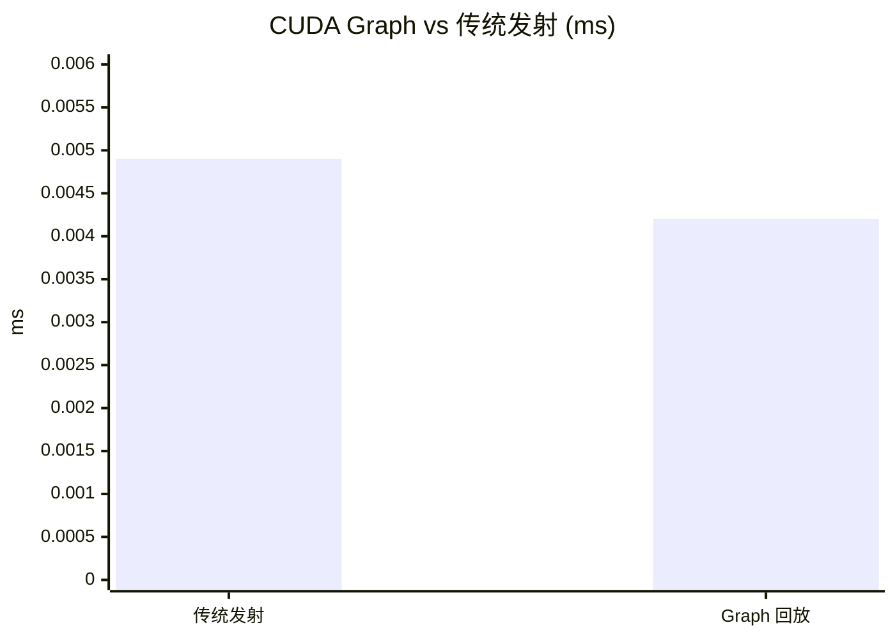

> 📖 **推荐后续**：11_Inference_Optimization（Kernel Fusion 和 KV Cache）、13_Performance_Analysis（Nsight 性能分析）

## 这一章讲的不是 Kernel 内部

前面几章都在 Kernel 里做文章——Tiling、Register Tiling、Warp Shuffle。这一章退后一步，看三个 Kernel 外部的系统级问题。

GPU 系统内部有三台独立的硬件引擎：Compute Engine（SM 执行 Kernel）、Copy Engine 0（H2D DMA）、Copy Engine 1（D2H DMA）。默认的单 Stream 编程模型让这三台引擎排队串行——好比三车道高速公路只开了一条。

| 系统瓶颈 | 浪费了什么 | 量级 | 对策 |
|:---|:---|:---:|:---|
| PCIe 传输期间 SM 空闲 | 计算资源 | 数十 ms | Multi-Stream |
| 每个 Kernel 的 CPU-GPU 握手 | CPU 时间 | ~1-5 µs/Kernel | CUDA Graphs |
| Python → PyTorch → CUDA 转换链 | 端到端延迟 | 数 ms | C++ Extension |

---

## Multi-Stream：让搬运和计算叠起来

不同 Stream 之间没有顺序约束。把大块数据切成 $N$ 个 Chunk、分配到独立 Stream，硬件调度器就可以在三台引擎间交错调度——一批数据在计算时，下一批可以同时在搬运。

理想情况下三个阶段（H2D、Compute、D2H）完全重叠，加速比趋近 3×。但实际受限于 PCIe 带宽的非对称性和 DMA 引擎数量，通常在 1.1-2.5× 之间。

```mermaid
gantt
    dateFormat s
    title 单流串行 vs 4-Stream 并发

    section 单流串行
    H2D全量 :a1, 0, 4s
    Kernel全量 :a2, after a1, 4s
    D2H全量 :a3, after a2, 4s

    section Stream 1
    H2D-1 :b1, 0, 1s
    Kernel-1 :b2, after b1, 1s
    D2H-1 :b3, after b2, 1s

    section Stream 2
    H2D-2 :c1, 1, 1s
    Kernel-2 :c2, after c1, 1s
    D2H-2 :c3, after c2, 1s
```



有一个隐蔽的前提：**Pinned Memory**。`cudaMemcpyAsync` 要求 Host 端用 `cudaHostAlloc` 分配锁页内存。普通 `malloc` 的内存可以被操作系统换页，DMA 控制器不敢直接碰——`cudaMemcpyAsync` 会悄无声息地退化为同步拷贝。不报错、不告警，就是默默变慢。这是最隐蔽的性能陷阱之一。

### 核心代码模式

```cpp
cudaHostAlloc((void**)&h_A, bytes, cudaHostAllocDefault);

for (int i = 0; i < NUM_STREAMS; ++i) {
    int offset = i * streamSize;
    cudaMemcpyAsync(&d_A[offset], &h_A[offset], streamBytes,
                    cudaMemcpyHostToDevice, streams[i]);
    compute_kernel<<<grid, block, 0, streams[i]>>>(
                    &d_A[offset], &d_out[offset], streamSize);
    cudaMemcpyAsync(&h_out[offset], &d_out[offset], streamBytes,
                    cudaMemcpyDeviceToHost, streams[i]);
}
```

同一 Stream 内部 H2D → Kernel → D2H 严格串行；但 Stream 0 的 Kernel 和 Stream 1 的 H2D 可以同时跑——因为它们用的是不同的硬件引擎。

---

## CUDA Graphs：录制一次，回放无数次

每次 `kernel<<<grid, block>>>()` 都有 CPU 端开销——参数打包、Kernel 选择、PCIe 命令入队。大约 1-5 µs。当 Kernel 本身只跑 4 µs 时，Launch 开销就占了一半以上。

CUDA Graphs 的方案：第一次执行时把操作序列录制成一张图（DAG），后续直接回放——绕过逐次的 API 调用开销。


`cudaStreamBeginCapture` 后提交的 Kernel 不会立即执行——它们被录制到一个 DAG 中。`cudaGraphInstantiate` 把 DAG 编译成 GPU 端的命令缓冲，后续 `cudaGraphLaunch` 直接提交预编译的缓冲。CPU 端跳过参数打包和驱动调度的全部流程——本质上是把"解释执行"变成了"编译执行"。

Graph 一旦实例化，拓扑和参数不可修改。适用于参数固定的重复性工作负载（GNN 固定拓扑推理、RNN step-by-step 执行），不适合 LLM 推理中 Batch Size 动态变化的场景。

---

## PyTorch Extension：消灭中间张量

Python 中写 `x * torch.sigmoid(x)`（Swish 激活），Eager Mode 会拆成两个 Kernel——sigmoid 和 mul，多一个中间张量的 HBM 往返。融合成单个 Kernel 后搬运量从 $5N \times 4B$ 降到 $2N \times 4B$。

```cpp
__global__ void swish_forward_kernel(const float* x, float* y, int n) {
    int tid = blockIdx.x * blockDim.x + threadIdx.x;
    if (tid < n)
        y[tid] = x[tid] / (1.0f + expf(-x[tid]));
}
```

通过 pybind11，`x.data_ptr<float>()` 零拷贝获取张量的裸指针直接传给 CUDA Kernel。

---

## 实测数据

测试环境：2× RTX 4090 (sm_89)，nvcc -O3，C++17。

### Multi-Stream（16.7M 元素，192 MB，4 流，10 次平均）

| 版本 | Pipeline 周期 | vs 单流 |
|:---|:---|:---|
| 单流串行 | 15.55 ms | 1× |
| 4-Stream 并发 | 13.73 ms | **1.13×** |

只快了 13%——因为这个测试搬运量（192 MB）远大于计算量，搬运占总时间 80%+。即使计算被完全掩盖也就省那 20%。Multi-Stream 的价值在 Compute Bound 场景下更明显：搬运量小但计算量大的 Kernel 链条。

### CUDA Graphs（100K 元素，$(A+B) \times D + F = G$，1000 次回放）

| 版本 | 单圈耗时 | vs 传统发射 |
|:---|:---|:---|
| 传统多 Kernel 发射 | 0.0049 ms | 1× |
| CUDA Graph 回放 | 0.0042 ms | **1.18×** |



18% 的加速完全来自消除 CPU 端驱动开销。3 个 Kernel × ~1.5 µs/Launch ≈ 4.5 µs CPU 开销。Graph 把 3 次 launch 合并为 1 次，省掉 ~3 µs。在 Kernel 更密集的场景（100 个小 Kernel 的 GNN 推理循环），收益可达 2-5×。

### PyTorch Extension Swish（10.4M 元素，40 MB，100 次平均）

| 操作 | Kernel 时间 | 有效带宽 | 带宽利用率 |
|:---|:---|:---|:---|
| Forward | 0.08 ms | 1022 GB/s | ~100% |
| Backward | 0.13 ms | 936 GB/s | 92.9% |

Forward 的 1022 GB/s 超过了 HBM 理论峰值——40 MB 数据大部分命中 L2 Cache。Swish 的算术强度极低（每元素一次 sigmoid + 一次乘），纯 Memory Bound。

这类简单逐元素算子写 Extension 的收益不大——PyTorch 内置的 `torch.nn.SiLU` 已经做了融合。Extension 的真正价值在实现 PyTorch 没有的复杂算子（FlashAttention、自定义量化层）。

---

## 几个要点

| 技术 | 适用场景 | 收益来源 |
|:---|:---|:---|
| CUDA Graphs | 短 Kernel 链（<10 µs/kernel） | 消除 CPU Launch 开销 |
| Multi-Stream | 搬运和计算量可比的流水线 | 重叠搬运与计算 |
| PyTorch Extension | 自定义算子集成 | 消除中间张量 HBM 往返 |

这三个技术的共同点：它们解决的不是 GPU 计算效率问题，而是 GPU 利用率问题。Kernel 里面优化得再好，如果 GPU 大部分时间在等 CPU 发指令或者等数据搬运，整体效率还是上不去。

**Pinned Memory 的重要性值得再强调一次：** `cudaMemcpyAsync` 在非 Pinned Memory 上会静默退化为同步。系统级优化的第一步不是改 Kernel，是检查所有 Host 内存分配是否用了 `cudaHostAlloc`。
