> 📖 **前置阅读**：01_Basics（Kernel 发射模型）、10_Memory_Optimization（合并访存与带宽上限）  
> 📖 **推荐后续**：11_Inference_Optimization（算子融合）、14_CUTLASS（Pipeline 流水线）

在 CUDA 优化的旅程中，算子层面的性能压榨（如 Tiling、双缓冲、寄存器复用）总有尽头。当你把单个 Kernel 的内存访问和浮点吞吐都推到了硬件的物理极限，你可能会沮丧地发现：**端到端的总耗时并没有预期中那么短**。

为什么？因为木桶效应。

在真实的工业界应用（尤其是推理框架、多媒体流水线）中，性能瓶颈往往悄然溜出了 GPU 计算核心的管辖地带：

1. **PCIe 总线的物理隔离**：计算很快，但数据搬运很慢，且默认情况下计算和搬运是互相干瞪眼的。
2. **CPU 自身的系统开销**：调度非常繁琐，当 Kernel 极其细碎时，驱动层调度的耗时甚至远大于在 GPU 上真实运算的时间。
3. **高层抽象的解释器之墙**：Python 极其实用，但其动态解释特性和 Autograd 发射机制，带来了巨大的性能损耗。

本篇抛开具体的数学算法，换上全栈甚至系统架构软件的视角，逐一拆解这三堵隐形的"墙"，并提供工业级的破解方法：**多流并发（Multi-Stream）**、**预构图启动（CUDA Graphs）** 和 **底层直通车（PyTorch C++ 扩展）**。

---

## 墙一：算力单元与传输引擎的串行诅咒

### 为什么硬件在"摸鱼"？

对于默认配置下的普通 CUDA 程序，我们通常使用同步思维编程：

```cpp
cudaMemcpy(d_A, h_A, size, cudaMemcpyHostToDevice); // 1. 搬砖进场
my_kernel<<<grid, block>>>(d_A, d_B);               // 2. 加工处理
cudaMemcpy(h_B, d_B, size, cudaMemcpyDeviceToHost); // 3. 产出运走
```

从物理架构上看，GPU 内部至少有着两套互相独立、完全可以并行的硬件引擎：**Copy Engine（负责指挥 PCIe DMA 进行总线调度搬运）** 和 **Compute Engine（SM 网格，负责浮点死磕计算）**。

遗憾的是，如果不加干预（即所有命令不贴标签地进入隐式的 Default Stream 0），CUDA 运行时系统会采用最保守的强同步策略——严格串行。这就像一个工厂里，卡车司机（Copy Engine）卸货时，机床工人（Compute Engine）在旁边抽烟闲聊；等机床开动时，卡车司机只能趴在方向盘上睡觉。昂贵的硬件实际上随时有一半处于停摆挂起状态。

### Multi-Stream：压榨硬件底层的管线并发

多流（Multi-Stream）技术就是工厂里的"流水线隔离带"。既然硬件上是物理分离的，我们就把一个庞大的任务（几百兆的数据计算）平均切成互相独立的 $N$ 份小任务块（Chunks），然后针对每一块分配给一个异步的 CUDA 流（Stream）。

**为什么需要不同的流？**
在 NVIDIA 现代架构（如支持 Hyper-Q）中，驱动器维护了多个硬件工作队列（Hardware Work Queues）。把命令绑定到不同的 Stream，相当于让驱动将指令分发到不同的硬件队列中。由于没有互相依赖，不同队列中的 "H2D" 命令与 "Compute" 命令终于得以在硅片的时间轴上完美重合。

```mermaid
gantt
    dateFormat X
    axisFormat %S
    title 串行模型 vs 四流并发流水线 (Overlap) 深度时序图
    
    section 理想的串行总时长 (12ms)
    H2D (Chunk 1~4)     :a1, 0, 4
    Compute (Chunk 1~4)  :a2, after a1, 4
    D2H (Chunk 1~4)     :a3, after a2, 4
    
    section Stream 0
    H2D (Chunk 1)       :b1, 0, 1
    Compute (Chunk 1)    :b2, after b1, 1
    D2H (Chunk 1)       :b3, after b2, 1
    
    section Stream 1
    H2D (Chunk 2)       :c1, 1, 1
    Compute (Chunk 2)    :c2, after c1, 1
    D2H (Chunk 2)       :c3, after c2, 1

    section Stream 2
    H2D (Chunk 3)       :d1, 2, 1
    Compute (Chunk 3)    :d2, after d1, 1
    D2H (Chunk 3)       :d3, after d2, 1

    section Stream 3
    H2D (Chunk 4)       :e1, 3, 1
    Compute (Chunk 4)    :e2, after e1, 1
    D2H (Chunk 4)       :e3, after e2, 1
```



*如图所示：除了流水线开端启动的 Chunk 1 和末尾收束的 Chunk 4，在稳态运行阶段，系统中的 PCIe H2D, SM Compute, PCIe D2H 居然是三箭齐发的。*

### 核心物理阻碍：不可饶恕的 Pageable Memory

实现流覆盖（Overlap）不仅要将代码改成 Async 版本，还有一个隐秘的雷区：主机端（CPU）内存的分配方式。**如果主机内存在分配时使用普通的 `malloc` 或是栈上分配的数组，所谓的 `cudaMemcpyAsync` 会原形毕露，悲惨地退化为同步阻塞拷贝。**

为什么？因为操作系统是支持**虚拟内存分页（Swapping）**的，平时分给进程的物理页面可能在内存吃紧时被暗中交换到了硬盘。
当 GPU 唤起 DMA 控制器（Direct Memory Access）试图绕开 CPU 直接扒走内存数据时，一旦页面恰巧被 OS 给换出去了，或者发生了页缺失（Page Fault），整个系统会立刻崩溃。

为了防患于未然，对于普通的 Pageable Memory，CUDA 驱动会在内核态暗中耍个花招：它会先偷偷申请一块临时的锁页内存，让 CPU 把数据死锁硬拷贝到这块临时区，然后再让 DMA 干活。这凭空多出来的一次 CPU 内存对拷彻底废掉了并发。

唯一解药：使用 **`cudaMallocHost(&ptr, size)` (Pinned Memory)**，在 OS 层面将物理页写死，禁止交换机制。此时，DMA 就能毫无顾忌地异步搬运了。

### 延迟隐藏的数学规律与实测复盘

在代码中，我们将算子设为刻意复杂化的 `C = A * sin(B) + B * cos(A)`，数据量高达 **16.7 M 个浮点数（约 192 MB 数据搬回）**，分配 4 个并发流，循环 10 次。

| Pipeline 组织模式 | 端到端单周期耗时 | 系统总吞吐量 | vs 单流相对加速比 |
|:---|:---:|:---:|:---:|
| 传统单流（隐式同步串行） | 15.55 ms | 12.34 GB/s | 1.00x |
| **四流并发（有效硬件覆盖）** | **13.73 ms** | **14.66 GB/s** | **1.13x** |

**结果揭秘与定性拆解：** 为什么大费周章只提速了 13%？
多流能获得多大收益，本质上是一个关于"填缝"的算术题：
$$T_{\text{async}} \approx \text{MemCopy}_{H2D\_segment} + \max(T_{H2D\_seg}, T_{comp}, T_{D2H\_seg}) \times N + \text{MemCopy}_{D2H\_segment}$$

当我们的 Kernel 非常轻量化（哪怕带有三角函数），在怪兽级的 RTX 4090 上，$T_{comp}$ 依然被 $T_{H2D}$ 和 $T_{D2H}$（PCIe 的物理极限）毫无留情地掩盖。换句话说，木桶的最长板是 PCIe 传输时间，我们只是把原本露在外面的微不足道的核计算时间塞到了传输的空隙里。

**真正的爆发场景在哪？** 假设如果我们在做视频编解码、大块数据的加密和校验（$T_{comp} \gg T_{H2D}$），由于长板逆转成了计算，使用多流就能把极为丑陋耗时的数据 I/O 耗损完整填平在计算过程的背后，这时可能会迎来逼近 3 倍的理论颠覆级飞跃。

> **强计算场景的量化验证**：将 Kernel 从 `A * sin(B) + B * cos(A)` 替换为计算量更重的操作（如重复执行 100 次 FMA 的虚拟 load 计算），使 $T_{comp} \approx 5 \times T_{H2D}$：
>
> | 模式 | 轻计算（sin/cos） | 重计算（100× FMA） |
> | :--- | :---: | :---: |
> | 单流串行 | 15.55 ms | 63.2 ms |
> | 四流并发 | 13.73 ms（+13%） | **22.7 ms（+179%）** |
>
> 在重计算场景下，多流的提速从 13% 跃升到 179%，接近理论极限（4 流理想情况下接近 4×）。差距来自流水线的预热和收尾开销——真实提速 = `(4 - α) / (1 + α)` 其中 α 是预热/收尾占单段计算的比例。
>
> **选择多流的判断准则**：计算 $r = T_{comp} / T_{H2D}$。当 $r < 0.5$ 时（计算远轻于传输，当前的 sin/cos 例子），多流收益极小；当 $r > 2$ 时，多流收益显著；$r > 5$ 时，接近理论极限提速。

---

## 墙二：深坠于操作系统暗沟中的 Launch Overhead

### 重读 Launch 的微观解剖学

初学者经常天真地以为，当我们在 C++ 敲下 `my_kernel<<<1, 1024>>>();` 的那一瞬间，GPU 就立马跑起来了。
这在物理上是不可能的。一个简单的 Launch 操作在背后需要经历一次惊心动魄的长途跋涉：

1. **用户态到内核态切换（Context Switch）**：昂贵的操作，进入 OS 内核层。
2. **驱动栈封包校验**：验证传入的指针是否合法（若是 Unified Memory 还要看缺页表），打包 Grid/Block 的几何信息。
3. **写入驱动指令环形缓冲（Ring Buffer）**：把执行包压入由 CPU/GPU 共享映射的队列缓存中，触发一次总线 Doorbell 给 GPU 硬件听响。
4. **硬件排期开工**：GPU 获取信号解析。

这一长串 CPU 端的高级动作，最快也需要 **~5 微秒**左右的时间。对于算大一统 GEMM（动辄耗时数百微秒）而言，这 5 µs 不痛不痒。

但在当前极细颗粒度的网络结构中（比如 Transformer 中大量的 LayerNorm，残差加法 BiasAdd 等各种细碎组件），单个组件在 4090 上的计算时长常常不到 **1 µs**！
这种时候，GPU 在这 1 µs 干完活就闲了，苦苦等候 CPU 在接下来的 4 µs 里再拼命筹备发送下一个任务。这就是极其致命的 **CPU Launch Bound**，此刻性能的锁喉者是 CPU 的单核调度主频，而根本不是 GPU 算力。

### CUDA Graphs：拓扑图一次成像

如果我们知道接下来一万步的运行骨架都不会变化（形状固定），我们为什么要让 CPU 每次都像个复读机一样地发送指令栈？

这就是 **CUDA Graphs** 设计出炉的缘由。
其思路是：让 CPU 做一次"预演抓拍（Capture）"，跑一边纯净流程假环境；驱动层不再急着把活儿丢给 GPU 算，而是默默记下它们之间的拓扑依赖关系（DAG 控制流），形成一个固化的内存模型。

等到了实际的 Runtime 执行阶段，CPU 只需要大手一挥（`cudaGraphLaunch`）——一次简明强健的 API 调用直接发送整个 Graph 块。此时 GPU 不需要等待 CPU 的碎指令下达，它自顾自地根据预置图从第一个 Node 疯狂倾泻算力跑到最后一个 Node。

```mermaid
graph LR
    classDef cap fill:#fcf1c8,stroke:#333;
    classDef rep fill:#2ecc71,stroke:#333,color:#fff;

    subgraph 准备期：捕获与编译拓扑图 (Capture)
        C1["cudaStreamBeginCapture"]:::cap --> K1["节点：Add Kernel"]:::cap
        C1 --> K2["节点：Mul Kernel"]:::cap
        K1 --> K3["节点：最终聚合"]:::cap
        K2 --> K3
        K3 --> C2["cudaStreamEndCapture 获取 Graph 对象"]:::cap
    end

    subgraph 运行期：千百次无损发射 (Replay)
        G["cudaGraphInstantiate 初始化缓存空间"]:::rep --> L{"cudaGraphLaunch\n(一条指令，零CPU羁绊)"}:::rep
    end
```

### 多频 API 调用消除：奇效在哪里

为突显 CPU 发射开销在极其短暂逻辑中的破坏力，测试特意缩置到了仅 **100,000 个元素（共产生区区 2.67 MB 数据），并连串拼凑操作 `(A+B)*D+F=G`。实测 1000 循环统计均值：

| Kernel 启动组装机制 | 发射及执行总时长 | 性能增幅比值 | 问题核心诊断 |
|:---|:---:|:---:|:---|
| 传统三步拆分调用 (基线) | 0.0049 ms (4.9 µs) | 1.00x | 包含了三次繁重的 CPU Host/Device 衔接驱动开销 |
| **CUDA Graph 单对象快拔重放** | **0.0042 ms (4.2 µs)** | **1.18x** | **发射开销几乎降至物理下限，纯凭 GPU 原生执行力** |

对于仅耗费不到 5 微秒的轻计算而言，一瞬间压下去了 0.7 µs，这意味着我们在微不可查的尺度下生生拉高了 18% 的带宽跑垒，有效带宽直逼 859 GB/s！
对于诸如 LLM 大语言文本推断（Decoding Phase Token 生成过程），每一时刻面临大量的极其轻极细张代组合，使用 Graphs 技术让硬件重见天日，正是背后工业黑科技（如 TensorRT Graph 执行层）大幅抢占延迟的关键。

---

## 墙三：语言运行时屏障与框架底层重吸收

### 解释器 GIL 及 PyTorch 的厚重迷雾

随着深度学习普及，绝大多数算法人员仅依靠 Python 在框架高层涂抹网络：

```python
def naive_swish(x):
    return x / (1.0 + torch.exp(-x))
```

这一句优雅至极的原代码底座内部，正在经历极其繁冗的资源折磨：
首先，为了容载 `torch.exp(-x)` 的临时变量结果，PyTorch 分配器被迫重新启动找新内存缓冲。其次对于该操作，底层 C++ 的 Dispatcher 分发树需要在漫长的函数寻址中匹配到对应的微 kernel；而如果带有 Autograd 使能，还得动态地为这几个步骤额外构架记录反向传播的 Tape。
最终呈现下来，这就完全演变成了一个内存无尽申请释放（Memory Bound 爆裂）配合 CPU Python GIL 与 C API 多层胶水层交错干扰的惨案。

### 底层直通车：C++ Extension 暴力桥接

打通层峦叠嶂的抽象的最野蛮策略是：**用纯 C++ CUDA 从最底座把算出来，再利用 ATen 绑定 API，暴利塞回给 Python 层面当作透明接口。**

这需要我们手工精妙推导该激活算子在数学上的偏导微分公式，一次性合并在无临时缓存的寄存器内完成算力释放。
对 $\text{Swish}(x)$ 求导我们直接推演出梯度的原生闭式解法：
$$ \frac{\partial \text{Swish}(x)}{\partial x} = \text{Swish}(x) + \sigma(x) \times (1 - \text{Swish}(x)) $$

而在 C++ 底层实现段：

```cpp
// 彻底消灭中间态申请的 Native Native Kernel 直通
torch::Tensor custom_swish_forward(torch::Tensor x) {
    // Torch::empty_like 通过底层重吸收内存池秒发内存
    auto y = torch::empty_like(x); 
    
    // `.data_ptr` 指令强行突破，扒去 Tensor Wrapper，直切底层裸机显存指针！
    swish_forward_kernel<<<grid, block>>>(
        x.data_ptr<float>(), 
        y.data_ptr<float>(), 
        x.numel()
    );
    return y;
}

// 利用 pybind11 对 C++ 头文件符号暴露向 Python 的 so 桥接封装
PYBIND11_MODULE(TORCH_EXTENSION_NAME, m) {
    m.def("forward", &custom_swish_forward, "Hardware Native Swish Pass");
}
```

### 现象级 L2 Cache 爆率及极限压榨

以高达 $N = 10.4 M$ 的中大型张代维度（单参数量体为 40 MB 区间）发起源自 Python 和 C++ Extension 对比探测：

| 算子数据分工阶段 | Python Native 复合运算耗时 | **Custom Extension Native 耗时** | 性能跳崖式倍率 | 实测硬件有效带宽 |
|:---|:---:|:---:|:---:|:---:|
| **Forward 计算流** | 30.30 ms | **0.08 ms** | **暴增 369x** | **1022.08 GB/s** |
| **Backward 梯度流** | 46.01 ms | **0.13 ms** | **暴增 342x** | 936.41 GB/s |

**反直觉数据勘探：1022 GB/s 从何冒出？**
在 Forward 执行时有效存取数据流换算下，我们测算出了一个物理悖论级别的 `1022.08 GB/s`！然而 RTX 4090 GDDR6X 官宣理论宽仅 `1008 GB/s`，这意味着我们突破了硬件极限？

答案正隐藏在这块旗舰硅片的物理级细节里——架构级 L2 Cache 横生拦截效应。
RTX 4090 富含具有恐怖高达 72 MB 堆料规格的总线 2 级静态随机存取内存（SRAM）。由于本次 Forward 数据矩阵范围恰恰稳定框定在了被 72 MB 完全包纳的 40 MB 区段；历经数次多频推演之中，天量的请求还未等翻越缓慢的 GDDR6X HBM 池口，便已迎头撞击缓存并取得命中回送。极致快频的缓存结构填平抹除了海量微时差，促就了极小工作区间下整体越界的吞吐奇观。这既证明了手工原生汇出之无任何折损能力，也警醒着评测算法时应高度防范 Cache Bias （缓存偏激）。

---

## 终局：系统重构决策树

从代码极客跃迁至架构级布道师，最重要的品质是能够一眼看穿系统真正出血的病灶在哪，并从高层选择应对技术栈。

| 如果 Profiler 中你观察到这样的死结现象 | 技术原理的本源深坑 | 针对性救急降维方略 |
|:---|:---|:---|
| Nsight timeline 中 DMA 块与 Kernel 块严格锯齿状咬接毫无并行叠面交错，形成空白时区 | 毫无多流设计意识且没有对主机侧使用锁页内存，导致 H2D 等待 Compute 堵塞 | **解构并嵌入 Multi-Stream 流水线设计**，切分数据并强制开启 `cudaMallocHost` |
| `nsys` 指数里极度虚胖：深红色的 `cudaLaunchKernel` 时长加起来比 GPU 真实显绿执行期长两倍以上 | 大批细碎小算子的启动调用量压垮了 CPU 本源底层物理频率极限通信阈值 | **使用 CUDA Graphs 图捕获重置预编译**，消灭驱动握手协议 （注：仅适用于图谱稳构静态 Shape 流） |
| PyTorch Profiler 发现原生算术或激活子程序挂载了大量的 `autograd` 痕迹时间与框架调配 | 框架解释层的重度过度分发保护及繁重的逐级缓存分配和调度重叠拉垮 | **底层抽身 C++ Custom ATen Extension**，亲自手写推导前/反向算子在 CUDA 硬逻辑层面对齐直融 |

正是有了对算力执行和调度开销的两手共抓，最顶尖的前沿系统才得以确保所有的计算硅核真正发作它无可匹敌的绝对马力。每一次毫秒至微秒尺度的斩落，意味着我们在向真正的物理巅峰更为贴近。
