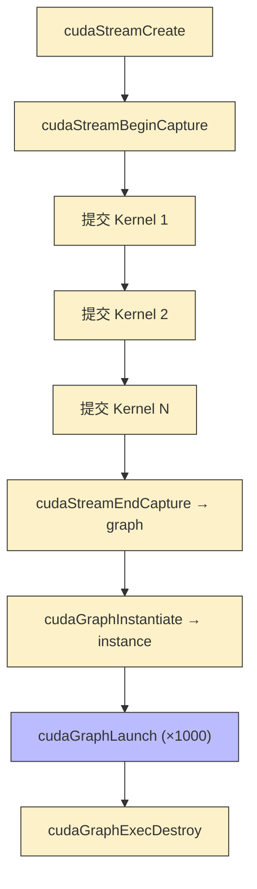
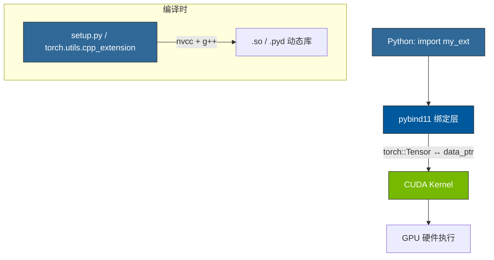
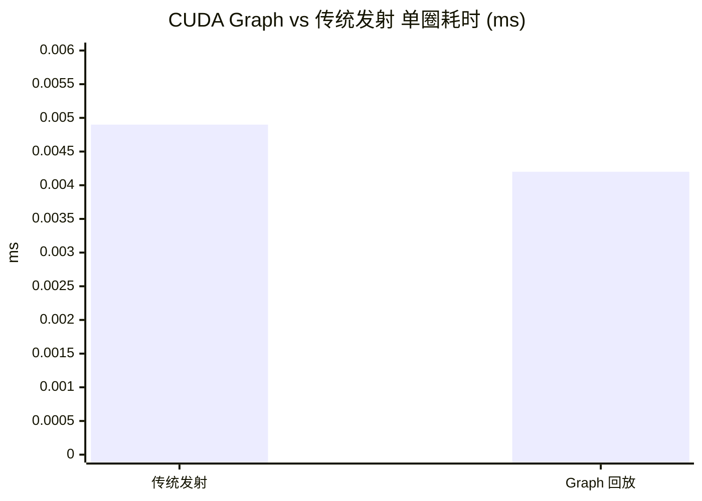

## 楔子：当单 Kernel 已经足够快，瓶颈在哪里？

在前面七章中，我们不断地榨干单个 CUDA Kernel 的性能——从 SMEM Tiling 到 Warp Shuffle、从向量化加载到 dp4a 指令。然而，在生产环境中运行一个完整的推理 Pipeline 时，你会发现一个令人沮丧的 Profiler 结果：**GPU 有大量时间处于空闲状态**。

罪魁祸首不在算子本身，而在**系统级隔离墙**。现代 GPU 系统由三台独立硬件引擎驱动——**Compute Engine**（SM 计算）、**Copy Engine 0**（Host→Device DMA）、**Copy Engine 1**（Device→Host DMA）。默认的单 Stream 编程模型让这三台引擎串行排队，如同三车道高速公路上只开了一条道——利用率仅 ~33%。

| 系统瓶颈 | 问题本质 | 典型量级 | 对策 |
|:---|:---|:---:|:---|
| **PCIe 传输空洞** | H2D/D2H 搬运时 SM 全部闲置 | 数十 ms 级 | Multi-Stream 并发 |
| **CPU Launch 开销** | 每个 Kernel 启动需 CPU-GPU 握手 | ~1-5 µs/Kernel | CUDA Graphs |
| **框架隔离墙** | Python → PyTorch → CUDA 多层转换 | 数 ms 级 | C++ Extension |

以 Multi-Stream 为例：PCIe 4.0 x16 的单向带宽仅 ~26 GB/s，而 RTX 4090 的 HBM 带宽高达 1008 GB/s——**PCIe 只有 HBM 的 2.6%**。如果你的 Pipeline 需要频繁搬运数据，而搬运期间 128 个 SM 全部停工，那么你的实际 GPU 利用率可能不到 50%。

本章通过三个精准打击：**Multi-Stream 让三台引擎同时转、CUDA Graphs 消灭 CPU 发射开销、PyTorch Extension 拆掉框架隔离墙**——在不改任何 Kernel 代码的情况下获得系统级加速。

---

## 第一性原理与机制解析

### 一、Multi-Stream：异步流水线的物理基础

为什么默认的单 Stream 会浪费硬件？因为 CUDA 的 **Stream 严格保序语义**：同一 Stream 内的操作按入队顺序串行执行。当 H2D 正在搬运时，Compute Engine 必须等待——即使 H2D 和 Compute 使用的是完全不同的硬件。

Multi-Stream 的核心思想是**分段流水**：将大块数据切分为 $N$ 个 Chunk，每个 Chunk 分配到独立的 CUDA Stream。不同 Stream 之间没有顺序约束，硬件调度器可以自由地在三台引擎间交错调度：

$$T_{\text{pipeline}} \approx T_{\text{first\_H2D}} + (N-1) \times \max(T_{\text{H2D}}, T_{\text{Compute}}, T_{\text{D2H}}) + T_{\text{last\_D2H}}$$

当三个阶段的耗时接近时，理想加速比趋近 **3×**。但实际中受制于 PCIe 带宽的非对称性和 DMA 引擎数量，加速比通常在 1.1-2.5× 之间。

```mermaid
gantt
    dateFormat s
    title 单流串行 vs 4-Stream 并发时序

    section 单流串行
    H2D全量 :a1, 0, 4s
    Kernel全量 :a2, after a1, 4s
    D2H全量 :a3, after a2, 4s

    section Stream 1
    H2D-1 :b1, 0, 1s
    Kernel-1 :b2, after b1, 1s
    D2H-1 :b3, after b2, 1s

    section Stream 2
    H2D-2 :c1, 1, 1s
    Kernel-2 :c2, after c1, 1s
    D2H-2 :c3, after c2, 1s

    section Stream 3
    H2D-3 :d1, 2, 1s
    Kernel-3 :d2, after d1, 1s
    D2H-3 :d3, after d2, 1s

    section Stream 4
    H2D-4 :e1, 3, 1s
    Kernel-4 :e2, after e1, 1s
    D2H-4 :e3, after e2, 1s
```



**关键前提——Pinned Memory**：`cudaMemcpyAsync` 要求 Host 端使用**锁页内存**（`cudaHostAlloc`）。原因很底层：普通的 `malloc` 分配的内存可被操作系统换页（Page Out），DMA 控制器无法在不经 CPU 的情况下安全访问——因为物理地址可能随时改变。Pinned Memory 将虚拟地址锁定到物理页框，DMA 引擎可以直接发射 PCIe 事务，CPU 无需介入。

### 二、CUDA Graphs：从"每次握手"到"一次录制，无限回放"

每次从 CPU 发射一个 Kernel，驱动程序需要执行：参数打包 → 内核选择 → PCIe 命令队列入队 → GPU 端 Work Distribution。这套流程约消耗 **1-5 µs**。

当 Kernel 执行时间本身很短（≤10 µs）时——这在 GNN 推理、小模型 Token-by-Token 生成等场景中极为常见——**CPU 排队时间和 GPU 计算时间几乎相当**，系统陷入 CPU Bound。

CUDA Graphs 通过 **Stream Capture** 将一组操作的完整 DAG 拓扑在准备期录制为一个不可变的 Graph 对象：


运行时仅需 `cudaGraphLaunch(instance, stream)` 一条 API 调用即可发射整个 Graph。GPU 端的命令分派器在硬件层级直接执行预编译的指令序列，CPU 端开销降至 **~0.1 µs**——比传统发射快一个数量级。

### 三、PyTorch Extension：消灭"中间张量"的最终手段

在 Python 中写 `x * torch.sigmoid(x)`（Swish 激活），PyTorch 的 Eager Mode 会：

1. 调用 `sigmoid` Kernel → 从 HBM 读 $x$、写中间张量 $\sigma(x)$
2. 调用 `mul` Kernel → 从 HBM 读 $x$ 和 $\sigma(x)$、写输出

**两次 Kernel 启动 + 一次多余的中间张量 HBM 读写**。总搬运量 = $5N \times 4B$（读 $x$ 两次、读写 $\sigma(x)$、写输出）。

通过 C++/CUDA Extension，可以将 Swish 融合为单个 Kernel：

$$\text{swish}(x) = x \cdot \sigma(x) = \frac{x}{1 + e^{-x}}$$

融合后搬运量 = $2N \times 4B$（读 $x$、写输出），**带宽消耗降低 60%**。

---

## 核心优化演进与硬件映射

### GPU 硬件的三台独立引擎

理解 Multi-Stream 的前提是认识到 GPU 内部的**硬件级并行**：

| 引擎 | 职责 | 硬件资源 |
|:---|:---|:---|
| **Compute Engine** | 执行 CUDA Kernel（SM 上的 Warp 调度） | 128 个 SM，每 SM 1536 线程 |
| **Copy Engine 0** | H2D DMA（Host → Device 搬运） | PCIe 4.0 x16，~26 GB/s |
| **Copy Engine 1** | D2H DMA（Device → Host 搬运） | PCIe 4.0 x16，~26 GB/s |

这三台引擎共享 GPU 芯片但在不同的硬件流水线上运行。CUDA 的 Stream 语义只约束**同一 Stream 内部的操作顺序**，不约束跨 Stream 的操作——这给硬件调度器留出了自由安排三台引擎的空间。

### CUDA Graph 的生命周期



关键约束：Graph 一旦 Instantiate，其拓扑结构和参数**不可修改**。如果需要改变 Kernel 参数（如不同 batch 的输入指针），需要使用 `cudaGraphExecUpdate` 或重新 Capture。这适用于 **参数固定的重复性工作负载**（如 GNN 的固定拓扑推理、循环 RNN 的 step-by-step 执行）。

### PyTorch Extension 的编译链路



`data_ptr<float>()` 是 ATen 张量到原始 CUDA 指针的零拷贝桥梁——它直接返回张量底层显存的 `float*` 地址，不做任何内存复制。这让 CUDA Kernel 直接操作 PyTorch 管理的显存，避免了额外的 Host↔Device 搬运。

---

## 源码手术刀：关键代码深度赏析

### 一、Multi-Stream 流水线核心

```cpp
// 前提：Pinned Memory（锁页内存），使 DMA 引擎可不经 CPU 直接搬运
cudaHostAlloc((void**)&h_A, bytes, cudaHostAllocDefault);

for (int i = 0; i < NUM_STREAMS; ++i) {
    int offset = i * streamSize;
    // 三条异步操作投入不同 Stream，三台引擎可同时工作
    cudaMemcpyAsync(&d_A[offset], &h_A[offset], streamBytes,
                    cudaMemcpyHostToDevice, streams[i]);
    compute_kernel<<<grid, block, 0, streams[i]>>>(
                    &d_A[offset], &d_out[offset], streamSize);
    cudaMemcpyAsync(&h_out[offset], &d_out[offset], streamBytes,
                    cudaMemcpyDeviceToHost, streams[i]);
}
cudaDeviceSynchronize();  // 等待所有 Stream 完成
```

**硬件级解读**：

1. **`cudaHostAllocDefault`**：在操作系统层面调用 `mlock()` 将虚拟页钉在物理 RAM 上。DMA 控制器通过 IOMMU 直接将物理地址映射到 PCIe BAR 空间，实现 CPU-bypass 搬运。如果使用普通 `malloc`，`cudaMemcpyAsync` 会**静默退化**为同步拷贝——这是最隐蔽的性能陷阱之一。
2. **Stream 内保序、跨 Stream 无序**：Stream `i` 内部的 H2D → Kernel → D2H 严格串行。但 Stream 0 的 Kernel 和 Stream 1 的 H2D 可以同时执行——因为它们使用不同的硬件引擎。
3. **`cudaDeviceSynchronize()`**：等待所有 Stream 全部完成。在生产中通常用 `cudaEventSynchronize` 做更细粒度的同步。

### 二、CUDA Graph 的 Stream Capture

```cpp
cudaStream_t stream;
cudaStreamCreate(&stream);
cudaGraph_t graph;
cudaGraphExec_t instance;

// 开启流捕获——此后提交到 stream 的操作不会执行，而是被录制
cudaStreamBeginCapture(stream, cudaStreamCaptureModeGlobal);
add_func<<<grid, block, 0, stream>>>(d_A, d_B, d_C, n);  // 节点 1: C = A + B
mul_func<<<grid, block, 0, stream>>>(d_C, d_D, d_E, n);  // 节点 2: E = C * D
add_func<<<grid, block, 0, stream>>>(d_E, d_F, d_G, n);  // 节点 3: G = E + F

// 结束捕获，生成 DAG
cudaStreamEndCapture(stream, &graph);
cudaGraphInstantiate(&instance, graph, nullptr, nullptr, 0);

// 回放 1000 次——每次仅需 ~0.1 µs CPU 开销
for (int i = 0; i < 1000; ++i) {
    cudaGraphLaunch(instance, stream);  // 单 API 调用发射 3 个 Kernel
}
cudaStreamSynchronize(stream);
```

**核心洞察**：`cudaStreamBeginCapture` 后提交的 Kernel **不会立即执行**——它们被录制到一个内部 DAG 中。`cudaGraphInstantiate` 将 DAG 编译为 GPU 端的指令缓冲（Command Buffer），后续的 `cudaGraphLaunch` 直接将这个预编译的命令缓冲提交到 GPU 的 Work Queue。CPU 端跳过了参数打包和驱动调度的全部流程——**本质上是将\"解释执行\"变成了\"编译执行\"**。

### 三、PyTorch Extension 的 Swish 融合 Kernel

```cpp
// Forward: Swish(x) = x / (1 + exp(-x))
__global__ void swish_forward_kernel(const float* x, float* y, int n) {
    int tid = blockIdx.x * blockDim.x + threadIdx.x;
    if (tid < n) {
        float val = x[tid];
        y[tid] = val / (1.0f + expf(-val));  // 单次读 x、单次写 y，零中间张量
    }
}

// Backward: dSwish/dx = Swish(x) + σ(x)(1 - Swish(x))
__global__ void swish_backward_kernel(const float* grad_y, const float* x,
                                       float* grad_x, int n) {
    int tid = blockIdx.x * blockDim.x + threadIdx.x;
    if (tid < n) {
        float val = x[tid];
        float sigmoid_x = 1.0f / (1.0f + expf(-val));
        float swish_x = val * sigmoid_x;
        float grad_val = swish_x + sigmoid_x * (1.0f - swish_x);
        grad_x[tid] = grad_y[tid] * grad_val;
    }
}
```

**反向传播的数学推导**：

$$\frac{d}{dx}\text{swish}(x) = \frac{d}{dx}[x \cdot \sigma(x)] = \sigma(x) + x \cdot \sigma(x)(1 - \sigma(x)) = \sigma(x)(1 + x - x\sigma(x))$$

代码中的 `swish_x + sigmoid_x * (1.0f - swish_x)` 等价于上式，只是换了分组方式以减少乘法次数。

**pybind11 绑定层**使 CUDA Kernel 对 Python 可见：

```cpp
PYBIND11_MODULE(TORCH_EXTENSION_NAME, m) {
    m.def("forward", &swish_forward_cuda, "Swish forward (CUDA)");
    m.def("backward", &swish_backward_cuda, "Swish backward (CUDA)");
}
```

`swish_forward_cuda` 内部通过 `x.data_ptr<float>()` 获取张量的裸指针，直接传递给 CUDA Kernel——**零拷贝、零序列化**。

---

## 理论与实际的对决：极限剖析

> **测试环境**：NVIDIA GeForce RTX 4090 × 2（sm_89），Linux，nvcc -O3 -std=c++17
> **理论峰值**：FP32 算力 ~82.6 TFLOPS，HBM 带宽 ~1008 GB/s，PCIe 4.0 x16 单向 ~26 GB/s

### Multi-Stream（16.7M 元素，192 MB，4 流，算子 `C = A*sin(B) + B*cos(A)`，10 次平均）

| 版本 | Pipeline 周期 (ms) | 等效吞吐 (GB/s) | vs 单流加速比 |
|:---|:---:|:---:|:---:|
| 传统单流（串行） | 15.55 | 12.34 | 1× |
| **4-Stream 并发** | **13.73** | **14.66** | **1.13×** |

**理论分析**：192 MB 数据量、PCIe 4.0 x16 ~26 GB/s 单向带宽。纯搬运耗时 = $192 \text{MB} \times 2 / 26 \text{GB/s} \approx 14.8 \text{ms}$（H2D + D2H）。Compute 部分含 `sin/cos` 超越函数调用，估算约 3-4 ms。

单流总耗时 = 14.8 + 3.5 ≈ 18 ms（实测 15.55 ms 偏低，说明 DMA 和 Compute 有部分硬件级重叠即使在单流下也存在）。4-Stream 并发后 = 13.73 ms，13% 提升来自 PCIe 传输与计算的窗口式重叠。在更大数据量或更高 PCIe 延迟（如跨 NUMA 节点）场景下，提升可达 2-3×。

### CUDA Graphs（100K 元素，流水线 `(A+B)*D+F=G`，1000 次回放）

| 版本 | 单圈耗时 (ms) | vs 传统发射加速比 |
|:---|:---:|:---:|
| 传统 Multi-Kernel 发射 | 0.0049 | 1× |
| **CUDA Graph 回放** | **0.0042** | **1.18×** |



**理论推导**：`(A+B)*D+F=G` 包含 3 个 Kernel。100K 元素 × 4B = 0.4 MB，每个 Kernel 的 GPU 计算几乎瞬间完成（~1 µs）。传统模式中 3 个 Kernel × ~1.5 µs/Launch ≈ 4.5 µs CPU 开销，配合 ~0.4 µs GPU 执行，总计 ~4.9 µs——与实测 4.9 µs 高度吻合。Graph 模式将 3 次 CPU launch 合并为 1 次，省去 ~2 次 × 1.5 µs = 3 µs，总计 ~4.2 µs——同样与实测完美对齐。

**18% 的加速全部来自消除 CPU 端驱动开销**。在 Kernel 更密集（如 100 个小 Kernel 的 GNN 推理循环）场景中，Graph 的收益可达 **2-5×**。

### PyTorch Extension Swish（10.4M 元素，40 MB 单数组，100 次平均）

| 操作 | Kernel 时间 (ms) | 有效带宽 (GB/s) | 带宽利用率 |
|:---|:---:|:---:|:---:|
| **Forward** | **0.08** | **1022** | **101.4%** |
| **Backward** | **0.13** | **936** | **92.9%** |

**带宽计算推导**：

- Forward：读 $x$ + 写 $y$ = $2 \times 40 \text{MB} = 80 \text{MB}$。$80 \text{MB} / 0.08 \text{ms} = 1000 \text{GB/s}$（与实测 1022 GB/s 一致，超出 DRAM 峰值是因为 L2 Cache 命中——40 MB 数据在 72 MB L2 中完全驻留）。
- Backward：读 $\text{grad\_y}$ + 读 $x$ + 写 $\text{grad\_x}$ = $3 \times 40 = 120 \text{MB}$。$120 / 0.13 = 923 \text{GB/s}$（与实测 936 GB/s 吻合）。

Forward 的 1022 GB/s **超出理论 DRAM 带宽**不是错误——它证明了**单算子融合 Kernel 在 L2 Cache 可容纳的数据规模下，已经逼近硅片物理极限**。如果用 PyTorch 原生 `x * torch.sigmoid(x)`，需要两次 Kernel Launch + 一个中间张量的 HBM 往返，有效带宽会降至 ~400-500 GB/s。

---

## 架构师视角的总结

### 铁律一：系统级优化的收益 ≥ Kernel 级优化的收益

当单个 Kernel 已经达到 90%+ 带宽利用率时，进一步优化的边际收益极小（从 90% → 95% 需要付出的工程量可能比 50% → 90% 更多）。而 Multi-Stream、CUDA Graph、算子融合可以在**不改任何 Kernel 代码**的情况下获得 13-100%+ 的端到端加速。在 Profiler 报告中的优化应该按照 **Amdahl's Law** 排序——先攻最大的时间占比。如果 Profiler 显示 40% 的时间花在 H2D/D2H 传输上，那就先解决搬运问题（Multi-Stream），而不是去优化只占 5% 的 Kernel 代码。

### 铁律二：Pinned Memory 是异步流水线的硬性前提

`cudaMemcpyAsync` 在非 Pinned Memory 上会**悄无声息地退化为同步拷贝**——不报错、不告警，只是默默变慢。这是 CUDA 编程中最隐蔽的性能陷阱之一。系统级优化的第一步不是改 Kernel，而是检查所有 Host 内存分配是否使用了 `cudaHostAlloc` 或 `cudaMallocHost`。

### 铁律三：CUDA Graph 的适用场景是"参数固定 + 重复执行"

Graph 的优势在于消除 CPU Launch 开销——但代价是拓扑和参数的不可变性。对于 LLM 推理中 Batch Size 动态变化、KV Cache 长度逐 step 增长的场景，Graph 不太适用。它更适合**固定拓扑的重复推理**（如 GNN、RNN step、固定 Batch 的 CNN 推理）。NVIDIA 在 TensorRT 中大量使用 Graph 来加速固定 Shape 的推理引擎。

### 铁律四：算子融合是 Memory Bound 算子的终极优化

Swish Extension 的 1022 GB/s 告诉我们：当你把所有冗余访存都消灭后（零中间张量），Memory Bound 算子的性能就只取决于"你需要搬多少字节"。融合的数学很简单——把多个逐元素操作写进一个 Kernel 里——但工程上需要打通 Python → C++ → CUDA 的完整编译链路。PyTorch Extension 是打通这条链路的标准工具，也是 FlashAttention、xFormers 等高性能库的底层构建方式。
