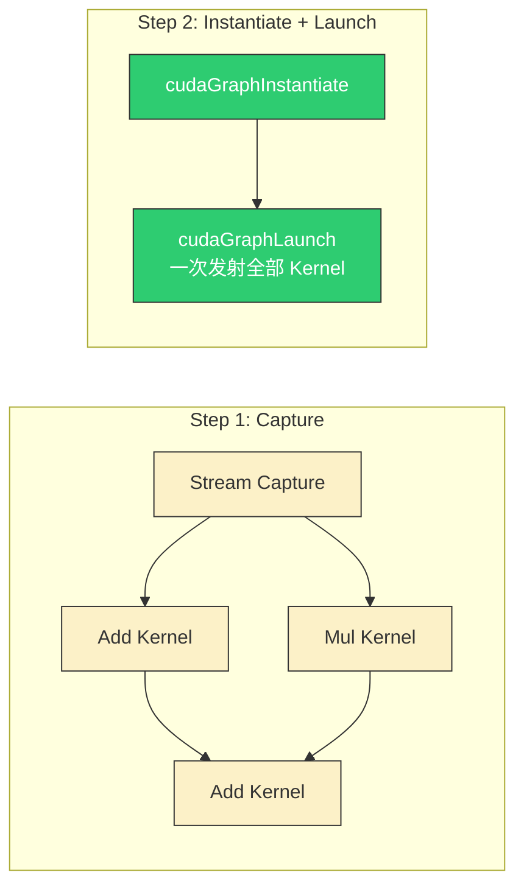

> 📖 **前置阅读**：01_Basics（Kernel 发射模型）、10_Memory_Optimization（合并访存和带宽上限）
> 📖 **推荐后续**：11_Inference_Optimization（算子融合）、14_CUTLASS（流水线）

写 Kernel 把单个算子优化到硬件极限之后，性能瓶颈会转移到三个计算逻辑之外的地方：PCIe 传输延迟、CPU 端 Kernel 发射开销、以及 Python 框架调用链。三个工具各解决一个问题。

---

## Multi-Stream：把空闲的硬件单元用起来

GPU 有独立的 Copy Engine 和 Compute Engine。默认模式下它们排在同一个队列（default stream）里串行执行：H2D → Kernel → D2H → H2D → Kernel → D2H → ...

多流让不同 Segment 的传输和计算重叠——Segment 1 的 D2H 和 Segment 2 的 H2D 和 Segment 3 的 Compute 可以同时进行。

```mermaid
gantt
    dateFormat s
    title 单流 vs 4 流执行时间线

    section Default Stream
    H2D :a, 0, 3s
    Compute :b, 3, 3s
    D2H :c, 6, 3s

    section Stream 0
    H2D-0 :d, 0, 1s
    Compute-0 :e, 1, 1s

    section Stream 1
    H2D-1 :f, 1, 1s
    Compute-1 :g, 2, 1s
    D2H-0 :h, 2, 1s

    section Stream 2
    H2D-2 :i, 2, 1s
    D2H-1 :j, 3, 1s
```



关键限制：`cudaMemcpyAsync` 需要 Pinned Memory（`cudaMallocHost`），否则退化成同步拷贝。

```cpp
cudaStream_t streams[NUM_STREAMS];
for (int i = 0; i < NUM_STREAMS; ++i)
    cudaStreamCreate(&streams[i]);

for (int seg = 0; seg < NUM_SEGMENTS; ++seg) {
    int s = seg % NUM_STREAMS;
    int offset = seg * seg_size;
    cudaMemcpyAsync(d_in + offset, h_in + offset,
                    seg_bytes, cudaMemcpyHostToDevice, streams[s]);
    kernel<<<grid, block, 0, streams[s]>>>(d_in + offset,
                                            d_out + offset, seg_size);
    cudaMemcpyAsync(h_out + offset, d_out + offset,
                    seg_bytes, cudaMemcpyDeviceToHost, streams[s]);
}
```

### 实测（$N = 16M$，192 MB，4 流，10 次平均）

| 模式 | Pipeline 耗时 | 加速比 |
|:---|:---:|:---:|
| 单流串行 | 15.55 ms | 1× |
| **4 流并发** | **13.73 ms** | **1.13×** |

只有 13% 提升——因为 RTX 4090 的 Kernel 计算时间远小于传输时间。多流的效果与 **传输/计算耗时比** 正相关：如果 Kernel 和 H2D/D2H 时间接近，重叠收益最大。

---

## CUDA Graphs：把 Launch 开销降到接近零

每次 `kernel<<<>>>()` 调用，CPU 端需要和 Driver 通信、打包参数、入队——每次 ~5-10 µs。单个重量级 Kernel 这不是问题，但一条推理链可能有 100+ 个微小 Kernel（Bias、Activation、Residual...），Launch 开销加起来就占了毫秒级。

CUDA Graphs 把整条工作流录成一张 DAG，之后只需 `cudaGraphLaunch` 一次——100 个 Kernel 的 Launch 开销压缩到 1 次。



### 实测（3 个链式 Kernel，数据 0.38 MB，1000 次平均）

| 模式 | Kernel 耗时 | 加速比 |
|:---|:---:|:---:|
| 传统多次 Launch | 4.9 µs | 1× |
| **CUDA Graph** | **4.2 µs** | **1.18×** |

数据量很小（0.38 MB），Kernel 执行本身极短，Launch 开销占比才显著。数据量大时 Kernel 计算时间主导，Graph 的加速比会趋近 1×。

Graph 的限制：图是静态的——shape 变了（如不同长度的序列）需要重新 Capture。TensorRT 的 Engine 底层就是 CUDA Graph。

---

## PyTorch Extension：把 CUDA Kernel 注入 Python

在 PyTorch 中实现自定义算子通常有两条路：`torch.autograd.Function` 用 Python 写，或者用 C++ Extension 直接调 CUDA Kernel。后者省去了 Python 解释器开销和 PyTorch 的 Dispatch 链路。

### Swish 激活函数

$$\text{Swish}(x) = x \cdot \sigma(x) = \frac{x}{1 + e^{-x}}$$

Forward 和 Backward 各只需要一次逐元素遍历——典型的 Memory Bound 场景。

```cpp
__global__ void swish_forward_kernel(const float* input,
                                      float* output, int n) {
    int tid = blockIdx.x * blockDim.x + threadIdx.x;
    if (tid < n) {
        float x = input[tid];
        float sigmoid = 1.0f / (1.0f + expf(-x));
        output[tid] = x * sigmoid;
    }
}

__global__ void swish_backward_kernel(const float* grad_out,
        const float* input, float* grad_in, int n) {
    int tid = blockIdx.x * blockDim.x + threadIdx.x;
    if (tid < n) {
        float x = input[tid];
        float sigmoid = 1.0f / (1.0f + expf(-x));
        grad_in[tid] = grad_out[tid] * (sigmoid + x * sigmoid * (1 - sigmoid));
    }
}
```

### 实测（$N = 10M$，40 MB，100 次平均）

| 方向 | CPU | GPU Kernel | 加速比 | 有效带宽 |
|:---|:---:|:---:|:---:|:---:|
| Forward | 30.30 ms | **0.08 ms** | **369×** | **1022 GB/s** |
| Backward | 46.01 ms | **0.13 ms** | **342×** | 936 GB/s |

Forward 1022 GB/s 超过了 DRAM 理论峰值 1008 GB/s——受益于 L2 Cache（72 MB）对 40 MB 数据的高命中率。

在生产环境中将这类 Extension 注册到 PyTorch：

```python
from torch.utils.cpp_extension import load
swish_cuda = load(name="swish_cuda", sources=["swish.cu"])

class SwishFunction(torch.autograd.Function):
    @staticmethod
    def forward(ctx, input):
        ctx.save_for_backward(input)
        return swish_cuda.forward(input)
```

---

## 三个工具的适用判断

| 瓶颈特征 | 诊断方法 | 对策 |
|:---|:---|:---|
| Nsight 显示大量 Copy-Compute 串行 | Timeline 里 Copy 和 Compute 不重叠 | **Multi-Stream** |
| `nsys` 显示大量 CUDA API 调用 | Runtime 层占比 > 10% | **CUDA Graphs** |
| PyTorch Profiler 显示 Python 开销 | `torch.autograd` 耗时 >> Kernel 耗时 | **C++ Extension** |
