## 楔子：直击痛点 (The Hook & Motivation)

在前面的章节中，我们将 GPU 单个 Kernel 的算力压榨到了极致：通过 Tiling 打破 Global Memory 瓶颈，通过 Warp Shuffle 绕开 Shared Memory 瓶颈，通过 dp4a 指令撕裂 ALU 的设计天花板。

但是，真实世界的深度学习推理（Inference）或视频渲染，绝不只是运行一个孤立的核函数。
数据从哪里来？从遥远的 CPU 内存，跨越缓慢的 **PCIe 总线**（H2D）。
结果往哪里去？算完之后还得再跨越一次 PCIe 回到主机侧（D2H）。
而更令人绝望的是，如果你有成百上千个微小的 Kernel（比如目前极火的小模型或者复杂的 GNN 网络），**CPU 每向 GPU 发射（Launch）一个 Kernel，光是驱动层的封包握手开销就要耗费几十微秒。** 当 Kernel 的真实执行时间只有可怜的几微秒时，整个异构系统不仅陷入了 PCIe 的泥潭，还患上了“多动症”——**CPU Bound (发射瓶颈)**。

只有打破 CPU 与 GPU 之间的这堵隔离墙，将“计算”与“运输”并轨，系统才算是真正的工业级。这正是本篇要接管的战场：**CUDA Streams（异步流并发）** 与 **CUDA Graphs（计算图静态化发射）**。

---

## 第一阶段：用 Multi-Stream 切开时间线上的折叠隐形

### 串行机制的浪费

如果你按部就班地 `cudaMemcpy(H2D) -> Kernel 计算 -> cudaMemcpy(D2H)`，在 GPU 物理层面上会发生什么？
PCIe 传输引擎（Copy Engine）呼啸运转时，成千上万的计算核心（Compute Engine）全体熄火闭目养神。等到计算核心狂奔时，PCIe 总线又闲得长草。这几十毫秒的串行时光，是对硬件资源极端的亵渎。

### 第一性原理与硬件映射：流水线掩盖 (Overlap)

架构师的反击手段是**切块 (Chunking) 与异流 (Stream)**。
现代 GPU 拥有毫不相干的硬件执行单元。把庞大的数据一分为四，塞进四个互不通信的 CUDA Stream（异步任务队列）中去发射。

**甘特图时序奇观：**

```mermaid
gantt
    dateFormat  s
    title 隐藏时间的魔法：单流 vs 4-Stream 并发
    axisFormat %S
    
    section 单流 (串行执行)
    H2D 直奔传输        :a1, 0, 4s
    Kernel 计算全量     :a2, after a1, 4s
    D2H 回写传输        :a3, after a2, 4s
    
    section Multi-Stream 1
    H2D (Chunk 1)  :crit, active, b1, 0, 1s
    Kernel 计算 1  :b2, after b1, 1s
    D2H (Chunk 1)  :b3, after b2, 1s
    
    section Multi-Stream 2
    H2D (Chunk 2)  :crit, active, c1, 1, 1s
    Kernel 计算 2  :crit, c2, after c1, 1s
    D2H (Chunk 2)  :c3, after c2, 1s

    section Multi-Stream 3
    H2D (Chunk 3)  :d1, 2, 1s
    Kernel 计算 3  :crit, active, d2, after d1, 1s
    D2H (Chunk 3)  :crit, d3, after d2, 1s

    section Multi-Stream 4
    H2D (Chunk 4)  :e1, 3, 1s
    Kernel 计算 4  :e2, after e1, 1s
    D2H (Chunk 4)  :crit, active, e3, after e2, 1s
```



**手术刀解码：**
仔细看 Multi-Stream 2 到 4 的错位区域！当 Stream 2 正在让核心狂算（Kernel 2）时，Stream 3 的 H2D 数据早已同时在 PCIe 总线上飞奔入场，而 Stream 1 算完的心血正通过另一条独立通道（D2H）撤离回主板！**三条毫不相干的物理引擎（DMA 入、ALU 算、DMA 出）在同一时钟频段同时达到峰值 100% 利用率！**

### 源码核心法则

在 `08_Advanced/02_multi_stream/multi_stream.cu` 中，这段重叠并发有一条极其关键的物理底线：

```cpp
// 致命前提：必须使用 Pinned Memory (锁页内存)！
// 如果用常规 malloc 或 std::vector，底层操作系统会在拷贝时为了防止内存换页而频繁上锁，导致异步变串行。
cudaMallocHost((void**)&h_A, bytes);

for (int i = 0; i < NUM_STREAMS; ++i) {
    // 异步拷贝 H2D，带上流签名 stream[i]
    cudaMemcpyAsync(d_A + offset, h_A + offset, size, cudaMemcpyHostToDevice, streams[i]);
    // 异步发射，同样敲下流签名
    compute_kernel<<<grid, block, 0, streams[i]>>>(...);
    // 异步排队带回 D2H
    cudaMemcpyAsync(h_out + offset, d_out + offset, size, cudaMemcpyDeviceToHost, streams[i]);
}
```

---

## 第二阶段：CUDA Graphs 绝杀 CPU Dispatch 瓶颈

当算子被优化的越来越微小（可能仅仅执行几十个周期），一种倒挂现象出现了：GPU 已经算完了，正在干等 CPU 慢腾腾地打包驱动层 API 参数来发射下一个 Kernel。

### 传统多 Kernel 发射痛点

假设执行一个标准流水：`(A + B) * D + F = G`。你需要写三行驱动发射代码：
`add_kernel<<<...>>>` ->等 CPU C++ 函数执行 -> 陷入 CUDA Driver 封包 -> PCIe 唤醒
`mul_kernel<<<...>>>` ->等 CPU -> 陷入 Driver -> PCIe 唤醒
`add_kernel<<<...>>>` -> ...

每一个 `<<<>>>` 的背后，大约有 **5 微秒 (µs)** 的高昂系统过桥路费。

### CUDA Graph 捕获：将战术硬化成硅片本能

CUDA Graph 的理念是：**既然流程是固定的，为什么不让 CPU 把这整条图谱录制下来，打包成一个单一且稳固的“执行树”，一次性丢给 GPU 的板载硬件调度器？** 以后 CPU 只需要敲一记回车，GPU 自己就能顺着节点自动跳转执行，再也无需驱动层介入！

打开 `08_Advanced/01_cuda_graphs/cuda_graphs.cu`，观赏这史诗般的 Graph 捕获操作：

```cpp
cudaStream_t stream;
cudaGraph_t graph;
cudaGraphExec_t instance;

// 1. 开启神圣的捕获模式录音机
cudaStreamBeginCapture(stream, cudaStreamCaptureModeGlobal);

// 这些发射动作不会真正在 GPU 执行！而只是向驱动录入拓扑结构 DAG 图
add_func<<<grid, block, 0, stream>>>(d_A, d_B, d_C, n);
mul_func<<<grid, block, 0, stream>>>(d_C, d_D, d_E, n);
add_func<<<grid, block, 0, stream>>>(d_E, d_F, d_G, n);

// 2. 咔嚓，闭环落盘，生成 graph 对象
cudaStreamEndCapture(stream, &graph);
// 3. 实例化图，固化为底层可直接发射的机器节点
cudaGraphInstantiate(&instance, graph, nullptr, nullptr, 0);

// 4. 重放模式！极速一键点火！
for (int i = 0; i < iterations; ++i) {
    cudaGraphLaunch(instance, stream); // CPU 层0等待，瞬间回归！
}
```

---

## 理论与实际的对决：极限剖析 (Theory vs Reality Profiling)

翻开 `Results/08_Advanced.md`，对决数据极其惊艳 (RTX 4090 测试)：

### 战役 1：流水线掩盖 (192 MB 数据压测)

| 版本 | 循环执行总周期 | 吞吐带宽 | 吞吐提升分析 |
| :--- | :--- | :--- | :--- |
| **传统单流串行** | 15.55 ms | 12.34 GB/s | 引擎干等，互相拖累。 |
| **4 流异步并发** | **13.73 ms** | **14.66 GB/s** | **无情切出重叠区，整体缩时 13%！如果计算更重，掩盖比例将几何级攀升。** |

### 战役 2：超频微算子的 CUDA Graph 碾压 (2.6 MB 短耗时流水)

在此用例中，数据极小而 Launch 极为频繁，完美暴露出 CPU Driver 发射瓶颈：

| 算子堆叠发射模式 | 单轮执行总耗时 | vs 基准加速红利 | 状态解析 |
| :--- | :--- | :--- | :--- |
| **传统 3 次 Launch 调用** | 0.0049 ms | 1× | GPU 早就算完了，都在等 CPU 驱动层的 C++ 函数。 |
| **CUDA Graph 捕获连发** | **0.0042 ms** | **1.18×** | **消灭系统调用级羁绊，指令发射延时减少近 15%！** |

对于动辄堆叠千万层的复杂神经网络推断阶段 (Inference Stage)，如果你不用 CUDA Graphs 把海量的微张量算子拓扑封装进底层，你用最顶尖的 GPU 也会大概率卡死在 CPU 时钟单核主频的缓慢调度上。

---

## 架构师视角的总结 (Architect's Takeaway)

1. **宏观系统思维**：很多写 GPU 并发的人总以为盯着 `#pragma unroll` 和 Share Memory 就能打赢天下。但如果输入输出数据的 PCIe 回写无法掩盖，或者驱动调度耗成重灾区，那单核再怎么极致也被系统木桶的短板锁死了。
2. **锁页内存（Pinned Memory）的物理铁律**：永远记住，`cudaMemcpyAsync` 的生命源泉必须是基于 `cudaHostAlloc` 分配的不可换出内存。别怪你的 Multi-Stream 没有发生时间线折叠（Overlap），先看看你的 Host 端是不是用了会被 CPU 挂起的缺页容器（如默认的 malloc）。
3. **Graph 的终极进化论**：CUDA Graphs 这种静态拓扑固化技术，正是现代深度学习框架（TensorRT、TorchInductor）进行 AOT (Ahead-of-Time) 推理阶段时所最倚仗的底层核武，也是异构计算脱离 CPU 依赖的完全体形态。
