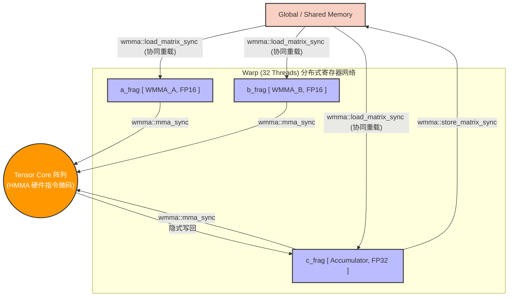
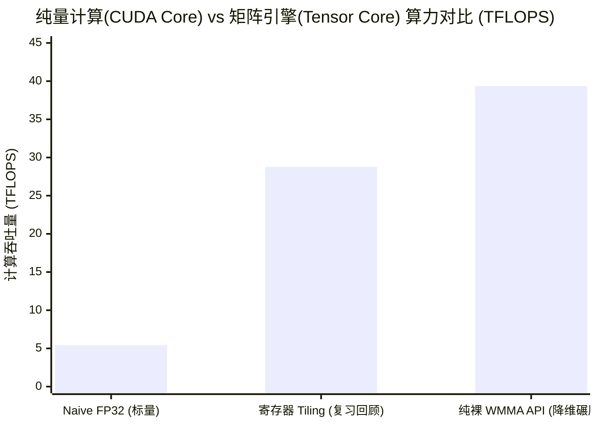

## 楔子：直击痛点 (The Hook & Motivation)

如果你一路跟随机构的步伐走过了《04_GEMM_Optimization》中 28 TFLOPS 的 Register Tiling 极限拉扯，你也见证了《07_Quantization》中依靠硬件 `dp4a` 指令用 4 字节暴力折叠出的 11 TOPS。
但你会发现，无论我们怎么榨干寄存器，怎么精打细算指令周期的隐式停顿，所有的魔法都束缚在一个名为 **CUDA Core (标量 FMA 乘加单元)** 的古老战场上。它一次只能拿两个数相乘，再加上第三个数。对于 $O(N^3)$ 复杂度的矩阵乘法而言，这种“小米加步枪”的推进速度，永远填不满大语言模型那种恐怖的算力黑洞。

自 NVIDIA Volta (V100) 架构起，黄仁勋在 GPU 的硅片上硬生生焊进去了一排排**专用微型矩阵乘加引擎——Tensor Core**。
它蛮横无理：它不再接受逐个浮点数的输入，而是强迫 32 个线程 (Warp) 齐心协力捧着一块 $16 \times 16$ 的矩阵块丢给它，然后在 **1 个或者几个时钟周期内，瞬间吐出 $16 \times 16 \times 16 = 4096$ 次乘法和 $4096$ 次加法的结果！**

本篇，我们将抛开隐形的 cuBLAS 或 CUTLASS 黑盒，直接握住 NVIDIA 开放给开发者的底层原语 **Warp Matrix Multiply-Accumulate (WMMA) API**，去感受这种硬件代沟带来的降维碾压。

---

## 第一性原理与数学重构 (Mathematical Formulation)

### 魔法数字 16×16×16 与大跨度乘加

在传统的标量指令 `fma(a, b, c)` 中，数学表达为 $d = a \times b + c$。
而在 Tensor Core 的世界里，这个公式的每一个字母都膨胀成了矩阵。WMMA 硬件层支持的最经典粒度（Shape）为 **`m16n16k16`**：
$$D_{16\times16} = A_{16\times16} \times B_{16\times16} + C_{16\times16}$$

一次这样的调用，等价于执行了 **8192 次浮点操作 (FLOPs)**。
如果你把这 8192 个操作分摊给执行它的 1 个 Warp（32 个线程），**每个线程相当于在一个微观瞬间免费完成了 256 次计算**。这就是 Tensor Core 能将理论算力峰值从（RTX 4090 的 FP32）82 TFLOPS 瞬间暴拉到（FP16 TC）330 TFLOPS 的根本原因。

### 面向数值稳定性的混合精度防线 (Mixed Precision)

算力暴增的代价是精度缩水。Tensor Core 原生极度嗜好 FP16 (半精度)。
但真实的深度学习训练或长时间推理中，如果用 FP16 的乘法加上 FP16 的累加，极小的动态范围（最大值不到 65500）会导致严重的**上溢出 (Overflow)**，或者因为大数吃掉小数产生**下溢出 (Underflow)** 导致梯度消失。

架构师给出的绝妙方案是 **Mixed Precision (混合精度)** 范式：
$$D_{FP32/FP16} = A_{FP16} \times B_{FP16} + C_{FP32}$$
输入的数据 (A, B) 使用省带宽的 FP16。送入 Tensor Core 内部的乘法器时由于是 16-bit 互乘，它会产生内部高精度的中间乘积，然后立刻与声明为 **32-bit (FP32)** 的大容量累加器 $C$ 融合。最后写出到显存时，可以安全地保留为 FP32。这确保了算法在享受性能狂欢的同时，守住了不崩溃底线。

---

## 核心优化演进与硬件映射 (Architecture Mapping)

既然 Tensor Core 是一尊胃口极大的神像，我们就不能像以前那样随便用 Register 喂食。
NVIDIA 抽象出了一种极度反直觉的特殊寄存器封装：**`wmma::fragment` (寄存器微矩阵碎片)**。

### WMMA 数据流转与黑盒操作法则



**底层真相解码：**
这其中的精髓在于“**你不需要、也不应该知道 `fragment` 里面每个线程到底缓存了矩阵的哪个元素**”。
在旧时代，你会精细地计算 `threadIdx.x` 应该拿矩阵的第几行第几列。但在 WMMA 时代，你只需要下达一条 `load_matrix_sync` 指令，底层的 Warp Shuffle 交叉开关硬件会自动把 16×16 的矩阵打碎，并极其均匀、且符合某种秘密的“最佳时序阵型”派发给 32 个线程的寄存器堆中。这一切全部是不可见的。
你需要做的，只是闭上眼睛，信任编译器，把这些碎片推向 `mma_sync`。

---

## 源码手术刀：关键代码深度赏析 (Surgical Code Analysis)

打开 `09_Tensor_Core/02_mixed_precision/mixed_precision.cu`，我们见证这种高级 API 的极简降维写法。你会发现，最凶猛的代码往往字数最少。

```cpp
// 1. 声明极简的 Fragment 容器空间（主序 Row Major 非常关键）
wmma::fragment<wmma::matrix_a, 16, 16, 16, half, wmma::row_major> a_frag;
wmma::fragment<wmma::matrix_b, 16, 16, 16, half, wmma::row_major> b_frag;
// 累加器 c_frag 声明为 float，这就是著名的 FP16+FP32 Mixed Precision 之源！
wmma::fragment<wmma::accumulator, 16, 16, 16, float> c_frag;

// 初始化 c_frag (32 线程协同行动)
wmma::fill_fragment(c_frag, 0.0f);

for (int k = 0; k < K; k += 16) {
    // 2. 合作加载。不要问是谁加载的谁，指令要求 32 个人同心跨步即可。
    wmma::load_matrix_sync(a_frag, A + warpM * K + k, K);
    wmma::load_matrix_sync(b_frag, B + k * N + warpN, N);
    
    // 3. ✨ 点燃 Tensor Core 引擎 ✨
    // 在这 1 行代码背后，是等价于普通 CUDA 内核数百行代码的矩阵旋风
    wmma::mma_sync(c_frag, a_frag, b_frag, c_frag);
}

// 4. 安全泄洪落盘，将高精度的 FP32 碎片组合回写到显存
wmma::store_matrix_sync(C + warpM * N + warpN, c_frag, N, wmma::mem_row_major);
```

**手术刀剖析：**
这种代码的美学在于隐藏难度。对比之前的 `Register Tiling` 中那种为了避免 Register Bank Conflict 绞尽脑汁算宽度的地狱级心智负担。WMMA 剥去了所有的繁文缛节，将矩阵乘法的内核还原成了高阶 API。但别忘了，要真正在庞然大物级别的矩阵上喂饱 Tensor Core，外层依然需要套上严密的 Shared Memory 缓存预取墙（这点我们在 `04_GEMM_Optimization` 已经打牢了根基，并在随后的 CUTLASS 章节集大成）。

---

## 理论与实际的对决：极限剖析 (Theory vs Reality Profiling)

翻开 `Results/09_Tensor_Core.md` 真机测试日志 (RTX 4090, 规模 $1024 \times 1024 \times 1024$)，深呼吸，迎接维度的暴击：



| 加速变种 | 计算内核类别 | Kernel 耗时 (ms) | 有效算力 (TFLOPS) | 战局解析 |
| :--- | :--- | :--- | :--- | :--- |
| **传统手工 FP32** | 纯 CUDA Core (标量) | 0.3937 ms | 5.45 TFLOPS | 连塞牙缝都不够。 |
| **Mixed Precision (WMMA)**| **Tensor Core (矩阵)** | **0.0546 ms** | **39.36 TFLOPS 🚀** | **耗时暴跌近 7 倍！即便只是套了一层最外层的 Naive Grid，未做 SRAM Tiling 优化，依然完虐最顶层的标量极致代码。** |

### 极限溯源与“虚胖算力”的防杠解析

你会说，RTX 4090 的 Tensor Core 理论算力不是接近 330 TFLOPS (如果是稠密矩阵不带稀疏，也有 165 TFLOPS) 吗？为什么这里只有区区 39.3 TFLOPS，甚至在更大的 `wmma_gemm.cu` 2048 大小中只有 30.5 TFLOPS？
难道 Tensor Core 在偷懒？

并没有。**这正是由于我们这个 `wmma` 内核写得过于纯粹，过于“Naive”导致的问题。**
仔细往上看我们剖析的源码。在那个 `k` 的循环中，我们是直接用 `wmma::load_matrix_sync` 大口大口地从 **Global Memory (全局显存)** 吸水的！
RTX 4090 的显存峰值仅 ~1008 GB/s，而 Tensor Core 的消化速度是这个水管直径的几十倍。结果就是：**这台超级跑车 80% 的时间在等红灯（等主存运数据过来）**。
想要真正触碰那 165 TFLOPS 的绝对天顶标，必须引入 `Shared Memory` 和 `Double Buffering (异步拷贝流水线)` 把 Tensor Core 的嘴边塞满（见后续 CUTLASS）。
即便如此，就靠着如此拉胯的主存供血网不加修饰地硬跑，**一具吃不饱的 Tensor Core，依旧把一群常态配置的标量 CUDA Core 摁在地上狠狠摩擦（5 TFLOPS vs 39 TFLOPS）**。这就是架构革命。

---

## 架构师视角的总结 (Architect's Takeaway)

1. **从点积到块积的跃迁**：CUDA Core 的发展史是一部增加寄存器和 FMA 位长的挣扎路线。而 Tensor Core 强制转换到了块积 (Block Instruction Matrix) 的新次元——它的瓶颈再也不是算术发射端口，而是系统的数据供应速度。
2. **混合精度的底层基石**：以 FP16 的带宽代价喂养，以 FP32 的精度肚量输出，这是所有工业界 LLM 加速引擎（vLLM, TensorRT-LLM）默认的前提共识。
3. **拥抱黑盒的 API 进化**：你如果不能坦然面对 `fragment` 里面不透明的数据切片排布，非要搞懂哪个线程持有矩阵的 $[1, 5]$，那你就无法跨入现代高性能领域的这扇大门。未来，这种底层切分全权交托硬件接管的理念只会被 CUDA 发挥得越来越极致。
