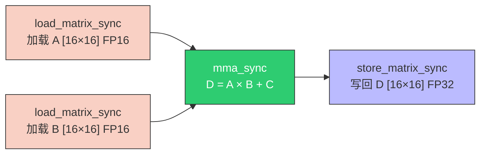
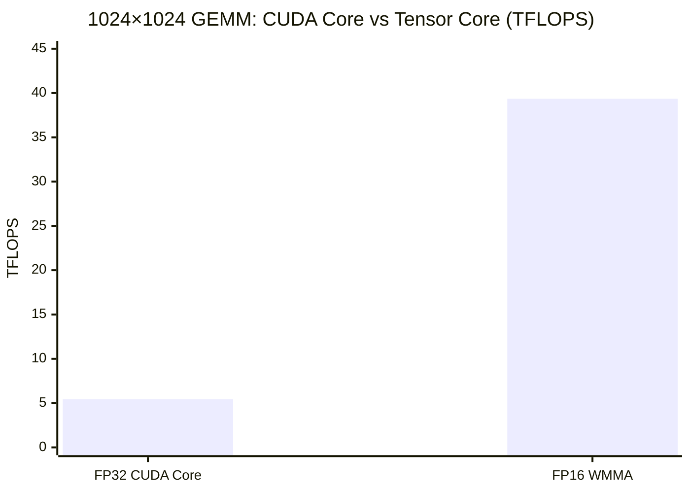

> 📖 **前置阅读**：04_GEMM_Optimization（CUDA Core GEMM 优化天花板）、07_Quantization（FP16 数据格式）
> 📖 **推荐后续**：14_CUTLASS（把 WMMA 包装为可组合的模板）

04_GEMM_Optimization 用 CUDA Core 把 GEMM 推到 28.79 TFLOPS。这已经是标量 FMA 指令的极限了——每个 CUDA Core 每 cycle 一条 FMA，128 SM × 128 Core/SM × 2 FLOP/FMA × 2520 MHz = 82.6 TFLOPS（理论），实测 35% 利用率不算差。

Tensor Core 换了一种方式计算矩阵乘：不再一条条 FMA 地串行，而是**一个 Warp 整体执行一次 16×16×16 的矩阵乘加**。指令叫 `HMMA`（Half-precision Matrix Multiply-Accumulate），硬件在一条指令周期内完成 $16 \times 16 \times 16 \times 2 = 8192$ 次 FP16 乘加。

---

## WMMA API

WMMA（Warp Matrix Multiply-Accumulate）是 CUDA 提供的 C++ API，让开发者通过 `fragment` 类型直接操控 Tensor Core 寄存器。

核心流程：



### 混合精度的数学保证

FP16 的有效精度只有 ~3.3 位十进制数（$\epsilon = 2^{-10}$）。两个 FP16 做乘法后结果直接加到 FP32 累加器上——**乘法损失精度，但不会在累加中雪崩**。

$$D_{16 \times 16}^{\text{FP32}} = A_{16 \times 16}^{\text{FP16}} \times B_{16 \times 16}^{\text{FP16}} + C_{16 \times 16}^{\text{FP32}}$$

这也是训练中 Loss Scaling 能工作的数学基础：激活值和梯度用 FP16 存储和传输（省带宽），乘加结果用 FP32 累加（保精度）。

### 核心代码

```cpp
#include <mma.h>
using namespace nvcuda;

const int WMMA_M = 16, WMMA_N = 16, WMMA_K = 16;

wmma::fragment<wmma::matrix_a, WMMA_M, WMMA_N, WMMA_K, half,
               wmma::row_major> a_frag;
wmma::fragment<wmma::matrix_b, WMMA_M, WMMA_N, WMMA_K, half,
               wmma::col_major> b_frag;
wmma::fragment<wmma::accumulator, WMMA_M, WMMA_N, WMMA_K, float> c_frag;

wmma::fill_fragment(c_frag, 0.0f);

for (int k = 0; k < K; k += WMMA_K) {
    wmma::load_matrix_sync(a_frag, A + row * K + k, K);
    wmma::load_matrix_sync(b_frag, B + k * N + col, N);
    wmma::mma_sync(c_frag, a_frag, b_frag, c_frag);
}
wmma::store_matrix_sync(D + row * N + col, c_frag, N,
                        wmma::mem_row_major);
```

`fragment` 是编译器映射到 Tensor Core 寄存器的不透明容器——不能直接 index，不能 printf，只能通过 `load/store/mma_sync` 操作。32 个线程协作持有一个 16×16 的 fragment，每个线程分摊其中一部分元素。

---

## 为什么 Naive WMMA 只有 30T 而 cuBLAS 有 157T

WMMA Kernel 的代码直接从 Global Memory load → mma → store，没有 Shared Memory Tiling、没有 Double Buffering、没有异步加载。每次 `load_matrix_sync` 都走 HBM，加载延迟完全暴露。

cuBLAS 和 CUTLASS 的 Tensor Core Kernel 加了：

- **Shared Memory Stage**：先批量搬到 SMEM，再从 SMEM 喂 Tensor Core
- **Double Buffer**：加载 k+1 的数据同时计算 k 的 `mma_sync`
- **异步拷贝**：`cp.async` 绕过寄存器直接搬入 SMEM

差距不在 Tensor Core 指令本身——`mma_sync` 的硬件吞吐已经很高。差距在 **数据喂入速度跟不上计算速度**。

---

## 实测数据

> **测试环境**：NVIDIA GeForce RTX 4090 × 2（sm_89），Linux，nvcc -O3
> **理论峰值**：FP32 ~82.6 TFLOPS，FP16 TC ~165 TFLOPS（无稀疏）

### WMMA GEMM（2048 × 2048，100 次平均）

| 版本 | Kernel | 算力 (TFLOPS) | vs FP32 理论 |
|:---|:---:|:---:|:---:|
| **Naive WMMA** | **0.56 ms** | **30.50** | 18.5% |

30.50 TFLOPS vs FP16 TC 峰值 165 TFLOPS = 18.5%。vs cuBLAS TC 的 157 TFLOPS（14_CUTLASS 实测）= 19.4%。差距 5 倍多——全部来自访存优化缺失。

### 混合精度对比（1024 × 1024，100 次平均）

| 版本 | Kernel | 算力 | 加速比 |
|:---|:---:|:---:|:---:|
| FP32 CUDA Core | 0.394 ms | 5.45 TFLOPS | 1× |
| **FP16 WMMA** | **0.055 ms** | **39.36 TFLOPS** | **7.21×** |



7.21× 的加速由两部分贡献：

$$\underbrace{2\times}_{\text{FP16 带宽翻倍}} \times \underbrace{\sim 3.6\times}_{\text{TC 硬件加速}} = 7.2\times$$

### 跨章性能全景

| 项目 | 类型 | 算力 |
|:---|:---|:---:|
| 01_Basics Naive GEMM | FP32, 无 Tiling | 0.50 TFLOPS |
| 04_GEMM Register Tiling | FP32, 寄存器 Tiling | 28.79 TFLOPS |
| 09_WMMA Naive | FP16, Tensor Core | 30.50 TFLOPS |
| 09_WMMA Mixed Precision | FP16→FP32, Tensor Core | 39.36 TFLOPS |
| 12_cuBLAS SGEMM | FP32, 库调用 | 49.91 TFLOPS |
| 14_CUTLASS SIMT | FP32, 模板 | 55.35 TFLOPS |
| 14_cuBLAS Tensor Core | FP16→FP32, 库调用 | **157.07 TFLOPS** |

Naive WMMA（30.5T）和 Register Tiling FP32（28.8T）几乎持平——不加访存优化，Tensor Core 的硬件优势被内存瓶颈完全抵消。这也是为什么 CUTLASS 和 FlashAttention 的多级流水线设计是不可省略的工程复杂度。
