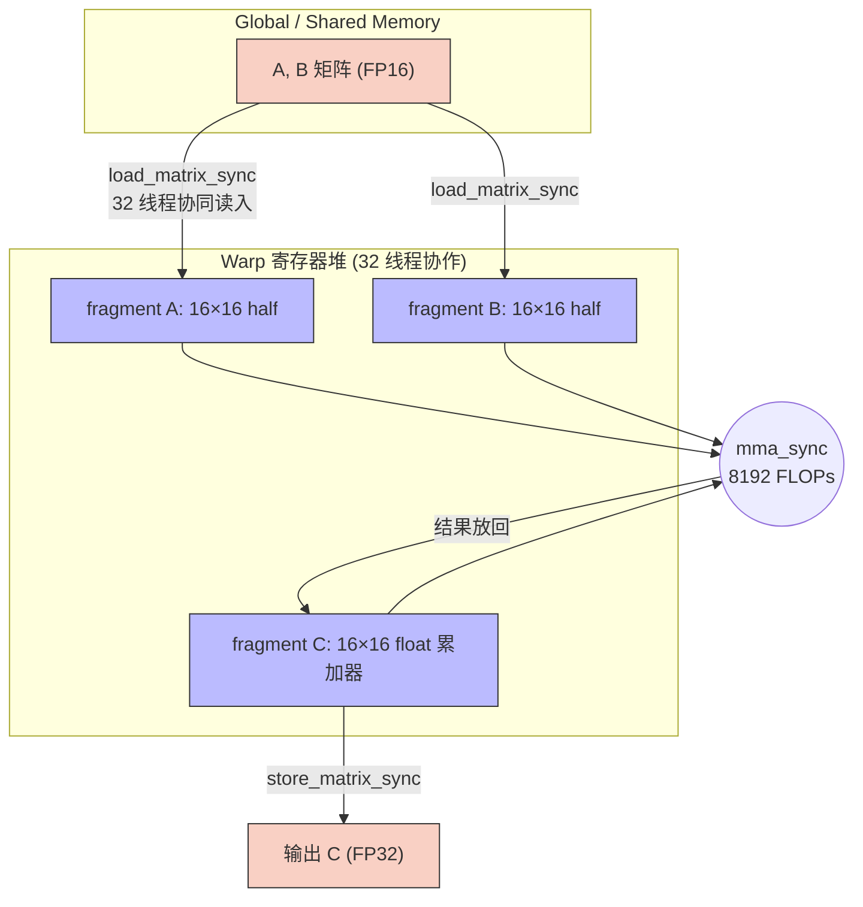
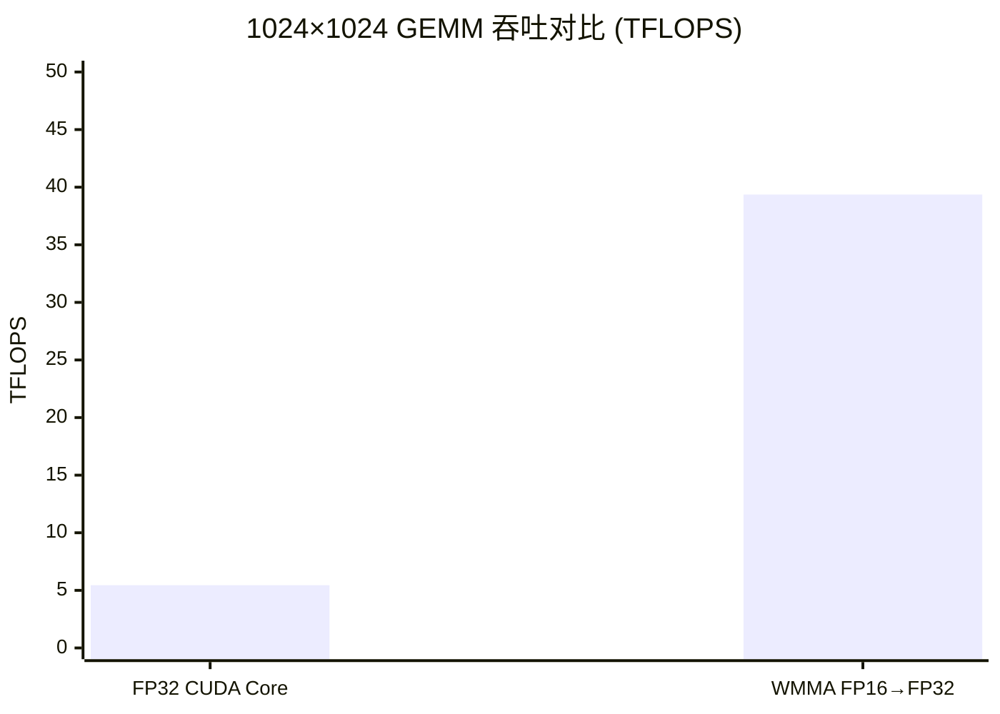

> 📖 **前置阅读**：04_GEMM_Optimization（Register Tiling）、07_Quantization（FP16 基础）  
> 📖 **推荐后续**：14_CUTLASS（工业级 Tensor Core GEMM）

## CUDA Core 的天花板

04_GEMM_Optimization 用 Register Tiling 达到了 28.79 TFLOPS（2048×2048），是 FP32 理论峰值 82.6 TFLOPS 的 34.9%。要逼近 100% 需要 SASS 级调优和 Bank Conflict 消除——复杂度极高，投入产出比很低。

但 RTX 4090 有另一条路：Tensor Core。FP16 Tensor Core 的理论峰值是 165 TFLOPS（无稀疏），是 FP32 CUDA Core 的 2 倍。启用 2:4 结构化稀疏还能再翻倍到 330 TFLOPS。

Tensor Core 不是"更快的浮点单元"——它是一个专门的矩阵乘法硬件单元。一条指令做一个 $16 \times 16 \times 16$ 的矩阵乘加，由一个 Warp 的 32 个线程协作完成。一条指令 = $16 \times 16 \times 16 \times 2 = 8192$ 次浮点运算。对比 CUDA Core 上 Register Tiling 的外积每次做 64 次 FMA——一条 Tensor Core 指令顶 128 条 FMA。

---

## WMMA：Tensor Core 的软件接口

NVIDIA 提供了两层 API 来操作 Tensor Core：

- **WMMA（Warp Matrix Multiply-Accumulate）**：C++ 级别的 fragment API，相对易用
- **MMA PTX**：PTX 汇编级别，控制力更强，但使用门槛高

本项目使用 WMMA。它的编程模型跟普通 CUDA Kernel 有个根本性区别：你不是"每个线程各算各的"，而是"一个 Warp 的 32 个线程合起来做一次矩阵乘"。这 32 个线程通过 `fragment` 数据结构协作，每个线程持有矩阵的一部分——但具体哪个线程持有哪些元素是硬件决定的、跨架构会变、程序员不应该关心。

### 数据流



`load_matrix_sync` 和 `store_matrix_sync` 是黑盒——你给一个矩阵基地址和 leading dimension，它自动把数据分配到 32 个线程的寄存器里。不要试图探究单个线程持有什么值，因为这个映射跨 GPU 架构会变。

### 核心代码

```cpp
#include <mma.h>
using namespace nvcuda;

wmma::fragment<wmma::matrix_a, 16, 16, 16, half, wmma::row_major> a_frag;
wmma::fragment<wmma::matrix_b, 16, 16, 16, half, wmma::col_major> b_frag;
wmma::fragment<wmma::accumulator, 16, 16, 16, float> c_frag;

wmma::fill_fragment(c_frag, 0.0f);

for (int i = 0; i < K; i += 16) {
    wmma::load_matrix_sync(a_frag, A + row * K + i, K);
    wmma::load_matrix_sync(b_frag, B + i * N + col, N);
    wmma::mma_sync(c_frag, a_frag, b_frag, c_frag);
}

wmma::store_matrix_sync(C + row * N + col, c_frag, N,
                        wmma::mem_row_major);
```

几个值得注意的点：

- `matrix_a` 设为 `row_major`，`matrix_b` 设为 `col_major`——这是由矩阵乘的行列乘积结构决定的，A 按行读、B 按列读效率最高。
- 累加器 `c_frag` 声明为 `float`（FP32），输入 fragment 是 `half`（FP16）。这就是混合精度——乘法在 FP16 域做，结果立即由 FP32 累加器接住。
- `mma_sync` 没有显式的 `__syncthreads()`——这是 Warp 级操作，32 个线程天然同步。

---

## 混合精度的意义

FP16 的动态范围很窄（最大值 ~65504）。如果累加器也用 FP16，在连续累加 K 维度时极容易溢出或大数吃小数。

混合精度的设计：

$$D_{\text{FP32}} = A_{\text{FP16}} \times B_{\text{FP16}} + C_{\text{FP32}}$$

输入用 FP16 省带宽（数据量减半），乘法结果立即进入 FP32 累加器。这不是简单的 cast——Tensor Core 硬件内部就是分成乘法器（FP16）和累加器（FP32）两个物理组件的。

实际使用中精度损失很小。推理场景下大多可以忽略；训练场景需要配合 Loss Scaling（PyTorch 的 `torch.cuda.amp` 自动处理），防止小梯度在 FP16 下溢出。

---

## 实测数据

测试环境：2× RTX 4090 (sm_89)，nvcc -O3，C++17。

### WMMA GEMM（$2048 \times 2048$，100 次平均）

| 版本 | Kernel 时间 | 吞吐 | vs 理论峰值 |
|:---|:---|:---|:---|
| Naive WMMA | 0.56 ms | **30.50 TFLOPS** | 18.5% (vs 165T FP16 TC) |

30.5 TFLOPS 比 CUDA Core 的 Register Tiling（28.79 TFLOPS at FP32）只高了一点点。但注意前提：WMMA 版是 Naive 的——没有做任何 Tiling 优化，等价于 01_Basics 里那个 Naive GEMM 的 Tensor Core 版本。

Naive CUDA Core GEMM 在 01_Basics 里只有 5225 GFLOPS。同样是 Naive 实现，Tensor Core 比 CUDA Core 快了 5.8 倍。这说明 Tensor Core 的指令效率优势是碾压级的——即使不做任何软件优化。

### 混合精度 vs FP32 CUDA Core（$1024 \times 1024$，100 次平均）

| 版本 | Kernel 时间 | 吞吐 | vs FP32 |
|:---|:---|:---|:---|
| FP32 CUDA Core (Naive) | 0.39 ms | 5.45 TFLOPS | 1× |
| WMMA 混合精度 | 0.05 ms | **39.36 TFLOPS** | **7.21×** |



7.21 倍的提速。这个比值超过了 FP16 vs FP32 的理论吞吐比（2×），原因在于 Tensor Core 的指令效率。一个 Warp 做 8192 FLOP 只需一条指令，CUDA Core 需要 128 条 FMA 指令排队通过调度器。指令发射速率本身就是瓶颈——Tensor Core 把这个瓶颈消灭了。

### 为什么离理论峰值还远

39.36 TFLOPS vs 165 TFLOPS 理论峰值 = 23.9%。差距来自四个地方：

1. **没有 Tiling**：每个 Warp 独立从 Global Memory 加载 fragment，大量冗余读取——跟 01_Basics 的 Naive GEMM 一个毛病
2. **没用 Shared Memory**：工业级实现先把数据搬到 SRAM，再从 SRAM 加载到 fragment。这里直接从 HBM 读，带宽墙严重
3. **没有 Double Buffer**：计算和加载没有重叠
4. **Block 配置未调优**：这里用 256 线程（32×8），CUTLASS 的最优配置通常更大

CUTLASS 解决了上述所有问题——14_CUTLASS 会展示它如何用模板元编程把 Tensor Core GEMM 推到理论峰值的 96%。

---

## 和之前各章的 GEMM 数据放一起看

| 章节 | 版本 | 规模 | 吞吐 |
|:---|:---|:---|:---|
| 01_Basics | Naive FP32 | 1024² | 5.2 TFLOPS |
| 01_Basics | Tiled FP32 | 1024² | 6.9 TFLOPS |
| 04_GEMM | Register Tiled FP32 | 1024² | 14.1 TFLOPS |
| 04_GEMM | Register Tiled FP32 | 2048² | 28.8 TFLOPS |
| **09_TC** | **Naive WMMA FP16** | **2048²** | **30.5 TFLOPS** |
| **09_TC** | **WMMA Mixed** | **1024²** | **39.4 TFLOPS** |
| (cuBLAS) | cublasSgemm FP32 | 2048² | 57.5 TFLOPS |

Naive WMMA 在不做任何优化的情况下就超过了精心调优的 FP32 Register Tiling。这就是从"软件优化"到"硬件换代"的跨越。

但 cuBLAS 的 57.5 TFLOPS（FP32 CUDA Core）仍然远高于 Naive WMMA 的 30.5 TFLOPS——因为 cuBLAS 做了我们没做的所有优化。给 WMMA 也加上这些优化（CUTLASS），FP16 Tensor Core 可以突破 100+ TFLOPS。14_CUTLASS 会接着讲这个故事。

---

## 小结

**Tensor Core 是 GEMM 性能的分水岭。** CUDA Core 的 FP32 GEMM 精心优化后也只能达到 ~35% 峰值利用率，而 Tensor Core 的 Naive 版就达到了类似水平。优化后可以逼近 70-80%。

**混合精度不是精度妥协，是硬件设计的本意。** FP16 输入 + FP32 累加是 Tensor Core 的原生模式。乘法器和累加器在硬件上就是两个不同精度的组件。

**Naive WMMA 的 30.5 TFLOPS 只是起点。** 就像 01_Basics 的 Naive GEMM 到 04_GEMM_Optimization 的 Register Tiling，Tensor Core 也有自己的优化阶梯。CUTLASS 就站在这个阶梯的终点。
