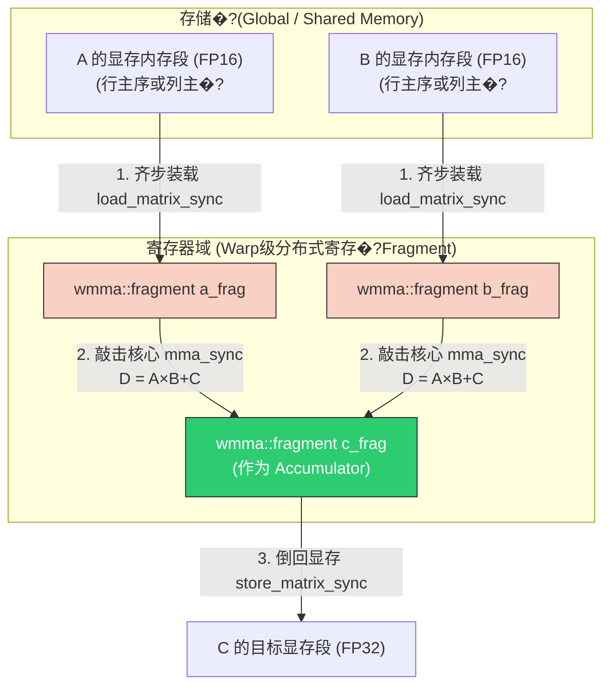
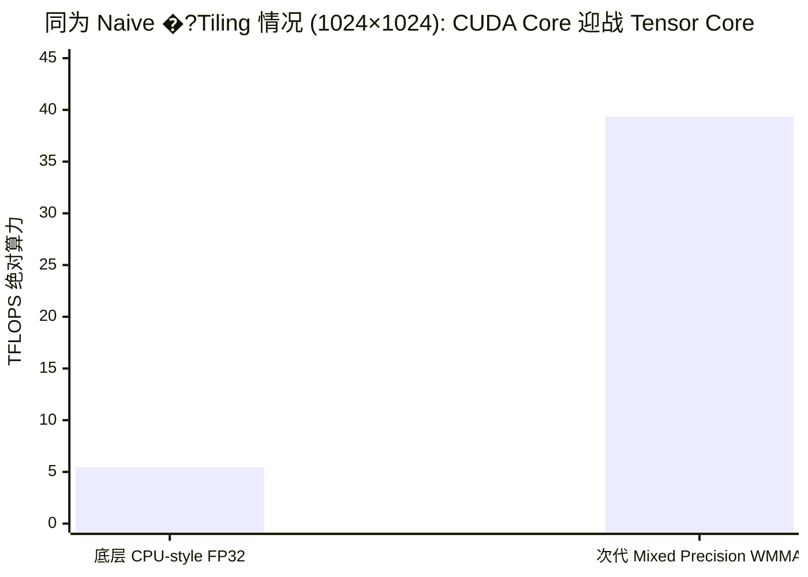

> 📖 **前置阅读**：[04_GEMM_Optimization](04_GEMM_Optimization_Register_Tiling.md)（CUDA Core GEMM 优化天花板）、[07_Quantization](07_Quantization_FP16_INT8_dp4a.md)（FP16 数据格式�? 
> 📖 **推荐后续**：[14_CUTLASS](14_CUTLASS_Core_Concepts.md)（把 WMMA 包装为可组合的模板魔法）

�?`04_GEMM_Optimization` 的长途跋涉中，我们经历了一场艰苦卓绝的微架构级优化战役。为了榨干硬件的最后一滴性能，我们把 2D 共享内存分块（Shared Memory Tiling）、寄存器复用（Register Tiling）、向量化访存指令（`float4`）、双缓冲（Double Buffering）流水线全用上了。最终，在纯纯的手写 C++ 代码加持下，�?FP32 GEMM 从惨不忍睹的 0.5 TFLOPS 强行推平到了 **28.79 TFLOPS**�?

这个数字听起来很可观，你可能觉得这就是代码优化的终点。但如果我们翻开 NVIDIA RTX 4090 的白皮书，会发现它也仅仅是勉强够到了 GPU 标量 FMA（Fused Multiply-Add）指令的物理极限。RTX 4090 的单精度（FP32）理论算力峰值大约是 82.6 TFLOPS，我们实测跑到了接近 35% 的极致利用率，在没有内联汇编的情况下，这已经是非常优秀的系统工程实现�?

这引出了一个残酷的现实天花板：**只要你还在用标准�?CUDA Core（即标量 ALU 控制单元）和一条一条的 FMA 指令串行敲击计算单元，你的天花板就被锁死�?80 TFLOPS 的量�?*。每�?CUDA Core 每个时钟周期只能处理一次乘法和加法，哪�?128 �?SM（Streaming Multiprocessors）全速运转，流水线完全排满，算力的池子也就只有那么大�?

但是，随着 AI 大语言模型（从 GPT-3 �?Llama 3）的参数体积呈现百倍、千倍级别的核爆式增长，每天有数以万亿计的矩阵乘法被抛向硅片。硬件工程师们被迫换了一个更激进的思路设计电路�?*既然神经网络里铺天盖地全是这些密集的小矩阵乘法操作，我们为什么不直接蚀刻一条硬件级的矩阵乘加指令？**

这就�?Tensor Core 诞生的核心背景。它的本质不再是“标量对标量”和“向量对向量”，而是跃迁到了“矩阵对矩阵”。这条在硬件底层被称�?`HMMA`（Half-precision Matrix Multiply-Accumulate）的指令，能够在一个时钟周期内，由一个全副武装的 Warp�?2 个线程的集合）整体接管并执行一�?$16 \times 16 \times 16$ 的矩阵乘加�?

本文我们将抛弃走马观花的粗浅认知，从 CUDA 原生硬件 API 出发，像拆解精密钟表一样，一点点拆解 WMMA（Warp Matrix Multiply-Accumulate）的执行逻辑与匪夷所思的寄存器分配网络。并在真机环境的数据支撑下，看看 Tensor Core 是如何结合惊艳的混合精度技术（Mixed Precision），让古老的 GEMM 算子暴涨 7 倍以上吞吐速度的�?

---

## 一�?深入硬件图纸：HMMA 到底是什么怪兽�?

在写代码之前，我们要先在脑子里建立起 Tensor Core 的物理模型�?

如果你去考察 Volta（V100）或�?Ada Lovelace（RTX 4090）芯片的 SM 内部版图，你会看到除了传统的 FP32 �?INT32 计算核心外，�?4 �?Processing Block 里都塞入了几个体积庞大的 Tensor Core 黑盒子单元�?

传统 CUDA Core 执行的是 FMA（Fused Multiply-Add）：$d = a \times b + c$，这里的 $a, b, c, d$ 全是单个极其孤独的标量数字�?
�?Tensor Core 物理电路上直接蚀刻的则是 HMMA 操作�?D = A \times B + C$�?

这里�?$A, B, C, D$ 是什么？默认且最经典的设计下，它们是确切大小�?*矩阵块（Tile�?*�?

- **矩阵A** 尺寸�?$16 \times 16$，数据类型必须是 16 位精度（�?FP16 �?BF16）�?
- **矩阵B** 尺寸�?$16 \times 16$，数据也必须�?16 位精度�?
- **矩阵C** �?**矩阵D**（常常就是同一个累加器原地更新），尺寸�?$16 \times 16$，数据类型可以是 16 位精度，�?*通常且强烈建�?*被设定为 32 位全精度（FP32）以保底�?

不要小看这一条物理指令。当硬件发射一�?HMMA 指令去吞噬这四个矩阵时，它背地里在一瞬间完成了极其恐怖的工作量：
$16 \times 16 \times 16$ 这个立方体维度的矩阵乘法，牵涉到 16 �?16 列，每个输出数字都要进行 16 次内积的乘法和加法�?
也就�?$16 \times 16 \times 16 = 4096$ 次乘法，再加�?4096 次加法�?
**一条指�?= 8192 次浮点操�?(FLOPs)�?* 相比之下一�?FMA 只有 2 �?FLOPs。这完全不是按部就班的进化，这是赤裸裸的降维打击�?

---

## 二�?破除迷雾：Fragment �?"集体主义" �?32 线程编队

在原�?CUDA 编程中，NVIDIA �?Tensor Core 的能力通过 `nvcuda::wmma` 命名空间暴露给了开发者。但如果你习惯了 `row = blockIdx.y * blockDim.y + threadIdx.y` 这样的纯标量思维，你第一眼看�?WMMA 接口绝对会头皮发麻。因为它强制你使用一个叫�?`fragment`（碎�?片段）的 C++ 模板类型�?


> **深入硬件：WMMA  PTX mma.sync  SASS HMMA 映射链**
> 
> 初学者常把 wmma::mma_sync 当作一个黑盒函数，实际上它是一整套严格映射到底层指令的 C++ 抽象：
> 1. **C++ WMMA API** (wmma::mma_sync)：提供类型安全和矩阵形状匹配的编译器原语。
> 2. **PTX 虚拟汇编** (mma.sync.aligned)：编译器会将 wmma API 翻译为 PTX 级指令。PTX 规定了 Warp 级同步和矩阵乘加操作，这是跨代兼容的中间表达。
> 3. **SASS 物理机器码** (HMMA 指令)：在被具体的驱动或 ptxas 汇编时，最终落地为真实硅片执行的 HMMA (Half-Precision Matrix Multiply Accumulate) 或 IMMA (Integer) 指令。在 Ampere 架构上，一条 HMMA 可以在一个时钟周期内吞咽整整 256 次 FP16 乘加运算。
> 
> 这种分层设计使得我们用一套 WMMA 代码，就能在 Volta、Turing、Ampere 甚至 Hopper 上获得针对该代架构最优的寄存器分配和底层微指令序列。
### 1. 为什么需�?Opaque Fragment�?

想象一下，你要把一�?$16 \times 16$ �?FP16 矩阵 $A$ 送进 Tensor Core。这个矩阵总共�?256 个元素�?
如果按照咱们手写 CUDA Core 的老旧思路：一个线程算一个值，存在这个线程自己的独占变�?`half a_val;` 里面。那么当 Tensor Core 要启动时，它需要这 32 个线程突然交出这 256 个元素，硬件根本不可能去设计那种千丝万缕、跨越所有线程的 MUX 读取电缆�?

为了迎合芯片底层的极致布线，矩阵 $A$ 的这 256 个数据，必须**以极其特定且诡异的规律，被打碎并均匀驻扎在整�?Warp�?2个线程）的各自私有寄存器（Register File）当�?*�?
平均算下来，$256 \div 32 = 8$，这意味着 Warp 里的每一个线程，它的寄存器堆里刚好揣着�?16x16 矩阵里的 8 个数�?

`wmma::fragment` 就是 nvcc 编译器用来封装这�?*横跨 32 个线程的分布式寄存器阵列组合**的“不透明容器”（Opaque Container）。代码里写它，编译器底层实际上分发的�?8 个并排的寄存器寄存槽位�?

这种极其死板的硬件绑定策略，带来了绝对不可触碰的代码红线�?

- �?你不能对 `fragment` �?`[i][j]` 来获取某个准确的矩阵位置元素�?
- �?你不能用 `printf` 把这�?fragment 打印出来。哪怕强行去迭代内部元素，你拿到的数字也是乱序的硬件交织（Interleave）结果。因为数据到底是横着给、竖着给、还是对角线交替给的，取决于架构代别（Volta, Ampere, Ada），且这是闭源的微架构细节�?

### 2. 执行流的"存取-计算-存取"三步�?

如果我们梳理 WMMA 的核心流程，它其实是一套非常严谨的三步协议，必须全程要求整�?Warp �?32 人齐步走�?



---

## 三�?第一战：剖析 Naive WMMA GEMM 的代码推�?

让我们抛开干瘪的理论，直接扒开 `01_wmma_gemm/wmma_gemm.cu` 最原汁原味的代码，看看这套“集体主义”兵法究竟怎么跑起来的�?

```cpp
#include <mma.h>
using namespace nvcuda;

// 预定义硬件支持的合法 Tile 大小组合�?6x16x16 属于最经典、适配性最强的形状
const int WMMA_M = 16, WMMA_N = 16, WMMA_K = 16;

__global__ void wmma_gemm_naive(const half* A, const half* B, float* C, int M, int N, int K) {
    // 线程映射法则的巨变：不再是一个线程算一个小坐标�?
    // 整个 blockDim.x 必须且一定是 32�?Warp Width)
    
    // warp_col 代表这个 Warp 负责全局输出 C 矩阵的哪一�?16x16 �?
    int warp_col = blockIdx.x; 
    // warp_row 代表这个 Warp 负责全局输出 C 矩阵的哪一�?16x16 �?
    int warp_row = blockIdx.y * blockDim.y + threadIdx.y; 

    // 锚定当前 Warp 所属的那块 16x16 矩阵的左上角起点物理坐标
    int row = warp_row * WMMA_M;
    int col = warp_col * WMMA_N;

    // 越界保护...
    if (row >= M || col >= N) return;

    // 1. 声明 Tensor Core 碎片 (Fragments)
    // 注意 layout 标签：row_major(行优�? / col_major(列优�?
    // 这个标签相当于告诉编译器�?等会去内存里吸数据的时候，内存数据的排列方向是什�?
    // 编译器会据此去构建最极限�?LDG/STS 寄器重排汇编
    wmma::fragment<wmma::matrix_a, WMMA_M, WMMA_N, WMMA_K, half, wmma::row_major> a_frag;
    wmma::fragment<wmma::matrix_b, WMMA_M, WMMA_N, WMMA_K, half, wmma::col_major> b_frag;
    
    // 累加�?C 采用 32 位浮点数以保底精�?
    wmma::fragment<wmma::accumulator, WMMA_M, WMMA_N, WMMA_K, float> c_frag;

    // 清空�?256 �?FP32 的寄器坑位为 0
    wmma::fill_fragment(c_frag, 0.0f);

    // 开始漫长的 K 维度滑动收割，步伐极其巨大，一跨就�?16 的深�?
    for (int k = 0; k < K; k += WMMA_K) {
        // 2. 将数据从 Global Memory 等效平摊加载�?32 人的 fragment 寄存器网络里
        // 这里�?A 指针�?B 指针只需给一�?Base Address 即可�?2 个线程跑到这里时
        // 硬件内存加载单元会自动按需打散并塞进大伙手里的寄存�?
        wmma::load_matrix_sync(a_frag, A + row * K + k, K);
        wmma::load_matrix_sync(b_frag, B + k * N + col, N);
        
        // 3. 敲击 Tensor Core！Warp Sync�?
        // a_frag �?b_frag 投喂进入黑盒，乘加网格瞬间完成轰炸，结果累进 c_frag
        wmma::mma_sync(c_frag, a_frag, b_frag, c_frag);
    }

    // 4. 将满载最终结果的 c_frag 顺畅地泄放回全局显存�?C 矩阵对应位置
    wmma::store_matrix_sync(C + row * N + col, c_frag, N, wmma::mem_row_major);
}
```

### 几个非常反直觉的关键�?

**第一：不需要显式的 `__syncwarp()`**  
你可能会问，既然需要这 32 人协同凑碎片�?Tensor Core，那�?`load` �?`mma` 之间，难道不需要用一�?`__syncwarp()` 来让他们等齐吗？
这就�?`_sync` 后缀后缀名字的涵义。`load_matrix_sync`、`mma_sync` 这些原生内置函数**本身就包裹了一层绝对的硬件�?Warp 同步�?*。这就保证了�?32 个人没有把碎片全都塞�?Tensor Core 的预定轨道之前，计算核绝不会引爆点火�?

**第二：关�?Thread Block 尺度的退�?*  
在这�?Naive 的世界里，Thread Block 的存在只剩下了作为网格管理网格。你不再需要费尽心思设�?Shared Memory 数组，也没有什�?`__syncthreads()`。一切好像变简单了，对吧？
可惜，宇宙能量是守恒的。你用如此“简陋”和粗暴的循环去调用这个毁灭级的计算大炮，就势必招致最惨烈的制裁�?

---

## 四�?测试数据：只值票价的不到 20%�?

为了审视这套简单直接的代码有多么脆弱，这是我们�?`01_wmma_gemm` 模块下跑出的极其真实的性能成绩跑分�?
我们设定的基准尺寸是巨大的方�?$M=2048, N=2048, K=2048$。设备为一�?NVIDIA GeForce RTX 4090，循环拉�?100 轮求平均内核处决时间�?

| 竞品对照版本 | 实现 Kernel 名称 | 实录操作维度 | 核函数耗时 (ms) | 等效爆发算力 (TFLOPS) | 对抗物理理论峰�?|
|:---|:---|:---:|:---:|:---:|:---:|
| **1. FP32 极限寄存器分�?(第四章的奇迹)** | `gemm_register_tiled` | 2048 | 0.59 ms | 28.79 TFLOPS | FP32 �?34.8% 利用�?|
| **2. 初代傻瓜�?WMMA TC** | `wmma_gemm_naive` | 2048 | **0.56 ms** | **30.50 TFLOPS** | **仅为 FP16 TC �?18.5%** |

如果单单盯着 28.7 �?30.5 这个差距去看，你甚至会觉得我们在前几章为�?2D Tiling 熬的夜全都喂了狗——仅仅用了几十行的简�?WMMA 调用，就盖帽了人类极限手写的超级长段 CUDA Core 代码�?

但这其实是一个莫大的耻辱。这可是专属喂食矩阵硬件的大杀�?Tensor Core！打开它的产品规格书，在没有稀疏性（Sparse）水分加持的情况下，RTX 4090 �?FP16 计算单元火力全开的纸面极限战力高�?**165 TFLOPS**�?
30.50 这个数字，连 165 的皮毛都碰不到，**可怜巴巴地折戟�?18.5% 左右的利用率�?* 相比于工业化大批量生产、在 PyTorch �?vLLM 背后的王�?cuBLAS TC（能够长期稳定提�?70%~85% 甚至高达上百 T 的变态输出），这个初代的 Naive 版本可以说是拉跨到了极致�?

它到底死在了哪里？为什么强大的内核没发挥出哪怕三成战力？答案会在算术强度方程（Arithmetic Intensity）面前彻底无处遁形，请见下篇剖解�?

---

## 五�?定量瓶颈分析：为什么只跑了 30T�?

要解释为什�?Naive WMMA 的性能如此糟糕，必须引�?*算术强度（Arithmetic Intensity, $I$�?*的概念。它表示：每从内存中读取 1 Byte 的数据，你的计算核心能执行多少次浮点操作（FLOPs）�?

我们来严密推演一�?Naive WMMA $16 \times 16 \times 16$ Tile 的内生算术强度：
- **分子（计算量�?*：如前所述，一�?HMMA 等于 $2 \times 16^3 = 8192$ FLOPs�?
- **分母（搬运量�?*：在 Naive 代码中，`load_matrix_sync` 是直接指�?`A + row * K + k` 的。Warp 里的 32 个人，结结实实地去内存总线上把 256 �?$A$ �?FP16 数字�?12 Bytes）和 256 �?$B$ �?FP16 数字�?12 Bytes）重新拉拉扯扯搬回了芯片内部�?
  总计搬运�?$= 512 + 512 = 1024$ Bytes�?
- **Tile 算术强度 $I_{\text{core}} = \frac{8192}{1024} = 8$ FLOP/B**�?

�?RTX 4090 的双�?Roofline 模型中：
- 显存的大动脉（HBM Bandwidth 理论峰值）是： $\approx 1008 \text{ GB/s}$�?
- Tensor Core 的吞吐胃口（FP16 算力理论峰值）是： $\approx 165,000 \text{ GFLOPS}$�?

如果要让这台机器�?165T 算力全天候运转不息，它对总线的供血要求即最小盈亏平衡点（Roofline 拐点）应该是�?
$$ I_{\text{peak}} = \frac{165,000}{1008} \approx 163.7 \text{ FLOP/B} $$

看见绝望的差距了吗？**硬件要求你每一口数据嚼�?163 下，而你这套代码只嚼�?8 下就吐掉�?*�?
�?8 FLOP/B 的强度下，哪�?1008 GB/s 的总线跑到冒烟，它理论上最多只能换来：
$$ \text{理论最大预测性能} = 8 \times 1008 = 8.06 \text{ TFLOPS} $$

### 等等，为什么预测是 8T，实际却跑了 30.5T�?

如果你够敏锐，你会立刻发现上面的算式得出�?8.06T，但我们在上一节的实测可是跑出�?30.50 TFLOPS。这是不是违反了物理定律�?

不是。拯救这套弱智代码的，是 Ada Lovelace 架构（RTX 4090）隐藏在冰山下的超大 **L2 Cache（二级缓存）**�?
在这个实验里�?M=N=K=2048$�?
矩阵 A 和矩�?B 都是 $2048 \times 2048 \times \text{FP16}$，各自霸�?8 MB 空间。加上矩�?C �?16 MB。整个工作集的总容量才 32 MB�?
但你知道 RTX 4090 有多恐怖吗？它配备了整�?**72 MB 的海�?L2 Cache**�?

这意味着在我们测速让 Kernel 连跑 100 次的循环里，A、B、C 这三个矩阵，实际上被死死锁在了芯片内核的 L2 Cache 中，根本没有走外面那条只�?1008 GB/s �?HBM 大路�?
而芯片内�?SRAM L2 Cache 的聚合带宽，往往能达到惊人的 3000~5000 GB/s�?
这解释了超过物理极限的原因：不是你的代码写的好，而是硬件花天价堆出来的缓存，像个尽责的保姆一样给你兜了底�?

这也印证了我们的 Nsight Compute 捕获报告结论。在这份日志中，`dram__throughput` 只有可怜的 5% 左右，但 `l2__throughput` 却红温拉满到�?98%�?

---

## 六�?混合精度的数学基石：防爆屏障

前面的测试都在讲 FP16，但其实 `02_mixed_precision` 才是这篇博客的最核心重头戏：**FP16 进去，FP32 出来**�?

既然 Tensor Core 支持全链条的 FP16，为什么工业界（从 PyTorch �?`autocast` �?NVIDIA 的标配参数）都要强推混合精度（Mixed Precision）呢？这其实是一场精密的数学防线战役�?

### 1. 致命�?Swamping 现象（大数吃小数�?

我们在算术域里要面对的恶魔是：FP16 只有 10 位的尾数（Mantissa）。这意味着它的精度极限，相当于十进制下最多只能记录大概前 3.3 位数字（比如 1.234）�?

现在假设�?$K=4096$ 的矩阵乘加里，前面已经累加上去的值达到了 $2000.0$�?
此刻，有一个非常重要的、携带了关键特征梯度的新的微小乘�?$0.05$ 到来，准备和这个 $2000.0$ 发生合并�?
在全精度�?FP32 下：$2000.0 + 0.05 = 2000.05$，岁月静好�?

但在 FP16 的世界里，数字对齐加法操作要求双方去争抢那短的可怜的�?10 个二进制位。当 $2000.0$ 把高位全部占据后，这 $0.05$ 因为尾数移位不够宽，被挤出了寄存器——活生生被舍入到了真空里�?
**最终结果：$2000.0 + 0.05 = 2000.0$�?*
这在计算机架构病理学上被称为 "Swamping" 灾难。在几千次的循环累加里，这种情况会导致原本可以救命的细微梯度全部阵亡，整个模型的 Loss 不是跑飞�?`NaN`，就是像死水一样难以收敛�?

### 2. 数学隔离：放行单次失真，阻断累加失真

架构师们巧妙地分析了 $a \times b + c$ 这个经典公式，他们发现了一个真理：
**乘积环节本身哪怕用低精度计算，一瞬间稍微丢一点信息是无伤大雅的；真正引发灾难的，是在长长�?$c + c + c ...$ 链条上反复不断地发生 Swamping 滚雪�?*�?

所以硬件逻辑变成了这样：
$$D_{16 \times 16}^{\text{FP32}} = A_{16 \times 16}^{\text{FP16}} \times B_{16 \times 16}^{\text{FP16}} + C_{16 \times 16}^{\text{FP32}}$$

在这个跨尺度混合的底层黑箱中，物理算术逻辑单元（ALUs）会先吸入那两个干瘪�?FP16 源操作数，用全精度位宽把乘法强行展开（由于只是两个数相乘，不存在对阶丢失的问题），得到的完整积的中间体以高精度形式漂浮在内部状态机中。随后立刻无损地倾倒进广阔如防洪大坝一般的 FP32 累加器海�?$C$ 当中�?

这就�?Tensor Core 最具含金量的设计精粹：**它用 FP16 作为通讯管道实现了“传输入口省带宽”，又用 FP32 这个大肚量胃囊实现了“内循环计算保精度�?*。没有这套理论支撑，就不会有今天上万亿参数大模型的盛世�?

---

## 七�?同规模较长：混合精度�?7 倍降维碾�?

理论总是美好的，让我们用实弹打靶�?
�?`02_mixed_precision` 实验中，因为刚才 2048 规模会让 CPU 对照执行长达几分钟（哪�?$O(N^3)$ 也极其折磨），我们缩减了比例到达中等战场�?M=N=K=1024$�?

这次我们不再跨维度乱比，而是�?*没有经过任何复杂 Tiling 的裸�?FP32 CUDA Core** 和同�?*没有任何 Tiling 强化的裸奔混合精�?WMMA Tensor Core** 进行最纯粹的单挑对抗�?

| 参战选手 | 内核版本耗时 (ms) | 有效映射算力 (TFLOPS) | 显存端访存评估带宽吞�?(GB/s) | 系统净加速倍率 |
|:---|:---:|:---:|:---:|:---:|
| **传统 FP32 普�?CUDA Core** | 0.394 ms | 5.45 TFLOPS | 31.96 GB/s | 基准 1× |
| **混合精度架构 WMMA FP16->FP32** | **0.055 ms** | **39.36 TFLOPS** | **153.73 GB/s** | **7.21× 的恐怖跃�?* |



这不仅使枯涩无味的运算吞吐从 5.45 直接飙向了奔放的 39.36，并且系统全局的等效外部显存提取带宽流量，也如同泄洪般攀升至了远超想象的 153.73 GB/s�?

为什么最终展现出的系统宏观综合计算加速比，如此精准无误地落在�?**7.21 �?*？在这极简的对比背后隐藏了一个乘法等式，我们可以分两步无情地庖丁解牛�?

**红利一：前端访存带宽暴涨（增持因素 $\approx 2\times$�?*
在都没有�?Shared Memory Tiling 的原始荒野下，双方都在等米下锅（极度典型�?Bandwidth Bound）。�?FP16 这种格式的引入，强制把运送进场馆的门票，从沉重的 4 Bytes 强制削弱到了苗条�?2 Bytes。在有限路宽�?HBM 瓶颈天堑面前，这种物理数据包裹的减重，让你在同一个周期内卸货的数量直接翻了一番。因此在这场对决中，你天然获得了最稳当的约 2 倍的全局宏观搬运倍速�?

**红利二：张量微架构引擎的内燃暴增（余下贡献因�?$\approx 3.6\times$�?*
�?$7.21$ 除以前面那个带宽红利 $2$，得到的纯净内部提速恰好是 $3.6$ 左右的倍率�?
这个数字绝对不是魔法，它真实地映射了底层 GPU 发送群聚指�?`HMMA` 带来的恐怖增效。当把一组原本需要分几百步走零散 FMA 拆解点燃的气泡，像压片机一样一次性压入拥有几十万庞大晶体管阵宽距�?Tensor 算力核心时，不仅大幅缩短了读取周期的指令解析空当，还能让计算核心高负荷率长期咬合保持开工�?
这也暗示了极其可怕的未来：倘若我们有朝一日能用顶尖的流水线把前端 2x 红利导致的“数据供不上需求”的漏斗口填满彻底打通，这个 $3.6\times$ 发动机提速本领理应也必将迸发出几倍、几十倍地恐怖叠加张力�?

> **基准测试的局部让�?*：我们有必要承认由于混合精度的妥协。在基准对比验证时，大量海量乘积 $K=1024$ 内循环的打结叠加，在前期强制转入 FP16 的切流转换入口必然会发生极其细微的截断遗失和毫末偏移。在严厉比对环节，我们将程序误差的阈值宽容度放开了（比如放大�?5e-2f）供它顺畅通行容忍。这也表明了物理领域不存在绝对白嫖和绝对精确：这近乎神迹的吞吐，本质也是通过剥离非必需有效位精度同硅片算力进行极限的交易和妥协带来的结果产物�?

---

## 八�?常见误区�?FAQ：当 WMMA 撞上业务实战

在理解了 Tensor Core 的惊人能量后，很多初上手 CUDA 的工程师经常会因为忽略了其硬件特化的边界属性，而跳进无数自作聪明的坑里�?

**Q1: 既然 Tensor Core 拥有 7 倍甚�?10 倍碾压速度，我能把矩阵里的常数计算、激活函数乃至随便一个乘加结构全塞给它吗�?*
A1: 绝对并严厉禁止。Tensor Core 是一台极其特化的定制引擎，它的晶体管流水线只懂一种数学：矩阵�?$A \times B + C$。如果你试图用它来点对点求内积（Dot Product）或者极其不对称的长条形 Vector 操作（比如在 NLP 推理 Decoding 阶段那典型的形如 $M=1, N=1024, K=1024$ �?GEMV 层计算），这种变态身姿下为了勉强触发 HMMA 强行进行 Padding 填充空位甚至做长�?Layout 的转换和同步带来的开销，会反杀掉你一切的算力红利。很多时候在解码推理由，CUDA Core 的老马车不仅稳还更快�?

**Q2: 业界目前经常传闻把大模型 FP16 �?BF16 甚至 TF32？是不是又要�?WMMA 的代码适配�?*
A2: 让大模型害�?FP16 是因为其上限只有 $65504$（对�?Transformer 长序列里几达 10 万的高热 Activation 极其危险，一触碰即刻崩溃死机�?NaN）。因此谷歌等后来推广了截�?Mantissa 留给指数位极大视野的 BF16�?
但是对于我们�?C++ 模板上调用的 WMMA 引擎来说具有超乎寻常�?*兼容包容�?*。从 Ampere (A100/RTX30�? 架构开始，`wmma::fragment` 的模板签名被宽泛化了。你只需要将 `half` 变更�?`__nv_bfloat16` 甚至 `tf32`，编译链和底盘底层控制硬件，将会使用同源的流水线调用独立的硬件特权通路帮你办妥转换算理。你的上层接口几乎雷打不动，因为它们吐出来的防洪�?`c_frag` 永远死死咬住最为稳健的 `float` 作定海神针�?

---

## 全局总结：敲开新纪元硬件算力的大门，与黎明前的挣扎

经过底层极其原始的骨气源码剖分和硬核实验的交叉验证对决证明后，本章对全数技术探索者提交了两点沉重的硅片洞察结论：

我们借助硬件指令升级由单核芯片点杀标量时代大步跨跃迈入了属于超级战舰群火力覆盖版图的矩阵集�?HMMA 操作，但这只是刚刚敲碎了这座硬件大厦头顶的晶控潜力屏障一瞥惊鸿。如果仅仅指望寥寥数十行 API 的直接无脑调用�?*不去从后勤路线上解决全方位立体化的内存总线短板、分层级交织重载**。再威风绝艳能秒天地的庞然算力怪兽也只能因为持续忍受极度饥荒断流空跑饿肚子，甚至依�?L2 Cache 老本死撑可怜被锁结在这张不�?**18.5%** 效率满地笑柄的账单之上�?

这无疑也为每一个听信了市面上“用了张量库性能翻倍直接爽飞无脑赢”之类简单神话的框架搬砖者上了一课——神级兵�?Tensor Core 这把刀的启动初始爆发确实下限极高（随随便便就能拉扯出上文那般的 7.21 倍的强袭加速）。但是如果真的想碰触到那极致金字塔顶点百分之八九十峰值的傲视境界，就没有任何退路：
你绝对必须亲自被卷入那些当今最为沉重繁复、充满着无尽幽冥和反人类直觉的多级打�?Shared Memory 的阵列切块错位分配流转迷宫里�?

这就引出了下一篇章的主流范式大核正典终极解法预告与过度铺垫：对于凡人脑力，推演这该死的三十二编队横纵异步交织是会导致崩溃退出的。在这个星球上最暴力的那些工业先遣架构师是如何借助那些深邃隐秘极难研习却精良包装如艺术品般的、基于高维抽象数学封装构建的庞大魔鬼模板引擎体系—�?`CUTLASS` ，去成功驯服驾驭并给这头洪荒狂狮穿上前置铁甲装备和防弹流水装配弹夹线的呢�?
我们后续战局中将亲自去一见分晓�?

