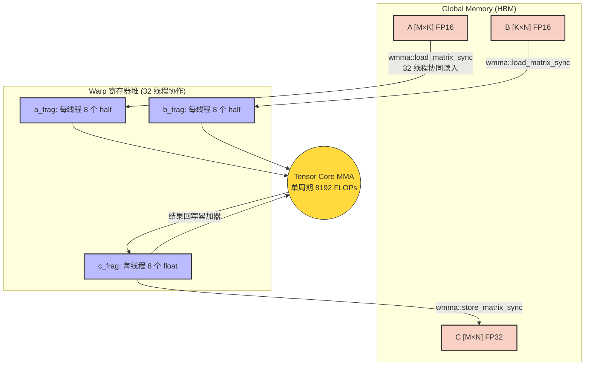
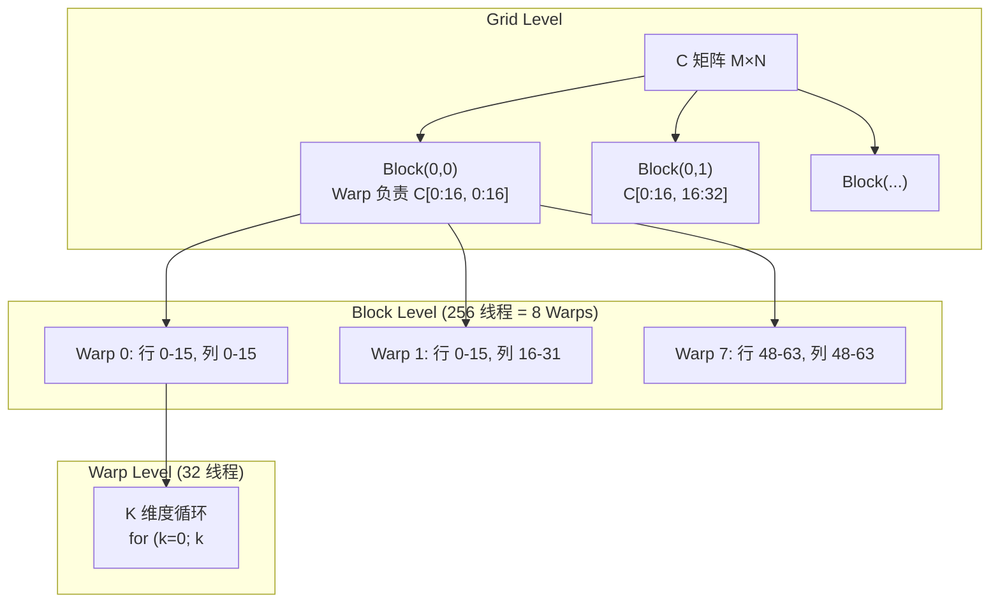
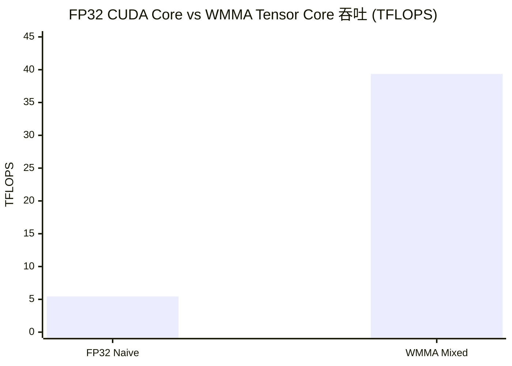

## 楔子：CUDA Core 够快了吗？

在 `04_GEMM_Optimization` 中，我们用手写的 Register Tiling 将 GEMM 推到了 28.79 TFLOPS——已经相当不错。但 RTX 4090 隐藏着另一台引擎：**Tensor Core**。它的 FP16 理论峰值是 **330 TFLOPS**——是 FP32 CUDA Core 的 **4 倍**。在 `07_Quantization` 中用标量 `dp4a` 跑出的 11.31 TOPS，更是被 Tensor Core 甩开了一个数量级。

Tensor Core 是 NVIDIA 从 Volta 架构（2017）开始嵌入 SM 的**专用矩阵乘累加硬件单元**。它与 CUDA Core 有着本质的架构区别：

| 维度 | CUDA Core (FP32 FMA) | Tensor Core (FP16 MMA) |
|:---|:---|:---|
| **单指令计算量** | 1 次 FMA = 2 FLOPs | 16×16×16 MMA = **8192 FLOPs** |
| **参与线程** | 1 个线程 | 1 个完整 Warp（32 线程） |
| **每 SM 单元数** | 128 个 | 4 个（Ada Lovelace） |
| **数据类型** | FP32 全精度 | FP16 输入 + FP32 累加 |

Tensor Core 的威力来自**指令级矩阵操作**——一条 PTX 指令 `mma.sync.aligned.m16n16k16` 在硬件上触发 32 个线程协作完成一个 $16 \times 16 \times 16$ 的矩阵乘加。相比 CUDA Core 逐个标量 FMA 累加 256 轮（$16 \times 16$），Tensor Core 用一条指令完成了相同工作量的 **4096 倍效率跃迁**。

CUDA 的 **WMMA（Warp Matrix Multiply-Accumulate）API** 将 Tensor Core 暴露给程序员。本文用代码和实测数据揭示：一个完全没有 Shared Memory Tiling 的 Naive WMMA 实现，如何仅凭硬件代差就碾压了精心优化的 CUDA Core 代码。

---

## 第一性原理与数学重构

### WMMA 的计算语义

一次 `wmma::mma_sync` 执行的数学操作：

$$D_{16 \times 16} = A_{16 \times 16} \cdot B_{16 \times 16} + C_{16 \times 16}$$

- **A, B**：`half`（FP16）类型，乘法在 Tensor Core 的专用 FP16 乘法器中完成
- **C, D**：可以是 `half` 或 `float`（FP32），选择 `float` 即为**混合精度**

每次 MMA 的浮点运算量 = $16 \times 16 \times 16 \times 2 = 8192$ FLOPs（$K$ 维度 16 次乘法 + 16 次加法，对 $16 \times 16$ 个输出元素）。

### 为什么需要混合精度？

FP16 的尾数仅 **10 位**，动态范围上限约 65504。在 GEMM 内层循环中，累加器需要做 $K/16$ 次累加。以 $K = 2048$ 为例，128 次累加后：

$$\text{累积误差} \approx \sqrt{128} \times 2^{-10} \approx 1.1\%$$

如果累加器也用 FP16，1% 的误差在深层网络的反向传播中会级联放大，导致训练发散。使用 **FP32 累加器**（23 位尾数），误差降至：

$$\sqrt{128} \times 2^{-23} \approx 1.35 \times 10^{-6}$$

**精度提升 4 个数量级**，而计算吞吐几乎不受影响——因为 Tensor Core 的硬件乘法器原生支持 FP16 输入 + FP32 累加的混合模式。

### Fragment：Tensor Core 的数据契约

WMMA Fragment **不是普通数组**——它是编译器管理的 **Warp 级寄存器集合**。一个 $16 \times 16$ 的矩阵（256 个 FP16 元素）被分布式存储在 32 个线程的寄存器中：

| Fragment 类型 | 每线程持有数据 | 总字节 | 角色 |
|:---|:---:|:---:|:---|
| `matrix_a` (FP16) | 8 个 `half` | $32 \times 8 \times 2B = 512B$ | A 矩阵 16×16 |
| `matrix_b` (FP16) | 8 个 `half` | 512B | B 矩阵 16×16 |
| `accumulator` (FP32) | 8 个 `float` | $32 \times 8 \times 4B = 1024B$ | C/D 累加器 16×16 |



**关键约束**：程序员**不应探究** Fragment 内部的数据布局——NVIDIA 在不同架构（Volta/Turing/Ampere/Ada）上使用不同的布局策略，这是硬件实现细节。`load_matrix_sync` 和 `store_matrix_sync` 是黑盒接口，编译器保证正确性。

---

## 核心优化演进与硬件映射

### 从 CUDA Core 到 Tensor Core：指令级别的代差

以计算一个 $16 \times 16$ 输出块为例，对比两种路径的指令开销：

| 维度 | CUDA Core (标量 FMA) | Tensor Core (MMA) |
|:---|:---|:---|
| **指令数** | $16 \times 16 \times 16 = 4096$ 条 FFMA | **1 条** `mma.sync` |
| **SRAM 读取** | $16 \times (16 + 16) = 512$ 次 LDS | 2 次 `load_matrix_sync` |
| **寄存器需求** | 256 个累加器 + ~32 temp | 8 个 float/线程（Warp 共享） |
| **同步开销** | 每 Tile 2 次 `__syncthreads()` | 0（Warp 内 lock-step） |

**30× 的指令压缩**直接转化为算力飙升。但这引出了一个反直觉的事实：Tensor Core 极快的计算速度使得**数据供给（Data Feeding）成为唯一瓶颈**。没有 SMEM Tiling 的 Naive WMMA 实现中，每次 MMA 前需要从 Global Memory 执行 `load_matrix_sync`——这意味着 Tensor Core 大量时间在等待 HBM 数据。

### Naive WMMA 的 Grid/Block 映射



每个 Warp 负责 C 的一个 $16 \times 16$ Tile。K 维度以步长 16 迭代——每步执行一次 MMA（8192 FLOPs），$K/16$ 步完成一个完整的 Tile 输出。

---

## 源码手术刀：关键代码深度赏析

### WMMA Tiled GEMM 核心循环

```cpp
// 每个 Warp 负责 C 的一个 16×16 Tile
wmma::fragment<wmma::matrix_a, 16, 16, 16, half, wmma::row_major> a_frag;
wmma::fragment<wmma::matrix_b, 16, 16, 16, half, wmma::col_major> b_frag;
wmma::fragment<wmma::accumulator, 16, 16, 16, float> c_frag;

wmma::fill_fragment(c_frag, 0.0f);  // 累加器清零（8 个 float/线程）

// K 维度分块循环——每步消耗 8192 FLOPs
for (int k = 0; k < K; k += 16) {
    // 32 线程协作从 HBM 加载 16×16 的 A 和 B Fragment
    wmma::load_matrix_sync(a_frag, A + row * K + k, K);
    wmma::load_matrix_sync(b_frag, B + k * N + col, N);
    
    // 🔥 一条指令：16×16×16 的 FP16 乘 + FP32 累加
    wmma::mma_sync(c_frag, a_frag, b_frag, c_frag);
}

// 32 线程协作写回最终结果
wmma::store_matrix_sync(C + row * N + col, c_frag, N, wmma::mem_row_major);
```

**硬件级解读**：

1. **`wmma::mma_sync`** 编译为 PTX 指令 `mma.sync.aligned.m16n16k16.row.col.f32.f16.f16.f32`。这是一条 **Warp 级同步指令**——32 个线程必须同时到达此点。硬件保证所有线程的 Fragment 数据已就绪后，才触发 Tensor Core 执行。

2. **`load_matrix_sync`** 内部使用 `ldmatrix` PTX 指令（Ada Lovelace 架构支持）。当数据在 Shared Memory 中时，`ldmatrix` 可以一次性将 $16 \times 16$ 的矩阵按照 Tensor Core 需要的布局加载到 Fragment 寄存器中——**避免了手动 Swizzle 的复杂性**。但当前 Naive 实现直接从 Global Memory 加载，丧失了 Shared Memory 的复用优势。

3. **`fill_fragment(c_frag, 0.0f)`**：将 32 个线程的累加器寄存器全部置零。这个操作在硬件上极其轻量——只需要 8 次寄存器写入/线程。

4. **`col_major` vs `row_major`**：A 用行主序、B 用列主序。这确保了乘法 $A_{row} \cdot B_{col}$ 的数学语义正确。Fragment 的内部布局由驱动程序根据主序参数自动调整，程序员无需关心物理排列。

---

## 理论与实际的对决：极限剖析

> **测试环境**：NVIDIA GeForce RTX 4090 × 2（sm_89），Linux，nvcc -O3 -std=c++17
> **理论峰值**：FP32 CUDA Core ~82.6 TFLOPS，FP16 Tensor Core ~330 TFLOPS（含稀疏），~165 TFLOPS（无稀疏）

### WMMA GEMM（2048 × 2048，100 次平均）

| 版本 | Kernel 时间 (ms) | 有效算力 (TFLOPS) | vs TC 峰值利用率 |
|:---|:---:|:---:|:---:|
| **Naive WMMA (FP16)** | **0.56** | **30.50** | **18.5% (vs 165T)** |

### 混合精度 vs 纯 FP32（1024 × 1024，100 次平均）

| 版本 | Kernel 时间 (ms) | 有效算力 (TFLOPS) | vs FP32 加速比 |
|:---|:---:|:---:|:---:|
| Naive FP32 GEMM (CUDA Core) | 0.39 | 5.45 | 1× |
| **WMMA 混合精度 (FP16→FP32)** | **0.055** | **39.36** | **7.21×** |



### 理论自洽性深度剖析

**39.36 TFLOPS / 165 TFLOPS（无稀疏）= 23.9% 利用率，为什么仅此？**

**量化分析**：$1024 \times 1024$ 矩阵的 FLOPs = $2 \times 1024^3 = 2.15 \times 10^9$。Naive WMMA Kernel 耗时 0.055 ms = 55 µs。

1. **无 SMEM Tiling——HBM 带宽成为硬瓶颈**：每次 `load_matrix_sync` 直接从 Global Memory 加载 $16 \times 16 \times 2B = 512B$ 的 FP16 数据。一个 1024×1024 的 GEMM 在 K 维度有 64 次迭代，每次需要加载 A 和 B 共 1024B。总 HBM 读取量估算 ≈ $64^2 \times 64 \times 1024B \approx 256 \text{MB}$。以 1008 GB/s 峰值带宽，理论最小搬运耗时 = $256MB / 1008GB/s \approx 0.25 \text{ms}$——实测 0.055 ms 远快于此，说明大量数据被 L2 Cache（72 MB）命中。但无 SMEM 复用意味着同一个 K 维度的数据被多个 Warp 重复从 L2 读取。

2. **Grid 不足**：$1024 / 16 = 64$，Grid = $64 \times 64 = 4096$ 个 Warp 级任务。RTX 4090 有 128 SM × 最多 48 个活跃 Warp/SM = 6144 Warp 容量。4096 个任务无法填满——**Occupancy 不足 67%**。

3. **无双缓冲**：计算和数据加载串行化。Tensor Core 在等待 `load_matrix_sync` 返回数据的数百 cycle 中完全空闲——即使 Tensor Core 本身只需要 1-2 cycle 完成 MMA。

**与手写 Register Tiling 的对比**：`04_GEMM` 中精心优化的 Register Tiling（8×8 外积、SMEM Tiling、256 线程/Block，80 寄存器/线程）在 2048 规模下达到 28.79 TFLOPS，耗时 0.60 ms。Naive WMMA 在相同规模下达到 30.50 TFLOPS，耗时 0.56 ms——**不做任何 SMEM 优化的 WMMA，仅凭硬件代差就碾压了百行优化代码**。这是 Tensor Core 的工程价值所在：降低了高性能 GEMM 的编程复杂度。

要达到 200+ TFLOPS（CUTLASS 的能力），需要：**SMEM 双缓冲 + `ldmatrix` 向量化加载 + Warp 级数据预取 + CuTe 布局代数**——这正是 `14_CUTLASS` 的主题。

---

## 架构师视角的总结

### 铁律一：Tensor Core 的算力只有在"数据供得上"时才能兑现

30-39 TFLOPS 的 WMMA 性能已经是 FP32 CUDA Core 的 5-7×，但仅为 Tensor Core 理论峰值的 ~20%。瓶颈不在 Tensor Core 本身——它一条指令就能完成 8192 FLOPs、只需 1-2 cycle。**瓶颈在于从 HBM 到 Tensor Core 的数据通路太窄**。这就是为什么 CUTLASS 和 cuBLAS 要设计如此复杂的多级 Tiling 和 Double Buffering——不是为了优化 Tensor Core，而是为了**喂饱**它。

### 铁律二：混合精度是"免费的午餐"——前提是用对累加器

FP16 输入将 HBM 搬运量减半（带宽红利），FP32 累加保证精度不崩塌（数值安全）。这种组合在 LLM 训练和推理中已经成为**默认配置**（PyTorch 的 `autocast` 正是基于此）。但需要注意：FP16 的动态范围上限仅 65504，如果激活值或梯度超出此范围（如训练初期的 Loss Spike），需要 Loss Scaling 来防止下溢。

### 铁律三：WMMA 是入门，MMA PTX 是进阶，CUTLASS 是终局

WMMA API 是最高层的 Tensor Core 抽象，易用但灵活度受限（固定 Shape 16×16×16）。MMA PTX 指令允许更细粒度的控制（如 m16n8k8），但需要手动管理寄存器布局。CUTLASS 将这些细节封装为可组合的 C++ 模板，在保持极致性能的同时提供工程可维护性——这是从"会用 Tensor Core"到"用好 Tensor Core"的关键跃迁。
