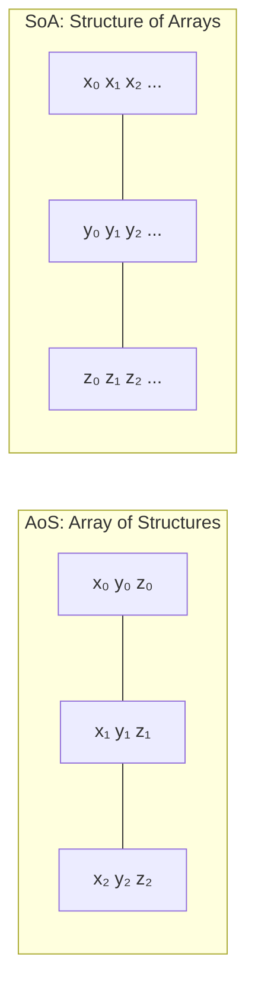
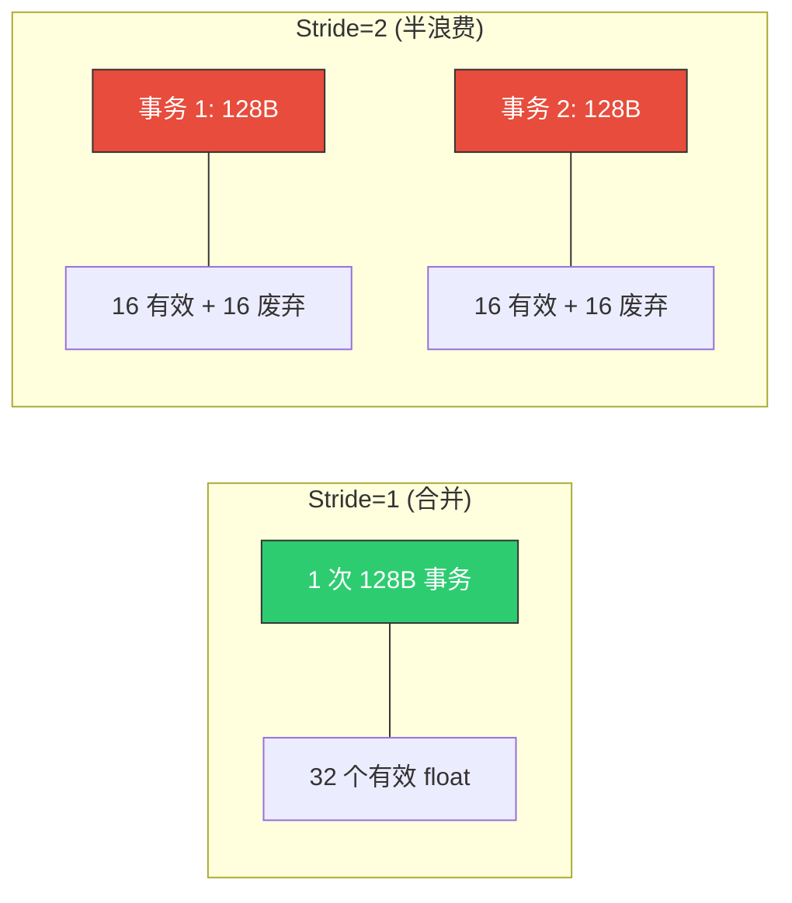
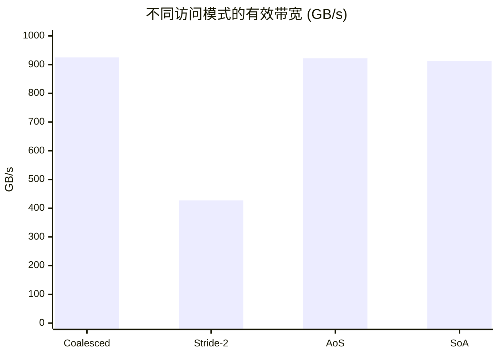

## 楔子：代码对了，为什么带宽只有一半？

你的 CUDA Kernel 逻辑正确、边界检查完善、验证通过——但 Profiler 显示有效带宽仅为理论峰值的 42%。这不是算力不足，也不是算法问题，而是**访存模式错了**。

GPU 的存储系统如同一条精密的多级高速公路：Register（~1 cycle）→ Shared Memory（~20 cycles）→ L2 Cache（~200 cycles）→ HBM（~600 cycles）。每一层都有自己的"交通规则"——违反规则不会报错，只会**悄无声息地变慢**。这种隐性性能陷阱比显式 Bug 更加致命。

本章用三个直击灵魂的实验，测量三种经典访存病症的**真实性能损失**，并给出精确的修复方案：

| 病症 | 存储层级 | 性能损失 | 修复手段 |
|:---|:---|:---:|:---|
| **非合并访存** | Global Memory | **带宽腰斩 54%** | 数据布局重排（SoA） |
| **Bank Conflict** | Shared Memory | **19% 延迟膨胀** | Padding（+1 列） |
| **计算-搬运串行** | Global→Shared | 极端场景受限 | `cp.async` 流水线 |

---

## 第一性原理与存储物理

### 一、合并访存：128B 事务的物理法则

GPU 的内存控制器以 **128 字节（32 个 float）** 为粒度发起**事务（Transaction）**。当一个 Warp 的 32 个线程访问**连续的** 32 个 float 时，恰好合并为 1 个事务——128B 全部有效，利用率 100%。

但如果 32 个线程以 `stride = 2` 跨步访问（即线程 $i$ 访问地址 $2i$），同一 128B 事务中只有 16 个 float 是有效的——**利用率 50%**，另外 64B 数据被读上来又扔掉了。

$$BW_{\text{effective}} = BW_{\text{peak}} \times \frac{\text{有效数据量}}{\text{事务搬运量}} = 1008 \times \frac{1}{stride}$$

stride = 32 时（最极端），每个事务仅 1 个有效 float，利用率 3.1%——**带宽从 1008 GB/s 暴跌至 ~31 GB/s**。

### 二、AoS vs SoA：数据布局决定合并访存的命运



当 Warp 中 32 个线程各自读取自己粒子的 `x` 坐标时：

- **AoS**：线程 0 访问偏移 0，线程 1 访问偏移 12（结构体大小），线程 2 访问偏移 24... 有效 stride = 3，需要多次事务
- **SoA**：线程 0 访问 `X[0]`，线程 1 访问 `X[1]`... 完美连续，1 次事务搞定

### 三、Shared Memory Bank Conflict 的硬件机理

Shared Memory 被物理划分为 **32 个 Bank**，每个 Bank 宽度 4 字节（1 个 float）。Bank 编号由地址决定：

$$\text{Bank ID} = \left\lfloor \frac{\text{地址}}{4} \right\rfloor \bmod 32$$

当 Warp 中**不同线程**访问的地址落在**同一 Bank 的不同行**时，这些请求必须**串行化**：

| 冲突级别 | 含义 | 延迟膨胀 |
|:---:|:---|:---:|
| **1-way** | 32 线程各访问不同 Bank | 1× (无冲突) |
| **2-way** | 每 2 个线程撞同一 Bank | 2× |
| **32-way** | 所有线程撞同一 Bank | **32×** |

**Padding 修复原理**：将 `__shared__ float smem[N][N]` 改为 `__shared__ float smem[N][N+1]`。多出的 1 列使每行的起始 Bank 偏移 1 位，打破了"同一列跨行全部落在同一 Bank"的规律。

对于 `smem[N][N]`，`smem[row][0]` 的 Bank ID = $(row \times N) \bmod 32$。当 $N = 32$ 时，$\text{Bank ID} = 0$——**所有行的第 0 列都在 Bank 0**，32-way 冲突！

修改为 `smem[N][33]` 后，$\text{Bank ID} = (row \times 33) \bmod 32 = row$——**完美分散到 32 个不同的 Bank**。

### 四、异步拷贝：绕过寄存器的直达通道

传统 Global→Shared 拷贝路径：`LD.E`（Global Load 到寄存器）→ `STS`（Store 到 Shared）。这**占用两个寄存器**做临时中转，并且在 `LD.E` 返回前线程必须等待。

Ampere 架构的 `cp.async` 指令开辟了一条 DMA 直通通道：数据从 L2 Cache **直接搬入 Shared Memory**，绕过寄存器文件。SM 的计算管线在 `cp.async` 飞行期间可以执行其他指令——实现**真正的计算-搬运重叠**。

---

## 核心优化演进与硬件映射

### 合并访存的事务效率对比



### Bank Conflict 的 Padding 错位效应

| 配置 | `smem[row][0]` 的 Bank ID | 列 0 跨行冲突 |
|:---|:---|:---|
| `smem[32][32]` | 全部 = 0 | **32-way** ❌ |
| `smem[32][33]` | 0, 1, 2, ..., 31 | **无冲突** ✅ |

---

## 源码手术刀：关键代码深度赏析

### 一、合并 vs 跨步访问的一行之差

```cpp
// 合并访问：线程 tid 读取连续地址 A[tid]
__global__ void coalesced_kernel(float* out, const float* in, int n) {
    int tid = blockIdx.x * blockDim.x + threadIdx.x;
    if (tid < n) out[tid] = in[tid] + 1.0f;  // 完美合并
}

// 跨步访问：线程 tid 读取地址 A[tid * 2]
__global__ void strided_kernel(float* out, const float* in, int n, int stride) {
    int tid = blockIdx.x * blockDim.x + threadIdx.x;
    int idx = tid * stride;  // stride=2: 地址不连续
    if (idx < n) out[idx] = in[idx] + 1.0f;  // 带宽腰斩
}
```

从代码角度看几乎没有区别——多了一个 `* stride`。但在硬件层面，这决定了内存控制器需要发射 1 个还是 2 个事务。**GPU 编程中，算法复杂度不重要，地址连续性才重要。**

### 二、Bank Conflict Padding 的标准用法

```cpp
// 有冲突版本：转置时跨行同列触发 32-way conflict
__shared__ float tile[TILE][TILE];          // smem[32][32]
tile[threadIdx.y][threadIdx.x] = input[...]; // 写入：按行写，无冲突
output[...] = tile[threadIdx.x][threadIdx.y]; // 读取：按列读，32-way！

// Padding 版本：多一列打破 Bank 对齐
__shared__ float tile[TILE][TILE + 1];      // smem[32][33]
tile[threadIdx.y][threadIdx.x] = input[...]; // 写入：无冲突
output[...] = tile[threadIdx.x][threadIdx.y]; // 读取：Bank 完美分散 ✓
```

**代价分析**：Padding 多消耗 $32 \times 1 \times 4B = 128B$ 的 Shared Memory。对于 `smem[32][33]`，总占用从 4096B 增至 4224B——增幅仅 3%，完全可以接受。

### 三、Async Copy 多阶段流水线

```cpp
#include <cuda_pipeline.h>

__shared__ float smem[3][BLOCK_SIZE];  // 3 阶段缓冲

for (int i = 0; i < num_tiles; ++i) {
    // 1. 发起异步 DMA：cp.async 绕过寄存器
    cuda::memcpy_async(smem[i % 3], &global_in[i * BLOCK_SIZE],
                       sizeof(float) * BLOCK_SIZE);
    cuda::pipeline_commit();              // 提交到流水线组

    // 2. 等待最老的组（i-2）完成
    cuda::pipeline_wait_prior<2>();       // 至少保持 2 个组在飞行

    // 3. 对已就绪的数据做计算
    if (i >= 2) compute(smem[(i - 2) % 3]);
}
```

**三阶段流水线**：Stage 0 加载 → Stage 1 加载 → Stage 0 计算 → Stage 2 加载 → Stage 1 计算...  加载和计算在时间上形成重叠。但当计算极轻时（如仅 `+= 1`），流水线的状态机维护开销反而成为净负担。

---

## 理论与实际的对决：极限剖析

> **测试环境**：NVIDIA GeForce RTX 4090 × 2（sm_89），Linux，nvcc -O3 -std=c++17
> **理论峰值**：HBM 带宽 ~1008 GB/s

### 合并访存 vs 跨步访存（16M 元素，64 MB，100 次平均）

| 版本 | Kernel 时间 (ms) | 有效带宽 (GB/s) | 带宽利用率 |
|:---|:---:|:---:|:---:|
| **合并访问（Stride=1）** | **0.15** | **925** | **91.8%** |
| 跨步访问（Stride=2） | 0.16 | **427** | **42.4%** |
| AoS 结构体访问 | 0.58 | 922 | 91.5% |
| SoA 结构体访问 | 0.59 | 913 | 90.6% |



**Stride=2 带宽腰斩的量化解释**：每个 128B 事务中，32 线程以 stride=2 访问，只有 16 个 float（64B）有效，利用率 50%。理论有效带宽 = $1008 \times 50\% = 504 \text{GB/s}$，实测 427 GB/s = 理论有效值的 84.7%。剩余的 15% 损失来自 L2 Cache Miss 和地址分散导致的额外事务。

**AoS vs SoA 为什么几乎无差异？** 因为本实验中 AoS 的结构体大小为 $3 \times 4B = 12B$，在 128B 事务中仍然能部分合并。如果结构体更大（如 64B），AoS 的性能将急剧恶化。

### Bank Conflict（4096×4096 矩阵转置，100 次平均）

| 版本 | Kernel 时间 (ms) | 有效带宽 (GB/s) | vs 无冲突比 |
|:---|:---:|:---:|:---:|
| **无冲突** | **0.153** | **879** | 1× |
| 有冲突（跨行同列） | 0.181 | 740 | **1.19×（慢 19%）** |
| **Padding 修复** | **0.160** | **826** | **1.05×（恢复 94%）** |

追加的一维数组 stride 分析更直观地展示了冲突倍数：

| Stride | Bank 冲突级别 | 延迟膨胀 |
|:---:|:---|:---:|
| 1 | 无冲突 | 1× |
| 2 | 2-way | 1.0× |
| 32 | **32-way** | **2.25×** |

**Padding 修复效果**：带宽从 740 GB/s 恢复到 826 GB/s——恢复了无冲突性能的 **94%**。剩余 6% 的差距来自 Padding 增加了 SMEM 占用，可能轻微影响 Occupancy。

### 异步拷贝（67M 元素，256 MB，100 次平均）

| 版本 | Kernel 时间 (ms) | 有效带宽 (GB/s) |
|:---|:---:|:---:|
| 同步拷贝 (寄存器中转) | 0.60 | **901** |
| 单阶异步 | 0.60 | 898 |
| **3 阶流水线** | **0.63** | **857** |

**反直觉结果深度分析**：异步拷贝在此测试中**反而更慢**。原因在于测试的计算负载极低（仅 `a[i] += 1`）——几乎没有什么计算可以跟搬运重叠。`cp.async` 的三阶流水线引入了额外的 pipeline 状态机管理开销和 `pipeline_wait_prior` 同步指令，这些开销在没有计算可掩盖的情况下成为净成本。

`cp.async` 的**真正价值**在 **Compute Bound 场景**（如 GEMM 的 Tensor Core 循环、FlashAttention 的多步 MMA），计算需要数百 cycle 而搬运可以在后台完成——此时搬运和计算的**完全重叠**才能体现收益。

---

## 架构师视角的总结

### 铁律一：合并访问是 GPU 编程的第零条规则

Stride=2 就能让带宽腰斩——这意味着**数据布局的选择在编写第一行 Kernel 之前就已决定了性能天花板**。在 GPU 上，SoA 几乎总是优于 AoS。如果你的代码中出现了 `array[tid * stride]` 且 stride > 1，立刻回去重新设计数据布局。

### 铁律二：Padding 是 Bank Conflict 的万能药，但有代价

`float smem[N][N+1]` 多消耗 $N \times 4$ 字节 Shared Memory。当 SMEM 接近 48KB 上限时，Padding 可能导致 Occupancy 下降。此时需要考虑替代方案：如**对角映射（Diagonal Mapping）** 或 **Swizzle**（CUTLASS 使用的技术）。

### 铁律三：异步拷贝的价值在 Compute-Bound 场景才能兑现

`cp.async` 不是加速访存本身，而是**释放寄存器文件并创造计算-访存重叠窗口**。在 Memory Bound Kernel 中（如本实验），即使搬运路径更高效，总耗时仍由 HBM 带宽决定。只有当 Kernel 内部有足够多的独立计算指令可以在 DMA 飞行期间执行时，流水线的收益才能显现——这就是 CUTLASS 在 `14_CUTLASS` 中多级 Pipeline 的核心动机。
