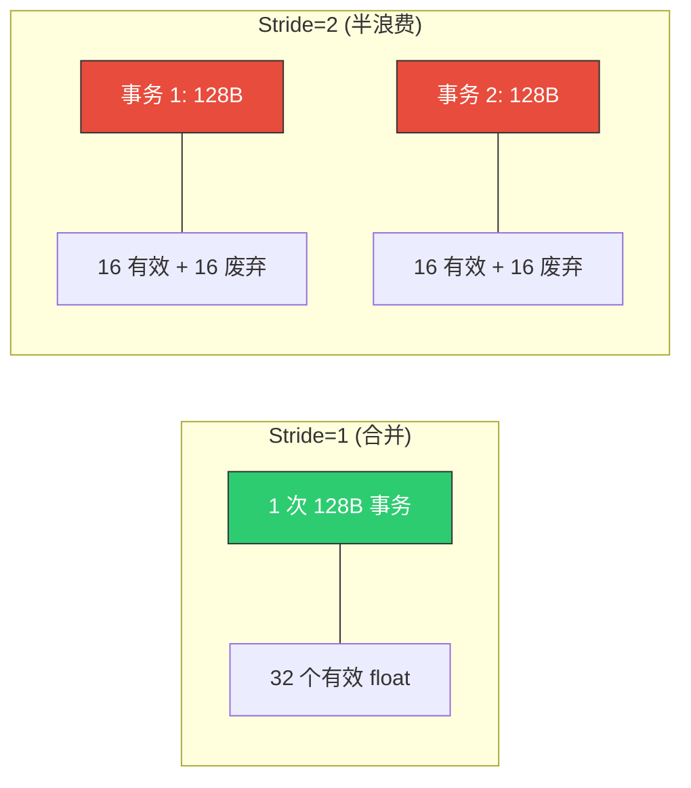
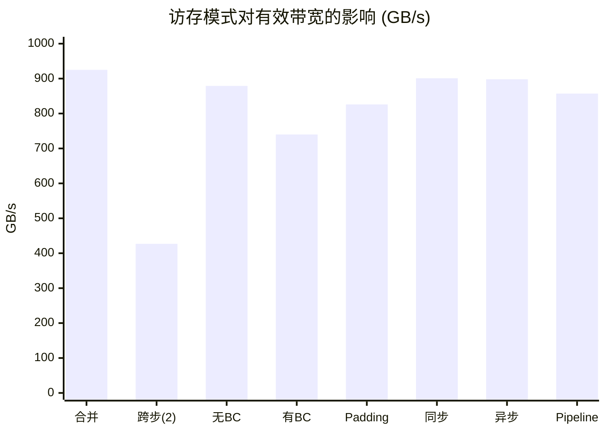

> 📖 **前置阅读**：01_Basics（存储层级）、04_GEMM_Optimization（Bank Conflict 提及）
> 📖 **推荐后续**：13_Performance_Analysis（用 Nsight 定位访存瓶颈）

前面讲了很多次"大多数算子是 Memory Bound"。但"Memory Bound"只说了瓶颈在哪，没说怎么搬得快。同样是从 Global Memory 读 64 MB 数据，合并访存和跨步访存的带宽差可以达到 2 倍以上。三组对照实验，量化三种访存模式对性能的具体影响。

---

## 实验 1：合并访问 vs 跨步访问

Global Memory 的最小读写粒度是 32 字节（一个 sector）。同一 Warp 内 32 个线程访问连续的 128 字节地址时，显存控制器只需 4 个 sector 请求——这就是合并访存。stride=2 时需要 8 个 sector 请求，一半数据搬了但没用。

$$BW_{\text{effective}} = BW_{\text{peak}} \times \frac{1}{\text{stride}}$$

```cpp
// 合并访问：线程 tid 读取连续地址
out[tid] = in[tid] + 1.0f;             // 完美合并

// 跨步访问：线程 tid 读取 stride=2 的地址
out[tid * stride] = in[tid * stride] + 1.0f;  // 带宽腰斩
```



### 实测（$N = 16M$，64 MB，100 次平均）

| 访问模式 | Kernel 时间 | 有效带宽 | vs 合并 |
|:---|:---|:---|:---|
| 合并访问 (stride=1) | 0.15 ms | 925 GB/s | 1× |
| 跨步访问 (stride=2) | 0.16 ms | 427 GB/s | **0.46×** |
| AoS 结构体 | 0.58 ms | 922 GB/s | — |
| SoA 结构体 | 0.59 ms | 913 GB/s | — |

AoS 和 SoA 在这个测试中差异不大（922 vs 913 GB/s），因为 Kernel 用了结构体的全部字段。AoS 的问题通常出现在只需要部分字段的场景——读一个 `float x` 要把整个 `struct{x,y,z,w}` 都搬进来。

---

## 实验 2：Bank Conflict

Shared Memory 被划分为 32 个 Bank，每个 Bank 宽 4 字节。

$$\text{Bank ID} = \left\lfloor \frac{\text{地址}}{4} \right\rfloor \bmod 32$$

同一 Warp 内多个线程访问同一 Bank 的不同行时，访问必须序列化。矩阵转置中 `smem[32][32]` 按列读取时，所有行的第 0 列都在 Bank 0——32-way Conflict。

### Padding 修复

`__shared__ float smem[32][33]` 多一列 Padding，让第 0 行从 Bank 0 开始，第 1 行从 Bank 1 开始——列方向访问完美分散到 32 个不同 Bank。代价仅 128 字节 SMEM（+3%）。

```cpp
// 有冲突
__shared__ float tile[TILE][TILE];          // smem[32][32]
output[...] = tile[threadIdx.x][threadIdx.y]; // 按列读，32-way！

// Padding
__shared__ float tile[TILE][TILE + 1];      // smem[32][33]
output[...] = tile[threadIdx.x][threadIdx.y]; // Bank 完美分散 ✓
```

### 实测（$4096 \times 4096$ 矩阵转置，100 次平均）

| 访问模式 | Kernel 时间 | 有效带宽 | vs 无冲突 |
|:---|:---|:---|:---|
| 无 Bank Conflict | 0.153 ms | 879 GB/s | 1× |
| 有 Bank Conflict | 0.181 ms | 740 GB/s | **慢 19%** |
| Padding 消除 | 0.162 ms | 826 GB/s | 恢复 94% |

Stride 分析——32-way 理论上应该慢 32 倍，但硬件有 Broadcast 机制，实际 2.25×：

| Stride | 冲突级别 | 延迟膨胀 |
|:---:|:---|:---:|
| 1 | 无冲突 | 1× |
| 2 | 2-way | 1.00× |
| 32 | 32-way | **2.25×** |

---

## 实验 3：异步内存拷贝

`cuda::memcpy_async` 让 Global → Shared Memory 的拷贝绕过寄存器——数据直接从 L2 Cache 搬进 SRAM。配合多阶段 Pipeline（三缓冲），理论上可以完全隐藏加载延迟。

```cpp
__shared__ float smem[3][BLOCK_SIZE];  // 3 阶段缓冲

for (int i = 0; i < num_tiles; ++i) {
    cuda::memcpy_async(smem[i % 3], &global_in[i * BLOCK_SIZE],
                       sizeof(float) * BLOCK_SIZE);
    cuda::pipeline_commit();
    cuda::pipeline_wait_prior<2>();
    if (i >= 2) compute(smem[(i - 2) % 3]);
}
```

### 实测（$N = 64M$，256 MB，100 次平均）

| 版本 | Kernel 时间 | 有效带宽 | vs 同步 |
|:---|:---|:---|:---|
| 同步拷贝 | 0.596 ms | 901 GB/s | 1× |
| 单阶段异步 | 0.597 ms | 898 GB/s | 1.00× |
| 三阶段 Pipeline | 0.627 ms | 857 GB/s | **0.95×（更慢）** |

没有提速，Pipeline 反而慢了 5%。原因不是 Async Copy 不好用——而是这个测试的计算量太低（只做 `+= 1`）。异步加载的目的是用计算掩盖加载延迟，但没有足够的计算来填充等待时间时，Pipeline API 的管理开销就变成了净负担。

Async Copy 的真正战场是 GEMM 这种计算密集的 Kernel：每个 Tile 的加载需要 ~200 cycle，但计算需要 ~500 cycle——加载可以完全被计算掩盖。这就是 CUTLASS 多级 Pipeline 的核心动机（14_CUTLASS）。

---

## 三个实验的综合



合并访存是基本功——stride=2 就丢掉一半带宽。Bank Conflict 是 SRAM 版的"不合并"，一列 Padding 解决，代价 3% 空间换 19% 性能。异步拷贝不是万能药——只有计算量足够大时才有收益。
