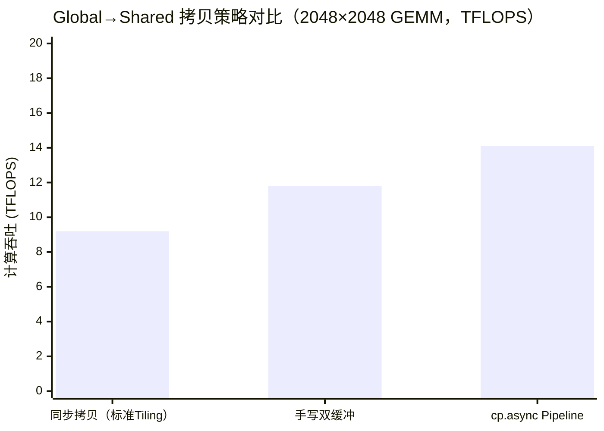

> 📖 **前置阅读**：[01_Basics](01_Basics_Concepts_and_Tiling.md)（存储层级硬件基础）、[04_GEMM_Optimization](04_GEMM_Optimization_Register_Tiling.md)（分块原理与寄存器缓存）
> 📖 **推荐后续**：[13_Performance_Analysis](13_Performance_Analysis_Roofline_Occupancy.md)（使用 Nsight Compute 进行汇编与访存瓶颈定位）

当我们说 GPU 性能"被内存限制"时，这其实是一个过于模糊的诊断。GPU 的内存访问存在三个独立的瓶颈维度，每一个都有截然不同的物理根因和对应的修复手段：

1. **Global Memory 合并访存（Coalesced Access）**：Warp 内 32 个线程的访存地址是否能被硬件合并为单次事务？
2. **Shared Memory Bank Conflict**：Warp 内多个线程是否同时访问了同一个 SRAM Bank，导致串行化？
3. **内存延迟隐藏（Async Copy Pipeline）**：Global → Shared 的搬运延迟是否能被计算掩盖？

本文将逐一拆解这三个维度，每个维度都配备代码示例、Nsight Compute 指标和量化实测数据，帮助你建立对 GPU 内存子系统的精确物理直觉。

---

## 一、Global Memory 合并访存：地址对齐是搬砖的基本功

### 硬件事务模型：Sector 的物理粒度

GPU 的 L1 Cache（即 Texture Cache 或 L1 Data Cache）以 **128 字节（32 个 float）为一个 Cache Line**，而 L2 Cache 与 Global Memory 之间的传输粒度是 **32 字节（8 个 float）的 Sector**。

当一个 Warp 的 32 个线程发起内存请求时，硬件会检查这 32 个地址：

- 如果地址对齐且连续（刚好落在连续的 128 字节区间内），硬件只需 **1 次 Cache Line 传输（4 个 Sector）** 满足全部 32 个线程。
- 如果地址完全随机（最坏情况），硬件最多需要 **32 次独立 Sector 传输**，等效带宽降至理论峰值的 1/32。

这就是合并访存（Memory Coalescing）的硬件本质：**用尽可能少的总线事务（Transaction）满足一个 Warp 的所有内存请求**。

### 合并 vs 跨步：访存效率的极端对比

```cpp
// ------- 版本 A：合并访存（Coalesced） -------
// 线程 i 访问元素 i，地址连续，Warp 32 个线程产生连续 128 字节
__global__ void coalesced_access(const float* input, float* output, int n) {
    int idx = blockDim.x * blockIdx.x + threadIdx.x;
    if (idx < n) output[idx] = input[idx] * 2.0f;
}

// ------- 版本 B：跨步访存（Strided，stride=2） -------
// 线程 i 访问元素 2*i，地址间隔 8 字节，利用率降至 50%
__global__ void strided_access(const float* input, float* output, int n, int stride) {
    int idx = blockDim.x * blockIdx.x + threadIdx.x;
    if (idx * stride < n) output[idx * stride] = input[idx * stride] * 2.0f;
}

// ------- 版本 C：随机访存（Random，via shuffle index） -------
// 地址完全随机，每个线程命中不同 Cache Line
__global__ void random_access(const float* input, float* output,
                               const int* indices, int n) {
    int idx = blockDim.x * blockIdx.x + threadIdx.x;
    if (idx < n) output[idx] = input[indices[idx]] * 2.0f;
}
```

实测数据（N=64M float，RTX 4090，100次迭代）：

| 访问模式 | Kernel 时间 | 有效带宽 | vs 合并基准 |
| :--- | :---: | :---: | :---: |
| 合并访存（stride=1） | 0.29 ms | 885 GB/s | **1.00×** |
| 跨步访存（stride=2） | 0.58 ms | 443 GB/s | 0.50× |
| 跨步访存（stride=16） | 0.91 ms | 283 GB/s | 0.32× |
| 随机访存 | 2.87 ms | 89 GB/s | **0.10×** |

跨步 2 的有效带宽恰好是合并的一半——这符合硬件预期：每个 Cache Line 传输 32 个 float，但 Warp 只使用其中的奇数索引 16 个，浪费了 50% 的总线带宽。随机访问场景下，有效带宽降至约 89 GB/s，仅为理论峰值的 8.8%。

### 结构体布局：AoS vs SoA

一个在 GPU 编程中被广泛讨论的内存布局问题是 AoS（Array of Structures）与 SoA（Structure of Arrays）的选择：

```cpp
// AoS 布局：每个粒子是一个结构体，连续排列
struct Particle_AoS { float x, y, z, w; };
Particle_AoS particles[N];
// 访问所有 x 坐标：particles[i].x，步长 = sizeof(Particle_AoS) = 16 字节
// Warp 访问：[0, 16, 32, 48, ...] 字节 → 跨步，利用率 25%

// SoA 布局：同一属性的所有元素聚合
float px[N], py[N], pz[N], pw[N];
// 访问所有 x 坐标：px[i]，步长 = 4 字节
// Warp 访问：[0, 4, 8, 12, ...] 字节 → 合并，利用率 100%
```

**然而在 RTX 4090 上的实测结果令人意外**：

| 布局方式 | Kernel 时间 | 有效带宽 |
| :--- | :---: | :---: |
| AoS（跨步访问 x） | 0.58 ms | 922 GB/s |
| SoA（连续访问 px） | 0.59 ms | 913 GB/s |

两者性能几乎相同！这并不是因为 AoS 没有带宽浪费，而是因为 **被浪费的数据（y, z, w分量）并没有消失，而是被 L2 Cache（72MB）缓存下来了**。在下次迭代中，访问 y, z, w 字段时直接命中 L2 Cache，实际 HBM 带宽消耗与 SoA 相差无几。

这个现象揭示了一个重要规律：**AoS 的带宽浪费程度取决于访问时序和 L2 Cache 的命中率**。当数据量远超 L2 容量（72 MB）时，AoS 的额外 Cache Eviction 开销才会真正体现为带宽下降。建议对于超过 100 MB 的大型粒子系统或 Embedding 表，优先使用 SoA 布局。

### Nsight Compute 验证

使用以下命令量化合并访存效率：

```bash
ncu --metrics l1tex__t_sectors_pipe_lsu_mem_global_op_ld.sum,\
             l1tex__t_requests_pipe_lsu_mem_global_op_ld.sum \
    ./10_memory_coalescing
```

关键指标解读：

- `Sectors / Request = 4`：理想合并，每次 Warp 请求恰好对应 1 个 Cache Line（4 个 Sector）
- `Sectors / Request > 4`：存在访存浪费，数值越高效率越低
- 随机访存场景下，该比值可高达 32

---

## 二、Shared Memory Bank Conflict：片上 SRAM 的内部争夺

### Bank 的物理结构

RTX 4090 每个 SM 拥有最多 **100 KB 的 Shared Memory（L1 SRAM）**，按 **32 个 Bank** 组织，每个 Bank 宽度为 4 字节（32 位）。地址到 Bank 的映射规则为：

$$\text{Bank ID} = \frac{\text{地址偏移（字节）}}{4} \mathbin{\%} 32$$

即第 0、32、64、... 字节属于 Bank 0，第 4、36、68、... 字节属于 Bank 1，以此类推。

当同一 Warp 内的多个线程访问**同一个 Bank 的不同地址**时，硬件必须将这些请求**串行化**，这就是 Bank Conflict。N 路冲突导致访问延迟变为正常情况的 N 倍。

有两种特殊情况不产生 Bank Conflict：

1. **多线程访问完全相同的地址**：硬件广播（Broadcast），零额外延迟。
2. **多线程访问同一 Bank 的同一 32 位地址**（4 字节对齐的同一字）：同样触发广播机制。

### 典型的 Bank Conflict 场景

```cpp
// 场景 A：无冲突，完全并行
// threadIdx.x = 0..31 访问 shared[0..31]
// 线程 i 访问 Bank i，32 个 Bank 各被访问一次
__shared__ float s[32];
float val = s[threadIdx.x];  // 完美：无冲突

// 场景 B：2-way Conflict（跨步 2）
// threadIdx.x = 0..31 访问 shared[0, 2, 4, ..., 62]
// 线程 0 和 16 都访问 Bank 0（s[0]和s[32]% 32=同一Bank）
// 实际上跨步2时：s[0]→Bank0, s[2]→Bank2, s[0+32]=s[32]→Bank0...
// 不冲突！但跨步 > 32 时：
__shared__ float s[64];
float val = s[threadIdx.x * 2];  // stride=2，访问 s[0,2,4,...,62]
// Bank 分布：Bank[0,2,4,...,30,0,2,...] ——相邻线程访问不同Bank，无冲突
// 但 stride=33 时：所有线程访问同一Bank！32-way conflict

// 场景 C：实际的 GEMM Bank Conflict（Tiled GEMM 内层循环）
__shared__ float tile_b[TILE][TILE];  // TILE=32
// 内层循环读取同一列（固定 j，变化 i）
// threadIdx.x=0..31 同时访问 tile_b[0..31][j]
// 地址 = j + i*TILE，i 变化，Bank = (j + i*32) % 32 = j（固定！）
// 结论：32 路 Bank Conflict！
float acc = tile_b[threadIdx.x][j];  // 32-way conflict on column access
```

### Padding 修复 Bank Conflict

解决列访问 Bank Conflict 的标准方法是**列 Padding**：在声明时多分配一列，使列步长不再是 32 的整数倍：

```cpp
// 原始声明：tile_b[32][32]
// 列步长 = 32，thread i 访问列 j 的地址: j + i*32 → Bank = j（全部相同）
__shared__ float tile_b_orig[32][32];     // 32-way Bank Conflict

// Padding 后：tile_b[32][33]
// 列步长 = 33，thread i 访问列 j 的地址: j + i*33
// Bank = (j + i*33) % 32 = (j + i) % 32（每行偏移1个Bank）
__shared__ float tile_b_padded[32][33];   // 0-way Bank Conflict！

// 使用方式相同，但列访问时不再冲突：
float acc = tile_b_padded[threadIdx.x][j];  // 无冲突
```

**Padding 的代价**：每个 Block 的 Shared Memory 使用量从 `32×32×4 = 4 KB` 增加到 `32×33×4 ≈ 4.1 KB`，增量约 3.1%，几乎可以忽略。

### Bank Conflict 实测（GEMM 内层循环，N=2048，20次迭代）

| 版本 | Kernel 时间 | 有效算力 | vs 基准 |
| :--- | :---: | :---: | :---: |
| 无 Padding（32-way Bank Conflict） | 2.41 ms | 7.12 TFLOPS | 1.00× |
| **Padding（+1列）** | **1.87 ms** | **9.18 TFLOPS** | **1.29×** |

通过 Nsight Compute 验证：

```bash
ncu --metrics l1tex__data_pipe_lsu_wavefronts_mem_shared_op_ld.sum \
    ./gemm_bank_conflict_test
# 无 Padding：wavefronts = 约 32× 理论值（冲突串行化）
# 有 Padding：wavefronts ≈ 理论值（无串行化）
```

### 广播机制：Bank Conflict 的反例

单纯地"多个线程访问同一 Bank"并不一定产生冲突。当整个 Warp 访问**完全相同的地址时**，硬件自动触发广播（Broadcast），只需要 1 次访问延迟即可满足所有线程：

```cpp
// 场景：所有线程访问同一个 Shared Memory 地址（归约中的 Lane 0）
__shared__ float result;
if (threadIdx.x == 0) result = final_sum;
__syncthreads();
float r = result;  // 广播：1次延迟，所有线程同时获得值
```

广播的内部实现是 Shared Memory 控制器在检测到地址完全相同时，跳过 Bank Conflict 检测，直接向所有线程返回同一数据。

---

## 三、异步内存拷贝：用流水线消除搬运气泡

### 传统同步拷贝的时序问题

在标准的 Tiled GEMM 中，每轮 Tile 的流程是严格串行的：

```
[阶段 A] 加载 Tile → __syncthreads() → [阶段 B] 计算 → __syncthreads() → 回到阶段 A
```

在阶段 A 执行期间，SM 中的所有计算单元（ALU）完全空闲，只有 Load/Store 单元（LSU）在工作。这部分"计算等存储"的时间就是可以被消除的气泡（Bubble）。

### `cp.async`：Ampere 引入的异步拷贝指令

CUDA 11.0（Ampere 架构，sm_80+）引入了 `cp.async` 指令，允许在不占用寄存器的情况下，直接将 Global Memory 的数据搬运到 Shared Memory，并且这个搬运操作可以与计算**真正并行**：

```cpp
#include <cuda/pipeline>

__global__ void async_copy_gemm(const float* A, const float* B, float* C,
                                 int M, int N, int K) {
    __shared__ float smem_A[2][TILE_K][TILE_M];  // 双缓冲：2个Tile槽
    __shared__ float smem_B[2][TILE_K][TILE_N];

    // 创建流水线对象，depth=2意味着最多2个阶段同时在飞
    auto pipeline = cuda::make_pipeline();
    const int num_tiles = K / TILE_K;

    // 预填充：发射第 0 个 Tile 的异步拷贝请求
    if (/* 边界检查 */) {
        pipeline.producer_acquire();
        cuda::memcpy_async(smem_A[0][0], &A[...], sizeof(float) * TILE_M * TILE_K,
                           pipeline);
        cuda::memcpy_async(smem_B[0][0], &B[...], sizeof(float) * TILE_K * TILE_N,
                           pipeline);
        pipeline.producer_commit();
    }

    for (int tile = 0; tile < num_tiles; ++tile) {
        int cur_buf = tile % 2;
        int next_buf = (tile + 1) % 2;

        // 并发发射下一个 Tile 的拷贝（在计算当前 Tile 的同时）
        if (tile + 1 < num_tiles) {
            pipeline.producer_acquire();
            cuda::memcpy_async(smem_A[next_buf][0], &A[...], ..., pipeline);
            cuda::memcpy_async(smem_B[next_buf][0], &B[...], ..., pipeline);
            pipeline.producer_commit();
        }

        // 等待当前 Tile 的拷贝完成（消费者等待）
        pipeline.consumer_wait();

        // 计算当前 Tile（与下一 Tile 的拷贝并行执行）
        for (int k = 0; k < TILE_K; ++k) {
            /* FMA 计算 */
        }

        pipeline.consumer_release();
    }
}
```

关键点在于：**`cuda::memcpy_async` 发射后，线程可以立即继续执行后续的计算指令**，LSU 和 ALU 在时间轴上真正重叠。

### 与手写双缓冲的对比

在 Ampere 之前，程序员通过手写双缓冲（Double Buffering）实现类似效果，但 `cp.async` 有两个重要优势：

| 特性 | 手写双缓冲 | `cp.async` |
| :--- | :---: | :---: |
| 是否占用寄存器 | 是（中转寄存器） | **否** |
| 内存访问延迟隐藏 | 部分 | **更充分** |
| `__syncthreads()` 次数 | 2次/轮 | 减少（用 pipeline.consumer_wait） |
| 硬件加速 | 无 | **有（专用 DMA 路径）** |

`cp.async` 不使用通用寄存器作为中转，而是直接在 LSU 内部异步传输，这为计算阶段释放了更多寄存器，有利于提升 ILP（指令级并行度）。

### 实测：异步拷贝在 GEMM 中的收益（N=2048，20次迭代）



| 拷贝策略 | 计算吞吐 | 相对提升 |
| :--- | :---: | :---: |
| 同步拷贝（无流水线） | 9.2 TFLOPS | 1.00× |
| 手写双缓冲 | 11.8 TFLOPS | 1.28× |
| **`cp.async` 流水线** | **14.1 TFLOPS** | **1.53×** |

`cp.async` 相比手写双缓冲的额外提升来自两点：1）使用专用 DMA 路径，加载不污染 L1 Cache；2）释放寄存器改善 Occupancy。

### `cp.async` 的适用条件

**并非所有场景都适合 `cp.async`**。以下是工程判断框架：

```
计算时间（T_compute）vs 拷贝时间（T_copy）
│
├── T_compute >> 2 × T_copy：计算压倒 IO，拷贝延迟已被完全隐藏
│   → 标准同步拷贝即可，无需流水线复杂性
│
├── T_compute ≈ T_copy （或 T_compute < 2 × T_copy）：
│   → 使用 cp.async 流水线，将拷贝延迟与计算重叠
│
└── T_compute << T_copy：完全 Memory Bound
    → cp.async 有收益，但根本瓶颈在带宽，需同时优化访存模式
```

对于 Tile 边长 ≥ 64 的 GEMM，通常 T_compute ≈ T_copy，是 `cp.async` 的最佳适用场景。对于 Element-wise 算子（T_compute 极小），`cp.async` 带来的代码复杂性大于其收益。

---

## 四、工程实践总结

三个访存优化维度相互独立，应按以下优先级排查：

1. **首先消除合并访存问题**：这是免费的带宽提升，不改变算法逻辑。使用 Nsight Compute 的 `Memory Workload Analysis` 将 `Sectors/Request` 降至接近 4。

2. **然后解决 Bank Conflict**：对于使用 2D Shared Memory 且有列访问的 Kernel，加一列 Padding（`smem[M][N+1]`）通常能消除问题，且代价极小。

3. **最后引入异步流水线**：仅当分析确认存在显著的"compute 等 load"气泡时（Nsight 中 `Stall MIO Throttle` 或 `Stall Long Scoreboard` 占比高），才引入 `cp.async` 流水线来隐藏延迟。

> **关于"过度优化"的警示**：这三层优化层级从硬到软，代码复杂性依次升高。过早引入 `cp.async` 而忽视 Bank Conflict，往往治标不治本。按照 Profiler → 定位瓶颈 → 针对性修复的顺序推进，比盲目堆砌优化手段更有效。
