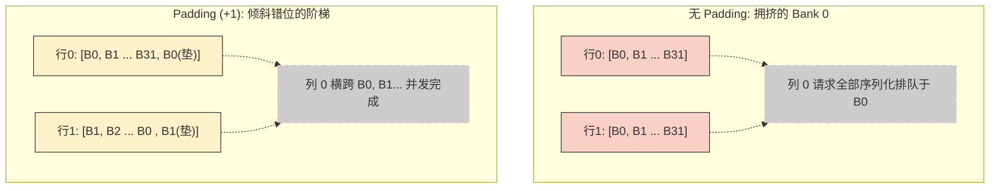

> 📖 **前置阅读**：01_Basics（存储层级硬件基础）、04_GEMM_Optimization（分块原理与寄存器缓存）
> 📖 **推荐后续**：13_Performance_Analysis（使用 Nsight Compute 进行汇编与访存瓶颈定位）

在前面的算子优化中，我们反复抛出过一个结论："现代 GPU 算子的阿喀琉斯之踵是 Memory Bound（访存受限）"。但仅仅指认出瓶颈的存在，并不能解决问题。同样是从 Global Memory 搬运 64 MB 的数据，为什么两段逻辑上完全等价的代码，实际测出来的吞吐量可能有数倍之差？

要回答这个问题，我们必须抛开高级语言的抽象，带着 C++ 代码跳进 GPU 的物理电路中。在这个微观世界里，所有的优化原理都可以归结为两层物理法则的映射：对齐它的**空间连贯性**（合并读取），以及错开它的**时间冲突**（打散串行）。

本篇博客是一次极其深度的剖析。我们将依据 `CUDA-Practice` 仓库下的三个控制变量实验，不仅仅停留在"这么写会变快"，而是用数学推导、微架构（Microarchitecture）知识以及真实的 Nsight Profiler 数据，把"为什么快"和"为什么慢"讲得清清楚楚。

---

## 实验一：Global Memory 的空间连贯性法则

**从 HBM 到 SM 的千军万马**

Global Memory（显存，如 GDDR6 或 HBM3）虽然拥有上千 GB/s 的极限带宽，但这种带宽是靠**极宽的数据总线（Bus Width）**堆出来的，而不是靠低延迟。当你发起一次显存读取时，这个请求要跨越巨大的硅片距离，排队通过内存控制器，经历数百甚至上千个时钟周期（Clock Cycles）的漫长等待。

为了分摊这高昂的延迟成本，GPU 硬件在设计时立下一个物理规则：**不伺候零售，只做批发**。
显存控制器每次与 L2 Cache 交互的最小物理颗粒度是 32 字节（一个 Sector）。而 L2 向上提供给 L1/SM 的事务（Transaction）更是常常以 128 字节为单位。

这就是为什么 GPU 极度讨厌你零碎地拿数据。当你只需要 1 个 `float`（4 字节）时，它迫不得已也会硬着头皮搬回 128 字节的内容。

如果我们能让一个 Warp（32 个并行线程）在同一条指令周期内，恰好去请求一段**连续的 32 个 `float`（完美等于 128 字节）**，那么这一个 128-byte 的物理事务就能 100% 地喂饱所有线程——这就叫**合并访存（Coalesced Access）**。

### 跨步惩罚与 L2 Cache 的"作弊"效应

我们在代码中人为地加入一个跨步（Stride）：

```cpp
// 完美合并：Warp 内相邻线程 (tid) 读取连续地址
__global__ void coalesced_access(const float* input, float* output, int n) {
    int idx = blockIdx.x * blockDim.x + threadIdx.x;
    if (idx < n) output[idx] = input[idx] * 2.0f;
}

// 跨步惩罚：Warp 内相邻线程读取不连续地址 (stride=2)
__global__ void strided_access(const float* input, float* output, int n, int stride) {
    int idx = blockIdx.x * blockDim.x + threadIdx.x;
    int actual_idx = idx * stride; // 带宽腰斩的元凶
    if (actual_idx < n) output[actual_idx] = input[actual_idx] * 2.0f;
}
```

当 `stride=2` 时，32 个线程实际上请求的是间隔的 `float`，总跨度变成了 256 字节。此时硬件为了完成读取，无可奈何地发起了 **2 次 128-byte 的事务**。
搬回来的 256 字节里，夹在中间的那 128 字节（奇数索引的数）在此刻完全用不上，纯属白占带宽。

我们的推导公式十分直白：
$$BW_{\text{effective}} = BW_{\text{peak}} \times \frac{1}{\text{stride}}$$

但在跑分时，这另外 50% 没用上的数据并非就地蒸发——它们被装载到了 **L2 Cache** 中保存。
如果后续有其他 Warp 马上访问它们，这反而能构成一次极高带宽的 L2 Cache Hit（命中）。这也解释了为什么在一些小数据量的 Micro-benchmarking 中，跨步访问跑出来的"有效带宽"甚至会大于 HBM 的绝对物理上限（比如超过 RTX 4090 的 1008 GB/s）。这并非牛顿定律失效，而是你的数据从 4000+ GB/s 的 L2 Cache 里走了捷径。

但是，在我们的测试（64 MB 数组，共 128 MB 流量）及大模型真实推理场景中，数据量远远大于 L2 容量（RTX 4090 约 72 MB）。没用的数据很快因为 LRU 策略被驱逐（Evicted）出 Cache。此时物理带宽实打实地减半：

| 访问模式 | Kernel 时间 | GPU 有效带宽 | 性能影响 |
| :--- | :--- | :--- | :--- |
| **合并访问 (Stride=1)** | **0.15 ms** | **925.31 GB/s** | **基准 (1x)** |
| 跨步访问 (Stride=2) | 0.16 ms | 427.34 GB/s | **0.46x 暴跌** |

### 结构体争论：AoS 会毁了带宽吗？

受限于跨步惩罚，CUDA 程序员对数据结构的选择非常谨慎。

- **AoS (Array of Structures)**：结构体数组（例如 `XYZW_0, XYZW_1...`）。
- **SoA (Structure of Arrays)**：平行数组（例如 `X_0..X_n, Y_0..Y_n...`）。

直觉上，AoS 是反合并的：当所有线程提取 `X` 坐标时，内存地址被 `Y,Z,W` 隔开了，形成了隐形的跨步。但看看我们的测试数据：

| 访问模式 | Kernel 时间 | GPU 有效带宽 | vs SoA 基准 |
| :--- | :--- | :--- | :--- |
| AoS 结构体数组 | 0.58 ms | 922.31 GB/s | 1.01x |
| SoA 结构体平行数组 | 0.59 ms | 912.82 GB/s | 1.00x |

**为什么 AoS 和 SoA 在这里带宽完全一样？**
因为在这个特定的 Kernel 中，我们修改了结构体内**所有字段**（`out.x = in.x * 2.0f; out.y = in.y * 2.0f...`）。
当线程 0 要 `X` 时提取了整个 `XYZW` Cache Line，接着它需要 `Y,Z,W` 时，数据**已经在 L1/L2 缓存里了**！不管以什么顺序加载，每个字节最后都被消耗了。

但这绝不意味着 AoS 是安全的。它的毒点在于**部分读取（Partial Fetch）**。如果在某个渲染循环里你只需要 `W`（比如当作权重），AoS 会把大量无用的 `X, Y, Z` 塞爆整条总线，瞬间变成 25% 利用率的灾难。对于深度学习框架而言，Tensor `dim` 的排列重塑实质上就是在内存布局上强行将 AoS 转为 SoA，挤干最后一滴合并带宽。

---

## 实验二：Shared Memory 的时间串行化法则

如果 Global Memory 的优化是空间对齐，那么更底层的 Shared Memory（SRAM）优化则是打赢一场名叫 **Bank Conflict（Bank 冲突）** 的战争。

Shared Memory 就安置在 SM（流多处理器）内部，极快、延迟极低。为了让 32 个线程能够真正在**同一个时钟周期（1 Cycle）**内拿到各自想要的数据，硬件设计师将这片 SRAM 物理切割成了 32 个独立的 **Bank（存储柜台）**。每个 Bank 宽度为 4 字节。

你可以想象 32 个出纳员坐成一排。只要别有几个人同时去找同一个出纳员，整个过程就是完美的并发。

它的映射地址非常死板，依赖求余公式：
$$\text{Bank ID} = \left( \left\lfloor \frac{\text{Byte Address}}{4} \right\rfloor \right) \bmod 32$$

在做矩阵级联乘加（如 GEMM 或矩阵转置）时，最典型的灾难发生了。我们经常划定 `__shared__ float smem[32][32]`：

- 当按行写时，线程 0~31 写入第 0 行。它们的内存索引为 `0, 1...31`。大家分别落入 Bank 0, Bank 1...Bank 31。完美！
- 但如果在转置时按列读呢？线程 `i` 读走的是第 `i` 行的第 0 列。
  - 线程 0 读取 `smem[0][0]` $\xrightarrow{}$ 索引 0 $\xrightarrow{}$ Bank 0
  - 线程 1 读取 `smem[1][0]` $\xrightarrow{}$ 索引 32 $\xrightarrow{}$ $\pmod{32}$ 还是 Bank 0
  - ...
  - 线程 31 读取 `smem[31][0]` $\xrightarrow{}$ Bank 0！

这构成了最惨烈的 **32-way Bank Conflict**。出纳员 0 号面对着 32 个并行的请求目瞪口呆，硬件的防线启动：**将并发请求强行序列化（Serialize），分作 32 个时钟周期依次处理。**

### Padding（填充）的四两拨千斤

解法是令人拍案叫绝的极客思维。只要把声明改为 `__shared__ float smem[32][33]`。我们在每一行的最右侧放一个不用的空档（Padding）。

这让整个二维数组的一行物理跨度从 32 变成了 33 字节块。

- `smem[0][0]` $\xrightarrow{}$ 索引 0 $\xrightarrow{}$ Bank 0
- 但 `smem[1][0]` 现在位于物理数组的索引 33 处。$33 \pmod{32} = \mathbf{1}$。它漂亮地落在了 Bank 1 上！
- `smem[2][0]` 落在了 Bank 2 上...

一加一错之间，这 32-way 的冲突奇迹般地完全消弭。仅仅牺牲了 `32 * 4 = 128` 字节的微量 SRAM，换回了完整的带宽。



### 硬件底层：Broadcast 机制与 ncu 诊断

| 测试版本 (4096×4096 转置) | Kernel 时间 | GPU 有效带宽 | vs 无冲突 |
| :--- | :--- | :--- | :--- |
| 无 Bank Conflict 基准 | 0.153 ms | 879.49 GB/s | 1x |
| 有 Bank Conflict (32-way) | 0.181 ms | 740.07 GB/s | 慢 19% |
| Padding (+1) 恢复 | 0.160 ms | 826.01 GB/s | 救回 |

追加的 Stride 分析表明，2-way 的冲突几乎测不出延迟（1.00x），而理论上该慢 32 倍的 32-way 冲突才慢了 **2.25x**。这种"未达灾难级"的表现，是因为微架构在底层帮我们吸收了伤害：

1. **LSU 的管线掩盖**：微量的 bank conflict（如 2-way）被 SM 强大的 Warp Scheduler 利用流水线级数隐藏掉了。同时，现在的 L1 Cache 被融合进 Shared Cache 设计，进一步平滑了突击请求。
2. **Broadcast（广播）机制**：如果在 32-way 冲突中，大家请求的是完完全全同一个内存地址（比如所有人都读全局的一个超参），硬件并不会排长队响应 32 次，而是只读 1 次，随后触发 Broadcast 将数据分发给所有人——这被视为无冲突。我们要防备的是落在同一个 Bank 的**不同**地址上所引发的重放（Replay）。

> 🛠️ **优化工程师的心得**：在 Nsight Compute 中，监控 `l1tex__data_bank_conflicts...`（Bank冲突重放次数）是一个肌肉记忆。只要大量涉及 2D Tile 的操作，都请机械式地加上 `+1` 甚至 `+3` Padding。

---

## 实验三：异步流水线 (Async Pipeline) 的状态机假象

在上述讨论中，数据从 Global 到 Shared Memory 的传统流转永远逃不开一个中转站：**寄存器（Register）**。
标准的 CUDA 搬运轨迹：

1. `float reg = Global_Array[idx];`
2. `__syncthreads();`
3. `Shared_Array[idx] = reg;`

Ampere 架构引入了一个颠覆性的硬件指令 `cp.async`（在 C++ 中暴露为 `cuda::memcpy_async` 与 Pipeline API）。它的本质是赋予 SM 发起自主 **DMA (直接内存访问)** 的能力，让数据直接从 L2 旁路进 Shared Memory，解放了宝贵的寄存器空间。

配合 `cuda::pipeline`，开发者可以实现类似于 CPU 操作系统的**多阶段流水缓冲 (Multi-stage Double/Triple Buffering)**。最理想的状态是：计算单元在拼命运算 Stage $N$ 的数据时，后端的 DMA 通道正默默地拼装好 Stage $N+1$。

这听起来无往不利，但在我们的测试结果（纯搬运并 `* 2.0f`）面前，理想被残忍地击败了：

| Pipeline 等级 | Kernel 时间 | GPU 有效带宽 | 性能影响 |
| :--- | :--- | :--- | :--- |
| 同步阻塞拷贝（寄存器版） | 0.596 ms | 901.43 GB/s | **更快 (基准)** |
| 单阶异步拷贝（Async DMA）| 0.600 ms | 898.00 GB/s | 持平 |
| **三阶异步流水缓冲 (3-Stage)** | **0.630 ms** | **856.55 GB/s** | **更慢！(0.95x)** |

### 剖析反直觉：算术强度与"遮盖错觉"

为什么耗费心力写出的 3-Stage Pipeline 跑出来居然是最慢的？
答案隐藏在 **算术强度 (Arithmetic Intensity, $I$)** 的屋顶定律 (Roofline Model) 里。

算术强度的定义是：**每读写一兆字节的数据，你执行了几次浮点运算（FLOPs / Byte）。**
对于我们这段极度贫瘠的测试代码 `out[i] = in[i] * 2.0f`：

- 读取 4 bytes，写入 4 bytes，总共产生了 8 bytes 的总线流量。
- 只有 1 次纯粹的浮点相乘（1 FLOP）。
- $I = 1 / 8 = 0.125 \text{ FLOPs/Byte}$。

RTX 4090 的极限带宽约为 1008 GB/s，而 FP32 算力却高达 82 TFLOPS。其屋顶（拐点）在数百级别。这表明，在这段代码里，由于计算太过于粗浅，显存控制器的访存总线始终处于 **100% 满负荷发烫工作** 状态，而 SM 在 99% 的时段里纯粹在挂机罚站。由于瓶颈死死卡在物理总线宽度上，Pipeline 用流水线来"掩盖"等待时间的做法**毫无物理意义**，因为你无论怎么掩盖，搬运总计所花费的物理毫秒数在那儿无法突破。

更糟糕的是，流水线编程（Producer/Consumer 状态维护）带来的 `pipeline.acquire()`, `pipeline.commit()`, 和 `__syncthreads()` 等大量的栅栏（Barrier）同步指令周期，在这段薄弱的代码里无法被摊销，变成了纯负向的净开销！

> **🔥 Async Copy 的真正主场：致密的 Tensor 战场**
> 异步内存流水线的威力只有在**绝对的计算密集型代码**里方能展现。在大规模 GEMM（矩阵乘法）寄存器分块之后，一个 $128 \times 128$ 数据块（占带宽）往往对应着十几万次的 FMA 乘加重用（吃算力）。此时 $I$ 被推高到上百。通过 4-Stage 甚至更大的 Async Pipeline（这也是 CUTLASS 的底层灵魂），我们能做到让 Tensor Core 的算力峰值无限飙高而不必等米下锅。当引入最新的 Hopper 架构 **TMA（张量内存加速器）** 后，这种由硬件自发预取的数据滑移，更是到达了彻底脱离 Warp 调度负担化的化境。

---

## 架构级访存心法

这三场在不同物理边界层（HBM、SRAM、DMA Pipeline）对访存发起的冲击试验，带给了我们比代码更深远的架构洞见：

1. **所有的内存都是带有体力的**。Global Memory 需要整块整块地对齐吃下以喂饱总线，不要企图挑战显存控制器的 128-byte 惩罚线。`idx = blockIdx.x * blockDim.x + threadIdx.x` 这句圣经般的范式是现代系统底层的不可抗力。
2. **用空间买时间的终极杠杆在 SRAM (Padding)**。当你用 `dim3` 定义二维计算空间，处理矩阵反转、图像卷积时，一定记得在二维数组最内侧列宽上加上那一格极不起眼的 `+1`。
3. **不要为了装进新轮子而在生病的地方开刀**。在彻底 Memory Bound 的算子（如 Element-wise 标量加减、RMSNorm 等）中，保持极简直接的 `Reg <- Global` 并迅速写出，比设计花里胡哨的多线程状态机更实用。只有在算术强度攀上高峰时，才祭出 Async Pipeline 这把重锤。
