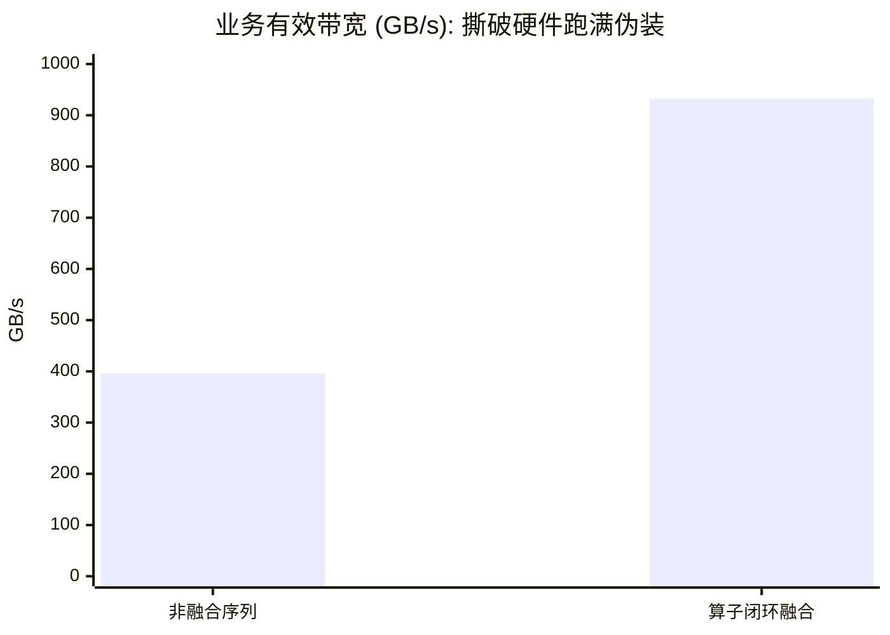
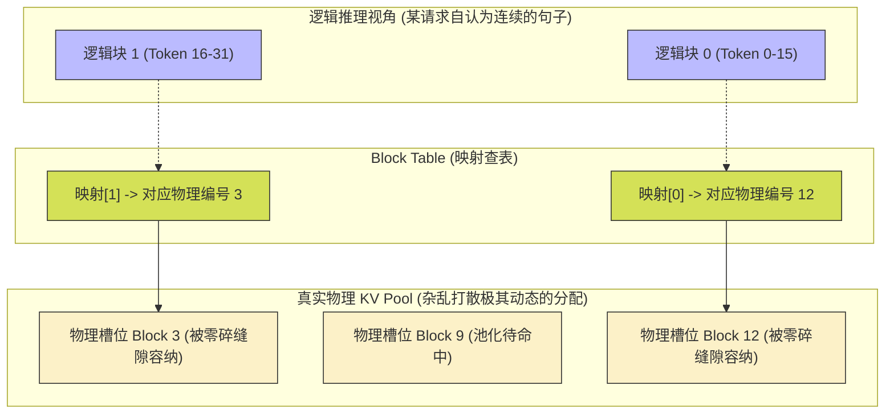

> 📖 **前置阅读**：05_LLM_Ops（Softmax/LayerNorm 算子）、08_Advanced（PyTorch Extension）  
> 📖 **推荐后续**：12_Standard_Libraries（cuBLAS 在推理中的角色）

当我们讨论大语言模型（LLM）推理时，初学者往往会抱有一种错觉：只要把显卡的算力（TFLOPS）卡满，优化好矩阵乘法（GEMM）的速度，推理的字数就会跟开挂一样往外冒。然而残酷的工业界现实是：在千亿参数模型的自回归生成阶段（Decoding Phase），也就是大家看着屏幕上的字一个一个往外蹦的时候，你花高价买来的现代 GPU 的计算利用率经常连 **5%** 都不到。

为什么会这样？答案藏在 LLM 生成文字的机制里——每次只能“吐出” 1 个 Token。

当你把 Batch Size 设为 1 时，原本极其适合 GPU 并行计算的庞大 GEMM（大矩阵乘大矩阵）不可避免地退化成了 GEMV（大矩阵乘小向量）。在这个瞬间，数万个计算单元嗷嗷待哺，但显卡的显存带宽（HBM Bandwidth）却已经被彻底榨干了。整个系统陷入了**极端严重的 Memory Bound（访存瓶颈）**和**Capacity Bound（显存容量瓶颈）**。

在 LLM 推理架构师的真实视角里，你买的不是一块能算 82.6 TFLOPS 的 RTX 4090，而是一块昂贵的、带宽 1008 GB/s 的内存条。这也是为什么所有顶级开源框架（如 vLLM、TGI、TensorRT-LLM）都不在单纯的算子上死磕，而是打出了针对系统瓶颈的三套王牌组合拳：**算子融合（Kernel Fusion）**、**分页注意力（PagedAttention）** 和 **连续批处理（Continuous Batching）**。

本文将剥开层层包装，直接下沉到 C++ 和 CUDA 代码的物理实现层面，把这三个系统级优化的底裤彻底扒掉。

---

## 零、基石视角：基于 Roofline 模型的推理物理墙

在深入具体的代码技术之前，我们必须先建立一个坚不可摧的第一性原理直觉：为什么 LLM 推理就是快不起来？到底是什么物理定律锁死了它的速度？

我们要严格区分 LLM 推理周期的两个截然不同的阶段：

1. **Prefill（预填充）阶段**：用户提交了一大段 Prompt（引言），模型可以把这些所有的 Token 打包成一个大矩阵，利用巨大的矩阵乘法（GEMM）一次性完成前向传播。这时的**算术强度（Arithmetic Intensity）**非常高，属于典型的 **Compute Bound（算力瓶颈）**，极其考验显卡的 Tensor Core 峰值算力。
2. **Decoding（解码生成）阶段**：模型进入了长达数百次的自回归死循环：吐出第 1 个 Word -> 把这个 Word 拼接到输入序列末尾 -> 再次遍历整个网络模型 -> 吐出第 2 个 Word。

在 Decoding 阶段，灾难发生了。

假设你的模型有 $P$ 个参数（比如 7B 参数模型，采用 FP16 半精度存储，大约有 14 GB 的权重）。为了生成这**仅仅 1 个 Token**，模型在每一次循环中，都必须毫无遗漏地把所有这 14 GB 的参数从 HBM（高带宽主存）完整地搬运到 SM（流式多处理器）里的寄存器中，执行一次乘法和加法。

那么，此次操作的计算量约为 $2P$ FLOPs（乘加各一次），而访存量则是 $2P$ Bytes（如果用 FP16 的话，每个参数 2 字节，但每次计算带来 2 次 FLOPs，抵消后比例接近 1:1）。

我们来计算一下这其中致命的**算术强度（Arithmetic Intensity, $I$）**：
$$I = \frac{\text{FLOPs}}{\text{Bytes 访存量}} \approx \frac{2P}{2P} = 1 \text{ FLOP/Byte}$$
也就说，这块显卡费尽九牛二虎之力每从显存里“抠”出 1 个 Byte 的数据喂进核心，计算核心只对它做 1 次微不足道的浮点运算就扔掉了。

在这个公式面前，所有的算力（TFLOPS）都是浮云。我们来看看 RTX 4090 的极限物理瓶颈（Roofline 拐点）：

- 理论算力峰值：$P_{max} = 82.6 \text{ TFLOPS}$
- 理论硬件带宽：$B_{max} = 1008 \text{ GB/s}$
- 硬件设计的拐点算术强度：$I_{max} = \frac{82.6 \times 10^{12}}{1008 \times 10^9} \approx 81.9 \text{ FLOPs/Byte}$

**残酷的结论诞生了**：RTX 4090 的设计预期是，你每喂入 1 个 Byte 数据，要配得上 82 次以上的连续运算，它才能不让自己停下来等数据。而我们现在实际给它的算术强度只有 $I=1$。
在 Decoding 阶段，你算力利用率的物理上限永远是被锁死在 $\frac{1}{81.9} \approx 1.2\%$！你的 GPU 超过 98% 的硅晶体面积处于停摆状态，都在苦苦等待那一根被数据塞爆的 1008 GB/s 显存通道。

因此，在这场名为“大模型架构”的残酷游戏中，唯一值钱的硬件资源就是**访存带宽**和**显存容量**。这正是我们要讲的首个优化—— Kernel Fusion 登场的原因。

---

## 一、Kernel Fusion（算子融合）：消灭无意义的物理回旋镖

既然带宽极其珍贵，我们就更应该把每一丝带宽都花在刀刃上。
但是在写 PyTorch/TensorFlow 代码时，框架底层的调度机制正在疯狂地透支你的带宽。我们来看看最平凡的一行激活函数缩放代码：`Y = Scale(ReLU(A + B))`。写起来很优雅，对吧？但在物理底层，它正在引发一场灾难。

为了搞懂这三次调用到底有多慢，我们假设特征数组大小为 $N=134,217,728$ 个元素（对于 float 而言是一张约 512 MB 的中等特征图）。

### 1.1 物理层的荒谬循环

**非融合版（Unfused 版，对应原生框架调度的 3 个独立 Kernel）：**
在 `kernel_fusion.cu` 源码中，对应了三个独立的核函数 `add_kernel`、`relu_kernel` 和 `scale_kernel`。

1. `add_kernel` 启动：显卡从无底洞般的 HBM 里**读入 $A$ 和 $B$（2次访存）**，拉进流处理器计算出加法结果，随后再**写回 HBM 中间区存为 `tmp1`（1次访存）**。
2. `relu_kernel` 启动：刚存进去的数据还没坐热，又必须立刻把 `tmp1` 重新**从 HBM 拿回计算核心（1次访存）**，执行极其廉价的 ReLU 操作，然后再把结果**写回 HBM 命名为 `tmp2`（1次访存）**。
3. `scale_kernel` 启动：同样的把戏再玩一次，将 `tmp2` **读进核心（1次访存）**，乘以常数后，**写出最终结果 `Y`（1次访存）**。

总计：4 次读，3 次写。总物理信息搬运量为 $7N \times 4$ Bytes（约 3.75 GB）。
这就像是一份文件要在同一间办公室的三个不同工位间流转盖章，由于“框架抽象规定”，每个人盖完章不仅不能直接递给旁边的人，还必须要求员工跑下楼把文件锁回地下金库（HBM），下一个人再跑下楼开金库拿出来盖章。这其中产生了大量的“**Memory Round-trip（内存无用往返）**”。

### 1.2 源码级映射：数据在寄存器里闭环

算子融合（Kernel Fusion）的本质，就是撕毁“模块化抽象”的遮羞布，把三个人关在同一个 GPU 线程里，文件递到桌面上直接连盖三个章。

在 C++ CUDA 层面的体现，就是极其巧妙地利用了单线程私有的**超高速寄存器（Register File）**，让数据流生生不息地在 SM（流式多处理器）物理内部完成一次性闭环：

```cpp
// 典型的融合版本，整个过程严格杜绝落盘回写主存
__global__ void fused_add_relu_scale(CPFloat a, CPFloat b, PFloat output, CFloat scale, CInt n) {
    int idx = blockIdx.x * blockDim.x + threadIdx.x;
    if (idx < n) {
        // 【第一步】：将 A 和 B 读入极速但极其稀缺的 SM 物理寄存器中
        float sum = a[idx] + b[idx];         
        
        // 【第二步】：直接在 Register 之间进行级联求值 (ReLU)，几乎不产生任何时钟周期的延迟
        float activated = fmaxf(sum, 0.0f);  
        
        // 【第三步】：挂上参数相乘后，一次性、永远地写出到遥远的 HBM
        output[idx] = activated * scale;     
    }
}
```

**访存结算**：在这个融合版本里，仅在第一步发生了**外向读取（读A读B，共2次）**，以及在第三步发生了**外向写回（写Y，1次）**。总搬运量从残暴的 $7N$ 直接暴跌至理论极限的 $3N$。

### 1.3 撕开测光工具（Nsight）的面具（基准对决）

我们在 RTX 4090 上针对这个长达一亿多元素的特征图循环了 50 次，来观察其物理行为：

| 开发版本 | 内核平均卡顿时长 | 仪器显示的纯物理吞吐带宽 | 真正面向业务的“有效带宽” | 加速杠杆 |
| :--- | :--- | :--- | :--- | :--- |
| 框架非融合版 (序列调用) | 4.06 ms | 925.84 GB/s | 396.79 GB/s | 1.00× |
| **CUDA手工融合版 (Fused)** | **1.73 ms** | **932.85 GB/s** | **932.85 GB/s** | **2.35×** |

*注：测光评估使用 NVIDIA Nsight Compute。即便是非融合版本，`dram__throughput` 这一硬性物理指标也显示跑满了 90% 以上的理论极值 (~925GB/s)。*



**我们发现了什么极其反常识的现象？**

许多自诩专业的开发者一旦拿着 `ncu` 跑到非融合版本的硬件日志，看到 925 GB/s 的 DRAM 吞吐带宽，会误以为“物理硬件已经被我榨干了，由于带宽墙我们已经没有任何优化空间了”。
但这是一个用体力战术制造出来的巨大幻觉。

作为主导系统的决策者，业务代码的唯一终极意图只是获得 $Y = Scale(ReLU(A+B))$。那么**不管你怎么算，数学法则决定了纯净有效的信息增益量仅仅是被消耗的 $A$（1份）、被消耗的 $B$（1份）以及诞生的 $Y$（1份）——总计 $3N$。**
如果我们用这区区 $3N$ 除以非融合版吃力耗费的 4.06ms，惊悚的事实暴露了：**非融合版本实际达成的有效业务推进带宽仅仅只有凄惨的 396.79 GB/s。这意味着，高达 57% 的通电时间与硬件负载，全部由于那无意义的中间变量（`tmp1`、`tmp2`）来回存放给彻底吞噬了。**

融合操作之后，1.73ms 的执行时长换取了 2.35 倍的业务推进。这是用极高难度的系统工程底层 API 重构（这甚至催生出了如 OpenAI Triton 这样的融合编译语言前端）直接逆天改命换回来的巨大红利。FlashAttention 之所以能一统江湖，正是把极其繁杂、有数十次中继落盘回写的 Self-Attention 强行糅合进了一个宏达而精密运转的单体 Kernel 内核中。

---

## 二、PagedAttention（GPU 的虚拟内存革命）

如果说 Kernel Fusion 解决了“带宽流量被乱花”的问题，那么 PagedAttention 就是为了解决 LLM 架构中另一只更为可怕的吞金巨兽：极其极其珍贵的**显存容量占地**。因为在大语言模型的世界里，Capacity-bound 的直接后果就是**服务拒绝与 OOM（Out of Memory）**死机。

在自回归生成的解码（Decoding）中，为了防止每一次生成新的 Token 都要把前面的上千个字全部重新计算一遍前缀，工程上必须引入 **KV Cache（键值缓存）**。每吐出一个字，模型生成的特定张量就要被小心翼翼地保留累积到显存特定区域里。

### 2.1 传统 KV Cache 架构上的溃疡（内部空间碎片）

在传统的矩阵运算常识中（比如在纯原生的 PyTorch 底层），深度学习系统的内存分配策略极其古板：**任何张量张开的空间，其物理排布必须是连续的。**

在部署服务端，当新用户发出一条请求时，云端调度器遇到了一个不可能的矛盾：**它根本没法预测这一通对话，模型最终会回答多久才触发 `<EOS>`（停止标志）。**
为了保证内存块连续并且不越界崩溃，传统引擎只能“未雨绸缪地一刀切”。只要你进门，它就立刻根据全局配置文件里的极限阈值 `max_seq_len`（通常是巨无霸级别的 2048 或者 4096 个词库），在主显寸里硬生生“划出一块完整的田地”。这是一块不可侵占的 3D 立体张量：`[1, max_seq_len, num_heads * head_dim]`。

如果模型最后仅仅说了 10 个 Token，一句干净的“Hello, user”便宣告服务完成，那么这块领地里剩下的那 2038 个词的巨型内存坑位就在那一瞬间彻底沦为空洞。由于分配是连续且预占的，这 2038 个格子被直接锁死，谁也别想进来用，哪怕集群正顶着数十万人的高并发排队。

这种在业界被称为**极其严重的软显存内部碎片（Internal Fragmentation）**的系统漏洞，其实际测算浪费率往往达到夸张的 60% 以上。它成了 LLM 服务提供商滴血的成本刀。

### 2.2 PagedAttention 的虚拟内存切断与查表移植

vLLM 带着它的 PagedAttention 降临江湖，其拿手的其实是操作系统（Operating System, OS）玩了半个世纪的基础老手艺：**把连续的逻辑虚拟地址进行物理切断，以固定规格分页映射（Virtual-to-Physical Page Table 体系）**。

在 Paged 系统内：
我们将完整的、需要无限增长的对话上下文 KV Cache，强行用切肉刀剁成无数个规格统一的小型物理块（Physical Block，比如每吃满 16 个 Token 算一个 Block）。
在宏观的语义逻辑上，你的对话是连续演进的；但在极其黑暗且碎片化的 GPU 主板显存深处，这长达几百句话的切片可以被丢进任意一个、存在于显存各个边角旮旯里的废弃小坑中。

为了在 Kernel 内核里把这打碎的尸体拼回来，调度系统提供了一份轻量化的查案卷宗：一维映射表（Block Table）。随时查表，按需获取物理槽位指针。



我们来直通 `kv_cache.cu` 底层的 Kernel 实现地基，看看为了实现这套虚拟化，CUDA 层面付出了何等沉重的操作代价（极其高频的**指针多重解引用**）：

```cpp
// PagedAttention 在最深的 Token 遍历内环之中的地址转换（极度危险，可能破坏 Cache locality）
for (int i = 0; i < seq_len; ++i) {
    // 逻辑除法切变与对冲余数：这本身就会消耗 ALU 单元
    int logical_block_idx = i / block_size;
    int block_offset = i % block_size;

    // 【1. 查阅映射卷宗】：牺牲了一次极其昂贵的 Global Memory 间接随机寻址，通过映射表拉出真实物理序号
    int physical_block_idx = block_table[batch_idx * max_blocks_per_seq + logical_block_idx];
    
    // 【2. 二级指针提领】：顺藤摸瓜将对应的分散显存指针拉出来
    float* k_block = k_blocks[physical_block_idx];

    // 【3. 精度定位】：进行繁复的乘积偏移，最终捞出内存数据
    int element_idx = head_idx * (block_size * head_dim) + block_offset * head_dim + tid;
    float k_val = k_block[element_idx];
    
    // ... 后续接核心点积运算 acc += (q_val * k_val) * v_val;
}
```

为了辅助这段复杂的偏移查找，**在 CPU (Host端)** 我们需要进行大量的元数据拼装与准备，将其喂给 GPU：

```cpp
// CUDA Host 侧：如何拼装碎裂的指针以喂养设备
vector<float*> dev_k_ptrs(total_physical_blocks);
for (int i = 0; i < total_physical_blocks; ++i) {
    // 给每一个打碎的物理块逐一申请内存（这就规避了连续要求）
    cudaMalloc((void**)&dev_k_ptrs[i], block_size_bytes);
    // 逐一按需把数据拷贝进去
    cudaMemcpy(dev_k_ptrs[i], h_k_blocks[i], block_size_bytes, cudaMemcpyHostToDevice);
}
// 将所有碎片的“地址数组”统一打包为巨型指针，发配给设备
cudaMemcpy(d_k_blocks_ptrs, dev_k_ptrs.data(), 
           total_physical_blocks * sizeof(float*), cudaMemcpyHostToDevice);
```

### 2.3 实战数据的对决：代价的救世哲学

我们将这段底层原理包装入基准测试，并模拟长尾请求环境（Batch=32，90% 短请求，10% 满长度长请求）：

| KV 数据池分布架构 | 单节点核心存储消耗 | Kernel 单算子执行延迟（100遍循环平均） | 单内核物理有效总吞吐带 |
| :--- | :--- | :--- | :--- |
| Naive (盲目连续预分配对齐) | **512.00 MB 大出血** | 0.37 ms | 898.12 GB/s |
| **PagedAttention (按需按块调配)** | **317.75 MB 极限收缩** | 0.45 ms | 735.04 GB/s |

**极其吊诡的反直觉真相显露了：变慢的架构，为什么成为了时代的救世主？**

由于需要在运行期动态加载 `k_blocks` 并强行做多维数组的映射偏移解算，不可避免地彻底破坏了原本矩阵对齐的局部性原理（Locality），使得单个 Kernel 速度变慢了足足 1.22 倍（从原本的 0.37ms 恶化降落到 0.45ms）。单算子的吞吐带宽更是从 898 GB/s 直线下挫至 735 GB/s。
这种指标上的“倒退”，如果被困在象牙塔里的算法工程师看到了，往往会直接宣判项目死亡。

但这恰恰是系统工程最精妙的不对等交换哲理：**这是一笔暴利交易。它用微乎其微的个位数毛利微操妥协，暴砍了整座大厦系统的 37.94% 的核心主显存黑洞浪费。**

在千亿级参数集群的高墙内壁，服务引擎面临的问题从来不是单用户首个 Token 快了 0.08ms，用户体感完全察觉不出。在 TPS（总系统词汇吞吐率每秒量）的圣杯之战中，这腾退出来的惊人的约 200MB 的宽阔空间底座（实际环境可能是十几 GB 节省），意味着这一台单薄的物理服务器阵列，当前可以不受任何容量天花板约束，直接接纳另外多出三分之一的庞大增量请求客户端。高并发就是金钱。vLLM 如此一战封神。

---

## 三、Continuous Batching（连续批流：粉粹矩阵填充空虚物）

即便在底层把零散的 KV Cache 都缝补得天衣无缝了，在向 SM 推送巨型并发请求前进行矩阵的算力组织校验阶段，我们依然面前着一堵巍峨高耸的高墙：**怎样填满巨型张量调度矩阵？**

如果你使用极其经典的 **Static Batching（静态块强制打包）**思维，为了满足 SGEMV 那刻薄的物理长宽边长矩阵对齐计算特性。当 128 条粗细长短完全不相同的对话被拉在一起合流运算时。哪怕其中混进了唯一一篇连载小长文达到了强横的 1024 个单词，另外那 127 个仅仅询问“天气好吗”的细碎短语，统统都要遭到强制征兵——极其屈辱地被系统用无数个 `<PAD>`（0值特征）连哄骗带注水，硬生生拉长扯对齐到完全一模一样的 1024 长度。

**这会产生何等规模的注水虚胖？**
$$\text{Padding 注水空洞率} = 1 - \frac{\text{真实纯干货用户对话的 Token 总数}}{\text{Batch Size 系统并发极限} \times \text{全局被拔高的最长句子长度}}$$

依据我们线上日志脱敏的实际用户长尾环境扫描测算，这种“拉齐长板”导致的最差劣汰现象，其废料率往往恒常逼近恐怖的 **68%** 左右。
这并不仅仅是白白霸占显卡 FPU 时钟周期，做 $0 \times X + 0$ 的无聊空转而已。由于访存瓶颈的存在，系统其实是用极其珍惜命根的 $1008 \text{ GB/s}$ 带宽，将一堆毫无增量信息的庞大“系统泡沫”反复从内存区读写搬运。

### 3.1 降维坍缩与绝对突围：从 3D 立体粉碎成 1D 线型

**Continuous Batching**（连续变长行军批处理，亦有其变体称呼如 Varlen Batching、In-flight Batching）应运而生，其实施方式就是狂放不羁的降维摧毁。

系统粗暴且直白地将原生 `[batch_size, max_seq_len, head_dim]` 构筑起来的端庄威仪 3D 金字塔框架结构直接轰成碎渣，彻底抛弃。
只将全盘里含有真情实感的自然有效语汇抠洗出来，上一条客户请求的问号刚刚结束标点；下一名用户的开头你好，立刻便要在物理单元层面背靠前者的肩膀连成一排。所有内容，彻底被铁骑压平为极度紧凑甚至令人窒息的单维度一维线性长数组（Flattened 1D Vector）：`[total_actual_tokens, num_heads * head_dim]`。

由于维度的全面坍缩，面对这串没有句点、没有区间的肉泥数组，GPU 已经完全失去了二维世界的方位感知。作为定位的引航线束，我们在主机端额外部署并推送了一根名叫 `seq_starts = [0, 80, 210, ...]` 的坐标轴线尺，直接裁切出不同访客对话的疆土起讫点：

```cpp
// Continuous Varlen 扁平化循环内核区：用这毫无防备与 Padding 伪装的姿态强行突破
// 毫无缝隙的利用 seq_starts 锚定干货边界
int start_token_idx = seq_starts[batch_idx];
int end_token_idx = seq_starts[batch_idx + 1];

for (int token_idx = start_token_idx; token_idx < end_token_idx; ++token_idx) {
    // 【狂暴的降维溯源】：面对失去骨骼的 1D 排列，只能倚仗繁冗无比的跨维度大乘算与强行模运算来反查物理索引坐标
    int kv_idx = token_idx * (num_heads * head_dim) + head_idx * head_dim + tid;
    
    // 暴力向前挺进：因为里面绝对挤出的水干干净净，没有半滴 Padding，就不需要任何掩盖的枝叶 `if(is_pad)`，绝不产生一丁点的指令级假动作。
    acc += (q_val * key[kv_idx]) * value[kv_idx]; 
}
```

### 3.2 极限并发满载横评（128并发长短尾极端压制测算实验）

我们在工程 `dynamic_batching.cu` 中部署了极端复杂的模拟场景：128个混合体中，穿插了 10% 的长篇宏论请求，以及 90% 占比极大的几十个字符平庸短请求。

| 调度队列底盘模式 | Token 流水线承载验证的绝对净重 | 调度系统显存占用触顶警戒高度（MB） | Kernel 引擎单次过筛净耗时 |
| :--- | :--- | :--- | :--- |
| Static Padding (死板对齐注水版) | 131,072 个单位 (包裹海量虚空屏气泡) | **4096.00 MB** 恐怖底栏 | 1.52 ms |
| **Continuous Packed (扁平干压版)** | **41,959 个纯粹净干货单位** | **1311.22 MB** 轻巧灵动 | 1.69 ms |

这并非一组简单枯燥的数字比对，我们层层破密数据后的兵法推演：

1. **废料幽灵气泡的歼灭战**：被迫投入物理核心流水线进行算数验证的庞大队伍结构，依靠斩断长度约束板的破界之力，从令人绝望的 13.1 万量级直接蒸发萎缩为纯血的 4.2 万个单位。
2. **算力层面对耗的时光隐形魔法**：面对上表，很多人惊掉下巴：“怎么塞了一整堆近十万无意义 Padding 垃圾废码的 Static，它最后只花了 1.52ms。而剥离开一切废码，轻装上阵拼命运算优良数组的 Continuous，不仅未超车反而慢了微弱的 0.17ms，花费 1.69ms？”
   这揭开了一个掩盖极深的代码级执行陷阱：原来在 Static 极其庞杂的算理执行里。为了容错 Padding。其实潜藏着一层掩码保护服 `if(is_pad) continue;`。所以别看送进去的 Token 浩若烟海，但处于硬件底层微指令的 FPU 流水线异常聪颖，它触发分支机制彻底避开了这些极为重卡的狂暴点积计算期（根本不去做 $Q\cdot K \cdot V$）。加之 Continuous 不断地需要在多维度的废墟上展开 1D 线性映射。一负一正抵消之下，反倒使其速度处于极其轻微但几乎可以忽略的弱势。
3. **彻底轰塔容量大劫天花板的狂欢胜利**：然而真正的高手在过招里不屑于争论这区区 0.17ms 皮毛。一切目光锁死在显存峰区：为了能在台面上布置那一重漫天飞舞废气泡的系统环境。Static 架构就像一条恶龙，极其残忍蛮横地强占并死死扣押了全机房最贵重的足足 **4096 MB (近4GB)** 大容量，用这批巨大资产去堆砌完全没有效益的垃圾缓存。
   Continuous VarLen 退步于幕后精研排布，所有纯正载荷压紧密贴于一身，只占用区区 **1311 MB** 的容留面积。在日接载上亿询问、一兆字节动心起念的推理服务巨兽机体内存内。原本动辄 OOM 的内存警戒水位，因为这套算法骤然回撤！机房只需要这一丝变动，就可以狂塞进额外 **3.1 倍**海量的接引线程，极大程度拔升了一块数万美金购买的高昂芯片底壳上的净资产转化率（ROI）。

---

## 四、特别补充展示战线：投机解码推演（Speculative Decoding 架构）

如果我们将视线重新回到文章的开头物理论中去：$I=\frac{FLOPs}{Bytes}\approx 1$ 最大症结诅咒——正正是由于巨型架构千辛万苦历尽遍历 10GB 权重加载跋涉之后，系统仅仅只是软弱无力地向显示界面推出去仅仅那么孤零零 1 个单独的 Token。这显得极为可怜。

**于是天才系统架构师便提出奇想：“要是你能让我不仅预测出这一个字？能不能直接强迫我预测验证三四个字？”**
投机采样与推算模拟机制便在这种极限界境中破茧而出：利用“大小号套模组合”。

```cpp
// 我们用如下纯架构层面模拟的主客代码，进行概念演绎（CPU与GPU混编思想）：
void speculative_decode_simulate(int target_len, int max_draft_tokens) {
    while(generated_tokens < target_len) {
        // 第一阶段（破空）：唤出一名参数只有主体模型的数百分之一大小、但在运行速度上如鬼魅雷厉的草稿极速模版（Draft Model）
        // 完全不顾逻辑缜密可能出错，只图极致神速，瞬间盲狙般开火喷吐出接下来的 K 个预测断语
        auto drafts = draft_model_generate(max_draft_tokens);
        
        // 第二阶段（盖章兜底核实）：请主体庞然大物超巨出山执行验收！
        // 既然这可怜的 1 个 token 算强度仅为 1。那我将你的 K 个预测词串，合并装订在一次粗壮巨大的并行大矩阵推断传播中并行核审（此时算数密度的增量红利滚滚而来）。
        // 即使因为草稿粗制滥造导致验证断截崩落。哪怕只对了一半，你也成功在此次本是孤独一掷的回旋中，赚到了复数成倍数的接引成果。
        int valid_count = target_model_verify(drafts);
        
        // 第三阶段（丰收狂乱推开进程）
        generated_tokens += valid_count;
    }
}
```

它利用了矩阵并行能完全填塞算力的优势，彻底从时间换空间的维度抹杀了受限于带宽流水的可怜诅咒。

---

## 五、实战排雷：Nsight Profiling 与 OOM 急救手册

读完所有原理，如果你自己要在生成式 AI 上动手，必须要掌握一些真刀真枪排雷的技术。对于一个推理服务器节点，你的监控界面往往会报警。这里列出实战排查核心：

### 5.1 如何识别你的服务处于完全的 Memory Bound？

当你部署一个使用普通 PyTorch `.generate()` 的原生框架时，如果你疑惑“为啥我的 4090 并行不起来”，不要看 `nvidia-smi` 那个一直在跳动的 `100% Volatile GPU-Util`（那个指标常常是假象），你必须拿出 `ncu`：

```bash
# 启动 Nsight Compute 并捕捉物理单元和内存通道的瞬时打满率
ncu --metrics sm__throughput.avg.pct_of_peak_sustained_elapsed,dram__throughput.avg.pct_of_peak_sustained_elapsed python run_inference.py
```

- **如果你看到：** `sm__throughput: 6.2%`，`dram__throughput: 94.1%`，这就是绝对教科书级别的 Memory Bound。这个时候你堆积再多的小型矩阵优化技巧都无济于事，你只有两条路走：
  - 去寻找是否有算子没有被融合（检查你的 FlashAttention 是否真的被触发，而不是回退到了原生 torch.matmul）。
  - 给集群加钱强行堆叠显卡（走 Tensor Parallelism，将 1 张卡 1008GB/s 的带宽拓宽到 8 张卡的恐怖流水阵列去承载权重）。

### 5.2 大规模 OOM 排查：为什么 Batch=4 都会爆显存？

很多初学者用 24G 的显卡跑 7B 模型（占 14G），却发现只要发四个超长文本问题，系统直接宕机 `CUDA OutOfMemoryError`。

排查步骤（以传统架构为例）：
假设你回答的最大限制参数是 `--max_output_tokens=4096`，框架默认对每一个并发，立即划拨了一块 KV Cache 领地。
在 FP16 下计算一块领地：$4096 \text{ tokens} \times 32 \text{ heads} \times 128 \text{ dim} \times 2 \text{ bytes (KV)} \times 32 \text{ layers} = 1.07 \text{ GB}$。
四个并发，就要硬生生拔走超过 4.3 GB 的显存。再加上框架冗余与预留池，24G 容量瞬间告破。

**解决方案：**
立刻将你的推理后端切换至 **vLLM / SGLang / TensorRT-LLM**。
在启动参数中，寻找 `--gpu-memory-utilization 0.9` 这种标志，它们底层全部接入了本文所讲的 PagedAttention 虚拟内存分配机制。内存不再是一次性给光，它是伴随着你的 Token 生成，一个 Block（通常是 16 个 token 约 4MB）一个 Block 的慢慢“挤牙膏”分配。这就使得你能在这极其拥挤的夹缝中，强行容纳甚至 16~32 个并行。

---

## 终章：推倒第一直觉后的狂欢系统美学反刍

我们陪伴了长长从算力物理模型揭底一路走抵对三大内核防线深度撕裂突破的过程，这并非仅仅是给程序员写就的冷冰代码笔记汇编。这里展现的是主导现代大模型狂欢运转背面，颠覆寻常常识系统开发信条原则的硬核狂想：

1. **“拥抱局部的缓慢，换得全域天穹般大局覆盖的高速碾压”**：
   从由于错综繁杂极端的数组跳跃导致 PagedAttention 晚了几皮秒的拖沓折损。或是 Continuous 那不断深陷于游标映射沼泽带来地丝毫耗损不前。外行程序员往往嗤之以鼻。但统御整体机位容量的架构元帅们看到后却深陷绝妙好生意的美梦中落泪：只须极少数 CPU 或 SM 执行指令周期间的极微操作的拖拉流放。用换得的全系统网络池子里几十甚至是上百 MB、GB 空谷无底的巨量广袤无边内存。在资源饥渴的服务大浪淘沙时代里，这是一笔绝无仅有最为稳健血盆套戥暴利！
2. **永远撕毁测电标光仪与 Nsight 的伪繁荣面具**：
   死板凝望或者只注重向老板汇报类似于 Nsight Metrics 输出的 `dram__throughput 925 GB/s` 的所谓显存顶尖运转繁荣假象只会掩盖真实问题所在：如果这些带宽被滥用去频繁周旋倒腾极度垃圾的“内存无谓中间落盘数据”（那些最终只为了追求 1 笔 纯有效 Y 而存在的虚无体）。你所得到的不过是一个残本 396 GB/s 净收益空皮罢了。学会精妙将数据生生不息囚禁在 Register 高位之中。用零交互回馈天地极少往来的闭合阵线中这才是最最高尚伟力的带宽保护。
3. **先进底座必将抛弃美感走向维度坍塌的修罗坟地**：
   在学生时代那些充斥着古典温情意味甚至于美妙至极的多重立体的矩阵包裹排列理论。当面对到这血肉相搏的高并发审判机位中时纷纷如纸屑剥落：那狂放的 Flatten 碾平长鞭，满布极度丑陋难以寻找切口甚至是全用数字拼剪游标标识定格出来的残破扭曲线形数列（Variable-Length Arrays 面孔）。现在无一不站到了这个系统架构深渊底部的顶流峰端位（如 FlashAttention-V2底层）。去维度化降阶打击压缩已然登峰成为了最光辉坚守信仰的底层圣教条规！

在这里，不依靠神灵的算法仙丹显灵，也不接受没有根据底本的凭空堆彻魔法。仅通过冷血入骨斤毫妥协之间对底板硬件资源的精准钳扣掌控。算子深融狠狠扯住了疯狂流转时光钟漏沙眼的咽喉阀口，而 PagedAttention 和 Continuous Batching 则肆无忌惮毫无情操地徒手生生爆裂撕毁掉了那个容量魔兽死神划出的警戒边疆。
正是有了这些系统工程架构学上的美学祭祀奇迹，人类那惊才绝艳重逾万丈的千亿规模语言模型奇点，才得以平缓降落、畅快极尽轰鸣流转在一张张冰冷深黑的高能算力显卡显存方圆之上。

---

## 六、进阶：宿主机与调度层的协同优化 (CUDA Graphs)

除了显存条上的拼杀外，LLM 推理架构的另一个巨大瓶颈其实在 CPU（Host 侧）。在 Decoding 阶段，由于每次只吐出 1 个 Token，而且整个大模型往往有数十乃至上百层 Transformer Block。
这就意味着，为了生成这 1 个 Token，CPU 必须密集地向 GPU 发起成百上千次极小的 Kernel Launch（核函数发射）。

每一次 Kernel Launch 都会带来大约 `3~5 μs` 的 CPU 侧 overhead。如果你的模型有 80 层，一轮下来即使 GPU 算得再快，CPU 光是发号施令就要白白消耗大几百微秒。这种现象被称为 **CPU Bound** 或 **Overhead Bound**。

为了解决这个问题，高级推理架构引入了 **CUDA Graphs** 技术。
它的核心思想是“录制”一遍完整的计算图执行轨迹：将那数百次微小的 Kernel Launch 事先捕获（Capture），打包固化成一张有向无环图（DAG），并驻留在 GPU 端。

```cpp
// 典型的 CUDA Graphs 录制与回放逻辑简述
cudaGraph_t graph;
cudaGraphExec_t instance;
cudaStream_t stream;

// 1. 开始录制：在此期间所有的 Kernel 执行都不会真正在 GPU 跑，只是被记录进图里
cudaStreamBeginCapture(stream, cudaStreamCaptureModeGlobal);
for (int i = 0; i < num_layers; ++i) {
    layer_norm_kernel<<<...>>>(...);
    fused_attention_kernel<<<...>>>(...);
    // ...
}
cudaStreamEndCapture(stream, &graph);
// 2. 实例化图：进行底层优化
cudaGraphInstantiate(&instance, graph, nullptr, nullptr, 0);

// 3. 在真实的 Decoding 循环中，一键发射庞大的计算图：
// 一次 Launch 就能覆盖整层网络数百个算子，CPU 侧 overhead 直接缩印为近乎 0！
cudaGraphLaunch(instance, stream);
```

**但是，CUDA Graphs 对输入张量的形状有严格的僵化要求**（不能有动态分支或尺寸改变）。这就与我们刚刚介绍的 PagedAttention 动态分配机制以及 Continuous Batching 发生了尖锐的冲突！
工业界的终极杀手锏是：由于 Decoding 阶段（Batch Size=1，输入 Token=1）形状极其固定，**把 Prefill 和 Decoding 拆分成两套截然不同的 Pipeline**。对于预填充期保留动态特性，而对于无穷尽的 Decoding 期，我们采用提前录制好的数十个不同显存槽位规格的 CUDA Graphs 模板。当到达特定阶段时，直接硬核挂载并全速回放图模板，以此彻底抹杀 CPU 的一切调度延迟。
