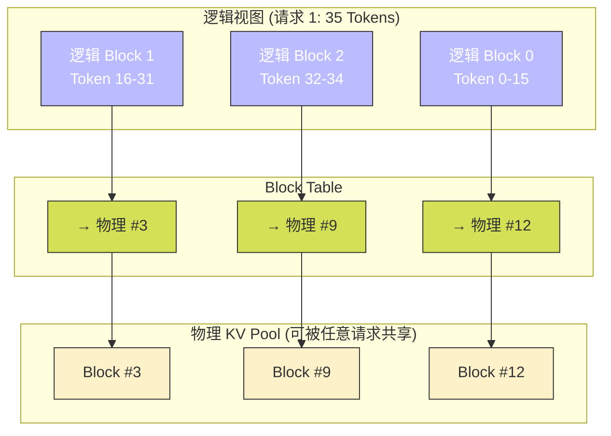
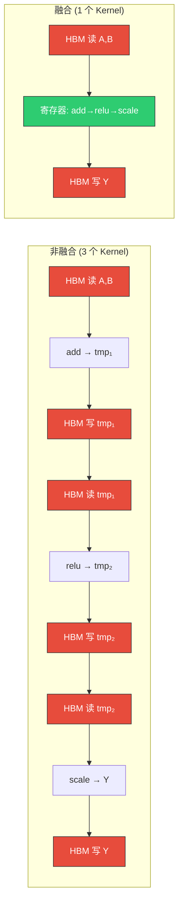
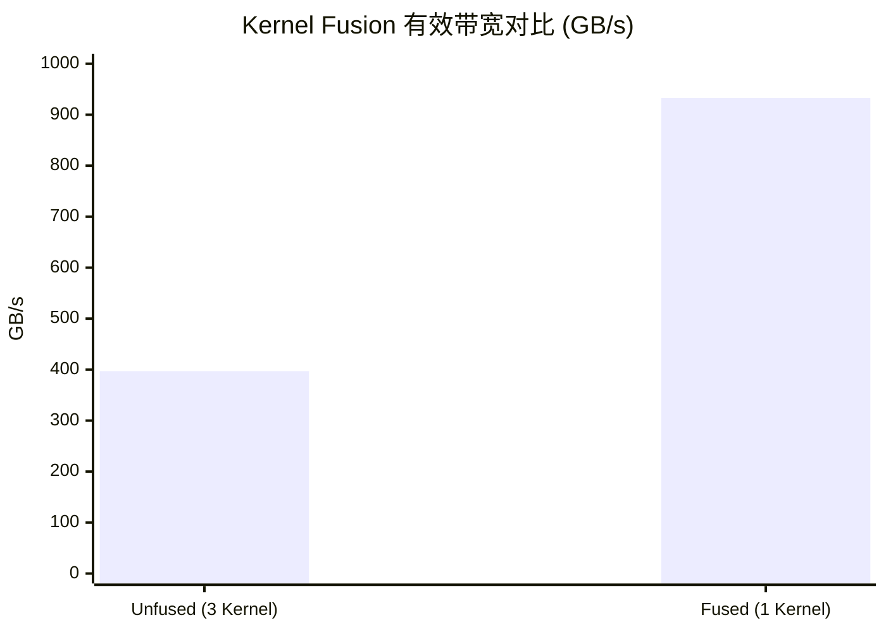

## 楔子：LLM 推理的真正瓶颈不是算力，而是显存

一个 7B 参数的 LLM 推理时，GPU 的计算利用率通常不到 **5%**。原因直击根本：自回归生成（Auto-regressive Decoding）每个 step 只产出 **1 个 Token**，Batch Size = 1 时的 GEMM 退化为 **GEMV（向量乘矩阵）**——Arithmetic Intensity 不到 1，极端 Memory Bound。

但更致命的是**系统级**浪费。一个看似简单的 `Y = Scale(ReLU(A + B))` 操作链，PyTorch Eager Mode 会拆成 3 个独立 Kernel，产生 2 个中间张量的 HBM 往返——**有效带宽从 933 GB/s 暴跌至 397 GB/s**。在 KV Cache 管理上，传统方式为每个请求预分配 `max_seq_len` 长度的连续显存，碎片率高达 60%+。而 Static Batching 用 Padding 填齐短请求到最长长度，**67% 的显存被填无效的零**。

这三个系统级病症，对应了三个精准治疗方案：

| 系统瓶颈 | 病症 | 浪费量级 | 治疗方案 |
|:---|:---|:---:|:---|
| **中间张量 HBM 往返** | 非融合 Kernel 序列 | 带宽利用 ~40% | **Kernel Fusion**（算子融合） |
| **KV Cache 显存碎片** | 连续预分配内存 | 碎片率 ~38% | **PagedAttention**（分页注意力） |
| **Padding 无效计算** | 静态批处理对齐 | 浪费 ~68% 显存 | **Continuous Batching**（连续批处理） |

---

## 第一性原理与访存数学

### 一、算子融合：消灭中间张量的访存代数

以 `Y = Scale(ReLU(A + B))` 为例，对 $N$ 个元素（每元素 4B）进行量化分析：

**非融合版本**（3 个独立 Kernel）：

| Kernel | 读取 | 写入 | HBM 搬运量 |
|:---|:---|:---|:---:|
| `add_kernel` | $A$, $B$ | $tmp_1$ | $3N \times 4B$ |
| `relu_kernel` | $tmp_1$ | $tmp_2$ | $2N \times 4B$ |
| `scale_kernel` | $tmp_2$ | $Y$ | $2N \times 4B$ |
| **总计** | | | $\mathbf{7N \times 4B}$ |

**融合版本**（1 个 Kernel）：

| Kernel | 读取 | 写入 | HBM 搬运量 |
|:---|:---|:---|:---:|
| `fused_kernel` | $A$, $B$ | $Y$ | $3N \times 4B$ |

$$\text{融合加速上界} = \frac{7N}{3N} = 2.33\times$$

实测 2.35×——**与理论几乎完美吻合**。多出的 0.02× 来自融合 Kernel 不需要 3 次 Kernel Launch 的 CPU 开销（每次 ~1-5 µs）。

### 二、PagedAttention：操作系统的虚拟内存搬进 GPU

传统 KV Cache 为每个请求预分配 `[max_seq_len, num_heads, head_dim]` 的**连续显存**。当请求实际只有 35 个 Token 时，剩余 2013 个 Token 的空间（2013 × `num_heads` × `head_dim` × 2 × 4B）全部闲置。

$$\text{碎片率}_{\text{naive}} = 1 - \frac{\sum_{i} \text{actual\_len}_i}{N_{\text{batch}} \times \text{max\_len}} \approx 38\%$$

PagedAttention 将 KV Cache 切分为固定大小的 **Block**（如 16 Tokens）。物理显存不连续，通过 **Block Table** 做逻辑-物理映射：



碎片仅发生在每个请求的最后一个 Block 内部（平均浪费 $\text{block\_size}/2$ 个 Token），碎片率降至 $< 4\%$。

### 三、Continuous Batching：把 Padding 的坟地变成良田

Static Batching 的 $\text{pad\_to\_max}$ 策略：128 个请求，最长 1024 Token，即使平均长度只有 328 Token——

$$\text{Static 总 Token 量} = 128 \times 1024 = 131{,}072$$
$$\text{实际有效 Token 量} = \sum_{i=1}^{128} \text{len}_i \approx 41{,}959$$
$$\text{Padding 浪费率} = 1 - \frac{41{,}959}{131{,}072} = 67.99\%$$

Continuous Batching 将所有有效 Token 紧凑打包为 1D 张量 `packed_tokens[total_tokens]`，用 `cu_seqlens` 数组（累积序列长度偏移）记录每个请求的边界。

---

## 核心优化演进与工业级应用映射

### 算子融合的硬件本质

算子融合之所以有效，是因为中间结果（如 `tmp_1`、`tmp_2`）在融合 Kernel 中**驻留在寄存器**，而非被写回 HBM 再读回。GPU 寄存器访问延迟 ~1 cycle，HBM 访问延迟 ~600 cycles——**600 倍的延迟差距**。



### PagedAttention 与 vLLM 的工程价值

PagedAttention 的**性能代价**是 Attention Kernel 内部需要通过 Block Table 做一次**间接寻址**：

```cpp
// 传统直接寻址
float k_val = k_cache[batch_idx * max_len * head_dim + token_idx * head_dim + d];

// PagedAttention 间接寻址
int physical_block = block_table[batch_idx * max_blocks + token_idx / BLOCK_SIZE];
int block_offset = token_idx % BLOCK_SIZE;
float k_val = k_pool[physical_block * BLOCK_SIZE * head_dim + block_offset * head_dim + d];
```

多出的 `block_table` 查表和除法/取模运算导致 Kernel 慢 ~22%（0.37ms → 0.45ms）。但节省的 38% 显存允许并发 Batch Size 提升 ~1.6×——**在 QPS（每秒查询数）层面反而大幅提升**。

---

## 源码手术刀：关键代码深度赏析

### 一、算子融合 Kernel

```cpp
// 非融合版本：3 个独立 Kernel，2 个中间张量
add_kernel<<<grid, block>>>(tmp1, A, B, n);       // 读 A,B → 写 tmp1
relu_kernel<<<grid, block>>>(tmp2, tmp1, n);       // 读 tmp1 → 写 tmp2
scale_kernel<<<grid, block>>>(Y, tmp2, scale, n);  // 读 tmp2 → 写 Y
// HBM 总搬运量 = 7 × N × 4B

// 融合版本：单 Kernel，零中间张量
__global__ void fused_add_relu_scale(float* Y, const float* A,
                                      const float* B, float scale, int n) {
    int tid = blockIdx.x * blockDim.x + threadIdx.x;
    if (tid < n) {
        float val = A[tid] + B[tid];           // 寄存器计算
        val = val > 0.0f ? val : 0.0f;         // ReLU in register
        Y[tid] = val * scale;                  // Scale in register → 直接写出
    }
}
// HBM 总搬运量 = 3 × N × 4B（缩减 57%）
```

**关键洞察**：融合 Kernel 的三步操作全部在**同一个线程的寄存器空间**完成，不需要 Shared Memory、不需要 `__syncthreads()`、不需要多余的 HBM 访问。这就是逐元素（Element-wise）算子融合的本质——**把 HBM 往返替换为寄存器内计算**。

### 二、Continuous Batching 的 Varlen 索引

```cuda
// packed_q: [total_tokens, num_heads, head_dim] — 所有请求紧凑拼接
// cu_seqlens: [0, len₀, len₀+len₁, ..., total_tokens] — 累积偏移

int token_idx = blockIdx.x * blockDim.x + threadIdx.x;
if (token_idx >= total_tokens) return;

// 确定当前 Token 属于哪个请求
int batch_idx = 0;
while (batch_idx < batch_size && token_idx >= cu_seqlens[batch_idx + 1])
    batch_idx++;

// 请求内的局部位置（用于 Position Encoding 和 Causal Mask）
int local_pos = token_idx - cu_seqlens[batch_idx];

// 直接计算——无 Padding、无无效分支
float q_val = packed_q[(token_idx * num_heads + head_idx) * head_dim + d];
```

**工程细节**：`cu_seqlens` 的线性查找在 batch_size 较大时可替换为二分查找（`upper_bound`）。FlashAttention-2 的 Varlen API 正是基于此 `cu_seqlens` 接口。

---

## 理论与实际的对决：极限剖析

> **测试环境**：NVIDIA GeForce RTX 4090 × 2（sm_89），Linux，nvcc -O3 -std=c++17
> **理论峰值**：HBM 带宽 ~1008 GB/s

### Kernel Fusion（134M 元素，512 MB 单张量，链路 Add→ReLU→Scale，50 次平均）

| 版本 | Kernel 时间 (ms) | 有效带宽 (GB/s) | 加速比 |
|:---|:---:|:---:|:---:|
| 非融合序列 (3 Kernel) | 4.06 | 397 | 1× |
| **融合 Kernel** | **1.73** | **933** | **2.35×** |



**理论验证**：非融合搬 $7 \times 512\text{MB} = 3584\text{MB}$，实测带宽 = $3584/4.06 = 883\text{GB/s}$（接近物理极限）。物理带宽不是瓶颈，**有效带宽**才是——非融合版本 57% 的搬运量是中间张量的无效往返。融合后仅搬 $3 \times 512\text{MB} = 1536\text{MB}$，有效带宽 = $1536/1.73 = 888\text{GB/s}$，物理带宽保持在理论 88%。

### KV Cache（Batch=32，Heads=16，Head_Dim=64，Max_Len=2048，Block_Size=16，100 次平均）

| 版本 | Kernel (ms) | 显存占用 (MB) | 带宽 (GB/s) | 并发能力 |
|:---|:---:|:---:|:---:|:---|
| Naive (静态连续) | 0.37 | 512 | 898 | 基准 |
| **PagedAttention** | **0.45** | **318 (-38%)** | 735 | **~1.6× Batch** |

### Continuous Batching（Batch=128，Max_Len=1024，Heads=32，Head_Dim=128，100 次平均）

| 版本 | Kernel (ms) | 显存 (MB) | 有效 Token 处理 | 并发上限 |
|:---|:---:|:---:|:---:|:---|
| Static Padding | 1.52 | 4096 | 131K (含 68% 废 Token) | 基准 |
| **Varlen Packed** | **1.69** | **1311 (-68%)** | **42K (100% 有效)** | **~3.1× 请求** |

**核心洞察**：Kernel 层面 PagedAttention 慢 22%、Continuous Batching 慢 11%——但在**系统层面**，省下的显存可以容纳更多并发请求，总 QPS(Query Per Second) 大幅提升。**推理优化的度量指标不是单 Kernel 耗时，而是单卡可服务的并发请求数**。

---

## 架构师视角的总结

### 铁律一：推理优化 = 显存优化

LLM 推理的瓶颈不在 TFLOPS，而在 **GB（显存容量）** 和 **GB/s（显存带宽）**。Kernel Fusion 解决"有效带宽"问题（减少无效搬运），PagedAttention 解决"显存碎片"问题（提高利用率），Continuous Batching 解决"显存浪费"问题（消除 Padding）。三者的共同目标：**让每一字节的显存都在做有用的工作**。

### 铁律二：单请求延迟 vs 系统吞吐——推理引擎选择后者

PagedAttention 让单请求慢了 22%，但让系统能服务 1.6× 更多并发请求。Continuous Batching 让单 Kernel 慢了 11%，但让系统能服务 3.1× 更多请求。**在工业部署中，QPS 比 Latency 重要**——只要延迟在 SLA 允许范围内，最大化吞吐才是降低单 Token 推理成本的关键。这就是 vLLM、TGI 等引擎的核心设计哲学。

### 铁律三：算子融合是所有 Memory Bound 算子的通用优化

不仅 `Add+ReLU+Scale`，所有逐元素操作链（如 LayerNorm + Dropout + Residual Add、GELU + Bias）都可以融合。FlashAttention 把整个 Attention（$QK^T$ → Softmax → $PV$）融合为一个 Kernel，从概念上是同一种思想的极致应用——**减少 HBM 访问次数** = 性能提升。
