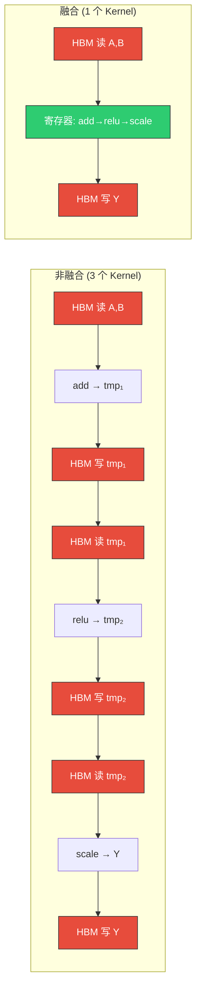
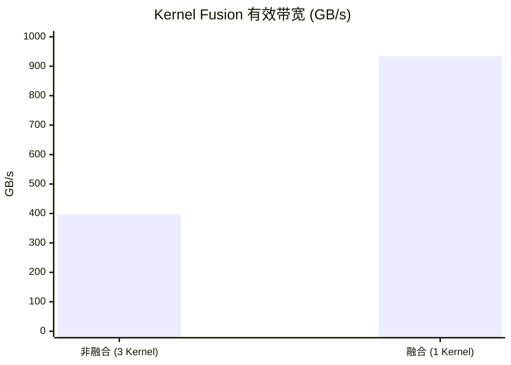
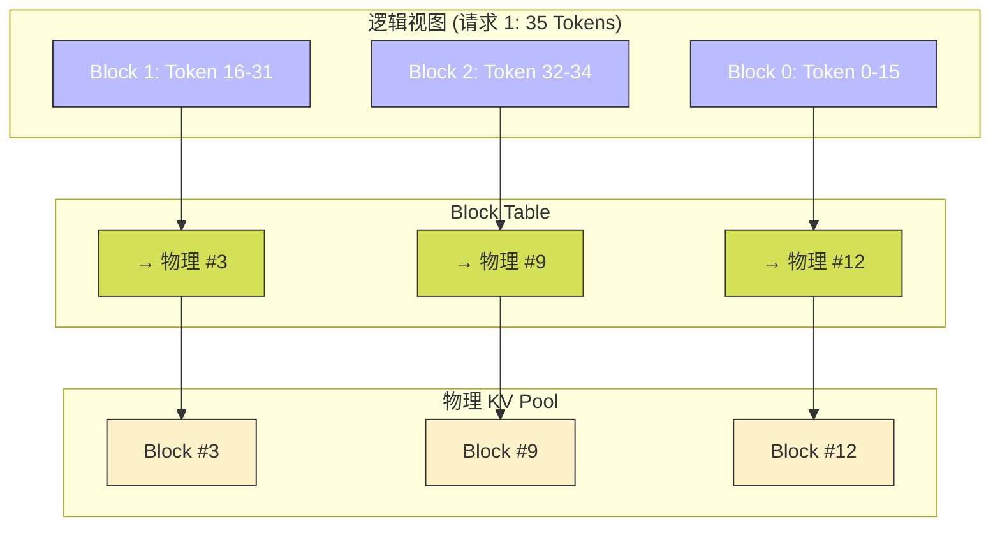

> 📖 **前置阅读**：05_LLM_Ops（Softmax/LayerNorm 算子）、08_Advanced（PyTorch Extension）
> 📖 **推荐后续**：12_Standard_Libraries（cuBLAS 在推理中的角色）

一个 7B 参数的 LLM 推理时，GPU 计算利用率通常不到 5%。自回归生成每个 step 只产出 1 个 Token，Batch Size=1 时 GEMM 退化成 GEMV——算术强度不到 1，极端 Memory Bound。

但更致命的是系统级浪费。三个问题，三个对策：

| 病症 | 浪费量级 | 对策 |
|:---|:---:|:---|
| 中间张量 HBM 往返 | 带宽利用~40% | Kernel Fusion |
| KV Cache 显存碎片 | 碎片率~38% | PagedAttention |
| Padding 无效计算 | 浪费~68% 显存 | Continuous Batching |

---

## Kernel Fusion：消灭中间张量

以 `Y = Scale(ReLU(A + B))` 为例，$N$ 个元素（每元素 4B）：

非融合版（3 个 Kernel）总搬运量 = $7N \times 4B$。融合版（1 个 Kernel）= $3N \times 4B$。理论加速上界 = $7/3 = 2.33\times$。



融合的本质：中间结果驻留在寄存器里（~1 cycle），不写回 HBM（~600 cycle）。

```cpp
__global__ void fused_add_relu_scale(float* Y, const float* A,
                                      const float* B, float scale, int n) {
    int tid = blockIdx.x * blockDim.x + threadIdx.x;
    if (tid < n) {
        float val = A[tid] + B[tid];
        val = val > 0.0f ? val : 0.0f;   // ReLU in register
        Y[tid] = val * scale;             // 直接写出
    }
}
```

### 实测（134M 元素，512 MB，50 次平均）

| 版本 | Kernel 时间 | 有效带宽 | 加速比 |
|:---|:---|:---|:---|
| 非融合 (3 Kernel) | 4.06 ms | 397 GB/s | 1× |
| 融合 Kernel | 1.73 ms | 933 GB/s | **2.35×** |



实测 2.35× 与理论 2.33× 几乎完美吻合。非融合版 57% 的搬运量是中间张量的无效往返。

---

## PagedAttention：GPU 上的虚拟内存

传统 KV Cache 为每个请求预分配 `[max_seq_len, num_heads, head_dim]` 的连续显存。请求实际只有 35 Token 时，剩下 2013 个位置全部闲置。

PagedAttention 把 KV Cache 切成固定大小的 Block（如 16 Token），物理显存不连续，通过 Block Table 做逻辑-物理映射——和操作系统的虚拟内存是同一个思路。碎片只发生在每个请求的最后一个 Block 内部（平均浪费 block_size/2 个 Token），碎片率降到 < 4%。



代价是 Attention Kernel 内部多一次间接寻址（通过 Block Table 查物理地址），Kernel 慢 ~22%。但省下的 38% 显存可以容纳更多并发请求——QPS 层面反而大幅提升。

### 实测（Batch=32, Heads=16, Head_Dim=64, Max_Len=2048, 100 次平均）

| 版本 | Kernel | 显存 | 带宽 |
|:---|:---|:---|:---|
| Naive (静态连续) | 0.37 ms | 512 MB | 898 GB/s |
| PagedAttention | 0.45 ms | 318 MB (-38%) | 735 GB/s |

---

## Continuous Batching：消灭 Padding

Static Batching 把 128 个请求 pad 到最长的 1024 Token：

$$\text{Padding 浪费率} = 1 - \frac{41{,}959}{128 \times 1024} = 67.99\%$$

Continuous Batching 将所有有效 Token 紧凑打包为 1D 张量 `packed_tokens[total_tokens]`，用 `cu_seqlens` 记录每个请求的边界。FlashAttention-2 的 Varlen API 就是基于这个接口。

### 实测（Batch=128, Max_Len=1024, 100 次平均）

| 版本 | Kernel | 显存 | 有效 Token |
|:---|:---|:---|:---|
| Static Padding | 1.52 ms | 4096 MB | 131K (含 68% 废 Token) |
| Varlen Packed | 1.69 ms | 1311 MB (-68%) | 42K (100% 有效) |

Kernel 慢 11%，但显存省 68%——可以跑约 3.1× 的并发请求。

---

## 推理优化不看单 Kernel 耗时

这三个优化有个共同特点：PagedAttention 单 Kernel 慢 22%、Continuous Batching 单 Kernel 慢 11%。但在系统层面，省下的显存容纳了更多并发请求，总 QPS 大幅提升。

推理优化的指标不是单 Kernel 耗时，而是**单卡可服务的并发请求数**。只要延迟在 SLA 允许范围内，最大化吞吐才是降低单 Token 推理成本的关键。这就是 vLLM、TGI 等推理引擎的核心设计哲学。

算子融合则是所有 Memory Bound 算子的通用优化——不只 Add+ReLU+Scale，所有逐元素操作链（LayerNorm + Dropout + Residual Add、GELU + Bias）都可以融合。FlashAttention 把整个 Attention 融合为一个 Kernel，是同一思路的极致应用。
