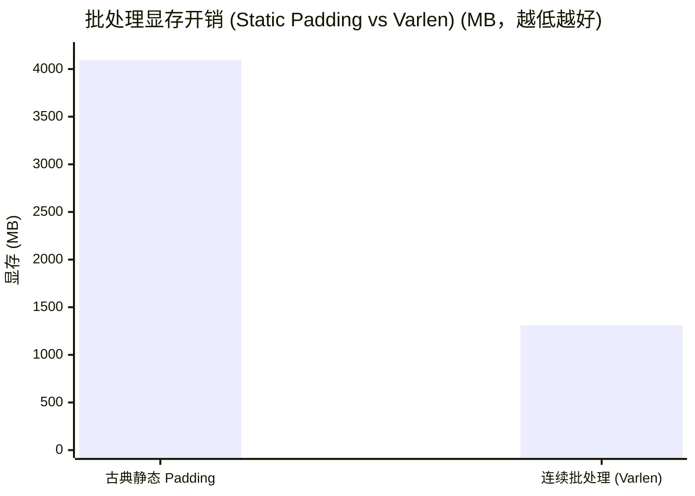

## 楔子：直击痛点 (The Hook & Motivation)

当你成功利用 Tensor Core 把矩阵乘法（GEMM）的速度飙到 330 TFLOPS，满怀信心地去部署大语言模型（LLM）时，现实会给你狠狠一巴掌。
你会发现，GPU 的核心温度连 50 度都不到，风扇甚至懒得转。原本能算天算地的算力怪兽，现在却在“挤牙膏”。

**为什么？**
因为 LLM 推理（尤其是 Decode 生成阶段）根本就不是数学考试，而是一场**极度夸张的后勤搬运灾难**：

1. **Memory Round-trip 灾难**：模型里有无数个像 `Add`、`ReLU`、`Scale` 这样的琐碎小算子。算一次只要 1 纳秒，但把数据从主存读进来再写回去，要 100 纳秒。
2. **KV Cache 显存无底洞**：每一个已经生成的 Token，都会把它的记忆（Key和Value）永久驻留在显存里。而且，由于你不知道用户会聊多长，你只能按最大可能（比如 2048）预先划出一大块连续显存。结果这块地 80% 都是空的，别人也用不了——**内部碎片直接把服务器的并发上限锁死**。
3. **Padding 算力黑洞**：张三问了 10 个词，李四问了 1000 个词。为了把他们拼成一个 Batch 送给 GPU，你不得不用几百个无意义的 `<PAD>` 把张三的数据也强行拉长到 1000。你的 Tensor Core 正在满功率地计算着一堆垃圾 0。

在 `11_Inference_Optimization` 模块中，我们将手撕业界最顶级的 LLM 推理框架（vLLM, TensorRT-LLM）赖以成名的三大基础基石。

---

## 第一战场：算子融合 (Kernel Fusion) - 扼杀中间商赚差价

看看这段经典的 Transformer MLP 结尾逻辑：
$$Y = \text{Scale}(\text{ReLU}(A + B))$$

### 朴素的非融合悲剧

如果你调三次 PyTorch 或 cuBLAS 的底层函数：

1. `Add(A, B -> T1)`：大巴车把 A 和 B 从显存拉到 ALU，算完，**把 T1 写回显存**。
2. `ReLU(T1 -> T2)`：大巴车又跑一趟，把 T1 取出来，抹掉负数，**把 T2 写回显存**。
3. `Scale(T2 -> Y)`：大巴车第三次出发，把 T2 取出乘以系数，**写回 Y**。

**架构师的诊断**：算力单元等得想撞墙！这个过程的“带宽有效转化率”极低。

### 融合魔法：一波流带走

我们打开 `02_kernel_fusion/kernel_fusion.cu`：

```cpp
__global__ void fused_add_relu_scale(CPFloat a, CPFloat b, PFloat output, CFloat scale) {
    int idx = blockIdx.x * blockDim.x + threadIdx.x;
    // 数据拉入极速的 Registers（寄存器）
    float sum = a[idx] + b[idx];         // Add
    float activated = fmaxf(sum, 0.0f);   // ReLU
    // 全程在寄存器内流转，直到最终结果才落盘到 Global Memory
    output[idx] = activated * scale;      // Scale
}
```

### 极限对决 (RTX 4090, 512MB 载荷)

| 执行流 | 实际执行耗时 | 带宽利用特征 | 战果 |
| :--- | :--- | :--- | :--- |
| **非融合序列** | 4.06 ms | 396.79 GB/s | 被无意义的中间态读写拖垮 |
| **融合 Kernel** | **1.73 ms** | **932.85 GB/s** | **提速 2.35 倍，物理带宽逼近硬件极限** |

**洞察**：Fusion 是所有推理引擎（如 TensorRT）做图层优化的第一步。甚至后来的 FlashAttention，本质上也是一种极端复杂的 IO-Aware 算子融合。

---

## 第二战场：PagedAttention - 借鉴 OS 的虚实内存革命

在 LLM 生成时，最恐怖的资源不是算力，而是 **KV Cache** 的显存常驻占用。
传统的动态大小数组在 GPU 层面极难管理，所以早期的框架极度暴力：来一个请求，直接在显存里给它 `malloc` 出一块连续的、足够装下 `max_seq_len` 的大空地。
如果用户只说了“你好”就跑了，剩下的 2000 个位置全部浪费。这种现象叫 **内部碎片 (Internal Fragmentation)**。

### 操作系统教给 vLLM 的解法

在 `01_kv_cache/kv_cache.cu` 中，我们手写了一个微缩版的 `PagedAttention` 机制：

1. **分块切割**：不再要连续的几千个空位，而是把显存切成无数个微小的物理块（比如每个块只装 16 个 Token）。
2. **虚拟映射表 (Block Table)**：请求逻辑上觉得自己的序列是连续的 `[0,1,2...100]`，但在物理底层，这些数据被散装分发到了显存的各个角落，并通过一张 `block_table` 记录映射关系。

```cpp
// 核心指针解引用逻辑 (PagedAttention 的灵魂代价)
int logical_block_idx = i / block_size;
int physical_block_idx = block_table[batch_idx * max_blocks_per_seq + logical_block_idx];

// 以物理地址去取数据。极其类似 CPU 的 MMU 页表查找！
float* k_block = k_blocks[physical_block_idx];
```

### 商业价值碾压 (RTX 4090, Batch=32)

| 架构 | 预估显存占用 | 执行耗时 | 诊断 |
| :--- | :--- | :--- | :--- |
| Naive (连续全分配) | 512 MB | 0.37 ms | 虽然快了一丢丢，但碎片直接把显存吃干抹净 |
| **PagedAttention** | **317 MB** | **0.45 ms** | **用 20% 的微弱耗时代价（指针寻址），换回了近 40% 的海量显存！** |

**洞察**：在云端服务器部署中，省下来的 40% 显存意味着你可以多接客（更大的 Batch Size），这种吞吐量的提升对算力租用的商业模式是决定性的。

---

## 第三战场：Continuous Batching - 填补序列长短的鸿沟

在真实的网络请求中，用户的序列长度分布是极度不平的：有人发 10 个词，有人发 1000 个词。
在**静态批处理 (Static Batching)** 时代，GPU 要求所有的张量必须是完美的矩形，这就意味着必须强行用 `<PAD>` 把 10 个词拉长到和 1000 完全一样。

### 把二维矩形强行“踩扁”

看 `03_dynamic_batching/dynamic_batching.cu` 是如何粉碎这种浪费的。
我们放弃了传统的 `[Batch, SeqLen, Dim]` 这块带有大量孔洞的奶酪，直接把它压扁成一根实心的火腿肠：`[Total_Valid_Tokens, Dim]` (**Var-len Packed Tensor**)。

```cpp
// 传入前记录每个请求的偏移量 [0, len0, len0+len1, ...]
// Kernel 内不再有循环最大长度的浪费代码！
for (int token_idx = start_token_idx; token_idx < end_token_idx; ++token_idx) {
    // 每一个运算都是货真价实的用户数据（有效 Token）
    int kv_idx = token_idx * (num_heads * head_dim) + head_idx * head_dim + tid;
    acc += (q_val * key[kv_idx]) * value[kv_idx];
}
```

### 显存杀手对比测试 (RTX 4090, Batch=128 长尾倾斜分布)



| 策略 | 显存占用 | Kernel 耗时 | 结局 |
| :--- | :--- | :--- | :--- |
| **古典 Padding** | 4096.00 MB | 1.52 ms | OOM 的罪魁祸首 |
| **Continuous Batching** | **1311.22 MB** | 1.69 ms | **暴减 68% 显存浪费。多出 3 倍并发服务能力！** |

这里 Kernel 时间反而长了一点点，是因为传统的 Attention 在内部会加一个 `if (is_pad)` 分支跳过废料计算。但别忘了，**那 4GB 的废料你还是得通过 PCI-E 从 CPU 拷到 GPU 显存里去**。这种物理容量和总线带宽的挥霍，是现代推理绝对无法容忍的。

---

## 架构师的终局视角 (Architect's Takeaway)

如果你认真读完了从 `04_GEMM_Optimization` 一路走来到 `11_Inference_Optimization` 的文章，你应该能体会到 CUDA 优化的脉络正在发生剧烈的变化：

1. **从算力优化走向系统调度**：我们不再仅仅盯着 `FMA` 能一秒钟打多少次，而是像操作系统的架构师一样，去管内存的分页映射（PagedAttention），去调度变长的任务（Continuous Batching）。
2. **用计算换显存**：在 LLM 时代，显存（容量 + 带宽）是绝对的话事人。即使 Paged 指针解引用会导致 Kernel 慢 20%，只要能多挤出显存来加大 并发 Batch，最终的总 TPS 依然是赢的。
3. **软硬件协同设计**：TensorRT-LLM 这类框架的底层，跑的其实就是上述三种代码的极度工业级加强版。理解了这些，你就彻底揭下了现代大模型部署外衣上那层神秘的面纱。
