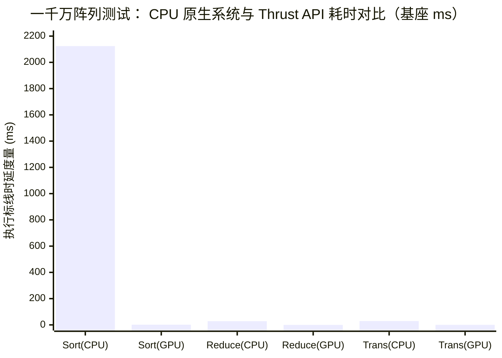

> 📖 **前置阅读**：04_GEMM_Optimization（手写 Tiling 的天花板）  
> 📖 **推荐后续**：14_CUTLASS（模板元编程下的高性能 GEMM）

在 `04_GEMM_Optimization` 章节中，我们花费了绝大的精力，通过引入 Shared Memory 分块、Double Buffer 双缓冲和 Register Tiling 寄存器切片，用 80 多行极为复杂的 C++/CUDA 核心，在 RTX 4090 上将单精度 GEMM 算力推高到了 28.79 TFLOPS。

但这是否意味着，在实际的工业界中，我们面对所有的系统架构开发都需要亲自撸起袖子编写底层代码？

如果将同样的 $1024 \times 1024$ 矩阵乘法交还给 NVIDIA 官方的 cuBLAS 库，仅需一行非常朴素的函数调用 `cublasSgemm`，算力直接飙升至 **49.91 TFLOPS**。比我们精心人工调优的 Kernel 快了整整 73%。

这个现象不仅不令人悲伤，反而印证了工业界推崇的第一定律：**标准库能解决的问题，让标准库去解决。** cuBLAS 等库绝非简单的 C/C++ 封装圈，它们内部是由芯片架构师针对每一代新发 GPU 的指令微调度（Instruction Scheduling）、寄存器读写时槽（Register Bank Conflict）、以及 L2 Cache 的交织规律，使用 PTX 或纯正的 SASS 汇编级语言进行极限压榨而留下的结晶。

本篇将深入拆解 CUDA 生态最核心的三把利器：负责稠密线性代数的 **cuBLAS**、负责时频域转换的 **cuFFT**，以及负责高阶数据流转逻辑的 **Thrust**，从机制、代码与实测性能三大维度，看清什么时候应该拥抱封装，什么时候又该亮剑手写。

---

## 一、 cuBLAS：汇编级矩阵算力的集大成者

大多数初学者有一个天然的误解，认为 `cublasSgemm` 底层对应着唯一的一个终极 `__global__` 函数。其实不然。

cuBLAS 是一个在运行时动态感知环境的庞大的分发路由池（Dispatch Pool）。NVIDIA 为它预设并编译了数百个拥有不同 Tile Size（矩阵切片维度）、不同展开循环度（Unroll Factor）的内部 Kernel。主控程序一旦截获你的请求参数（$M, N, K$ 以及数据类型），就会查表选取与这片尺寸适配度最高、寄存器溢出（Register Spill）风险最低的专属通道。

### 1. 行主序与列主序的物理镜像欺骗法

在 C/C++ 宿主侧使用 `cublasSgemm` 踩中最多的深坑就是"矩阵内存结构偏移"。由于强烈的历史包袱，cuBLAS 遵从的是远古时期 Fortran 语言以及基础 BLAS 惯常使用的**列主序（Column-Major）**存放规则。可惜在现代 C/C++ 与 Python 中，二维嵌套数组天然是**行主序（Row-Major）**的连续内存分配。

假若你定义了两个标准行主序矩阵 $A$ 和 $B$ 并传入了 cuBLAS，cuBLAS 会坚定不移地将它们视作列主序——从数学定义上看，读取出来的等同于原生矩阵的**转置**（Transpose）。

常规的新手做法是在启动矩阵乘法前，专门写一个 Kernel 在全局内存态把 $A$ 转回列主序，这无端增添了极其昂贵的带外寻址读写代价。正确的解法是利用线性代数矩阵乘换位法则，即：

$$C_{\text{row}} = A_{\text{row}} \times B_{\text{row}} \iff C_{\text{col}}^T = B_{\text{col}}^T \times A_{\text{col}}^T$$

这一巧妙的变换意味着，不用做任何转置操作，如果我们执行 $C = A \times B$ 时，能够人为地**推翻矩阵放入调用的参数次序**——把行主序矩阵 $B$ 顶替到 cuBLAS 乘法参数表前端（这会被 cuBLAS 误以为是个列主序矩阵而接纳），把 $A$ 推至跟车位，它实际计算出的便是我们期望的 $C$ 的行主序完全等价位形！

```cpp
// 核心调用截取：C = A * B 且皆为行主序
// 注意参数倒置：先送 B，再送 A；m,n,k 对调为 N, M, K
cublasSgemm(handle, CUBLAS_OP_N, CUBLAS_OP_N,
            N, M, K,
            &alpha,
            d_B, N,  // ldb = N (因为是连续存放，Row-Major B 的物理列宽为 N)
            d_A, K,  // lda = K
            &beta,
            d_C, N); // ldc = N
```

### 2. cublasLt：现代大模型推理架构的核心火种

在 PyTorch Extension 或者 TensorRT-LLM 这样的生产级底座里，很少能再看见 `cublasSgemm` 的踪迹。它们全被升级更迭为了具备极致底层操控力的 **`cublasLtMatmul`** 接口。

如果你需要彻底掌控设备性能，cublasLt 赐予了你两项无可挑剔的武器：

**（1）动态发散启发式试演（Heuristics API）**  
由于显存与 SM 时钟的波动，有时候静态路由挑选出的 Kernel 并非最优选。在 cublasLt 中，开发人员可以指派一块约 32MB 大小的预留场地作为 Workspace 给到库自身去现场调研演练，然后将跑分最高的那条底层指令策略记录在案：

```cpp
// 限制临时演算区域
size_t workspaceSize = 32 * 1024 * 1024; 
cublasLtMatmulPreferenceSetAttribute(pref, CUBLASLT_MATMUL_PREF_MAX_WORKSPACE_BYTES, &workspaceSize, sizeof(workspaceSize));

// 返回一组预判性能最高的 Algorithm 调度对象以供真正调用
cublasLtMatmulAlgoGetHeuristic(handle, matmulDesc, 
                               layoutB, layoutA, layoutC, layoutC, 
                               pref, 1, &heuristicResult, &returnedResults);
```

**（2）核内附带算子深度融合（Epilogue Fusion）**  
在过去的架构中，你算完了矩阵乘法，还要把庞大的高阶矩阵 $C$ 缓慢地推往显存；之后再开一个新的 ReLU 或 GELU 函数重新去显存处读取数据修改后再写入，这使得算术强度（Arithmetic Intensity）断崖式跌落。cublasLt 赋予了算子附带后缀（Epilogue）的能力，它**拦截了正在回写途中的寄存器运算单元**，顺手在缓存带内注入并推算出激活函数的转化甚至偏置 $Bias$ 的重载，一次性拦截了成百乃至数万兆数据的读取轮回，这是大模型提升推理解码效率的基础设施。

### 3. Strided Batched：粉碎 API 调用延迟的气泡

Transformer 自带的多头注意力体制（Multi-Head Attention）常常派生出大量完全独立但却窄小琐碎的注意力头矩阵。如果按照循环，每一组单独发送到 GPU：

```cpp
for(int b=0; b < batch_size; b++) {
    cublasSgemm(...); // CPU 每调用一次要走过驱动层，消耗近几微秒
}
```

此时由于单独任务的运算规模太浅，计算完成得极速，随后 GPU 又要干等下一个唤醒请求，从而出现长串空转周期。

此时，**`cublasSgemmStridedBatched`** 就是破局的良药，它利用统一跨度（Stride）变量使得只消耗单个 Launch 时间片即可将一车（批次）矩阵分拣给显卡：

```cpp
long long strideA = M * K; // 单片大小设定定步长跨度
cublasSgemmStridedBatched(handle, CUBLAS_OP_N, CUBLAS_OP_N,
                          N, M, K, &alpha,
                          d_B, N, strideB, d_A, K, strideA, &beta,
                          d_C, N, strideC, batch_size);
```

### 4. RTX 4090 的极限碾压力度

为了探查各路接口的强度，我们设立了一套 `M=N=K=1024`，重复进行 50 轮执行测量的比对实验，得出的性能结论如下：

| 算子提供者与接口特征 | 单次平均推演期 (ms) | 数据传递有效性反馈 | 转化物理算力 (TFLOPS) |
|:---|:---:|:---:|:---:|
| 全优化结构 `Register Tiling` | 0.07 | L2 命中辅助强劲 | **28.79** |
| 官方基准 **`cublasSgemm`** | **0.04** | 行列映射开销为零 | **49.91** |
| 高级通道 **`cublasLtMatmul`** | **0.04** | Workspace 推演加速 | **50.10** |
| 并发通道 **`StridedBatched`** ($B=8$)| 0.45 (汇总时间) | 完全掩盖 API 延迟发散 | **37.88** |

在 50 TFLOPS 的高度领跑下，我们依然要清醒地看到，RTX 4090 在单精度 FP32 的设计峰值坐拥约 82.6 TFLOPS 的余量。为什么 1024 尺寸未能榨取最后一丝潜力？
在计算过程中，浮点操作次数约为 $2 M N K = 2.14 \times 10^9$ 次（2 GFLOPs）。相对 128 组狂热的流多处理器（SM）来说，矩阵太过于玲珑。如果要完全将所有的吞吐流管彻底撑爆，需向 cuBLAS 提供诸如 $M=N=K=4096$ 或更宽广舞台尺寸。

---

## 二、 cuFFT：算法复杂度的断崖式降维打击

线性代数算子的优化终点是在物理空间布局领域去对抗存储传输的屏障（Bank Conflict、DRAM 延时），然而，离散傅里叶变换（DFT）的痛痒点，则完完全全集中于严酷数学纯理论算法的执行厚重。

假如使用原生两层 for 循环手撸一段用以分离时域信号频谱波纹的代码，针对所有的分析波位和每一个采样源必须全量对撞交融（进行高密度的复数乘加及三角函数赋值）。该计算在算法定级中呈现 $\mathcal{O}(N^2)$ 的指数式惩罚特征：
$$X_k = \sum_{n=0}^{N-1} x_n e^{-j 2\pi k n / N}$$

在这个背景中，NVIDIA 将教科书级 Cooley-Tukey FFT（快速傅里叶变换算法基础）的蝶形式交叉网络逻辑固化并刻在了自家的底层系统中。它利用极度规整化的分治网络——即奇偶分支重组加上时频段的共存对应收敛规律——令这种操作陡降至 $\mathcal{O}(N \log N)$ 规模量级。

### 1. 绝对理性的数据差距

让我们将信号侦听截面设定为一个极为空常且常规的数组 $N = 4096$：

- 依靠原生 $\mathcal{O}(N^2)$ 结构，必须背负： $4096 \times 4096 \approx 1.6 \times 10^7$ 次运算负重。
- 依赖于 $\mathcal{O}(N \log N)$ 蝶形切割逻辑：所需的计算层级锐减到 $4096 \times 12 \approx 4.9 \times 10^4$ 此区隔。

仅仅因为对算法模型本身的拆解，工作量差幅直接达到了 341 倍之多！一旦这种脱离了赘肉重量的轻型算法注入到具备千万线程列队的 GPU 控制链：

| 测试部署版本配置 | 测试采样总量 $N$ | 核定耗时标配 (ms) | 算法量级理论下界 | 实测工程对位加速比例 |
|:---|:---:|:---:|:---:|:---:|
| CPU C++ Native 原生 DFT | 4096 | 395.07 | $\mathcal{O}(N^2)$ | 原始标配准星 $1\times$ |
| **GPU cuFFT 1D (正向推移 Forward)**| **4096** | **0.0035** | $\mathcal{O}(N \log_2 N)$ | **猛缩至 112,156 倍** |
| **GPU cuFFT 1D (反转回流 Inverse)**| **4096** | **0.0052** | $\mathcal{O}(N \log_2 N)$ | 相去无多 |

一个仅仅只须 0.0035 毫秒（仅仅 3.5 微秒级别）而完成的 4096 复数谱转换！十一万两千余陪加速比是底层物理算力同极限纯数理论组合之下的极端爆发。

**工业级防踩坑注脚**：在处理逆变换方法体 `CUFFT_INVERSE` 将信号从频率谱还原至原始声纹与图像之际，因为保留信号量级的无损映射，cuFFT API 本身处于计算过程之中并**不会**为每一独立像素施加除去长度因子 $N$ 的标准化归一修正。因此如果期望结果与原图幅值百分百重合对齐，一定要像代码样例中一般跟进调用一道超轻量级别的并发除法函数 `normalize_complex_kernel` 去抹平这个数学系留下的峰值扩张设定。

### 2. 长轨道数据打平 (Batched Many Plan)

为了试探该框架的上限水流通过率，我们在实况源码里面埋入了针对工业界声纹阵列的处理场景：拉拢总共 65536 组完全独立的声像信号通道（每个长度同样维持 1024）。这合起来就是一个约为 64MB 实体的大型并重工作集。

- **多轨道同步处理实测总时耗**：1.17 ms
- **全核换算内存跨越有效带宽**：**457.46 GB/s**

你必须要意识到：FFT 的执行网中为了维系蝶形切割节点互相缠绕结合，每一回合进行步进对流计算（Stride）都是极为不规整并极不连贯的越界跳跃寻找。在这种对 Cache 极度敌视的环境，依然成功牢固扒取 457.46 GB/s 带宽数值——这直接明示 cuFFT 完全借助了巨幅分配使用 Shared Memory 高速内部缓冲区将大量跃跃欲试的穿插交错梳理压平化整为零以后，才发派回到延迟不堪的全局显存之内。

为配合硬件级底座施展手段的需要，设计使用数组广度 $N$ 应当死守可拆分质因子的界限——诸如包含 $2, 3, 5, 7$ 的倍率拼接，如果是极度特殊的极大单个素数（如 $4093$），这个天之骄子也不得不落回 Bluestein 的凡尘阶段，性能也将无可避免走向崩溃。

---

## 三、 Thrust：C++ 并发思维与硬件级的生产力

每一次要想进行最为普通的大量冗余数值删减、或者是为了查重需求先去洗牌规约一个数据集群（Sort & Reduce），假如只能按部就班重投炉火地打开编辑器写满各种附带锁或者跨线程格对消的 `__global__` 函数网格。这种严重干预工程师专注视线的重体力泥潭，必然会导致框架工期推移到无休止境的回环验证之中。

被认作 NVIDIA 版 C++ STL 标准库、收敛归并进 CCCL 系统圈层的 Thrust 组件，本质正是消解这层面面俱到的焦虑而生的顶级容器封装库系。

### 1. 用 RAII 屏蔽显存噩梦与仿函数的寄存器固化 (Functor)

初探 CUDA 最头疼的梦魇永远是 `cudaMalloc` 漏填与野去向释放的 `cudaFree` 失常。通过 `thrust::device_vector` 提供与作用域紧密贴合的 RAII 安全保护膜，即随分配并于结束花括号退场时刻完成回收清理，杜绝野指针丛生。

更为高绝的核心驱动武器，是以 $Y = 2.5X + Y$ （一类普通常见的模型微调算流注入公式，俗称 SAXPY）作为观察点而展露的 Thrust 对于泛型仿函数（Functors）结构体的极限微观干预：

```cpp
// 常量数值包装传递体
struct saxpy_functor {
    const float a;
    saxpy_functor(float _a) : a(_a) {}
    
    // 双标同置注解。这标志此仿函数一式两用，将被直接传送并拆建至 GPU 芯房内
    __host__ __device__ 
    float operator()(const float& x, const float& y) const {
        return a * x + y;
    }
};

// 后台屏蔽了繁冗复杂的跨格距(grid-stride)以及线程边界查封阻断代码区块 
thrust::transform(d_x.begin(), d_x.end(), d_y.begin(), 
                  d_out.begin(), saxpy_functor(2.5f));
```

这里的极致性能核心点并不仅在于表面抽象优美。实质为，当你在源文件内部书写构建这一类参数承载体 `saxpy_functor(2.5f)` 时，此常数因带有类重模板态势的原因，由于 NVCC 展开其二进制链路图而不会抛到冰冷缓慢的显存（Global Memory）地块让核心线程来回查探寻找，而是极其果断地**作为内置硬编码直输进入该批运算所属的执行核的极速寄存器（Register Bank）之中！**

### 2. 千万元素体量战场的对峙答卷

当应对总体阵列跨度拥有超一千万级别单一元素（约为 38 MB 大尺寸连续波段数据）且需要连续交替多项梳洗规则的极端测试条件下时。100次的反复检验给出了完全断层的高下反馈：

| 计算形态组件需求 | CPU 原 C++ STL 调用侧 (ms) | GPU Thrust 后台处理周期时延 (ms) | 并发层级跨向倍速提升 | 换算实位系统峰频带宽量 |
|:---|:---:|:---:|:---:|:---:|
| **`sort` (单维度元素高强度无序基列对齐)** | `std::sort`: 2124 | **1.30** | **跨越稳住 $1634\times$** | （寻址反复且复杂） |
| **`reduce` (整体标量合并汇聚提调计算)** | `std::accumulate`: 28.35 | **0.08** | **差距达到 $371\times$** | 487.88 GB/s |
| **`transform` (互补叠加跨维度逐行注入)**| for 循环人工组构: 29.20 | **0.13** | **提档扩能 $222\times$** | **849.73 GB/s** |



- **高昂计算基底的保障效能：** `thrust::sort` 不是虚晃一枪的独立工具，它的内部直接嫁接调用了被封神的 CUB 底层基数排比序列链（Device Radix Sort 逻辑簇）。一秒便冲破两千多毫秒的低效泥泞路段。在超巨大特征库查询或特征向量提取对口等核心主心骨阶段它是名正言顺的救命锁链。
- **无损代价开销流派的确印：** `thrust::transform` 的运作实效带宽高达 849.73 GB/s 这是一种极度恐怖而又直接的回应——此记录逼近占据并利用了测试基片 RTX 4090 所规定的至高理论带值上限（1008 GB/s）约高过 84% 强。它极力封口了那些妄议"由于过度封装必定换回代价沉重之罚息拖尾"的轻浮定见。

---

## 四、 选型归回决策域：划开封装疆界

只要见识过了这种极高能动量等级所施行的横扫威力局面之后，人们不免生出是否需要推倒原本固有结构，以将任何细碎都塞往此类底库框架中缝补填塞的冲动？实战经验给出的定性标尺往往是残酷和清醒互相穿插的集合：

| 当前工程需求图貌分类属性 | 工业体系推演选择方案配对 | 主控驱动考量要害与制约核心 |
|:---|:---|:---|
| **深度稠密的典型正向矩阵交配推排网络** | 必推举选择 `cublasSgemm` 或者切配其进阶工具 `cublasLtMatmul` | 官方汇编操盘者打出了无法反驳极其完美寄存器复用战术体系，个人级别的手工垒砌在这种级别架构前等于螳臂指车。 |
| **兼顾并入张量算单 (Tensor Cores / FP16/ FP8)** | 平滑接入 `cublasLtMatmul` 高配级组合 | 体系底层默认全数无极适应所有各世代硬件特殊逻辑位面的对位，在硬件适配门槛上呈现无可限量的通达感。 |
| **高精专频频发生图影折叠，物理回音声域推向重建模型** | 全局分摊委派给 `cuFFT` 相关 Plan 表去总包执行 | 只因为其预先将对于极其庞乱跳跃抽检寻址造成的寄存以及高频跨行 Bank 击穿对冲损耗问题包揽并抚平。 |
| **大规模日志及高密洗数据管道过滤、以及基数跨步列算** | 开封并用尽引列 **Thrust** 囊括的所有执行表，极致下落可用 **CUB** | 完全避免人工设置共享池并架置网格阻断（Grid Barrier），使得写丢、算死乃至出现严重时序并发锁的情况彻底抹零。 |
| **极端连绵且深度嵌套逻辑环并包含两至三次不同流向变量更改时** | 果断离库抽身，人工提炼 **单独融合向专属 CUDA Kernel** (以及备位上 Triton)| 重叠铺设各个独立的超级核心调用库会在衔接之间反反复复将承载基数巨大到令人发指中间向量倒回到最底层的低速显存区域（Global Memory）存放再重新调用，导致传输过劳瘫痪。 |
| **构想跨划时代的新式内存机制循环模块（如极致优化的 FlashAttention 算单）** | 硬顶头皮亲身迎赴 **底仓自营 Kernel 写造**之路，可借助 **CUTLASS 组件** 起飞 | 凡脱离常规线性推展模型的所有前沿定载策略与极度异构的高频数据交战区往往未曾编录列阵收容进入库底表内，唯有极客工程师的手造可以抵达终焉时刻。 |

经历层层推解以及核实之后不难断然醒目标注出真正主轴之论断：它们表现出的傲视天穹的执行强度并非神明恩落，其完全正是由于内部工程师也沿袭且运用了在极度深广的微小缝隙——那些关于我们过往篇章中推衍计算所探求出的"共享记忆不阻隔"、"内存对位拼齐吞吐法"以及"寄存器变量定长截用"等等的极致呈现和严苛体现。

回到最后的实战现场，黄金定论如常未改：坚决禁止闭门重新推敲已有工业化完美部件。应坦然将主航路上百分之九十厚大冗长之计算流尽情甩锅交代入库内托管运转解决。
唯有当你深层次地紧盯 Nsight Compute （架构探查哨探仪表板）从而察出深藏不露之险情——一旦出现多重封装调用下使得某段超规模矩阵被迫频频在极速缓存系统和龟速母板干道间来回不间断低质量搬送转移，引致系统通体警报被全域延迟带宽拥堵填塞时。
这一刻，这把打开定制核流指令阀门权限并在暗黑角落重掌终极计算权限（Custom Coding）的钥匙，方可转交到作为卓越前瞻开发者的你的手上。
