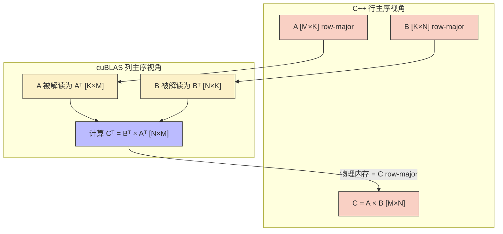
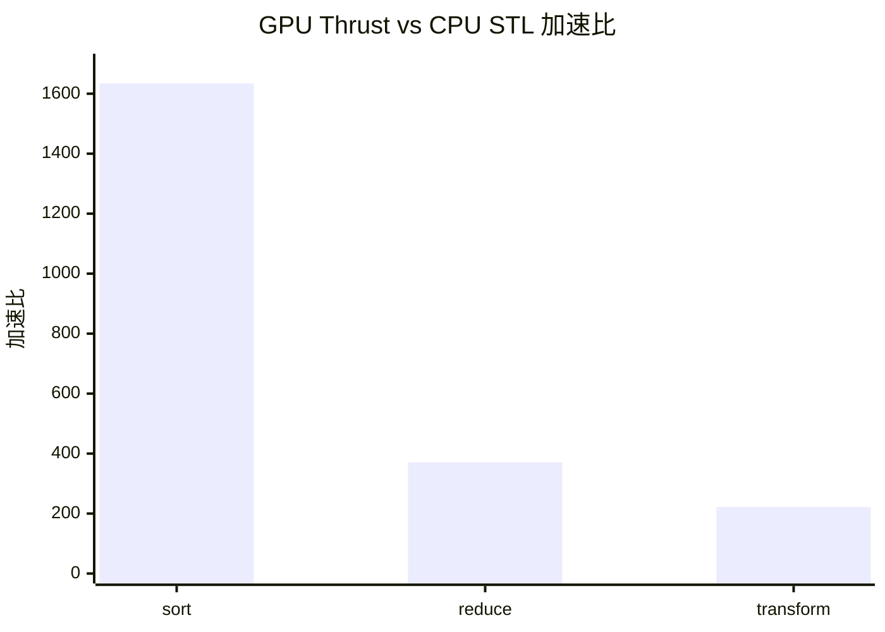

> 📖 **相关阅读**：04_GEMM_Optimization（手写 Tiling 的天花板）、09_Tensor_Core（WMMA 硬件加速）、14_CUTLASS（模板元编程 GEMM）

04_GEMM_Optimization 里 80 多行 Register Tiling 跑出 28.79 TFLOPS。换成 cuBLAS 的 `cublasSgemm`——一行函数调用——**49.91 TFLOPS**。多了 73%。

这个差距不是因为我们写得差。cuBLAS 的核心 Kernel 是用 **PTX/SASS 汇编手工调优**的，针对每代 GPU 的指令调度器时延、寄存器 Bank 冲突、L2 Cache Sector 映射等硅片级细节逐条优化。

结论很简单：标准库能做的事，让标准库做。手写 Kernel 的价值在覆盖库做不了的定制场景。本章实测三个 NVIDIA 标准库。

---

## cuBLAS：几百个预编译 Kernel 的集合

cuBLAS 不是一个 Kernel，而是针对不同矩阵尺寸和数据类型的**数百个**预编译 Kernel 的合集。运行时根据 $(M, N, K)$ 和硬件型号选最优的那个。

### 行主序的转置陷阱

cuBLAS 继承 Fortran BLAS 传统，**默认列主序**。C/C++ 的行主序矩阵传进去后，物理内存布局等价于转置矩阵的列主序形式：

$$C_{\text{row}} = A_{\text{row}} \times B_{\text{row}} \iff C_{\text{col}}^T = B_{\text{col}}^T \times A_{\text{col}}^T$$

所以调用 `cublasSgemm` 时参数顺序必须是 **B 在前、A 在后、维度颠倒**：

```cpp
cublasSgemm(handle,
    CUBLAS_OP_N, CUBLAS_OP_N,
    N, M, K,        // N 在前, M 在后
    &alpha,
    d_B, N,          // B 作为第一输入
    d_A, K,          // A 作为第二输入
    &beta,
    d_C, N);
```



**常见错误**：`lda`, `ldb`, `ldc` 填错。行主序矩阵的 Leading Dimension 是**列数**（不是行数）。

### cublasLt：生产级选择

`cublasLtMatmul` 支持 **FP16/BF16/FP8** 混合精度、内置 Epilogue 融合（`CUBLASLT_EPILOGUE_RELU_AUX_BIAS`），以及启发式算法搜索。TensorRT-LLM、vLLM 等框架全部使用 `cublasLt` 而非 `cublasSgemm`。

### 实测（1024 × 1024，50 次平均）

| API | Kernel (ms) | 算力 (TFLOPS) | 备注 |
|:---|:---:|:---:|:---|
| `cublasSgemm` | 0.04 | **49.91** | **1.73× vs 手写 28.79T** |
| `cublasLtMatmul` | 0.04 | **50.10** | 微幅领先（启发式更优） |
| `StridedBatched` (B=8) | 0.45(总) | 37.88 | 隐藏 8 次 Launch 开销 |

50 TFLOPS / 82.6 TFLOPS = 60.5% 利用率。为什么不到 100%？1024×1024 偏小——cuBLAS 在 $M=N=K=4096$ 以上才能逼近理论峰值。

---

## cuFFT：算法差距 × GPU 并行 = 11 万倍

离散傅里叶变换的暴力实现复杂度 $\mathcal{O}(N^2)$。Cooley-Tukey FFT 把它拆成蝶形运算网络：$\mathcal{O}(N \log_2 N)$。$N = 4096$ 时算法差距 341 倍。GPU 的并行性再放大 ~300 倍，合计就是实测的 **112,000×**。

实用注意点：cuFFT 在 $N = 2^a \times 3^b \times 5^c \times 7^d$ 时性能最优。避免大素数长度（如 $N = 4093$），否则会退化到 Bluestein 算法。

### 实测

| 版本 | 耗时 | 加速比 |
|:---|:---:|:---:|
| CPU 暴力 $O(N^2)$ DFT | 395 ms | 1× |
| **GPU cuFFT $O(N\log N)$** | **0.0035 ms** | **112,156×** |

大规模 Batch 吞吐（Batch=65536, N=1024）：Kernel 1.17 ms，有效带宽 **457 GB/s**。

---

## Thrust：不暴露 CUDA 细节的并行算法

Thrust 是 NVIDIA CCCL（CUDA Core Compute Libraries）的高层接口，底层调用 **CUB** 的手写高性能原语。`thrust::sort` 用的是 CUB 的 `DeviceRadixSort`，`thrust::reduce` 用的是 `DeviceReduce`。

```cpp
struct saxpy_functor {
    const float a;
    saxpy_functor(float _a) : a(_a) {}
    __device__ float operator()(const float& x, const float& y) const {
        return a * x + y;
    }
};

thrust::transform(d_X.begin(), d_X.end(), d_Y.begin(),
                  d_Y.begin(), saxpy_functor(2.0f));
```

Thrust 自动决定 Block/Grid 配置。仿函数通过值传递被发射到 GPU 端——`a` 的值直接嵌入到每个线程的寄存器中。

### 实测（10M 元素，38 MB，100 次平均）

| 操作 | CPU STL (ms) | GPU Thrust (ms) | 加速比 | 有效带宽 |
|:---|:---:|:---:|:---:|:---:|
| `sort` | 2124 | **1.30** | **1634×** | — |
| `reduce` | 28 | **0.08** | **371×** | 488 GB/s |
| `transform` (SAXPY) | 29 | **0.13** | **222×** | **850 GB/s** |



Thrust `transform` 跑出 850 GB/s = 84% 带宽利用率，与手写合并访存 Kernel（925 GB/s）差距仅 8%。

---

## 选型决策表

| 场景 | 选择 |
|:---|:---|
| GEMM / 矩阵运算 | `cuBLAS` / `cublasLt` |
| FFT | `cuFFT` |
| Sort / Reduce / Scan | Thrust / CUB |
| 自定义逐元素融合 | **手写 Kernel**（或 PyTorch Extension） |
| FlashAttention / 自定义 MMA | **手写 WMMA / CUTLASS** |

`cublasSgemm` 是入门接口。`cublasLtMatmul` 才是生产级选择——支持 FP8 量化、Epilogue 融合、启发式搜索。PyTorch 和 TensorRT 的底层矩阵乘已经全面转向 `cublasLt`。

Thrust 的真正价值不只是性能，更是**工程复杂度的降低**。`thrust::device_vector` 自动管理 `cudaMalloc/cudaFree`，`thrust::transform` 替代了手写 grid-stride loop。真到 Thrust 不够快的时候（极少数情况），降级到 CUB 手写原语就行。
