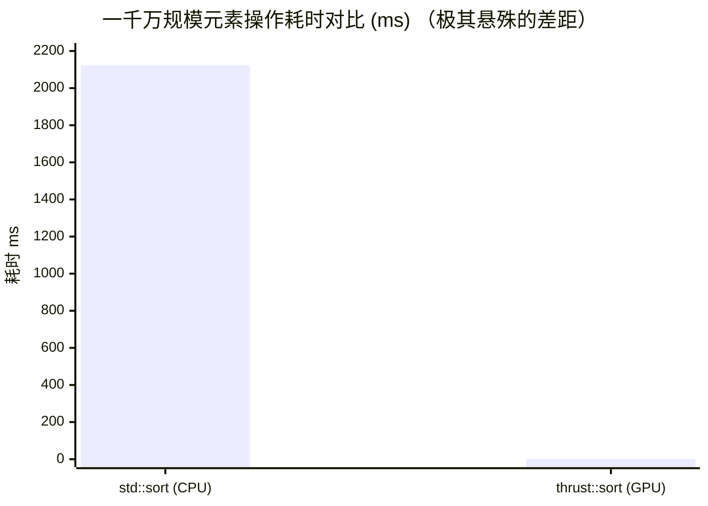

## 楔子：工程实践的“第一准则” (The Engineer's Dilemma)

在经历了前面 11 章手撕 CUDA 的残酷洗礼后，你可能觉得：*“我已经懂得了 Tiling、Shared Memory Bank Conflict、Warp Shuffle 乃至 Tensor Core API，天下无敌，我要手动重写所有的深度学习算子！”*

**请住手！** 在真正的工业界，工程化应用的第一准则永远是：**绝对不要重复造性能轮子。**

NVIDIA 供养着这个星球上最顶尖的底层架构师和汇编语言极客。他们不仅写 C++，而且在关键路径上手写 PTX（并行线程执行指令）甚至 SASS（原生汇编）。他们将这些无法企及的优化，封装成了你电脑里的 `.so` 或 `.dll` 动态链接库。

在 `12_Standard_Libraries` 模块中，我们将拆解科学计算与数据处理领域统治力最强的三座大山：**cuBLAS、cuFFT、Thrust**。重点不是教你怎么调 API，而是**剖析它们内部的底层映射与避坑指南**。

---

## 霸主一：cuBLAS —— 线性计算的绝对权威

cuBLAS 是 NVIDIA 提供的高性能 BLAS (Basic Linear Algebra Subprograms) 库。它是当前所有主流深度学习框架（PyTorch, TensorFlow）最底层的计算基石。

### 数据排布的陷阱：Row-Major vs Column-Major

绝大多数初学者在使用 cuBLAS 时，摔的第一个跟头是数据排布。C/C++ 原生数组是**行主序 (Row-Major)**，但 cuBLAS 继承了古老的 Fortran 传统，是**列主序 (Column-Major)** 的。

如果你直接把 C++ 的矩阵 A 和 B 塞进 `cublasSgemm` 计算 $C = A \times B$，结果必定一塌糊涂。

**架构师的“骗术”：转置公式巧解**
还记得线性代数里的公式吗：$(AB)^T = B^T A^T$

在 `01_cublas_gemm/cublas_gemm.cu` 中，我们并没有傻傻地去写一个 Kernel 把数据翻转一遍，而是直接利用这个数学特性：

1. 我们向 cuBLAS 传入 C++ 下的行主序 $B$。cuBLAS 把它当做是一个列主序矩阵的转置（即 $B^T$）。
2. 我们向 cuBLAS 传入 C++ 下的行主序 $A$。cuBLAS 把它当做 $A^T$。
3. 让 cuBLAS 计算 $B^T A^T$，它得到的结果是 $(AB)^T$，即 $C^T$ 的列主序表示。
4. **奇迹发生**：$C^T$ 的列主序，在物理内存分布上，**正好完全等价于 $C$ 的行主序！**

```cpp
// 传参顺序惊掉下巴：计算 C = A*B，却先传 B 再传 A
cublasSgemm(handle, CUBLAS_OP_N, CUBLAS_OP_N,
            N, M, K, // 维度要反向映射
            &alpha,
            d_B, N,  // 注意 lda/ldb 等步长设置
            d_A, K,
            &beta,
            d_C, N);
```

### 极限性能对比 (RTX 4090，1024x1024 单精度)

我们在 `Result/12_Standard_Libraries.md` 中可以看到惊人的表现：

| 实现方式 | 策略 | 算力榨取表现 (TFLOPS) | 评价 |
| :--- | :--- | :--- | :--- |
| 第 4 章手写极限 | Register Tiling (2D版) | 28.79 TFLOPS | 初学者的天花板 |
| **cublasSgemm** | **黑盒指令级优化** | **49.91 TFLOPS** | **秒杀手写 73%！** |
| cublasLtMatmul | 轻量级、启发式调优搜索 | 50.10 TFLOPS | 未来混合精度的王牌 |

> **什么是 cublasLt？** "Lt" 代表 Lightweight。它是比传统 cuBLAS 更底层、更现代的 API。它的核心能力是**内部融合激活函数 (Epilogue)** 以及支持 FP8 等极低精度计算，极大避免了前一张我们提到的 Memory Round-Trip 访存开销。

---

## 霸主二：cuFFT —— 指数级降维打击

快速傅里叶变换（FFT）将 $\mathcal{O}(N^2)$ 的暴力计算降维到了 $\mathcal{O}(N \log N)$。对于图像频域滤波、信号处理而言，这是降维打击。

在 `02_cufft/cufft_example.cu` 的测试中，面对 4096 个采样点的频域转换，结果震撼到了荒谬的地步：

- CPU 暴力计算耗时：`395.0780 ms`
- cuFFT 强并行耗时：`0.0035 ms`
- **加速比：112156 倍** （没看错，十一万倍）

### cuFFT 吞吐量大考

在真实世界中，FFT 往往不只针对一根信号条，而是大批量的雷达/无线流。
当我们施加 Batch = 65536 的 1024 维数组时：
- 巨量处理时间仅需：`1.17 ms`
- **等效访存带宽：> 457.46 GB/s**（几乎占满了全局显存的高速通道）

> **物理层注意事项**：在进行 IFFT（逆变换）时，纯数学上还需要除以向量长度 $N$（也就是归一化）。**cuFFT 框架故意不提供自动除以 N 的功能**。这是因为在复杂的信号管线中，这步除法可以和后面的其他处理 Kernel 融合，由用户在自己的 Kernel 里执行，以此避免一次没必要的显存写回。

---

## 霸主三：Thrust —— 优雅与狂暴并存的 GPU STL

当你不想为了一个简单的数组求和、排序去从头配置 `cudaMalloc`、写 Kernel、调 Block 维度时，救星就是 Thrust。

它是一套高度仿照 C++ STL (Standard Template Library) 理念设计的库。

### 一行代码的优雅

看看 `03_thrust/thrust_algorithms.cu` 里的代码有多清爽：

```cpp
// 1. 无需手写 cudaMalloc，自动 RAII 设备端分配和释放拷入
thrust::device_vector<float> d_vec = h_input_std_vector;

// 2. 只需要调用与 C++ STL 一模一样的函数名，内部自动多核打散
float gpu_sum = thrust::reduce(d_vec.begin(), d_vec.end());

// 3. 排序？易如反掌
thrust::sort(d_vec.begin(), d_vec.end());
```

### 不要被外表欺骗：狂暴的内核

有工程师误以为“封装得这么高级，必然伴随巨大的框架开销而导致慢”。
这是大错特错的刻板印象。在 1000 万级规模元素的基准测试下：



| 常用操作 | CPU (C++ STL 耗时) | GPU (Thrust 耗时) | 粗暴的加速比 | 底层实测带宽 |
| :--- | :--- | :--- | :--- | :--- |
| **Sort** (`std::sort`) | 2124.06 ms | **1.30 ms** | **1634倍** | - |
| **Reduce** (`accumulate`) | 28.35 ms | **0.08 ms** | **371倍** | 487.88 GB/s |
| **Transform** (SAXPY) | 29.20 ms | **0.13 ms** | **222倍** | **849.73 GB/s** |

尤其是 Transform (即向所有元素应用自定义的数学公式，也就是 SAXPY)。Thrust 底层不仅精准避开了 Bank Conflict，而且能做到极高比例的**内存合并访问 (Coalesced Access)**，它将 4090 的有效带宽榨干到了 **849 GB/s** —— 这已经接近了这块卡纯物理架构的峰值上限！

---

## 终极忠告 (Final Verdict)

在实际的 CUDA 工程架构下，我们的心态应该发生怎样的转变？

1. **库优先法则**：遇到问题，第一反应去查 NVIDIA 官方库 (cuBLAS, cuFFT, cuSPARSE, cuRAND)。有现成的，绝不手写。因为你手写的几乎 100% 跑不过官方团队针对特定硬件微调的指令级代码。
2. **连接孤岛的胶水**：即使你用了无数优秀的官方库，调用库之间必然存在中间变量的产生和传递（Memory Round-trip）。此时，你的核心价值，是凭借前面章节掌握的 **Kernel Fusion 算子融合理念**，将无法成库的“零碎胶水逻辑”塞进一个自定义的 Kernel 里，保护宝贵的总线带宽。
3. **拥抱 Thrust**：告别原始粗犷的指针操作。使用 `device_vector` 提供现代 C++ 的生命周期安全保障，让底层计算专注于计算本身。
