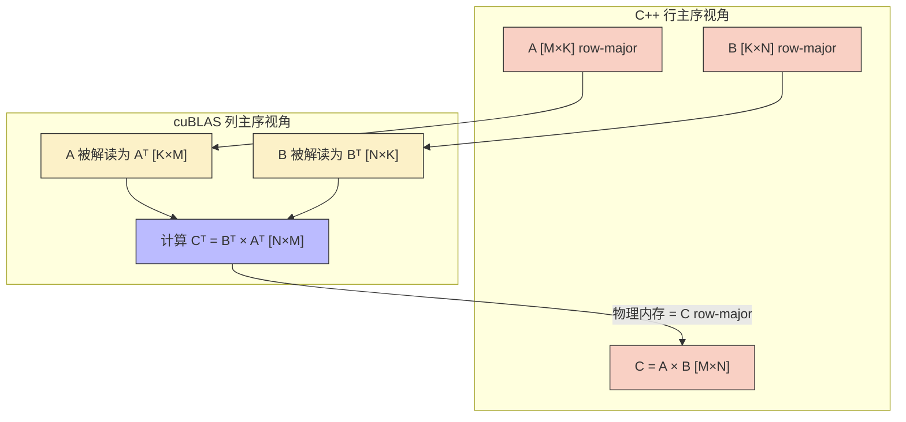
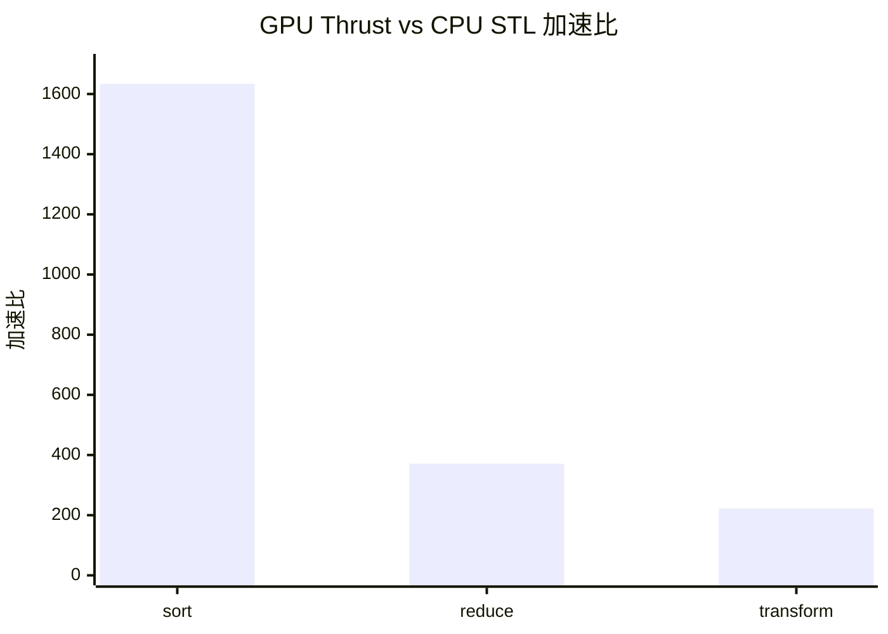

## 楔子：你的手写 Kernel 永远打不过 NVIDIA 的汇编

在 `04_GEMM_Optimization` 中，我们用 80+ 行的 Register Tiling 代码苦战出 28.79 TFLOPS。而 cuBLAS 的 `cublasSgemm`——一行函数调用——跑出 **49.91 TFLOPS**。多出的 **73%** 算力从何而来？

答案是：cuBLAS 的核心 Kernel 不是用 CUDA C++ 写的，而是用 **PTX/SASS 汇编手工调优**的。NVIDIA 的架构师针对每一代 GPU 的指令调度器时延、寄存器文件 Bank 冲突、L2 Cache Sector 映射等硅片级细节，逐条指令优化。这种优化深度是 CUDA C++ 编译器无法企及的。

这引出了 GPU 编程的**第一条工程铁律**：**在标准库能覆盖的场景中，永远不要手写 Kernel**。手写的价值在于覆盖库无法覆盖的**定制场景**（如 FlashAttention、自定义量化算子）。

本章实测三把最核心的 NVIDIA 标准库武器：

| 武器 | 领域 | 核心 API | 性能代差 |
|:---|:---|:---|:---:|
| **cuBLAS** | 线性代数 | `cublasSgemm`, `cublasLtMatmul` | 手写 Kernel 的 **1.7×** |
| **cuFFT** | 频域变换 | `cufftPlan1d`, `cufftExecC2C` | CPU 暴力 DFT 的 **112,000×** |
| **Thrust** | 并行算法 | `sort`, `reduce`, `transform` | `std::sort` 的 **1634×** |

---

## 第一性原理：为什么标准库更快？

### cuBLAS 的三层武器库

cuBLAS 不是一个 Kernel——它是针对不同矩阵尺寸和数据类型的**数百个**预编译 Kernel 的集合。运行时，cuBLAS 会根据 $(M, N, K)$ 维度和硬件型号，通过**启发式算法（Heuristics）** 选择最优 Kernel：

| 规模范围 | 优化策略 | Kernel 特征 |
|:---|:---|:---|
| **Tiny** ($M,N < 32$) | Warp 级 MMA | 单 Warp 计算，零 SMEM 开销 |
| **Small** ($32-256$) | Split-K + Tensor Core | 多 Warp 分 K 维度并行 |
| **Medium** ($256-4096$) | CTA Tiling + TC + Double Buffer | 标准的 CUTLASS-like 多级 Tiling |
| **Large** ($> 4096$) | Persistent Kernel + Stream-K | CTA 持续驻留 SM，动态负载均衡 |

`cublasLtMatmul` 更进一步：它通过 `cublasLtMatmulAlgoGetHeuristic` API 返回多个候选算法，允许用户 benchmark 后选择最优——这就是 **AutoTuning** 的思想。

### cuFFT 的算法复杂度优势

离散傅里叶变换（DFT）的暴力实现：

$$X[k] = \sum_{n=0}^{N-1} x[n] \cdot e^{-j2\pi kn/N}, \quad k = 0, 1, ..., N-1$$

复杂度 $\mathcal{O}(N^2)$。Cooley-Tukey FFT 将其分解为蝶形运算网络：

$$\mathcal{O}(N^2) \rightarrow \mathcal{O}(N \log_2 N)$$

对 $N = 4096$：暴力法 = $16{,}777{,}216$ 次运算，FFT = $49{,}152$ 次——**341 倍算法差距**。GPU 的并行性再放大 ~300 倍，就得到了实测的 **112,000×** 加速。

cuFFT 内部的素数分解策略：$N = 2^a \times 3^b \times 5^c \times 7^d$ 时性能最优，因为这些小素数的蝶形模板已被 SASS 级优化。避免使用大素数长度（如 $N = 4093$），否则 cuFFT 会退化到 Bluestein 算法。

### Thrust 的底层：CUB 原语

Thrust 不是"另一个并行库"——它是 NVIDIA CCCL（CUDA Core Compute Libraries）的高层接口，底层调用 **CUB（CUDA Unbound）** 的手写高性能原语。`thrust::sort` 底层使用 CUB 的 `DeviceRadixSort`，`thrust::reduce` 使用 `DeviceReduce`——这些原语的性能与手写的最优 Kernel 等价。

---

## 核心技术要点与硬件映射

### cuBLAS 行主序与列主序的转置映射

cuBLAS 继承 Fortran BLAS 传统，**默认列主序（Column-Major）**。C/C++ 的行主序矩阵传入 cuBLAS 后，物理内存布局等价于其转置矩阵的列主序形式：

$$C_{\text{row}} = A_{\text{row}} \times B_{\text{row}} \iff C_{\text{col}}^T = B_{\text{col}}^T \times A_{\text{col}}^T$$

因此调用 `cublasSgemm` 时，参数顺序必须为 `(handle, CUBLAS_OP_N, CUBLAS_OP_N, N, M, K, &alpha, d_B, N, d_A, K, &beta, d_C, N)`——**B 在前，A 在后，维度颠倒**。



### Thrust 仿函数的 GPU 执行模型

```cpp
struct saxpy_functor {
    const float a;
    saxpy_functor(float _a) : a(_a) {}
    __device__ float operator()(const float& x, const float& y) const {
        return a * x + y;  // 在 GPU 线程中执行
    }
};

// 一行代码启动并行计算
thrust::transform(d_X.begin(), d_X.end(), d_Y.begin(),
                  d_Y.begin(), saxpy_functor(2.0f));
```

Thrust 内部自动决定 Block/Grid 配置，调用 CUB 的 `DeviceTransform` 原语。仿函数通过值传递被发射到 GPU 端——`a` 的值直接嵌入到每个线程的寄存器中。

---

## 源码手术刀：关键代码深度赏析

### cuBLAS SGEMM 调用（行主序适配）

```cpp
cublasHandle_t handle;
cublasCreate(&handle);

float alpha = 1.0f, beta = 0.0f;

// C = A × B (行主序)
// cuBLAS 视角: C^T = B^T × A^T
// 参数:  (handle, transB, transA, N, M, K, &alpha, B, N, A, K, &beta, C, N)
cublasSgemm(handle,
    CUBLAS_OP_N, CUBLAS_OP_N,  // 不做额外转置
    N, M, K,                    // 注意: N 在前, M 在后
    &alpha,
    d_B, N,        // B 作为第一输入（cuBLAS 视角的 A）
    d_A, K,        // A 作为第二输入（cuBLAS 视角的 B）
    &beta,
    d_C, N);       // 输出的 Leading Dimension = N
```

**常见错误**：`lda`, `ldb`, `ldc` 填错。对于行主序矩阵，Leading Dimension 是**列数**（不是行数）。`A [M×K]` 的 LD = K，`B [K×N]` 的 LD = N。

### cublasLtMatmul 启发式搜索

```cpp
cublasLtMatmulAlgoGetHeuristic(
    ltHandle, matmulDesc, layoutA, layoutB, layoutC, layoutC,
    preference, maxAlgoCount, heuristicResults, &returnedAlgoCount);

// 选择最优算法
cublasLtMatmul(ltHandle, matmulDesc,
    &alpha, d_A, layoutA, d_B, layoutB,
    &beta, d_C, layoutC, d_C, layoutC,
    &heuristicResults[0].algo,  // 使用启发式返回的最优算法
    workspace, workspaceSize, stream);
```

`cublasLtMatmul` 的优势在于支持 **FP16/BF16/FP8** 混合精度、内置 **Epilogue 融合**（如 `CUBLASLT_EPILOGUE_RELU_AUX_BIAS`），以及更灵活的内存布局描述。旗舰级推理框架（TensorRT-LLM、vLLM）全部使用 `cublasLt` 而非 `cublasSgemm`。

---

## 理论与实际的对决：极限剖析

> **测试环境**：NVIDIA GeForce RTX 4090 × 2（sm_89），Linux，nvcc -O3
> **理论峰值**：FP32 ~82.6 TFLOPS，HBM ~1008 GB/s

### cuBLAS GEMM（1024 × 1024，50 次平均）

| API | Kernel (ms) | 算力 (TFLOPS) | vs 手写 Tiling |
|:---|:---:|:---:|:---:|
| `cublasSgemm` | 0.04 | **49.91** | **1.73× vs 手写 28.79T** |
| `cublasLtMatmul` | 0.04 | **50.10** | 微幅领先（启发式更优） |
| `StridedBatched` (B=8) | 0.45(总) | 37.88 | 隐藏 8 次 Launch 开销 |

**50 TFLOPS / 82.6 TFLOPS = 60.5% 利用率**。为什么不到 100%？因为 1024×1024 规模仍然偏小——$2 \times 1024^3 / 82.6T = 26 \mu s$ 的理论最小耗时 vs 实测 40 µs，差距来自 Grid 不够大导致 tail effect 和 L2 Cache 预热。cuBLAS 在 $M=N=K=4096$ 以上规模才能真正逼近理论峰值。

### cuFFT（4096 采样点一维复数 FFT，100 次平均）

| 版本 | 耗时 | 加速比 |
|:---|:---:|:---:|
| CPU 暴力 $O(N^2)$ DFT | 395 ms | 1× |
| **GPU cuFFT $O(N\log N)$** | **0.0035 ms** | **112,156×** |

大规模 Batch 吞吐（Batch=65536, N=1024）：Kernel 1.17 ms，有效带宽 **457 GB/s**。

**加速来源分解**：算法复杂度差异 ~341×（$N^2 / N\log N$），CPU↔GPU 并行性差异 ~329×（128 SM × ~2.6 并发 Warp），合计 ~112K×。

### Thrust 并行算法（10M 元素，38 MB，100 次平均）

| 操作 | CPU STL (ms) | GPU Thrust (ms) | 加速比 | 有效带宽 |
|:---|:---:|:---:|:---:|:---:|
| `sort` | 2124 | **1.30** | **1634×** | — |
| `reduce` | 28 | **0.08** | **371×** | 488 GB/s |
| `transform` (SAXPY) | 29 | **0.13** | **222×** | **850 GB/s** |



**Thrust `transform` 850 GB/s = 84% 带宽利用率**——与手写的合并访存 Kernel（925 GB/s）差距仅 8%。Thrust 在不暴露任何 CUDA 底层细节的前提下，几乎达到了手写 Kernel 的性能上限。

---

## 架构师视角的总结

### 铁律一：优先用库，手写是最后手段

| 场景 | 选择 |
|:---|:---|
| GEMM / 矩阵运算 → | `cuBLAS` / `cublasLt` |
| FFT → | `cuFFT` |
| Sort / Reduce / Scan → | Thrust / CUB |
| 自定义逐元素融合 → | **手写 Kernel**（或 PyTorch Extension） |
| FlashAttention / 自定义 MMA → | **手写 WMMA / CUTLASS** |

### 铁律二：cuBLAS != cuBLASLt

`cublasSgemm` 是入门接口，够用但不灵活。`cublasLtMatmul` 才是生产级选择——它支持 FP8 量化、Epilogue 融合（Bias + GELU in one shot）、和启发式算法搜索。TensorRT 和 PyTorch 的底层矩阵乘全部从 `cublasSgemm` 迁移到了 `cublasLt`。

### 铁律三：Thrust 的真正价值是降低工程复杂度

`thrust::device_vector` 的 RAII 自动管理 `cudaMalloc/cudaFree`，`thrust::transform` 的仿函数替代了手写 grid-stride loop。在原型开发和非性能敏感路径上，Thrust 让 CUDA 编程的心智负担降低了一个数量级。当 Thrust 不够快时（极少数情况），降级到 CUB 的手写原语即可。
