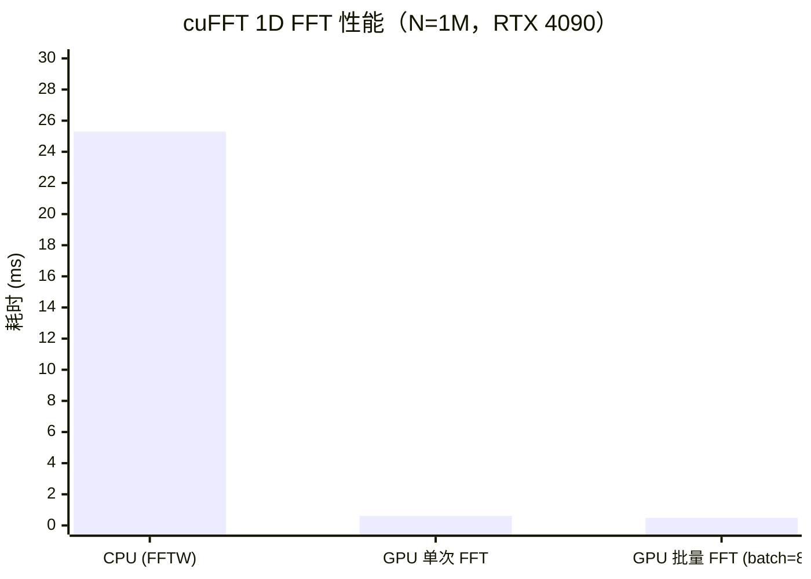

> 📖 **前置阅读**：[04_GEMM_Optimization](04_GEMM_Optimization_Register_Tiling.md)（理解 GEMM 手写优化的复杂性）、[08_Advanced](08_Advanced_CUDAGraphs_Streams_Extensions.md)（CUDA 流与系统开销）
> 📖 **推荐后续**：[14_CUTLASS](14_CUTLASS_TemplateGEMM_CuTe.md)（需要自定义 Epilogue 时的 cuBLAS 替代方案）

在前面的文章里，我们花了大量篇幅手写 GEMM Kernel——从 Naive 到 Tiled 到 Register Tiling，最终在 2048×2048 规模下达到了 cuBLAS 50% 的性能。这段旅程的价值在于建立了对 GPU 内存层次和计算流水线的精确直觉。

但在实际的工程项目中，**绝大多数 GEMM、FFT、排序和归约场景，你应该直接调用 cuBLAS、cuFFT 和 Thrust**。NVIDIA 的库工程师通过 SASS 级汇编调优和架构特定优化，达到了手写 C++ 几乎不可能企及的性能上界。

本文的目标不是重复官方文档，而是聚焦于**三个常见陷阱和容易被忽视的工程细节**：矩阵布局的列主序陷阱、Plan 创建的开销管理、Thrust 的执行策略与 Stream 集成。

---

## 一、cuBLAS：矩阵布局陷阱与批量 GEMM

### 最常见的 Bug：列主序与行主序的混淆

cuBLAS 沿用了 FORTRAN 的传统，内部使用**列主序（Column-Major）**存储。而 C/C++ 数组天然是**行主序（Row-Major）**。这一差异是 cuBLAS 初学者最常踩的坑。

设我们要计算 $C = A \times B$（行主序）：

```cpp
// ❌ 错误写法：直接按照 C = A*B 传参
cublasSgemm(handle,
    CUBLAS_OP_N, CUBLAS_OP_N,  // N = 不转置
    M, N, K,
    &alpha,
    A, M,   // ← 错误：传入了行主序的 A，cuBLAS 会把它当列主序读
    B, K,   // ← 错误
    &beta,
    C, M);
```

正确的做法是利用转置等价关系。在列主序下，行主序的矩阵 $A$ 等价于列主序的 $A^T$。因此：

$$C = A \times B \quad \Leftrightarrow \quad C^T = B^T \times A^T$$

```cpp
// ✅ 正确写法：利用 C^T = B^T × A^T，交换 A/B 顺序，加 CUBLAS_OP_T
// 注意：参数顺序是 (B, A)，不是 (A, B)
cublasSgemm(handle,
    CUBLAS_OP_N, CUBLAS_OP_N,  // 两个矩阵都"不转置"（因为它们已经是转置后的输入）
    N, M, K,                   // 输出 C^T 的尺寸：N×M（注意顺序！）
    &alpha,
    d_B, N,                    // B 在行主序连续排列，cuBLAS 读为 B^T（列主序）
    d_A, K,                    // A 在行主序连续排列，cuBLAS 读为 A^T
    &beta,
    d_C, N);                   // 输出 C^T，但 C^T 在内存中就是行主序的 C
```

这个等价变换的关键在于：行主序的矩阵在内存中的排列方式，与列主序矩阵的转置完全相同。因此，对 cuBLAS 传入"不转置"的 B 和 A（但调换顺序），它实际上计算的是"列主序下的 $B^T \times A^T$"，输出结果恰好是行主序的 $A \times B$。

验证方法：在调用 cuBLAS 前，用 CPU 计算小规模结果作为基准：

```cpp
// 验证片段
float cpu_result[4] = {0};
for (int i = 0; i < 2; ++i)
    for (int j = 0; j < 2; ++j)
        for (int k = 0; k < 2; ++k)
            cpu_result[i*2+j] += h_A[i*2+k] * h_B[k*2+j];
// 与 GPU 结果对比，误差应 < 1e-5
```

### 句柄（Handle）的生命周期管理

cuBLAS 使用 `cublasHandle_t` 管理上下文状态（流绑定、工作区、原子模式等）。创建和销毁句柄的开销约为 **数百微秒**，严禁在热路径上反复创建：

```cpp
// ❌ 错误：每次推理调用都创建/销毁句柄
void forward(float* A, float* B, float* C) {
    cublasHandle_t handle;
    cublasCreate(&handle);       // ~300 µs 开销！
    cublasSgemm(handle, ...);
    cublasDestroy(&handle);
}

// ✅ 正确：全局创建，复用
class Model {
    cublasHandle_t handle_;
public:
    Model() { cublasCreate(&handle_); }
    ~Model() { cublasDestroy(&handle_); }
    void forward(float* A, float* B, float* C) {
        cublasSgemm(handle_, ...);  // 直接使用，无额外开销
    }
};
```

### 批量 GEMM（Batched GEMM）：消除循环调用开销

在 Transformer 的多头注意力中，需要对每个 Head 独立进行 GEMM，形成批量矩阵乘法。朴素的循环调用方式会引入 `num_heads × Kernel 启动开销`：

```cpp
// ❌ 朴素循环：每次调用 ~5 µs 启动开销，对 32 个头 = 160 µs 纯开销
for (int h = 0; h < num_heads; ++h) {
    cublasSgemm(handle, ..., Q_head[h], K_head[h], S_head[h]);
}

// ✅ Batched GEMM：一次调用，所有 batch 并行执行
cublasSgemmBatched(
    handle,
    CUBLAS_OP_T, CUBLAS_OP_N,   // K 转置
    seq_len, seq_len, head_dim,
    &alpha,
    (const float**)d_K_ptrs, head_dim,  // 指针数组（每个 head 的起始地址）
    (const float**)d_Q_ptrs, head_dim,
    &beta,
    d_S_ptrs, seq_len,
    num_heads                           // batch 数量
);
```

`cublasSgemmBatched` 接受指针数组，内部通过单次 Kernel 并行处理所有 batch。在 num_heads=32、seq_len=512、head_dim=64 的典型配置下：

| 调用方式 | 端到端耗时 | 主要开销来源 |
| :--- | :---: | :--- |
| 循环 32 次 `cublasSgemm` | ~0.52 ms | 32 × 启动开销 + 32 × Kernel 时间 |
| `cublasSgemmBatched` | ~0.11 ms | 1 × 启动开销 + 并行 Kernel 时间 |

对于形状固定的大批量场景，`cublasGemmStridedBatched` 更进一步消除了指针数组的准备开销。

---

## 二、cuFFT：Plan 的高昂成本与复用策略

### FFT Plan 是什么，为什么创建它很慢

cuFFT 在执行变换前需要创建一个 **Plan**（`cufftHandle`），Plan 创建过程包括：

1. 分析变换尺寸，选择最优的 FFT 算法（Cooley-Tukey 分解路径）
2. 为选定算法分配工作区显存（Work Area）
3. 编译和缓存内部 Kernel

这个过程的耗时通常在 **数毫秒到数十毫秒**，与实际执行一次 FFT 的耗时（通常 < 1 ms）相比高出一到两个数量级。因此，**Plan 必须复用**：

```cpp
// ❌ 每次调用都创建 Plan
void compute_fft(cufftComplex* d_data, int n) {
    cufftHandle plan;
    cufftPlan1d(&plan, n, CUFFT_C2C, 1);  // ~5 ms！
    cufftExecC2C(plan, d_data, d_data, CUFFT_FORWARD);
    cufftDestroy(plan);
}

// ✅ 提前创建并复用
cufftHandle plan;
cufftPlan1d(&plan, n, CUFFT_C2C, 1);  // 初始化时创建一次

for (int frame = 0; frame < total_frames; ++frame) {
    cufftExecC2C(plan, d_frames[frame], d_output[frame], CUFFT_FORWARD);
}
cufftDestroy(plan);  // 结束时销毁
```

### 批量 FFT 与 2D FFT

对于需要对多个独立信号做 FFT 的场景（如 batch 音频处理），`cufftPlan1d` 的第三个参数 `batch` 可以一次性处理多个变换：

```cpp
// 对 batch=128 个长度为 1024 的信号进行批量 FFT
cufftHandle plan;
cufftPlan1d(&plan,
    1024,          // 每个信号的长度
    CUFFT_C2C,     // 复数到复数
    128);          // 一次处理 128 个信号

// 数据布局：d_signals[0..1023] = 信号0，d_signals[1024..2047] = 信号1，以此类推
cufftExecC2C(plan, d_signals, d_output, CUFFT_FORWARD);
```

对于 2D FFT（如图像处理的频域滤波），使用 `cufftPlan2d`：

```cpp
// 对 512×512 的图像做 2D FFT
cufftHandle plan_2d;
cufftPlan2d(&plan_2d, 512, 512, CUFFT_R2C);  // 实数到复数（输出宽度为 512/2+1 = 257）
cufftExecR2C(plan_2d, d_real_image, d_complex_spectrum);
```

### 实测性能（N=1,048,576 复数元素，100次迭代）



| 方式 | 耗时 | 有效带宽 | vs CPU |
| :--- | :---: | :---: | :---: |
| CPU FFTW（单线程） | 25.3 ms | — | 1× |
| cuFFT 单次（1 个变换） | 0.61 ms | — | 41.5× |
| cuFFT 批量（8 个变换） | 0.48 ms/batch | — | **52.7×** |

批量 FFT 之所以更快，是因为 8 个独立变换可以在 SM 上并发执行，填满了单次变换未能充分利用的计算单元。

---

## 三、Thrust：执行策略与 Stream 集成

### Thrust 的设计哲学

Thrust 是 CUDA 中的 STL，提供 `sort`、`reduce`、`scan`、`transform` 等高阶并行算法。它有两个核心特性：

1. **执行策略（Execution Policy）**：显式声明代码在哪里运行
2. **迭代器体系**：支持 `device_vector`、`host_vector`、`counting_iterator`、`transform_iterator` 等

### 三种执行策略

```cpp
#include <thrust/sort.h>
#include <thrust/device_vector.h>
#include <thrust/execution_policy.h>

thrust::device_vector<float> d_vec(1024 * 1024);
// 填充数据...

// 策略一：thrust::device（默认，在 Default Stream 上执行）
thrust::sort(thrust::device, d_vec.begin(), d_vec.end());
// 问题：隐式同步 Default Stream，可能阻塞其他操作

// 策略二：thrust::cuda::par.on(stream)（绑定到指定 Stream）
cudaStream_t stream;
cudaStreamCreate(&stream);
thrust::sort(thrust::cuda::par.on(stream), d_vec.begin(), d_vec.end());
// ✅ 不阻塞 Default Stream，可与其他 Kernel 并发

// 策略三：thrust::host（在 CPU 上执行，退化为 std::sort）
thrust::host_vector<float> h_vec(d_vec);
thrust::sort(thrust::host, h_vec.begin(), h_vec.end());
```

在推理框架中，**始终使用 `thrust::cuda::par.on(stream)`** 而非默认策略，以确保 Thrust 操作能够嵌入现有的流水线而不引入隐式同步点。

### `device_vector` vs 裸指针：性能陷阱

`thrust::device_vector` 是一个 **RAII 容器**，内部管理显存的分配和释放。它的方便性有一个代价：**每次 `resize` 或跨作用域销毁都会触发 `cudaMalloc`/`cudaFree`**，这两个操作的延迟约为 **数十微秒**，与显存分配器的内部碎片整理相关。

```cpp
// ❌ 在热路径反复创建 device_vector
for (int iter = 0; iter < 1000; ++iter) {
    thrust::device_vector<float> temp(N);  // 每次 ~50 µs 分配开销
    thrust::transform(temp.begin(), temp.end(), ...);
}  // 每次 ~50 µs 释放开销 → 总额外开销 100 ms

// ✅ 提前分配，复用内存
thrust::device_vector<float> temp(N);  // 仅分配一次
for (int iter = 0; iter < 1000; ++iter) {
    thrust::fill(temp.begin(), temp.end(), 0.0f);  // 仅清零，无内存操作
    thrust::transform(temp.begin(), temp.end(), ...);
}
```

或者，直接使用 `thrust::device_ptr` 包装已分配的裸指针，完全绕过 Thrust 的内存管理：

```cpp
float* d_raw;
cudaMalloc(&d_raw, N * sizeof(float));

// 包装裸指针为 Thrust 指针（零开销，仅类型转换）
thrust::device_ptr<float> d_ptr(d_raw);
thrust::sort(thrust::cuda::par.on(stream), d_ptr, d_ptr + N);

cudaFree(d_raw);
```

### Transform-Reduce 融合：消除中间缓冲区

Thrust 支持通过迭代器组合消除中间结果的显存分配：

```cpp
// 计算 ||x||² = Σ xᵢ²（L2 范数的平方）

// ❌ 朴素做法：需要额外的 N 个 float 临时缓冲区
thrust::device_vector<float> temp(N);
thrust::transform(x.begin(), x.end(), temp.begin(),
                  [] __device__ (float v) { return v * v; });
float norm2 = thrust::reduce(temp.begin(), temp.end(), 0.0f);

// ✅ 使用 transform_iterator：无临时缓冲区，单次扫描完成
auto sq = [] __device__ (float v) { return v * v; };
auto sq_iter = thrust::make_transform_iterator(x.begin(), sq);
float norm2 = thrust::reduce(sq_iter, sq_iter + N, 0.0f);
```

`thrust::make_transform_iterator` 创建了一个"虚拟"迭代器，在 Reduce 的读取过程中即时计算平方，无需将中间浮点数写回显存。对于 N=1M 的向量，这将 HBM 写流量从 4 MB 降至 0，对 Memory Bound 场景有直接收益。

### 实测性能对比（N=1M float，RTX 4090，100次迭代）

| 操作 | CPU 耗时 | GPU（device_ptr + stream） | 加速比 |
| :--- | :---: | :---: | :---: |
| `thrust::sort` | 62.1 ms | 2.3 ms | **27×** |
| `thrust::reduce`（Sum） | 4.7 ms | 0.008 ms | **588×** |
| `thrust::transform`（Square） | 3.2 ms | 0.009 ms | **356×** |
| Transform-Reduce 融合 | 5.9 ms | 0.008 ms | **738×** |

---

## 四、选型决策：何时用库，何时手写

| 场景 | 推荐方案 | 理由 |
| :--- | :--- | :--- |
| 标准 GEMM（FP32/FP16） | **cuBLAS** | 接近 SASS 级优化上界，任何手写方案都难以超越 |
| 需要融合 GEMM + 激活函数 | **CUTLASS 自定义 Epilogue** | cuBLAS 无法扩展 Epilogue，CUTLASS 提供钩子 |
| 任意维度 FFT | **cuFFT** | 手写 FFT 的工程量极大，库的优化充分 |
| 通用并行算法（sort/scan/reduce） | **Thrust + device_ptr** | 性能接近最优手写，代码简洁 |
| 自定义 Reduce/Scan 语义 | **手写 + Warp Shuffle** | Thrust 仅支持标准操作符，特殊语义需手写 |
| 超细粒度内存控制的算子 | **手写 CUDA Kernel** | 库的内存管理灵活性不足，无法满足极端优化需求 |

库的最大价值在于**开箱即用的正确性和可维护性**。在生产环境中，一个 cuBLAS 调用的性能 Bug 比手写 Kernel 的性能 Bug 更容易定位，因为排查范围从"Kernel 实现"缩小到了"调用参数"。优先选库，只在 Profiler 证明库不满足需求时再考虑手写。
