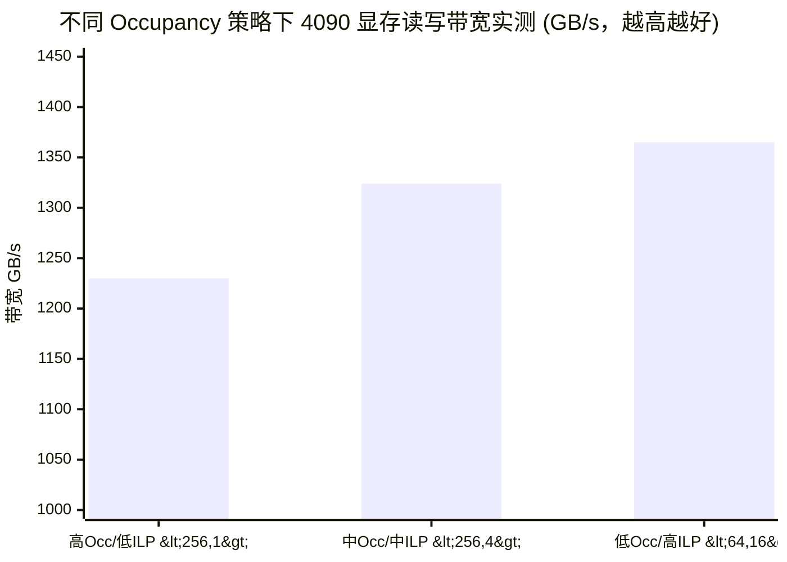

## 楔子：别凭感觉调参 (Stop Guessing, Start Measuring)

在 CUDA 优化的道路上，每一个初学者都会经历一段“调参炼丹”的黑暗岁月：
*“为什么我都把 Occupancy（占用率）调到 100% 了，速度反而比 50% 的时候更慢？”*
*“为什么我用了 Shared Memory 做了极致的 Tiling，整体时间却没有任何缩短？”*

答案很简单：**你用错了工具，找错了瓶颈。**
仅靠 `std::chrono` 测速，就像是蒙着眼睛在开赛车。如果车速慢了，你根本不知道是引擎坏了（算力瓶颈），还是油管堵了（内存瓶颈）。

在 `13_Performance_Analysis` 模块中，我们将教你如何像顶级架构师一样，使用**数学模型（Roofline）**画出性能天花板，并使用 NVIDIA 的**显微镜级别探针（Nsight Compute）**进行纳米级的“病理切片分析”。

---

## 确立目标极值：Roofline 理论模型 (The Roofline Model)

当你写完一个 Kernel，你的第一个问题不应该是“它现在跑了多少毫秒”，而应该是：“在这块具体的显卡上，它**最快**能跑多少毫秒？”

这个最快上限，就是由 **Roofline 模型（屋顶模型）**决定的。

### 核心公式推导

我们定义核心指标——**算术强度（Arithmetic Intensity, $I$）**：
$$I = \frac{\text{运算的浮点数 (FLOPs)}}{\text{从 VRAM 搬运的字节数 (Bytes)}} \quad (\text{FLOPS/Byte})$$

假设 GPU 的理论峰值算力为 $P_{\text{peak}}$（FLOPS），理论峰值带宽为 $B_{\text{peak}}$（GB/s）。
你的程序实际可达到的最大性能 $P$ 受双重制约，它就是一个屋顶的形状：
$$P_{上限} = \min(P_{\text{peak}}, I \times B_{\text{peak}})$$

在 `02_roofline/roofline.cu` 中，我们编写了一个自动侦测当前显卡物理极限的函数。在 RTX 4090 上：

- 峰值算力 $P_{\text{peak}}$ $\approx 86.02$ TFLOPS
- 峰值带宽 $B_{\text{peak}}$ $\approx 1008$ GB/s
- **机器拐点 (Ridge Point)** = $\frac{86.02 \times 10^0}{1008} \approx 85.33$ FLOPS/Byte

这是极其恐怖的现实：**如果你的 Kernel 每次从显存抓取 1 个 Bytes，却做不到 85.33 次浮点乘加运算，那么你永远摸不到算力天花板（Compute Bound），你只能在带宽的斜坡上挣扎（Memory Bound）。**

### 冰冷的实测宣判

看看我们在 4090 上跑出的两个极端例子：

| 测试算子 | 算术强度 $I$ | 物理落点诊断 | 实测速度 (GFLOPS) | 占理论上限的比例 |
| :--- | :--- | :--- | :--- | :--- |
| **Vector Add** (10M) | 0.083 | **极端 Memory Bound** | 78.72 | **93.70%** (带宽已经被你彻底吸干) |
| **Naive GEMM** (1024) | 170.667 | **绝对 Compute Bound** | 5234.05 | 6.08% (算力白白流失，亟待 Shared Tiling) |

**架构师视角**：当 Vector Add 的带宽利用率已经达到 93.7% 时，如果你再去给它加什么循环展开、指令重排，都是在浪费生命。这就是 Roofline 给你的第一眼视野：**帮你省掉无用功**。

---

## 打破玄学：Occupancy (占用率) 越高越好吗？

在早期的 CUDA 教程中，“努力把 Occupancy 调到 100%” 被奉为圭臬。
Occupancy 的本意是：既然访问全局内存有几百个时钟周期的延迟，那我们就让 SM（流多处理器）上驻留尽可能多的 Warp（线程束）。当一个 Warp 卡在等内存时，调度器能瞬间切换到另一个就绪的 Warp 去做数学计算，从而**隐藏延迟 (Latency Hiding)**。

但时代变了，现代编译器的 **ILP（指令级并行，Instruction-Level Parallelism）** 颠覆了这条定律。

### 极端实验：降低 Occupancy 究竟能有多猛？

在 `01_occupancy/occupancy.cu` 中，我们对千万级数组的读写，设计了三种截然不同的 Kernel 配置：

1. **满载原教旨主义者**：`<256 线程, 每个线程搬 1 个元素>` $\rightarrow$ Occupancy = 100%
2. **温和派**：`<256 线程, 每个线程搬 4 个元素>` $\rightarrow$ Occupancy = 100%
3. **异教徒 (ILP狂热者)**：`<64 线程, 每个线程搬 16 个元素>` $\rightarrow$ **Occupancy 极低，但单线程局部指令极其密集**

**震惊全场的实测结果 (有效总线带宽)：**



**为什么 12% Occupancy 的异教徒打败了 100% 的满载配置，甚至跑出了 1365 GB/s 的超限带宽？**
因为当每个线程内部被编译器 `#pragma unroll` 展开 16 次独立读写时，线程内部就发出了海量的并发内存请求（MIO）。尽管活跃的 Warp 极少，但它们发出的指令流如狂风骤雨般压垮了 L2 Cache 和 VRAM 控制器。
此外，较低的 Occupancy 给每个线程留下了深不可测的寄存器空间，完全避免了 Spill 到 Local Memory 的惨剧。

**金科玉律：隐藏延迟是核心目的，Occupancy 只是实现这个目的的工具之一。高质量的 ILP 完全可以代替高 Occupancy。**

---

## 硬件微观手术：Nsight Compute 工具链

如果你明确知道自己处于 Memory Bound，而且带宽利用率只有 30%，你应该怎么做？
你必须祭出核武器：**Nsight Compute (ncu)**。

在 `03_nsight_profiling` 中，我们故意写了一个错漏百出的 Kernel：`Stride=32` 的非合并访存。

```cpp
// 故意制造的毁灭性访问模式
int mapped_idx = (idx % stride) * chunk + (idx / stride);
float val = input[mapped_idx];
```

如果你用传统的计时器：

- Bad Kernel: 0.29 ms (273 GB/s)
- Good Kernel: 0.07 ms (1227 GB/s)

你只知道它慢了 4 倍，但你不知道为什么。
此时，在终端敲下探测指令：

```bash
sudo ncu --kernel-name profile_example_kernel_bad --launch-skip 2 --launch-count 2 ./nsight_profiling
```

Nsight Compute 会像 X 光一样穿透你的硬件，告诉你几条最致命的判决书：

1. **`sm__throughput.avg.pct`** (< 10%)：别看了，你的计算单元都在睡大觉。
2. **`l1tex__average_t_sectors_per_request_pipe_lsu_mem_global_op_ld`** = **32.0**
   - (正常连续合并访问的数值应该接近 **1.0**)
   - 这一条直接宣告了你的死刑：你的 32 个线程组成的 Warp，在向 L1 缓存发请求时，被硬件生生地劈成了 32 个独立的 Sector（扇区）去读取！
   - 这意味着，总线辛辛苦苦搬运了 `32 × 32 Bytes = 1024 Bytes` 的数据，实际上你的代码只用了其中的 `32 × 4 Bytes = 128 Bytes`。浪费率高达 **87.5%**！

### 分析宇宙的完整步骤

工业界标准的性能 Debug 永远严格遵循下面三步曲：

1. **Host 级别宏观圈定 (Nsight Systems - nsys)**：看看你的时间到底是耗在了 CPU、`cudaMemcpy` 还是某个不知名的驱动同步锁上？如果 GPU 出现了大段的空隙（Idle），说明你被 CPU 拖后腿了，该去查多线程了。
2. **理论极限比对 (Roofline)**：查完上面确认是 Kernel 的问题，那就套入算术强度公式，算出它属于哪一边。如果已经摸到了极限，直接停手。
3. **微观切片化验 (Nsight Compute - ncu)**：还没到极限？上 `ncu`，直接死锁 `dram__bytes_read` 和 `l1tex__throughput`，顺藤摸瓜揪出到底是哪个变量没有对齐，或者是 Shared Memory 发生了恐怖的 Bank Conflict。

---

## 优化工程师的进阶之道

在 CUDA 领域，学会写代码只是拿到了入场券，**学会诊断性能才是你能否担得起架构师 title 的试金石**。

通过 `13_Performance_Analysis`，你应该养成肌肉记忆：

1. 永远先算理论上限 $P = \min(P_{peak}, I \times B_{peak})$。
2. 警惕“无脑提高 Occupancy”的教条，用寄存器换取 ILP 往往能创造奇迹。
3. 当代码跑不快时，停止凭空猜测，学会和 Nsight 硬件探针做交易，让数字告诉你真相。
