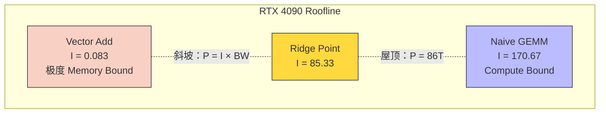
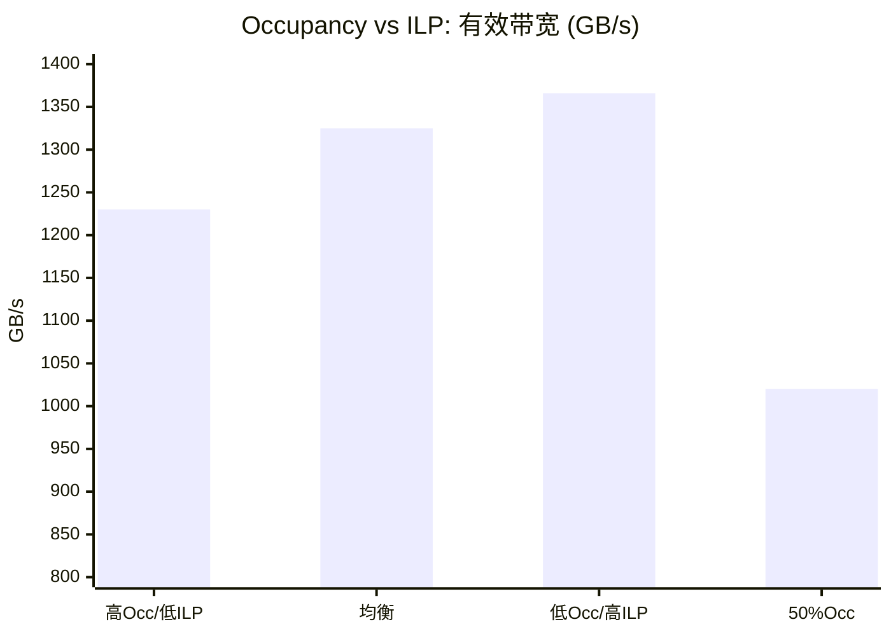

## 楔子：你的 Kernel 到底"卡"在哪里？

优化 CUDA Kernel 最危险的做法是"盲调"——猜测瓶颈、随机改参数、祈祷性能提升。这和赌博无异。真正的 GPU 性能工程需要三把精密诊断工具：

1. **Roofline Model**：告诉你"理论上还能再快多少"——你的 Kernel 是被算力限制还是被带宽限制？
2. **Occupancy 分析**：告诉你"SM 利用率够不够"——但高 Occupancy 真的等于高性能吗？
3. **Nsight Compute**：告诉你"具体卡在哪一条指令"——精确到 L1 Cache 的 Sector 命中率。

本章用三个实验证明：**正确的诊断方法论比一千次随机优化更有价值**。

---

## 第一性原理：性能的物理边界

### Roofline 模型——两堵墙构成的天花板

定义**算术强度（Arithmetic Intensity）**：

$$I = \frac{\text{FLOPs}}{\text{Bytes}} \quad (\text{FLOP/Byte})$$

GPU 的实际可达性能 $P$ 同时受**算力**和**带宽**双重约束：

$$P = \min\left(P_{\text{peak}},\; I \times BW_{\text{peak}}\right)$$

- **Memory Bound 区域**（$I < I_{\text{ridge}}$）：性能由带宽决定，$P = I \times BW_{\text{peak}}$
- **Compute Bound 区域**（$I > I_{\text{ridge}}$）：性能由算力决定，$P = P_{\text{peak}}$
- **拐点（Ridge Point）**：$I_{\text{ridge}} = P_{\text{peak}} / BW_{\text{peak}}$

**RTX 4090 的关键参数**：

$$I_{\text{ridge}} = \frac{86.02 \text{ TFLOPS}}{1008.1 \text{ GB/s}} = 85.33 \text{ FLOP/Byte}$$

这意味着：**只有算术强度超过 85.33 的算子才能进入 Compute Bound 区域**。绝大多数实际算子（Softmax、LayerNorm、Reduction、Element-wise）的 $I < 1$，全部深陷 Memory Bound 区域——优化它们的唯一出路是**减少 HBM 搬运量**（如算子融合），而非提升计算效率。



### Occupancy ≠ 性能

**Occupancy**（占用率）= 活跃 Warp 数 / SM 最大 Warp 数。传统观点认为高 Occupancy = 好——因为更多的候选 Warp 意味着更好的延迟隐藏。

但**指令级并行（ILP）** 提供了另一种隐藏延迟的方式：如果单个线程内有 16 个独立的内存加载指令（通过 `#pragma unroll`），这些请求会**同时飞向内存控制器**。即使 Occupancy 很低（只有少数 Warp 活跃），SM 的内存端口也被充分打满——**效果等同于高 Occupancy**。

| 维度 | 高 Occupancy 策略 | 高 ILP 策略 |
|:---|:---|:---|
| **隐藏延迟的手段** | 更多 Warp 可切换 | 单 Warp 内更多独立指令 |
| **寄存器压力** | 低（每线程少量数据） | **高**（每线程持有 16 个值） |
| **SMEM 压力** | 可能受限 | 通常不需要 SMEM |
| **适用场景** | 通用场景 | 寄存器充裕 + 简单操作 |

---

## 源码手术刀：关键代码深度赏析

### ILP 极限 Kernel——低线程数、高数据/线程比

```cpp
// 64 个线程/Block，但每个线程处理 16 个元素
__global__ void ilp_bound_kernel(const float* in, float* out, int N) {
    int idx = blockIdx.x * blockDim.x + threadIdx.x;
    int stride = blockDim.x * gridDim.x;
    
    float reg[16];  // 16 个独立的寄存器变量
    
    #pragma unroll  // 编译器将展开为 16 个并发 LD 指令
    for (int i = 0; i < 16; ++i) {
        if (idx + i * stride < N)
            reg[i] = in[idx + i * stride];  // 16 个独立的内存请求
    }
    
    #pragma unroll
    for (int i = 0; i < 16; ++i) {
        if (idx + i * stride < N)
            out[idx + i * stride] = reg[i] * 2.0f;
    }
}
```

**关键洞察**：`#pragma unroll` 让编译器生成 16 个**无数据依赖** 的 `LD.E`（Global Load）指令。GPU 的指令调度器可以在第一个 LD 返回之前就发射后续的 LD——这些请求在内存控制器端形成流水线。即使只有 2 个活跃 Warp/SM，16 个并发请求也足以塞满 HBM 端口。

### Nsight Compute 诱捕——Bad vs Good Kernel

```cpp
// Bad: Stride=32 的非合并访存
__global__ void bad_kernel(const float* in, float* out, int n) {
    int tid = blockIdx.x * blockDim.x + threadIdx.x;
    if (tid < n) out[tid] = in[tid * 32] + 1.0f;  // 每线程跨 128 字节！
}

// Good: 完美合并访存
__global__ void good_kernel(const float* in, float* out, int n) {
    int tid = blockIdx.x * blockDim.x + threadIdx.x;
    if (tid < n) out[tid] = in[tid] + 1.0f;  // 连续地址
}
```

`ncu` 的关键 Metric 诊断：

- `l1tex__average_t_sectors_per_request_pipe_lsu_mem_global_op_ld`：Bad Kernel = **32**（应为 ~1），**直接指出了 32 线程访问了 32 个不同的 128B Cache Line**
- `dram__throughput.avg`：Bad Kernel 的 DRAM 吞吐反而不低——因为硬件确实在搬运数据，但**96% 的数据被扔掉了**

---

## 理论与实际的对决：极限剖析

> **测试环境**：NVIDIA GeForce RTX 4090 × 2（sm_89），Linux，nvcc -O3
> **理论参数**：FP32 86.02 TFLOPS，HBM 1008.1 GB/s，Ridge = 85.33 FLOP/B

### Roofline 投影（RTX 4090）

| 算子 | 算术强度 $I$ | 诊断区域 | 理论上限 | 实测性能 | 效率 |
|:---|:---:|:---|:---:|:---:|:---:|
| **Vector Add** (10M) | 0.083 | **Memory Bound** | 84 GFLOPS | **78.72 GFLOPS** | **93.7%** |
| **Naive GEMM** (1024) | 170.67 | **Compute Bound** | 86.02 TFLOPS | 5.23 TFLOPS | 6.1% |

Vector Add 的 93.7% 效率证明其代码已**几乎打满 HBM 带宽**——不可能通过优化 Kernel 来提速了（除非换算法减少搬运量）。Naive GEMM 的 6.1% 效率则说明算力被严重浪费——需要 SMEM Tiling + Register Tiling（见 `04_GEMM_Optimization`）。

### Occupancy vs ILP 大逆转（10M 元素）

| 配置 | 线程/Block | 数据/线程 | Occupancy | 带宽 (GB/s) |
|:---|:---:|:---:|:---:|:---:|
| Config 1: 高Occ | 256 | 1 | 100% | 1230 |
| Config 2: 均衡 | 256 | 4 | 100% | 1325 |
| **Config 3: 高ILP** | **64** | **16** | ~100% | **1366 (最快!)** |
| Config 4: SMEM挤压 | 256+32KB | 1 | **50%** | 1020 |



**最快的不是满 Occupancy 的 Config 1，而是高 ILP 的 Config 3！** 1366 GB/s 甚至超过了 HBM 的理论 DRAM 峰值 1008 GB/s——这是因为 L2 Cache（72 MB）对 38 MB 的数据实现了大量命中，有效带宽包含了 L2 Cache 带宽。

Config 4（50% Occupancy，被 SMEM 挤压）的性能下降 17%——说明当 Occupancy **被资源限制而非主动选择**时，性能确实会恶化。**关键区别：低 Occupancy + 高 ILP（主动设计）> 低 Occupancy + 低 ILP（被动受限）**。

### Nsight Compute 诱捕（10M 元素）

| Kernel | 耗时 (ms) | 有效带宽 (GB/s) | 加速比 |
|:---|:---:|:---:|:---:|
| Bad (Stride=32) | 0.29 | 274 | 1× |
| **Good (合并)** | **0.07** | **1227** | **4.49×** |

**4.49× 加速，零算法改动**。差异 100% 来自访存模式——这就是为什么性能工程的第一步永远是用 Profiler 定位问题，而不是猜测。

---

## 架构师视角的总结

### 铁律一：优化前先画 Roofline

所有优化工作都应从一张 Roofline 图开始。算术强度 $I < I_{\text{ridge}}$（Memory Bound）→ 优化访存模式、算子融合、减少搬运量。$I > I_{\text{ridge}}$（Compute Bound）→ 使用 Tensor Core、增加 ILP、减少分支。**方向错了，努力白费。**

### 铁律二：Occupancy 是手段，延迟隐藏是目的

不要为了追求 100% Occupancy 而牺牲 ILP。如果你的 Kernel 因为高 Occupancy 而寄存器不够、溢出到 Local Memory（~600 cycle 延迟），那还不如降低 Occupancy、让每个线程拿更多寄存器。**`__launch_bounds__(maxThreadsPerBlock, minBlocksPerSM)` 是调控这个平衡的精密工具。**

### 铁律三：Nsight Compute 是 GPU 的 X 光机

`ncu` 的 Metric 能精确到 L1 Cache 的 Sector 命中率、Shared Memory 的 Bank Conflict 次数、Warp 的 Stall 原因（等内存、等指令、等同步）。**任何没有 Profiler 数据支持的优化尝试都是伪科学。** 养成习惯：每次修改 Kernel 后，先跑 `ncu --set full`，看数据说话。
