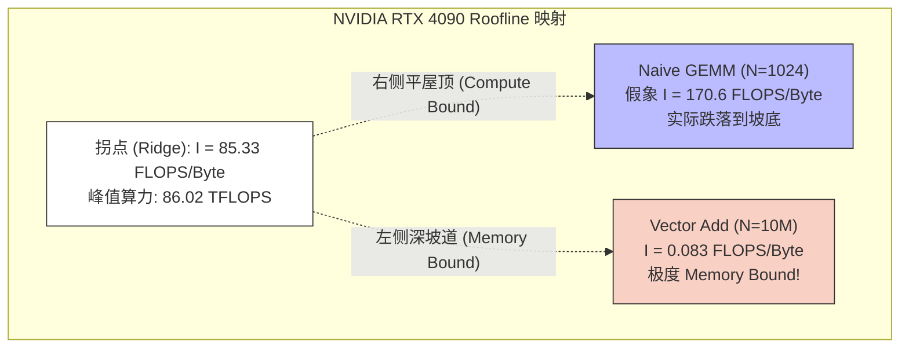
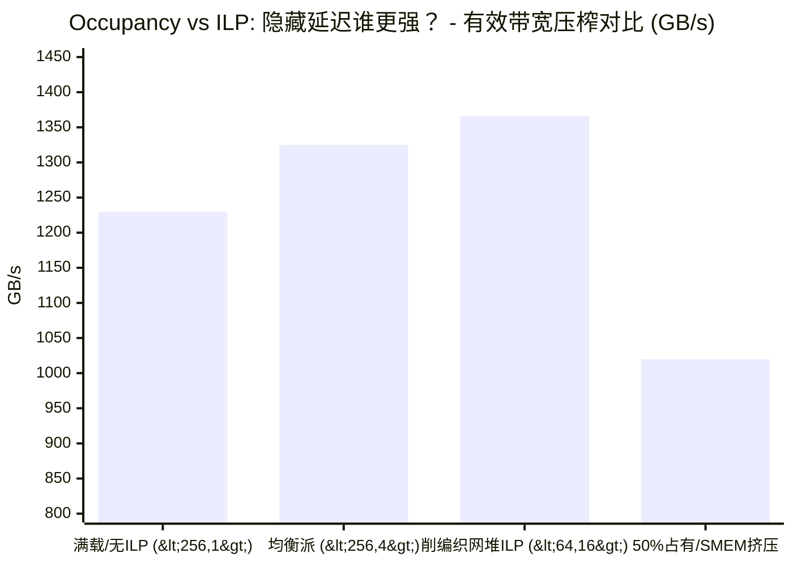

> 📖 **前置阅读**：[01_Basics](01_Basics_Thread_Hierarchy_and_Memory.md)（理解 Memory Bound 的直觉基础）、[04_GEMM_Optimization](04_GEMM_Optimization_Register_Tiling.md)（从 6.9T 到 28.8T 的算力墙跨越）
> 📖 **推荐后续**：[10_Memory_Optimization](10_Memory_Optimization_Coalescing_BankConflict.md)（合并访存实战）

开发 CUDA 算子最忌讳的一点，就是靠“猜”。

猜瓶颈在计算还是内存，猜 `#pragma unroll` 能不能提速，甚至靠掷骰子来决定 `blockDim.x` 设成 128 还是 256。碰到性能没达到预期，很多人第一反应是到处加 `__shared__`，这就像治病不看化验单直接瞎开猛药。盲目的猜测不仅浪费开发时间，更可能在复杂的微架构上引入反向优化。

在 `13_Performance_Analysis` 这个子项目中，我们不写具体的业务算法，而是拆解一套标准的“化验诊断”工具链。我们将运用 Roofline 模型定边界，剥开 Occupancy（占用率）可能带来的高负载幻觉，最后用官方探针 Nsight Compute 给代码做活检。所有数据均来自 NVIDIA GeForce RTX 4090 双卡环境实测。这不仅是一次工具特性的展示，更是重新洗牌你对底层硬件调度认知的过程。

---

## 一、宏观定调：Roofline Model 说你能跑多快

当你在写一个算子时，第一步绝不是打开编辑器敲下 `__global__`，而是拿出一张纸算一笔账：这个算子在当前硬件上的物理理论上限是多少。这套记账方法就是 **Roofline Model（屋顶模型）**。它如同物理学定律，为算子的极限性能画下了不可逾越的天花板。

### 1. 核心数学表达与硬件参数推导

Roofline 的基石是对算法密集度的定义——**算术强度（Arithmetic Intensity, $I$）**：

$$I = \frac{\text{FLOPs}}{\text{Bytes}} \quad (\text{FLOPS/Byte})$$

它衡量的是从内存中每搬运 1 字节的数据，由于算法本身的设计要求，GPU 能够在这 1 字节上“榨取”出多少次浮点运算（FLOPs）。

GPU 真正能跑出的极限吞吐性能 $P$ 会受到两堵墙的严酷限制：一堵是算力墙，一堵是带宽墙。其计算公式相当冷酷：

$$P = \min\left(P_{\text{peak}},\; I \times BW_{\text{peak}}\right)$$

在我们的测试机 RTX 4090 (Ada Lovelace, sm_89) 上，我们可以通过 `cudaGetDeviceProperties` 中的底层硬件参数手工推算出这两个极其关键的物理峰值（参考 `roofline.cu` 中的 `GPUSpecs::query_from_device`）：

- **峰值物理显存带宽 ($BW_{\text{peak}}$)**：通过查询出的显存时钟频率、位宽计算得到。即 `prop.memoryClockRate * (prop.memoryBusWidth / 8) * 2`（最后乘 2 是因为 GDDR6X 属于双数据率显存）。这块 4090 的显存频率为 10501 MHz，总线宽度 384 bit。实测折算为大约 **1008.10 GB/s**。
- **峰值 FP32 算力 ($P_{\text{peak}}$)**：由于 Ada 架构每个 SM 含有 128 个 FP32 CUDA Core，每个时钟周期支持 FMA（混合乘加指令 Fused Multiply-Add，一乘一加计为 2 次纯浮点运算），结合 `prop.multiProcessorCount` (128 个 SM) 和运行时约 2.52 GHz 的核心加速频率。理论上单精度的峰值算力高达 **86.02 TFLOPS**。

将计算峰值与带宽峰值相除，便是决定算子命运的**机器拐点（Ridge Point）**：

$$I_{\text{ridge}} = \frac{86.02 \text{ TFLOPS}}{1008.10 \text{ GB/s}} = 85.33 \text{ FLOP/Byte}$$

**85.33 这个数字意味着什么？**

它就是一条红线。在这张 4090 上，如果你的算法逻辑在计算时，平均每从显存拉取回 1 个字节，做不到至少 85.33 次浮点运算，那么通向显存的物理总线就会先于计算核心被榨干。此时你就是纯正的 **Memory Bound（访存受限）**算子，你的性能只能撞在倾斜的坡道上。

现实非常骨感：除了重度 Tiling 复用的矩阵乘法（GEMM）、卷积（Conv2D）等少数密集算子外，深度学习中 80% 以上的基础算子（如 Vector Add、Softmax、LayerNorm、Element-wise Sigmoid）的 $I$ 值连 2.0 都不到，它们全部被困在了斜坡底端。针对它们的优化出路只有一条：想方设法减少全局访存总量，融合多个算子省去中间变量落盘，而非想破脑袋去优化 CUDA Core 里的乘法。

### 2. 真实数据透视：极度反差的利用率

我们在 `roofline.cu` 中设计了两个极端案例，来印证 Roofline 预测的绝对统治力。

#### 案例 A：极限 Memory Bound 的 Vector Add（$N=10\text{M}$）

逻辑极其简单：从一维大数组 `A` 读一个数，从 `B` 读一个数，相加写回 `C`。

- 理论浮点运算：$\text{FLOPs} = N \times 1 \text{ (仅仅做一次极简的加法，1 FLOP)}$
- 理论全局访存：$\text{Bytes} = N \times 3 \text{ (读 a, 读 b, 写 c)} \times 4 \text{ Bytes/float} = 12 \text{ Bytes} \times N$

所以无论 $N$ 是 100 还是 10 亿，其固定的算术强度 $I = 1 / 12 = 0.083 \text{ FLOP/Byte}$。

因为 $0.083 \ll 85.33$，Roofline 模型判它“受困于内存”。它的理论最高算力天花板被死死钉在 $P = 0.083 \text{ FLOP/B} \times 1008.10 \text{ GB/s} = 84.01 \text{ GFLOPS}$。如果你没有这个模型，你可能会纳闷为什么自己的 4090 连 86T 算力的一根毛都没摸到。

**实测跑分结果**：78.72 GFLOPS。

> **判词分析**：实际算力效率达到了 $78.72 / 84.01 = 93.7\%$ 的极限吞吐率。这意味着这段朴素的代码**几乎完美地打满并塞爆了 HBM 的物理总线带宽**。无论你怎么精雕细琢内核里的加法器、修改 `grid` 和 `block`，企图提速都是无用功。因为 PCIe 与 VRAM 之间的数据引水渠已经被你的读写请求彻底物理填满了。这就是为什么在 LLM 推理系统开发中，这类独立算子必须被强行做 Kernel Fusion（算子融合）吸收掉的原因。

#### 案例 B：理想 Compute Bound 的 Naive GEMM（$N=1024$ 方阵）

简单的 `A * B` 矩阵乘法，不做任何 Shared Memory 切块缓存，直接让线程暴力怼全局显存。

- 对于生成的每一个 $C$ 元素，都需要遍历 $N$ 次拉取 $A$ 的一整行，以及 $N$ 次拉取 $B$ 的一列。计算总量是完美的 $2N^3$ FLOPS（乘法+加法各 $N^3$ 次）。
- 从算法原本的信息熵来看，我们需要输入 $2N^2$ 个元素，输出 $N^2$ 个元素，总搬迁数据为 $3N^2 \times 4$ Bytes。
- 如果我们拥有无限大的 L1 Cache 使得每个元素真的只被读写一次，其实际的**完美算术强度**将是 $I = \frac{2N^3}{12N^2} = \frac{N}{6}$。当 $N=1024$ 时，$I = 170.67 \text{ FLOP/Byte}$。它远远突破了 4090 所需的 $85.33$ 拐点阈值，高高站在了计算受限的平顶屋顶上。

**实测跑分结果**：5.23 TFLOPS。

> **判词分析**：按照模型它的计算天花板应该是满血的 86.02 TFLOPS，但这里只发挥了 **6.1%** 的微弱效率。为什么它翻车了？因为 $170.67$ 只是算法级别的“完美假象”。由于 Naive GEMM 毫无缓存重用设计，内层的每一次乘加都在重新向物理 DDR 发起读取请求。它的实际 `DRAM Traffic` 暴增了足足 $N$ 倍！庞大的废弃重复复用次数强行拖垮了应当大显身手的计算力流。解决方案自然指向了 `04_GEMM_Optimization` 中讨论的 Shared Memory Tiling 与 Register Tiling。



为了更直观地展示**本系列所有实测算子在 Roofline 空间中的相对位置**，下图以伪坐标形式标注各算子，横轴为算术强度 I（对数刻度），纵轴为实测性能：

```
性能 (log scale)
  ↑
86T ├──────────────────────────────────── Compute Bound 平顶 (86.02 TFLOPS)
    │                                  ✦ cuBLAS FP16 GEMM      [I≈171, 57.5 T]
    │                               ✦ Tiled GEMM (Reg Tile)    [I≈30,  28.8 T]
    │                              /
  5T ├                            /  ✦ Naive GEMM (无 Tiling)  [实测 5.2 T, 被带宽拖]
    │                            /
    │                           /  ← 带宽斜坡 (斜率 = 1008 GB/s)
    │                          /
80G ├─────────────────────────────── ✦ Vector Add [I=0.083, 78.7G ≈ 达到带宽极限]
    │        ✦ FlashAttention (IO优化后)   [I≈1.0, ~400 GB/s effective]
    │     ✦ RMSNorm / LayerNorm           [I≈0.5, ~200–300 GB/s]
    │  ✦ Softmax (标准版)                 [I≈0.25, ~100 GB/s]
    │✦ RoPE                               [I≈0.125, ~60 GB/s]
    └──────┬──────┬──────┬───────────────────┬──────────────────> I (FLOP/Byte)
         0.1    0.5    1.0                 85.33 (拐点)          ≥170 (GEMM)
         Memory Bound ←←←←←←←←←←←←←←→→→→ Compute Bound
```

> **说明**：Naive GEMM 的算法级算术强度为 $I \approx 170$ FLOP/Byte（若有完美缓存复用），但由于无任何 Shared Memory Tiling，实际每个元素重访 N 次 Global Memory，等效实测 I 约 $0.17$ FLOP/Byte，沉入带宽墙斜坡左侧，造成 5.2 TFLOPS 的实测值远低于理论上限。

这张图揭示了一个关键规律：除了高度 Tiling 的 GEMM，LLM 中几乎所有算子（Norm、Softmax、Embedding 等）都聚集在带宽斜坡的左侧。这正是 Kernel Fusion 和 FlashAttention 的工程动机——通过减少写回 HBM 的次数，将融合算子的等效 I 尽量向右推，逐步逼近拐点。

---

## 二、微观调度：Occupancy 的崇拜与 ILP 的物理颠覆

通过 Roofline 明确了优化的大盘与算子的先天命运后，下一个阶段是调节内核调度参数。在这个阶段，“满载率（Occupancy）越高越好”绝对是 CUDA 工程师口头流传最广、但坑人最深的一个迷思。

### 1. 隐藏延迟的两种完全不同的哲学

**Occupancy（占用率）** 的物理含义很直观：当前留在每一个 SM（流多处理器）上的“活跃”Warp 数量，占该硬件设计允许容纳的最大 Warp 数量的比率。

为什么我们曾经极度追求高达 100% 的满载量？
当你的 1 个 Warp 悲惨地向全局显存发出了一条长周期的读取大指令（`LD.G`），它必须原木罚站长达约 200 到 600 个时钟周期来等待数据慢慢爬回来。为了不让宝贵的 CUDA 浮点算子核心跟着空转闲置，SM 内部的 Warp 发射调度器（Warp Scheduler）此时会零开销地迅速切走，换到一个“早就在另一轮加载完毕、数据齐备”的 Warp 上。这就是利用庞大海量的并发 Warp 互做替身来“隐藏内存延迟”（Latency Hiding）。表面上看，这是一个牢不可破的定论，这使得开发者拼命限制单线程的寄存器用量（例如加上 `__launch_bounds__`），生怕人少了掩护不够。

但是，现代 GPU 微架构给出了另一条极为暴力的路：**指令级并行（ILP, Instruction-Level Parallelism）**。

如果不靠切到别的线程身上去隐藏空缺，我自己单挑行不行？
如果代码在一个普通的线程内部，紧接着写了十几个没有任何前后数据关联的内存请求，并通过 `#pragma unroll` 将循环毫无保留地展开给编译器：

```cpp
template<int ITEMS_PER_THREAD>
__global__ void ilp_bound_kernel(const float* input, float* output, int n) {
    float reg_buffer[ITEMS_PER_THREAD];
    
    // 完全展开，让编译器连环生成密集且无数据依赖的 LD.E 取数指令！
    #pragma unroll
    for (int i = 0; i < ITEMS_PER_THREAD; ++i) {
        if (idx + i * stride < n)
            reg_buffer[i] = input[idx + i * stride];  // 填充私人寄存器堆
    } 
    
    // ... 等这十几条加载全回来后，再做并发后续乘加处理 ...
}
```

一旦在 SASS 汇编指令里出现了十几个没有互相制约的全局数据读取 `LDG.E`，硬件 LSU（加载存储单元）的指令发射调度器是绝对不会傻等第一个请求回来的——它的内部拥有深度流水线结构（Pipeline）。它将把这十几条独立的指令，在一口气十几个时钟周期内，连续不断地塞进下划往内存控制器的通道列车里。单靠仅仅 1 个 Warp 自己吐出的密集流水线吞吐量，也能极其充分地填充满总线空出来的那点物理发射间隙，实现一种完美的“自我延迟掩盖”。

### 2. 实测打脸：谁才能跑赢物理极限？

为了验证这两种哲学谁高谁低，在 `occupancy.cu` 中我刻意写了一个可控制挂载强度的 `configurable_kernel<BLOCK_SIZE, ITEMS_PER_THREAD>`。用极为经典的控制变量法调优：动态修改 `BLOCK_SIZE` 以拔高或人为腰斩 Occupancy；修改 `ITEMS_PER_THREAD` 来催生底层代码的 ILP 程度。全量数组为 1000 万个 float，单趟读写吞吐总带宽需求约 76.3 MB。

| 测试配置策略（$N=10\text{M}$） | 核心参数配置组合 `<线程维, 单线程负荷处理数>` | 物理理论 Occupancy 限额 | Kernel 迭代平均耗时 | 实测表观带宽 (越高越好) |
| :--- | :---: | :---: | :---: | :---: |
| **Config 1: 满载狂魔 (High Occ)** | `<256, 1>` (256人，每人干 1 份活) | 100% | 0.07 ms | **1230.12 GB/s** |
| **Config 2: 均衡流派 (Mid Occ)**  | `<256, 4>` (256人，每人干 4 份活) | 100% | 0.06 ms | **1324.67 GB/s** |
| **Config 3: 孤注一掷 (Max ILP)**  | **`<64, 16>` (削减人手至64，每人连干 16 份!)**| 100% * | **0.06 ms** | **1365.92 GB/s (最高!)** |
| **Config 4: SMEM 挤压资源受害者** | `<256, 1>` (256人外加分配 32KB SMEM)| **被迫暴跌至 50%** | 0.08 ms | **1020.48 GB/s** |
| **Config 5: 寄存器限制钳制器** | `<256, 1>` (附加 `__launch_bounds__`) | 100% | 0.07 ms | **1230.12 GB/s** |

> *\*深层技术注：你可能会疑惑：为啥 64 个线程的 Config 3 其 Occupancy 居然没有掉，还是 100%？因为我们这里并没有申请巨量共享内存去挤占公摊坑位。SM 在衡量能不能放一个新 Block 进来上客的时候，只要不抢占超过 65536 个公有硬件寄存器的天花板限制（这是决定 Occupancy 阀门的关键），就算一个 Block 里人很少（只上了 64 人），SM 调度器仍具备灵活性去接力拉上最多 24 个这样的碎 Block 拼车，从而生生塞满 SM 的 1536 个总线程槽。这展示了 `nvcc` 编译器在 16 重展开下的寄存器池动态规划上的卓越压榨能力。*



这组基于 4090 的真实数据，向我们揭露了两个极为**炸裂且违背初学者常识**的洞见。

**发现 1：超光速的 1366 GB/s 是怎么算出来的？它违反物理了吗？**

最终的吞吐冠军不仅不是满载派，反而是极致的高 ILP 测试，它彪出的带宽超出了显卡的官方原厂 HBM 总线宣称上限 1008 GB/s 约 350 GB/s。难道显卡变异了？并不，其秘密在于 **L2 Cache 的命中奇迹**。

10M 个 float 加外加一个输出结果大数组，大约是 76 MB 在流转。而在现代的高端 Ada Lovelace 架构 RTX 4090 上，NVIDIA 为芯片疯狂堆砌了高达 **72 MB** 的超级二级缓存（L2）。由于我们的探针是使用 100 次 `for` 循环迭代求平均来进行稳定的性能基准捕获，所以从第二轮开始的一百次循环，内核碰上的绝大部分数据区块并非完全沉睡在冰冷遥远的 DDR (HBM) 内存深处，而是有存活块全部驻留在超大 L2 Cache 中进行高速折返响应。
Config 3 (<64, 16>) 的超高并行 ILP 释放指令流，恰巧在硅片内部完美地把这根带宽高达数 TB/s 的隐秘二级缓冲管道给“吸满”了，而单线程慢悠悠只读一个元素的 Config 1 根本无法触发这种瀑布般的瞬发洪流。

**发现 2：主动调兵遣将与被动挨宰受限的区别**。

第四个测试（Config 4）人为加入了一块 32KB 的 Dummy Shared Memory 作为占位符死重。在代码中，这段分配通过 `__shared__ float shared[SHARED_SIZE / sizeof(float)];` 申明。
你可能以为只是多了点缓存池，但实际上在 `cudaOccupancyMaxActiveBlocksPerMultiprocessor` API（CUDA 官方提供用于评估代码真实入驻能力的工具）的无情计算下，它使得一个 SM 原本能密密麻麻塞下好多队伍的硬件资源槽位，现在因为分不出 32KB 如此巨大的公摊面积，硬件最多只能硬生生放进去 3 个 Block队伍。Occupancy 直接被硬件红线拦腰斩断、暴力削减到了尴尬的 50%。因为在这套代码里：既没有充裕备用 Warp 进行互相掩盖，又没有刻意增加代码自身的 ILP 并发度（仍旧使用原始的 `ITEMS_PER_THREAD=1`）来单挑对抗内存载入期空白。这才是真正的死亡断崖组合，导致其性能滑轮般暴跌，仅仅将将卡住 1000 GB/s 关口。

**这给了我们一条强有力的金科玉律：**
从来没有低 Occupancy 必定导致性能差这条死律。如果不盲目迷信 Occupancy 柱状图，而是大方地让出线程的人权人头，使每一个存留下来的精兵强将能享受到数倍宽松的寄存器容量，在内核里放手去大干一场 ILP 循环推演（例如我们在 CUTLASS 内核架构或 FlashAttention 中常见的宽向量批量寄存器载入操作）。哪怕让总体 Occupancy 低至了百分之十二的极寒程度，其实际吞吐性能依然会强得令人发指。这就是一切现代顶级加速库的内核书写进化方向。

---

## 三、微观手术刀：用 Nsight Profiler 工具链彻查瓶颈

前面的阶段帮我们确定了战略定调和调度战术。但在具体的打磨落地中，我们绝对不可跳过终极的神灵裁决步骤——Profiler（分析系统）。瞎猜等于白干。针对这个，NVIDIA 配置了两套手术刀：宏观的 Nsight Systems 和微观的 Nsight Compute。

### 1. Nsight Systems (nsys)：宏观时间线上的隐脉定位

很多人常犯的一个通病是：死磕在几行内核代码里想破头优化，却不知道由于 CPU 端的阻塞或者调度器分配出了空隙，导致 GPU 珍贵的执行单元在两帧操作之间，有大量的时间里根本就是饿着肚子空转等下锅。

这时我们需要 `nsys`。在工程根目录起手：

```bash
# 抓取系统级时间线，并追踪 NVTX 特殊彩色标记
nsys profile --trace=cuda,nvtx -o nsight_timeline ./nsight_profiling
```

通过 `nsys-ui` 图形化界面打开生成的 `.nsys-rep` 制图，长条时间轴会非常直白地暴露出 CPU API 发送计算指令，与 GPU 物理承接负载之间的“重叠缝隙（Whitespace）”。如果你发现屏幕上蓝色的 `Memcpy` 和绿色的 `Kernel` 色块之间，全是大片巨长无比的白板空隙，那你该优化的根本就不是 Kernel 体内部，而是该考虑引入 CUDA Streams（并发流） 和异步加载的 Double Buffer 流水线机制。这代表了你已经脱离了算子开发的单兵作战范畴，迈入了系统工程师（System Engineer）对调度编排的领域。

### 2. Nsight Compute (ncu)：直击合并访存的破败碎裂

排除了发车调度的宏观问题后，如果单趟 Kernel 的耗时还是异常长，我们就要上“显微镜” Nsight Compute 去彻查微架构缓存通道里发生了什么恶疾。

在 `nsight_profiling.cu` 测试文件中，我们布置了一颗巨大的代码核弹地雷，专门捕捉初学者在编写访存时常常自以为是的小聪明：

```cpp
// 糟糕地址映射（跨列索引跳步）：同一 Warp 下线程之间相邻访问跨度巨大
int chunk = n / stride; 
int mapped_idx = (idx % stride) * chunk + (idx / stride); // 典型的矩阵跳跃转置坐标变换雏形
float val = input[mapped_idx]; 
```

这里的测试跨度步长为 `stride = 32`。而对照的 `Good Kernel` 组别仅仅是将其改成老老实实地朴素按自然号索引读取（`idx`）。看看惊人的实测结果：

- **Bad Kernel 恶心版（非合并访存，Stride=32）**：执行时间 `0.29 ms`，表观有效利用总线带宽 `273.54 GB/s`。连理论的 1/3 都惨遭不住。
- **Good Kernel 正统版（规整合并挨个读）**：执行时间 **`0.07 ms`**，表观利用总线带宽骤增至恐怖的 **`1227.03 GB/s`**。
- **二者对比加速比：高达碾压级别的 4.49 倍！**

完全是同一种逻辑运算加法器结构，产生一样的算子浮点输出，甚至两头调用的内存池总容量池子都在完全一样的 38 MB之内。仅仅只是各个线程对数组内下标的切入偏转方式不同而已，为什么完全 $0$ 体力代码改造成本，能凭空造就出将近 5 倍的空间跨度？

这个时候我们在控制台打出 `ncu --kernel-name profile_example_kernel_bad --launch-skip 2 --launch-count 2 ./nsight_profiling` 命令并启动了探针。
在吐出的几百兆厚重晦涩的追踪日志表单中，只要你熟悉硬件门道，有一个异常发紫的 Metric 参数会第一秒把这种错漏当庭全盘定罪：
`l1tex__average_t_sectors_per_request_pipe_lsu_mem_global_op_ld`
（参数繁琐的学术释义：从全局显存层发起的每次内存加载请求期间，系统平均往通道下放分配回了几个 L1/TEX 处理队列的微型物理缓存扇区）。

**探针底下的致命玄机到底在哪？**

这源于现代显卡的 L1 数据缓存通道内刻在骨子里的一个固执铁律：不管你找硬件索要 1 个 byte 还是怎么滴，内存控制长途卡车读通道的起底门槛起步价，是一次必须生冷不忌地强行拽走一个完整 **Sector（缓存线扇区，即紧挨着的连片 32 个连续字节空间）**。

对于毫无瑕疵的连贯合并访存，1 个完整的 Warp 里头站着齐刷刷的 32 条线程兵。执行 `LD.G` 取数口令时，每个人各自稳稳当当地正恰巧挨着旁边友军的手去拿对应排号的 1 个 4 字节 float（总计 32 线 $\times$ 4 字节 = 128 字节连号全数组）。底层硅片的内控单元一看：这批地址需求都是严严实实成串打包好的串子货。于是硬件仅仅下发 4 趟清脆的 32 字节扇区搬运令，四辆卡车齐开，一次发包就能完美无缺地把全部 32 个老哥的配额给带了回来分发完。
这就等于：**底层的原始请求事务被硬生生切碎的碎片化程度逼近了绝对的最低极限**。平均均摊下来的 Sector 指标反馈在 Nsight 上就是极其理想清爽的 **1.0** 两边浮动。

可你干了什么？由于你作聪明把提取跨步的 Stride 硬生生设成了转置步长跳帧式的 32。
伴随着 Warp 向系统发起一声数据请求号角：队伍里的一号线大喊要位置 0 的元素；旁边队伍里的二号线不拿旁边存货，非得偏执地越过大片数据大喊要位置 32（距离上一个是跨过了浩瀚的 128 个字节鸿沟）！中间所有的连号存粮大家全当看不见。
为了勉强满足这一群大少爷的极其离谱和零落散装的特殊点单要求，底层硅片的总线物理通道无路可退。硬件控制器引擎不得不全军出动，分别疯狂地向物理板上间隔千里的 32 个不同死角的内存方块颗粒区里，凶狠地开启 $32 \times 32$ 字节包的数据漫威式疯狂抽水。然而，那巨细无遗千辛万苦从全频带抽上岸的巨量宝贵字节波浪里，有整整高达 **$31 \times 32$ 字节的内容因为不在你的点菜名单之内，上岸的瞬间就被立即宣告为无效垃圾数据，遭缓存管道无情抛弃排刷进虚无虚空**！

于是，这个隐秘而伟大的诊断报警参数在你的分析大屏里直接呈现刺眼的血红色，拉满飙升到了令人心悸的灾难数值 **32**——它用最冷酷纯粹的数字暴力拆穿了系统底层的可悲现状：
你这所谓的“跑满了硬件性能”根本就是一出小丑般的自欺欺人。高达接近 **96.8%**（31/32）甚至以上的广阔显存带宽跑道走廊，全盘因为你愚蠢而不自知的发散性加载，变相硬生生塞成了全线彻底瘫痪废弃崩溃的状态，在做无用功。

---

## 四、写在最后：拔剑四顾的性能诊疗标准决策树

本章绝非只是几个数字的堆砌，而是一套严密实操、可无限复用的科学微架构诊断范式。在往后深沉复杂的底层 CUDA 系统级调优漫长战役中，当我们遇见一个从天而降几近几十万行代码的完全陌生的深水库项目、或者被别人贴脸灵魂拷问“为什么你写的这几行就跑得很挫、拉跨算力卡脖”的时候，我强烈建议每一个系统调优师牢定死记下面这张简易版的标准接诊分流定性表单：

| 病人临床现象痛点自述 | 应该果断先切什么脉（工具手段诊断） | 理性推演出的生死方向与针对性处方药 |
| :--- | :--- | :--- |
| **第一步初诊：算子这病还有没有救？我的绝对天花板到底钉能摸多高？** | 直接在草稿纸上抄录公式硬画物理理论 **Roofline $I$ 计算公式散点图**。 | · 核心算术强度要是悲戚的 $I < 85$，果断悬崖勒马停止去用晦涩 PTX 汇编写核心循环强行提速，因为这是 HBM 的物理极限判了私刑没法绕。<br>· 如果反转算出 $I > 150$，果断放弃无脑读写，火速上 `__shared__` 以及去狂改学习类似 `04_GEMM_Optimization` 里的宽向量二维寄存器对冲拼块技术方案。 |
| **第二步探底：为啥最终浮点利用运算量都没到顶峰值，占用率 Occupancy 线却早就报黄见顶了？** | 测试减少下发的 Block 总兵团人数规模配比（尝试主动弃权拔根**降级 Occupancy 人次**）。 | 果断放点剩余宽裕的寄存器空间出来空着，给每一个成功存活留任在阵地上的老大哥线程放开双手下死命令强制加量铺开工作摊子（大量在代码底层暴力加塞部署 `#pragma unroll`）。静静观察测试这组自断手足的新编排配置能不能催化产生出超前极度的重发流水线浪涌，强行把系统吞吐总线活活砸冒烟填满重叠。 |
| **第三步抓虫：为什么我反复检查算法感觉明明宏观逻辑没大错，这破带宽还是烂泥扶不上墙？** | 挂上 NVIDIA 官方专门定制出场的显微镜标准听诊器利器 **Nsight Compute**。 | 取消只盯大盘耗时。一头扎进去死死直接去盯紧那个名字奇长无比、埋藏在隐秘角落深处的关键大动脉参数 `_sectors_per_request_`。这个监控数字要是偏离出健康线 1.0 的安全区太多，甚至肆无忌惮地干到了离大谱的两位数地步，什么都别想，光速切回代码库直接去地毯式排查、鞭尸自己亲手敲下的那一组下标变量偏移控制结构，究竟是哪一句暗处藏刀破坏了内存合并提取的纯度血统。 |

当我们最终把这个从最顶层物理宏大系统推算、一直贯穿到底层事务晶体管扇区切片的严整连贯一条龙式方法论牢牢打通血脉融为一体以后，一切曾经在这片系统底层被称为所谓靠“老手经验”、甚至是看运气的暗黑瞎猜性能调优手艺粗活粗胚，也就从此有了一根确切可循、冷酷而坚若磐石的宏大量化数据灵魂主心骨做绝对支撑定盘星。

---

## 附录：来自一线诊疗现场的快问快答 (FAQ)

**Q：既然 ILP 这么强，那以后写所有算子我们是不是干脆把 Occupancy 压到 10% 算了？**
A：千万别走向盲目堆 ILP 的极端。ILP 的红利基石有一个极其严苛的物理大前提：你的寄存器数量必须装得下所有的局部平摊变量，并且完全没有发生 `Spill to local memory`（寄存器内容无位可放，被迫溢出砸到物理显存上，这会导致可怕的 >500 cycle 每步取数延迟，完全是在自杀）。如果算法操作极其复杂（比如含有大量状态变量的自回归生成过程），为了强行堆 ILP 导致寄存器溢出爆炸，性能反而会遭遇雪崩式毁灭打击。这时候你可能真的需要通过 `__launch_bounds__` 或者 `__shared__` 老老实实地拉高 Occupancy，让多个轻量级 Warp 互换来保命。平衡才是艺术。

**Q：ncu 有那么多乱七八糟、名字几百个字符长的 Metric，我除了看行文里的缓存线，日常排查还要看什么？**
A：日常不要去看 GUI 里几百个折叠项，直接用命令行抓取三大核心命脉：

```bash
# 黄金三指标抓取模板
ncu --metrics sm__throughput.avg.pct_of_peak_sustained_elapsed,dram__throughput.avg.pct_of_peak_sustained_elapsed,l1tex__data_pipe_lsu_wavefronts_mem_shared.avg.pct_of_peak_sustained_active ./your_program
```

首先看 `dram__throughput`（显存物理带宽利用率）让你摸透自己离理论带宽天花板多远。然后直接去看 `sm__throughput`（计算流多处理器利用率）查计算核心是否因为等数据而饿死。如果判定是 Memory Bound 但是吞吐死活跑不满，去看第三个 `l1tex_..._shared` 参数，查是不是 Shared Memory 架构内发生了极其严重的 Bank Conflict（银行组冲突串行排队）。三大法宝能搞定 80% 的疑难杂症。

**Q：为什么刚才的合并访存案例中，Bad Kernel 浪费了 96% 的数据，但它的表观跑分居然还有 273 GB/s，而不是应该跌到个位数吗？**
A：这是初学者极其容易忽视的“硬件兜底机制”。我们在讨论中提到的 96% 浪费，是指物理显存总线上运送来的 128 Bytes 中只有 4 Bytes 被需要。但是，这 128 Bytes 在 L1 和 L2 Cache 中被缓存了下来！由于我们使用了 N=10M 的循环测试，后续的其他线程（或者其他 Warp）在极短的时间内，极大概率会访问到刚才这个线程“误拉取”上来的那批垃圾数据里的邻居部分！这个时候，它们直接在极速的 Cache 内击中了数据，无需再向远端的 DDR 要人。正是因为这种无形中的 Cache 兜底抗压，才将原本可能跌到 10 GB/s 的惨状生生拉升到了 273 GB/s。这也侧面证明了良好利用 L1/L2 缓存能救大命。

**Q：如果我的内核已经被 Roofline 判定为 Compute Bound（计算受限），是不是说明我的代码已经天下无敌不需要改了？**
A：大错特错！Roofline 判断你 Compute Bound，只说明你的算术强度 $I$ 越过了硬件红线，并不是说你已经把 $86\text{ TFLOPS}$ 的算力发挥得淋漓尽致！比如案例 B 的 naive GEMM 只有 6% 的可怜利用率，说明 CUDA Core 在执行期间绝大部分时间都在傻等调度或者被其他延迟拖累。更进一步，对于纯 Compute Bound 的算子，FP32 CUDA Core 的峰值早就不是最终答案了。你需要重构数据类型并调用 `mma.sync`（矩阵乘加指令）或者使用 CUTLASS 库，将浮点压力转移给硬件上的怪物单位——Tensor Core，在那里，峰值算力将成倍暴涨至 PFLOPS 级别。

---

## 五、实战指南：如何亲手复现这些数字？

纸上得来终觉浅。如果你有一张 NVIDIA 的显卡，我强烈建议你克隆出 `13_Performance_Analysis` 这个子项目的代码，亲手用编译工具链跑一遍以上的实验。

### 1. 编译命令与环境准备

确保你的环境里装好了完整的 CUDA Toolkit 以及 CMake：

```bash
# 从项目根目录配置（首次）
cmake -B build -DCMAKE_BUILD_TYPE=Release

# 并发编译三个性能分析目标二进制
cmake --build build --target nsight_profiling -j8
cmake --build build --target occupancy -j8
cmake --build build --target roofline -j8
```

### 2. 标准运行与微观剖析

编译完成后，可以通过以下标准命令执行普通的计时评估：

```bash
# 执行基础的硬件画像与 Roofline 分析
./build/13_Performance_Analysis/02_roofline/roofline

# 执行 ILP 调度测试，体验从满载到极限并行的跨度
./build/13_Performance_Analysis/01_occupancy/occupancy
```

对于最核心 Nsight 工具诱捕实验，必须挂载官方探针执行，这是你从普通开发向底层调优跨越的必经之路：

```bash
# 使用 Nsight Compute CLI (ncu) 剖析错误与规整合并情况
# --launch-skip 2: 略过预热轮， --launch-count 2: 只抓取 Bad 和 Good 的各第一趟真实运行
sudo ncu --kernel-name profile_example --launch-skip 2 --launch-count 2 ./build/13_Performance_Analysis/03_nsight_profiling/nsight_profiling
```

### 3. 深造参考资料

- **[NSight Compute User Interface Guide](https://docs.nvidia.com/nsight-compute/NsightCompute/index.html)** — 官方 Ncu 工具中文大赏与 Metric 参数词典，性能优化的终极案头书。
- **[CUDA Toolkit: Achieved Occupancy](https://docs.nvidia.com/gameworks/content/developertools/desktop/analysis/report/cudaexperiments/kernellevel/achievedoccupancy.htm)** — 官方技术指南：为什么不能盲目迷信 Occupancy。
- **Roofline: An Insightful Visual Performance Model** — 加州大学伯克利分校提出的 Roofline 经典原始学术论文，奠定了当代架构评估的基石。
