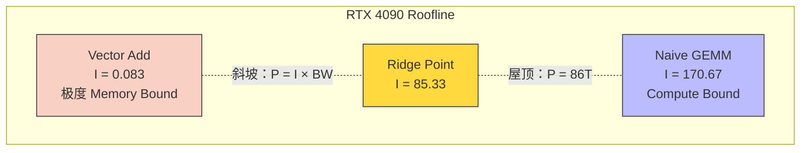
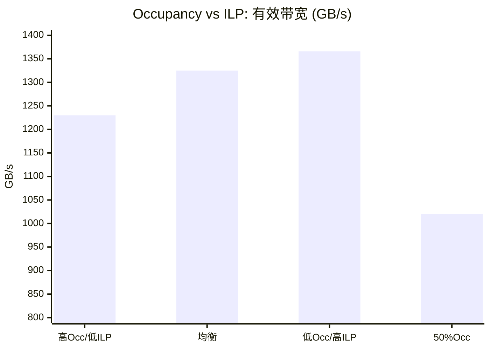

> 📖 **相关阅读**：01_Basics（Memory Bound 的直觉）、04_GEMM_Optimization（从 6.9T 到 28.8T 的优化路径）、10_Memory_Optimization（合并访存实战）

优化 CUDA Kernel 最危险的做法是猜——猜瓶颈在哪、随机改参数、祈祷性能提升。本章用三把标准工具做三组实验，建立一套可复用的性能诊断方法论。

---

## 工具一：Roofline Model

### 两堵墙构成的天花板

**算术强度**的定义：

$$I = \frac{\text{FLOPs}}{\text{Bytes}} \quad (\text{FLOP/Byte})$$

GPU 的实际可达性能 $P$ 同时受算力和带宽约束：

$$P = \min\left(P_{\text{peak}},\; I \times BW_{\text{peak}}\right)$$

- **Memory Bound**（$I < I_{\text{ridge}}$）：性能由带宽决定，$P = I \times BW_{\text{peak}}$
- **Compute Bound**（$I > I_{\text{ridge}}$）：性能由算力决定，$P = P_{\text{peak}}$
- **拐点**：$I_{\text{ridge}} = P_{\text{peak}} / BW_{\text{peak}}$

RTX 4090 的拐点：

$$I_{\text{ridge}} = \frac{86.02 \text{ TFLOPS}}{1008.1 \text{ GB/s}} = 85.33 \text{ FLOP/Byte}$$

**只有算术强度超过 85.33 的算子才进入 Compute Bound 区域**。实际中绝大多数算子（Softmax、LayerNorm、Reduction、Element-wise）的 $I < 1$，全部 Memory Bound——优化它们的出路是**减少搬运量**，而非提升计算效率。

### 实测投影

> **测试环境**：NVIDIA GeForce RTX 4090 × 2（sm_89），Linux，nvcc -O3

| 算子 | 算术强度 $I$ | 区域 | 理论上限 | 实测 | 效率 |
|:---|:---:|:---|:---:|:---:|:---:|
| **Vector Add** (10M) | 0.083 | **Memory Bound** | 84 GFLOPS | **78.72 GFLOPS** | **93.7%** |
| **Naive GEMM** (1024) | 170.67 | **Compute Bound** | 86.02 TFLOPS | 5.23 TFLOPS | 6.1% |

Vector Add 93.7% 效率说明代码**几乎打满了 HBM 带宽**——不可能通过优化 Kernel 来提速。Naive GEMM 6.1% 说明算力被严重浪费——需要 SMEM Tiling + Register Tiling（见 04_GEMM_Optimization）。



**判断**：先算 $I$，再决定优化方向。$I < 85$ → 优化访存。$I > 85$ → 优化计算。方向错了，后面全是白费。

---

## 工具二：Occupancy vs ILP

**Occupancy** = 活跃 Warp 数 / SM 最大 Warp 数。直觉上越高越好——更多候选 Warp 意味着更好的延迟隐藏。

但**指令级并行（ILP）** 提供了另一种隐藏延迟的方式。如果一个线程内有 16 个独立的内存加载指令（通过 `#pragma unroll`），这些请求**同时飞向内存控制器**。即使 Occupancy 很低，SM 的内存端口也被打满了。

### ILP Kernel 的核心思路

```cpp
// 64 个线程/Block，但每个线程处理 16 个元素
__global__ void ilp_bound_kernel(const float* in, float* out, int N) {
    int idx = blockIdx.x * blockDim.x + threadIdx.x;
    int stride = blockDim.x * gridDim.x;
    
    float reg[16];  // 16 个独立寄存器变量
    
    #pragma unroll  // 编译器展开为 16 个并发 LD 指令
    for (int i = 0; i < 16; ++i) {
        if (idx + i * stride < N)
            reg[i] = in[idx + i * stride];
    }
    
    #pragma unroll
    for (int i = 0; i < 16; ++i) {
        if (idx + i * stride < N)
            out[idx + i * stride] = reg[i] * 2.0f;
    }
}
```

`#pragma unroll` 让编译器生成 16 个**无数据依赖**的 `LD.E` 指令。GPU 的指令调度器在第一个 LD 返回之前就发射后续的 LD——即使只有 2 个活跃 Warp/SM，16 个并发请求也足以塞满 HBM 端口。

### 实测（10M 元素）

| 配置 | 线程/Block | 数据/线程 | Occupancy | 带宽 (GB/s) |
|:---|:---:|:---:|:---:|:---:|
| Config 1: 高Occ | 256 | 1 | 100% | 1230 |
| Config 2: 均衡 | 256 | 4 | 100% | 1325 |
| **Config 3: 高ILP** | **64** | **16** | ~100% | **1366 (最快)** |
| Config 4: SMEM挤压 | 256+32KB | 1 | **50%** | 1020 |



**最快的不是满 Occupancy 的 Config 1，而是高 ILP 的 Config 3。** 1366 GB/s 超过了 HBM 理论 DRAM 峰值 1008 GB/s——因为 L2 Cache（72 MB）对 38 MB 的数据实现了大量命中，有效带宽包含了 L2 Cache 带宽。

Config 4（50% Occupancy，被 SMEM 挤压）性能下降 17%。关键区分：**低 Occupancy + 高 ILP（主动设计）** 和 **低 Occupancy + 低 ILP（被资源挤压）** 是两回事。前者有效，后者有害。

| 维度 | 高 Occupancy 策略 | 高 ILP 策略 |
|:---|:---|:---|
| 隐藏延迟的手段 | 更多 Warp 可切换 | 单 Warp 内更多独立指令 |
| 寄存器压力 | 低 | **高**（每线程持有 16 个值） |
| 适用场景 | 通用 | 寄存器充裕 + 简单操作 |

---

## 工具三：Nsight Compute

### 合并访存 vs 非合并访存

```cpp
// Bad: Stride=32 的非合并访存
out[tid] = in[tid * 32] + 1.0f;  // 每线程跨 128 字节

// Good: 连续地址
out[tid] = in[tid] + 1.0f;
```

### 实测（10M 元素）

| Kernel | 耗时 (ms) | 有效带宽 (GB/s) | 加速比 |
|:---|:---:|:---:|:---:|
| Bad (Stride=32) | 0.29 | 274 | 1× |
| **Good (合并)** | **0.07** | **1227** | **4.49×** |

**4.49× 加速，零算法改动。** 差距完全来自访存模式。

`ncu` 的关键 Metric：`l1tex__average_t_sectors_per_request_pipe_lsu_mem_global_op_ld`——Bad Kernel = **32**（应为 ~1），说明 32 个线程访问了 32 个不同的 128B Cache Line。`dram__throughput` 显示 Bad Kernel 的 DRAM 吞吐反而不低——硬件确实在搬数据，但**96% 的数据被扔掉了**。

---

## 三把工具的使用顺序

这是一个可以反复套用的工作流：

1. **先画 Roofline**：算 $I$，判断 Memory Bound 还是 Compute Bound。方向定了，才知道该优化什么。
2. **看 Occupancy**：不要为了 100% Occupancy 而牺牲 ILP。如果高 Occupancy 导致寄存器溢出到 Local Memory（~600 cycle 延迟），还不如降 Occupancy 给每个线程更多寄存器。`__launch_bounds__` 是调控这个平衡的工具。
3. **跑 Profiler**：`ncu --set full` 看 L1 Sector 命中率、Bank Conflict 次数、Warp Stall 原因。改 Kernel 前先跑 Profile，看数据再动手。
