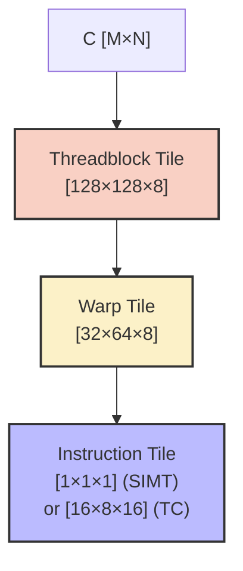
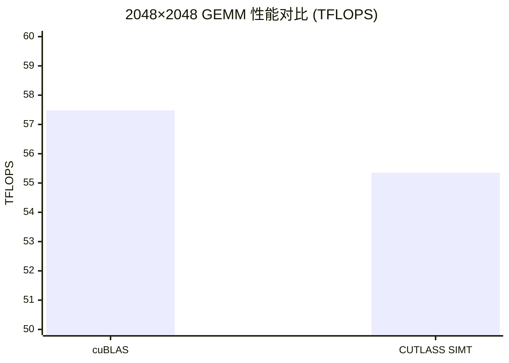

```mermaid
gantt
    dateFormat s
    title GEMM Mainloop: Double Buffering 流水线

    section SMEM Buffer A
    Load Tile k=0 :a0, 0, 1s
    Load Tile k=2 :a2, 2, 1s
    Load Tile k=4 :a4, 4, 1s

    section SMEM Buffer B
    Load Tile k=1 :b1, 1, 1s
    Load Tile k=3 :b3, 3, 1s

    section Compute
    MMA (k=0) :c0, 1, 1s
    MMA (k=1) :c1, 2, 1s
    MMA (k=2) :c2, 3, 1s
    MMA (k=3) :c3, 4, 1s
```

> 📖 **相关阅读**：04_GEMM_Optimization（手写 Tiling 极限）、09_Tensor_Core（WMMA 入门）、12_Standard_Libraries（cuBLAS 的黑盒性能）

## cuBLAS 的 96% 意味着什么

04_GEMM_Optimization 里 80 行 Register Tiling 跑出 28.79 TFLOPS，09_Tensor_Core 里 Naive WMMA 到了 30.5 TFLOPS。但 cuBLAS 的 57.48 TFLOPS 还差一倍——这一倍来自**多级流水线 + SMEM Double Buffering + 编译期布局代数 + SASS 级调优**。想手工复现，代码量会膨胀到数千行。

CUTLASS 是 NVIDIA 的解法：用 C++ 模板元编程把 GEMM 分解为可组合的层级抽象。换个模板参数就能从 SIMT 切到 Tensor Core、FP32 切到 FP16。实测 CUTLASS SIMT GEMM 达到了 cuBLAS 的 **96.3%**。

CUTLASS 3.x 还带来了 **CuTe**——代数化的布局系统。`Layout<Shape, Stride>` 描述任意多维张量，编译器自动推导出零开销的 1D 偏移计算。

---

## GEMM 的三级 Tiling 分解

$C_{M \times N} = A_{M \times K} \times B_{K \times N}$ 被分解为三层：

| 层级 | 负责范围 | Tile 尺寸 | 硬件映射 |
|:---|:---|:---|:---|
| **Level 1: Threadblock** | C 的一个 $T_M \times T_N$ 输出块 | $[128, 128, 8]$ | 一个 Thread Block |
| **Level 2: Warp** | C Tile 的一个子块 | $[32, 64, 8]$ | 一个 Warp |
| **Level 3: Instruction** | 硬件指令粒度 | $[1,1,1]$ (SIMT) 或 $[16,8,16]$ (TC) | FMA / HMMA |



K 维度以步长 $T_K$ 迭代，每步将 A 的 $T_M \times T_K$ 和 B 的 $T_K \times T_N$ 加载到 Shared Memory。Warp 从 SMEM 加载到寄存器，执行 MMA 指令。

---

## Double Buffering：加载和计算完全重叠

CUTLASS 达到 cuBLAS 96% 的关键之一是 Double Buffering——用两组 SMEM 交替加载和计算：



Buffer A 加载 k=0 时 Compute 空闲。k=0 就绪后，Buffer B 开始加载 k=1，同时 Compute 处理 k=0 的数据。加载延迟被计算掩盖。

CUTLASS 的四层抽象：

| 抽象层 | 职责 | 性能关键点 |
|:---|:---|:---|
| **Mainloop** | Global → SMEM 搬运 | Double Buffering、`cp.async` |
| **Warp-Level** | SMEM → Register、发射 MMA | `ldmatrix`、Warp 调度 |
| **Instruction-Level** | 硬件指令执行 | SIMT FMA / Tensor Core HMMA |
| **Epilogue** | 收尾计算 + 写回 | BiasAdd、GELU 融合 |

---

## CUTLASS GEMM 模板实例化

```cpp
#include <cutlass/gemm/device/gemm.h>

using GemmType = cutlass::gemm::device::Gemm<
    float,                          // ElementA
    cutlass::layout::ColumnMajor,   // LayoutA
    float,                          // ElementB
    cutlass::layout::ColumnMajor,   // LayoutB
    float,                          // ElementOutput
    cutlass::layout::RowMajor,      // LayoutC
    float,                          // Accumulator
    cutlass::arch::OpClassSimt,     // SIMT (CUDA Core)
    cutlass::arch::Sm89,            // 架构目标
    cutlass::gemm::GemmShape<128, 128, 8>,  // Threadblock
    cutlass::gemm::GemmShape<32, 64, 8>,    // Warp
    cutlass::gemm::GemmShape<1, 1, 1>,      // Instruction
    cutlass::epilogue::thread::LinearCombination<
        float, 1, float, float>
>;

GemmType gemm_op;
GemmType::Arguments args(
    {M, N, K}, {A, lda}, {B, ldb}, {C, ldc}, {D, ldd},
    {alpha, beta});
gemm_op(args);  // 展开为数千行优化后的 SASS
```

几个设计选择值得注意：

- `OpClassSimt` → CUDA Core 标量 FMA。改为 `OpClassTensorOp` + Instruction Tile 改成 `GemmShape<16, 8, 16>` 就自动使用 Tensor Core
- `GemmShape<128, 128, 8>` → 加大 $T_K$ 会增加 SMEM 占用但减少 K 循环次数
- `LinearCombination` → $D = \alpha \cdot A \cdot B + \beta \cdot C$。可替换为 `LinearCombinationRelu` 实现 Epilogue 融合

---

## CuTe Layout 代数

CuTe 的核心是 **Layout = (Shape, Stride)**：

$$\text{offset}(i, j) = i \times \text{stride}_0 + j \times \text{stride}_1$$

- **行主序**：`Layout<Shape<M, N>, Stride<N, 1>>` → $\text{offset}(i,j) = i \times N + j$
- **列主序**：`Layout<Shape<M, N>, Stride<1, M>>` → $\text{offset}(i,j) = i + j \times M$
- **转置**：交换 Shape 和 Stride 的顺序——**零运行时开销**

所有 Shape 和 Stride 都是编译期常量（`cute::Int<N>`）。乘法和取模在编译期完成，运行时只剩基地址加减。

```cpp
#include <cute/layout.hpp>

// 3×4 行主序 (项目实际使用)
auto layout = make_layout(make_shape(Int<3>{}, Int<4>{}),
                          make_stride(Int<4>{}, Int<1>{}));

int offset = layout(1, 2);  // = 1*4 + 2*1 = 6  (编译期常量)
```

---

## 实测数据

> **测试环境**：NVIDIA GeForce RTX 4090 × 2（sm_89），Linux，nvcc -O3
> **理论峰值**：FP32 ~82.6 TFLOPS，FP16 TC ~165 TFLOPS（无稀疏），~330 TFLOPS（含稀疏）

### CUTLASS SIMT GEMM vs cuBLAS（2048 × 2048，20 次平均）

| 版本 | Kernel (ms) | 算力 (TFLOPS) | vs cuBLAS |
|:---|:---:|:---:|:---:|
| cuBLAS `cublasSgemm` | 0.30 | 57.48 | 100% |
| **CUTLASS SIMT** | **0.31** | **55.35** | **96.3%** |



### Tensor Core 实测（2048 × 2048）

| 版本 | 状态 | 算力 |
|:---|:---|:---:|
| cuBLAS Tensor Core | ✅ 正常 | **157.07 TFLOPS** |
| CUTLASS TensorOp | ❌ `Error Internal` | N/A |

CUTLASS TensorOp 在 sm_89（Ada Lovelace）上返回 `Error Internal`。可能的原因：Warp Shape 不匹配（sm_89 的 Tensor Core 支持特定的 MMA Shape）、SMEM 超限、或 Layout 约束违反。这反映了 CUTLASS 的工程现实：模板参数的组合空间巨大，但只有特定组合在特定硬件上合法。`cutlass_profiler` 搜索合法配置比盲目设置参数有效得多。

### CuTe Layout 验证

```text
Layout 行主序 3×4, Stride<4, 1>
Index(1, 2) 的一维偏移 = 6  ✓
循环遍历: 0, 4, 8, 1, 5, 9, 2, 6, 10, 3, 7, 11  ✓
```

---

## CUTLASS 在生态中的位置

**CUTLASS 是「开源 cuBLAS」。** cuBLAS 是黑盒——不能改 Epilogue、不能融合自定义激活函数、不能调 Tile Size。CUTLASS 让你改任何一层的行为，同时保持 96% 的性能。FlashAttention、xFormers、Triton 的底层都大量使用或受 CUTLASS 启发。

**CuTe 消灭了一类最常见的 Kernel Bug。** 告别 `offset = b * H * W * C + h * W * C + w * C + c` 这种手工偏移计算。`Layout<Shape, Stride>` 将多维索引自动转换为零开销的 1D 偏移。

**模板参数不能盲填。** CUTLASS 的参数空间是 Tile Size × Data Type × Layout × OpClass × Arch 的笛卡尔积，但只有一小部分组合在每个架构上合法。先用 `cutlass_profiler` 搜索，再写代码。
