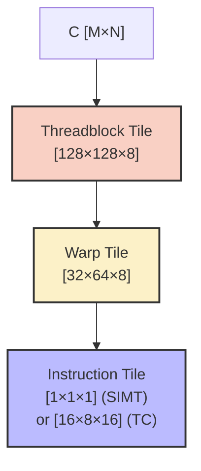

## 楔子：手写 GEMM 的尽头，模板抽象的起点

在 `04_GEMM_Optimization` 中，80 行精心优化的 Register Tiling 跑出了 28.79 TFLOPS。在 `09_Tensor_Core` 中，Naive WMMA 轻松达到 30.5 TFLOPS。但 cuBLAS 的 57.48 TFLOPS 仍然远在天上——它多出的 **100%** 性能来自哪里？

答案是**多级流水线 + SMEM Double Buffering + 编译期布局代数 + SASS 级调优**。要手工实现这些，代码量会膨胀到数千行，可维护性趋近于零。

**CUTLASS（CUDA Templates for Linear Algebra Subroutines）** 是 NVIDIA 的解法：用 C++ 模板元编程将 GEMM 分解为可组合的层级抽象——Threadblock、Warp、Instruction 三级 Tiling + Epilogue 融合。换个模板参数就能从 SIMT 切到 Tensor Core、从 FP32 切到 FP16——**而底层展开的 Kernel 性能达到 cuBLAS 的 96.3%**。

CUTLASS 3.x 更引入了 **CuTe（CUDA Templates for Elegant）**——一套代数化的布局系统，让开发者用 `Layout<Shape, Stride>` 描述任意多维张量，编译器自动推导出零开销的 1D 偏移计算。

---

## 第一性原理：GEMM 的层级分解

### 三级 Tiling 的数学基础

一个 $C_{M \times N} = A_{M \times K} \times B_{K \times N}$ 的 GEMM 被分解为：

**Level 1：Threadblock Tile** $[T_M, T_N, T_K]$

- 每个 Threadblock 负责 C 的一个 $T_M \times T_N$ 输出块
- K 维度以步长 $T_K$ 迭代，每步将 A 的 $T_M \times T_K$ 和 B 的 $T_K \times T_N$ 加载到 Shared Memory

**Level 2：Warp Tile** $[W_M, W_N, W_K]$

- Block 内的每个 Warp 负责 C Tile 的一个 $W_M \times W_N$ 子块
- 从 Shared Memory 加载到寄存器，执行 MMA 指令

**Level 3：Instruction Tile** $[I_M, I_N, I_K]$

- 最底层的硬件指令粒度
- SIMT: $[1, 1, 1]$（FMA），TensorOp: $[16, 8, 16]$（HMMA）



### CuTe Layout 代数

CuTe 的核心是 **Layout = (Shape, Stride)** 元组：

$$\text{offset}(i, j) = i \times \text{stride}_0 + j \times \text{stride}_1$$

- **行主序**（Row-Major）：`Layout<Shape<M, N>, Stride<N, 1>>` → $\text{offset}(i,j) = i \times N + j$
- **列主序**（Col-Major）：`Layout<Shape<M, N>, Stride<1, M>>` → $\text{offset}(i,j) = i + j \times M$
- **转置**：交换 Shape 和 Stride 的顺序即可——**零运行时开销**

CuTe 的革命性在于：**所有 Shape 和 Stride 都是编译期常量（static integers）**。乘法和取模在编译期完成，运行时只剩下基地址加减——这就是 CuTe 能做到"零偏移计算开销"的原因。

---

## 核心优化演进与架构抽象

### CUTLASS 四大金刚

| 抽象层 | 职责 | 性能关键点 |
|:---|:---|:---|
| **Mainloop (Threadblock)** | Global → Shared Memory 数据搬运 | Double Buffering、`cp.async` |
| **Warp-Level** | Shared → Register、发射 MMA | `ldmatrix`、Warp 级调度 |
| **Instruction-Level** | 硬件指令执行 | SIMT FMA / Tensor Core HMMA |
| **Epilogue** | 收尾计算 + 写回 Global | BiasAdd、GELU 融合 |

### Double Buffering 的时序重叠

```mermaid
gantt
    dateFormat s
    title GEMM Mainloop: Double Buffering 流水线

    section SMEM Buffer A
    Load Tile k=0 :a0, 0, 1s
    Load Tile k=2 :a2, 2, 1s
    Load Tile k=4 :a4, 4, 1s

    section SMEM Buffer B
    Load Tile k=1 :b1, 1, 1s
    Load Tile k=3 :b3, 3, 1s

    section Compute
    MMA (k=0) :c0, 1, 1s
    MMA (k=1) :c1, 2, 1s
    MMA (k=2) :c2, 3, 1s
    MMA (k=3) :c3, 4, 1s
```



Buffer A 加载 k=0 时，Compute 空闲。k=0 加载完成后，Buffer B 开始加载 k=1，同时 Compute 开始处理 k=0 的数据——**加载和计算完全重叠**。这是 CUTLASS 达到 cuBLAS 96% 性能的核心秘密之一。

---

## 源码手术刀：关键代码深度赏析

### CUTLASS GEMM 的极简模板实例化

```cpp
#include <cutlass/gemm/device/gemm.h>

using GemmType = cutlass::gemm::device::Gemm<
    float,                          // ElementA
    cutlass::layout::ColumnMajor,   // LayoutA
    float,                          // ElementB
    cutlass::layout::ColumnMajor,   // LayoutB
    float,                          // ElementOutput
    cutlass::layout::RowMajor,      // LayoutC
    float,                          // Accumulator
    cutlass::arch::OpClassSimt,     // SIMT (CUDA Core) 或 TensorOp
    cutlass::arch::Sm89,            // 架构目标
    cutlass::gemm::GemmShape<128, 128, 8>,  // Threadblock Tile
    cutlass::gemm::GemmShape<32, 64, 8>,    // Warp Tile
    cutlass::gemm::GemmShape<1, 1, 1>,      // Instruction Tile
    cutlass::epilogue::thread::LinearCombination<float, 1, float, float>
>;

// 只需 3 行即可运行：
GemmType gemm_op;
GemmType::Arguments args({M, N, K}, {A, lda}, {B, ldb}, {C, ldc}, {D, ldd}, {alpha, beta});
gemm_op(args);  // 内部展开为数千行优化后的 SASS
```

**设计决策解读**：

- `OpClassSimt` → CUDA Core 标量 FMA。切换为 `OpClassTensorOp` + 修改 Instruction Tile 为 `GemmShape<16, 8, 16>` 即可自动使用 Tensor Core
- `GemmShape<128, 128, 8>` → 每个 Block 计算 C 的 $128 \times 128$ Tile，K 维度步长 8。增大 $T_K$ 会增加 SMEM 占用但减少 K 循环次数
- `LinearCombination` → $D = \alpha \cdot A \cdot B + \beta \cdot C$。可替换为 `LinearCombinationRelu` 实现 Epilogue 融合

### CuTe Layout 运行时零开销验证

```cpp
#include <cute/layout.hpp>

// 定义 3×4 列主序 Layout
using LayoutType = cute::Layout<cute::Shape<cute::_3, cute::_4>,     // 3 行 4 列
                                 cute::Stride<cute::_1, cute::_3>>;   // 列内步长 1, 跨列步长 3

// 编译期计算偏移
auto layout = LayoutType{};
int offset = layout(1, 2);  // = 1*1 + 2*3 = 7  (编译期常量!)
```

CuTe 的 `_3`、`_4` 是 `cute::Int<3>`、`cute::Int<4>` 的别名——**编译期整数**。所有的乘法和加法在模板实例化时完成，最终 PTX 中只有一条 `ADD` 指令。

---

## 理论与实际的对决：极限剖析

> **测试环境**：NVIDIA GeForce RTX 4090 × 2（sm_89），Linux，nvcc -O3
> **理论峰值**：FP32 ~82.6 TFLOPS，FP16 TC ~165 TFLOPS（无稀疏），~330 TFLOPS（含稀疏）

### CUTLASS SIMT GEMM vs cuBLAS（2048 × 2048，20 次平均）

| 版本 | Kernel (ms) | 算力 (TFLOPS) | vs cuBLAS |
|:---|:---:|:---:|:---:|
| cuBLAS `cublasSgemm` | 0.30 | 57.48 | 100% |
| **CUTLASS SIMT** | **0.31** | **55.35** | **96.3%** |

### CUTLASS Tensor Core（2048 × 2048，实测问题分析）

| 版本 | 状态 | 算力 |
|:---|:---|:---:|
| cuBLAS Tensor Core | ✅ 正常 | **157.07 TFLOPS** |
| CUTLASS TensorOp | ❌ `Error Internal` | N/A |

**故障分析**：CUTLASS 的 TensorOp 模板在 sm_89（Ada Lovelace）上返回 `Error Internal`。可能原因：

1. **Warp Shape 不匹配**：sm_89 的 Tensor Core 支持特定的 MMA Shape（如 m16n8k16），CUTLASS 模板的 Warp Tile 配置可能不在支持列表中
2. **SMEM 大小超限**：复杂的 Double Buffering 策略可能要求超过 48KB 的 SMEM
3. **Layout 约束违反**：TensorOp 模式要求 A/B 的存储布局严格对齐特定模式

**这恰恰反映了 CUTLASS 的工程现实**：模板参数的组合空间巨大，但只有特定组合在特定架构上合法。NVIDIA 通过 `cutlass_profiler` 工具提供了自动搜索合法配置的能力。

### CuTe Layout 验证

```text
Layout<Shape<_3, _4>, Stride<_1, _3>> → Col-Major
Index(1, 2) 的一维偏移 = 7  ✓
循环遍历: 0, 4, 8, 1, 5, 9, 2, 6, 10, 3, 7, 11  (列优先序) ✓
```

---

## 架构师视角的总结

### 铁律一：CUTLASS 是"开源 cuBLAS"——96% 性能 + 100% 定制自由

cuBLAS 是黑盒——你无法修改它的 Epilogue、无法融合自定义激活函数、无法调整 Tile Size。CUTLASS 让你修改任何一层的行为，同时保持接近 cuBLAS 的性能。FlashAttention、xFormers、Triton 的底层都大量使用 CUTLASS 或受其启发。

### 铁律二：CuTe 是多维张量编程的范式转换

告别 `offset = b * H * W * C + h * W * C + w * C + c` 这种手工偏移计算。CuTe 的 `Layout<Shape, Stride>` 通过编译期代数推导，将多维索引自动转换为零开销的 1D 偏移。**这不是语法糖——它彻底消除了一类最常见的 GPU Kernel Bug（偏移计算错误）**。

### 铁律三：模板参数不是随便填的

CUTLASS 的模板参数空间巨大（Tile Size × Data Type × Layout × OpClass × Arch），但只有少数组合在特定硬件上合法。TensorOp 模式在 sm_89 的 Error Internal 就是典型案例。**使用 CUTLASS 前，先用 `cutlass_profiler` 搜索合法配置**，而非盲目设置参数。
