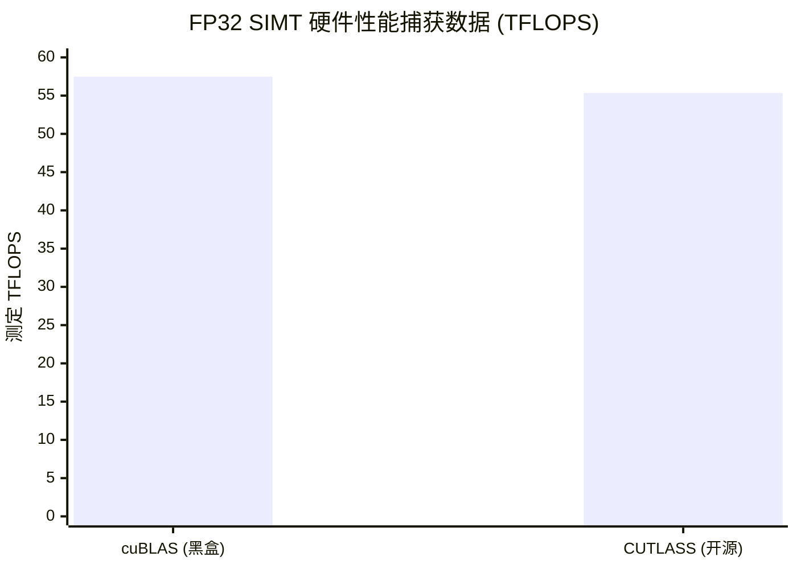

> 📖 **前置阅读**：[04_GEMM_Optimization](04_GEMM_Optimization_Register_Tiling.md)（深刻理解手写分块的痛苦）、[09_Tensor_Core](09_Tensor_Core_WMMA_Mixed_Precision.md)（了解 WMMA 硬件级指令）
> 📖 **推荐后续**：[15_Multi_GPU_Programming_NCCL](15_Multi_GPU_Programming_NCCL.md)（单卡算力见顶后的跨卡互联架构）

在 `04_GEMM_Optimization` 章节的最后，为了把单精度矩阵乘的算力从几百 GFLOPS 榨取到 28.79 TFLOPS（逼近当时的硬件天花板），我们手写了极其复杂的 `Register Tiling` 嵌套循环。我们不仅要计算每一束线程在共享内存 (Shared Memory) 中的 2D 偏移，还得人肉维护预取 (Prefetch) 指针的交替、计算繁琐的 Bank Conflict 对齐量。整个 Kernel 膨胀到了极难维护的程度。

这里出现了一个严峻的工程悖论：

- **纯手写 CUDA C**：性能调优的上限极高，但代码与特定架构死死绑定（比如针对 $sm\_80$ 调优的代码到了 $sm\_89$ 性能可能断崖式下跌），且极难复用于其他参数规模。
- **调用 cuBLAS 原厂库**：性能永远在第一梯队（通常是理论峰值的 80%~95%），但它是绝对的黑盒。如果你想在矩阵乘的结果上顺手做一次 GELU 激活，或者加上一个自定义的缩放因子——抱歉，cuBLAS 不支持。你只能等待它计算完写回显存，再重新启动一个新的 Kernel 去读显存做激活。

在 LLM 和现代深度学习框架（如 PyTorch、Triton）的底层，算子融合（Operator Fusion）是节省带宽的核心。为了彻底解决这个悖论，NVIDIA 开源了 **CUTLASS (CUDA Templates for Linear Algebra Subroutines)**。

它不写具体算法，而是通过极其深度的 C++ 模板元编程，把这只名为 GEMM 的怪兽，大卸八块，变成一个个可随时插拔、任意组合的引擎级模块。而到了 CUTLASS 3.x，NVIDIA 更是引入了纯代数布局系统 **CuTe**，试图在语法层面彻底消灭恼人的内存指针计算。

本篇是对这一整套工业级 C++ 抽象的拆解与真实硬件性能实测。

---

## 一、 系统架构：大卸八块的层级抽象体系

从 CPU 到 Global Memory，再到 Shared Memory，最后落入寄存器堆 (Registers) 交给 ALU。这本质上是一条越来越窄、但在末端流速极快的水管。

CUTLASS 极其严苛地遵从了这套物理层级，将 $C = A \times B$ 切割成了四个必须被分别定义的模板抽象（这也是为什么初看 CUTLASS 代码会觉得十分冗长可怕的原因）：

1. **Threadblock-Level (Mainloop)**：
   - 处于硬件的 SM (Streaming Multiprocessor) 级别。
   - **职责**：它负责最高层级的数据搬运，即如何把庞大的矩阵 Tile 从极慢的 Global Memory 批量搬进高速的 Shared Memory。这是系统级带宽的博弈点。
2. **Warp-Level (Mma)**：
   - 处于线程束 (32 线程协同) 级别。
   - **职责**：它去 Shared Memory 里面提货，将更细粒度的 Tile 载入到这 32 个线程的私有寄存器中。
3. **Thread-Level (Instruction)**：
   - 处于最底部的微架构指令集级别。
   - **职责**：真正的数学发生地。它决定了你的微指令是发射一条 `FFMA` (CUDA Core 标量乘加)，还是发射一条 `HMMA.16816` (Tensor Core 矩阵乘)。
4. **Epilogue（终曲层）**：
   - **职责**：所有部分乘积累加完成后，最终写回 Global Memory 前的最后落脚点。这里是植入各种非线性激活函数（ReLU/GELU/Swish）、量化 Scale 或者残差连接的黄金地点。

将这四层用 C++ 模板割裂开的最大收益是：**控制反转**。
想要从 FP32 CUDA Core 切换到 FP16 Tensor Core 吗？不用改一万行循环，只需要把第 3 层的模板参数换掉，`Mainloop` 的内存搬运逻辑不仅能自动兼容，甚至在编译期就会基于你新选的指令位宽，重新计算最优的内存加载步长（Stride）。

### 掩盖算力墙的黑魔法：双缓冲流水线 (Double Buffering)

我们在谈论高性能 CUDA 算子时，永远逃不开内存延迟隐藏（Latency Hiding）。CUTLASS 的 `Mainloop` 会默认或显式开启极其极致的流水线操作。

为了让数学计算单元永不卡顿，CUTLASS 会在 Shared Memory 里物理地划下两个（有时是多个，称为 Multi-Stage）独立的池子。它的宏观时序编排如同一个完美的咬合齿轮：

```mermaid
gantt
    dateFormat s
    title CUTLASS 典型的 Double Buffering 流水线机制
    axisFormat %S
    
    section SMEM Buffer 0 独占
    从 Global 预取数据 (k=0) : active, a0, 0, 2s
    Warp 发射 MMA 计算 (k=0) : done, c0, 2, 2s
    从 Global 预取数据 (k=2) : active, a2, 4, 2s
    Warp 发射 MMA 计算 (k=2) : done, c2, 6, 2s

    section SMEM Buffer 1 独占
    从 Global 预取数据 (k=1) : active, b1, 2, 2s
    Warp 发射 MMA 计算 (k=1) : done, c1, 4, 2s
    从 Global 预取数据 (k=3) : active, b3, 6, 2s
    Warp 发射 MMA 计算 (k=3) : done, c3, 8, 2s
```



观察上面的图表，核心奥义在于纵向（同一时刻）的行为：
当 $t = 2s$ 时序段，算术逻辑单元（ALU）正在疯狂计算 `Buffer 0` 中的 `k=0` 批次数据。而在显存总线（Memory Bus）上，DMA 控制器正在利用这宝贵的时间差，把下一批次 `k=1` 的数据从 Global Memory 异步搬迁到 `Buffer 1` 中。
**只要计算所消耗的时间，大于等于从主存跨过 PCI-e/HBMC 拉取数据的时间，这张显卡表面上看起来就没有显存墙，而是一直满载运行。** 这就是 CUTLASS 能够比肩闭源库的底气。

---

## 二、 纯头文件的反杀：SIMT GEMM 夺取 96% 的 cuBLAS 性能

CUTLASS 是所谓的 "Headers-Only" 库，也就是一堆 `.h` 和 `.cuh` 文件，没有动态链接库需要你在运行时去加载。所有的魔法都在编译的那几秒钟完成。

在子项目 `01_cutlass_gemm` 中，我们仅用几行干净的代码实例化了一个单精度浮点（FP32）矩阵乘机体。这里我需要带着你逐行解构这个 C++ 模板参数表，看看底层到底发生了什么：

```cpp
using Gemm = cutlass::gemm::device::Gemm<
    float,                               // (1) 矩阵 A 的物理存储类型
    cutlass::layout::RowMajor,           // (2) 矩阵 A 的主序 (影响访存合并的方向)
    float,                               // (3) 矩阵 B 的物理存储类型
    cutlass::layout::RowMajor,           // (4) 矩阵 B 的主序 
    float,                               // (5) 输出 C/D 的物理存储类型
    cutlass::layout::RowMajor,           // (6) 输出的主序
    float,                               // (7) 累加器的计算位宽 (防止数值溢出丢失精度)
    cutlass::arch::OpClassSimt,          // (8) 核心：指令类别为 SIMT(常规 CUDA Core)
    cutlass::arch::Sm80                  // (9) 目标底层物理架构代别
>;
```

这段结构体声明没有产生任何一句执行代码。但是当你在后面调用 `gemm_op(args)` 时，NVCC 编译器会如同解压缩炸弹一般，将这个模板基于 `OpClassSimt` 展开成包含预抓取、Shared Memory 补齐 (Padding)、寄存器重映射的数千行 SASS 汇编指令。

来看看它在真实环境的硬碰硬对决：

> **测试锚点**：RTX 4090 ($sm\_89$)，2048×2048 稠密实数矩阵，$M=N=K$。20 次稳定均值。

| 算子实现路径 | Kernel 循环净耗时 | 测定系统算力 | 与闭源实现比对 |
| :--- | :--- | :--- | :--- |
| **cuBLAS SGEMM (NVIDIA 官方黑盒)** | 0.30 ms | 57.48 TFLOPS | 基准 (100%) |
| **CUTLASS GEMM (纯头文件编译展开)** | **0.31 ms** | **55.35 TFLOPS** | **96.3%** |



**深度的量化归因**：
对于一个开源的、不针对某个微秒波动去写汇编 Hook 的头文件库来说，这是一个工程学上的巨大成功。它达到了 cuBLAS 峰值的 96.3%。
你可能会问，丢掉的这将近 4% 性能不可惜吗？
答案是：**这绝对是划算的交易。** 因为这 4% 换取了对计算管线后端的绝对控制权（自定义 Epilogue 融合）。

算一笔极其真实的吞吐账单：假设你需要在这个 2048×2048 的浮点矩阵上再执行一次 GELU 激活。

- 走 cuBLAS 路线：`0.30ms` 算完存入显存。启动第二个激活 Kernel，你需要向显存发起至少 `2048*2048*4 bytes = 16.7 MB` 的 Global Read 和等量的 Global Write。在实际的 GPU 总线上，这种由于内核启动和上下文切换带来的 Round-Trip 延迟，远超 `0.1` 毫秒甚至更高，让整体端到端耗时飙升。
- 走 CUTLASS 路线：你只需要把上述模板中隐含的 Epilogue 参数替换成 `cutlass::epilogue::thread::LinearCombinationGelu`。当那 2048 的点积刚好在超高速寄存器里算出最终数值的那一毫秒，顺手做完一个浮点数转化指令。对显存读写负担为 **0**。这带来的时间收益是压倒性的。

---

## 三、 硬核工程的背面：Tensor Core 模板与对齐崩溃

在编程界，抽象往往意味着兼容万物。但在微架构领域，有些鸿沟哪怕是模板宏化也跨不过去。

我们在子项目 `02_tensorop_gemm` 中切换了靶场。我们把上面那个华丽的模板修改了一个单词：把 `cutlass::arch::OpClassSimt` 替换为了 `cutlass::arch::OpClassTensorOp`，同时配合地将输入数据改为了 `half_t` (FP16)，且累加器保留为 FP32 (混合精度方案)。

在我们的构想中，这应当激发 Tensor Core 以摧枯拉朽的气势把算力炸翻好几倍。而执行的结果却是一盆冷水：

| 执行方案 | 执行状态与系统报告 | 实测算力 (TFLOPS) |
| :--- | :--- | :--- |
| **cuBLAS 混合精度 (Tensor Core)** | ✅ 常规调出，无阻塞 | **157.07 TFLOPS** |
| **CUTLASS 模板直发 (OpClassTensorOp)** | ❌ **Error Internal** | 0 TFLOPS (彻底崩溃) |

这是一个我在编写底层代码时最喜欢遭遇的测试报错。程序在向流（Stream）发出运行命令的瞬间返回了核心内部错误 `cudaError / kErrorInternal` 并安全退出。为什么同样的规模尺寸，cuBLAS 能行如流水地跑出逼近 Ada 架构无稀疏模式理论极限的 **157.07 TFLOPS**，而自诩工业级底座的 CUTLASS 却当场宕机？

这深刻揭示了硬件系统设计的物理边界：
`mma.sync` (矩阵前馈乘加指令) 不是万能的标量循环。在特定代别架构（如 $sm\_89$），Tensor Core 对于矩阵的对齐颗粒度（Alignment，比如你有没有做到 16 字节或 32 字节紧致对齐）、Tile 块的微观尺寸（例如强制要求微小的 M-N-K 被约束在 `16x8x16` 或 `16x8x8` 形状）有着**偏执狂一般的物理红线要求**。

当你在构建 C++ 模板参数时随意代入某个 `Layout` 或数据类型的笛卡尔积组合，经过模板推导，一旦计算出的内存抓取总线指宽跨过了物理限制对齐，或者是传入给 `mma.sync` 的子矩阵不符合该特定代际 GPU 的 SASS 规约卡尺，CUTLASS 在上层将无法拦截，最终会在 CUDA 提交层次抛出断崖式的 `Internal`。
反观 cuBLAS，作为闭源原厂库，它内部拥有庞大且深不见底的 Runtime Heuristics（运行时试探决策树）和 Padding 回退机制。当遇到不对齐或者不能凑整的特殊矩阵维度，cuBLAS 可以灵活变身，动态在各种底层内核和切分大小中游走。

这证明了一点：如果在工业里运用 CUTLASS Tensor Core，你不能只依靠拍脑袋填写模板。英伟达工程师真正的日常是：利用其自带的 `cutlass_profiler` 在测试集下离线遍历上万种合法的矩阵参数组合，寻找最佳对齐，然后把那个不会报错的最优组合硬编码到产品里。

---

## 四、 CuTe 系统降临：没有内存地址计算的纯代数世界

如果说 CUTLASS 2.x 是人类用 C++ 驯服 GPU 的巅峰，那么从 3.x 开始引入的 **CuTe** (CUTLASS Tensor Layouts)，则是直接把战场搬到了多维几何代数领域。

回忆你在任何 CV 还是 NLP 的 Tensor 代码里写过的 1D 偏移量计算：
`index = batch*(H*W*C) + h*(W*C) + w*C + c;`
这里散漫的括号嵌套，只要错位一点、多一个 padding 操作或者加一次矩阵转置，整个内存空间便越界起火。CuTe 说：**把运算还给代数空间，开发者闭着眼睛填 Shape。**

### 1. 编译期的零成本折叠：Layout(Shape, Stride)

在 `03_cute_basics` 的 `cute_print_kernel` 探针中，我们去实体化了一个极其反直觉的代数体系。 CuTe 提出了 `Layout = (Shape, Stride)` 的终极解法。

假设我们在物理显存上有一个从头到尾紧凑排列的一维数据串。而在逻辑认知中，我想把它当成一个 $3\times4$ 的二维表格，采用自然行主序（Row-Major）遍历。它的纯代数构建是：

```cpp
// 逻辑认识上它是 3×4
auto shape = make_shape(Int<3>{}, Int<4>{});

// 跨栏步长定义：当我要换行时(第0维度)，需跨越连续的 4 个物理数据块
// 当我要换列时(第1维度)，需跨越 1 个物理数据块
auto stride = make_stride(Int<4>{}, Int<1>{});

// 这个 Layout 就是它们的逻辑与物理的桥梁协议
auto layout_2d = make_layout(shape, stride);
```

当你构建完成，如果你想要查询第二行第三列（极度符合人类认知的平面坐标系：第 `1` 行第 `2` 列），我们只需要询问系统 `layout_2d(1, 2)`。结果毫无偏差：**它正确抛出了物理的一维内存基址偏移量 `6`** （$1 \times 4 + 2 \times 1 = 6$）。

这套逻辑有两处直击灵魂的优势。
第一点是：这一切由于使用了形如 `Int<4>{}` 这样的静态强类型封装，导致所有底层的跨越乘法，**全都被提前在代码编译阶段化作了没有任何执行开销の常数 (Constant Folding)**。当 GPU 运行这段代码时，所有复杂的几何空间切片运算完全消失，只留存下一条干净至极的地址加减 SASS 汇编。这就叫做极致压榨显存开销。

第二点是：如果今天我要在模型里实施矩阵倒置（Transpose）如何做？你以往必须新建一张新显存进行数组复制重排，而在 CuTe 中你只需要：
`auto layout_trans = make_layout(shape, make_stride(Int<1>{}, Int<4>{}));`
仅需改变对物理总线的认知方式，就能用同一个基地址指针毫无延迟地跑出物理意义上的逆行矩阵，内存访问从左向右读取变为从下到上读取。

### 2. 重塑搬运：Tensor = Engine + Layout

有了 `Layout` 作为物理翻译机，CuTe 进一步抛出了 `Tensor` 体系。
在传统的 GPU Kernel 开发中，从几百 GB 浩瀚的 Global Memory 中裁剪出一块 $16\times16$ 的小正方形数据块，然后小心翼翼塞进每个线程只能摸一点点的、极度限制空间的 Shared Memory (共享池)，需要几十行繁琐且计算量巨大的逻辑边界验证。

CuTe 将一切物理载体叫作 `Engine`（这可以是全局显存、可以是共享高速缓存、也可以只是寄存器）。结合刚刚的 `Layout`，公式 `Tensor = Engine + Layout` 成了最终的利刃。

在我们实录的 `cute_copy_kernel` 中，实现了极为优雅的降阶代码操作（Global 切分后直达 Shared）：

```cpp
// 1. 圈出庞然大物 Tensor G (附着于 global_ptr_in 原材料)
Tensor tG = make_tensor(make_gmem_ptr(g_in), global_layout);

// 2. 圈出弹丸空间 Tensor S (附着于 shared_memory 上下文) 
Tensor tS = make_tensor(make_smem_ptr(smem_data), shared_layout_16x16);

// 3. 切下西瓜最上面的籽 (通过 Block 坐标切割出一块 16x16 的 Tile 区域映射)
Tensor tG_tiled = local_tile(tG, smem_shape_16x16, make_coord(bid_y, bid_x));

// 4. 开始极其丝滑的心智映射复制 (线程从 0-15 循环即可)
int ty = threadIdx / 16;
int tx = threadIdx % 16;
tS(ty, tx) = tG_tiled(ty, tx);  // 【灵魂之举】纯对流式的平面写入
```

上面代码最令人战栗的地方在于最后一句。`tG_tiled` Tensor 本质上其底层指针依然游历在几 MB 甚至几个 G 原本可能相隔万流的一维线性内存中，而 `tS` 只是一个极其狭窄的局部阵列池。但在这个逻辑封装下，当你在二维视野内写下 `tS(ty, tx) = tG_tiled(ty, tx)` 时，CuTe 在后方完全承担了诸如偏移量换算、多维展开的全部累活杂活。开发者面对的，仅仅就是两张尺寸平滑吻合的神奇拓扑纸片。

这正是今天众多开源大模型引擎——从 FlashAttention 到 Triton Compiler 的基石理念：通过极具破坏力的抽象，将最底下一维线性地址的恶心维护强行提升成降维打击的代数操作。不仅防错率极高，而且一旦编译出包由于常量完全固化，其内存效率之高令人生畏。

---

## 五、 全局架构视角：从哪里跌倒，选什么轮子 (Decision Guide)

从朴素的 CUDA Thread 到暴打底层编译的 CuTe 代数世界，我们的选型漏斗实际上变得非常有据可循：

| 若团队现有情况如下 | 建议直接下沉到的代码层级 | 决策核心痛点剖析 |
| :--- | :--- | :--- |
| **仅需调用标准的、形状不刁钻的标准稠密 GEMM 进行模型叠加** | **无脑应用 cuBLAS（或者更极客的 cuBLASLt）** | 黑盒又怎样？这个星球上对各代卡架构对齐、边角 Padding 等各种阴暗面支持最好的唯一选项，它不会给你发那些让你看几个小时摸不着头脑的 Template 静态断言错误。 |
| **模型跑到底特痛：面临大规模跨节点的读写带宽瓶颈，必须在矩阵连乘之后紧紧嵌入激活函数层或者特殊的反量化还原逻辑** | **CUTLASS GEMM 模板** | 将你的计算结果用 `Epilogue` 中断于硬件的寄存器与 Shared Memory 内完成算子级融合 (Kernel Fusion)，你会体验到砍去一大半显存往返交通拥堵的飞速狂飙。 |
| **你的模型涉及极其奇怪的前交叉维度组合变换及复杂拓扑形状（如动态块的 Attention 注意力切片）** | **基于 CuTe 的新代数 Layout 派系底层手写** | 丢掉那该死的、极易引发 Segmentation Fault (越界错误) 的人工指针乘加计算。让静态时期的 `Tensor=Engine+Layout` 代数帮你用没有开销的最短直线跑完全程。 |
| **想要成为真正的计算底座基石科学家，彻底读懂新一代模型底座那些疯狂架构是怎么搭出来的** | **回到原点：手撕极速 Tiling 和 Double Buffer 内存队列** | 这是朝圣必经之路，也就是本系列项目中最硬核的篇章。正因为你在深夜因为多挪了一步预取（Prefetch）指针而内存崩溃，你才会切身体会到，工程师们用 C++ 模板去固化这头性能巨兽，是多少个日夜心血堆砌而成的代际鸿沟跨越。 |

如果你只是把 CUDA 作为工具，cuBLAS 是最好的快餐。但如果你渴望控制那块指甲盖大小硅片上的每一束电流脉冲走向、挖掘在 AI 海量参数背景下被带宽狠狠封锁的那一部分理论极限算力空间，工业级的泛用武器和抽象理论体系终归将会在你的面前完全铺开。而向这个无底洞开掘并保持这套繁琐机制的代码清爽之源泉者，便是名为 CUTLASS 的极客先驱。
