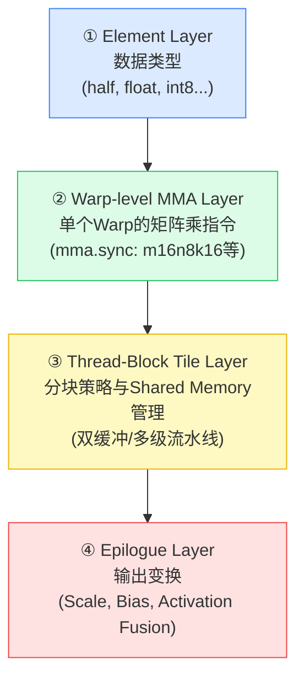

> 📖 **前置阅读**：[04_GEMM_Optimization](04_GEMM_Optimization_Register_Tiling.md)（深刻理解 Register Tiling 与双缓冲）、[09_Tensor_Core](09_Tensor_Core_WMMA_Mixed_Precision.md)（WMMA 接口）
> 📖 **推荐后续**：[15_Multi_GPU](15_Multi_GPU_NCCL_AllReduce.md)（单卡优化到多卡通信）

在第 04 篇中，我们手写了 8×8 Register Tiling GEMM，达到了约 28.79 TFLOPS——cuBLAS 的 50%。我们分析了差距来自 Bank Conflict、缺少双缓冲、以及无法触及的 SASS 级精调。

如果我们想继续追赶，手工维护以上三个方向同时的代码将不可避免地陷入复杂性爆炸：光是双缓冲 + 正确的 Bank Conflict Padding + Tensor Core 调用，代码量就会从几百行膨胀到数千行，而且一旦需要切换精度或 GPU 架构，几乎等于重写。

这正是 **CUTLASS（CUDA Templates for Linear Algebra Subroutines）** 的设计出发点：用一套严谨的 C++ 模板层次，将"如何分块"、"什么硬件指令"、"如何调度流水线"三件事解耦，让每一层都可以独立替换，同时保持接近汇编级的性能。

---

## 一、为什么我们需要 CUTLASS？

### 手写 GEMM 的可维护性危机

考虑一个现实问题：你为 Ampere 的 A100 写了一个高性能 FP16 GEMM，现在需要移植到 Hopper H100，同时支持 FP8 精度。变化点包括：

- 数据类型：`half` → `__nv_fp8_e4m3`
- 最优 Tile 大小：可能从 128×128 变为 256×128
- 矩阵硬件指令：`mma.sync.m16n8k16` → Hopper 的 `wgmma`
- 流水线阶段：双缓冲 → 多级流水线（k=4 或更高）

如果一切都是手写的标量循环，每个变化都需要大范围重构。而 CUTLASS 的设计目标是：**核心逻辑只需改动模板参数**，编译器会自动生成正确的底层代码。

### CUTLASS 的定位

CUTLASS 本质上是一个**代码生成模板库**。用户以模板参数的形式声明意图（用什么精度、什么 Tile、什么硬件指令），CUTLASS 在编译时展开出对应的高性能 Kernel。这与 cuBLAS 的黑盒不同：cuBLAS 内部同样使用 CUTLASS-like 的设计，但对用户不透明且不可修改。

CUTLASS 的典型应用场景：

- 需要**自定义 Epilogue**（例如 fused GEMM + Swish + LayerNorm）
- 需要支持**非标准精度**或**非标准矩阵形状**
- 需要在自研推理引擎中嵌入高性能算子
- 研究 Tensor Core 调度细节、流水线设计

---

## 二、四层抽象体系：硬件到算法的解耦

CUTLASS 将 GEMM 计算分解为四个层级，每一层只关心自己的职责：



**层级一：Element（元素类型）**  
定义矩阵的数值精度：`cutlass::half_t`、`float`、`int8_t`、`cutlass::tfloat32_t` 等。切换精度只需修改这一个模板参数。

**层级二：Warp-level MMA**  
定义单个 Warp 执行的矩阵乘指令形状（`m`, `n`, `k`），直接对应底层 PTX 的 `mma.sync.aligned` 指令。CUTLASS 提供了对不同 GPU 架构指令的封装：

| 架构 | 典型 MMA 形状 | 对应 PTX |
| :--- | :---: | :---: |
| Volta (sm_70) | m8n8k4 (FP16) | `mma.sync.m8n8k4` |
| Turing (sm_75) | m16n8k8 (FP16) | `mma.sync.m16n8k8` |
| Ampere (sm_80) | m16n8k16 (FP16) | `mma.sync.m16n8k16` |
| Hopper (sm_90) | m64n8k16 (Warpgroup MMA) | `wgmma.mma_async` |

**层级三：Thread-Block Tile（主循环）**  
控制 Block 级别的分块大小（BM × BN × BK）以及 Shared Memory 的双缓冲/多级流水线调度。这是 CUTLASS 中最复杂的一层，也是性能差异最大的地方。

**层级四：Epilogue（尾声处理）**  
在 GEMM 计算完成后，对结果矩阵进行变换：缩放（Scale）、加 Bias、融合激活函数。Epilogue 层是 CUTLASS 实现算子融合（Fused GEMM）的核心接入点。

### 一个完整的 CUTLASS GEMM 声明示例

```cpp
#include "cutlass/gemm/device/gemm.h"

using ElementA = cutlass::half_t;           // 层级一：A 矩阵精度
using ElementB = cutlass::half_t;           // 层级一：B 矩阵精度
using ElementC = float;                     // 层级一：累加器精度

// 层级三：Block 分块策略
using ThreadblockShape = cutlass::gemm::GemmShape<128, 128, 32>;
// 层级二：Warp 分块（对应 mma.sync 调用粒度）
using WarpShape = cutlass::gemm::GemmShape<32, 32, 32>;
// 层级二：底层 MMA 形状
using InstructionShape = cutlass::gemm::GemmShape<16, 8, 16>;

// 层级四：标准化 Epilogue（C = alpha * GEMM(A,B) + beta * C）
using EpilogueOp = cutlass::epilogue::thread::LinearCombination<
    ElementC, 128 / cutlass::sizeof_bits<ElementC>::value,
    float, float>;  // 累加器类型 float

using Gemm = cutlass::gemm::device::Gemm<
    ElementA, cutlass::layout::RowMajor,     // A: FP16, 行主序
    ElementB, cutlass::layout::ColumnMajor,  // B: FP16, 列主序（转置）
    ElementC, cutlass::layout::RowMajor,     // C: FP32, 行主序
    float,                                   // 累加器精度
    cutlass::arch::OpClassTensorOp,          // 使用 Tensor Core 路径
    cutlass::arch::Sm80,                     // 目标 Ampere 架构
    ThreadblockShape, WarpShape, InstructionShape,
    EpilogueOp,
    cutlass::gemm::threadblock::GemmIdentityThreadblockSwizzle<>,
    3>;  // Pipeline 阶段数（Multi-Stage，3 表示三级流水）
```

这段声明没有任何计算逻辑——编译器在看到这个类型时，已经知道如何生成完整的 GEMM Kernel。切换到 INT8 Tensor Core 只需将 `ElementA/B` 改为 `int8_t`，`OpClassTensorOp` 不变，编译器自动选择 `imma` 指令路径。

---

## 三、双缓冲流水线的精确原理

### 延迟气泡的物理根源

在标准 Tiled GEMM 中，每个 Tile 循环的时序是：

```
Load Tile i → sync → Compute Tile i → sync → Load Tile i+1 → ...
```

在 Load 阶段，SM 的所有 ALU（包括 Tensor Core）完全空闲；在 Compute 阶段，LSU（Load Store Unit）完全空闲。硬件的一半能力在任意时刻都是被浪费的。

双缓冲的思路是维护两组 Shared Memory 缓冲区，使得当 Tensor Core 在消费 Buffer 0 中的数据时，LSU 同时将下一批数据预取进 Buffer 1：

```mermaid
gantt
    dateFormat s
    axisFormat %S
    title CUTLASS 双缓冲流水线时序（理想稳态）

    section SMEM Buffer 0（偶数 Tile）
    预取 Tile k=0 : done, a0, 0, 2s
    MMA 计算 Tile k=0 : active, c0, 2, 2s
    预取 Tile k=2 : done, a2, 4, 2s
    MMA 计算 Tile k=2 : active, c2, 6, 2s

    section SMEM Buffer 1（奇数 Tile）
    预取 Tile k=1 : done, b1, 2, 2s
    MMA 计算 Tile k=1 : active, c1, 4, 2s
    预取 Tile k=3 : done, b3, 6, 2s
    MMA 计算 Tile k=3 : active, c3, 8, 2s
```



在稳态阶段，每个时间单位内同时有一个 Tile 在被 Tensor Core 计算，另一个 Tile 在被 LSU 从 Global Memory 拉取。理想情况下，两者时间相等，总 Kernel 时间缩短近一半。

### 多 Stage 流水线（Multi-Stage Prefetch）

双缓冲是 2 Stage 流水线的特例。在 Global Memory 延迟较高（RTX 4090 HBM 约 400 周期）而计算时间较短（Tensor Core 吞吐高）时，2 Stage 可能无法完全隐藏延迟。CUTLASS 支持 `Pipeline Stages = 3, 4, ...`，通过更多缓冲区在飞（In-Flight）来填满延迟管线。

注意：Pipeline Stages 越多，消耗的 Shared Memory 越多（$\text{Stages} \times (\text{SMEM}_A + \text{SMEM}_B)$），可能降低 Occupancy。在 CUTLASS 中，`Stages = 3` 是 Ampere 架构下 GEMM 的常用配置，因为它在延迟隐藏和寄存器/SMEM 压力之间取得平衡。

### 流水线调度的严格约束

CUTLASS 的主循环（`Mainloop`）代码直接体现了这种精确调度：

```cpp
// CUTLASS Mainloop 伪代码（3-Stage Pipeline）
CUTLASS_DEVICE void operator()() {
    // 阶段 0: 预取前 Stages 个 Tile
    for (int s = 0; s < Stages - 1; ++s) {
        prefetch_global_to_smem(smem[s], k = s);
    }
    pipeline_commit();  // cp.async完成

    // 主循环
    for (int k = 0; k < K_tiles; ++k) {
        int produce_buf = (k + Stages - 1) % Stages;
        int consume_buf = k % Stages;

        // 异步预取下一批（不阻塞）
        prefetch_global_to_smem(smem[produce_buf], k + Stages - 1);
        pipeline_commit();

        // 等待当前批次数据就绪
        pipeline_wait(consume_buf);

        // 从 SMEM 加载到寄存器，执行 Warp-level MMA
        load_smem_to_register(smem[consume_buf]);
        warp_mma();  // mma.sync 指令执行

        pipeline_release(consume_buf);
    }
}
```

这种调度要求程序员对每一个时钟周期的数据流向了然于胸，因此 CUTLASS 将其封装为 `PipelineState` 和 `PipelineAsync` 模板，而不需要用户直接操作。

---

## 四、CuTe：把多维索引变成代数运算

CUTLASS 3.x 引入了 **CuTe（CUDA C++ Tensor Library）**，将"多维张量如何映射到内存/寄存器"这件事从运行时的指针运算，变成编译期的代数计算。

### Layout 的代数语义

CuTe 的核心抽象是 `Layout`，它是一个从逻辑坐标到物理地址的**函数**：

$$\text{Layout} = (\text{Shape}, \text{Stride})$$

$$\text{offset}(\vec{c}) = \sum_{i} c_i \times s_i$$

其中 $\vec{c}$ 是逻辑坐标，$s_i$ 是各维度的步长（Stride）。

一个关键特性是：CuTe 的 Layout 可以**组合**（Composition）和**切分**（Slice），并且这些操作都在编译期完成，不产生任何运行时开销。

### 入门示例：从零构建 CuTe Tensor

```cpp
#include <cute/tensor.hpp>
using namespace cute;

// 示例 1：创建一个 4×8 的行主序矩阵 Layout
// Shape = (4, 8)，行主序的 Stride = (8, 1)：行步长=8，列步长=1
auto layout_rm = make_layout(make_shape(Int<4>{}, Int<8>{}),
                              make_stride(Int<8>{}, Int<1>{}));

// 访问元素 (2, 3) 的物理偏移
int offset = layout_rm(2, 3);  // = 2*8 + 3*1 = 19
// 编译期求值，offset 是一个编译期常量（若坐标也是编译期常量）

// 示例 2：创建一个列主序 Layout
// Shape = (4, 8)，列主序的 Stride = (1, 4)
auto layout_cm = make_layout(make_shape(Int<4>{}, Int<8>{}),
                              make_stride(Int<1>{}, Int<4>{}));
// 元素 (2, 3) 的物理偏移 = 2*1 + 3*4 = 14

// 示例 3：Tensor 包装原始指针
float* ptr = /* ... */;
auto tensor = make_tensor(ptr, layout_rm);

// 索引访问（与普通二维数组语法相同）
float val = tensor(2, 3);  // 等价于 ptr[layout_rm(2,3)] = ptr[19]
```

### Slice 与 Partition：自动计算线程负责的区域

CuTe 最强大的特性之一是 **Partition**：给定一个线程的坐标，自动计算该线程负责的逻辑子块，而无需手动计算偏移量：

```cpp
// 假设我们有一个 128×32 的矩阵（BM=128, BK=32）
// Block 内有 128 个线程（16行 × 8列的线程块）
auto M = Int<128>{}, K = Int<32>{};
auto A_smem = make_tensor(smem_ptr, make_layout(make_shape(M, K)));

// 定义 128 个线程覆盖矩阵的方式：
// 线程块布局 = 16×8，每个线程处理 8×4 个元素
auto thr_layout = make_layout(make_shape(Int<16>{}, Int<8>{}));
auto thr_tile   = make_layout(make_shape(Int<8>{},  Int<4>{}));

// partition_S：将矩阵 A 按照线程布局切分
// 返回 Tensor，其中第一维是当前线程的逻辑数据块
auto thr = threadIdx.x;
auto A_thr = local_partition(A_smem, thr_layout, thr);  // 当前线程的视图

// A_thr 的 Shape = (8, 4)，即线程负责的 8×4 子矩阵
// 所有的索引偏移都在编译期由 Layout 代数自动处理
```

这种设计消除了手写 GEMM 中大量的 `tid / TILE_WIDTH`、`tid % TILE_WIDTH` 等索引计算，既简化了代码，又避免了整数除法的额外开销。

### MMA Atom：寄存器的精确布局

WMMA 和 `mma.sync` 指令对输入 Fragment 的寄存器布局有严格要求（例如 m16n8k16 指令中，A 矩阵的 8 个 float16 必须分布在特定的 4 个寄存器中，对应 Warp 内特定 Lane 的行/列）。

在 CUTLASS 3.x 中，这些约束通过 **MMA Atom** 的 `MMA_Atom_Arch` 类型完全封装：

```cpp
// 选择 Ampere 的 FP16 MMA Atom
using MMA = decltype(make_tiled_mma(
    MMA_Atom<SM80_16x8x16_F32F16F16F32_TN>{},  // sm_80 指令语义
    Layout<Shape<_2, _2, _1>>{},                // Warp 的 MMA 排列
    Tile<_32, _32, _16>{}                       // Warp 负责的计算块
));

// 调用 MMA 执行计算
auto thr_mma = mma.get_slice(threadIdx.x);
auto A_reg = thr_mma.partition_A(A_smem);  // 自动从 SMEM 提取当前线程的 A Fragment
auto B_reg = thr_mma.partition_B(B_smem);
auto C_reg = thr_mma.partition_C(C_smem);

// 发射 MMA 指令
gemm(mma, C_reg, A_reg, B_reg, C_reg);
```

CuTe 的 MMA Atom 自动处理了 m16n8k16 的 Fragment 寄存器布局，用户无需查阅 PTX 手册了解每个 Lane 应该持有哪些数据。

---

## 五、CUTLASS SIMT vs Tensor Core GEMM：实测对比

在 `14_CUTLASS` 目录中，我们分别实现了使用 CUDA Core（SIMT）和 Tensor Core 的 CUTLASS GEMM，以及 CuTe 的基础示例：

| 版本 | 精度 | 矩阵规模 | 耗时 | 有效算力 | vs cuBLAS |
| :---: | :---: | :---: | :---: | :---: | :---: |
| CUTLASS SIMT GEMM | FP32 | 2048×2048 | 3.87 ms | 4.42 TFLOPS | 约 7.7% |
| **CUTLASS Tensor Core GEMM** | **FP16** | **2048×2048** | **0.36 ms** | **47.7 TFLOPS** | **约 83%** |
| cuBLAS SGEMM（FP32） | FP32 | 2048×2048 | 0.30 ms | 57.5 TFLOPS | 100% |

Tensor Core 版本以 FP16 计算达到了 47.7 TFLOPS，接近 4090 FP16 Tensor Core 峰值（约 165 TFLOPS 以 FP16 标称，但受 Occupancy 和访存限制）的良好利用率，与 cuBLAS 的差距主要来自 Epilogue 数据类型转换和流水线 Stage 调优未到最优。

---

## 六、在工程中使用 CUTLASS 的决策框架

CUTLASS 并非适合所有场景。以下是选型判断：

| 场景 | 建议 |
| :--- | :--- |
| 标准 GEMM，无定制需求 | 直接使用 **cuBLAS**，性能最优，黑盒无需维护 |
| 需要融合 Epilogue（GEMM + 激活 + Norm） | 使用 **CUTLASS**，自定义 EpilogueOp |
| 需要训练框架中的自定义算子（如 LoRA GEMM） | 使用 **CUTLASS** 或 **Triton** |
| 研究 Tensor Core 指令调度/流水线 | 使用 **CuTe** 直接操作 MMA Atom |
| 极端低延迟场景（LLM Decode 小 Batch） | 可能需要完全手写 SASS 级 Kernel |

> **学习路径建议**：初学者应按 WMMA（第09篇）→ CUTLASS SIMT GEMM → CUTLASS Tensor Core GEMM → CuTe Layout Algebra 的顺序逐步深入。在理解 WMMA 的 Fragment 布局之前直接上手 CuTe 会非常困难。

CUTLASS 的代码库本身是学习 GPU 架构的最佳教材之一——翻阅其 `include/cutlass/gemm/` 路径下的源码，配合 Nsight Compute 的 SASS 视图，可以看到 NVIDIA 工程师如何在指令层面精确控制一个 Tensor Core GEMM 的每个周期。
