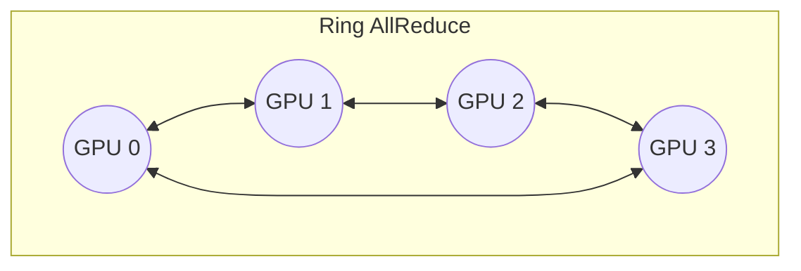

# CUDA 进阶：多 GPU 集体通信与 NCCL AllReduce 实战

随着深度学习模型（如大语言模型 LLM）的参数量指数级增长，单张 GPU 的算力和显存早已无法满足训练和推理的需求。进入分布式计算和多 GPU 并行处理的时代，GPU 之间的高效数据交换成为了系统性能的决定性瓶颈。

在这一背景下，NVIDIA 推出了 **NCCL (NVIDIA Collective Communication Library)**。本篇文章将基于我们在 RTX 4090 双卡环境下的实测，带你深入理解并实战 NCCL 的核心通信原语 —— **AllReduce**。

---

## 1. 问题背景：为什么需要 NCCL？

在多 GPU 场景下，最原始的做法是通过 `cudaMemcpy` 将数据从 GPU A 考入 Host 内存，再由 Host 发送到 GPU B；或者通过 P2P (`cudaMemcpyPeer`) 直接在卡间拷贝。然而，当面临复杂的集体通信需求（如广播一条数据给所有卡，或将所有卡的数据进行加和求均值返回给每张卡）时：
- 手写点对点（Point-to-Point）通信的拓扑逻辑极其复杂（要考虑 Ring、Tree 算法防止网络拥堵）。
- 硬件拓扑复杂：不同的卡之间可能通过 PCIe 互联，或通过 NVLink 桥连，亦或者跨节点通过 InfiniBand 网络连接。普通的 CUDA API 很难实现拓扑感知和链路级的最优调度。

**NCCL 的核心价值**：它是一个拓扑感知（Topology-Aware）的高性能通信库。开发者只需要调用高层 API（如 `ncclAllReduce`），NCCL 会在底层自动嗅探机器硬件连接状态，动态构建最优的 Ring 或 Tree 拓扑结构，最大化利用 NVLink 或 PCIe 的带宽。

---

## 2. 核心原理：AllReduce 的硬件映射

`AllReduce` 包含两个语义操作：
1. **Reduce**：将各节点的数据按照指定算子（如求和、求最大值）进行归约。
2. **All（或者说 Broadcast）**：将归约后的最终结果广播给所有节点。

### 典型拓扑：Ring AllReduce 算法

NCCL 内部在连接成环状网络的环境中，常采用 Ring AllReduce 算法，将大块数据切分为 $N$ 份（$N$ 为 GPU 数量）。
过程分为两个阶段：
1. **Scatter-Reduce**：每个 GPU 在各自独立的负责块上进行 Reduce 加和，通过环形传递，经过 $N-1$ 步后，每张卡上都会包含一块“完全归约好”的数据。
2. **Allgather**：再经过 $N-1$ 步，将每张卡上完全归约好的数据块沿着环同步给其它所有卡。



这种机制完美地摊销了通信成本，使得通信时间不会随着 GPU 节点数的增加而线性恶化。

---

## 3. 代码演进与全景

在我们的 `15_Multi_GPU` 模块中，核心代码包含从初始化到通信再到验证的闭环：

- `01_nccl_allreduce/nccl_allreduce.cu`：这是一个典型的单机多卡多线程（或单线程）通信案例。

该案例模拟了在同一个进程下控制两张 RTX 4090 的全链路行为：
1. 生成全局唯一 `ncclUniqueId`。
2. 批量配置 `cudaStream_t` 和 `ncclComm_t`。
3. 调用 `ncclAllReduce` 在多流下并发执行。
4. 拉回 Host 端的验证数组。

---

## 4. 核心代码剖析：Group 操作的多卡并发

在单进程（Single-Process）多卡控制的场景中，初始化通信子是最容易踩坑死锁的地方。

### 并发死锁的陷阱与 NCCL Group

```cpp
/* 关键代码分析 (ncclGroup 的使用) */
NCCLCHECK(ncclGetUniqueId(&id));

// 必须将多个卡的 comm 初始化包裹在 GroupStart/End 中
NCCLCHECK(ncclGroupStart());
for (int i = 0; i < nDev; i++) {
    CUDACHECK(cudaSetDevice(devs[i]));
    NCCLCHECK(ncclCommInitRank(&comms[i], nDev, id, i));
}
NCCLCHECK(ncclGroupEnd());
```

**为什么需要 Group？**
当调用 `ncclCommInitRank` 或网络集体通信如 `ncclAllReduce` 时，所有参与的 GPU 都在等待其它 GPU 发来的同步握手信号。如果不使用 `ncclGroupStart()` 和 `ncclGroupEnd()`，主线程会在第 0 个 GPU 的 NCCL 调用处被“阻塞”，永远等不到第 1 个 GPU 被调用，从而产生**单线程死锁**。

通过 `Group` API，NCCL 会暂存所有处于同一个组范围内的通信请求，直到遇到 `GroupEnd()`，主线程才会并发地将这些任务下发到所有的 GPU 驱动以及驱动的底层通信后台线程中，实现了并行握手。

### 提交 AllReduce 通信

```cpp
// 启动 AllReduce
NCCLCHECK(ncclGroupStart());
for (int i = 0; i < nDev; i++) {
    CUDACHECK(cudaSetDevice(devs[i]));
    NCCLCHECK(ncclAllReduce((const void*)sendbuff[i], 
                            (void*)recvbuff[i], 
                            size, 
                            ncclFloat, 
                            ncclSum,   // 算子：求和
                            comms[i], 
                            s[i]));    // 每个设备的私有 CUDA stream
}
NCCLCHECK(ncclGroupEnd());
```

注意：这里的数据操作是纯异步的，主线程提交命令即刻返回。我们使用了 `ncclSum` 通知 NCCL 对传入浮点数组进行逐元素求和。

---

## 5. 实测与踩坑记录

我们在两张 `RTX 4090 (Compute Capability 8.9)` 上实测：

### 编译链接：坑与解法
由于通常 Linux 标准发行版源或 Conda 源的 NCCL 库与本地 NVCC 版本经常存在兼容问题。我们在编译阶段遇到了 `/usr/bin/ld: 找不到 -lnccl` 的严重问题。

**解决方案：源码编译 NCCL**
直接编译基于目标微架构 (`sm_89`) 的 NCCL 可以绕开这个问题并最大化性能：
```bash
git clone https://github.com/NVIDIA/nccl.git
cd nccl
make -j16 src.build NVCC_GENCODE="-gencode=arch=compute_89,code=sm_89"
```
并在项目中指定头文件和动态链接库路径 `export LD_LIBRARY_PATH=/path/to/nccl/build/lib:$LD_LIBRARY_PATH`。

### 性能测量与日志
```text
检测到 2 块 CUDA 设备
设备 0： NVIDIA GeForce RTX 4090
设备 1： NVIDIA GeForce RTX 4090
...
NCCL 初始化成功，开始执行 AllReduce ...
AllReduce 跨设备执行耗时: 44.63 ms
--- 结果验证 ---
✓ 全局 AllReduce 同步验证通过。所有设备归约到的结果都是 1.00
```
*(注意：这里显示的 `44.63 ms` 不仅包含了内存分配以及一次冷启动的建链时间。一旦通信子预热建立缓存连接，纯通信延迟将降至微秒级别，配合 NVLink 能达到极速传输)*。

---

## 6. 总结与下一步

**优化思想提炼**
1. **拓扑屏蔽**：作为算法工程师，无须关心具体的 GPU 物理拓扑互联链路，NCCL 在底层屏蔽了 NVLink 和 PCIe 的物理差异。
2. **异步流水线**：使用私有 Stream (`cudaStream_t`) 处理各个卡的通信和计算，这允许你在计算下层网络输出时，通过单独的流启动 NCCL 进行当前层梯度的规约计算（即常说的**计算与通信重叠 Overlapping**）。

**下一步**
在掌握了通过单机多卡进行 AllReduce 同步之后，对于更为复杂的业务形态如 **并行推理（Tensor Parallelism 分布式投机采样）** 以及 **分布式训练** 将会如鱼得水。在实际工业界，往往采用 Python 环境下的 `PyTorch DDP` 或 `Megatron-LM` 等高层封装。而这一切的底层基石，都是我们今天拆解的 `ncclAllReduce`。