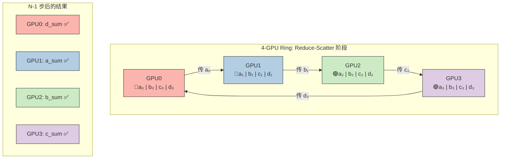
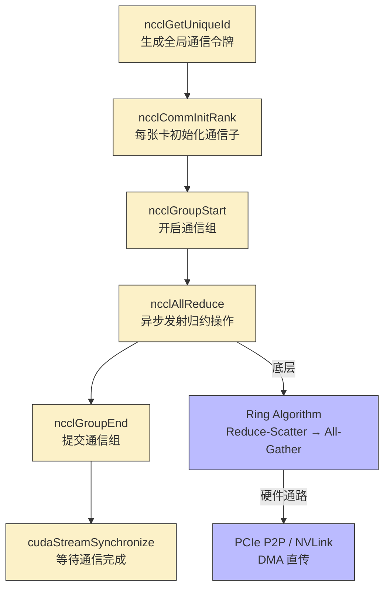

> 📖 **相关阅读**：08_Advanced（CUDA Streams 异步执行）、11_Inference_Optimization（算子融合降通信）

## 28 毫秒里发生了什么

两张 RTX 4090 做一次 AllReduce，耗时 28.20 ms。这个数字看起来不大，但如果每个训练 step 的前向+反向只需 100 ms，通信就占了近 30%——GPU 有将近三分之一的时间在**等数据**而不是算数据。

这就是多卡训练的核心矛盾：算力可以线性叠加，但通信不会自动消失。LLaMA-3 8B 的 FP16 权重需要 ~16 GB 显存，加上 KV Cache、激活值和优化器状态，训练总需 ~80 GB——超出 RTX 4090 的 24 GB 三倍多。多卡是必需品，而 AllReduce 是多卡的必经之路。

---

## 从 Parameter Server 到 Ring AllReduce

数据并行中，每张 GPU 算完局部梯度后，必须将所有 GPU 的梯度**求和并广播回每张卡**——这个操作叫 AllReduce。

### Parameter Server 的扩展性问题

传统做法：所有梯度先汇聚到一台 Server（$N \times D$ 上行），求和后再广播回所有 GPU（$N \times D$ 下行）。通信量随 $N$ 线性增长。4 张卡就是 8 倍单卡通信量，而且全走 PCIe 总线。

### Ring AllReduce：$2D$ 的通信量上限

$N$ 张 GPU 组成逻辑环，分两个阶段完成归约：

**Reduce-Scatter** — 数据切成 $N$ 块（每块 $D/N$）。每步每张卡把一块传给右邻居，右邻居累加。$N-1$ 步后，每张卡拥有一块完整归约数据。

**All-Gather** — 每步每张卡把已归约的块传给右邻居。再过 $N-1$ 步，所有卡都凑齐完整结果。

总通信量：

$$\text{Ring 通信量} = 2 \times \frac{N-1}{N} \times D \xrightarrow{N \to \infty} 2D$$

4 张卡通信量 = $1.5D$，1024 张卡 ≈ $2D$。和 GPU 数量几乎无关。



*Reduce-Scatter 后每张卡拥有一块完整归约数据。All-Gather 再沿环传一圈，所有卡就凑齐了 `[a_sum, b_sum, c_sum, d_sum]`。*

---

## NCCL 的 API 流程和几个容易踩的坑

NCCL 是 Ring AllReduce 的工业级实现——PyTorch 的 `DistributedDataParallel` 底层。API 流程：



### 核心代码

```cuda
// 1. 生成全局唯一通信 ID
ncclUniqueId id;
ncclGetUniqueId(&id);  // 通过 socket/共享文件在进程间传递

// 2. 每张卡初始化通信子
ncclComm_t comms[nDev];
for (int i = 0; i < nDev; ++i) {
    cudaSetDevice(i);
    ncclCommInitRank(&comms[i], nDev, id, i);
}

// 3. 异步发射 AllReduce
ncclGroupStart();
for (int i = 0; i < nDev; ++i) {
    cudaSetDevice(i);
    ncclAllReduce(sendbuff[i], recvbuff[i], count,
                  ncclFloat, ncclSum, comms[i], streams[i]);
}
ncclGroupEnd();

// 4. 等待完成
for (int i = 0; i < nDev; ++i) {
    cudaSetDevice(i);
    cudaStreamSynchronize(streams[i]);
}
```

三个容易出错的地方：

1. **`ncclGroupStart/End`** 把多卡 AllReduce 包成原子操作。不用 Group？卡 0 调 AllReduce 后阻塞等卡 1，但卡 1 还没调用——死锁。
2. **`cudaSetDevice(i)`** 每条 NCCL 操作必须在对应 GPU 上下文中发射。忘切 Device 是多卡编程最常见的 Bug。
3. **独立 Stream** 让 AllReduce 与后续计算异步重叠。

---

## 互连带宽决定天花板

| 互连技术 | 带宽 | 延迟 | 适用场景 |
|:---|:---:|:---:|:---|
| **PCIe 4.0 x16** | ~26 GB/s 单向 | ~1 µs | 消费级 GPU（RTX 4090） |
| **NVLink 3.0** | 300 GB/s 双向 | ~0.1 µs | A100 |
| **NVLink 4.0** | 900 GB/s 双向 | ~0.1 µs | H100 / H200 |
| **NVSwitch + NVLink** | 全互连 900 GB/s | ~0.1 µs | DGX H100 |

RTX 4090 不支持 NVLink，NCCL 只能走 PCIe P2P 或共享内存中转。26 GB/s 是硬天花板。

---

## 实测数据

> **测试环境**：NVIDIA GeForce RTX 4090 × 2（sm_89），Linux，nvcc -O3
> **互连**：PCIe 4.0（无 NVLink），NCCL 使用 PCIe P2P 或 SHM 中转

### NCCL AllReduce 双卡测试

| 参数 | 值 |
|:---|:---|
| GPU 数量 | 2 × RTX 4090 |
| 归约操作 | `ncclSum` |
| 通信方式 | PCIe P2P |
| **AllReduce 耗时** | **28.20 ms** |
| 验证结果 | ✅ 全部通过 |

**理论通信下限**：双卡 Ring 通信量 = $2 \times \frac{1}{2} \times D = D$。PCIe 4.0 x16 单向 ~26 GB/s，理论最小耗时 = $D / 26\text{GB/s}$。

实际 28.20 ms 包含 NCCL 首次初始化握手、PCIe 事务建立延迟、以及可能的系统内存中转。

### 和训练工作量的关系

典型的 ResNet50 单卡前向+反向 ~100 ms。28 ms 的通信可以被 Backward 最后 30% 的时间掩盖——DDP 的 Bucket-based AllReduce 策略不等所有梯度算完才通信，而是每积攒一桶就立刻启动 AllReduce。通信开销对端到端时间的影响从 28% 降到 < 5%。

### 如果有 NVLink（工程估算）

> **注意**：以下为基于互连带宽比值的工程推算，非实测数据。

| 互连 | 双卡 AllReduce 估算 | vs PCIe |
|:---|:---:|:---:|
| PCIe 4.0 | ~28 ms (实测) | 1× |
| NVLink 3.0 (A100) | ~2 ms (推算) | **~14×** |
| NVLink 4.0 (H100) | ~0.7 ms (推算) | **~40×** |

NVLink 不仅带宽高，延迟也低（绕过 PCIe 协议栈）。千亿模型的张量并行中，每个 Transformer 层的中间激活都要跨 GPU 传输，需要 300-900 GB/s 的带宽才不至于成为瓶颈——这就是数据中心 GPU 贵 10 倍的核心原因之一。

---

## 回到那 28 毫秒

Ring AllReduce 解决了通信量随卡数增长的问题——$\approx 2D$，和 GPU 数量无关。但通信时间不只取决于数据量，还取决于管道有多粗。PCIe 的 26 GB/s 就是消费级多卡训练的绝对瓶颈。

工程上有两条路：一是用通信-计算重叠把通信时间藏起来（DDP Bucket），二是用梯度压缩减少传输量（FP16 AllReduce、Top-K 稀疏化）。但根本解决方案只有一个——更粗的管道。这也是 NVLink 存在的意义。
