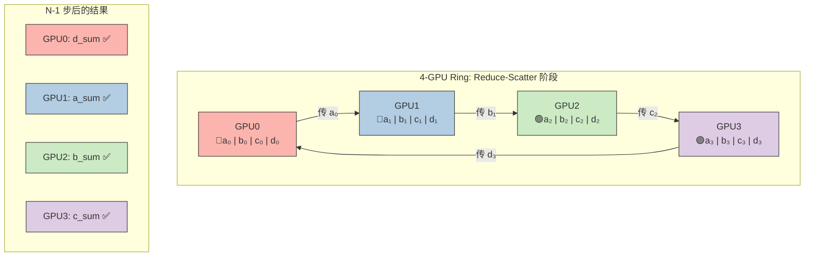
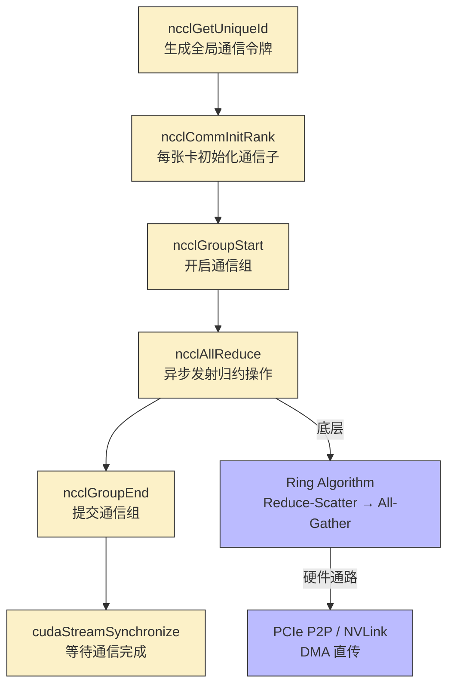

## 楔子：当一张卡装不下一个模型

LLaMA-3 8B 的 FP16 权重需要 ~16 GB 显存。加上 KV Cache、激活值和优化器状态后，训练时总需 ~80 GB——超过 RTX 4090 的 24 GB 整整 3 倍。即使是推理，Batch Size 稍大就会 OOM。

单卡时代结束了。**多卡协作（Multi-GPU）** 不再是"高级选项"，而是**必需品**。但多卡协作的核心挑战不在计算——而在**通信**。

以数据并行（Data Parallel）为例：每张 GPU 计算自己的局部梯度后，必须将所有 GPU 的梯度**求和并广播回每张卡**。这个操作叫 **AllReduce**。如果 AllReduce 太慢（通信时间 > 计算时间），多卡训练就变成了"多卡等待"——线性加速比（Linear Scaling）无从谈起。

**NCCL（NVIDIA Collective Communications Library）** 是这个问题的工业级解答。它用 **Ring AllReduce** 算法实现了通信量不随 GPU 数量增长的魔法——PyTorch 的 `DistributedDataParallel (DDP)` 底层正是 NCCL。

---

## 第一性原理：AllReduce 的通信数学

### 为什么不能用 CPU 做中转？

传统 Parameter Server 架构：

$$\text{每轮通信量} = 2 \times N \times D$$

其中 $N$ 是 GPU 数量，$D$ 是参数量。所有梯度先汇聚到 CPU（$N \times D$ 上行），CPU 求和后再广播回所有 GPU（$N \times D$ 下行）。**通信量随 $N$ 线性增长**——4 张卡就需要 8 倍于单卡的通信量。更致命的是，所有通信都要经过 CPU 和 PCIe 总线——带宽瓶颈无法突破。

### Ring AllReduce：通信量不变的魔法

Ring AllReduce 将 $N$ 张 GPU 组成一个逻辑环，分两个阶段完成：

**阶段 1：Reduce-Scatter（归约散播）**

- 将数据切分为 $N$ 块，每块 $D/N$ 大小
- 每步：每张卡将一块数据传给**右邻居**，右邻居将其与自己的对应块**累加**
- 经过 $N-1$ 步后，每张卡上**恰好拥有一块完整归约好的数据**

**阶段 2：All-Gather（全量收集）**

- 每步：每张卡将自己已归约完成的块传给右邻居
- 经过 $N-1$ 步后，所有卡都拥有完整的归约结果

**总通信量**：

$$\text{Ring 通信量} = 2 \times \frac{N-1}{N} \times D \xrightarrow{N \to \infty} 2D$$

**通信量与 GPU 数量无关！** 4 张卡的通信量 = $2 \times \frac{3}{4} \times D = 1.5D$。1024 张卡的通信量 = $2 \times \frac{1023}{1024} \times D \approx 2D$。这就是 Ring AllReduce 实现线性扩展性的数学基础。



*Reduce-Scatter 后每张卡拥有唯一一块完整归约数据。All-Gather 再沿环传一圈，所有卡就凑齐了 `[a_sum, b_sum, c_sum, d_sum]`。*

### 通信拓扑对性能的决定性影响

| 互连技术 | 带宽 | 延迟 | 适用场景 |
|:---|:---:|:---:|:---|
| **PCIe 4.0 x16** | ~26 GB/s 单向 | ~1 µs | 消费级 GPU（RTX 4090） |
| **NVLink 3.0** | 300 GB/s 双向 | ~0.1 µs | A100 |
| **NVLink 4.0** | 900 GB/s 双向 | ~0.1 µs | H100 / H200 |
| **NVSwitch + NVLink** | 全互连 900 GB/s | ~0.1 µs | DGX H100 |

RTX 4090 不支持 NVLink，NCCL 被迫使用 **PCIe P2P** 或 **共享系统内存中转（SHM）**。这是消费级 GPU 的根本瓶颈——Ring AllReduce 的通信量再少，也受限于 PCIe 的 26 GB/s 瓶颈。数据中心级 GPU 通过 NVLink 获得 10-35× 的互连带宽提升。

---

## 核心技术要点与硬件映射

### NCCL 的通信管线



### DDP 训练中的 Overlap 策略

在 PyTorch DDP 中，Backward 计算和 AllReduce 通信可以**重叠执行**：

- 当反向传播到第 $L$ 层时，第 $L+1$ 层的梯度已经计算完毕
- NCCL 可以在独立的 Stream 上立即启动第 $L+1$ 层梯度的 AllReduce
- **Backward 计算和 AllReduce 通信同时进行——通信被计算掩盖**

这就是 DDP 能在百卡规模下实现近线性加速的核心原因。

---

## 源码手术刀：关键代码深度赏析

### NCCL AllReduce 完整通信管线

```cuda
// 1. 生成全局唯一通信 ID
ncclUniqueId id;
ncclGetUniqueId(&id);  // 内部通过 socket/共享文件在进程间传递

// 2. 每张卡初始化通信子
ncclComm_t comms[nDev];
for (int i = 0; i < nDev; ++i) {
    cudaSetDevice(i);  // 极度重要：绑定当前线程到 GPU i
    ncclCommInitRank(&comms[i], nDev, id, i);  // rank i 加入通信组
}

// 3. 异步发射 AllReduce
ncclGroupStart();  // Group 机制防止死锁
for (int i = 0; i < nDev; ++i) {
    cudaSetDevice(i);
    ncclAllReduce(
        (const void*)sendbuff[i],   // 每张卡的输入
        (void*)recvbuff[i],         // 每张卡的输出（原地操作时 send == recv）
        count,                       // 元素数量
        ncclFloat,                   // 数据类型
        ncclSum,                     // 归约操作：求和
        comms[i],                    // 对应卡的通信子
        streams[i]                   // 挂载到独立 CUDA Stream
    );
}
ncclGroupEnd();  // 所有操作原子性提交

// 4. 等待通信完成
for (int i = 0; i < nDev; ++i) {
    cudaSetDevice(i);
    cudaStreamSynchronize(streams[i]);
}
```

**关键细节**：

1. **`ncclGroupStart/End`**：将多张卡的 AllReduce 调用包裹为一个原子操作。如果不用 Group 机制，卡 0 调用 AllReduce 后立即阻塞等待卡 1，而卡 1 还没调用——**死锁**。
2. **`cudaSetDevice(i)`**：每条 NCCL 操作必须在**对应 GPU 的上下文**中发射。忘记切换 Device 是最常见的多卡编程 Bug。
3. **独立 Stream**：每张卡用自己的 Stream，让 AllReduce 与后续计算可以**异步重叠**。

---

## 理论与实际的对决：极限剖析

> **测试环境**：NVIDIA GeForce RTX 4090 × 2（sm_89），Linux，nvcc -O3
> **互连**：PCIe 4.0（无 NVLink），底层 NCCL 使用 PCIe P2P 或 SHM 中转

### NCCL AllReduce 双卡同步测试

| 参数 | 值 |
|:---|:---|
| GPU 数量 | 2 × RTX 4090 |
| 归约操作 | `ncclSum`（求和） |
| 通信方式 | PCIe P2P |
| **AllReduce 耗时** | **28.20 ms** |
| 验证结果 | ✅ 全部通过 |

### 性能分析

**理论通信下限**：假设数据量为 $D$ MB，双卡 Ring 的通信量 = $2 \times \frac{1}{2} \times D = D$。PCIe 4.0 x16 单向 ~26 GB/s，理论最小耗时 = $D / 26 \text{GB/s}$。

**实际 28.20 ms 包含了**：

- 首次 NCCL 初始化和 `ncclCommInitRank` 的握手开销（仅首次运行时有）
- PCIe 事务建立延迟
- 可能的系统内存中转（如果主板 PCIe 拓扑不支持直接 P2P）

**与训练工作量的比较**：典型的 ResNet50 单卡前向+反向约 ~100 ms。28 ms 的通信开销可以被 Backward 的最后 30% 时间掩盖（通过 NCCL 的独立 Stream + Bucket-based Gradient AllReduce）。**实际训练中的通信开销对用户几乎透明**——这就是 DDP 的工程威力。

### 如果有 NVLink 会怎样？

| 互连 | 双卡 AllReduce 估算 | vs PCIe 加速比 |
|:---|:---:|:---:|
| PCIe 4.0 | ~28 ms (实测) | 1× |
| NVLink 3.0 (A100) | ~2 ms (估算) | **~14×** |
| NVLink 4.0 (H100) | ~0.7 ms (估算) | **~40×** |

NVLink 不仅带宽高（300-900 GB/s vs 26 GB/s），延迟也更低（绕过 PCIe 协议栈）。这就是为什么数据中心 GPU 比消费级 GPU 贵 10 倍以上——不仅仅是算力差异，更是**互连带宽的数量级鸿沟**。

---

## 架构师视角的总结

### 铁律一：Ring AllReduce 是线性可扩展的——通信量 ≈ 2D，与 GPU 数量无关

$$\text{通信量} = 2 \times \frac{N-1}{N} \times D \;\xrightarrow{N \gg 1}\; 2D$$

这意味着从 2 张卡扩展到 1024 张卡，每张卡的通信量几乎不变。瓶颈转移到**互连带宽**——这就是 NVLink 和 InfiniBand 存在的意义。

### 铁律二：通信可以被计算掩盖——但需要精心的流水线设计

DDP 的 Bucket-based AllReduce 策略：不等所有梯度计算完才通信，而是**每积攒一桶（Bucket）梯度就立刻启动 AllReduce**。这让最后几个 Bucket 的 AllReduce 与前面的 Backward 重叠——通信开销对端到端训练时间的影响从 28% 降至 < 5%。

### 铁律三：互连带宽决定了多卡训练的天花板

PCIe 的 26 GB/s 是消费级多卡训练的绝对瓶颈。即使梯度压缩（FP16 AllReduce、Top-K 稀疏化）可以减少通信量 2-10×，也无法从根本上解决问题。为什么 A100/H100 的 NVLink 是标配？因为在千亿模型的张量并行（Tensor Parallel）中，**每个 Transformer 层的中间激活**都需要在 GPU 间传输——这需要 NVLink 的 300-900 GB/s 带宽才能不成为瓶颈。
