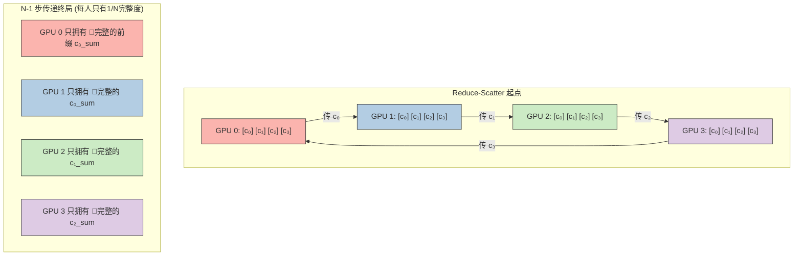

> 📖 **前置阅读**：08_Advanced_CUDAGraphs_Streams_Extensions.md（CUDA Streams 异步执行）  
> 📖 **推荐后续**：11_Inference_Optimization_Fusion_KVCache.md（算子融合降通信）

一台装配了两张 RTX 4090 的机器，跑一段最基础的 NCCL AllReduce 同步 1024×1024 个 Float 类型（约 4MB）的数据，控制台打出来的耗时是 **28.20 ms**。

这个数字乍看毫无波澜。但稍微对系统有概念的工程师看到这个数字，应该会本能地感到后背发凉——算一笔账：典型的 ResNet-50 跑完一个完整的反向传播（Backward Pass）可能也就才一百二十毫秒左右。如果在一次模型并行的梯度同步里，两张卡为了交换这区区 4MB 的数据就发呆了将近 30 毫秒，那么等于你的显卡有将近四分之一的时间在纯粹等网卡发货。它们不计算任何卷积、不相乘任何矩阵，就是在把硅片里的比特通过主板搬到另一块硅片上。

到了 LLaMA-3 8B 这样的大模型时代，单卡 24GB 的显存光是塞下 FP16 权重、优化器状态和 KV Cache 就会满载。多卡是硬需求，而多卡间的 AllReduce（全量归约）是不可逾越的物理高墙。

单卡的算力可以通过买更多显卡简单地线性叠加，但**通信的时间绝对不会因为卡数增加而消失，甚至如果拓扑不对，它会呈指数级爆炸**。这篇文章我们不浮在表面聊什么分布式训练的宏观概念，我们下钻到 NCCL 代码架构和数学推导，算一算这 28 毫秒里究竟发生了什么。

---

## 传统 Parameter Server 为什么必然瘫痪？

对于初学者来说，数据模型并行中最简单直觉的一个问题就是：每张卡算出了自己的梯度残差，我要怎样把大家的结果加总然后再发回给所有人？

早年机器学习最常见的朴素思路就是搭建一个 Parameter Server（参数服务器）：选定一个节点——比如分配一块特定的 CPU 内存或某个特定的 GPU0 当"总管"。在这个模型下：

1. 所有的随从 GPU 把自己的局部梯度打包，通过 PCIe 或网线发送给总管。
2. 总管负责把收到的所有张量执行 Element-wise 的加法计算。
3. 加完后，总管把这份热乎的新聚合梯度，群发回所有的 GPU。

这听起来很棒，逻辑清晰且易于实现的代码编写。但当它落地到物理主板上时，这是一场不折不扣的灾难。

为什么？我们定量算一下瓶颈。

假设单次梯度的总字节数是 $D$ 兆字节（MB），集群里有 $N$ 张卡。

- **上行通信**：$N-1$ 张独立的工作卡都需要向总管发送大小为 $D$ 的数据。总管的接收网卡上就会瞬间承受 $(N-1) \times D$ 字节的数据海啸。
- **下行通信**：总管算完之后，还要向 $N-1$ 张卡广播结果。总管的发出网卡又要承受 $(N-1) \times D$ 的发送量。

系统最脆弱的瓶颈全压在了那个"总管"的物理接口上。更致命的是，在这期间其余 $N-1$ 张卡的发送/接收总线处于严重的"非对称饥饿"状态——**它们只负责偶尔收发一次，主力的通信带宽完全被闲置了。**

当卡数 $N$ 取 4 时，总管卡需要处理 $3 \times D$；当 $N$ 取 1024 时，总管需要处理 $1023 \times D$。这就相当于一条市区的普通单行道想要同时容纳 1000 辆卡车驶入，这种 Hub-and-Spoke（星型拓扑）是极不具备可扩展性（Scalability）的。

---

## Ring AllReduce：把通信极限压平的数学魔法

那有没有一种办法，让所有的卡都能**同时地、均等地**收发数据，不让任何一张卡的带宽闲置，并且不管连接多少张卡，单张卡的通信负载都不再随着节点增加而线性增长？

有。Baidu Silicon Valley Lab 在 2017 年把在 HPC（高性能计算）领域久经验证的 Ring AllReduce 算法搬到了深度学习界。这套逻辑后来直接成为了 NVIDIA NCCL 底层的核心王牌拓扑之一。

在这个拓扑下，所有 GPU 不再连向同一个中心，而是**首尾相连，组成一个逻辑上的环**。规定每张 GPU**只和自己的左邻居收数据，只向自己的右邻居发数据**。每张卡的网络收/发引脚都被完全拉满。

这个堪称艺术的算法分为两个阶段，我们在这里不跳步，推演一次 $N=4$ 的情况。

### 阶段一：Reduce-Scatter (归约散播)

我们要同步的总梯度切不可当成一个整块来发。核心思路是**分而治之（Divide and Conquer）**：把大小为 $D$ 的数据硬生生地横切成 $N$ 个小块（Chunk），每块大小正好是 $\frac{D}{N}$。
假设总共 $D = 100 \text{ MB}$，$N = 4$ 张卡。那么每块就是 $25 \text{ MB}$。

既然有 4 块切片，我们把每张卡的显存逻辑上分成 $c_0, c_1, c_2, c_3$。

**第一步：并发开始转移**。

- GPU 0 将自己负责的第 0 块切片（我们叫它 $c_0^{(0)}$），发给右边的 GPU 1；
- 与此同时，GPU 1 将自己的第 1 块切片（$c_1^{(1)}$），发给 GPU 2；
- 同理，GPU 2 发 $c_2^{(2)}$ 给 GPU 3；GPU 3 发 $c_3^{(3)}$ 给 GPU 0。

**第二步：叠加与继续传递**。

- GPU 1 收到了来自 GPU 0 的 $c_0^{(0)}$。然后它怎么做？极其关键的一步：**它把收到的 $c_0^{(0)}$ 与自己本地原本持有的 $c_0^{(1)}$ 放在一块立刻用算术单元加起来**，变成一个已包含两卡信息的临时块 $(c_0^{(0)} + c_0^{(1)})$。
- 下一回合，GPU 1 并不会停下，它把这段"加过一次"的块继续扔给右侧的 GPU 2。GPU 2 收到后再跟自己本地的 $c_0^{(2)}$ 叠加。

在这个流水线中，一个数据块在环里每右移一格，就像滚雪球一样，多叠加了一张卡的信息片段。

经过 $N-1$（即 3）个步数的接力后，这滚动的每一块数据都在网络中"游历"了所有的 GPU，叠加了所有 4 张卡的梯度。

此时大回环停住。一个极小但是神圣的完备状态诞生了：
**每张 GPU 上都恰好拥有一大块（大小为 $\frac{D}{N}$ 即 25 MB）已经完全求和完毕的最终结果，而且每块对应的索引都不重样。**
（GPU 0 拥有聚合好的 $c_3$ 块，GPU 1 拥有 $c_0$ 块，GPU 2 是 $c_1$ 块，GPU 3 是 $c_2$ 块。）

我们来做一次期中清算，看看产生多大的通信量：
在上述这 $N-1$ 步里，每一步大家都在拼命向外发大小为 $\frac{D}{N}$ 的块。所以对于**单卡**而言，在 Reduce-Scatter 阶段它发出的数据量是：
$$\text{单卡发出量 (阶段一)} = (N-1) \times \frac{D}{N} = \frac{N-1}{N} D$$



### 阶段二：All-Gather (全量收集)

Reduce-Scatter 做完虽然让所有的加法都在芯片底层算完了，但显然，对于模型参数同步而言，每个人都只捏着总拼图的 $\frac{1}{N}$ （25 MB）。我们还需要让所有卡重新拿到那完整的 100 MB 矩阵结果。

因此，极其自然的阶段二 All-Gather 诞生了：我们**把刚才那个通信环重新启动一回**。
只不过由于所有的求和计算已经在第一阶段完毕，这一次不需要再做任何加法。

- 第一回合：每张卡把自己拥有的那块硕果仅存的、已经完整聚合的数据向右抛过去；
- 右侧邻居拦截到后，不用加自己，直接**内存拷贝覆盖**自己对应位置的原有旧数据残渣，并且在下个周期继续原封不动地向右抛。

同样经过 $N-1$ 步后，所有人都将自己唯一的信息互相传阅了一遍。至此，所有 GPU 在本地显存上终于都凑齐了这 $N$ 个完整的拼图块，拿到了一模一样的最终 100 MB 结果。

此时结算 All-Gather 阶段的通信量反馈，由于还是传递一样的体积传递一样多的轮数，单卡的发出量仍然是：
$$\text{单卡发出量 (阶段二)} = (N-1) \times \frac{D}{N} = \frac{N-1}{N} D$$

### 为什么它从数学层面赢了？

我们把单卡这两阶段的所有发送字节数加总，得到在一个 AllReduce 闭环下，单张网卡的网络总体流出（或流入）负荷：

$$ \text{Ring 单卡通信总发出荷载} =  \frac{N-1}{N} D + \frac{N-1}{N} D = 2 \times \frac{N-1}{N} \times D $$

神奇之处体现在对卡数取极大极限的时刻：当你在算力中心把 GPU 节点数量疯狂叠高，也就是当 $N \to \infty$ 时，这张单卡的通信发包总量会被严格推近那个理论硬上限：
**$ \lim_{N\to\infty} 2 \times \frac{N-1}{N} D = 2D $**

无论你是买 4 张卡还是组网租下 1024 张卡，你的单机网络接口或者 PCIe 链路所需经历的数据洪流永远只会被死死地压在——"向外发两倍基底文件总体积，向内接两倍总体积"这条水平的常数红线上。分布式系统横向拓展的通信瓶颈，在纯数学层面被一种粗犷又优雅的方法击得粉碎。

---

## NCCL 代管下界：为什么这三行代码极其容易抛错

数学上的理想环极具美感，但到了工程落地环节那完全是满眼荆棘。NVIDIA 给出了当今事实上的唯一的工业级黑盒实现：`NVIDIA Collective Communication Library (NCCL)`。
我们在项目 `nccl_allreduce.cu` 内其实只是调用了它封装过的最上层 API。但这其中暴露了很多典型的多显卡流式编程的陷阱。

### 1. 通信组建立与隐式上下文（Context）绑定

在任何集合通信前，系统需要在各节点互相分配路由、缓冲区（Buffers）并在驱动层建立映射树。这需要依赖唯一的一串 UUID 作为联络暗语：

```cuda
// 1. 生成全局唯一握手符号 (UID)
ncclUniqueId id;
NCCLCHECK(ncclGetUniqueId(&id)); 
// 在单机内这只是内存传递。如果在千卡大集群，这张名片（ID）往往要用 MPI 或者 Socket 
// 发送到所有的机器上，用于告诉那些节点："去这个地址跟我们汇合建立通信圈群"

// 2. 将所有卡拉入同一个通信子集合 (Communicator)
NCCLCHECK(ncclGroupStart());
for (int i = 0; i < nDev; ++i) {
    CUDA_CHECK(cudaSetDevice(i));  // ⚠️ 这里一旦遗漏，后果不堪设想
    
    // 给每张参与通信的卡独立分配自己的显存指针和计算流
    CUDA_CHECK(cudaMalloc((void**)&d_sendbuffs[i], size_bytes));
    CUDA_CHECK(cudaMalloc((void**)&d_recvbuffs[i], size_bytes));
    CUDA_CHECK(cudaStreamCreate(&streams[i]));
    
    // 以 Rank i 的身份向组织报到，并建立通信隧道握手
    NCCLCHECK(ncclCommInitRank(&comms[i], nDev, id, i));
}
NCCLCHECK(ncclGroupEnd());
```

这里的前置准备隐藏了一个多卡环境中最致命的坑点：**每一条针对某张卡的操作，必须前脚贴身跟随一个对应的 `cudaSetDevice(i)`**。NCCL 的状态机绑定与普通的 CUDA Runtime 一样严重依赖隐式的 CUDA 上下文。如果你的控制线程在用循环给 `Rank 1` （显卡 1）配置 NCCL 环境时，没有切到它的设备上下文，底层默默分配出来的实际上是全挂靠卡 0 环境的畸形结构。当你下一秒执行同步指令时，底层进程将试图发生跨隔离沙箱去偷发数据，控制台当场就会出现臭名昭著的无效内存总线访问异常（Core Dump）。

### 2. 避免物理级别的交叉死锁（Deadlock）

接着进入主规约调用：

```cuda
NCCLCHECK(ncclGroupStart());
for (int i = 0; i < nDev; ++i) {
    CUDA_CHECK(cudaSetDevice(i));
    NCCLCHECK(ncclAllReduce(
        (const void*)d_sendbuffs[i], // 这里塞入自己算出的梯度 src_ptr
        (void*)d_recvbuffs[i],       // 接收目标块地址 dst_ptr
        num_elements,                // float 个数
        ncclFloat,                   // 数据类型描述符
        ncclSum,                     // 使用加法进行归约
        comms[i],                    // NCCL的通行证句柄
        streams[i]                   // 提供后台异步能力的并行计算流
    ));
}
NCCLCHECK(ncclGroupEnd());
```

请仔细注意这循环两端强加的把关机制：`ncclGroupStart()` 和 `ncclGroupEnd()`。为什么不能直接在一层干净的 for 循环里调用 API？

如果去掉这对 Group 包装来想一下：在单线程从上至下的串行世界中，由于在卡 0 处调发起了 AllReduce 操作，该操作由于需要跟卡 1 对接数据块收发而被迫挂起。然而此时此刻，当前控制主线程也跟着被挂载在了卡 0。卡 1 这个设备不仅连指令的边都还没摸到，这个发起循环还处于未通过状态，卡 1 这辈子都不会执行 `ncclAllReduce` 来发车。卡 0 和 卡 1 开心地结成了**永远互相等待对方开口的死锁环**。

那对 `ncclGroup` 包装器实际上相当于数据库的批处理与 Transaction Commit 机制。它仅仅是先将这几张卡的通信拓扑请求（算一种描述符）缓存在库空间收集起来，在主线程没有遇到 `End()` 前坚决不真正执行物理通讯请求指令。等到 `ncclGroupEnd()` 的瞬间，底层拦截驱动才会通过背后建立好的多线程或 Proxy Thread 池将这几道指令近乎同时并发下放给所有卡进行响应。

---

## 撕开 28.2 毫秒的表象：为何实测比理论惨淡？

当我们在实际环境中执行下篇测试，拿到 `Results/15_Multi_GPU.md` 的双卡测试日志后，我们获得这样一组切片：

| 测试硬件环境 | 数据规格规模 | 网络节点拓扑 | 互联主链路底层 | 耗时 |
|:---|:---|:---|:---|:---|
| 2 × RTX 4090 | 1024 × 1024 个 Float (~4MB) | 2 卡全量对等 | 走主板 PCIe 4.0 x16 拓扑 | **28.20 ms** |

4 MB 数据传输跑了 28 毫秒，你大概口算一下：$4 \text{MB} / 0.028 \text{s} \approx 142 \text{MB/s}$。慢到这个数值简直是对 GPU 算力的一种亵渎（相比于普通系统 DDR5 几十 GB/s 都犹如牛车）。是 Ring AllReduce 太弱吗？不是。这里藏着工程基准测试的两个层次幻象：

### 第一层幻象：延迟掩盖带宽 (Latency vs Bandwidth)

这 28.2 毫秒根本不是在展示传输数据的带宽能力。几乎绝大部分时间（> 25 毫秒）都消耗在了 NCCL 的**冷启动构建 (Cold Start)** 上面。
库首次被拉起在两卡发报时，必须要做极其复杂的主机侧硬件能力下探、探测是否有 P2P DMA 可以打通显存放权窗、协商路由寻址规则结构并交换 Token。这部分延迟成本在数据只有可悲的 4MB 面前是占绝对总长统治级别的。

如果你在工业环境中将发送的数据规模扩大到 512 MB（也就是一亿三千多万参数）或者在正式开始基准测量之前，利用虚拟废弃数据发报空跑两次做预热（Warm Up）使底层握手隧道形成长连接之后，你能将传输延迟直接打压回极低毫秒级进而真正展现物理传输吞吐带宽高墙（数十 GB/s 起步）。

### 第二层幻象：被剥夺 NVLink 的主板 PCIe 悲歌

当你把模型堆到十几亿参数或者几十个千兆字节后，真实物理世界的上限高墙就会完全显现出来。
因为无论 Ring 拓扑数学结构推得有多完美，如果连物理光纤的高速公路都没有铺设，巧妇也难为无米之炊。

RTX 4090 的显卡上被 NVIDIA 战略性阉割了物理 NVLink 显卡直连桥接口。这直接导致 NCCL 工具探测物理下层协议栈时，绝望地发现显存隧道断开不通，进而不得不进行极其恶化的协议栈降级——走原路把张量拷贝出显卡，跨过主板上的 PCIe Gen4 总线槽孔插板，甚至有可能经过 CPU 的北桥内存总线 Root Complex 系统中转打一圈，再发向另一张显卡的端侧内。
由于受限这根该死的 PCIe Gen4 x16 总线，天生存在理论上限封顶单向 26 GB/s，无论怎么努力它的双卡折合极限就是二十多GB，这对动辄大批 TB/s 容量的主存来说，好比拿着吸管在太平洋里倒腾水。

这道天花板，就是工业界数据中心级计算卡可以昂贵到离谱且被抢崩头部的护城河基石：因为一张普通的 A100 上拥有着 300 GB/s 通行口，并且一张有着 NVLink 4.0 与 NVSwitch 的 H100 集群系统直接做到了物理机柜全互联，任意两张芯片互联冲击出高达 900 GB/s（双向对冲全开）的骇人级别直接越过所有 PCI 主板束缚通过内存映射存取。这是拿真金白银买下的通信直通。

---

## 终极工业挣扎：PyTorch 的异步掩盖 (Overlap) 艺术

如果你没钱买大 H100 只有 PCIe Gen4 机子，几十毫秒甚至动辄一秒的卡顿延迟通信该如何破局？怎么面对由于 PCIe 的龟速造成的 30% 发呆纯等的时间空洞？工程界的唯一活路，就是玩弄**流水线异步重叠调度（Pipeline Overlap）**。

PyTorch 中的 DistributedDataParallel (DDP) 就绝非只是等到"模型所有的层全部一并计算结束"去蠢蠢地进行一次大规模统一归约通信。

神经网络的特性是从最早一层的 Input 推导，在完成反向传播阶段它刚好**反其道行之**，梯度的解结是从距离网络极远那一头的最后一层（最接近极化误差修正项的后端层）往前面一步一步解下去的。

当网络中靠后的卷积全连接层最早完成了反向推演并拿到梯度阵列后，DDP 用设置好的所谓『流式发散小桶 (Bucket)』拦截装下这个刚刚新鲜出炉的几兆矩阵梯度数据。只要这个 Bucket 大小满了系统阈值（大概设置了默认的 25 MB 阈容量），DDP 内部插入好的计算回调（Hook）在微秒内立刻做出反应。

DDP 不会让主控制线做任何的阻塞打断，它只是暗中把这桶发货请求连带着回调抛送入一个独立构建并在侧位隐形成型的专门用于专职通信交换的通道 **通信 CUDA Stream** 当中并发呼唤触发 `ncclAllReduce`。

```mermaid
gantt
    title 朴素模型全阶段等网卡 vs PyTorch DDP Bucket 异步隐藏
    dateFormat s
    axisFormat %S
    
    section (A) 朴素无优化：死等型
    Layer_3反向传播算力推导 :a1, 0, 10s
    Layer_2反向传播算力推导 :a2, after a1, 10s
    Layer_1反向传播算力推导 :a3, after a2, 10s
    统一调用 AllReduce纯耗在网上 :a4, after a3, 30s
    
    section (A) 纯算力发呆区
    芯片算力因网卡阻塞无计算任务 :crit, after a3, 30s

    section (B) 工业 DDP：时间隐藏极值优化
    Layer_3反向传播推导 (计算流 Main) :b1, 0, 10s
    Layer_2反向传播推导 (计算流 Main) :b2, after b1, 10s
    Layer_1反向传播推导 (计算流 Main) :b3, after b2, 10s
    Bucket3梯度提前网发 (专职通信流) :c1, after b1, 12s
    Bucket2梯度重叠发送 (专职通信流) :c2, after b2, 12s
    Bucket1梯度最终兜底发送 (同上) :c3, after c2, 12s
```



结果妙到令人兴奋：底层 PCIe 老旧沉重的总线网卡信道即便在这传输动作上再花掉 28 毫秒这沉迷龟速漫行；然而前台主引擎内数百上千极其凶猛暴力的张量计算 Tensor Core 和运算单元 SM 一丁点都没有被打断休眠（流不打干涉），它们在毫无察觉下继续狂野去算出下层更深一层的前向与残差运算。

在交错的时空齿轮下，只要梯度的**数据发射与信道消耗时间**没有漫长于前台算力推演**新层矩阵计算出反向结果耗出的时间**。这恼人的 28.2 毫秒将会和计算完全并线覆盖。我们利用时空错位把物理缺陷完美地在宏观层消去。这是系统编程开发中最具有机械共鸣浪漫美学的核心：不消灭物理延迟，而利用多指令并射隐匿与吃掉时钟残缺。

---

## 本章反直觉得到的几个冷血真相

- **集群暴力增加不一定等于带宽立刻完全雪崩瘫痪**：利用 HPC 的 Ring 算法进行重新收发组装后的新环路或者大规模节点的 Tree 拓扑算法进行发接结构切包化。处于互联环当中的每一个底层微服务计算单位，所经受到且需要对外进出的绝对高吞吐荷载总量竟然可以随着系统扩张而在拓扑学的限制死角内被推导出永远不越出整体原传输包裹两倍体积（$2D$）这一个微不足道的限制界线上。
- **矩阵搬移比你想象的要做这批数学本身极其困难**：你直观判断会在机器外连接十张卡把上百亿维的权态累积进行大浮点加会彻底使得处理器陷入高昂计算停滞消耗状态。但在实际极高算力显卡的现实下，对于极快每纳秒数太赫兹的高等单元，去计算那这破矩阵浮点单元 `+` 这点少的可怜的可操计算，几乎像没发生过一毫无时间感应（总算力占用比耗不超过万分位数级别比例内）；整个执行引擎真真实实被硬磨被干耗掉所有精力折磨停住的、其实单纯就真的纯粹只是让控制极差低频弱小的电流把底层内存寄存堆上极细的电子硅位信号数据点极其艰难地抽离越过南桥、走这可悲的老式金针引脚铜线信道挪移输送到目标板板卡这一底层愚蠢毫无意义地纯挪动作。
- **软开代码再华美极致，你命门终归全按在机架硬件上**：纵然 DDP CUDA 的代码线程在 Stream 等待池设计内各种插队隐性多通道发射极度丝滑甚至出神入化；一旦此台承载系统底座剥夺了 NVSwitch 或者没购买提供原生的硬件高阶链路企业通信 P2P 集成连接通道底线支持；单次几毫秒内操作系统 CPU 参与总代理复制所产生额外 Context 延迟与协议转换代价能把你的全部微码心血全部绞烂粉碎拖进性能阻塞地狱内。在这些宏阔如大江大河的大计算链道极下端物理端上，上层抽象代码编写者往往非常无可奈何。
