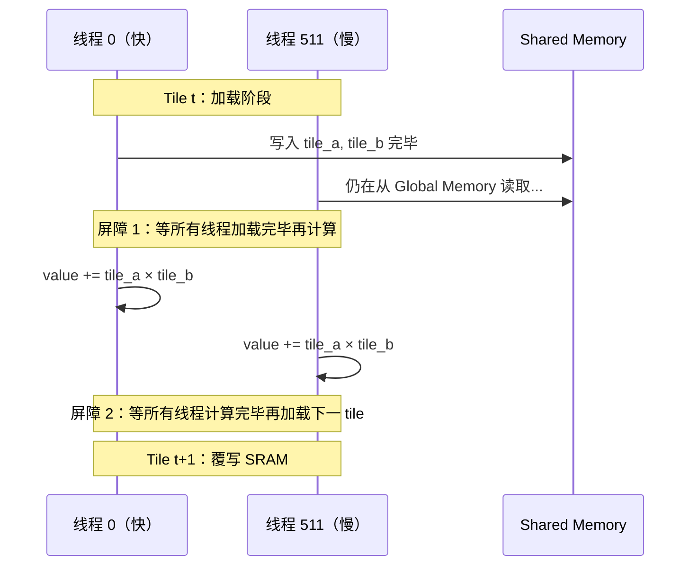
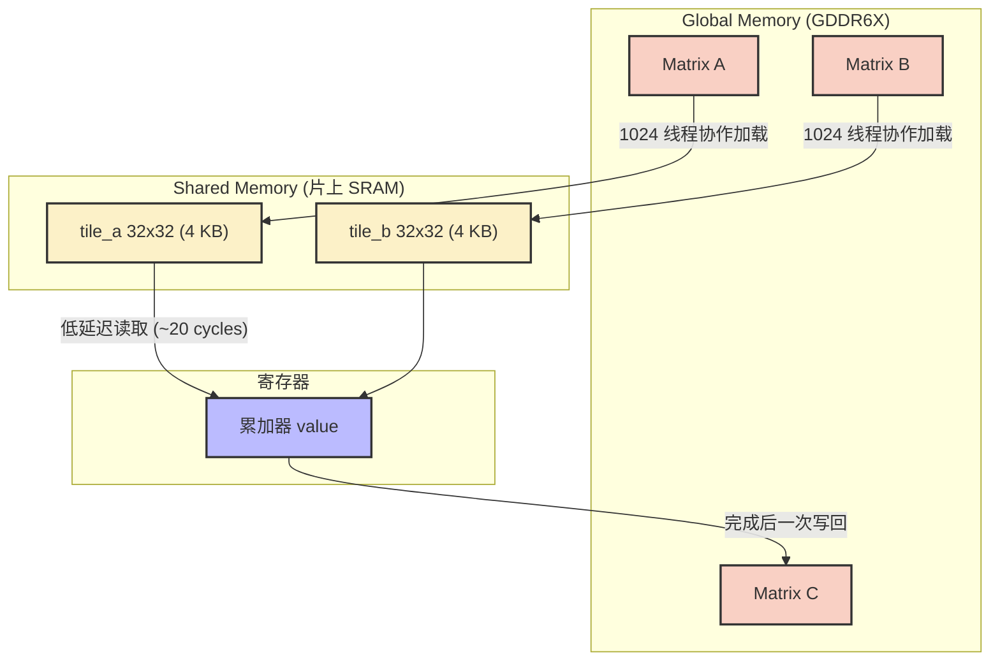
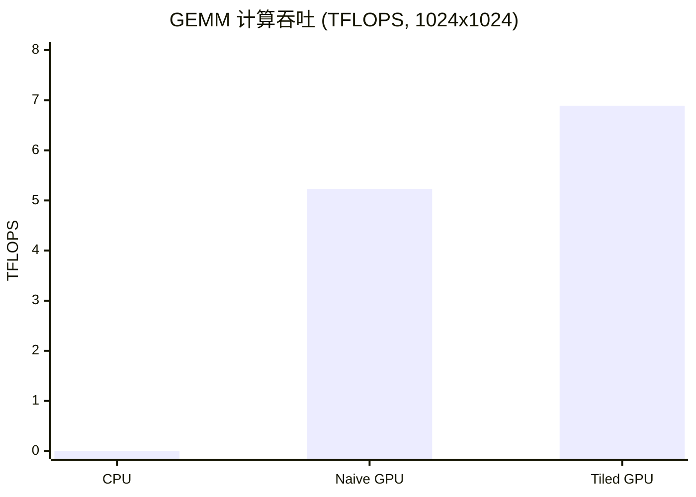

## 本文目标

读完本文，你将能够：

- 理解 GPU 的带宽墙：为什么算力 82.6 TFLOPS 的 RTX 4090 在 Vector Add 上只能发挥不到 0.1% 的计算能力
- 用 Roofline 模型判断一个 Kernel 是 Memory Bound 还是 Compute Bound
- 理解 Shared Memory Tiling 如何将 GEMM 的全局访存量降低 $T$ 倍
- 实现一个 Tiled GEMM 并理解两次 `__syncthreads()` 的必要性

## 对应代码路径

> **硬件环境**：NVIDIA RTX 4090 (Ada Lovelace, sm_89)
> 128 SMs | FP32 82.6 TFLOPS | HBM 1008 GB/s | L2 72 MB | Roofline 拐点 81.9 FLOP/Byte

| 源文件 | Kernel 名称 | 核心技术 | 测试规模 |
|--------|-------------|----------|----------|
| `01_Basics/01_vector_add/vector_add.cu` | `vector_add` | 每线程一元素，合并访存 | N = 67,108,864 (64M) |
| `01_Basics/02_matrix_mul_naive/matrix_mul_naive.cu` | `matrix_mul_naive` | 2D Grid，每线程一个输出元素 | M=N=K=1024 |
| `01_Basics/03_matrix_mul_tiled/matrix_mul_tiled.cu` | `matrix_mul_tiled` | Shared Memory Tiling，`__syncthreads()` | M=N=K=1024 |

> 本篇为 **CUDA-Practice 系列开篇**：建立「带宽墙 → Roofline → Tiling」的直觉，后续 [02 归约](/posts/44fe4eb3/) 的 Shared Memory 同步、[04 矩阵乘优化与寄存器分块](/posts/1a09f6f/) 的寄存器分块、[10 访存优化](/posts/5b6f891d/) 的合并与 Bank 冲突，都将在本节的存储层级与 Tiling 思路上延续。

---

## 三个实现分别做了什么

### 1. Vector Add：带宽压榨的基准

`vector_add` 是最简单的 CUDA Kernel：**每线程一元素**，$C_i = A_i + B_i$，线程间无数据依赖。通过 `idx = blockIdx.x * blockDim.x + threadIdx.x` 分配下标，用足够的 Block 数覆盖全部 64M 元素（本实现未使用 Grid-Stride Loop；若规模超出 Grid 维度上限，可改为每线程多元素的跨步循环）。

它的价值在于建立一个**纯 Memory Bound 的性能基准**——能否把显存带宽压榨到硬件极限，是衡量 CUDA 工程基本功的第一道标尺。

```cpp
// 来源：01_Basics/01_vector_add/vector_add.cu : L5-L10
__global__ void vector_add(const float* A, const float* B, float* C, const int n) {
    int idx = blockDim.x * blockIdx.x + threadIdx.x;
    if (idx < n) {
        C[idx] = A[idx] + B[idx];
    }
}
```

Kernel 配置使用 256 线程/Block。`idx` 的分配保证同一 Warp（32 个线程）的访存地址连续，硬件可以将 32 个 4-byte 请求合并为一个 128-byte 事务（Coalesced Access）。边界判断 `if (idx < n)` 只在最后一个未满的 Block 中触发，不会引起 Warp Divergence。

### 2. Naive GEMM：逐元素独立计算

`matrix_mul_naive` 直接映射矩阵乘法定义。每个线程负责 $C$ 矩阵的一个输出元素，沿 $K$ 维度遍历做内积：

$$C_{i,j} = \sum_{k=0}^{N-1} A_{i,k} \cdot B_{k,j}$$

```cpp
// 来源：01_Basics/02_matrix_mul_naive/matrix_mul_naive.cu : L8-L18
__global__ void matrix_mul_naive(const float* A, const float* B, float* C,
                                  Int m, Int n, Int k) {
    int row = blockDim.y * blockIdx.y + threadIdx.y;
    int col = blockDim.x * blockIdx.x + threadIdx.x;
    if (row < m && col < k) {
        float value = 0.0f;
        for (int i = 0; i < n; ++i) {
            value += A[row * n + i] * B[i * k + col];
        }
        C[row * k + col] = value;
    }
}
```

Block 配置为 `dim3(16, 16)`（256 线程）。每个线程需要从 Global Memory 读取 $A$ 的一行（$N$ 个 float）和 $B$ 的一列（$N$ 个 float）。

### 3. Tiled GEMM：Shared Memory 数据复用

`matrix_mul_tiled` 的核心改进是：将 Block 内线程协作加载数据到 Shared Memory（片上 SRAM），在片上完成乘加计算，避免每个线程独立访问 Global Memory。

Block 配置为 `dim3(32, 32)`（1024 线程，`TILE_WIDTH = 32`）。

---

## Baseline 与瓶颈分析

### Vector Add 的带宽墙

Vector Add 每个元素读 $A$、读 $B$、写 $C$，搬运 $3 \times 4 = 12$ 字节，但只做 1 次加法。算术强度：

$$I = \frac{1 \text{ FLOP}}{12 \text{ Bytes}} \approx 0.083 \text{ FLOP/Byte} \quad [\text{理论}]$$

RTX 4090 的 Roofline 拐点是 $82.6 \text{ TFLOPS} / 1008 \text{ GB/s} \approx 81.9 \text{ FLOP/Byte}$ [理论]。$0.083$ 距拐点差了近 **1000 倍**，意味着计算单元 99.9% 的时间在等待数据。这是一个典型的 Memory Bound 算子——无论算力如何提升，性能天花板由带宽决定：

$$P_{\max} = 0.083 \times 1008 \text{ GB/s} \approx 83.7 \text{ GFLOPS} \quad [\text{理论}]$$

### Naive GEMM 的访存冗余

Naive GEMM 的访存模式本身是高效的：

- 读 `A[row * n + i]`：Warp 内 32 个线程共享同一 `row`，读取同一地址，触发硬件**广播**
- 读 `B[i * k + col]`：Warp 内 32 个线程的 `col` 连续递增，触发**合并访存**

访存模式没问题，问题在于**访存总量**。每个线程读取 $2N$ 个 float 来计算一个输出元素，$N^2$ 个线程总共产生 $2N^3$ 次 float 读取。$N=1024$ 时：

$$\text{总访存量} = 2 \times 1024^3 \times 4 \text{ B} \approx 8 \text{ GB} \quad [\text{理论}]$$

相邻线程需要 $A$ 的同一行、$B$ 的相邻列，存在大量重复读取。

---

## 优化思路：Tiling 如何降低访存量

### 核心思想

将 $K$ 维度的大循环按步长 $T$ 切分。每步先由 Block 内所有线程协作加载一个 $T \times T$ 的 $A$ 子块和 $B$ 子块到 Shared Memory，然后在片上完成这一段的乘加。

$$C_{i,j} = \sum_{t=0}^{\lceil N/T \rceil - 1} \sum_{k=0}^{T-1} A_{i,\; tT + k} \cdot B_{tT + k,\; j}$$

### 访存量对比

以 $N = 1024, T = 32$ 为例：

| 版本 | 每 Block 每 Tile 读取量 | Tile 总数 | Block 总数 | 全局总读取量 |
|------|----------------------|-----------|-----------|-------------|
| Naive | $2 \times 32 \times 1024 \times 4$ B（每线程独立读整行/列）| 1 | 4096 | ~8 GB [理论] |
| Tiled | $2 \times 32^2 \times 4$ B（协作加载 tile） | 32 | 1024 | ~256 MB [理论] |

全局访存量降低为 $1/T = 1/32$。

### 存储层级

Tiling 的本质是手工管理数据在存储层级间的搬运：

| 存储层级 | 硬件位置 | 容量 | 延迟 | 带宽量级 |
|----------|----------|------|------|----------|
| 寄存器 | ALU 旁 | 每线程 255 × 32-bit | ~1 cycle | 数十 TB/s |
| Shared Memory | 片上 SRAM | 每 SM 48-100 KB | ~20-30 cycles | 数 TB/s |
| L2 Cache | 芯片内 | 72 MB | ~200 cycles | ~6 TB/s |
| Global Memory | 板载 GDDR6X | 24 GB | ~400+ cycles | 1008 GB/s |

Shared Memory 由程序员通过 `__shared__` 显式管理，而 L1/L2 Cache 由硬件自动管理。Tiling 将本该从 Global Memory（~400 cycles）反复读取的数据，预取到 Shared Memory（~20 cycles），将随机缓存命中转化为确定性复用。

---

## 关键代码解释

### Tiled GEMM 的 Shared Memory 装填与同步

```cpp
// 来源：01_Basics/03_matrix_mul_tiled/matrix_mul_tiled.cu : L21-L47
for (int tile = 0; tile < num_tiles; ++tile) {
    // 协作加载：每线程加载 tile_a 和 tile_b 各一个元素
    int mCol = tile * TILE_WIDTH + tx;
    if (row < m && mCol < n)
        tile_a[ty][tx] = a[row * n + mCol];
    else
        tile_a[ty][tx] = 0.0f;   // 边缘越界补零

    int nRow = tile * TILE_WIDTH + ty;
    if (nRow < n && col < k)
        tile_b[ty][tx] = b[nRow * k + col];
    else
        tile_b[ty][tx] = 0.0f;

    __syncthreads();  // 屏障 1：确保所有线程加载完毕

    // 内层循环：纯 Shared Memory 读取，无 Global Memory 访问
    for (int i = 0; i < TILE_WIDTH; ++i)
        value += tile_a[ty][i] * tile_b[i][tx];

    __syncthreads();  // 屏障 2：确保所有线程计算完毕再加载下一 tile
}
```

### Block / Thread 映射

| 层级 | 配置 | 职责 |
|------|------|------|
| Grid | `((K+31)/32, (M+31)/32)` | 覆盖整个 $C$ 矩阵 |
| Block | `dim3(32, 32)`, 1024 线程 | 计算 $C$ 的一个 $32 \times 32$ 子块 |
| Thread `(tx, ty)` | — | 加载 `tile_a[ty][tx]` 和 `tile_b[ty][tx]`；累加 $\sum_i \text{tile\_a}[ty][i] \times \text{tile\_b}[i][tx]$ |

### 两次 `__syncthreads()` 的必要性



- **屏障 1** 防止读未就绪数据：快线程开始计算时，慢线程可能尚未完成加载
- **屏障 2** 防止数据竞争：快线程进入下一 tile 覆写 SRAM 时，慢线程可能还在用当前 tile 的数据

省去任一屏障都会导致**不可确定性重现**的计算错误。

### 数据流总览



---

## 结果与边界

### Vector Add 性能（N = 67,108,864，100 次迭代取平均）

> 数据来源：`Results/01_Basics.md` 原始日志

| 版本 | Kernel 耗时 | 有效带宽 | vs CPU | 数据性质 |
|------|------------|---------|--------|----------|
| CPU 串行 | 156.45 ms | — | 1x | [实测] |
| **GPU Vector Add** | **0.86 ms** | **932.81 GB/s** | **181x** | [实测] |

总搬运量 = $3 \times 67{,}108{,}864 \times 4 \text{ B} = 768 \text{ MB}$ [理论]。
有效带宽 932.81 GB/s 达到 RTX 4090 理论峰值 1008 GB/s 的 **92.5%** [实测/理论]，说明该 Kernel 已接近显存带宽物理极限。

### GEMM 性能（1024 x 1024，10 次迭代取平均）

> 数据来源：`Results/01_Basics.md` 原始日志

| 版本 | Kernel 耗时 | 计算吞吐 | vs CPU | vs Naive | 数据性质 |
|------|------------|---------|--------|----------|----------|
| CPU 串行 | 2090.49 ms | 1.03 GFLOPS | 1x | — | [实测] |
| GPU Naive | 0.41 ms | 5.23 TFLOPS (约 5226 GFLOPS) | 5087x | 1.00x | [实测] |
| **GPU Tiled** | **0.31 ms** | **6.89 TFLOPS (约 6893 GFLOPS)** | **6696x** | **1.32x** | [实测] |



### 为什么 Tiled 只比 Naive 快 1.32x 而非 32x

理论上 Tiling 降低了 32 倍全局访存量，但实测只有 1.32 倍提升。原因在于测试规模：

$1024 \times 1024$ 的三个矩阵 $A, B, C$ 合计仅 12 MB，远小于 RTX 4090 的 72 MB L2 Cache。Naive 版本中大量"重复"的 Global Memory 请求实际被 L2 Cache 拦截，并未真正到达 HBM。Naive 版本在这个规模下已经享受了硬件缓存的隐性收益。

Tiled 版本的优势在于绕过了 L2→SM 这段路径的竞争，将数据直接放到距计算单元更近的 Shared Memory 中，因此仍然获得了 32% 的提升。在更大矩阵规模（超出 L2 容量）下，Tiling 的收益会更加显著。

### 距离硬件峰值还有多远

6.89 TFLOPS 仅为 RTX 4090 FP32 峰值 82.6 TFLOPS 的 **8.3%** [实测/理论]。

这是因为 Tiled GEMM 的内层循环每次从 Shared Memory 读取 2 个 float（8 字节），执行 1 次 FMA（2 FLOPs），算术强度仍然只有：

$$I_{\text{SMEM}} = \frac{2 \text{ FLOPs}}{8 \text{ Bytes}} = 0.25 \text{ FLOP/Byte} \quad [\text{理论}]$$

这比 Vector Add 的 0.083 有了 3 倍提升，但距离拐点 81.9 仍差两个数量级。突破这个瓶颈需要将数据进一步提升到寄存器级别——每个线程持有多个输出元素，在寄存器中完成大量乘加，这就是 [04 矩阵乘优化与寄存器分块](/posts/1a09f6f/) 要解决的 Register Tiling 问题。

---

## 常见误区

1. **误区**：Naive GEMM 慢是因为访存没有合并。
   **实际**：Naive GEMM 的访存模式是高效的——读 $A$ 时 Warp 内广播，读 $B$ 时连续地址合并。真正的瓶颈是总访存量 $O(N^3)$，即使每次都是高效合并读取，往返次数过多仍然导致高延迟。

2. **误区**：Tiling 降低了 32 倍访存，应该带来接近 32 倍的加速。
   **实际**：在小规模矩阵（12 MB < 72 MB L2）下，Naive 版本已经享受了 L2 Cache 的隐性收益。只有当数据规模超出 L2 容量时，Tiling 的全局访存降低才能完全转化为性能提升。

3. **误区**：Vector Add 的加速比（181x）说明 GPU 比 CPU 快 181 倍。
   **实际**：Kernel 加速比 181x 没有计入 H2D/D2H 数据传输时间（49.48 ms + 25.91 ms）。含传输的端到端加速比仅 **2.05x** [实测]。GPU 的优势在计算密集或可以隐藏传输开销（Pipeline / Overlap）的场景下才能真正发挥。

4. **误区**：Tiled GEMM 只需要一次 `__syncthreads()`。
   **实际**：需要两次。第一次保证加载完成后再计算，第二次保证计算完成后再覆写 SRAM。省去第二次屏障会导致快线程提前覆写慢线程正在使用的数据，引发不可确定性的计算错误。

---

## 系列导航

### 前置阅读

本篇为系列第一篇，无前置依赖。建议先浏览 [博客索引](/posts/d6fa227a/) 中的四条学习路线，再按需选择后续篇章。

### 推荐后续（承上启下）

| 文章 | 与本篇的衔接 |
|------|----------------|
| [02 归约与线程粗化](/posts/44fe4eb3/) | 同为 Memory Bound：从「每线程一元素」到树状归约的 Shared Memory 同步与 Warp Divergence 消除 |
| [04 矩阵乘优化与寄存器分块](/posts/1a09f6f/) | 本篇 Tiled GEMM 的算术强度仍仅 0.25 FLOP/Byte；04 用 Register Tiling 将数据提升到寄存器级，逼近 cuBLAS 约 50% 峰值 |
| [10 访存优化与共享内存冲突](/posts/5b6f891d/) | 本篇依赖合并访存与存储层级直觉；10 深入 128B Cache Line、Bank Conflict 与 Async Copy Pipeline |

---

## 顺序导航

- 上一篇：[CUDA实践-00-系列导读与学习路线](/posts/d6fa227a/)
- 下一篇：[CUDA实践-02-归约与线程粗化](/posts/44fe4eb3/)
