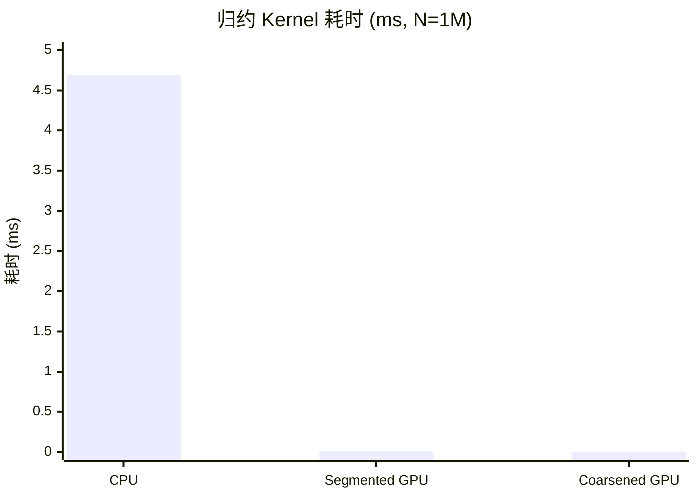

## 本文目标

读完本文，你将能够：

- 理解归约的带宽墙：为什么加法算术强度趋近于 0，归约是典型的 Memory Bound 算子
- 用 Warp Divergence 的物理成因解释朴素树状归约（stride 倍增）为何浪费算力，以及收敛索引（stride 折半）如何消除发散
- 理解 Shared Memory 树状归约与多 Block 下 `atomicAdd` 收尾的必要性
- 实现线程粗化（Thread Coarsening），在寄存器内先累加多元素再写 Shared Memory，有效降低 Block 数、同步与原子操作次数，逼近 HBM 带宽极限

## 对应代码路径

> **硬件环境**：NVIDIA RTX 4090 (Ada Lovelace, sm_89)
> 128 SMs | FP32 82.6 TFLOPS | HBM 1008 GB/s | L2 72 MB | Roofline 拐点 81.9 FLOP/Byte

| 源文件 | Kernel 名称 | 核心技术 | 测试规模 |
|--------|-------------|----------|----------|
| `02_Reduction/01_reduce_sum/reduce_sum.cu` | `simple_reduce_sum`<br>`convergent_reduce_sum`<br>`shared_reduce_sum` | 朴素树状（发散）/ 收敛索引 / Shared Memory 树状归约 | N = 2048 |
| `02_Reduction/02_reduce_optimized/reduce_optimized.cu` | `segmented_reduce_sum`<br>`coarsened_reduce_sum`<br>`coarsened_reduce_max` | 多 Block + atomicAdd、线程粗化 (COARSE_FACTOR=4)、Shared Memory 收尾 | N = 1,048,576 (1M) |
| `02_Reduction/03_dot_product/dot_product.cu` | `shared_dot_product`<br>`coarsened_dot_product`<br>`fma_dot_product` | 点积 = 乘后归约、线程粗化、FMA 融合、L2 热数据 | N = 1,048,576 (1M) |

> 本篇多 Block 归约以 **Shared Memory 树状折叠 + atomicAdd** 收尾，未使用 `__shfl_*`；Warp 级无锁归约见 [06 线程束原语与寄存器通信](/posts/fec051fc/)。

> **本篇在系列中的位置**：承接 [01 基础概念与分块](/posts/7608f1b0/) 的带宽墙与 Shared Memory 直觉，将「片上缓存与同步」用于**归约**这一经典模式（多 Block、atomicAdd、线程粗化）。后续 [03 前缀和与多块扫描](/posts/bcb510f9/) 同属树形结构但需保留前缀和；[06 线程束原语与寄存器通信](/posts/fec051fc/) 用 `__shfl_*` 做无 Shared Memory 的 Warp 归约；[05 大模型算子与注意力归一化](/posts/cb29461c/) 的 Softmax/LayerNorm 依赖归约作为子步骤。

---

## 三个实现分别做了什么

### 1. Reduce Sum：从朴素到收敛再到 Shared Memory

**问题**：将长度为 $N$ 的数组归约为一个标量 $\sum_{i=0}^{N-1} x_i$。这是 Softmax、LayerNorm 等算子的核心子步骤。

`simple_reduce_sum` 采用**树状归约**：`stride` 从 1 倍增（1, 2, 4, …），每轮用 `if (threadIdx.x % stride == 0)` 让部分线程做 `input[i] += input[i + stride]`。加法次数为 $O(\log N)$，但同一 Warp 内满足条件的线程**不连续**（例如 stride=16 时只有 tid=0,16 执行），导致 Warp Divergence，大量算力被掩码浪费。

`convergent_reduce_sum` **倒转折叠方向**：`stride` 从 `blockDim.x` 折半递减至 1，条件改为 `if (threadIdx.x < stride)`。这样每轮参与计算的线程 tid 始终落在 $[0, \textit{stride})$，**连续无间隙**，未参与的 Warp 被调度器挂起，存活 Warp 内利用率恢复。

`shared_reduce_sum` 在收敛逻辑基础上，先将数据加载到 **Shared Memory**，再在片上做树状归约，避免对 Global Memory 的重复读写；收尾由线程 0 将 `shared_data[0]` 写回全局。单 Block 时无 atomicAdd；多 Block 版本见下文。

```cpp
// 来源：02_Reduction/01_reduce_sum/reduce_sum.cu : L5-L15
__global__ void simple_reduce_sum(PFloat input, PFloat output) {
    CInt i = 2 * threadIdx.x;
    for (int stride = 1; stride <= blockDim.x; stride *= 2) {
        if (threadIdx.x % stride == 0) {
            input[i] += input[i + stride];
        }
        __syncthreads();
    }
    if (threadIdx.x == 0) {
        *output = input[0];
    }
}
```

```cpp
// 来源：02_Reduction/01_reduce_sum/reduce_sum.cu : L31-L44
__global__ void shared_reduce_sum(PFloat input, PFloat output) {
    __shared__ float shared_data[BLOCK_SIZE];
    CInt i = threadIdx.x;
    shared_data[i] = input[i] + input[i + BLOCK_SIZE];
    for (int stride = blockDim.x / 2; stride >= 1; stride /= 2) {
        __syncthreads();
        if (threadIdx.x < stride) {
            shared_data[i] += shared_data[i + stride];
        }
    }
    if (threadIdx.x == 0) {
        *output = shared_data[0];
    }
}
```

### 2. Reduce Optimized：多 Block 与线程粗化

当 $N$ 很大（如 1M）时，单 Block 无法覆盖。`segmented_reduce_sum` 将数组按 Block 分段：每个 Block 负责 $2 \times \textit{blockDim.x}$ 个元素，在 Shared Memory 中做树状归约，最后用 **atomicAdd(output, shared_data[0])** 将各 Block 的局部和合并为一个标量。Block 数多时，大量线程在原子变量上排队，成为瓶颈。

`coarsened_reduce_sum` 引入**线程粗化**：每个线程不再只处理 2 个元素，而是连续处理 $2 \times \textit{COARSE\_FACTOR}$ 个（本实现中 COARSE_FACTOR=4，即每线程 8 个）。在寄存器中先用 `sum` 累加，再写入 `shared_data[tid]`，然后仍用树状归约 + 单次 atomicAdd 收尾。等效 Block 数降为约 $1/(2 \times \textit{COARSE\_FACTOR})$，`__syncthreads()` 与 atomicAdd 调用次数同步减少，带宽利用率显著提升。

`coarsened_reduce_max` 将同一粗化结构用于求最大值，Block 内用 `fmaxf` 归约，收尾用 atomicCAS 实现 float 的「原子取大」（本实现未用 atomicMax 因 CUDA 对 float 无原生支持）。

### 3. Dot Product：乘后归约与 FMA

点积 $\sum_i a_i b_i$ 可视为「先逐元素乘，再归约」。`shared_dot_product` 用多 Block + Shared Memory 树状归约 + atomicAdd，每线程先算若干组 $a[i]*b[i]$ 再写入 shared；`coarsened_dot_product` 同样做线程粗化。`fma_dot_product` 用 `fmaf(a, b, sum)` 将乘加融合为单条 FMA 指令，在多数现代编译器下与 `a*b+sum` 常被优化成同一指令，实测差异可忽略；语义上 FMA 对舍入更可控。

---

## Baseline 与瓶颈分析

### 归约的带宽墙

归约每元素读 1 次（写回 1 个标量可忽略），做 1 次加法。算术强度：

$$I = \frac{1 \text{ FLOP}}{4 \text{ Bytes}} = 0.25 \text{ FLOP/Byte} \quad [\text{理论}]$$

若按「读 N 个 float、写 1 个」粗算为 $N \times 4$ 字节搬运，强度仍远低于 Roofline 拐点 81.9 FLOP/Byte，因此归约是典型的 **Memory Bound** 算子——性能天花板由带宽决定。能否打满 HBM 带宽是衡量归约实现好坏的首要指标。

### 朴素树状归约的 Warp Divergence

`simple_reduce_sum` 中 `stride` 从 1 倍增时，条件 `threadIdx.x % stride == 0` 使同 Warp 内活跃线程**稀疏**。例如 stride=16 时，Warp 0 中只有 tid=0 和 tid=16 执行，其余 30 个线程被掩码阻塞，该 Warp 有效利用率仅 2/32。步长越大，存活线程越少，算力浪费越严重。

### 多 Block 下的 atomicAdd 瓶颈

1M 元素若每 Block 处理 $2 \times 1024$ 个元素，约需 512 个 Block。每个 Block 归约后都要执行一次 `atomicAdd(output, shared_data[0])`，数百个线程串行化地更新同一地址，产生竞争与序列化，成为除带宽外的另一瓶颈。线程粗化通过减少 Block 数量，直接减少 atomicAdd 调用次数，从而缓解该瓶颈。

---

## 优化思路：收敛索引与线程粗化

### 收敛索引（消除 Warp Divergence）

**核心思想**：将树状折叠的**方向**从「stride 从 1 倍增」改为「stride 从 blockDim.x 折半递减」。这样每轮满足 `threadIdx.x < stride` 的线程 tid 落在 $[0, \textit{stride})$，在 Warp 内连续。例如 stride=16 时，只有前 16 个线程工作，且全部落在 Warp 0 的前半部分；stride=8 时前 8 个线程，仍在同一 Warp 内连续。未参与轮次的 Warp 直接退出循环，无分支发散。

### 线程粗化（降低 Block 数与原子竞争）

**核心思想**：让每个线程在**寄存器**内先连续处理多份数据（如 8 个元素），做局部累加，再写入 Shared Memory 的一个槽位，然后照常做 Block 内树状归约 + 一次 atomicAdd。这样：

- 覆盖相同总元素数所需的 Block 数降为原来的约 $1/(2 \times \textit{COARSE\_FACTOR})$；
- `__syncthreads()` 和 atomicAdd 次数成比例减少；
- 更多工作留在寄存器，利于隐藏访存延迟、提高 ILP。

**访存与同步量级对比**（1M 元素，BLOCK_SIZE=1024，COARSE_FACTOR=4）：

| 版本 | 每 Block 覆盖元素数 | Block 数 | atomicAdd 次数 |
|------|---------------------|----------|----------------|
| Segmented | $2 \times 1024$ | $\lceil 10^6 / (2 \times 1024) \rceil \approx 489$ | 489 |
| Coarsened | $2 \times 4 \times 1024$ | $\lceil 10^6 / (8 \times 1024) \rceil \approx 123$ | 123 |

Block 数约降为 1/4，原子竞争显著减轻。

---

## 关键代码解释

### 收敛版 stride 与 Shared Memory 归约

```cpp
// 来源：02_Reduction/01_reduce_sum/reduce_sum.cu : L19-L28（convergent 逻辑）
// stride 从 blockDim.x 减半至 1，活跃线程 tid ∈ [0, stride)，连续无间隙
for (int stride = blockDim.x; stride >= 1; stride /= 2) {
    if (threadIdx.x < stride) {
        input[i] += input[i + stride];
    }
    __syncthreads();
}
```

```cpp
// 来源：02_Reduction/01_reduce_sum/reduce_sum.cu : L36-L40（shared 版本）
for (int stride = blockDim.x / 2; stride >= 1; stride /= 2) {
    __syncthreads();  // 先同步再读，避免读未就绪数据
    if (threadIdx.x < stride) {
        shared_data[i] += shared_data[i + stride];
    }
}
```

**要点**：Shared Memory 版本在每轮**先** `__syncthreads()` **再**读 shared_data，保证上一轮写完成后再做本轮归约，与 [01](/posts/7608f1b0/) 中 Tiled GEMM 的「加载完毕再计算」一致。

### 线程粗化：寄存器内累加再写 Shared

```cpp
// 来源：02_Reduction/02_reduce_optimized/reduce_optimized.cu : L29-L54
__global__ void coarsened_reduce_sum(PFloat input, PFloat output, CInt length) {
    __shared__ float shared_data[BLOCK_SIZE];
    CInt tid = threadIdx.x;
    CInt sid = 2 * COARSE_FACTOR * blockDim.x * blockIdx.x + tid;

    float sum = 0.0f;
    if (sid < length) {
        sum = input[sid];
        for (int i = 1; i < COARSE_FACTOR * 2; ++i) {
            if (sid + i * BLOCK_SIZE < length)
                sum += input[sid + i * BLOCK_SIZE];
        }
    }
    shared_data[tid] = sum;

    for (int stride = blockDim.x / 2; stride > 0; stride /= 2) {
        __syncthreads();
        if (tid < stride) shared_data[tid] += shared_data[tid + stride];
    }
    if (tid == 0) atomicAdd(output, shared_data[0]);
}
```

**要点**：`sid` 为该线程负责的**首元素**全局下标；每线程连续读 $2 \times \textit{COARSE\_FACTOR}$ 个元素（步长 BLOCK_SIZE），在寄存器 `sum` 中累加后写入 `shared_data[tid]`，再经树状归约与一次 atomicAdd 得到全局和。

### Block / Grid 配置

| 层级 | Segmented | Coarsened (COARSE_FACTOR=4) |
|------|-----------|-----------------------------|
| Block | dim3(BLOCK_SIZE)=1024 线程 | 同左 |
| Grid | $\lceil N / (2 \times \textit{BLOCK\_SIZE}) \rceil$ | $\lceil N / (2 \times \textit{COARSE\_FACTOR} \times \textit{BLOCK\_SIZE}) \rceil$ |
| 每线程元素数 | 2 | $2 \times 4 = 8$ |

---

## 结果与边界

### Reduce Sum 性能（N = 2048，100 次迭代取平均）

> 数据来源：`Results/02_Reduction.md` 原始日志

| 版本 | Kernel 耗时 | vs Simple | 说明 |
|------|------------|-----------|------|
| Simple Reduce | 0.0051 ms | 1.00x | stride 倍增，Warp 发散 |
| Convergent Reduce | 0.0038 ms | 1.36x | 收敛索引，消除发散 |
| Shared Memory Reduce | 0.0038 ms | 1.36x | 收敛 + 片上缓存 |

在 2048 元素（约 8 KB）规模下，Convergent 与 Shared 版本耗时相同。数据量小且访存连续时，L1 Cache 已能吸收大部分 Global Memory 访问，显式使用 Shared Memory 未拉开差距；但收敛索引带来的发散消除仍然有效（相对 Simple 约 1.36x）。

### Reduce Optimized 性能（N = 1,048,576，100 次迭代取平均）

> 数据来源：`Results/02_Reduction.md` 原始日志

| 版本 | Kernel 耗时 | vs CPU (4.69 ms) | 有效带宽 | 数据性质 |
|------|------------|------------------|----------|----------|
| CPU 参考 | 4.69 ms | 1x | — | [实测] |
| GPU Segmented | 0.0084 ms | 558x | 476.19 GB/s | [实测] |
| **GPU Coarsened** | **0.0047 ms** | **992x** | **887.48 GB/s** | [实测] |

Coarsened 将有效带宽推到 **887.48 GB/s**，约为 RTX 4090 HBM 理论峰值 1008 GB/s 的 **88%** [实测/理论]。对算术强度约 0.25 FLOP/Byte 的归约，已接近该问题在带宽上的物理极限。



### Dot Product 与「超带宽」现象（N = 1M，两向量 8 MB）

> 数据来源：`Results/02_Reduction.md` 原始日志

| 版本 | Kernel 耗时 | 有效带宽 | 说明 |
|------|------------|----------|------|
| Simple | 0.0092 ms | — | 基准 |
| Coarsened | 0.0056 ms | ~1506 GB/s | 粗化 + 读两向量 |
| FMA | 0.0056 ms | ~1506 GB/s | 与 Coarsened 同量级 |

**边界说明**：8 MB 数据落在 RTX 4090 的 72 MB L2 Cache 内，热数据被 L2 反复命中，实测带宽可**超过** HBM 理论峰值 1008 GB/s（如 1506 GB/s）。这是 L2 参与读带宽的必然结果，并非违反物理极限；当问题规模超出 L2 容量后，带宽会回落至 HBM 量级。

### COARSE_FACTOR 不宜过大

将 COARSE_FACTOR 提到 32 以上时，每线程寄存器占用增加，可能触发 **Register Spilling**，溢出到 Local Memory（实为全局内存），反而增加延迟、降低带宽。通常 4～8 在带宽与占用之间较均衡。

---

## 常见误区

1. **误区**：在小数据（如 N=2048）上，Shared Memory 版归约一定比 Convergent 版快很多。
   **实际**：当数据能完全被 L1 缓存吸收时，Convergent 直接读 Global Memory 与 Shared 版读片上内存的延迟差异被抹平，二者耗时可能相同 [实测]。Shared Memory 的价值在大规模、多 Block 与复杂归约中更明显。

2. **误区**：线程粗化会降低并行度，所以一定变慢。
   **实际**：粗化减少的是 Block 数量和 atomicAdd/__syncthreads 次数，在归约这类 Memory Bound 且原子竞争明显的场景中，减少同步与原子冲突带来的收益通常大于「略少 Block」的损失，实测 Coarsened 相对 Segmented 约 1.77x [实测]。

3. **误区**：点积测出 1506 GB/s 说明突破了 GPU 硬件极限。
   **实际**：8 MB 数据远小于 72 MB L2，大量读来自 L2 而非 HBM。L2 带宽高于 HBM，因此「有效带宽」可超过 1008 GB/s；规模超出 L2 后，带宽会回落到 HBM 量级。

4. **误区**：手写 `fmaf(a, b, sum)` 一定比 `a*b + sum` 更快。
   **实际**：现代 NVCC 对简单乘加常自动生成 FMA，二者耗时多为同一量级 [实测 0.0056 ms 对 0.0056 ms]。FMA 的主要价值是舍入语义更可控，而非在当代编译器下再赚一轮加速。

---

## 系列导航

### 前置阅读

| 文章 | 与本篇的衔接 |
|------|----------------|
| [01 基础概念与分块](/posts/7608f1b0/) | 建立带宽墙、Roofline 与 Shared Memory Tiling 直觉；本篇在同一存储层级上做「归约」模式并引入多 Block 与 atomicAdd |

### 推荐后续（承上启下）

| 文章 | 与本篇的衔接 |
|------|----------------|
| [03 前缀和与多块扫描](/posts/bcb510f9/) | 同属树形/线性扫描结构，但需保留中间前缀结果，多 Block 与分段策略与归约形成对照 |
| [06 线程束原语与寄存器通信](/posts/fec051fc/) | 本篇用 Shared Memory + atomicAdd 收尾；06 用 `__shfl_*` 在 Warp 内无 Shared Memory 完成归约/Scan，进一步压延迟 |
| [05 大模型算子与注意力归一化](/posts/cb29461c/) | Softmax、LayerNorm、RMSNorm 均以归约（max/sum/方差）为子步骤，本篇为理解其 Kernel 打底 |

---

## 顺序导航

- 上一篇：[CUDA实践-01-基础概念与分块](/posts/7608f1b0/)
- 下一篇：[CUDA实践-03-前缀和与多块扫描](/posts/bcb510f9/)
