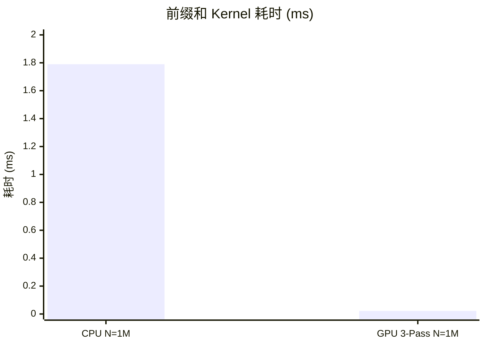

## 本文目标

读完本文，你将能够：

- 理解前缀和（Inclusive Scan）与归约的差异：前者需保留每一步中间结果，是 Radix Sort、流压缩等的基础
- 用 Span（并行深度）与 Work（总操作量）解释为何 Kogge-Stone 在 GPU 上优于理论 Work 更少的 Brent-Kung
- 理解 Block 内 Kogge-Stone 的「读-改-写」在同一块 Shared Memory 上时，为何需要双 `__syncthreads()` 防 RAW 冒险
- 实现多 Block 下的三遍扫描（块内 KS → 对 block_sums 再 Scan → add_block_sums），完成百万级元素的全局前缀和

## 对应代码路径

> **硬件环境**：NVIDIA RTX 4090 (Ada Lovelace, sm_89)
> 128 SMs | FP32 82.6 TFLOPS | HBM 1008 GB/s | L2 72 MB | Roofline 拐点 81.9 FLOP/Byte

| 源文件 | Kernel 名称 | 核心技术 | 测试规模 |
|--------|-------------|----------|----------|
| `03_Scan/01_prefix_sum/prefix_sum.cu` | `kogge_stone_scan`<br>`brent_kung_scan` | 单 Block KS（$\log N$ 步）/ BK（两阶段树），Shared Memory 双缓冲防 RAW | N = 1024 |
| `03_Scan/02_segmented_scan/segmented_scan.cu` | `coarse_scan`<br>`segmented_scan`<br>`add_block_sums` | 单 Block 粗化 + 段末 KS（N≤4096）；多 Block 3-Pass（块内 KS + block_sums，再 Scan block_sums，再加回） | N = 4096<br>N = 1,048,576 (1M) |

> 本篇多 Block 扩展按「块末写 block_sums → 对 block_sums 做一次 Scan → 每块加前一块基值」实现，未使用 Decoupled Look-back 等更复杂结构；Warp 内无 Shared Memory 的 Scan 见 [06 线程束原语与寄存器通信](/posts/fec051fc/)。

> **本篇在系列中的位置**：承接 [02 归约与线程粗化](/posts/44fe4eb3/) 的树形折叠与 Shared Memory 同步，本篇在同一层级做**需保留每一步中间结果**的前缀和（Scan），并推广到多 Block（3-Pass）。后续 [06 线程束原语与寄存器通信](/posts/fec051fc/) 可用 `__shfl_up_sync` 等做 Warp 内 Scan；[12 标准库与工程实践](/posts/a1e20e80/) 的 Thrust 提供工业级 `inclusive_scan` 可对比本实现。

---

## 三个实现分别做了什么

### 1. 单 Block 前缀和：Kogge-Stone 与 Brent-Kung

**问题**：给定数组 $x[0 \dots n-1]$，计算 Inclusive 前缀和 $y[i] = \sum_{j=0}^{i} x[j]$。与归约不同，每个 $y[i]$ 都依赖前序结果，必须保留中间状态。

`kogge_stone_scan` 在 Shared Memory 上做**步长倍增**的扫描：`stride` 从 1 开始每次乘 2，每轮中满足 `tid >= stride` 的线程执行 `val = shared_data[tid] + shared_data[tid - stride]`，先写入局部变量 `val`，经 `__syncthreads()` 后再写回 `shared_data[tid]`。总轮数为 $\lceil \log_2 N \rceil$，**每轮内参与计算的线程连续**（tid ≥ stride），无 Warp 内分支断裂；代价是总加法次数为 $O(N \log N)$（Work 大），但 **Span 仅 $\log N$ 步**，同步次数少、流水饱满。

`brent_kung_scan` 采用两阶段树：先「上 sweep」再「下 sweep」，总加法次数为 $O(N)$（Work 小），但每轮中只有部分下标参与（如 `index = (tid+1)*stride*2 - 1`），**Warp 内大量线程空闲**，且总步数约 $2 \log N$，`__syncthreads()` 次数约为 KS 的两倍。在 GPU 上实测 KS 更快 [实测]。

```cpp
// 来源：03_Scan/01_prefix_sum/prefix_sum.cu : L4-L36
__global__ void kogge_stone_scan(PFloat input, PFloat output, CInt n) {
    extern __shared__ float shared_data[];
    CInt tid = threadIdx.x;

    if (tid < n) shared_data[tid] = input[tid];
    else         shared_data[tid] = 0.0f;

    for (int stride = 1; stride < blockDim.x; stride *= 2) {
        __syncthreads();
        float val = 0.0f;
        if (tid >= stride) {
            val = shared_data[tid] + shared_data[tid - stride];
        }
        __syncthreads();

        if (tid >= stride) {
            shared_data[tid] = val;
        }
    }

    if (tid < n) output[tid] = shared_data[tid];
}
```

### 2. 单 Block 粗化扫描：coarse_scan（小规模）

当 $N \le \textit{BLOCK\_SIZE} \times \textit{COARSE\_FACTOR}$（如 1024×4=4096）时，可用单 Block 完成。`coarse_scan` 让每线程负责 COARSE_FACTOR 个元素：先加载到 Shared Memory，在段内做**顺序**前缀和（每段独立），再收集每段末元素到 `section_sums`，对 `section_sums` 做一次 Kogge-Stone 得到「段前缀和」，最后把前一段的基值加回本段并写回 `output`。这样避免多 Block 与 3-Pass 的多次 Kernel 与全局访存，在 N=4096 时实测比同规模 3-Pass 略快（约 0.0047 ms vs 0.0059 ms [实测]）。

### 3. 多 Block 三遍扫描：segmented_scan + add_block_sums

当 $N$ 很大（如 1M）时，单 Block 无法覆盖。本实现采用**三遍扫描**：

- **Pass 1**：`segmented_scan` 每个 Block 对自身 $[\textit{gid}, \textit{gid}+\textit{blockDim.x})$ 做 Kogge-Stone，结果写回 `output`，并将该 Block 最后一个元素（块和）写入 `block_sums[blockIdx.x]`。
- **Pass 2**：对长度为「Block 数」的 `block_sums` 再执行一次前缀和（单 Block 或递归），得到 `scanned_block_sums`，即「前若干块的累加和」。
- **Pass 3**：`add_block_sums` 每个 Block 将 `scanned_block_sums[blockIdx.x - 1]`（前一块的基值）加到自己负责的每个 `output[gid]` 上；Block 0 无前驱，不读 `block_sums[-1]`，需在代码中避免越界。

这样 Block 间无需全局同步，仅通过中间数组在 HBM 上传递块和与扫描后的块和，即可得到全局前缀和。

```cpp
// 来源：03_Scan/02_segmented_scan/segmented_scan.cu : L66-L102
__global__ void segmented_scan(CPFloat input, PFloat output, PFloat block_sums, CInt n) {
    extern __shared__ float shared_data[];
    CInt tid = threadIdx.x;
    CInt gid = blockIdx.x * blockDim.x + tid;

    if (gid < n) shared_data[tid] = input[gid];
    else         shared_data[tid] = 0.0f;
    __syncthreads();

    for (int stride = 1; stride < blockDim.x; stride *= 2) {
        float val = 0.0f;
        if (tid >= stride) val = shared_data[tid] + shared_data[tid - stride];
        __syncthreads();
        if (tid >= stride) shared_data[tid] = val;
        __syncthreads();
    }

    if (gid < n) output[gid] = shared_data[tid];
    if (tid == blockDim.x - 1 && block_sums != nullptr)
        block_sums[blockIdx.x] = shared_data[tid];
}
```

```cpp
// 来源：03_Scan/02_segmented_scan/segmented_scan.cu : L105-L111
__global__ void add_block_sums(PFloat output, CPFloat scanned_block_sums, CInt n) {
    CInt gid = blockIdx.x * blockDim.x + threadIdx.x;
    if (blockIdx.x > 0 && gid < n) {
        output[gid] += scanned_block_sums[blockIdx.x - 1];
    }
}
```

---

## Baseline 与瓶颈分析

### 前缀和与归约的差异

归约只需一个标量结果，树状折叠时中间节点可覆盖写；前缀和要求每个位置 $i$ 的输出依赖 $[0, i]$ 的完整历史，不能随意覆盖。因此前缀和既是 **Memory Bound**（读写出入与归约同量级），又对**数据依赖与写顺序**更敏感，多 Block 下必须显式传递「前块累加和」才能得到全局一致结果。

### 单 Block：Span 与 Warp 利用率

并行算法常用 **Work**（总操作数）和 **Span**（关键路径长度）衡量。Brent-Kung 的 Work 为 $O(N)$，优于 Kogge-Stone 的 $O(N \log N)$，但：

- BK 每轮只有部分下标参与（如奇数位、再隔位等），同 Warp 内大量线程空闲，**Warp Divergence** 严重；
- BK 需两阶段（上爬树、下分发），**Span 约 $2 \log N$**，`__syncthreads()` 次数约为 KS 的两倍。

在 GPU 上，每轮同步后全体线程要齐步前进，Span 和每轮利用率比总 Work 更影响耗时。实测 N=1024 时 KS **0.0028 ms**、BK **0.0037 ms**，KS 约快 32%（或说 BK 慢约 24%）[实测]。

### 多 Block：无全局同步下的信息传递

GPU 的 Block 之间没有 `__syncthreads()` 级别的同步。若把 1M 元素分给 1024 个 Block，每个 Block 只能看到自己的数据；要得到全局前缀和，必须知道「前面所有块的累加和」作为本块基值。因此需要**中间数组**：各块先把块和写出，再对块和做一次前缀和，最后把「前块累加和」加回本块。这带来额外的 **HBM 读写**（block_sums 的写出与读入），是 Scan 难以像纯归约那样逼近 900+ GB/s 的重要原因之一。

---

## 优化思路：Kogge-Stone 与三遍扫描

### 单 Block 选 Kogge-Stone 的原因

- **Span 最小**：仅 $\log N$ 步，每步一次 `__syncthreads()`，总同步次数少。
- **每步满负载**：`tid >= stride` 的线程连续，无 Warp 内断裂，利用率高。
- **双屏障防 RAW**：读 `shared_data[tid]` 与 `shared_data[tid - stride]` 后先存到 `val`，同步后再写回 `shared_data[tid]`；若省去中间同步，快线程可能提前写回，慢线程尚未读完旧值，产生读后写（RAW）冒险。

### 三遍扫描的结构

| Pass | Kernel | 作用 |
|------|--------|------|
| 1 | `segmented_scan` | 每 Block 内 KS，写 `output` 与 `block_sums[blockIdx.x]` |
| 2 | `segmented_scan`（对 block_sums） | 对块和数组做前缀和 → `scanned_block_sums` |
| 3 | `add_block_sums` | `output[gid] += scanned_block_sums[blockIdx.x - 1]`（Block 0 不加） |

Block 0 在 Pass 3 中不读取 `scanned_block_sums[-1]`，因此 `blockIdx.x > 0` 的判断与 `blockIdx.x - 1` 的下标必须正确，否则会越界或结果错位。

---

## 关键代码解释

### Kogge-Stone 的双 `__syncthreads()` 防 RAW

```cpp
// 来源：03_Scan/01_prefix_sum/prefix_sum.cu : L21-L32
for (int stride = 1; stride < blockDim.x; stride *= 2) {
    __syncthreads();   // 屏障 1：确保上一轮写回已全部完成
    float val = 0.0f;
    if (tid >= stride) {
        val = shared_data[tid] + shared_data[tid - stride];
    }
    __syncthreads();   // 屏障 2：确保本轮读已完成，再允许写回

    if (tid >= stride) {
        shared_data[tid] = val;
    }
}
```

- **屏障 1**：上一轮可能有线程刚把 `shared_data[tid]` 写回，必须等所有人写完，再开始本轮的「读」。
- **屏障 2**：本轮的读都进了各自的 `val`，再允许写回 `shared_data[tid]`；否则先写完的线程会覆盖尚未被读的旧值，造成 RAW 冒险。

与 [01](/posts/7608f1b0/) Tiled GEMM 的「加载完再算、算完再加载下一 tile」同理：读写在同一块 Shared Memory 上重叠时，必须用同步划分阶段。

### coarse_scan：段内顺序 + 段末 KS

```cpp
// 来源：03_Scan/02_segmented_scan/segmented_scan.cu : L10-L62（结构摘要）
// 加载
for (int i = 0; i < COARSE_FACTOR; ++i) {
    CInt index = tid * COARSE_FACTOR + i;
    if (index < n) shared_data[index] = input[index];
}
__syncthreads();
// 段内顺序前缀和
for (int i = 1; i < COARSE_FACTOR; ++i) {
    CInt index = tid * COARSE_FACTOR + i;
    if (index < n) shared_data[index] += shared_data[index - 1];
}
__syncthreads();
// 收集段末 → section_sums，对 section_sums 做 KS，再分发 section_sums[section_id-1] 加回并写 output
```

每线程负责一段连续元素，段内串行做前缀和（无跨段依赖），再对「段末值」做一次 KS 得到段级前缀和，最后把前段基值加回并写回全局 `output`。

### Block / Grid 配置

| 场景 | Block | Grid | 说明 |
|------|-------|------|------|
| prefix_sum (N=1024) | 1024 | 1 | 单 Block，KS/BK |
| coarse_scan (N≤4096) | 1024 | 1 | 单 Block，粗化 + 段末 KS |
| segmented_scan (N=1M) | 1024 | $\lceil N / 1024 \rceil$ = 1024 | 多 Block，3-Pass |

---

## 结果与边界

### 单 Block 算法对比（N = 1024，100 次迭代取平均）

> 数据来源：`Results/03_Scan.md` 原始日志

| 版本 | Kernel 耗时 | vs Kogge-Stone | 数据性质 |
|------|------------|----------------|----------|
| **Kogge-Stone** | **0.0028 ms** | 1.00x | [实测] |
| Brent-Kung | 0.0037 ms | 0.76x（即慢约 32%） | [实测] |

Kogge-Stone 以更少的同步步数与更饱满的 Warp 利用率，在单 Block 内领先 Brent-Kung约 32% [实测]。

### 小规模 Coarse vs Segmented（N = 4096）

> 数据来源：`Results/03_Scan.md` 原始日志

| 版本 | Kernel 耗时 | 说明 |
|------|------------|------|
| Coarse Scan | 0.0047 ms | 单 Block 粗化 + 段末 KS |
| Segmented Scan (3-Pass) | 0.0059 ms | 多 Block 三遍扫描 |

N=4096 时单 Block 可容纳，Coarse 无需写 block_sums 到全局再读回，因此略快于 3-Pass（约 1.23x）[实测]。

### 大规模三遍扫描（N = 1,048,576，100 次迭代取平均）

> 数据来源：`Results/03_Scan.md` 原始日志

| 版本 | Kernel 耗时 | vs CPU (1.79 ms) | 有效带宽 | 数据性质 |
|------|------------|------------------|----------|----------|
| CPU 参考 | 1.79 ms | 1x | — | [实测] |
| **GPU Segmented (3-Pass)** | **0.0221 ms** | **80.69x** | **378.77 GB/s** | [实测] |

数据量从 4096 增至 1M（256x），Kernel 时间从 0.0059 ms 增至 0.0221 ms（约 3.78x）[实测]，扩展性良好。378.77 GB/s 约为 RTX 4090 理论峰值 1008 GB/s 的 **37.6%** [实测/理论]。



### 为何 Scan 带宽低于归约

归约（[02](/posts/44fe4eb3/)）在 1M 规模下可达约 887 GB/s；前缀和 3-Pass 约 378 GB/s。主要原因：

- **多遍全局读写**：Pass 1 写出 block_sums，Pass 2 读 block_sums 再写 scanned_block_sums，Pass 3 再读 scanned_block_sums 并写 output。中间数据落盘 HBM，额外往返拉低有效带宽。
- **依赖链**：前缀和每位置依赖前序，无法像归约那样在寄存器里粗化到「每线程多元素累加再一次性写 shared」就能大幅减少 Block 数；块间必须串行传递基值。

若要进一步逼近带宽，需更复杂设计（如 CUB 的 Decoupled Look-back 等），或接受 3-Pass 的简洁性与可维护性换取略低带宽。

### Inclusive 与 Exclusive 的转换

本实现为 **Inclusive Scan**：$y[i] = \sum_{j=0}^{i} x[j]$。若需 **Exclusive Scan**（$y[0]=0$，$y[i] = \sum_{j=0}^{i-1} x[j]$），可在输入时整体右移（例如存 $x[i-1]$）或输出后做一次平移（$y[i] \leftarrow y[i-1]$，$y[0]=0$）。多数库只实现 Inclusive，再通过上述方式得到 Exclusive。

---

## 常见误区

1. **误区**：Brent-Kung 的 Work 是 $O(N)$，在 GPU 上一定比 $O(N \log N)$ 的 Kogge-Stone 快。
   **实际**：GPU 更受 Span 与每轮 Warp 利用率影响。BK 每轮参与线程稀疏、同步步数约两倍，实测 N=1024 时 KS 比 BK 快约 32% [实测]。在 SIMT 上「少做一点算术但多等几轮、且每轮很多人闲着」往往不如「多算一点、每轮满负载、同步少」。

2. **误区**：3-Pass 的第三步可以随便用 blockIdx 去取「前一块」的基值。
   **实际**：Block $b$ 必须加的是 **前一块的扫描结果**，即 `scanned_block_sums[b - 1]`（前 $b$ 块元素之和）。且 Block 0 没有前驱，必须判断 `blockIdx.x > 0` 再访问 `scanned_block_sums[blockIdx.x - 1]`，否则会越界或逻辑错误。

3. **误区**：Inclusive 和 Exclusive 是两套完全不同的实现。
   **实际**：通常只实现 Inclusive；Exclusive 可通过输入/输出平移或一次轻量 Kernel（如 $y[i]=y[i-1]$、$y[0]=0$）得到。

4. **误区**：前缀和和归约一样，只要写好单 Block 就能自然扩展到任意大 N。
   **实际**：多 Block 下各块之间无同步，必须通过「块和 → 对块和做 Scan → 加回」这类 3-Pass 或等价结构把前块累加和传下去；否则每块只能得到块内前缀和，不是全局前缀和。

---

## 系列导航

### 前置阅读

| 文章 | 与本篇的衔接 |
|------|----------------|
| [02 归约与线程粗化](/posts/44fe4eb3/) | 树形折叠、Shared Memory 与 `__syncthreads` 的用法；本篇在同一套同步与存储层级上做「保留中间结果」的前缀和并扩展到多 Block |

### 推荐后续（承上启下）

| 文章 | 与本篇的衔接 |
|------|----------------|
| [06 线程束原语与寄存器通信](/posts/fec051fc/) | 用 `__shfl_up_sync` 等在 Warp 内做无 Shared Memory 的 Scan，减少 `__syncthreads` 与 Bank 冲突，与本篇 KS 双缓冲形成对照 |
| [12 标准库与工程实践](/posts/a1e20e80/) | Thrust 的 `inclusive_scan` 等可与本实现做正确性与性能对比，理解工业库的封装与优化取舍 |

---

## 顺序导航

- 上一篇：[CUDA实践-02-归约与线程粗化](/posts/44fe4eb3/)
- 下一篇：[CUDA实践-04-矩阵乘优化与寄存器分块](/posts/1a09f6f/)
