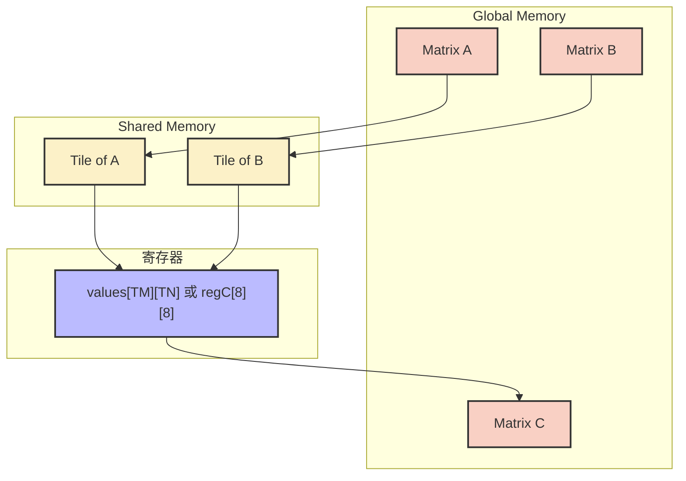
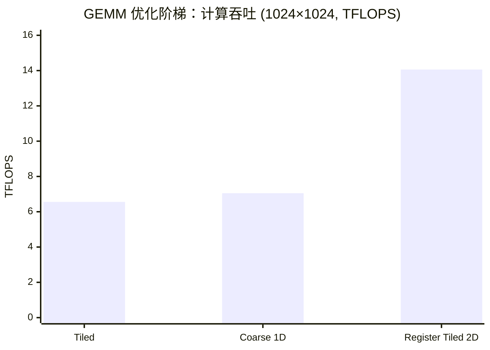

## 本文目标

读完本文，你将能够：

- 理解 Tiled GEMM 仍受限于 Shared Memory 带宽的根因：内层循环每次 FMA 从 SMEM 读 2 个 float，局部算术强度仅 0.25 FLOP/Byte [理论]
- 用 Roofline 区分「全局算术强度」与「局部（SMEM→寄存器）算术强度」，并理解 Register Tiling 如何将后者提升到 1.0 FLOP/Byte（以 $T_M = T_N = 4$ 为例）[理论]
- 实现从 Tiled → 一维线程粗化 → 二维寄存器分块（外积）的阶梯优化，理解每线程多累加器与两次 `__syncthreads()` 的配合
- 在 1024×1024 下手写 Register Tiled Kernel 达到约 14.06 TFLOPS（约 2.14× Tiled），在 2048×2048 下达到约 28.79 TFLOPS、约 cuBLAS 的 50.1%，并理解剩余差距（Bank Conflict、流水线、SASS 级调优）[实测]

## 对应代码路径

> **硬件环境**：NVIDIA RTX 4090 (Ada Lovelace, sm_89)
> 128 SMs | FP32 82.6 TFLOPS | HBM 1008 GB/s | L2 72 MB | Roofline 拐点 81.9 FLOP/Byte

| 源文件 | Kernel 名称 | 核心技术 | 测试规模 |
|--------|-------------|----------|----------|
| `04_GEMM_Optimization/01_tiled_gemm/tiled_gemm.cu` | `tiled_gemm` | Shared Memory Tiling，每线程一元素 | M=N=K=1024 |
| `04_GEMM_Optimization/01_tiled_gemm/tiled_gemm.cu` | `coarse_gemm` | 1D 线程粗化，每线程 $1 \times 4$ 累加器 | M=N=K=1024 |
| `04_GEMM_Optimization/01_tiled_gemm/tiled_gemm.cu` | `register_tiled_gemm` | 2D 寄存器分块（$T_M=T_N=4$），外积累加 | M=N=K=1024 |
| `04_GEMM_Optimization/02_advanced_gemm/advanced_gemm.cu` | `vectorized_gemm`<br>`double_buffer_gemm` | float4 向量化（反面教材：Warp 发散）<br>双缓冲流水线 | M=N=K=1024 |
| `04_GEMM_Optimization/03_register_tiling/register_tiling.cu` | `register_tiling_gemm` | 极致寄存器分块（BM=BN=128, BK=8, TM=TN=8） | M=N=K=2048 |

> **本篇在系列中的位置**：承接 [01 基础概念与分块](/posts/7608f1b0/) 的 Shared Memory Tiling 与 Roofline——01 中 Tiled GEMM 已将全局访存降为 $1/T$，但内层「读一次算一次」仍使 SMEM 带宽成为瓶颈；本篇将数据进一步推入**寄存器**，通过 Register Tiling 与外积提高局部算术强度，逼近计算墙。后续 [09 张量核心与混合精度](/posts/78e375e8/)、[14 模板矩阵乘与代数布局](/posts/f1b57921/) 在此基础上引入 Tensor Core 与工业级模板；[10 访存优化与共享内存冲突](/posts/5b6f891d/) 深入 Bank Conflict 与合并访存。

---

## 三个实现分别做了什么

### 1. Tiled GEMM：Shared Memory 上的每线程一元素

`tiled_gemm` 与 [01 基础概念与分块](/posts/7608f1b0/) 中的 `matrix_mul_tiled` 思路一致：Block 内协作将 $A$、$B$ 的 $32 \times 32$ Tile 装入 Shared Memory，每个线程负责 $C$ 的一个输出元素，沿 $N$ 维在片上做内积。

内层循环中，每个线程每次从 Shared Memory 读 2 个 float（`shared_A[threadIdx.y][j]` 与 `shared_B[j][threadIdx.x]`），做 1 次乘加，写回寄存器累加器 `value`。因此 SMEM 到寄存器的**局部算术强度**为 $2 \text{ FLOPs} / 8 \text{ B} = 0.25 \text{ FLOP/Byte}$，仍属 Memory Bound。

```cpp
// 来源：04_GEMM_Optimization/01_tiled_gemm/tiled_gemm.cu : L11-L23
float value = 0.0f;
for (int i = 0; i < cdiv(N, TILE_SIZE); ++i) {
    // ... 协作加载 shared_A, shared_B ...
    __syncthreads();

    for (int j = 0; j < TILE_SIZE; ++j) {
        value += shared_A[threadIdx.y][j] * shared_B[j][threadIdx.x];
    }
    __syncthreads();
}
```

Block 配置为 `dim3(32, 32)`（1024 线程，`TILE_SIZE = 32`）。

### 2. Coarse GEMM：一维线程粗化（每线程一行 4 个元素）

`coarse_gemm` 让每个线程计算同一行上**连续 $1 \times 4$ 个** $C$ 元素（`COARSE_FACTOR = 4`）。用寄存器数组 `values[COARSE_FACTOR]` 保存 4 个累加器；沿 $N$ 维每个 Tile 步内，按列块循环加载 `shared_B` 的 4 段，分别与 `shared_A` 的一行做内积写回 `values[j]`。

同一 $N$ 维步内，$A$ 的一行在 4 次内积中被复用，$A$ 的 SMEM 读取压力减轻；$B$ 仍按列块每段读一次。从「每 FMA 读 2 个 float」变为「每 4 次 FMA 读 1 行 A + 4 段 B」，局部访存结构改善，但 $B$ 仍未在寄存器内做双向复用。

```cpp
// 来源：04_GEMM_Optimization/01_tiled_gemm/tiled_gemm.cu : L37-L52
float values[COARSE_FACTOR] = {0.0f};
// ...
for (int j = 0; j < COARSE_FACTOR; ++j) {
    CInt col = blockIdx.x * TILE_SIZE * COARSE_FACTOR + j * TILE_SIZE + threadIdx.x;
    // ... 加载 shared_B 对应列块 ...
    __syncthreads();
    for (int k = 0; k < TILE_SIZE; ++k) {
        values[j] += shared_A[threadIdx.y][k] * shared_B[k][threadIdx.x];
    }
    __syncthreads();
}
```

### 3. Register Tiled GEMM：二维寄存器分块与外积

`register_tiled_gemm` 让每个线程负责 $C$ 的一个 $T_M \times T_N = 4 \times 4$ 子块，用 `values[COARSE_Y][COARSE_X]`（即 `values[4][4]`）共 16 个累加器驻留寄存器。沿 $N$ 维每个 Tile 步内：先从 SMEM 按「当前线程对应的行/列」加载 $T_M$ 个 $A$ 元素与 $T_N$ 个 $B$ 元素（通过内层循环 `t` 遍历 Tile 内 $N$ 维），再在寄存器中做**外积**——一个列向量与一个行向量相乘，得到 $T_M \times T_N$ 次 FMA，且每个 $A$ 元素被复用 $T_N$ 次、每个 $B$ 元素被复用 $T_M$ 次。

每步从 SMEM 读入 $(T_M + T_N) \times 4$ 字节，执行 $T_M \times T_N \times 2$ FLOPs，局部算术强度为：

$$I_{\text{reg}} = \frac{T_M \times T_N \times 2}{(T_M + T_N) \times 4} = \frac{4 \times 4 \times 2}{(4+4) \times 4} = 1.0 \text{ FLOP/Byte} \quad [\text{理论}]$$

相比 Tiled 的 0.25 提升 4 倍，是迈向 Compute Bound 的关键一步。

---

## Baseline 与瓶颈分析

### 全局算术强度 vs 局部算术强度

GEMM 的**全局**算术强度为 $2 M N K$ FLOPs 对 $2 M N \times 4 + 2 N K \times 4 + 2 M K \times 4$ Bytes（读 $A$、$B$，写 $C$），$M=N=K$ 时约 $I \approx N/6$。$N=1024$ 时 $I \approx 170.7$ FLOP/Byte，远高于 RTX 4090 拐点 81.9 FLOP/Byte，故从全局看 GEMM 是 **Compute Bound**。但 Tiled GEMM 的实际利用率仅约 8%（约 6.56 TFLOPS / 82.6 TFLOPS），说明瓶颈不在全局带宽，而在 **SMEM 到寄存器的微观访存**。

### 内层循环的算术强度

Tiled GEMM 内层：每次 FMA 从 SMEM 读 2 个 float（8 字节），执行 2 FLOPs：

$$I_{\text{inner}} = \frac{2 \text{ FLOPs}}{8 \text{ Bytes}} = 0.25 \text{ FLOP/Byte} \quad [\text{理论}]$$

即 SMEM 带宽成为新的天花板。优化方向很明确：把数据进一步搬到**寄存器**，通过「一次加载、多次 FMA」提高局部算术强度。

---

## 优化思路：Register Tiling 如何提升局部算术强度

### 核心思想

- **1D 粗化**：每线程算同一行上多列，使 $A$ 的一行在寄存器内被多次 FMA 复用，减少 $A$ 的 SMEM 读取次数。
- **2D 寄存器分块（外积）**：每线程算 $T_M \times T_N$ 个子块。每步从 SMEM 加载 $T_M$ 个 $A$、$T_N$ 个 $B$ 到寄存器，用外积 $\vec{a} \vec{b}^T$ 得到 $T_M \times T_N$ 次 FMA，$A$、$B$ 双向复用。

外积形式：

$$\vec{a} \cdot \vec{b}^T = \begin{pmatrix} a_0 \\ \vdots \\ a_{T_M-1} \end{pmatrix} \begin{pmatrix} b_0 & \cdots & b_{T_N-1} \end{pmatrix} = \begin{pmatrix} a_0 b_0 & \cdots & a_0 b_{T_N-1} \\ \vdots & & \vdots \\ a_{T_M-1} b_0 & \cdots & a_{T_M-1} b_{T_N-1} \end{pmatrix}$$

### 局部算术强度对比

| 版本 | 每步 SMEM 读入 | 每步 FMA 数 | 局部算术强度 |
|------|----------------|-------------|--------------|
| Tiled（每线程 1 元素） | 2 × 4 B | 1 | 0.25 FLOP/Byte |
| 2D Register（$T_M=T_N=4$） | $(4+4) \times 4 = 32$ B | $4 \times 4 = 16$ 次 FMA（32 FLOPs） | 1.0 FLOP/Byte |

### 存储层级再回顾

与 01 一致，数据越靠近 ALU，延迟与带宽越有利。Register Tiling 把 Tiled GEMM 中「每次 FMA 都从 SMEM 取数」改为「每步从 SMEM 取一块到寄存器，在寄存器内完成多轮 FMA」，从而拉高 SMEM 读入数据的复用比，逼近计算墙。

| 存储层级 | 硬件位置 | 容量量级 | 延迟 | 带宽量级 |
|----------|----------|----------|------|----------|
| 寄存器 | ALU 旁 | 每线程 255 × 32-bit | ~1 cycle | 极高 |
| Shared Memory | 片上 SRAM | 每 SM 48–100 KB | ~20–30 cycles | 数 TB/s |
| Global Memory | 板载 HBM | 24 GB | ~400+ cycles | 1008 GB/s |

---

## 关键代码解释

### 2D 寄存器分块的外积循环

```cpp
// 来源：04_GEMM_Optimization/01_tiled_gemm/tiled_gemm.cu : L71-L94
float values[COARSE_Y][COARSE_X] = {0.0f};   // 4×4 累加器，驻留寄存器

for (int i = 0; i < cdiv(N, TILE_SIZE); ++i) {
    // 协作加载 A 的 (TILE_SIZE*COARSE_Y)×TILE_SIZE、B 的 TILE_SIZE×(TILE_SIZE*COARSE_X) 到 SMEM
    for (int j = 0; j < COARSE_Y; ++j) { ... }
    for (int j = 0; j < COARSE_X; ++j) { ... }
    __syncthreads();

    for (int t = 0; t < TILE_SIZE; ++t) {
        for (int j = 0; j < COARSE_Y; ++j) {
            for (int k = 0; k < COARSE_X; ++k) {
                values[j][k] = fmaf(shared_A[j * TILE_SIZE + threadIdx.y][t],
                                    shared_B[t][k * TILE_SIZE + threadIdx.x],
                                    values[j][k]);
            }
        }
    }
    __syncthreads();
}
```

- `values[COARSE_Y][COARSE_X]` 共 16 个 float 全部在寄存器中，内层多重循环可配合 `#pragma unroll` 展开为连续 `fmaf`，减少分支与循环开销。
- 对固定 `t`，`shared_A[...][t]` 被 COARSE_X 次 FMA 复用（A 复用），`shared_B[t][...]` 被 COARSE_Y 次 FMA 复用（B 复用），实现双向复用。

### Block / Thread 映射（register_tiled_gemm）

| 层级 | 配置 | 职责 |
|------|------|------|
| Grid | `(cdiv(K, TILE_SIZE*COARSE_X), cdiv(M, TILE_SIZE*COARSE_Y))` | 覆盖整个 $C$ 矩阵 |
| Block | `dim3(TILE_SIZE, TILE_SIZE)`，即 32×32，1024 线程 | 计算 $C$ 的一个 128×128 子块（32×4=128）；每线程算 4×4，共 1024×16=128×128 |
| Thread `(tx, ty)` | — | 对应该 128×128 块内一个 4×4 子块；加载时协作装填 SMEM |

### 两次 `__syncthreads()` 的必要性

与 01 中 Tiled GEMM 一致：**第一次屏障**保证所有线程完成当前 Tile 的 SMEM 加载后再开始内层计算，避免读未就绪数据；**第二次屏障**保证所有线程用完当前 Tile 的 SMEM 后再进入下一轮加载，避免快线程覆写慢线程仍在用的数据。省去任一侧都会导致不可确定性的计算错误。

### 极致版本：8×8 寄存器分块（register_tiling.cu）

`register_tiling_gemm` 将 Block Tile 设为 BM×BN=128×128，BK=8；Thread Tile 为 TM=TN=8。每线程 64 个累加器 `regC[8][8]`，外加 `regA[8]`、`regB[8]`。每 K 维步：从 SMEM 加载 8 个 A、8 个 B，执行 64 次 FMA，复用比 64/16=4，局部算术强度更高。

```cpp
// 来源：04_GEMM_Optimization/03_register_tiling/register_tiling.cu : L95-L111
for (int dotIdx = 0; dotIdx < BK; ++dotIdx) {
    for (int i = 0; i < TM; ++i)
        regA[i] = sA[threadRow * TM + i][dotIdx];
    for (int j = 0; j < TN; ++j)
        regB[j] = sB[dotIdx][threadCol * TN + j];
    for (int i = 0; i < TM; ++i)
        for (int j = 0; j < TN; ++j)
            regC[i][j] = fmaf(regA[i], regB[j], regC[i][j]);
}
```

Block 内线程数为 (BM/TM)×(BN/TN)=16×16=256。源码注释指出：`sB[BK][BN]` 按列步长 TN=8 访问会带来 Bank Conflict，工业实现常对 B 做 Padding（如 `sB[BK][BN+1]`）以打散 Bank，本教学实现未改以保持可读性。

### 数据流总览



---

## 结果与边界

### GEMM 优化阶梯（1024×1024，10 次迭代取平均）

> 数据来源：`Results/04_GEMM_Optimization.md` 原始日志

| 版本 | Kernel 耗时 | 计算吞吐 | vs Tiled | 数据性质 |
|------|------------|---------|----------|----------|
| CPU 串行 | 2117.46 ms | 1.01 GFLOPS | — | [实测] |
| Tiled GEMM（TILE=32） | 0.3273 ms | 6.56 TFLOPS | 1.00x | [实测] |
| Coarse GEMM（1D, COARSE_FACTOR=4） | 0.3047 ms | 7.05 TFLOPS | 1.07x | [实测] |
| **Register Tiled 2D（TM=TN=4）** | **0.1528 ms** | **14.06 TFLOPS** | **2.14x** | [实测] |



### 高级技术（1024×1024）

| 版本 | Kernel 耗时 | 计算吞吐 | 说明 |
|------|------------|---------|------|
| Vectorized GEMM（float4） | 0.3821 ms | 5.62 TFLOPS | 因 `threadIdx.x % 4 == 0` 导致 Warp 发散，慢于 Tiled [实测] |
| Double Buffer GEMM | 0.3149 ms | 6.82 TFLOPS | 双缓冲掩盖加载延迟，较 Vectorized 约 1.21x [实测] |

### 极致优化与 cuBLAS 对比（2048×2048，20 次平均）

> 数据来源：`Results/04_GEMM_Optimization.md` 原始日志

| 版本 | Kernel 耗时 | 计算吞吐 | vs cuBLAS | 数据性质 |
|------|------------|---------|-----------|----------|
| Register Tiling（BM=BN=128, TM=TN=8） | 0.60 ms | 28.79 TFLOPS | 50.1% | [实测] |
| cuBLAS SGEMM | 0.30 ms | 57.49 TFLOPS | 100% | [实测] |

手写 Kernel 达到约 **50.1%** cuBLAS。剩余差距主要来自：**Bank Conflict**（如 `sB` 步长 8 与 32 Bank 冲突，需 Padding）、**流水线气泡**（未做 cp.async 时加载与计算串行）、**SASS 级调优**（cuBLAS 在指令排程、ILP、寄存器 Bank 上的手工优化），以及更大规模下的 Occupancy 与调度差异。

### 距离硬件峰值

14.06 TFLOPS（Register Tiled 2D @ 1024）约为 RTX 4090 FP32 峰值 82.6 TFLOPS 的 **17.0%** [实测/理论]；28.79 TFLOPS（8×8 @ 2048）约为 **34.9%**。通过 Register Tiling 已将瓶颈从 SMEM 带宽推向计算与调度，进一步逼近峰值需要解决 Bank Conflict、双缓冲/异步拷贝以及汇编级调优（或使用 Tensor Core，见 09/14）。

---

## 常见误区

1. **误区**：Shared Memory 已经够快，不必再优化到寄存器。
   **实际**：Tiled GEMM 内层算术强度仅 0.25 FLOP/Byte，SMEM 带宽仍是瓶颈。Register Tiling 将局部算术强度提到 1.0 FLOP/Byte（$T_M=T_N=4$），是从 Memory Bound 转向 Compute Bound 的关键 [理论]。

2. **误区**：float4 向量化一定能加速。
   **实际**：本项目的 `vectorized_gemm` 用 `if (threadIdx.x % 4 == 0)` 导致 Warp 内 3/4 线程空转（Warp Divergence），反而比 Tiled GEMM 更慢（0.3821 ms vs 0.3273 ms）[实测]。正确做法是让每线程负责不重叠的连续 4 元素，避免 lane 级分支。

3. **误区**：Thread Tile 越大越好。
   **实际**：$T_M \times T_N$ 增大会增加每线程寄存器数（如 8×8 时约 80 个），可能触发寄存器溢出（Spilling）到 Local Memory，反而降速。需在复用比与 Occupancy 之间权衡。

4. **误区**：手写 GEMM 容易追平 cuBLAS。
   **实际**：在 Register Tiling + Padding + 双缓冲等优化后，手写 FP32 GEMM 通常可达 cuBLAS 的 50–70%。剩余部分依赖 SASS 级调优或 Tensor Core，这也是 CUTLASS 等库存在的价值。

---

## 系列导航

### 前置阅读

| 文章 | 与本篇的衔接 |
|------|----------------|
| [01 基础概念与分块](/posts/7608f1b0/) | 本文依赖的 Shared Memory Tiling、Roofline 与算术强度概念；01 结尾指出 Tiled GEMM 内层 0.25 FLOP/Byte，本篇在此基础上做 Register Tiling |

### 推荐后续（承上启下）

| 文章 | 与本篇的衔接 |
|------|----------------|
| [09 张量核心与混合精度](/posts/78e375e8/) | 用硬件矩阵引擎突破 CUDA Core FP32 算力天花板 |
| [14 模板矩阵乘与代数布局](/posts/f1b57921/) | 工业级模板与生产级 GEMM 实现 |
| [10 访存优化与共享内存冲突](/posts/5b6f891d/) | 深入 Bank Conflict、合并访存与 Async Copy |

---

## 顺序导航

- 上一篇：[CUDA实践-03-前缀和与多块扫描](/posts/bcb510f9/)
- 下一篇：[CUDA实践-05-大模型算子与注意力归一化](/posts/cb29461c/)
