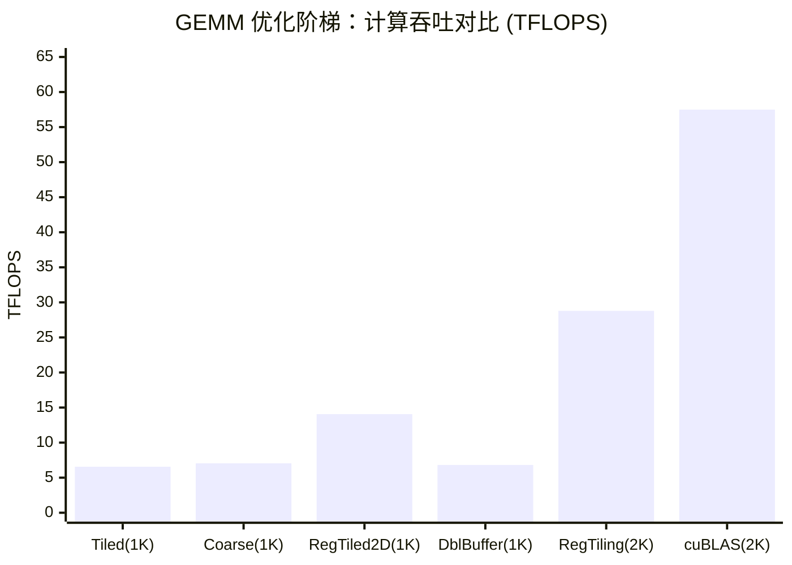

## 本文目标

读完本文，你将能够：

- 解释 Tiled GEMM 仍然 Memory Bound 的根因：每次 FMA 从 SMEM 读 2 个 float，算术强度仅 0.25 FLOP/Byte [理论]
- 推导 Register Tiling 如何将局部算术强度从 0.25 提升到 1.0 FLOP/Byte（以 $T_M = T_N = 4$ 为例）[理论]
- 实现一个 $8 \times 8$ 寄存器分块 GEMM，在 2048×2048 规模达到 28.79 TFLOPS，达到 cuBLAS 的 50.1% [实测]
- 分析手写 Kernel 与 cuBLAS 之间 50% 差距的工程根因（Bank Conflict、流水线气泡、SASS 级调优）

## 对应代码路径

> **硬件环境**：NVIDIA RTX 4090 (Ada Lovelace, sm_89)
> 128 SMs | FP32 82.6 TFLOPS | HBM 1008 GB/s | L2 72 MB | Roofline 拐点 81.9 FLOP/Byte

| 源文件 | Kernel 名称 | 核心技术 | 测试规模 |
|--------|-------------|----------|----------|
| `04_GEMM_Optimization/01_tiled_gemm/tiled_gemm.cu` | `tiled_gemm` | Shared Memory Tiling | 1024×1024 |
| `04_GEMM_Optimization/01_tiled_gemm/tiled_gemm.cu` | `coarse_gemm` | 1D 线程粗化 | 1024×1024 |
| `04_GEMM_Optimization/01_tiled_gemm/tiled_gemm.cu` | `register_tiled_gemm` | 2D 寄存器分块（TM=TN=4） | 1024×1024 |
| `04_GEMM_Optimization/02_advanced_gemm/advanced_gemm.cu` | `vectorized_gemm` | float4 向量化加载 | 1024×1024 |
| `04_GEMM_Optimization/02_advanced_gemm/advanced_gemm.cu` | `double_buffer_gemm` | 双缓冲流水线 | 1024×1024 |
| `04_GEMM_Optimization/03_register_tiling/register_tiling.cu` | `register_tiling_gemm` | 极致寄存器分块（BM=BN=128, TM=TN=8） | 2048×2048 |

> Kernel 名称与源码中 `__global__` 函数签名完全一致。
>
> **本篇在系列中的位置**：承接 [01 基础概念与分块](/posts/7608f1b0/) 中的 Shared Memory Tiling 与 Roofline 分析，以及 [02 归约与线程粗化](/posts/44fe4eb3/)、[03 前缀和与多块扫描](/posts/bcb510f9/) 里的树形折叠与同步直觉，本篇聚焦于将 GEMM 的数据进一步推入寄存器，在 CUDA Core 上逼近计算瓶颈；后续 [09 张量核心与混合精度](/posts/78e375e8/) 与 [14 模板矩阵乘与代数布局](/posts/f1b57921/) 则在此基础上引入 Tensor Core 和工业级模板实现。

## Baseline

**问题陈述**：在 Blog 01 中，Tiled GEMM 通过 Shared Memory 缓存大幅减少了 Global Memory 访问。但在 1024×1024 规模下，Tiled GEMM 仅达到 6.56 TFLOPS，不到 RTX 4090 FP32 峰值（82.6 TFLOPS）的 8%。瓶颈从 Global Memory 转移到了 Shared Memory。

**Baseline 实现**：`tiled_gemm`，位于 `04_GEMM_Optimization/01_tiled_gemm/tiled_gemm.cu`。
每个线程计算输出矩阵的一个元素，沿 K 维度迭代时，每次 FMA 前从 Shared Memory 读取 A 和 B 各一个 float。

| 指标 | 值 | 数据来源 |
|------|----|----------|
| Kernel 耗时 | 0.3273 ms | [实测] Results/04_GEMM_Optimization.md |
| 计算吞吐 | 6.56 TFLOPS | [实测] 由 Kernel 耗时与 FLOPs 计算 |
| 硬件利用率 | 7.9% | [理论] 6.56 / 82.6 |

## 瓶颈分析

从 Roofline 模型出发，GEMM 的全局算术强度为：

$$I = \frac{2N^3}{3N^2 \times 4} = \frac{N}{6} = 170.67 \text{ FLOP/Byte} \quad (N = 1024) \quad [\text{理论}]$$

这远超 RTX 4090 拐点 81.9 FLOP/Byte，理论上 GEMM 应该是 **Compute Bound**。但 Tiled GEMM 的实际利用率不到 8%，说明瓶颈不在全局层面，而在 **SMEM 到寄存器的微观访存**。

**内层循环的算术强度**：每次 FMA 需要从 SMEM 读 2 个 float（A 和 B 各一个），执行 2 FLOPs（一次乘加）：

$$I_{\text{inner}} = \frac{2 \text{ FLOPs}}{2 \times 4 \text{ Bytes}} = 0.25 \text{ FLOP/Byte} \quad [\text{理论}]$$

这个值说明：即便数据已经在 Shared Memory 中，"读一次算一次"的访存模式使得 SMEM 带宽成为新的瓶颈。优化方向是将数据进一步下沉到寄存器，通过复用提高局部算术强度。

## 优化思路

### 优化 1：一维线程粗化（Thread Coarsening）

**解决的瓶颈**：SMEM 到寄存器的读取次数过多，A 矩阵元素无复用。
**核心思想**：让每个线程计算同一行上连续 $1 \times 4$ 个 C 元素（`COARSE_FACTOR = 4`），使 $A_{i,k}$ 在寄存器中被 4 次 FMA 复用。
**预期收益**：A 矩阵的 SMEM 读取量减少为 1/4，总访存从 $4 \times 2 = 8$ 次降到 $1 + 4 = 5$ 次 [理论]。

### 优化 2：二维寄存器分块（2D Register Tiling）

**解决的瓶颈**：1D 粗化只复用 A，B 矩阵仍然 1:1 读取。
**核心思想**：让每个线程计算 $T_M \times T_N$ 的二维 C 子块。每次从 SMEM 加载 $T_M$ 个 A 元素和 $T_N$ 个 B 元素到寄存器，通过外积（Outer Product）产生 $T_M \times T_N$ 次 FMA。A 和 B 都被双向复用。

以 $T_M = T_N = 4$ 为例，局部算术强度提升到：

$$I_{\text{reg}} = \frac{T_M \times T_N \times 2}{(T_M + T_N) \times 4} = \frac{4 \times 4 \times 2}{(4 + 4) \times 4} = 1.0 \text{ FLOP/Byte} \quad [\text{理论}]$$

相比 Baseline 的 0.25 FLOP/Byte 提升了 4 倍。

**外积视角**：与内积（逐元素点乘）不同，外积将一个列向量和一个行向量相乘，一次产生整个矩阵面：

$$\vec{a} \cdot \vec{b}^T = \begin{pmatrix} a_0 \\ a_1 \\ \vdots \\ a_{TM-1} \end{pmatrix} \begin{pmatrix} b_0 & b_1 & \cdots & b_{TN-1} \end{pmatrix} = \begin{pmatrix} a_0 b_0 & a_0 b_1 & \cdots \\ a_1 b_0 & \cdots & \\ \vdots & & a_{TM-1} b_{TN-1} \end{pmatrix}$$

### 优化 3：float4 向量化加载

**解决的瓶颈**：Global Memory 到 SMEM 的加载阶段，逐个 float 读取浪费指令发射端口。
**核心思想**：使用 `float4` 将 4 个 32-bit 读取合并为一条 128-bit LDG 指令，降低指令发射压力。
**实际效果**：本项目的实现因 `if (threadIdx.x % 4 == 0)` 引入 Warp Divergence，导致性能不升反降（反面教材）。

### 优化 4：双缓冲流水线（Double Buffering）

**解决的瓶颈**：标准 Tiling 循环中，加载和计算严格串行——加载 SMEM 时 ALU 空闲，计算时 LSU 空闲。
**核心思想**：申请两组 SMEM（`shared_A[2][..]`），在计算当前 Tile 的同时预加载下一个 Tile，使加载延迟被计算时间遮蔽。
**预期收益**：消除加载-计算串行等待的时钟周期浪费 [理论]。

### 优化 5：极致寄存器分块（8×8 Thread Tile）

**解决的瓶颈**：$4 \times 4$ 分块的复用比仍有提升空间。
**核心思想**：将 Thread Tile 扩大到 $T_M = T_N = 8$，Block Tile 设为 $BM = BN = 128, BK = 8$。每个线程持有 64 个累加器寄存器，每次搬运 16 个元素（8 个 A + 8 个 B）执行 64 次 FMA，复用比达到 $64 / 16 = 4$。
**预期收益**：在 2048×2048 规模下逼近 Compute Bound [理论]。

## 关键代码解释

### 2D 寄存器分块外积循环

```cpp
// 来源：04_GEMM_Optimization/01_tiled_gemm/tiled_gemm.cu : L72-L96
// register_tiled_gemm 内层核心

float values[COARSE_Y][COARSE_X] = {0.0f};  // [1] TM×TN 累加器，驻留寄存器

for (int i = 0; i < cdiv(N, TILE_SIZE); ++i) {
    // 协作加载 A 和 B 到 Shared Memory（省略）
    __syncthreads();

    // [2] 沿 K 维度 Tile 内迭代，执行外积累加
    for (int t = 0; t < TILE_SIZE; ++t) {
        for (int j = 0; j < COARSE_Y; ++j) {
            for (int k = 0; k < COARSE_X; ++k) {
                values[j][k] = fmaf(shared_A[j * TILE_SIZE + threadIdx.y][t],
                                    shared_B[t][k * TILE_SIZE + threadIdx.x],
                                    values[j][k]);
            }
        }
    }
    __syncthreads();
}
```

**要点解读**：

- `[1]`：`values[COARSE_Y][COARSE_X]`（`COARSE_Y = COARSE_X = 4`）共 16 个 float 全部驻留在寄存器中。编译器在 `#pragma unroll` 辅助下将双重循环完全展开为连续 `fmaf` 指令，消除分支和循环计数器开销。
- `[2]`：每步 `t` 中，`shared_A[j * TILE_SIZE + threadIdx.y][t]` 被 `COARSE_X` 次 FMA 复用（A 复用），`shared_B[t][k * TILE_SIZE + threadIdx.x]` 被 `COARSE_Y` 次 FMA 复用（B 复用），实现双向数据复用。

### 极致版本：8×8 寄存器分块

```cpp
// 来源：04_GEMM_Optimization/03_register_tiling/register_tiling.cu : L52-L111

float regC[TM][TN] = {0.0f};   // 64 个累加器
float regA[TM];                  // 8 个 A 寄存器
float regB[TN];                  // 8 个 B 寄存器

// 阶段 3: 从 Shared Memory 加载到寄存器并计算
for (int dotIdx = 0; dotIdx < BK; ++dotIdx) {
    // 加载 A 的一列到寄存器 (TM=8 个元素)
    for (int i = 0; i < TM; ++i)
        regA[i] = sA[threadRow * TM + i][dotIdx];
    // 加载 B 的一行到寄存器 (TN=8 个元素)
    for (int j = 0; j < TN; ++j)
        regB[j] = sB[dotIdx][threadCol * TN + j];
    // 外积累加: TM × TN = 64 次 FMA
    for (int i = 0; i < TM; ++i)
        for (int j = 0; j < TN; ++j)
            regC[i][j] = fmaf(regA[i], regB[j], regC[i][j]);
}
```

**要点解读**：

- 每个线程持有 `regC[8][8]` = 64 个累加器 + `regA[8]` + `regB[8]` = 80 个寄存器，占用较高的寄存器资源。
- 每步 `dotIdx`：搬运 16 个元素（8+8），执行 64 次 FMA，复用比 = $64/16 = 4$。
- Block 内共 $(128/8) \times (128/8) = 256$ 个线程，每个 Block 处理 $128 \times 128 = 16384$ 个 C 元素。

### 双缓冲流水线

```cpp
// 来源：04_GEMM_Optimization/02_advanced_gemm/advanced_gemm.cu : L68-L105

__shared__ float shared_A[2][TILE_SIZE][TILE_SIZE];
__shared__ float shared_B[2][TILE_SIZE][TILE_SIZE];

// 预加载第 0 块到 buffer 0
shared_A[0][threadIdx.y][threadIdx.x] = A[...];
shared_B[0][threadIdx.y][threadIdx.x] = B[...];
__syncthreads();

for (int i = 0; i < num_tiles; ++i) {
    buffer_index = 1 - buffer_index;   // Toggle 切换缓冲区

    // 异步发起下一块的加载（写入 buffer_index）
    if (i + 1 < num_tiles) {
        shared_A[buffer_index][...] = A[...];
        shared_B[buffer_index][...] = B[...];
    }
    // 同时计算当前块（读取 1 - buffer_index）
    for (int k = 0; k < TILE_SIZE; ++k) {
        value = fmaf(shared_A[1 - buffer_index][threadIdx.y][k],
                      shared_B[1 - buffer_index][k][threadIdx.x], value);
    }
    __syncthreads();
}
```

**要点解读**：

- 两组 SMEM 通过 `buffer_index = 1 - buffer_index` 交替使用，使 Global Memory 加载（LSU）和 FMA 计算（ALU）在时间上重叠。
- 这是软件层面的流水线实现。现代架构（Ampere/Hopper）通过 `cp.async` 和 TMA 在硬件层面原生支持异步拷贝，可进一步消除同步开销。

## 结果与边界

### 性能对比

> **测试条件**：RTX 4090 × 2, CUDA, nvcc -O3
> **数据来源**：`Results/04_GEMM_Optimization.md` 原始日志

#### Tiling 阶梯进化（1024×1024, 10 次平均）

| 版本 | Kernel 耗时 | 计算吞吐 | vs Baseline | 数据性质 |
|------|------------|----------|-------------|----------|
| Tiled GEMM（TILE=32） | 0.3273 ms | 6.56 TFLOPS | 1.00x | [实测] |
| Coarse GEMM（1D, COARSE_FACTOR=4） | 0.3047 ms | 7.05 TFLOPS | 1.07x | [实测] |
| Register Tiled 2D（TM=TN=4） | 0.1528 ms | 14.06 TFLOPS | 2.14x | [实测] |

#### 高级技术对比（1024×1024, 10 次平均）

| 版本 | Kernel 耗时 | 计算吞吐 | vs Vectorized | 数据性质 |
|------|------------|----------|---------------|----------|
| Vectorized GEMM（float4） | 0.3821 ms | 5.62 TFLOPS | 1.00x | [实测] |
| Double Buffer GEMM | 0.3149 ms | 6.82 TFLOPS | 1.21x | [实测] |

> 注意：Vectorized GEMM 因 Warp Divergence 导致性能低于 Tiled GEMM Baseline（见常见误区）。

#### 极限优化（2048×2048, 20 次平均）

| 版本 | Kernel 耗时 | 计算吞吐 | vs cuBLAS | 数据性质 |
|------|------------|----------|-----------|----------|
| Register Tiling（BM=BN=128, TM=TN=8） | 0.60 ms | 28.79 TFLOPS | 50.1% | [实测] |
| cuBLAS SGEMM | 0.30 ms | 57.49 TFLOPS | 100% | [实测] |



### 边界条件与局限

- **与 cuBLAS 的差距分析**：手写 Kernel 达到 cuBLAS 50.1%，剩余差距来自三方面：
  1. **Bank Conflict（~10% 损耗）**：`sB[BK][BN]` 中，同一 Warp 的线程以步长 TN=8 访问，与 32 Bank 分配产生冲突。解法是声明 `sB[BK][BN+1]` 进行 Padding，但本实现未采用 [理论]
  2. **流水线气泡（~15% 损耗）**：2048 版本未使用 Double Buffer，计算和加载串行化 [理论]
  3. **SASS 级调优（~15-20% 差距）**：cuBLAS 在汇编层面精排 FFMA 和 LDG 指令时序，优化 ILP 和寄存器 Bank Conflict，这是编译器级 C++ 难以企及的 [理论]
- **规模边界**：1024×1024 规模下 Register Tiled 2D 达 14.06 TFLOPS，但 Block 数量较少（仅 $32 \times 32 / (4 \times 4) = 64$ 个 Block），未充分利用 128 个 SM
- **精度**：FP32 累加在 2048 规模下验证通过，更大规模可能需要关注浮点误差累积

## 常见误区

1. **误区**：Shared Memory 已经很快了，不需要进一步优化到寄存器。
   **实际**：SMEM 带宽虽远高于 HBM，但对于 FP32 算力而言仍是瓶颈。Tiled GEMM 内层循环的算术强度仅 0.25 FLOP/Byte，Register Tiling 将其提升到 1.0 FLOP/Byte（$T_M = T_N = 4$ 时），是从 Memory Bound 转向 Compute Bound 的关键一步 [理论]。

2. **误区**：float4 向量化一定能提升性能。
   **实际**：本项目的 `vectorized_gemm` 实际比 Tiled GEMM 更慢（0.3821 ms vs 0.3273 ms）[实测]。原因是使用了 `if (threadIdx.x % 4 == 0)` 进行条件分支，导致 Warp 内 3/4 的线程空转（Warp Divergence）。正确的向量化应让每个线程负责不重叠的连续 4 个元素，避免 lane 级分支。

3. **误区**：增大 Thread Tile 总是好的。
   **实际**：$T_M \times T_N$ 增大时，每线程所需寄存器数增长为 $T_M \times T_N + T_M + T_N$（8×8 时为 80 个），可能导致寄存器溢出（Register Spilling）到 Local Memory，反而降低性能。需要在复用比和 Occupancy 之间权衡。

4. **误区**：手写 GEMM 能轻松追平 cuBLAS。
   **实际**：在充分优化（Register Tiling + Padding + Double Buffer）后，手写 FP32 GEMM 通常能达到 cuBLAS 的 50-70%。剩余差距需要 SASS 汇编级调优或使用 Tensor Core，这也是 CUTLASS 等框架存在的意义。

## 系列导航

### 前置阅读

| 文章 | 关系 |
|------|------|
| [01 基础概念与分块](/posts/7608f1b0/) | 本文依赖的 Shared Memory Tiling 基础和算术强度概念 |

### 推荐后续

| 文章 | 关系 |
|------|------|
| [09 张量核心与混合精度](/posts/78e375e8/) | 使用硬件矩阵引擎突破 CUDA Core FP32 算力天花板 |
| [14 模板矩阵乘与代数布局](/posts/f1b57921/) | 工业级模板元编程框架，生产级 GEMM 实现 |
| [10 访存优化与共享内存冲突](/posts/5b6f891d/) | 深入分析本文提到的 Bank Conflict 和合并访存问题 |

---

## 顺序导航

- 上一篇：[CUDA实践-03-前缀和与多块扫描](/posts/bcb510f9/)
- 下一篇：[CUDA实践-05-大模型算子与注意力归一化](/posts/cb29461c/)
