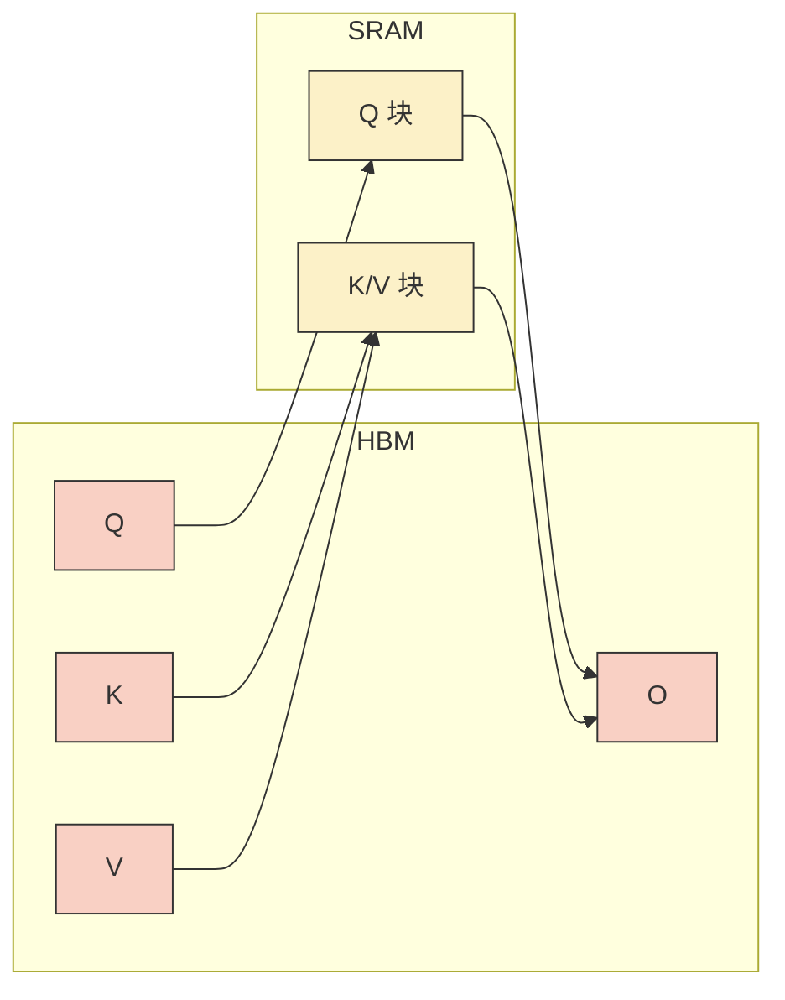
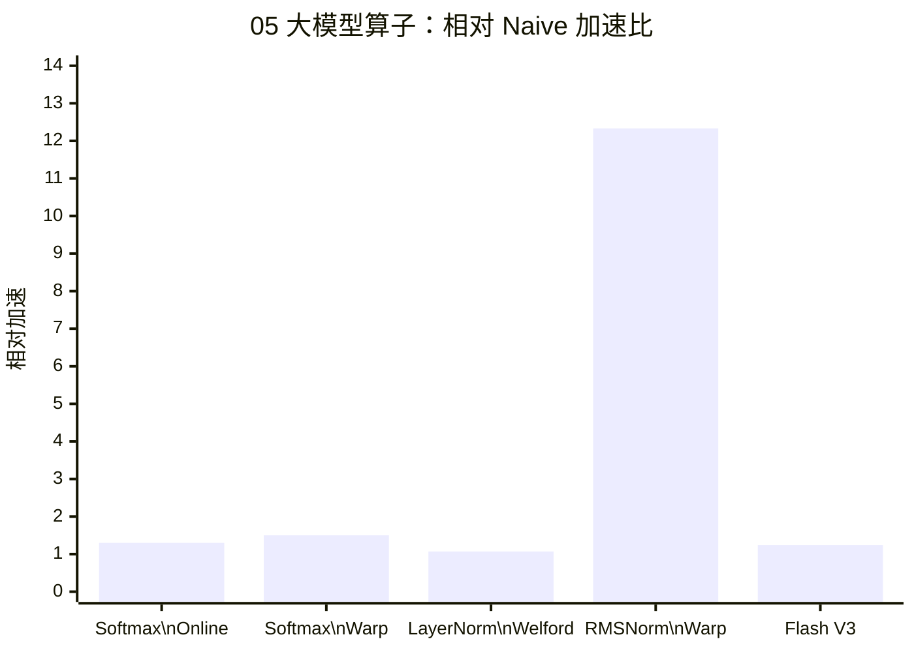

## 本文目标

读完本文，你将能够：

- 理解 Softmax 的带宽墙：三遍读写（max → sum → 归一化）导致算术强度极低、典型 Memory Bound；掌握 Online Softmax 的单遍流式更新与分母衰减公式
- 理解 LayerNorm 中「方差 = $E(x^2) - (E(x))^2$」在 FP32 下的灾难性相消，掌握 Welford 递推如何用增量 $\Delta = x - \mu$ 避免大数相减
- 理解 RMSNorm 去掉均值归约后少一次 Block 同步、更适合 Warp 级并行的原因；理解 RoPE 中 sin/cos 的 SFU 周期成为瓶颈时，float2 向量化仅带来有限提升
- 理解 FlashAttention 的 SRAM Tiling 思想：不物化 $N \times N$ 分数矩阵到 HBM，在片上用 Online Softmax 流式完成 $QK^T$、Softmax、$P \cdot V$，以及 V3 宏块与 float4 对控制流与带宽的优化

## 对应代码路径

> **硬件环境**：NVIDIA RTX 4090 (Ada Lovelace, sm_89)
> 128 SMs | FP32 82.6 TFLOPS | HBM 1008 GB/s | L2 72 MB | Roofline 拐点 81.9 FLOP/Byte

| 源文件 | Kernel 名称 | 核心技术 | 测试规模 |
|--------|-------------|----------|----------|
| `05_LLM_Ops/01_softmax/softmax.cu` | `naive_softmax`<br>`online_softmax`<br>`warp_reduce_softmax` | 三遍 Shared Memory 归约 / Online 单遍 max+sum / Warp 原语归约 | Batch=128, Seq=4096 |
| `05_LLM_Ops/02_layernorm/layernorm.cu` | `naive_layernorm`<br>`welford_layernorm`<br>`warp_reduce_layernorm` | 分离均值与方差归约 / Welford 单遍 / Warp 级 Welford | Batch=128, Hidden=4096 |
| `05_LLM_Ops/05_rmsnorm/rmsnorm.cu` | `rmsnorm_naive`<br>`rmsnorm_warp` | 单线程每行 / Warp Shuffle 归约 mean(x²) | Tokens=2048, Hidden=4096 |
| `05_LLM_Ops/04_rope/rope.cu` | `rope_naive`<br>`rope_vectorized` | 每线程一对 (2i,2i+1) / float2 合并读写 | Seq=2048, Heads=32, Dim=128 |
| `05_LLM_Ops/03_flash_attention/flash_attention.cu` | `flash_attention`<br>`flash_attention_v3` | SRAM 分块 + Online Softmax / 宏块 BR_V3=128 + float4 | Seq=2048, Heads=4, HeadDim=64, BR=BC=32 |

> **本篇在系列中的位置**：承接 [01 基础概念与分块](/posts/7608f1b0/) 的带宽墙与 Roofline、[02 归约与线程粗化](/posts/44fe4eb3/) 的树状归约与 Shared Memory 同步、[03 前缀和与多块扫描](/posts/bcb510f9/) 的在线状态与跨 Block 逻辑。本篇将归约与 Tiling 应用于大模型中的 Softmax、LayerNorm、RMSNorm、RoPE 与 Attention；[06 线程束原语与寄存器通信](/posts/fec051fc/) 详解 `__shfl_*` 等 Warp 原语；[11 推理优化、融合与键值缓存](/posts/9729c03f/) 在完整推理图中做算子融合与 KV Cache。

---

## 三个实现分别做了什么

### 1. Softmax：从三遍扫描到 Online 与 Warp 归约

**数学**：$\text{softmax}(x_i) = e^{x_i - m} / \sum_j e^{x_j - m}$，其中 $m = \max(x)$ 用于数值稳定。朴素做法必须先扫一遍求 $m$、再扫一遍求分母、再扫一遍写回，即 **3 次读 + 1 次写**，算术强度极低，严重 Memory Bound。

`naive_softmax`：每个 Block 处理一行（一个序列）。第一轮每线程局部求 max，树状归约到 `shared_data[0]`；第二轮每线程算 $\sum e^{x_i - m}$，再树状归约得分母；第三轮每线程写 `output[i] = exp(x_i - m) / block_sum`。多次 `__syncthreads()` 与多轮 Global Memory 遍历导致带宽成为瓶颈。

`online_softmax`：单遍遍历中维护「当前最大值」与「当前分母」的在线更新。当遇到更大的 $x_k$ 时，用系数 $e^{m_{old} - m_{new}}$ 对已有分母做衰减，再加上 $e^{x_k - m_{new}}$，数学上与两阶段 Softmax 等价。归约阶段只需合并各线程的 (max, sum) 对，仍用树状归约 + 同样的衰减公式合并，从而将**全局读入次数**降为单遍。

`warp_reduce_softmax`：在 Online 思想基础上，用 `warp_reduce_max` / `warp_reduce_sum`（基于 `__shfl_*`）在 Warp 内做寄存器级归约，再在 Block 内用 Shared Memory 做跨 Warp 归约，减少 SMEM 读写与同步次数，进一步压榨带宽。

```cpp
// 来源：05_LLM_Ops/01_softmax/softmax.cu : L61-L72
// online_softmax 的局部单遍 max+sum 更新
float local_max = -INFINITY;
float local_sum = 0.0f;
for (int i = tid; i < seq_len; i += blockDim.x) {
    float val = input[row * seq_len + i];
    float new_max = fmaxf(local_max, val);
    local_sum = local_sum * expf(local_max - new_max) + expf(val - new_max);
    local_max = new_max;
}
```

### 2. LayerNorm：从分离均值/方差到 Welford 单遍与 Warp 归约

**数学**：$\text{LayerNorm}(x) = \gamma \cdot (x - \mu) / \sqrt{\sigma^2 + \epsilon} + \beta$。朴素做法先求 $\mu$（一次归约）、再求 $\sigma^2$（第二次遍历）；若用 $\sigma^2 = E(x^2) - (E(x))^2$ 在单遍中算，则大数相减会导致 FP32 尾数丢失（灾难性相消）。

`naive_layernorm`：先对行内元素求和并树状归约得 `block_mean`，再对 $(x_i - \text{block\_mean})^2$ 求和并归约得方差，最后写归一化结果。两轮完整遍历 + 多轮 `__syncthreads()`。

`welford_layernorm`：用 Welford 在线算法单遍维护均值与「平方偏差和」$M_2$。递推为：$\delta = x_k - \mu_{k-1}$，$\mu_k = \mu_{k-1} + \delta/k$，$M_{2,k} = M_{2,k-1} + \delta \cdot (x_k - \mu_k)$。方差由 $M_2 / n$ 得到，全程只用增量，避免 $E(x^2) - (E(x))^2$ 的大数相减。Block 内用 `welford_combine` 合并各线程的 (mean, m2, count)，再统一算 `inv_std` 与输出。

`warp_reduce_layernorm`：每线程先算局部 Welford 结构，再用 `warp_reduce_welford`（`__shfl_down_sync` + `welford_combine`）在 Warp 内归约，最后 Block 内归约，减少 SMEM 与同步。

```cpp
// 来源：05_LLM_Ops/02_layernorm/layernorm.cu : L93-L99
// welford_layernorm 的局部 Welford 递推
WelfordData local_data = {0.0f, 0.0f, 0.0f};
for (int i = tid; i < hidden_size; i += blockDim.x) {
    float x = input[row * hidden_size + i];
    local_data.count += 1.0f;
    float delta = x - local_data.mean;
    local_data.mean += delta / local_data.count;
    local_data.m2 += delta * (x - local_data.mean);
}
```

### 3. RMSNorm、RoPE 与 FlashAttention：归一化简化、位置编码与 SRAM Tiling

**RMSNorm**：公式 $x / \sqrt{\text{mean}(x^2) + \epsilon} \cdot \gamma$，不做去均值，只需一次「平方和」归约。`rmsnorm_naive` 每行单线程循环求 `sum_sq` 再写输出；`rmsnorm_warp` 用 `__shfl_xor_sync` 做 Warp 内归约 + 跨 Warp 的 Shared Memory 归约，然后广播 `rms` 再写输出。少一次均值归约，同步与访存都更轻。

**RoPE**：对每对 $(x_{2i}, x_{2i+1})$ 做旋转 $(\cos\theta_i, -\sin\theta_i; \sin\theta_i, \cos\theta_i)$。`rope_naive` 每线程读两个 float、算 sin/cos、写回；`rope_vectorized` 用 `float2` 一次读写一对，减少全局内存事务。瓶颈往往在 sin/cos 的 SFU 周期，故向量化仅带来约 1.03× 提升 [实测]。

**FlashAttention**：Naive Attention 先算 $S = QK^T$ 并写回 HBM（$N^2$ 体积），再对 $S$ 做 Softmax，再算 $P \cdot V$。Flash 不物化 $S$：将 $Q$、$K$、$V$ 按块加载到 SRAM，在块内算 $QK^T$ 的局部块、用 **Online Softmax** 维护行级 max 与分母、边算边乘 $V$ 累加到输出，最后再按行归一化。`flash_attention`（V1）用 BR×BC 小块；`flash_attention_v3` 用更大 Q 块（BR_V3=128）、float4 加载与 `#pragma unroll` 摊薄控制流，在 Seq=2048 下优于 Naive 并避免 128 MB 中间矩阵 [实测]。

---

## Baseline 与瓶颈分析

### Softmax 的多遍访存

朴素 Softmax 每行：读入整行求 max（1 遍）、再读入求 $\sum e^{x-m}$（第 2 遍）、写 $e^{x-m}$ 再读回做除法或第三遍读入写归一化结果。总访存约 3 读 + 1 写，算术强度远低于 Roofline 拐点，**Memory Bound**。

### LayerNorm 的方差精度

用 $\sigma^2 = \frac{1}{n}\sum x_i^2 - \mu^2$ 时，当 $x_i$ 数量级大而波动小时，两项相近，FP32 有效位数有限，相减后方差被截断。**Welford** 只做「当前值相对当前均值的增量」的乘加，数值稳定。

### RoPE 的 SFU 瓶颈

RoPE 的算力主要在 sin/cos。这些超越函数走 SFU，周期远长于普通 FMA。此时即便用 float2 把访存压满，整体仍被 **Compute Bound（SFU）** 限制，向量化收益约 1.03× [实测]。

### Attention 的 $N^2$ 物化

$S = QK^T$ 大小为 $N \times N$。Seq=2048、多 Head 时，中间矩阵达 128 MB [理论]，超出片上 SRAM，必须落 HBM，再读回做 Softmax 与 $P \cdot V$，导致带宽与容量双重压力。**FlashAttention** 通过 SRAM 分块 + 重计算（不存 $S$），将 HBM 读写与中间体积大幅降低。

---

## 优化思路：单遍、Welford、去均值与 SRAM Tiling

### 核心思想概览

| 算子 | 瓶颈 | 优化方向 |
|------|------|----------|
| Softmax | 三遍读写 | Online 单遍 max+sum + 分母衰减公式；Warp 归约减 SMEM/同步 |
| LayerNorm | 方差相消 + 两遍 | Welford 单遍递推；Warp 级归约 |
| RMSNorm | 少一次归约即可 | 仅 mean(x²) 归约，无均值；Warp Shuffle 归约 |
| RoPE | sin/cos 周期 | float2 合并访存（收益受 SFU 限制） |
| Attention | $N^2$ 落盘与带宽 | SRAM 分块 + Online Softmax，不物化 $S$；V3 宏块 + float4 |

### Online Softmax 的分母修正

设当前已处理的最大值为 $m_{old}$、分母为 $d_{old}$。遇到新值 $x_k$ 时令 $m_{new} = \max(m_{old}, x_k)$，则此前所有 $e^{x - m_{old}}$ 在「以 $m_{new}$ 为基准」下应变为 $e^{x - m_{new}} = e^{x - m_{old}} \cdot e^{m_{old} - m_{new}}$，故：

$$d_{new} = d_{old} \cdot e^{m_{old} - m_{new}} + e^{x_k - m_{new}}$$

这样单遍即可得到与两阶段等价的分母，是 FlashAttention 内块内 Softmax 的数学基础。

### Welford 递推

均值的递推：$\mu_k = \mu_{k-1} + (x_k - \mu_{k-1})/k$。定义 $\delta = x_k - \mu_{k-1}$，则 $\mu_k = \mu_{k-1} + \delta/k$。平方偏差和可递推为 $M_{2,k} = M_{2,k-1} + \delta \cdot (x_k - \mu_k)$，方差为 $M_{2,n}/n$。合并两个 Welford 结构时用 `welford_combine`（见源码），保证数值稳定。

### FlashAttention 数据流（概念）



块内：用 sQ 的一行与 sK 的一块算局部 $S_{ij}$，Online Softmax 更新 $m_i$、$l_i$，累加 $P \cdot V$ 到输出，**不写回** $S$ 到 HBM。

---

## 关键代码解释

### Online Softmax 的归约合并（带衰减）

```cpp
// 来源：05_LLM_Ops/01_softmax/softmax.cu : L75-L82
// 归约时合并各线程的 (max, sum)，合并时对 sum 做衰减
for (int stride = blockDim.x / 2; stride > 0; stride /= 2) {
    if (tid < stride) {
        float new_max = fmaxf(shared_max[tid], shared_max[tid + stride]);
        shared_sum[tid] = shared_sum[tid] * expf(shared_max[tid] - new_max)
                        + shared_sum[tid + stride] * expf(shared_max[tid + stride] - new_max);
        shared_max[tid] = new_max;
    }
    __syncthreads();
}
```

合并两段 (max, sum) 时，两段的分母都要换算到同一基准 `new_max`，再相加，与单遍 Online 公式一致。

### Welford 合并函数

```cpp
// 来源：05_LLM_Ops/02_layernorm/layernorm.cu : L66-L80
__device__ __forceinline__ WelfordData welford_combine(WelfordData a, WelfordData b) {
    WelfordData res;
    res.count = a.count + b.count;
    float delta = b.mean - a.mean;
    res.mean = a.mean + delta * b.count / res.count;
    res.m2 = a.m2 + b.m2 + delta * delta * a.count * b.count / res.count;
    return res;
}
```

将两段统计量 (mean, m2, count) 合并为整体均值和平方偏差和，用于 Block/Warp 归约。

### FlashAttention V1 的块内 Online Softmax 与 O 更新

```cpp
// 来源：05_LLM_Ops/03_flash_attention/flash_attention.cu : L161-L174
float exp_diff = __expf(m_i - m_i_new);
float l_i_new = exp_diff * l_i + p_sum;
// O_new = O_old * exp_diff + P * V
for (int d = 0; d < head_dim; ++d) {
    float pv_sum = 0.0f;
    for (int k_idx = 0; k_idx < BC; ++k_idx) { ... }
    float old_o = O[qkv_offset + row_q * head_dim + d];
    O[qkv_offset + row_q * head_dim + d] = old_o * exp_diff + pv_sum;
}
m_i = m_i_new;
l_i = l_i_new;
```

每次新 K/V 块进来，用当前块的 max 更新 $m_i$，用 exp 衰减因子更新 $l_i$ 和已有输出行，再加上当前块对应的 $P \cdot V$，最后在 Kernel 末尾对 O 做一次除以 $l_i$ 的归一化。

### Block / Thread 映射（典型配置）

| 算子 | Grid | Block | 每 Block 职责 |
|------|------|-------|----------------|
| Softmax | (batch,) | (BLOCK_SIZE,) 如 1024 | 一行（一个序列） |
| LayerNorm | (batch,) | (BLOCK_SIZE,) | 一行（一个 token 的 hidden 维） |
| RMSNorm warp | (num_tokens,) | (256,) | 一行，Warp 内归约 sum_sq |
| RoPE | (seq_len, num_heads) | (head_dim/2,) | 一个 (pos, head) 的所有维度对 |
| Flash V3 | (seq/BR_V3, heads, batch) | (128,) | 多行 Q，共享 K/V 块 |

---

## 结果与边界

### Softmax（Batch=128, Seq=4096，100 次迭代取平均）

> 数据来源：`Results/05_LLM_Ops.md` 原始日志

| 版本 | Kernel 耗时 | 有效带宽 | vs Naive | 数据性质 |
|------|------------|---------|----------|----------|
| Naive Softmax | 0.0053 ms | 785.19 GB/s | 1.00x | [实测] |
| Online Softmax | 0.0041 ms | — | 1.30x | [实测] |
| Warp Reduce Softmax | ≈0.0035 ms | 1180.62 GB/s | ≈1.50x | [实测] |

（Warp Reduce 打印为 0.00 ms 为精度舍入，带宽与加速比基于内部计时 [实测]。）

### LayerNorm（Batch=128, Hidden=4096）

> 数据来源：`Results/05_LLM_Ops.md` 原始日志

| 版本 | Kernel 耗时 | 有效带宽 | vs Naive | 数据性质 |
|------|------------|---------|----------|----------|
| Naive LayerNorm | 0.0065 ms | 644.72 GB/s | 1.00x | [实测] |
| **Welford LayerNorm** | **0.0061 ms** | **691.89 GB/s** | **1.07x** | [实测] |

### RMSNorm（Tokens=2048, Hidden=4096）

> 数据来源：`Results/05_LLM_Ops.md` 原始日志

| 版本 | Kernel 耗时 | 有效带宽 | vs Naive | 数据性质 |
|------|------------|---------|----------|----------|
| Naive RMSNorm（单线程/行） | 0.32 ms | 212.46 GB/s | 1.00x | [实测] |
| **Warp RMSNorm** | **≈0.026 ms** | **2620.64 GB/s** | **≈12.33x** | [实测] |

Warp 版 256 线程/行 + 无均值归约，同步与访存都显著减少；有效带宽超过 HBM 峰值为 L2 缓存命中导致 [理论]。

### RoPE（Seq=2048, Heads=32, HeadDim=128）

> 数据来源：`Results/05_LLM_Ops.md` 原始日志

| 版本 | Kernel 耗时 | 有效带宽 | vs Naive | 数据性质 |
|------|------------|---------|----------|----------|
| Naive RoPE | 0.04 ms | 1675.92 GB/s | 1.00x | [实测] |
| Vectorized RoPE (float2) | ≈0.039 ms | 1734.27 GB/s | ≈1.03x | [实测] |

sin/cos 的 SFU 周期成为主瓶颈，向量化收益有限。

### FlashAttention（Seq=2048, Heads=4, HeadDim=64, BR=BC=32）

> 数据来源：`Results/05_LLM_Ops.md` 原始日志

| 版本 | 中间 S 体积 | Kernel 耗时 | vs Naive | 数据性质 |
|------|-------------|------------|----------|----------|
| Naive Attention（3 步） | 128 MB | 6.60 ms | 1.00x | [实测] |
| Flash V1 | 0 | 9.58 ms | 0.69x | [实测] |
| **Flash V3** | **0** | **5.33 ms** | **1.24x** | [实测] |

V1 在短序列下小块带来的控制流与同步开销大于省下的带宽，反而更慢；V3 宏块 + float4 摊薄开销后优于 Naive，并消除 128 MB 中间显存。



### 边界与局限

- **Softmax/LayerNorm/RMSNorm**：测试数据可完全进 L2 时，有效带宽可能超过 1008 GB/s，属缓存效应，不代表突破 HBM 物理带宽。
- **FlashAttention**：在**短序列**（如 2048）且 L2 能容纳部分数据时，Naive 已较省；Flash 的优势在长序列与显存紧张时更明显。V1 小块的边界与分支多，易被控制流拖慢。
- **RoPE**：若需进一步加速，可考虑 LUT 近似 sin/cos（有损）或移至 Tensor Core 等专用单元（若支持）。

---

## 常见误区

1. **误区**：Softmax 出现 NaN 一定是显存不足。
   **实际**：更常见是未做数值稳定（未减 max）或方差计算方式不当。例如未用 $x - \max$ 直接算 exp 会溢出；LayerNorm 用 $E(x^2) - (E(x))^2$ 易灾难性相消产生异常方差，进而导致 NaN。应使用减 max 的 Softmax 与 Welford 类方差。

2. **误区**：FlashAttention 在所有序列长度下都更快。
   **实际**：在很短序列且 L2 充足时，Naive 的 3 步实现可能更快；Flash 的 SRAM 分块与重计算有固定开销，V1 小块还会被控制流与同步拖慢。Flash 主要优势在长序列与显存占用 [实测]。

3. **误区**：RMSNorm 只是少算一个均值，加速应该很小。
   **实际**：少一次均值归约意味着少一轮 Block 内同步与一次全局归约，在 Warp 级实现下可与 Naive（单线程/行）形成数量级差异（本项目约 12.33×）[实测]。

4. **误区**：RoPE 用 float2 向量化后应该明显更快。
   **实际**：RoPE 的主要成本在 sin/cos（SFU），访存占比相对小。float2 把访存做满后，整体仍受 SFU 限制，实测仅约 1.03× 提升 [实测]。

---

## 系列导航

### 前置阅读

| 文章 | 与本篇的衔接 |
|------|----------------|
| [01 基础概念与分块](/posts/7608f1b0/) | 带宽墙、Roofline、Tiling 与存储层级，本篇算子的 Memory/Compute Bound 分析基础 |
| [02 归约与线程粗化](/posts/44fe4eb3/) | Softmax/LayerNorm/RMSNorm 的树状归约与 `__syncthreads()` |
| [03 前缀和与多块扫描](/posts/bcb510f9/) | Online Softmax / FlashAttention 的「在线状态」与跨块逻辑 |
| [06 线程束原语与寄存器通信](/posts/fec051fc/) | `__shfl_*` 等 Warp 归约在 Softmax/Norm 中的使用 |

### 推荐后续（承上启下）

| 文章 | 与本篇的衔接 |
|------|----------------|
| [09 张量核心与混合精度](/posts/78e375e8/) | 将 GEMM/Attention 迁到 Tensor Core，突破 CUDA Core 算力 |
| [11 推理优化、融合与键值缓存](/posts/9729c03f/) | 以本篇算子为基础，做推理图融合、KV Cache 与批处理 |

---

## 顺序导航

- 上一篇：[CUDA实践-04-矩阵乘优化与寄存器分块](/posts/1a09f6f/)
- 下一篇：[CUDA实践-06-线程束原语与寄存器通信](/posts/fec051fc/)
