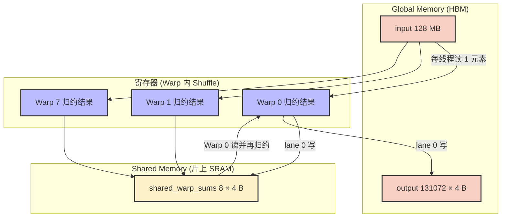
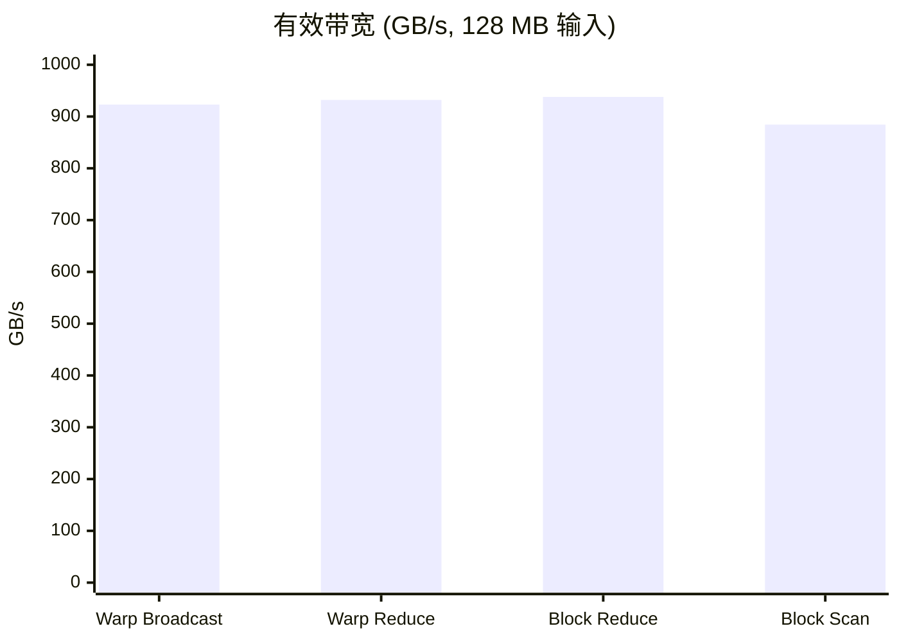

## 本文目标

读完本文，你将能够：

- 理解为何用 Warp Shuffle 取代 Shared Memory 做 Warp 内通信：避免访存延迟与 `__syncthreads()` 开销
- 掌握四种 Shuffle 原语：`__shfl_sync`（广播）、`__shfl_xor_sync`、`__shfl_up_sync`、`__shfl_down_sync` 的语义与典型用法
- 用寄存器级 5 步循环实现 Warp 内无锁归约（Reduce）与前缀和（Scan）
- 通过「Warp 内 Shuffle + Shared Memory 中继」实现 Block 级归约与 Block 级前缀和
- 从算术强度与访存量理解 Reduce 与 Scan 的带宽差异（为何 Reduce 能压出更高有效带宽）

## 对应代码路径

> **硬件环境**：NVIDIA RTX 4090 (Ada Lovelace, sm_89)
> 128 SMs | FP32 82.6 TFLOPS | HBM 1008 GB/s | L2 72 MB | Roofline 拐点 81.9 FLOP/Byte

| 源文件 | Kernel 名称 | 核心技术 | 测试规模 |
|--------|-------------|----------|----------|
| `06_Warp_Primitives/01_warp_shuffle/warp_shuffle.cu` | `kernel_warp_broadcast`<br>`kernel_warp_xor_shuffle`<br>`kernel_warp_up_down_shuffle`<br>`test_kernel_warp_reduce_sum` | `__shfl_sync` / `__shfl_xor_sync` / `__shfl_up/down_sync` 四种原语、Warp 内 5 步归约 | N = 33,554,432 (128 MB FP32) |
| `06_Warp_Primitives/02_warp_reduce/warp_reduce.cu` | `block_reduce_sum`<br>`block_reduce_max` | Warp 内 Shuffle 归约 + Shared 中继、Block 级归约 | Block=256，131072 Blocks |
| `06_Warp_Primitives/03_warp_scan/warp_scan.cu` | `block_scan_inclusive`<br>`block_scan_exclusive` | Warp 内 Shuffle 前缀和 + 跨 Warp 基值、Block 级 Scan | Block=1024 |

> Warp 级原语实现位于 `Common/include/cuda_utils.cuh`：`kernel_warp_reduce_sum`、`kernel_warp_reduce_max`、`kernel_warp_scan_inclusive`、`kernel_warp_scan_exclusive`。

> **本篇在系列中的位置**：承接 [02 归约与线程粗化](/posts/44fe4eb3/) 与 [03 前缀和与多块扫描](/posts/bcb510f9/) 中基于 Shared Memory 的归约与前缀和，本篇在同一「归约/扫描」语义下改用 **Warp Shuffle** 在寄存器级完成 Warp 内通信，再通过 Shared Memory 做跨 Warp 中继，形成 Block 级 Reduce/Scan。后续 [05 大模型算子与注意力归一化](/posts/cb29461c/) 的 Softmax、LayerNorm、RMSNorm 等 Warp 优化直接复用本篇原语；[10 访存优化与共享内存冲突](/posts/5b6f891d/) 则从访存视角讨论 Shuffle 所避免的 Bank Conflict 与合并访存。

---

## 三个实现分别做了什么

### 1. Warp Shuffle：四种原语与 Warp 内归约

`06_Warp_Primitives/01_warp_shuffle` 演示了 Warp 内**寄存器级**数据交换，无需 Shared Memory 与 `__syncthreads()`。

- **Broadcast**（`kernel_warp_broadcast`）：Warp 内将 lane 0 的值广播到所有 32 个 lane，`val = __shfl_sync(0xffffffff, val, 0)`。
- **XOR Shuffle**（`kernel_warp_xor_shuffle`）：每个 lane 从 `lane ^ 16` 取数，实现「前半 warp 与后半 warp」配对交换。
- **Up/Down Shuffle**（`kernel_warp_up_down_shuffle`）：用 `__shfl_down_sync` 与 `__shfl_up_sync` 做相邻 lane 交换（偶数 lane 取 down，奇数 lane 取 up）。
- **Warp Reduce Sum**（`test_kernel_warp_reduce_sum`）：Warp 内 5 步 `__shfl_down_sync` 折叠（offset 16→8→4→2→1），将 32 个标量归约为 1 个和，结果由 lane 0 写回。

每线程读一个 float、经 Shuffle 后写一个 float（归约版本为每 32 线程写 1 个），是典型的**带宽主导**微算子——与 [01 基础概念与分块](/posts/7608f1b0/) 中的 Vector Add 类似，算术强度极低，性能由显存带宽决定。

### 2. Block Reduce：Warp 归约 + Shared 中继

`block_reduce_sum` / `block_reduce_max` 先在各 Warp 内用 `kernel_warp_reduce_sum` / `kernel_warp_reduce_max` 得到每个 Warp 的局部结果，再由 lane 0 写入 `__shared__ float shared_warp_sums[32]`（或 `shared_warp_maxs`），`__syncthreads()` 后仅 Warp 0 对这些标量再做一次 Warp 归约，最终 Block 结果由该 Warp 的 lane 0 写回 `output[blockIdx.x]`。

Block 内只用到**一次** `__syncthreads()`，且 Warp 内通信全部在寄存器完成，相比 [02 归约与线程粗化](/posts/44fe4eb3/) 中纯 Shared Memory 树状归约减少了访存与同步次数。

### 3. Block Scan：Warp 前缀和 + 跨 Warp 基值

`block_scan_inclusive` / `block_scan_exclusive` 先在各 Warp 内用 `kernel_warp_scan_inclusive` / `kernel_warp_scan_exclusive` 得到 Warp 内前缀和；再将各 Warp 的「尾值」（inclusive 时 lane 31 的值）写入 Shared Memory，由 Warp 0 对这些尾值做**排他前缀和**得到每个 Warp 的基值；最后每个线程把自己的 Warp 内前缀和加上所在 Warp 的基值，得到 Block 内全局前缀和。跨 Warp 基值必须用 **Exclusive Scan**，否则会重复计入前一个 Warp 的尾值。

---

## Baseline 与瓶颈分析

### 传统 Shared Memory 归约/扫描的瓶颈

[02 归约与线程粗化](/posts/44fe4eb3/) 与 [03 前缀和与多块扫描](/posts/bcb510f9/) 中，Warp 内或 Block 内中间结果都经 Shared Memory 交换：先 Store → `__syncthreads()` → 再 Load。这会带来：

1. **同步成本**：每次 `__syncthreads()` 会阻塞 SM 上该 Block 的所有 Warp 调度，约一二十个时钟周期量级；树状归约需要 $\log_2(\text{BlockSize})$ 次同步，整体算力空转明显。
2. **访存延迟**：数据从寄存器经 Store 进入 L1/Shared Memory，再经 Load 回到寄存器，路径长、延迟高（数十周期）。在算术强度极低（如每元素一次加法）时，计算管线大量时间在等数据。

### 带宽墙与算术强度

本系列测试使用 128 MB FP32（33,554,432 元素）。Shuffle 类 Kernel（Broadcast、XOR、Up/Down）读 128 MB、写 128 MB；Warp Reduce Sum 读 128 MB、写 128 MB/32 ≈ 4 MB；Block Reduce 读 128 MB、写 131072×4 B ≈ 0.5 MB；Block Scan 读 128 MB、写 128 MB。算术强度均极低（约 1 FLOP/数），性能由**显存带宽**决定，与 [01 基础概念与分块](/posts/7608f1b0/) 中的 Vector Add 同属 Memory Bound。

---

## 优化思路：Warp Shuffle 与寄存器通信

### 核心思想

自 Kepler 起，CUDA 提供 **Warp Shuffle** 指令：同一 Warp 内线程可直接在**寄存器**层面交换标量，无需经过 Shared Memory。Warp 内 32 线程在同一时刻执行同一条 Shuffle，硬件保证参与 lane 的同步，因此不需要、也不应在 Warp 内再插 `__syncthreads()`。

将 Warp 内归约/前缀和从「Shared Memory + 多次同步」改为「若干条 Shuffle + 寄存器运算」，可显著减少访存与同步，把时间更多花在带宽极限的读入/写回上。

### 四种 Shuffle 原语简表

| 原语 | 语义 | 典型用途 |
|------|------|----------|
| `__shfl_sync(mask, var, srcLane)` | 从 `srcLane` 取 `var` | 广播（如 lane 0 的值给全 warp） |
| `__shfl_xor_sync(mask, var, laneMask)` | 从 `laneId ^ laneMask` 取 `var` | 蝴蝶式归约（offset 16→8→4→2→1） |
| `__shfl_down_sync(mask, var, delta)` | 从 `laneId + delta` 取 `var`，越界返回自身 | 向下折叠归约、相邻传递 |
| `__shfl_up_sync(mask, var, delta)` | 从 `laneId - delta` 取 `var`，越界返回自身 | 前缀和（向左取前缀） |

`mask` 常用 `0xffffffff` 表示「当前 warp 32 lane 均参与」；在 Divergence 场景下需按活跃 lane 构造 mask。

### Warp 内归约：5 步折叠

32 个数两两合并需 $\log_2(32)=5$ 步。用 `__shfl_down_sync`：每步中每个 lane 从「当前 lane + offset」取数并累加，offset 从 16 减半到 1。越界时 Shuffle 返回自身值，等价于加 0，无需分支。5 步后 lane 0 的寄存器中即为全 warp 的和。

用 `__shfl_xor_sync` 可实现等价逻辑：`laneId ^ offset` 在 offset=16,8,4,2,1 时恰好形成正确的配对拓扑（蝴蝶结构），本项目中 `cuda_utils.cuh` 的 `kernel_warp_reduce_sum` 采用 XOR 实现。

### Block 级结构：Warp 内 Shuffle + 跨 Warp Shared

- **Block Reduce**：各 Warp 内先 Shuffle 归约 → lane 0 写 Shared → `__syncthreads()` → 仅 Warp 0 对 Shared 中的若干标量再 Shuffle 归约 → lane 0 写 `output[blockIdx.x]`。
- **Block Scan**：各 Warp 内先 Shuffle 做前缀和 → 将 Warp 尾值写入 Shared → Warp 0 对尾值做 **Exclusive** Scan 得到各 Warp 基值 → `__syncthreads()` → 每线程加上自己 Warp 的基值。

跨 Warp 阶段仍需 Shared Memory 和一次（或两次）`__syncthreads()`，但 Warp 内已无 Shared 访问与额外同步。

---

## 关键代码解释

### Warp Broadcast 与 Warp 内 5 步归约

```cpp
// 来源：06_Warp_Primitives/01_warp_shuffle/warp_shuffle.cu : L5-L17
__global__ void kernel_warp_broadcast(CPFloat input, PFloat output, CInt n) {
    int tid = blockIdx.x * blockDim.x + threadIdx.x;
    if (tid < n) {
        float val = input[tid];
        val = __shfl_sync(0xffffffff, val, 0); // 从 lane 0 广播到整个 warp
        output[tid] = val;
    }
}
```

```cpp
// 来源：06_Warp_Primitives/01_warp_shuffle/warp_shuffle.cu : L63-L78
__global__ void test_kernel_warp_reduce_sum(CPFloat input, PFloat output, CInt n) {
    int tid = blockIdx.x * blockDim.x + threadIdx.x;
    if (tid < n) {
        float val = input[tid];
        #pragma unroll
        for (int offset = 16; offset > 0; offset /= 2) {
            val += __shfl_down_sync(0xffffffff, val, offset);
        }
        int lane = threadIdx.x % 32;
        if (lane == 0) {
            output[tid / 32] = val;
        }
    }
}
```

`__shfl_down_sync` 越界时返回自身值，因此高位 lane 在 offset 较大时相当于加 0，无需 `if (lane_id + offset < 32)`。`#pragma unroll` 将 5 步展开为固定指令，无循环分支。

### Block Reduce：Warp 归约 + Shared 中继

```cpp
// 来源：06_Warp_Primitives/02_warp_reduce/warp_reduce.cu : L5-L31
__global__ void block_reduce_sum(CPFloat input, PFloat output, CInt n) {
    int tid = blockIdx.x * blockDim.x + threadIdx.x;

    float sum = (tid < n) ? input[tid] : 0.0f;
    sum = kernel_warp_reduce_sum(sum);

    __shared__ float shared_warp_sums[32];

    int warp_id = threadIdx.x / 32;
    int lane_id = threadIdx.x % 32;

    if (lane_id == 0) {
        shared_warp_sums[warp_id] = sum;
    }
    __syncthreads();

    int num_warps = blockDim.x / 32;

    if (warp_id == 0) {
        sum = (lane_id < num_warps) ? shared_warp_sums[lane_id] : 0.0f;
        sum = kernel_warp_reduce_sum(sum);

        if (lane_id == 0) {
            output[blockIdx.x] = sum;
        }
    }
}
```

### Warp 前缀和与边界

```cpp
// 来源：Common/include/cuda_utils.cuh : L148-L160
__device__ inline float kernel_warp_scan_inclusive(float val) {
    #pragma unroll
    for (int offset = 1; offset < 32; offset *= 2) {
        float n = __shfl_up_sync(0xffffffff, val, offset);
        int laneId = threadIdx.x % 32;
        if (laneId >= offset) {
            val += n;
        }
    }
    return val;
}
```

前缀和必须用 `__shfl_up_sync`（向左取）。**不能**像归约那样依赖越界「返回自身」：lane 0 向左取会越界，若把返回值当作有效前缀加进去会出错。因此必须用 `if (laneId >= offset)` 只对「左侧存在有效 lane」的线程累加。

### Block Scan 中跨 Warp 基值必须用 Exclusive Scan

```cpp
// 来源：06_Warp_Primitives/03_warp_scan/warp_scan.cu : L21-L31
if (warp_id == 0) {
    int num_warps = blockDim.x / 32;
    float warp_sum = (lane_id < num_warps) ? warp_sums[lane_id] : 0.0f;

    // 这里需要对 Base 进行 Exclusive Scan，因为 Warp N 不需要加上自己的总和
    float dump_total;
    float base_offset = kernel_warp_scan_exclusive(warp_sum, dump_total);

    if (lane_id < num_warps) {
        warp_sums[lane_id] = base_offset;
    }
}
```

各 Warp 的 `warp_sums[warp_id]` 存的是该 Warp 的**包含型**前缀和尾值（即该 Warp 内元素之和）。Warp 1 的基值应为「Warp 0 的总和」，不应包含 Warp 1 自身。因此对 `warp_sums[]` 做的是 **Exclusive Scan**，得到的是每个 Warp 的「前驱 Warp 之和」，再广播给该 Warp 内所有线程做加法。

### Block / Thread 映射（Block Reduce，Block=256）

| 层级 | 配置 | 职责 |
|------|------|------|
| Grid | `(cdiv(n, 256), 1)` | 每个 Block 负责 256 个输入，输出 1 个标量 |
| Block | 256 线程，8 Warps | 每 Warp 先 Shuffle 归约，lane 0 写 Shared；Warp 0 再归约 8 个标量 |
| Thread | warp_id = tid/32, lane_id = tid%32 | 加载 input[tid]、Warp 归约、lane 0 写 shared_warp_sums[warp_id]；仅 Warp 0 参与第二轮归约并写 output[blockIdx.x] |

### 数据流概览（Block Reduce）



---

## 结果与边界

### Warp Shuffle 性能（N = 33,554,432，128 MB，100 次迭代平均）

> 数据来源：`Results/06_Warp_Primitives.md` 原始日志

| 版本 | Kernel 耗时 | 有效带宽 | vs CPU | 数据性质 |
|------|------------|---------|--------|----------|
| CPU Broadcast | 29.54 ms | — | 1x | [实测] |
| **GPU Warp Broadcast** | **0.29 ms** | **923.14 GB/s** | **101.58x** | [实测] |
| GPU XOR Shuffle | 0.29 ms | ~923 GB/s | ~140x | [实测] |
| GPU Up/Down Shuffle | 0.30 ms | ~895 GB/s | ~163x | [实测] |
| CPU Reduce Sum | 41.00 ms | — | 1x | [实测] |
| **GPU Warp Reduce Sum** | **0.15 ms** | **932.06 GB/s** | **276.09x** | [实测] |

Broadcast、XOR、Up/Down 三者耗时几乎一致（~0.29–0.30 ms）：在 Crossbar 上不同 Shuffle 拓扑的单次延迟均为约 1 周期，瓶颈在 128 MB 的读+写带宽。Warp Reduce Sum 写回量仅为 128/32 MB，写端带宽压力小，因此耗时约减半、有效带宽略升。

### Block Reduce / Block Scan 性能

| 版本 | Kernel 耗时 | 有效带宽 | vs CPU | 数据性质 |
|------|------------|---------|--------|----------|
| CPU Reduce Sum | 48.87 ms | — | 1x | [实测] |
| **GPU Block Reduce Sum** | **0.14 ms** | **937.89 GB/s** | **340.14x** | [实测] |
| **GPU Block Reduce Max** | **0.14 ms** | **937.89 GB/s** | **351.17x** | [实测] |
| CPU Inclusive Scan | 51.61 ms | — | 1x | [实测] |
| **GPU Block Inclusive Scan** | **0.30 ms** | **884.34 GB/s** | **170.02x** | [实测] |
| **GPU Block Exclusive Scan** | **0.30 ms** | **884.58 GB/s** | **170.00x** | [实测] |

Block Reduce 读 128 MB、写 131072×4 B ≈ 0.5 MB，总访存以读为主，有效带宽可达 937.89 GB/s，接近 RTX 4090 理论 1008 GB/s 的 **93%** [实测/理论]。Block Scan 读 128 MB、写 128 MB，与 Shuffle 的 Broadcast/XOR/Up-Down 类似，有效带宽 ~884 GB/s。

### 为何 Reduce 比 Scan 更快、带宽更高

Reduce 的输出规模为 $O(N/\text{BlockSize})$，Scan 为 $O(N)$。在相同输入规模下，Reduce 的写回量远小于 Scan，因此：

- 总访存量：Reduce ≈ 读 128 MB + 写 0.5 MB；Scan = 读 128 MB + 写 128 MB。
- 算术强度均极低（约 1 FLOP/数），属 Memory Bound；Reduce 的「有效带宽」分母更小（写回少），所以数值上更高，Kernel 耗时也更短（0.14 ms vs 0.30 ms）。



### 边界与局限

- 本篇测试算术强度极低，性能由显存带宽主导，Reduce/Scan 之间的差异主要来自**输出数据量**，而非加法与比较指令本身。
- Warp Shuffle 仅限**同一 Warp 内**；跨 Warp 仍需 Shared Memory 与 `__syncthreads()`。Block 内若存在 Warp Divergence，需用正确的 `mask` 参与 Shuffle，否则会死锁或未定义行为。

---

## 常见误区

1. **误区**：Warp 内已经用了 `__shfl_*_sync`，后面再加一次 `__syncthreads()` 更安全。
   **实际**：`__shfl_*_sync` 的 `_sync` 已在参与 mask 的 lane 间形成同步点，Warp 内无需再插 Block 级同步。在仅 Warp 内通信后多加 `__syncthreads()` 会白白增加延迟并可能拖慢吞吐，一般应避免。

2. **误区**：Block 级前缀和里，对「各 Warp 尾值」做 Inclusive Scan 再分发也可以。
   **实际**：若对 Warp 尾值做 Inclusive Scan，每个 Warp 拿到的基值会包含**自己**的尾值；下一阶段每个线程会再加上本 Warp 内的前缀和（已含自身），导致该 Warp 的基值被重复加一次。跨 Warp 基值必须用 **Exclusive Scan** 得到「前驱 Warp 之和」。

3. **误区**：Warp 前缀和里也可以像归约一样不写 `if (laneId >= offset)`，依赖越界返回。
   **实际**：归约时越界返回自身等价于加 0；前缀和时 lane 0 向左取会越界，返回值未定义或为别 lane 的值，若无条件累加会破坏语义。前缀和必须用 `laneId >= offset` 限制只累加「左侧有效」的值。

4. **误区**：Block Reduce 需要多次 `__syncthreads()` 才能保证 Warp 间顺序。
   **实际**：只需一次。各 Warp 内 Shuffle 归约完成后，lane 0 写 Shared；一次 `__syncthreads()` 保证所有 Warp 的 lane 0 都写完，再由 Warp 0 对 Shared 中的标量做第二次 Warp 归约并写回。第二次归约仍在同一 Warp 内，无需再同步。

---

## 系列导航

### 前置阅读

| 文章 | 与本篇的衔接 |
|------|----------------|
| [02 归约与线程粗化](/posts/44fe4eb3/) | 对比 Shared Memory + `__syncthreads` 的传统归约/粗化，与本篇的 Warp Shuffle 归约形成对照 |
| [03 前缀和与多块扫描](/posts/bcb510f9/) | 理解 Block Scan、多 Block 扫描的整体结构，便于理解本篇用 `__shfl_up_sync` 做 Warp 内前缀和再拼成 Block Scan |

### 推荐后续（承上启下）

| 文章 | 与本篇的衔接 |
|------|----------------|
| [05 大模型算子与注意力归一化](/posts/cb29461c/) | Softmax、LayerNorm、RMSNorm 等算子中的 Warp 级归约与广播直接复用本篇的 `__shfl_*` 原语 |
| [10 访存优化与共享内存冲突](/posts/5b6f891d/) | 从访存与 Bank 冲突角度理解 Warp Shuffle 为何能替代部分 Shared Memory 使用 |

---

## 顺序导航

- 上一篇：[CUDA实践-05-大模型算子与注意力归一化](/posts/cb29461c/)
- 下一篇：[CUDA实践-07-量化半精度与整数推理](/posts/ef325d2f/)
