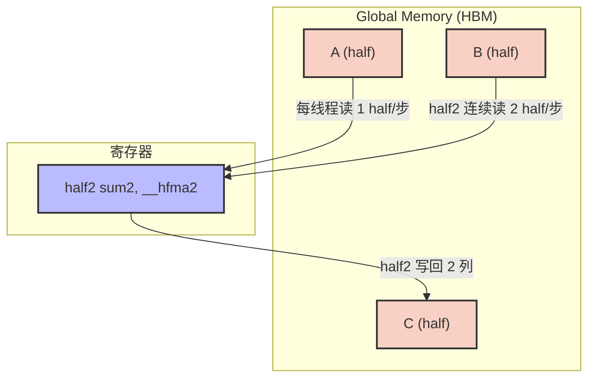
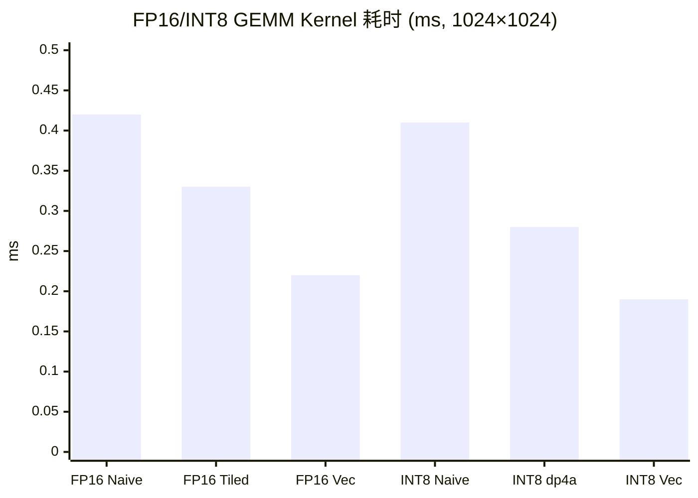

## 本文目标

读完本文，你将能够：

- 理解量化如何缓解 Memory Bound：FP16/INT8 将数据宽度减半或四分之一的带宽收益
- 区分 Per-Tensor 与 Per-Channel 量化：为何 Per-Channel 对 Outlier 更友好但访存模式更差
- 用 `half2` 与 `__hfma2` 实现双路 FP16 乘加，避免 Naive FP16 中 `__half2float` 的软算开销
- 理解 `__dp4a` 的 4×INT8 打包语义，用向量化重排打满 $B$ 矩阵的连续读取并一次写回 4 列

## 对应代码路径

> **硬件环境**：NVIDIA RTX 4090 (Ada Lovelace, sm_89)
> 128 SMs | FP32 82.6 TFLOPS | HBM 1008 GB/s | L2 72 MB | Roofline 拐点 81.9 FLOP/Byte

| 源文件 | Kernel 名称 | 核心技术 | 测试规模 |
|--------|-------------|----------|----------|
| `07_Quantization/03_quant_dequant/quant_dequant.cu` | `quantize_per_tensor`<br>`dequantize_per_tensor`<br>`quantize_per_channel`<br>`fp32_to_fp16`<br>`fp16_to_fp32` | Absmax 量化、Per-Tensor/Per-Channel 缩放、FP32↔FP16 转换 | N = 10,485,760 (40 MB) |
| `07_Quantization/01_fp16_gemm/fp16_gemm.cu` | `kernel_naive_fp16_gemm`<br>`kernel_tiled_fp16_gemm`<br>`kernel_vectorized_fp16_gemm` | `half` GEMM、Shared Memory Tiling、`half2` + `__hfma2` 向量化 | M=N=K=1024 |
| `07_Quantization/02_int8_gemm/int8_gemm.cu` | `naive_int8_gemm`<br>`dp4a_int8_gemm`<br>`vectorized_int8_gemm` | 标量 INT8 GEMM、`__dp4a` 四元组乘加、向量化 4 列 + `int4` 写回 | M=N=K=1024 |

> **本篇在系列中的位置**：承接 [05 大模型算子与注意力归一化](/posts/cb29461c/) 中 Softmax/LayerNorm/RMSNorm 的数值敏感度，本篇从**数据类型与量化**角度回答「如何在几乎不丢精度的前提下把算子搬到 FP16/INT8」。后续 [09 张量核心与混合精度](/posts/78e375e8/) 用 Tensor Core 把本篇的 FP16/INT8 GEMM 推到指令峰值；[11 推理优化、融合与键值缓存](/posts/9729c03f/) 在系统层面串联「量化 + 算子融合 + KV Cache」的推理链路。

---

## 三个实现分别做了什么

### 1. 量化/反量化与类型转换：带宽主导的微 Kernel

`quant_dequant.cu` 提供 Per-Tensor / Per-Channel 的 FP32→INT8 量化与反量化，以及 FP32↔FP16 的直接转换。每线程处理一个元素：读 FP32/INT8/FP16，做缩放与舍入（量化）或乘 scale（反量化）或类型铸造，写回。无复杂计算，纯 **Memory Bound**——与 [01 基础概念与分块](/posts/7608f1b0/) 中的 Vector Add 类似，能否把带宽压榨到极限是衡量实现质量的第一道标尺。

数据量 40 MB 时能完全落入 RTX 4090 的 72 MB L2，Kernel 耗时仅 0.02–0.03 ms，有效带宽可超过 HBM 理论 1008 GB/s（读写主要在 L2 内完成）。Per-Tensor 使用单一全局 scale，访存连续；Per-Channel 按 channel 取 `scales[c]`，存在按 channel 的间接寻址，带宽略低于 Per-Tensor。

### 2. FP16 GEMM：Naive / Tiled / Vectorized

`kernel_naive_fp16_gemm` 与 [01 基础概念与分块](/posts/7608f1b0/) 的 FP32 Naive GEMM 结构相同，但用 `half` 读写，内层用 `__half2float` 转成 float 再乘加、最后 `__float2half` 写回。类型转换在标量流水中执行，无法发挥 SM 上的 FP16 双发能力，甚至因转换开销而慢于「直接 FP32」的等效实现。

`kernel_tiled_fp16_gemm` 与 01 的 Tiled GEMM 一致：Shared Memory 装填 `half` tile，内层仍用 `__half2float` 做乘加，通过减少全局访存获得加速。

`kernel_vectorized_fp16_gemm` 的核心改进是：每线程负责 $C$ 的**两列**（`col` 以 2 为步长），内层用 `half2` 一次从 $B$ 读两个连续 half，用 `__halves2half2(A[row*N+i], A[row*N+i])` 得到 $(a,a)$，用 `__hfma2(a_val2, b_val2, sum2)` 一条指令完成两次半精度 FMA，累加在 `half2` 中，最后用 `*reinterpret_cast<half2*>(&C[...])` 写回两个 half。全程无 `__half2float`，充分发挥 FP16 双路运算与合并访存。

### 3. INT8 GEMM：标量 / dp4a / 向量化 dp4a

`naive_int8_gemm` 与 FP32 Naive GEMM 类似，内层为 `sum += (int32_t)A[...] * (int32_t)B[...]`，每元素 1 字节读入，计算密度高但未用硬件 INT8 指令。

`dp4a_int8_gemm` 利用 `__dp4a(a_val, b_val, acc)`：从 $A$ 一次读 4 字节（`int32_t` 打包 4 个 int8），从 $B$ 的 4 行同一列取 4 个 int8 手动拼成一个 `int32_t`，再调用 `compat_dp4a`（内部为 `__dp4a` 或软件展开）。一条 dp4a 完成 4 次乘加并累加到 acc，循环步长变为 4。

`vectorized_int8_gemm` 每线程负责 $C$ 的** 4 列**。沿 $K$ 每次步进 4：从 $A$ 读一个 `int32_t` 打包；从 $B$ 的 4 行各读一个 `int32_t`（一行内连续 4 列），在寄存器里按列拆成 4 个「4×int8」打包（col0_val … col3_val），对同一 `a_val` 连续做 4 次 `compat_dp4a` 得到 sum0–sum3，最后用 `int4` 一次写回 4 个 int32 结果。这样 $B$ 的读取是连续 4 字节、写回是 16 字节，访存与计算都更饱和。

---

## Baseline 与瓶颈分析

### 为何要做量化与半精度

大模型推理中，大量时间花在 LayerNorm、Softmax、矩阵乘等算子上，且多数受**显存带宽**限制（Memory Bound）。FP32 每数 4 字节；改为 FP16 或 INT8 后，同一带宽下可搬运的数据量翻倍或翻两番，在保持近似精度的前提下提升吞吐。量化/反量化与类型转换本身也是轻量 Kernel，适合与前后算子融合，减少往返显存的次数。

### Naive FP16 的瓶颈

Naive FP16 GEMM 虽然用 `half` 存储，计算路径却是：`__half2float` → float 乘加 → `__float2half`。即没有真正使用硬件 FP16 运算单元，反而多了类型转换指令，无法发挥 SM 上一条指令双路 FP16 的能力（如 `__hfma2`），因此相对「直接 FP32 Tiled」没有优势，甚至更慢。

### INT8 与 dp4a 的打包要求

`__dp4a(a, b, c)` 要求 `a`、`b` 各为 32 位，内部包含 4 个 int8。若 $A$ 按行存、$B$ 按列取，则 $A$ 的一行连续 4 个 int8 可自然用 `int32_t` 一次读出；$B$ 的一列对应 4 个不同行，若逐字节读再移位拼装，会多出大量标量指令。正确做法是：让 $B$ 的访问尽量连续（例如一次读一行中连续 4 字节），在寄存器里按列重排成 4 个 32 位打包，再喂给 `__dp4a`，这样既满足指令输入格式，又提高访存效率。

### Per-Channel 量化的访存代价

Per-Tensor 量化只需一个全局 scale，寄存器或常量即可；Per-Channel 需要按 channel 索引 `scales[c]`，若 scale 表较大或访问模式分散，会带来额外全局访存与更差的合并性。实测中 Per-Channel Kernel 有效带宽低于 Per-Tensor（约 1762 GB/s vs 2166 GB/s），原因即在于此。

---

## 优化思路：数据类型与向量化如何降低访存压力

### 核心思想

- **类型转换/量化**：每线程单元素、无分支、连续访存，让数据尽量落在 L2，Kernel 耗时可压到数十微秒级，有效带宽远超 HBM 峰值（因在 L2 内完成）。
- **FP16 GEMM**：用 `half2` 一次处理 2 个 half，用 `__hfma2` 一条指令完成 2 次 FMA，避免 `__half2float`；每线程算 2 列，提高算术强度与访存比。
- **INT8 GEMM**：用 `__dp4a` 一次完成 4 个 int8 的乘加；通过「每线程 4 列 + $B$ 矩阵按行连续读 4 字节 + 寄存器内按列重排」满足 dp4a 输入并提高带宽利用率。

### 访存量与数据宽度对比

以 $M=N=K=1024$ 的 GEMM 为例（读 $A$、$B$，写 $C$）：

| 版本 | 数据宽度 | 读 $A$+$B$ | 写 $C$ | 总访存（理论） |
|------|----------|------------|--------|----------------|
| FP32 GEMM | 4 B | $2 \times 1024^3 \times 4$ B | $1024^2 \times 4$ B | ~8.5 MB |
| FP16 GEMM | 2 B | $2 \times 1024^3 \times 2$ B | $1024^2 \times 2$ B | ~4.25 MB |
| INT8 GEMM ($C$ 为 int32) | 1 B (A,B) | $1024^3 + 1024^2 \times 1024$ B | $1024^2 \times 4$ B | ~5.25 MB |

量化后单次搬运的字节数下降，在 Memory Bound 场景下可缩短 Kernel 时间；同时 INT8 用 dp4a 每周期完成更多乘加，在合适规模下可同时获得带宽与算力收益。

### 存储层级与 L2 效应

| 数据规模 | 与 L2 关系 | 有效带宽现象 |
|----------|------------|--------------|
| 40 MB（量化/转换） | 完全落入 72 MB L2 | 有效带宽可超过 2000 GB/s，高于 HBM 1008 GB/s |
| 6 MB（1024×1024 FP16/INT8） | 落入 L2 | GEMM 仍偏 Memory Bound，Kernel 耗时主要受 L2→SM 带宽影响 |

---

## 关键代码解释

### FP32→FP16 与 Per-Tensor 量化

```cpp
// 来源：07_Quantization/03_quant_dequant/quant_dequant.cu : L36-L40
__global__ void fp32_to_fp16(CPFloat input, half* output, CInt n) {
    CInt tid = blockIdx.x * blockDim.x + threadIdx.x;
    if (tid < n) {
        output[tid] = __float2half(input[tid]);
    }
}
```

```cpp
// 来源：07_Quantization/03_quant_dequant/quant_dequant.cu : L8-L14
__global__ void quantize_per_tensor(CPFloat input, int8_t* output, float scale, CInt n) {
    CInt tid = blockIdx.x * blockDim.x + threadIdx.x;
    if (tid < n) {
        float scaled = roundf(input[tid] / scale);
        output[tid] = static_cast<int8_t>(fminf(127.0f, fmaxf(-128.0f, scaled)));
    }
}
```

每线程一元素，合并读写；Block 常用 256 线程，Grid 覆盖 $n$。边界判断 `if (tid < n)` 只在最后一个未满的 Block 中触发，不会引起 Warp Divergence。

### Naive FP16 与 Vectorized FP16：half2 与 __hfma2

```cpp
// 来源：07_Quantization/01_fp16_gemm/fp16_gemm.cu : L6-L16
__global__ void kernel_naive_fp16_gemm(const half* A, const half* B, half* C, CInt M, CInt N, CInt K) {
    CInt row = blockIdx.y * blockDim.y + threadIdx.y;
    CInt col = blockIdx.x * blockDim.x + threadIdx.x;

    if (row < M && col < K) {
        float sum = 0.0f;
        for (int i = 0; i < N; ++i) {
            sum += __half2float(A[row * N + i]) * __half2float(B[i * K + col]);
        }
        C[row * K + col] = __float2half(sum);
    }
}
```

```cpp
// 来源：07_Quantization/01_fp16_gemm/fp16_gemm.cu : L47-L74
__global__ void kernel_vectorized_fp16_gemm(const half* A, const half* B, half* C, CInt M, CInt N, CInt K) {
    CInt row = blockIdx.y * TILE_SIZE + threadIdx.y;
    CInt col = (blockIdx.x * TILE_SIZE + threadIdx.x) * 2;  // 每线程 2 列

    if (row < M && col < K) {
        half2 sum2 = __float2half2_rn(0.0f);
        for (int i = 0; i < N; ++i) {
            half2 a_val2 = __halves2half2(A[row * N + i], A[row * N + i]);
            half2 b_val2 = *reinterpret_cast<const half2*>(&B[i * K + col]);
#if defined(__CUDA_ARCH__) && __CUDA_ARCH__ >= 530
            sum2 = __hfma2(a_val2, b_val2, sum2);
#else
            // Fallback: FP32 路径
            float2 a_f2 = __half22float2(a_val2);
            // ...
#endif
        }
        *reinterpret_cast<half2*>(&C[row * K + col]) = sum2;
    }
}
```

`__halves2half2` 将同一 $A$ 元素复制成两个 half 组成 `half2`；$B$ 的 `[i*K+col, i*K+col+1]` 用 `half2` 一次读取。`__hfma2` 在 SM 5.3+ 上一条指令完成两个 FMA，无 `__half2float`。

### INT8 dp4a：$A$ 打包、$B$ 按行读再按列重排

```cpp
// 来源：07_Quantization/02_int8_gemm/int8_gemm.cu : L41-L64
// 单列版本：A 一行 4 字节一次读，B 一列 4 个元素手动打包
for (int i = 0; i < N; i += 4) {
    int32_t a_val = *reinterpret_cast<const int32_t*>(&A[row * N + i]);

    int8_t b0 = B[(i + 0) * K + col];
    int8_t b1 = B[(i + 1) * K + col];
    int8_t b2 = B[(i + 2) * K + col];
    int8_t b3 = B[(i + 3) * K + col];
    b_val = ((b3 & 0xFF) << 24) | ((b2 & 0xFF) << 16) |
            ((b1 & 0xFF) << 8) | (b0 & 0xFF);

    sum = compat_dp4a(a_val, b_val, sum);
}
```

```cpp
// 来源：07_Quantization/02_int8_gemm/int8_gemm.cu : L76-L115
// 向量化版本：每线程 4 列，B 每行连续 4 字节用 int32_t 读，再按列拆成 4 个 pack
for (int i = 0; i < N; i += 4) {
    int32_t a_val = *reinterpret_cast<const int32_t*>(&A[row * N + i]);
    int32_t b_row0_pack = *reinterpret_cast<const int32_t*>(&B[(i + 0) * K + col]);
    int32_t b_row1_pack = *reinterpret_cast<const int32_t*>(&B[(i + 1) * K + col]);
    // ...
    int8_t r0_c0 = b_row0_pack & 0xFF;
    int8_t r1_c0 = b_row1_pack & 0xFF;
    // ...
    int32_t col0_val = ((r3_c0 & 0xFF) << 24) | ((r2_c0 & 0xFF) << 16) | ((r1_c0 & 0xFF) << 8) | (r0_c0 & 0xFF);
    // col1_val, col2_val, col3_val 同理
    sum0 = compat_dp4a(a_val, col0_val, sum0);
    sum1 = compat_dp4a(a_val, col1_val, sum1);
    sum2 = compat_dp4a(a_val, col2_val, sum2);
    sum3 = compat_dp4a(a_val, col3_val, sum3);
}
```

$B$ 的 4 行在同一列方向不连续，但每行在 $K$ 维上连续 4 个 int8 可一次读入；在寄存器中用移位和掩码按列取出 4 个「4×int8」打包，分别与同一 `a_val` 做 dp4a，得到 4 列结果，再以 `int4` 写回。

### Block / Thread 映射（FP16 Vectorized，1024×1024）

| 层级 | 配置 | 职责 |
|------|------|------|
| Grid | `(32, 32)`（$K$、$M$ 各按 32 分块） | 覆盖 $C$ 的 1024×1024 |
| Block | `dim3(32, 32)`，1024 线程 | 每块对应 $C$ 的一个 32×32 区域，但每线程负责 2 列，故实际输出 32×64 逻辑列 |
| Thread | col = (blockIdx.x*32 + threadIdx.x)*2 | 计算 `C[row][col]` 与 `C[row][col+1]`，内层循环用 half2 读 $B$、`__hfma2` 累加 |

### 数据流概览（FP16 Vectorized）



---

## 结果与边界

### 量化/类型转换性能（N = 10,485,760，40 MB，100 次迭代平均）

> 数据来源：`Results/07_Quantization.md` 原始日志

| 版本 | Kernel 耗时 | 有效带宽 | vs CPU | 数据性质 |
|------|------------|---------|--------|----------|
| CPU FP32→FP16 | 95.77 ms | — | 1x | [实测] |
| **GPU FP32→FP16** | **0.02 ms** | **2911.98 GB/s** | **4432.87x** | [实测] |
| GPU FP32→INT8 Per-Tensor | 0.02 ms | 2166.62 GB/s | 3580.82x | [实测] |
| GPU FP32→INT8 Per-Channel | 0.03 ms | 1762.77 GB/s | 2985.81x | [实测] |

有效带宽超过 HBM 理论 1008 GB/s，是因为 40 MB 数据完全落在 72 MB L2 内，读写主要在 L2 完成。说明在 L2 可容纳的前提下，类型转换与简单量化的成本极低，适合与前后算子融合。

### FP16 GEMM 性能（1024×1024，10 次迭代平均）

> 数据来源：`Results/07_Quantization.md` 原始日志

| 版本 | Kernel 耗时 | 计算吞吐 | vs Naive | 数据性质 |
|------|------------|---------|----------|----------|
| FP16 Naive | 0.42 ms | — | 1.00x | [实测] |
| FP16 Tiled | 0.33 ms | — | 1.28x | [实测] |
| **FP16 Vectorized (`half2`)** | **0.22 ms** | **9697.25 GFLOPS (约 9.70 TFLOPS)** | **1.91x** | [实测] |

Vectorized 版本通过 `__hfma2` 双路乘加与每线程 2 列，相对 Naive 约 1.91× 加速，与「约 2× 算力利用」的直觉一致。

### INT8 GEMM 性能（1024×1024，10 次迭代平均）

| 版本 | Kernel 耗时 | 有效算力 | vs Naive | 数据性质 |
|------|------------|---------|----------|----------|
| INT8 Naive | 0.41 ms | — | 1.00x | [实测] |
| INT8 dp4a | 0.28 ms | — | 1.48x | [实测] |
| **INT8 Vectorized dp4a** | **0.19 ms** | **11.31 TOPS** | **2.14x** | [实测] |

向量化 dp4a 每线程 4 列、$B$ 连续读 + 寄存器重排，进一步压榨带宽与 dp4a 吞吐。



### 为什么有效带宽能超过 1008 GB/s

量化/转换 Kernel 的 40 MB 数据远小于 RTX 4090 的 72 MB L2 Cache。读写请求被 L2 拦截，并未真正到达 HBM；L2 到 SM 的带宽远高于 HBM 到 L2，因此「有效带宽 = 数据量/耗时」会超过 HBM 理论峰值。这不是测量错误，而是**存储层级**带来的正常现象——与 [01 基础概念与分块](/posts/7608f1b0/) 中「小矩阵享受 L2 隐性收益」同理。

### 边界与局限

- **小矩阵与 L2**：1024×1024 的 $A$、$B$、$C$ 合计约 6 MB（FP16）或更少（INT8），易被 L2 缓存，此时 Kernel 仍偏 Memory Bound，INT8 相对 FP16 的加速（0.19 ms vs 0.22 ms）并非「数倍」。在更大规模（如 $K \ge 8192$）超出 L2 后，INT8 的带宽与算力优势会更明显。
- **dp4a 与 Tensor Core**：`__dp4a` 在 Pascal (sm_61) 及以上可用；Turing 及更新架构还有 INT8 Tensor Core，吞吐远高于单条 dp4a。本篇仅用 dp4a 建立打包与向量化直觉，更高峰值需 [09 张量核心与混合精度](/posts/78e375e8/) 的 WMMA/Tensor Core。

---

## 常见误区

1. **误区**：大模型一旦上量化，整体推理一定变快。
   **实际**：在极短序列或小 batch 下，若瓶颈在计算或调度（Compute Bound），多一次反量化或类型转换会带来额外开销。只有在 Memory Bound 场景下，通过量化减少数据搬运量才能带来明显收益。

2. **误区**：FP16 只要把数据类型改成 `half` 就会快。
   **实际**：若内层仍用 `__half2float` 转成 float 再算，等于没有利用硬件 FP16 单元，反而多了转换成本。必须用 `half2` + `__hfma2`（或同类原生 half 指令）才能发挥 FP16 带宽与双发优势。

3. **误区**：有效带宽超过 1008 GB/s 说明测错了。
   **实际**：当数据完全落在 L2 内时，读写不经过 HBM，L2→SM 带宽远高于 HBM，因此「数据量/耗时」可以超过 HBM 理论值。这是存储层级的正常现象。

4. **误区**：所有 GPU 上 INT8 都要靠 `__dp4a` 这类指令。
   **实际**：Pascal (sm_61) 起支持 `__dp4a`；Turing 及之后还有专用 INT8 Tensor Core，单指令吞吐远高于 dp4a。本篇用 dp4a 讲清「4×int8 打包 + 向量化」的思路，实际工程中大规模 INT8 常交给 Tensor Core 或库（如 cuBLASLt）完成。

---

## 系列导航

### 前置阅读

| 文章 | 与本篇的衔接 |
|------|----------------|
| [01 基础概念与分块](/posts/7608f1b0/) | 建立带宽墙、Roofline、Tiling 与存储层级直觉，本篇的量化/FP16/INT8 都在同一「访存-计算」框架下 |
| [04 矩阵乘优化与寄存器分块](/posts/1a09f6f/) | 先理解 FP32 下 Tiling、寄存器分块与双缓冲，再在本篇把结构迁移到 FP16/INT8 |
| [05 大模型算子与注意力归一化](/posts/cb29461c/) | 了解哪些算子最吃带宽、对数值敏感，便于判断哪些适合 FP16/INT8 量化 |

### 推荐后续（承上启下）

| 文章 | 与本篇的衔接 |
|------|----------------|
| [09 张量核心与混合精度](/posts/78e375e8/) | 用 WMMA/Tensor Core 将 FP16/INT8 GEMM 推到硬件峰值 |
| [11 推理优化、融合与键值缓存](/posts/9729c03f/) | 从系统视角看「量化 + KV Cache + 算子融合」的推理链路，将本篇算子嵌入实际流水线 |

---

## 顺序导航

- 上一篇：[CUDA实践-06-线程束原语与寄存器通信](/posts/fec051fc/)
- 下一篇：[CUDA实践-08-多流图执行与扩展开发](/posts/b1c0c6a3/)
