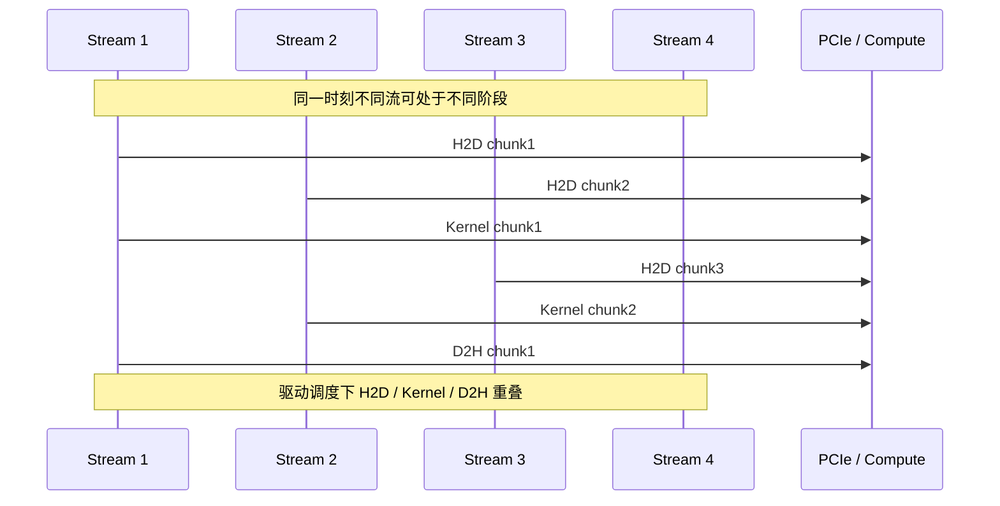
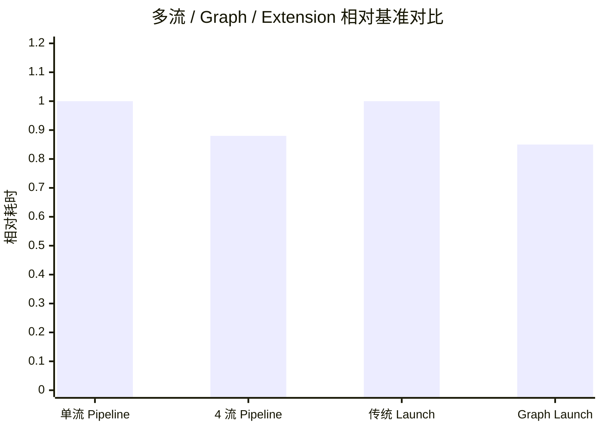

## 本文目标

读完本文，你将能够：

- 理解单流下 H2D、Kernel、D2H 串行导致的 PCIe 与计算无法重叠的瓶颈
- 用多流（Multi-Stream）将数据分块、异步拷贝与 Kernel 交错发射，实现传输与计算的重叠
- 理解 CUDA Graphs 如何通过一次 Capture + 多次 Replay 降低极短 Kernel 序列的 CPU 发射开销（Launch Bound）
- 理解 PyTorch C++/CUDA 扩展如何用 `torch::empty_like` 与 `data_ptr()` 直连 CUDA Kernel，绕过 Python 与框架调度开销

## 对应代码路径

> **硬件环境**：NVIDIA RTX 4090 (Ada Lovelace, sm_89)
> 128 SMs | FP32 82.6 TFLOPS | HBM 1008 GB/s | L2 72 MB | Roofline 拐点 81.9 FLOP/Byte

| 源文件 | Kernel 名称 | 核心技术 | 测试规模 |
|--------|-------------|----------|----------|
| `08_Advanced/02_multi_stream/multi_stream.cu` | `compute_kernel` | 多流、H2D/Kernel/D2H 分块异步、Pinned 内存 | N = 16,777,216 (192 MB) |
| `08_Advanced/01_cuda_graphs/cuda_graphs.cu` | `add_kernel`<br>`mul_kernel` | $(A+B)\cdot D + F$ 三段流水、Graph Capture + Replay | N = 100,000 (约 2.67 MB) |
| `08_Advanced/03_pytorch_extension/pytorch_extension.cu` | `swish_forward_kernel`<br>`swish_backward_kernel` | Swish 前向/反向、C++ Extension + `data_ptr()` | N = 10,485,760 (40 MB) |

> **本篇在系列中的位置**：承接 [07 量化、半精度与整数推理](/posts/ef325d2f/) 与单算子优化，本篇从**系统与调度视角**回答「当单算子已经很快时，端到端还慢在哪里？」——用 **Multi-Stream** 掩盖 H2D/D2H、用 **CUDA Graphs** 降低极短 Kernel 的 Launch 开销、用 **PyTorch C++ Extension** 绕过 Python 调度。后续 [11 推理优化、融合与键值缓存](/posts/9729c03f/) 会在推理系统中串联这些技术；[15 多卡通信与全归约](/posts/b599e19f/) 则扩展到多卡通信与流调度。

---

## 三个实现分别做了什么

### 1. Multi-Stream：分块流水与传输—计算重叠

`multi_stream.cu` 的算子为 $C = A \cdot \sin(B) + B \cdot \cos(A)$，单流下每轮顺序执行：H2D（$A$、$B$）→ Kernel → D2H（$C$）。总周期时间等于三段之和，PCIe 传输与 SM 计算串行，无法重叠——与 [01 基础概念与分块](/posts/7608f1b0/) 中「含传输的端到端加速比仅 2.05x」同理，单流无法利用 Copy Engine 与 Compute Engine 的并行能力。

多流版本将数据按 4 个流分块：每个流负责一段连续的 `[offset, offset+chunk)`。对每个流依次提交 `cudaMemcpyAsync(H2D)` → `compute_kernel<<<..., streams[i]>>>` → `cudaMemcpyAsync(D2H)`，然后 `cudaDeviceSynchronize()` 等待所有流完成。驱动可将不同流的 H2D、Kernel、D2H 在时间上交错执行，从而在 PCIe 与计算引擎之间形成重叠。**主机内存必须使用 Pinned Memory（`cudaMallocHost`）**，否则 `cudaMemcpyAsync` 会退化为同步拷贝，无法与计算重叠。

### 2. CUDA Graphs：多 Kernel 流水的一次录制、多次回放

`cuda_graphs.cu` 实现流水 $G = (A+B)\cdot D + F$：先 `add_kernel`($A$,$B$→$C$)，再 `mul_kernel`($C$,$D$→$E$)，再 `add_kernel`($E$,$F$→$G$)。传统方式每轮三次 `<<<>>>` 发射，每次都有数微秒级的 CPU→驱动提交开销；当 Kernel 本身极短（如 100K 元素）时，总耗时被 Launch 主导，即 **Launch Bound**。

CUDA Graphs 做法：在一条 `stream` 上 `cudaStreamBeginCapture`，依次执行上述三次 Kernel 启动，再 `cudaStreamEndCapture` 得到 `cudaGraph_t`；`cudaGraphInstantiate` 得到可执行图 `cudaGraphExec_t`。之后每轮只需一次 `cudaGraphLaunch(instance, stream)`，驱动一次性提交整条流水，大幅减少 CPU 发射次数，从而降低 Launch Bound 段的耗时。

### 3. PyTorch C++ Extension：自定义算子直连 CUDA

`pytorch_extension.cu` 实现 Swish 前向 $y = x/(1+e^{-x})$ 与反向梯度，并分别提供：纯 CUDA 基准（Host 用 `vector`、`cudaMalloc`/`cudaMemcpy`）和 PyTorch 扩展接口（`torch::Tensor` + pybind11）。扩展侧用 `torch::empty_like(x)` 分配与 $x$ 同形的输出，用 `x.data_ptr<float>()` 取得显存指针，传入手写 `swish_forward_kernel`/`swish_backward_kernel`。这样 Python 端调用一次扩展即可完成整块计算，避免多次小算子与 Python 解释、Autograd 查找的开销；在「纯 Kernel 时间」对比下，相对「单线程 CPU 逐元素实现」可获得数百倍加速。

---

## Baseline 与瓶颈分析

### 单流下传输与计算串行

默认流（或单流）下，每次 `cudaMemcpy` 与每次 `kernel<<<>>>` 按提交顺序串行执行。一轮「H2D → Kernel → D2H」的总时间 = H2D 时间 + Kernel 时间 + D2H 时间。GPU 上 Copy Engine 与 Compute Engine 可并行工作，但单流无法表达「流 1 在拷的同时流 2 在算」的并行性，因此无法利用这一重叠，端到端被三段之和限制。

### 极短 Kernel 与 Launch Bound

当数据规模很小（如 100K float，约 2.67 MB）时，Kernel 执行仅数微秒量级，而每次 `kernel<<<>>>` 的 CPU 侧提交也有数微秒开销。多轮多次发射时，总时间中 Launch 占比很高，称为 **Launch Bound**。此时优化方向是减少发射次数（例如用 CUDA Graphs 将多条操作录成一张图、一次提交）。

### Python 与框架调度开销

用 Python 写「逐元素 Swish」或组合多个小算子时，每次算子调用都会经过 Python 解释、Tensor 分配、调度器查找等。若用自定义 C++ Extension 将整块计算封装成一次 Kernel 调用，并直接使用 `data_ptr()` 与 CUDA Kernel，可去掉这些中间层开销，在相同数学下获得远高于「Python 多算子」的吞吐。

---

## 优化思路：多流、图与扩展如何掩盖延迟与发射

### 核心思想

- **Multi-Stream**：把一大块数据分成多块，每块绑定到独立 `cudaStream_t`；每流内用 `cudaMemcpyAsync` + `kernel<<<..., stream>>>` + `cudaMemcpyAsync` 描述「H2D → 计算 → D2H」。驱动在不同流之间可重叠执行，从而掩盖部分传输与计算延迟。**前提**：Host 侧参与 Async 拷贝的内存须为 Pinned（`cudaMallocHost`），否则 Async 会退化为同步。
- **CUDA Graphs**：将「多条 CUDA 操作（含 Kernel、拷贝等）」在一次 Capture 中录成图，再 Instantiate 为可执行图；之后用一次 `cudaGraphLaunch` 提交整图，减少 CPU 到驱动的往返与 Launch 次数，适合高频、短小的 Kernel 序列。
- **C++ Extension**：用 C++ 实现算子逻辑，用 `torch::empty_like` 分配输出、`data_ptr<T>()` 取显存指针并传入 CUDA Kernel，通过 pybind11 暴露给 Python；Python 端一次调用即完成整块计算，避免多算子拼接与 Python 层开销。

### 为何 Pinned Memory 是多流重叠的前提

`cudaMemcpyAsync` 在 Host 使用 **Pageable** 内存（如 `malloc`、`std::vector`）时，驱动会先分配临时 Pinned 缓冲区、把数据拷入再发起 DMA，或在内核中做同步拷贝，导致 Async 实际上阻塞，多流之间无法真正重叠。使用 `cudaMallocHost` 分配的 **Pinned** 内存后，DMA 可直接访问固定物理页，`cudaMemcpyAsync` 才能异步执行，多流的 H2D/Kernel/D2H 才有机会在时间上重叠。

### 单流 vs 多流 vs Graph 对比（定性）

| 场景 | 单流 | 多流 | CUDA Graph |
|------|------|------|------------|
| H2D/Kernel/D2H | 串行，周期 = 三段之和 | 分块后多流可重叠，周期缩短 | 不改变单次传输/计算时间，主要减 Launch |
| Launch 开销 | 每 Kernel 一次 CPU 提交 | 同上 | 一次提交整图，适合极短 Kernel 序列 |
| 前提/约束 | 无 | Host 须 Pinned | 图结构固定，Replay 时指针/规模不变 |

---

## 关键代码解释

### compute_kernel 与多流分块发射

```cpp
// 来源：08_Advanced/02_multi_stream/multi_stream.cu : L5-L14
__global__ void compute_kernel(CPFloat A, CPFloat B, PFloat C, CInt n) {
    CInt tid = blockIdx.x * blockDim.x + threadIdx.x;
    if (tid < n) {
        float a = A[tid];
        float b = B[tid];
        C[tid] = a * sinf(b) + b * cosf(a);
    }
}
```

```cpp
// 来源：08_Advanced/02_multi_stream/multi_stream.cu : L131-L146
for (int i = 0; i < num_streams; ++i) {
    CInt offset = i * chunk_size;
    CInt current_chunk = min(chunk_size, n - offset);
    CSize current_bytes = current_chunk * FSIZE;

    if (current_chunk > 0) {
        CUDA_CHECK(cudaMemcpyAsync(d_A + offset, h_A + offset, current_bytes, cudaMemcpyHostToDevice, streams[i]));
        CUDA_CHECK(cudaMemcpyAsync(d_B + offset, h_B + offset, current_bytes, cudaMemcpyHostToDevice, streams[i]));

        const dim3 block(BLOCK_SIZE_1D);
        const dim3 grid(cdiv(current_chunk, BLOCK_SIZE_1D));
        kernel<<<grid, block, 0, streams[i]>>>(d_A + offset, d_B + offset, d_C + offset, current_chunk);

        CUDA_CHECK(cudaMemcpyAsync(h_C + offset, d_C + offset, current_bytes, cudaMemcpyDeviceToHost, streams[i]));
    }
}
CUDA_CHECK(cudaDeviceSynchronize());
```

同一流内 H2D → Kernel → D2H 顺序依赖由流保证；不同流之间无显式依赖，驱动可重叠执行。

### Pinned 内存分配（main 中）

```cpp
// 来源：08_Advanced/02_multi_stream/multi_stream.cu : L194-L200
// 为了使 cudaMemcpyAsync 能真正异步工作，Host 内存必须分配为 Pinned 锁页内存
PFloat h_A = nullptr, h_B = nullptr, h_C_single = nullptr, h_C_multi = nullptr, h_C_cpu = nullptr;
CUDA_CHECK(cudaMallocHost((void**)&h_A, size_io));
CUDA_CHECK(cudaMallocHost((void**)&h_B, size_io));
CUDA_CHECK(cudaMallocHost((void**)&h_C_single, size_io));
CUDA_CHECK(cudaMallocHost((void**)&h_C_multi, size_io));
h_C_cpu = new float[n]; // CPU 参照结果不需要锁页
```

### CUDA Graphs：Capture → Instantiate → Replay

```cpp
// 来源：08_Advanced/01_cuda_graphs/cuda_graphs.cu : L170-L184
CUDA_CHECK(cudaStreamBeginCapture(stream, cudaStreamCaptureModeGlobal));
add_func<<<grid, block, 0, stream>>>(d_A, d_B, d_C, n);
mul_func<<<grid, block, 0, stream>>>(d_C, d_D, d_E, n);
add_func<<<grid, block, 0, stream>>>(d_E, d_F, d_G, n);
CUDA_CHECK(cudaStreamEndCapture(stream, &graph));

CUDA_CHECK(cudaGraphInstantiate(&instance, graph, nullptr, nullptr, 0));

CUDA_CHECK(cudaGraphLaunch(instance, stream));
CUDA_CHECK(cudaStreamSynchronize(stream));
```

Capture 阶段在 `stream` 上按顺序执行三次 Kernel，录成图；Instantiate 得到可执行实例；之后每轮一次 `cudaGraphLaunch` 即提交整条流水。

### PyTorch Extension：empty_like + data_ptr

```cpp
// 来源：08_Advanced/03_pytorch_extension/pytorch_extension.cu : L287-L308
torch::Tensor swish_forward_cuda(torch::Tensor x) {
    TORCH_CHECK(x.device().is_cuda(), "x must be a CUDA tensor");
    TORCH_CHECK(x.is_contiguous(), "x must be contiguous");

    CInt n = x.numel();
    auto y = torch::empty_like(x);

    const dim3 block(BLOCK_SIZE_1D);
    const dim3 grid(cdiv(n, BLOCK_SIZE_1D));

    swish_forward_kernel<<<grid, block>>>(
        x.data_ptr<float>(),
        y.data_ptr<float>(),
        n
    );
    return y;
}
```

`torch::empty_like(x)` 在 PyTorch 管理下分配与 $x$ 同形、同设备同 dtype 的 Tensor；`data_ptr<float>()` 取得底层指针传给 Kernel，无需额外拷贝或包装。

### Block / Thread 映射（Multi-Stream，单流内）

| 层级 | 配置 | 职责 |
|------|------|------|
| 单流内 chunk | `current_chunk = min(chunk_size, n - offset)` | 该流负责的元素数 |
| Grid | `cdiv(current_chunk, 256)` | 覆盖当前 chunk |
| Block | 256 线程 | 每线程一元素，`compute_kernel` 内做 $C[i]=A[i]\sin(B[i])+B[i]\cos(A[i])$ |

### 数据流概览（多流 Pipeline）



---

## 结果与边界

### Multi-Stream（N = 16,777,216，192 MB，10 次迭代）

> 数据来源：`Results/08_Advanced.md` 原始日志

| 版本 | Pipeline 周期时间 | vs 单流 | 数据性质 |
|------|------------------|--------|----------|
| 单流（H2D→Kernel→D2H 串行） | 15.55 ms | 1.00x | [实测] |
| **4 流并发** | **13.73 ms** | **1.13x** | [实测] |

本测试中 Kernel 为 $A\sin(B)+B\cos(A)$，计算量适中，单周期内传输与计算时间量级接近，多流后约 13% 周期缩短，说明部分 H2D/Kernel/D2H 已重叠。若 Kernel 更重、计算时间更长，重叠收益会更大；若 Kernel 极短，则周期主要被传输占满，多流收益仍受限于 PCIe 带宽。

### CUDA Graphs（N = 100,000，约 2.67 MB，1000 次迭代）

| 版本 | Kernel 段耗时（1000 次平均） | vs 传统发射 | 数据性质 |
|------|-----------------------------|-------------|----------|
| 传统多 Kernel 发射 | 0.0049 ms | 1.00x | [实测] |
| **CUDA Graph Launch** | **0.0042 ms** | **1.18x** | [实测] |

规模很小，Kernel 执行极短，传统方式下 CPU 发射占比高；Graph 一次提交整条流水，发射开销降低约 18%。本例总时间仍受 H2D/D2H 主导，因此 GPU 总时间与 CPU 对比未必占优，适合作为 **Launch Bound** 与 Graph 收益的教学示例。

### PyTorch Extension（Swish，N = 10,485,760，40 MB，100 次迭代）

| 版本 | Forward | Backward | vs CPU (Kernel) | 数据性质 |
|------|---------|----------|----------------|----------|
| CPU 参考 | 30.30 ms | 46.01 ms | 1x | [实测] |
| **GPU Custom Swish (Kernel)** | **0.08 ms** | **0.13 ms** | **369x / 342x** | [实测] |

Forward 有效带宽约 1022 GB/s，高于 HBM 理论 1008 GB/s，是因为 40 MB 数据落在 72 MB L2 内，测得的是缓存带宽。加速比体现的是「单次 CUDA Kernel」相对「单线程 CPU 逐元素」的差异。



### 为什么多流只快 1.13x 而非接近 2x

理论上若 H2D、Kernel、D2H 三段完全重叠，周期可接近 $\max(\text{H2D},\text{Kernel},\text{D2H})$。实测 1.13x 说明本测试中三段长度接近、且仅有 4 个流，重叠程度有限；流数或 chunk 划分方式会影响重叠率。此外 PCIe 带宽与计算带宽的比值、Kernel 密度都会影响多流收益上限。

### 边界与局限

- **Graph 的固定结构**：Capture 时录制的 Kernel 配置、指针与数据量在 Replay 时不应改变；若每次迭代的 shape 或分支不同，需重新 Capture 或使用 Graph 的更新/条件执行机制。
- **Pinned 内存用量**：`cudaMallocHost` 占用锁页物理内存，过量使用会减少系统可用内存并影响换页。应仅对参与 Async 传输的缓冲区使用 Pinned，且控制规模。

---

## 常见误区

1. **误区**：只要用了多个 `cudaStream_t`，传输和计算就会自动重叠。
   **实际**：若 Host 端用的是 Pageable 内存（如 `malloc`、`vector`），`cudaMemcpyAsync` 会退化为同步行为，多流无法真正重叠。必须对参与 Async 拷贝的 Host 缓冲区使用 **Pinned Memory**（`cudaMallocHost`）。

2. **误区**：CUDA Graphs 能加速所有多 Kernel 场景。
   **实际**：Graph 主要减少的是 **CPU 发射次数**，对 Launch Bound（Kernel 极短、发射开销占比大）场景效果明显。若单次 Kernel 已很长或传输占主导，Graph 带来的周期缩短有限；且 Graph 结构在录制后固定，动态 shape 或分支需额外处理。

3. **误区**：PyTorch 下写 Python 就注定比 C++ Extension 慢。
   **实际**：PyTorch 内置算子（如 `torch.nn.functional`）底层已是 C++/CUDA，性能与手写 Extension 同量级。慢往往来自「用大量小 Python 算子拼接」或未使用 `torch.compile` 等优化。Extension 的价值在于：把「一大块自定义计算」做成一次 Kernel 调用，避免 Python 与调度开销；若逻辑本身可被现有算子表达，可优先考虑 `torch.compile` 或融合 API。

4. **误区**：多流流数越多，Pipeline 周期越短。
   **实际**：流数增加有利于更多重叠，但受限于 PCIe 带宽、Copy/Compute 引擎并发度与 chunk 划分。流数过多可能带来调度与同步开销，且若单 chunk 过小，Launch 与拷贝的固定成本占比上升。通常 4–8 流是常见选择，需结合问题规模实测。

---

## 系列导航

### 前置阅读

| 文章 | 与本篇的衔接 |
|------|----------------|
| [01 基础概念与分块](/posts/7608f1b0/) | 建立带宽墙与「含传输端到端加速比」的直觉，理解单流下 H2D/D2H 与 Kernel 串行的瓶颈 |
| [05 大模型算子与注意力归一化](/posts/cb29461c/) | 理解单卡上 Softmax、Norm 等算子的瓶颈，再考虑用多流与 Graphs 改善端到端 |
| [07 量化、半精度与整数推理](/posts/ef325d2f/) | 掌握 FP16/INT8 算子后，可用 Multi-Stream/Graphs 批量调度这些低精度 Kernel |

### 推荐后续（承上启下）

| 文章 | 与本篇的衔接 |
|------|----------------|
| [11 推理优化、融合与键值缓存](/posts/9729c03f/) | 将 Multi-Stream、Graphs、C++ Extension 放入推理系统，与 KV Cache、算子融合一起形成端到端方案 |
| [13 性能分析、屋顶线与占用率](/posts/803b94d6/) | 用 Roofline 与占用率判断场景是 Memory Bound 还是 Launch Bound，从而决定是否用 Graphs、多流 |

---

## 顺序导航

- 上一篇：[CUDA实践-07-量化半精度与整数推理](/posts/ef325d2f/)
- 下一篇：[CUDA实践-09-张量核心与混合精度](/posts/78e375e8/)
